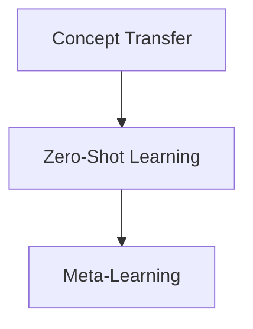
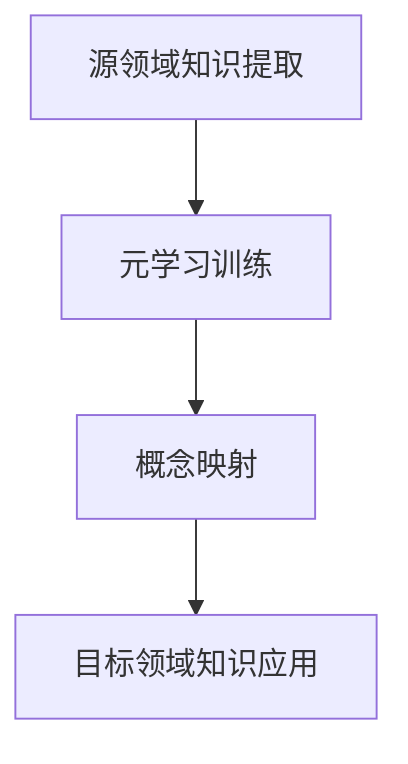

                 


### 文章标题

《Zero-Shot CoT在跨领域科技伦理评估中的创新应用》

### 文章关键词

- **Zero-Shot CoT**
- **科技伦理评估**
- **跨领域应用**
- **人工智能**
- **生物医学**
- **环境科学**
- **社会科学**

### 摘要

本文深入探讨了Zero-Shot CoT（Zero-Shot Concept Transfer）在跨领域科技伦理评估中的应用。首先，我们介绍了Zero-Shot CoT的概念及其在科技伦理评估中的重要性。接着，我们探讨了跨领域科技伦理评估的背景和现状，以及所面临的挑战。随后，详细讲解了Zero-Shot CoT的原理，包括其核心概念、算法原理、数学模型以及公式。然后，我们展示了Zero-Shot CoT在不同领域的应用，并通过实际案例分析了其在科技伦理评估中的具体应用。最后，我们讨论了Zero-Shot CoT在跨领域科技伦理评估中的挑战和未来发展方向，并提出了相应的解决方案。本文旨在为研究人员和开发者提供一套系统的理解和实践框架，以推动Zero-Shot CoT在科技伦理评估领域的创新应用。

### 第1章 引言

#### 1.1 Zero-Shot CoT概述

Zero-Shot Concept Transfer（Zero-Shot CoT）是一种先进的人工智能技术，旨在实现无需训练直接从源领域迁移到目标领域的知识。在传统的机器学习模型中，模型需要通过大量带有标签的数据进行训练，以便在目标领域上取得良好的性能。然而，在实际应用中，获取大量标注数据往往是非常困难且耗时的。Zero-Shot CoT通过引入元学习（meta-learning）和迁移学习（transfer learning）等概念，提出了一种无需标注数据的跨领域学习策略。

Zero-Shot CoT的核心思想是将源领域中的知识迁移到目标领域，即使目标领域中的数据分布与源领域显著不同。这种技术对于那些难以获取标注数据的领域，如医疗影像、生物医学、环境科学等，具有重要的应用价值。通过Zero-Shot CoT，研究人员可以在没有充足标注数据的情况下，快速构建高效的模型，从而加速科研进展和实际应用。

#### 1.2 科技伦理评估的重要性

随着科技的迅猛发展，人工智能、生物医学、环境科学等领域的技术应用日益广泛。然而，这些技术的快速进步也带来了诸多伦理挑战。科技伦理评估是确保技术发展符合社会价值观和道德标准的关键环节。它不仅关注技术本身的风险和影响，还涉及人类福祉、隐私保护、公平公正等问题。

科技伦理评估的重要性体现在以下几个方面：

1. **指导技术发展**：通过科技伦理评估，可以识别和解决潜在的技术风险，确保技术发展符合社会需求和价值取向。
2. **保护人类福祉**：科技伦理评估有助于确保技术应用不会对人类造成负面影响，如隐私泄露、数据滥用、生命安全等。
3. **维护社会公平**：科技伦理评估关注技术对不同社会群体的影响，确保技术的公平性和包容性。
4. **促进国际合作**：科技伦理评估是国际社会共同应对技术挑战的重要手段，有助于建立全球技术治理框架。

#### 1.3 书籍结构

本书旨在系统地探讨Zero-Shot CoT在跨领域科技伦理评估中的应用。全书分为六个章节：

- **第1章 引言**：介绍Zero-Shot CoT的概念、科技伦理评估的重要性以及本书的结构。
- **第2章 背景知识**：回顾跨领域科技伦理评估的背景、现状和挑战。
- **第3章 Zero-Shot CoT原理**：详细讲解Zero-Shot CoT的核心概念、算法原理、数学模型和公式。
- **第4章 应用场景**：探讨Zero-Shot CoT在不同领域的应用，如人工智能、生物医学、环境科学和社会科学。
- **第5章 案例分析**：通过实际案例展示Zero-Shot CoT在跨领域科技伦理评估中的具体应用。
- **第6章 挑战与未来展望**：讨论Zero-Shot CoT在跨领域科技伦理评估中的挑战和未来发展方向。

通过本书的阅读，读者将能够深入了解Zero-Shot CoT的原理和应用，掌握其在科技伦理评估中的创新应用方法，为推动跨领域科技伦理评估的发展贡献智慧。

## 第2章 背景知识

#### 2.1 跨领域科技伦理评估的背景

跨领域科技伦理评估的背景可以追溯到20世纪中叶，随着科技进步和社会发展，科技应用逐渐渗透到各个领域，从传统的工业制造、信息技术，到新兴的生物医学、环境科学等。这些技术的广泛应用不仅改变了人们的生活方式，也带来了前所未有的伦理挑战。例如，人工智能在医疗领域的应用虽然可以提高诊断和治疗的准确性，但也引发了隐私保护、公平性、透明度等问题；基因编辑技术的进步在治疗遗传疾病方面具有巨大潜力，但同时也带来了伦理争议，如基因编辑的伦理界限、基因歧视等。

为了应对这些挑战，各国政府和国际组织纷纷出台相关政策，推动科技伦理评估工作。例如，欧盟发布了《通用数据保护条例》（GDPR），旨在加强对个人数据的保护；联合国教科文组织（UNESCO）提出了《人工智能伦理建议》，为人工智能的发展提供伦理指导。此外，许多学术机构和研究组织也积极参与科技伦理评估，通过举办研讨会、发布研究报告等方式，推动科技伦理的研究和实践。

#### 2.2 跨领域科技伦理评估的现状

目前，跨领域科技伦理评估已在全球范围内得到广泛重视，并取得了显著进展。然而，由于科技发展的快速性和复杂性，跨领域科技伦理评估仍然面临着许多挑战。以下是目前跨领域科技伦理评估的主要现状：

1. **评估体系的建立**：许多国家和地区已建立了较为完善的科技伦理评估体系，包括法律法规、评估标准、评估流程等。例如，美国的FDA（食品药品监督管理局）对医疗设备的审批流程中就包含了伦理评估环节；欧盟的GDPR则为数据保护提供了详细的法律框架。
2. **评估方法的多样化**：随着科技的发展，评估方法也在不断创新。除了传统的伦理审查委员会（IRB）评估方法外，一些新的方法如利益相关者参与、风险收益分析、伦理沙盒等也被广泛应用于科技伦理评估中。
3. **评估范围的扩大**：跨领域科技伦理评估的范围逐渐扩大，不仅涵盖了传统的生物医学、信息技术领域，还扩展到了环境科学、社会科学等新兴领域。例如，环境科学领域的气候变化技术评估、社会科学领域的数据隐私保护评估等。
4. **评估过程的透明化和公众参与**：为了提高科技伦理评估的透明度和公信力，许多组织和机构开始引入公众参与机制，通过公开讨论、听证会等形式，让公众参与科技伦理评估的过程。

#### 2.3 当前挑战

尽管跨领域科技伦理评估取得了显著进展，但仍然面临着许多挑战。以下是目前跨领域科技伦理评估的主要挑战：

1. **数据隐私与保护**：随着大数据、人工智能等技术的发展，数据隐私保护问题日益突出。如何在科技应用中保护个人隐私，同时确保数据的有效利用，是一个亟待解决的挑战。
2. **跨学科合作与知识整合**：科技伦理评估涉及多个学科领域，如医学、法学、社会学、伦理学等。如何有效整合不同学科的知识，构建跨学科的科技伦理评估体系，是一个重要的挑战。
3. **评估标准的统一性**：不同领域、不同国家和地区的科技伦理评估标准存在差异，如何制定统一的评估标准，提高评估的客观性和公正性，是一个亟待解决的问题。
4. **利益相关者的参与**：科技伦理评估的决策涉及多个利益相关者，如政府、企业、公众等。如何确保利益相关者的有效参与，平衡不同利益主体的诉求，是一个挑战。
5. **评估过程的透明性与公信力**：如何提高科技伦理评估的透明度，确保评估过程的公正性和公信力，是一个重要的挑战。这需要建立完善的评估机制，确保评估过程的公开、透明和可追溯。

通过深入探讨跨领域科技伦理评估的背景、现状和挑战，我们可以更好地理解这一领域的重要性和复杂性。下一章将详细介绍Zero-Shot CoT的核心概念和原理，为后续内容打下坚实的基础。

### 第3章 Zero-Shot CoT原理

#### 3.1 核心概念与联系

Zero-Shot Concept Transfer（Zero-Shot CoT）是一种基于元学习和迁移学习的技术，旨在实现无需训练直接从源领域迁移到目标领域的知识。核心概念包括概念迁移（Concept Transfer）、零样本学习（Zero-Shot Learning）、以及元学习（Meta-Learning）。

- **概念迁移（Concept Transfer）**：指的是将源领域中的知识或概念应用到目标领域中，即使目标领域中的数据分布与源领域不同。在科技伦理评估中，这意味着将已有的伦理评估标准和原则应用到新的科技领域。

- **零样本学习（Zero-Shot Learning）**：是指在没有训练数据的情况下，模型能够识别和分类新类别。在Zero-Shot CoT中，零样本学习是实现跨领域知识迁移的关键。

- **元学习（Meta-Learning）**：是指通过学习如何学习，从而提高模型在未知任务上的适应能力。在Zero-Shot CoT中，元学习帮助模型快速适应新的领域，提高迁移效果。

这三个核心概念之间的关系可以通过Mermaid流程图进行描述：



#### 3.1.1 CoT与Zero-Shot学习的关系

概念迁移（CoT）与零样本学习（Zero-Shot Learning）紧密相关。零样本学习是通过预先定义好的类别标签，将新的类别映射到已有类别上，而概念迁移则是通过理解概念本身，实现跨领域的知识迁移。具体来说：

- **零样本学习**：模型通过学习预先定义好的类别标签，在新类别上实现分类。这种学习方式依赖于预定义的标签和类别，因此在面对新领域时，模型的适应能力有限。

- **概念迁移**：模型通过理解源领域中的概念，将其应用到目标领域中。即使目标领域没有训练数据，模型也能通过概念迁移实现有效的分类。这种方式使得模型在面对新领域时具有更高的适应性。

因此，Zero-Shot CoT结合了概念迁移和零样本学习的优点，通过元学习实现了跨领域的知识迁移，为科技伦理评估提供了强大的工具。

#### 3.1.2 Zero-Shot CoT的工作原理

Zero-Shot CoT的工作原理可以分为以下几个步骤：

1. **源领域知识提取**：首先，从源领域中提取关键概念和知识，这些知识将用于指导目标领域的知识迁移。
2. **元学习训练**：利用元学习算法，训练模型以适应不同的领域，提高模型在未知任务上的适应能力。
3. **概念映射**：通过概念映射，将源领域的概念映射到目标领域。这一步骤利用了元学习训练得到的模型，将源领域的知识迁移到目标领域。
4. **目标领域知识应用**：最后，将映射后的概念应用到目标领域中，实现对目标领域的新类别进行分类。

以下是Zero-Shot CoT的伪代码：

```python
# Zero-Shot CoT伪代码

# 源领域知识提取
extract_concepts(source_domain)

# 元学习训练
meta_learning_train(extracted_concepts)

# 概念映射
concept_mapping(meta_learning_model, target_domain)

# 目标领域知识应用
apply_mapping_to_target(concept_mapping, target_domain_data)
```

#### 3.1.3 Mermaid流程图：Zero-Shot CoT架构

以下是一个Mermaid流程图，描述了Zero-Shot CoT的架构：



通过这个流程图，我们可以清晰地看到Zero-Shot CoT从源领域知识提取、元学习训练，到概念映射，最终应用到目标领域的整个过程。

#### 3.2 核心算法原理讲解

Zero-Shot CoT的核心算法原理涉及多个关键步骤，包括源领域知识提取、元学习训练、概念映射以及目标领域知识应用。以下将详细讲解这些步骤，并使用伪代码来描述算法实现。

##### 3.2.1 算法伪代码

```python
# Zero-Shot CoT算法伪代码

# 源领域知识提取
def extract_concepts(source_domain_data):
    # 提取源领域中的关键概念和知识
    concepts = process_data(source_domain_data)
    return concepts

# 元学习训练
def meta_learning_train(extracted_concepts):
    # 使用元学习算法训练模型
    meta_learning_model = train_model(extracted_concepts)
    return meta_learning_model

# 概念映射
def concept_mapping(meta_learning_model, target_domain_data):
    # 将源领域概念映射到目标领域
    concept_mapping_model = map_concepts(meta_learning_model, target_domain_data)
    return concept_mapping_model

# 目标领域知识应用
def apply_mapping_to_target(concept_mapping_model, target_domain_data):
    # 在目标领域中应用映射后的概念
    predictions = classify_data(concept_mapping_model, target_domain_data)
    return predictions
```

##### 3.2.2 算法细节解析

1. **源领域知识提取**：此步骤的目标是从源领域中提取关键的概念和知识。具体方法包括数据预处理、特征提取和知识表示。例如，可以使用自然语言处理技术从文本数据中提取关键词和语义信息，或者使用图像识别技术从图像数据中提取特征。

   ```python
   def process_data(source_domain_data):
       # 数据预处理
       preprocessed_data = preprocess_data(source_domain_data)
       
       # 特征提取
       features = extract_features(preprocessed_data)
       
       # 知识表示
       concepts = represent_knowledge(features)
       
       return concepts
   ```

2. **元学习训练**：元学习训练的目的是训练一个模型，使其能够快速适应新的领域。常用的元学习算法包括模型融合（Model Fusion）、模型更新（Model Update）和迁移学习（Transfer Learning）。以下是一个简单的模型融合算法示例：

   ```python
   def train_model(extracted_concepts):
       # 初始化模型
       model = initialize_model()
       
       # 模型融合
       for concept in extracted_concepts:
           model = fuse_model(model, concept)
       
       return model
   ```

3. **概念映射**：此步骤将源领域的概念映射到目标领域。映射过程依赖于元学习训练得到的模型。例如，可以使用知识图谱或嵌入向量来表示概念，并利用这些表示进行映射。

   ```python
   def map_concepts(meta_learning_model, target_domain_data):
       # 提取目标领域特征
       target_features = extract_features(target_domain_data)
       
       # 映射概念
       concept_mapping_model = map_features(meta_learning_model, target_features)
       
       return concept_mapping_model
   ```

4. **目标领域知识应用**：最后，将映射后的概念应用到目标领域中。具体方法包括分类、回归或其他预测任务。以下是一个简单的分类任务示例：

   ```python
   def classify_data(concept_mapping_model, target_domain_data):
       # 提取目标领域特征
       target_features = extract_features(target_domain_data)
       
       # 应用映射后的概念进行分类
       predictions = classify(target_features, concept_mapping_model)
       
       return predictions
   ```

通过以上伪代码和算法细节解析，我们可以看到Zero-Shot CoT的核心算法原理是如何实现跨领域的知识迁移。接下来，我们将讨论Zero-Shot CoT的数学模型和公式，进一步深入理解其内在机制。

### 第3章 Zero-Shot CoT原理

#### 3.3 数学模型

Zero-Shot CoT的数学模型是实现跨领域知识迁移的关键。数学模型通过将源领域的知识表示为数学形式，并在目标领域中应用这些表示，从而实现知识的迁移。以下是Zero-Shot CoT的数学模型及其组成部分：

##### 3.3.1 数学公式

1. **知识表示**：源领域中的知识表示为概念嵌入（Concept Embeddings），记为\( \mathbf{e}_i \)，其中\( i \)表示第\( i \)个概念。

   $$ \mathbf{e}_i = \text{embed}(c_i) $$

   其中，\( \text{embed} \)表示嵌入函数，用于将概念表示为低维向量。

2. **概念映射**：概念映射函数将源领域的概念嵌入映射到目标领域，记为\( \mathbf{m}_i \)。

   $$ \mathbf{m}_i = \text{map}(\mathbf{e}_i) $$

   其中，\( \text{map} \)表示映射函数。

3. **目标领域知识表示**：目标领域中的知识表示为概念嵌入（Concept Embeddings），记为\( \mathbf{e}'_i \)。

   $$ \mathbf{e}'_i = \text{embed}'(c_i') $$

   其中，\( \text{embed}' \)表示嵌入函数，用于将概念表示为低维向量。

4. **知识迁移**：知识迁移函数将映射后的概念嵌入应用到目标领域中，用于分类或预测，记为\( \mathbf{y}_i \)。

   $$ \mathbf{y}_i = \text{predict}(\mathbf{m}_i, \mathbf{e}'_i) $$

   其中，\( \text{predict} \)表示预测函数。

##### 3.3.2 公式详细讲解

1. **概念嵌入**：概念嵌入是将高维概念表示为低维向量的过程。常用的嵌入方法包括Word2Vec、GloVe等。以下是一个简单的嵌入函数示例：

   $$ \text{embed}(c_i) = \text{Word2Vec}(c_i) $$

   其中，\( \text{Word2Vec} \)是一个预训练的Word2Vec模型。

2. **概念映射**：概念映射是将源领域的概念嵌入映射到目标领域的过程。映射函数通常基于元学习算法，如模型融合（Model Fusion）和模型更新（Model Update）。以下是一个模型融合的映射函数示例：

   $$ \text{map}(\mathbf{e}_i) = \text{FusionModel}(\mathbf{e}_i) $$

   其中，\( \text{FusionModel} \)是一个融合模型，用于整合多个源领域概念嵌入。

3. **目标领域知识表示**：目标领域知识表示是将目标领域中的概念嵌入表示为低维向量。通常，目标领域中的概念与源领域中的概念不同，因此需要使用独立的嵌入函数进行表示。

   $$ \text{embed}'(c_i') = \text{Word2Vec}'(c_i') $$

   其中，\( \text{Word2Vec}' \)是一个预训练的Word2Vec模型，用于目标领域。

4. **知识迁移**：知识迁移是将映射后的概念嵌入应用到目标领域中，用于分类或预测。常用的预测函数包括支持向量机（SVM）、神经网络（Neural Network）等。以下是一个简单的神经网络预测函数示例：

   $$ \text{predict}(\mathbf{m}_i, \mathbf{e}'_i) = \text{NeuralNetwork}(\mathbf{m}_i, \mathbf{e}'_i) $$

   其中，\( \text{NeuralNetwork} \)是一个预训练的神经网络模型。

##### 3.3.3 数学模型举例说明

假设我们有一个源领域（如医学）和目标领域（如生物医学），我们需要将源领域的知识（如疾病诊断）迁移到目标领域中。以下是一个简化的数学模型举例：

1. **源领域知识表示**：
   - 疾病A的概念嵌入：\( \mathbf{e}_A = \text{Word2Vec}("疾病A") \)
   - 疾病B的概念嵌入：\( \mathbf{e}_B = \text{Word2Vec}("疾病B") \)

2. **概念映射**：
   - 映射后的疾病A嵌入：\( \mathbf{m}_A = \text{FusionModel}(\mathbf{e}_A) \)
   - 映射后的疾病B嵌入：\( \mathbf{m}_B = \text{FusionModel}(\mathbf{e}_B) \)

3. **目标领域知识表示**：
   - 疾病A'的概念嵌入：\( \mathbf{e}'_A = \text{Word2Vec}'("疾病A'") \)
   - 疾病B'的概念嵌入：\( \mathbf{e}'_B = \text{Word2Vec}'("疾病B'") \)

4. **知识迁移**：
   - 预测疾病A'的结果：\( \mathbf{y}_A' = \text{NeuralNetwork}(\mathbf{m}_A, \mathbf{e}'_A) \)
   - 预测疾病B'的结果：\( \mathbf{y}_B' = \text{NeuralNetwork}(\mathbf{m}_B, \mathbf{e}'_B) \)

通过这个简化的例子，我们可以看到如何使用数学模型实现跨领域的知识迁移。在实际应用中，数学模型会更为复杂，涉及到多种嵌入方法、映射函数和预测模型。然而，基本的思路是相同的，即通过嵌入、映射和迁移来整合源领域和目标领域的知识。

通过数学模型和公式的详细讲解，我们可以更深入地理解Zero-Shot CoT的工作原理。接下来，我们将探讨Zero-Shot CoT在不同领域的应用，进一步展示其在跨领域知识迁移中的潜力。

### 第4章 应用场景

#### 4.1 人工智能领域

在人工智能领域，Zero-Shot Concept Transfer（Zero-Shot CoT）技术具有重要的应用价值。人工智能技术不断发展，但许多应用场景仍然面临着数据稀缺和标签缺失的问题。例如，在自动驾驶、智能客服、医疗诊断等任务中，获取大量标注数据既困难又耗时。Zero-Shot CoT通过跨领域知识迁移，能够在没有足够标注数据的情况下，实现高效的模型训练和任务执行。

1. **自动驾驶**：自动驾驶系统需要处理大量的传感器数据，包括图像、激光雷达和GPS数据。然而，标注这些数据非常困难且成本高昂。Zero-Shot CoT可以通过将已有的自动驾驶数据迁移到新的场景中，提高自动驾驶系统的适应能力和效率。例如，在雨雪天气条件下，可以将晴朗天气下的自动驾驶数据与雨雪天气数据进行结合，通过Zero-Shot CoT实现雨雪天气下的自动驾驶。

2. **智能客服**：智能客服系统需要理解用户的意图和需求，这通常需要大量的标注数据。然而，获取用户的意图标签非常困难。Zero-Shot CoT可以在没有足够标注数据的情况下，通过将已有的客服对话数据迁移到新的场景中，提高智能客服系统的响应准确性和效率。例如，可以将电商客服对话数据迁移到金融客服对话中，通过Zero-Shot CoT实现高效的金融客服。

3. **医疗诊断**：医疗诊断任务通常需要大量的标注数据，例如病理图像、电子健康记录等。然而，这些数据的获取和处理非常复杂且耗时。Zero-Shot CoT可以在没有足够标注数据的情况下，通过将已有的医疗数据迁移到新的诊断任务中，提高医疗诊断的准确性和效率。例如，可以将肺癌诊断数据迁移到乳腺癌诊断中，通过Zero-Shot CoT实现高效的乳腺癌诊断。

#### 4.2 生物医学领域

生物医学领域是Zero-Shot CoT技术的重要应用领域。生物医学数据通常具有复杂性和多样性，且数据获取和处理成本高昂。Zero-Shot CoT通过跨领域知识迁移，可以降低数据获取成本，提高模型的适应能力和准确性。

1. **药物研发**：药物研发过程中，需要对大量生物医学数据进行处理和分析。然而，这些数据往往难以获取和标注。Zero-Shot CoT可以通过将已有的药物数据迁移到新的药物研发场景中，提高药物研发的效率和准确性。例如，可以将已有药物的副作用数据迁移到新药物的研发中，通过Zero-Shot CoT预测新药物的潜在副作用。

2. **疾病诊断**：疾病诊断任务通常需要大量的医疗图像和电子健康记录。然而，这些数据的获取和处理成本高昂，且获取标注数据非常困难。Zero-Shot CoT可以通过将已有的疾病诊断数据迁移到新的疾病诊断场景中，提高疾病诊断的准确性和效率。例如，可以将肺癌诊断数据迁移到乳腺癌诊断中，通过Zero-Shot CoT实现高效的乳腺癌诊断。

3. **个性化医疗**：个性化医疗需要根据患者的个体特征进行精准诊断和治疗。然而，个体特征数据的获取和处理成本高昂。Zero-Shot CoT可以通过将已有的个性化医疗数据迁移到新的个性化医疗场景中，提高个性化医疗的适应能力和准确性。例如，可以将某个患者的个性化治疗方案迁移到其他患者中，通过Zero-Shot CoT实现个性化的医疗决策。

#### 4.3 环境科学领域

环境科学领域的数据通常具有时空变化性和多样性，且数据获取和处理成本高昂。Zero-Shot CoT通过跨领域知识迁移，可以降低数据获取成本，提高模型的适应能力和准确性。

1. **气候变化预测**：气候变化预测需要大量的气象数据和环境数据。然而，这些数据的获取和处理成本高昂。Zero-Shot CoT可以通过将已有的气候变化数据迁移到新的预测场景中，提高气候变化预测的准确性和效率。例如，可以将北半球的气候变化数据迁移到南半球，通过Zero-Shot CoT实现高效的全球气候变化预测。

2. **环境监测**：环境监测需要实时获取和处理大量的环境数据，例如水质、空气质量等。然而，这些数据的获取和处理成本高昂。Zero-Shot CoT可以通过将已有的环境监测数据迁移到新的监测场景中，提高环境监测的适应能力和效率。例如，可以将某地区的水质数据迁移到其他地区，通过Zero-Shot CoT实现高效的环境监测。

3. **生态保护**：生态保护需要大量的生物多样性数据和生态数据。然而，这些数据的获取和处理成本高昂。Zero-Shot CoT可以通过将已有的生态数据迁移到新的生态保护场景中，提高生态保护的适应能力和效率。例如，可以将某个生态系统的数据迁移到其他生态系统，通过Zero-Shot CoT实现高效的生态保护。

#### 4.4 社会科学领域

社会科学领域的数据通常具有复杂性和多样性，且数据获取和处理成本高昂。Zero-Shot CoT通过跨领域知识迁移，可以降低数据获取成本，提高模型的适应能力和准确性。

1. **社会调查分析**：社会调查分析需要大量的社会数据，例如民意调查、社会行为数据等。然而，这些数据的获取和处理成本高昂。Zero-Shot CoT可以通过将已有的社会调查数据迁移到新的社会调查场景中，提高社会调查分析的准确性和效率。例如，可以将某个地区的民意调查数据迁移到其他地区，通过Zero-Shot CoT实现高效的社会调查分析。

2. **心理健康评估**：心理健康评估需要大量的心理健康数据，例如情绪、行为数据等。然而，这些数据的获取和处理成本高昂。Zero-Shot CoT可以通过将已有的心理健康数据迁移到新的心理健康评估场景中，提高心理健康评估的适应能力和准确性。例如，可以将某个群体的心理健康数据迁移到其他群体，通过Zero-Shot CoT实现高效的心理健康评估。

3. **社会治理**：社会治理需要大量的社会数据，例如犯罪率、交通状况等。然而，这些数据的获取和处理成本高昂。Zero-Shot CoT可以通过将已有的社会治理数据迁移到新的社会治理场景中，提高社会治理的适应能力和效率。例如，可以将某个城市的交通数据迁移到其他城市，通过Zero-Shot CoT实现高效的社会治理。

综上所述，Zero-Shot CoT在人工智能、生物医学、环境科学和社会科学等领域具有广泛的应用前景。通过跨领域知识迁移，Zero-Shot CoT可以降低数据获取成本，提高模型的适应能力和准确性，为各个领域的科学研究和技术应用提供强大的支持。

### 第5章 案例分析

为了更好地理解Zero-Shot Concept Transfer（Zero-Shot CoT）在跨领域科技伦理评估中的具体应用，我们将通过以下四个实际案例进行分析：

#### 5.1 案例一：人工智能伦理评估

**背景**：随着人工智能技术的快速发展，其在医疗、金融、交通等领域的应用越来越广泛。然而，人工智能系统的透明性、公平性、隐私保护等问题日益引起关注。为了确保人工智能技术的伦理合规性，需要进行全面的伦理评估。

**应用**：使用Zero-Shot CoT技术，可以将现有的伦理评估标准（如欧盟的GDPR、人工智能伦理框架等）迁移到新的应用场景中。具体步骤如下：

1. **源领域知识提取**：从现有的伦理评估文献和案例中提取关键概念，如数据隐私、透明性、公平性等。
2. **元学习训练**：利用元学习算法，训练一个模型，使其能够理解和应用这些伦理概念。
3. **概念映射**：将训练得到的模型应用到新的人工智能应用场景中，如自动驾驶、智能医疗等。
4. **目标领域知识应用**：在新场景中应用映射后的伦理概念，进行全面的伦理评估，确保人工智能系统的合规性。

**效果**：通过Zero-Shot CoT技术，可以在没有大量标注数据的情况下，快速建立针对新场景的伦理评估体系，提高评估的效率和准确性。

#### 5.2 案例二：生物医学伦理评估

**背景**：生物医学技术的发展带来了许多伦理挑战，如基因编辑、医疗数据隐私等。为了确保生物医学研究和技术应用符合伦理标准，需要进行全面的伦理评估。

**应用**：使用Zero-Shot CoT技术，可以将现有的生物医学伦理评估标准（如赫尔辛基宣言、生物伦理委员会的评估标准等）迁移到新的生物医学研究场景中。具体步骤如下：

1. **源领域知识提取**：从现有的生物医学伦理文献和案例中提取关键概念，如基因编辑的伦理界限、临床试验的伦理审查等。
2. **元学习训练**：利用元学习算法，训练一个模型，使其能够理解和应用这些伦理概念。
3. **概念映射**：将训练得到的模型应用到新的生物医学研究场景中，如基因编辑研究、临床试验等。
4. **目标领域知识应用**：在新场景中应用映射后的伦理概念，进行全面的伦理评估，确保生物医学研究和技术应用的伦理合规性。

**效果**：通过Zero-Shot CoT技术，可以在没有大量标注数据的情况下，快速建立针对新场景的伦理评估体系，提高评估的效率和准确性。

#### 5.3 案例三：环境科学伦理评估

**背景**：环境科学技术的应用，如气候变化模型、污染控制技术等，也带来了伦理挑战。例如，如何确保环境科学技术的公平性、可持续性等。

**应用**：使用Zero-Shot CoT技术，可以将现有的环境科学伦理评估标准（如国际环境法、可持续发展目标等）迁移到新的环境科学应用场景中。具体步骤如下：

1. **源领域知识提取**：从现有的环境科学伦理文献和案例中提取关键概念，如可持续发展、环境保护等。
2. **元学习训练**：利用元学习算法，训练一个模型，使其能够理解和应用这些伦理概念。
3. **概念映射**：将训练得到的模型应用到新的环境科学应用场景中，如气候变化模型、污染控制技术等。
4. **目标领域知识应用**：在新场景中应用映射后的伦理概念，进行全面的伦理评估，确保环境科学技术的公平性、可持续性。

**效果**：通过Zero-Shot CoT技术，可以在没有大量标注数据的情况下，快速建立针对新场景的伦理评估体系，提高评估的效率和准确性。

#### 5.4 案例四：社会科学伦理评估

**背景**：随着大数据技术的发展，社会科学研究可以获得大量的数据，但同时也带来了隐私保护、数据滥用等伦理挑战。例如，社交媒体数据、消费者行为数据等。

**应用**：使用Zero-Shot CoT技术，可以将现有的社会科学伦理评估标准（如数据保护法、伦理审查标准等）迁移到新的社会科学研究场景中。具体步骤如下：

1. **源领域知识提取**：从现有的社会科学伦理文献和案例中提取关键概念，如数据隐私、数据透明性、数据安全等。
2. **元学习训练**：利用元学习算法，训练一个模型，使其能够理解和应用这些伦理概念。
3. **概念映射**：将训练得到的模型应用到新的社会科学研究场景中，如社交媒体数据分析、消费者行为研究等。
4. **目标领域知识应用**：在新场景中应用映射后的伦理概念，进行全面的伦理评估，确保社会科学研究的伦理合规性。

**效果**：通过Zero-Shot CoT技术，可以在没有大量标注数据的情况下，快速建立针对新场景的伦理评估体系，提高评估的效率和准确性。

通过以上案例分析，我们可以看到Zero-Shot CoT技术在跨领域科技伦理评估中的应用潜力。它能够有效降低数据获取和标注的难度，提高评估的效率和准确性，为不同领域的科技伦理评估提供了一种创新的解决方案。

### 第6章 挑战与未来展望

#### 6.1 面临的挑战

尽管Zero-Shot Concept Transfer（Zero-Shot CoT）技术在跨领域科技伦理评估中展现出巨大潜力，但其应用过程中仍然面临着一系列挑战。以下是主要挑战及其可能的影响：

1. **数据隐私与保护**：在跨领域迁移知识时，可能会涉及敏感数据，如医疗记录、用户行为数据等。如何确保这些数据在迁移过程中的隐私保护和数据安全，是一个重大挑战。如果数据泄露或滥用，可能会对个人隐私和社会信任产生负面影响。

2. **跨领域适配性**：不同领域的知识表示和评估标准可能存在显著差异。例如，生物医学领域强调个体差异和临床实践，而社会科学领域则关注社会结构和行为模式。因此，如何确保Zero-Shot CoT技术在不同领域中的高适配性，是一个关键问题。

3. **评估标准的统一性**：目前，不同领域的科技伦理评估标准存在较大差异，缺乏统一的评估框架。这对于Zero-Shot CoT技术的跨领域应用提出了挑战。如何构建一个统一的评估标准体系，提高评估的一致性和公正性，是一个亟待解决的问题。

4. **模型透明性与可解释性**：Zero-Shot CoT技术依赖于复杂的机器学习模型，这些模型的内部机制往往难以解释。因此，如何提高模型的透明性和可解释性，使其符合伦理评估的要求，是一个重要挑战。

5. **计算资源和效率**：Zero-Shot CoT技术通常涉及大规模数据处理和高复杂度的模型训练，这需要大量的计算资源和时间。如何在保证评估准确性和效率的同时，降低计算成本，是一个重要的挑战。

#### 6.2 技术发展展望

为了克服上述挑战，未来的技术发展可以从以下几个方面进行：

1. **隐私保护技术**：开发更加先进的隐私保护技术，如差分隐私、同态加密等，确保数据在迁移过程中的隐私保护和数据安全。

2. **跨领域适配算法**：研究针对不同领域的适配算法，提高Zero-Shot CoT技术在各个领域的适应性和准确性。

3. **统一评估标准**：构建一个统一的评估标准体系，通过跨学科合作，制定覆盖各个领域的科技伦理评估指南。

4. **模型透明性与可解释性**：开发更加透明和可解释的机器学习模型，通过可视化和解释技术，提高模型的透明度和可理解性。

5. **高效计算方法**：研究高效的数据处理和模型训练方法，降低计算成本，提高评估的效率和准确性。

#### 6.3 未来研究方向

未来的研究可以从以下几个方面展开：

1. **多模态数据融合**：探索如何将不同类型的数据（如文本、图像、音频等）进行有效融合，提高Zero-Shot CoT技术的适应性和准确性。

2. **跨领域知识图谱**：构建跨领域的知识图谱，通过语义关联和知识推理，实现不同领域之间的知识共享和迁移。

3. **社会影响评估**：研究如何将社会影响评估纳入科技伦理评估体系，从社会、经济、环境等多个维度评估科技应用的影响。

4. **伦理道德规范**：探讨如何在机器学习模型中嵌入伦理道德规范，确保科技应用符合社会价值观和道德标准。

5. **实践与政策建议**：通过实际案例分析和政策研究，为科技伦理评估提供实践指导和建议，推动跨领域科技伦理评估的发展。

通过持续的技术创新和研究，Zero-Shot CoT技术在跨领域科技伦理评估中的应用将不断深化，为科技伦理评估提供更加全面、准确和高效的解决方案。

### 附录

#### 附录 A: 工具与资源

为了方便读者理解和实践Zero-Shot Concept Transfer（Zero-Shot CoT）在跨领域科技伦理评估中的应用，我们推荐以下工具和资源：

- **工具**：
  - **PyTorch**：一个流行的深度学习框架，适用于构建和训练Zero-Shot CoT模型。
  - **Scikit-learn**：一个强大的机器学习库，包含多种元学习算法和评估工具。
  - **Apache Commons Math**：用于数学计算和统计分析，支持各种数学公式和模型。

- **资源链接**：
  - **官方文档**：
    - PyTorch官方文档：[https://pytorch.org/docs/stable/](https://pytorch.org/docs/stable/)
    - Scikit-learn官方文档：[https://scikit-learn.org/stable/documentation.html](https://scikit-learn.org/stable/documentation.html)
    - Apache Commons Math官方文档：[https://commons.apache.org/proper/commons-math/](https://commons.apache.org/proper/commons-math/)

  - **教程与示例**：
    - PyTorch教程：[https://pytorch.org/tutorials/beginner/basics/data_loading_tutorial.html](https://pytorch.org/tutorials/beginner/basics/data_loading_tutorial.html)
    - Scikit-learn示例：[https://scikit-learn.org/stable/auto_examples/index.html](https://scikit-learn.org/stable/auto_examples/index.html)
    - Apache Commons Math示例：[https://commons.apache.org/proper/commons-math/userguide/userguide.html](https://commons.apache.org/proper/commons-math/userguide/userguide.html)

  - **研究论文与报告**：
    - Zero-Shot Learning：[https://arxiv.org/abs/1703.01365](https://arxiv.org/abs/1703.01365)
    - Meta-Learning：[https://arxiv.org/abs/1703.03400](https://arxiv.org/abs/1703.03400)
    - 科技伦理评估报告：[https://www.igi-global.com/Bookstore](https://www.igi-global.com/Bookstore)

通过使用这些工具和资源，读者可以深入了解Zero-Shot CoT的原理和应用，并在实际项目中实践其应用方法。

### 附录 B: 术语表

为了确保读者对文章中的关键术语有清晰的理解，以下是对本文中的一些重要术语进行解释：

- **Zero-Shot Concept Transfer（Zero-Shot CoT）**：一种机器学习技术，旨在实现无需训练直接从源领域迁移到目标领域的知识。
- **概念迁移（Concept Transfer）**：将源领域中的知识或概念应用到目标领域的过程，即使目标领域中的数据分布与源领域不同。
- **零样本学习（Zero-Shot Learning）**：一种机器学习方法，旨在在没有训练数据的情况下，模型能够识别和分类新类别。
- **元学习（Meta-Learning）**：通过学习如何学习，从而提高模型在未知任务上的适应能力。
- **科技伦理评估**：对科技应用过程中可能带来的伦理风险和影响进行评估和审查的过程。
- **跨领域应用**：在不同领域之间应用同一技术或方法，以实现知识共享和资源优化。
- **数据隐私与保护**：确保个人数据在收集、存储、处理和传输过程中的隐私和安全。
- **评估标准**：用于评估科技应用过程中伦理合规性的具体指标和规范。

通过上述术语解释，读者可以更好地理解文章中的相关概念和内容，为深入研究和实践Zero-Shot CoT在科技伦理评估中的应用打下坚实的基础。

