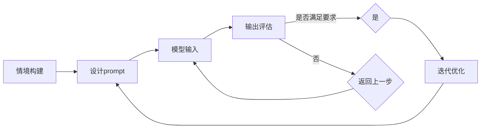

                 

### 引言

#### 1.1 书籍背景和目标

随着人工智能技术的迅猛发展，语言模型（Language Model，简称LM）已成为自然语言处理（Natural Language Processing，简称NLP）领域的重要工具。特别是近年来，大型语言模型（Large Language Model，简称LLM）如BERT、GPT等在多项NLP任务中取得了显著的性能提升。然而，尽管LLM在学术研究和基准测试中表现优异，它们在实际应用中仍然面临诸多挑战。这些挑战主要体现在LLM对特定现实情境的适应能力不足上。

为了解决这一问题，prompt情境模拟（Prompt Augmented Inference，简称PAI）成为了一种重要手段。prompt情境模拟通过为LLM提供上下文信息，使其更好地理解和适应不同的现实情境。这种方法不仅提高了LLM的响应准确性，还增强了其在实际应用中的表现。

本书旨在深入探讨如何使用prompt情境模拟来增强LLM在现实世界中的应用性能。通过系统性地介绍prompt的概念、LLM的工作原理、prompt情境模拟的架构以及实际应用案例，本书将为读者提供一套完整的解决方案，以应对LLM在现实应用中的挑战。

本书的目标受众包括对人工智能和自然语言处理感兴趣的程序员、数据科学家、AI研究者以及任何希望了解和利用prompt情境模拟技术的人员。无论你是新手还是专家，本书都将帮助你更好地理解这一前沿技术，并学会如何在实际项目中应用它。

通过阅读本书，读者将：

1. 理解prompt的概念及其在LLM中的应用。
2. 掌握设计有效prompt的原则和策略。
3. 学会优化LLM以适应现实情境。
4. 了解实际应用中prompt情境模拟的方法和技巧。
5. 获得一套实用的工具和资源，以便在实际项目中应用这些技术。

#### 1.2 语言模型在现实应用中的挑战

尽管语言模型在学术研究和基准测试中取得了巨大成功，但在实际应用中，它们仍然面临许多挑战。以下是语言模型在现实应用中常见的一些问题：

1. **适应性差**：LLM通常是在特定数据集上训练的，对于新的、未见过的情况，其表现往往不佳。这导致了LLM在处理实际问题时，容易出现错误或不准确的响应。

2. **泛化能力不足**：LLM的泛化能力在很大程度上依赖于训练数据的多样性和覆盖范围。然而，现实世界中的情境是复杂多样的，单一的训练数据很难涵盖所有可能的情境。

3. **解释性差**：LLM通常被视为“黑盒子”，其内部决策过程难以解释。这在某些应用领域，如金融、医疗和司法等，可能是一个严重的问题，因为这些领域需要高度透明和可解释的决策过程。

4. **计算成本高**：大型LLM的计算成本很高，特别是在实时应用中，可能会对系统性能产生显著影响。这限制了LLM在某些资源受限场景中的应用。

5. **数据隐私和安全问题**：在现实应用中，处理敏感数据（如个人身份信息、医疗记录等）时，数据隐私和安全问题尤为重要。LLM在处理这些数据时，可能面临数据泄露和滥用的风险。

为了解决这些挑战，prompt情境模拟提供了一种有效的手段。通过为LLM提供上下文信息，prompt情境模拟可以帮助LLM更好地理解和适应不同的现实情境，从而提高其响应的准确性和适应性。

#### 1.3 prompt情境模拟的重要性

prompt情境模拟在增强LLM现实适应性方面发挥着至关重要的作用。首先，prompt可以为LLM提供上下文信息，帮助其更好地理解和处理特定情境。例如，在回答一个关于法律问题的查询时，通过提供相关的法律条款和案例，prompt可以帮助LLM生成更准确、更符合法律规定的答案。

其次，prompt情境模拟可以提高LLM的泛化能力。通过在训练过程中引入多样化的prompt，LLM可以学习到如何在不同的情境中做出正确的决策。这种方法不仅有助于LLM在训练数据之外的表现，还能提高其在实际应用中的适应性。

此外，prompt情境模拟还可以增强LLM的解释性。通过设计清晰的prompt，LLM的决策过程变得更容易理解和解释。这对于需要高度透明和可解释的决策过程的领域，如金融、医疗和司法等，尤为重要。

最后，prompt情境模拟还可以帮助降低LLM的计算成本。通过为LLM提供预处理的上下文信息，可以在一定程度上减少其推理过程中的计算负担，从而提高系统性能。

总之，prompt情境模拟为解决LLM在现实应用中的挑战提供了一种有效的手段。通过引入上下文信息，提高泛化能力和解释性，并降低计算成本，prompt情境模拟不仅提升了LLM的性能，还为其实际应用提供了更广阔的前景。

### prompt的概念与类型

prompt在自然语言处理（NLP）中扮演着至关重要的角色，尤其是在大型语言模型（LLM）的应用中。prompt可以被视为一种引导，它帮助模型理解上下文信息，从而生成更相关、更准确的响应。本节将详细探讨prompt的概念、类型及其作用机制。

#### 2.1.1 prompt的定义

prompt是指提供给模型的一段文本或数据，用于引导模型生成相应的输出。在NLP任务中，prompt通常是一个问题的描述或者一个情境的说明。通过提供prompt，我们可以帮助模型更好地理解和处理特定的问题或情境。

prompt的基本结构通常包括以下几个部分：

1. **输入文本**：这是提供给模型的原始文本，用于描述问题或情境。
2. **上下文信息**：这是围绕输入文本提供的额外信息，用于增强模型的理解能力。
3. **输出格式**：这是模型生成的输出所需遵循的格式，例如问答形式、摘要形式等。

例如，在一个问答系统中，prompt可能是一个问题，如“什么是人工智能？”然后，上下文信息可以是“人工智能是计算机科学的一个分支，它致力于创建能够模拟、扩展和执行人类智能任务的机器。”输出格式则是模型对这个问题的回答。

#### 2.1.2 prompt的类型

prompt可以根据其内容和形式进行分类。以下是几种常见的prompt类型：

1. **问题型prompt**：这种类型的prompt直接提出一个问题，要求模型生成相应的答案。例如，“什么是量子计算？”这种类型的prompt适用于问答系统和信息检索任务。

2. **情境型prompt**：这种类型的prompt提供一段情境描述，要求模型生成与情境相关的文本。例如，“假设你是一位医生，需要向患者解释什么是量子纠缠。”这种类型的prompt适用于对话系统和情景模拟任务。

3. **指令型prompt**：这种类型的prompt包含具体的指令或任务说明，要求模型执行特定的操作。例如，“请生成一篇关于人工智能发展趋势的英文摘要。”这种类型的prompt适用于文本生成和摘要任务。

4. **复合型prompt**：这种类型的prompt结合了多种类型的prompt，提供更复杂的任务说明。例如，“请根据以下情境描述生成一篇英文新闻文章：NASA宣布在火星上发现液态水。”这种类型的prompt适用于多模态任务和复杂文本生成任务。

#### 2.1.3 prompt的作用机制

prompt在LLM中的作用机制主要包括以下几个方面：

1. **上下文增强**：prompt为LLM提供了额外的上下文信息，帮助模型更好地理解输入文本。通过提供上下文，模型可以更容易地识别关键信息，从而生成更准确、更相关的输出。

2. **引导生成**：prompt可以帮助模型生成特定类型的文本。例如，通过使用问题型prompt，我们可以引导模型生成问题答案；通过使用情境型prompt，我们可以引导模型生成与情境相关的描述。

3. **任务定义**：prompt明确地定义了模型需要执行的任务类型和目标。这对于模型生成高质量的输出至关重要，因为模型可以根据任务要求调整其生成策略。

4. **控制生成**：通过精心设计的prompt，我们可以控制模型的生成过程。例如，通过调整prompt中的关键词或上下文信息，我们可以影响模型生成文本的风格、长度和主题。

总的来说，prompt是增强LLM性能的重要工具。通过为模型提供上下文信息和任务指导，prompt可以帮助模型更好地理解和处理复杂的问题和情境，从而提升其在实际应用中的表现。

### 大型语言模型（LLM）概述

大型语言模型（LLM）是近年来自然语言处理（NLP）领域的重要突破，它们在多项NLP任务中取得了显著性能提升。本节将详细探讨LLM的基本原理、结构组成以及当前的发展趋势。

#### 3.1.1 LLM的基本原理

LLM是一种基于深度学习的语言模型，其核心思想是通过学习大量文本数据来预测句子中的下一个词或字符。LLM通过模拟人类语言生成和理解的机制，利用神经网络模型对文本进行建模，从而实现对自然语言的深入理解和生成能力。

LLM的基本原理可以概括为以下几个步骤：

1. **数据预处理**：首先，从互联网或数据库中收集大量文本数据，并对这些数据进行清洗和预处理，如去除停用词、标点符号和噪声。

2. **词向量表示**：将文本数据中的每个词映射为高维向量表示。常用的词向量模型包括Word2Vec、GloVe和BERT等。这些模型通过学习词与词之间的语义关系，将词汇表示为连续的向量空间。

3. **模型架构**：构建深度神经网络模型，用于对词向量进行建模。早期的LLM模型主要采用循环神经网络（RNN）和长短期记忆网络（LSTM），而近年来，Transformer模型及其变体（如BERT、GPT等）逐渐成为主流。

4. **训练过程**：使用预处理的文本数据对神经网络模型进行训练，通过反向传播算法不断调整模型参数，以最小化预测误差。

5. **生成过程**：在训练完成后，使用训练好的模型对新的输入文本进行生成。模型通过逐个预测下一个词或字符，逐步生成完整的句子或段落。

#### 3.1.2 LLM的结构和组成

LLM的结构和组成可以分为以下几个主要部分：

1. **输入层**：输入层负责接收文本数据，并将其转换为词向量表示。输入层通常包含一个词嵌入层，用于将文本中的每个词映射为高维向量。

2. **隐藏层**：隐藏层是LLM的核心部分，包含多个神经网络层。这些层通过学习词向量之间的关系，实现对文本数据的建模。在早期的RNN和LSTM模型中，隐藏层通常包含多个时间步，用于处理序列数据。而在Transformer模型中，隐藏层通常采用多头自注意力机制，以捕捉词与词之间的长距离依赖关系。

3. **输出层**：输出层负责生成预测的词或字符。在生成过程中，模型通过逐个预测下一个词或字符，直到生成完整的句子或段落。输出层通常包含一个softmax层，用于计算每个词或字符的预测概率。

4. **注意力机制**：注意力机制是LLM中的重要组成部分，用于捕捉文本中的关键信息。在Transformer模型中，自注意力机制和多头注意力机制被广泛应用于隐藏层，以增强模型对输入文本的理解能力。

5. **正则化和优化**：LLM的训练过程中，通常使用各种正则化和优化技术，如dropout、权重共享和梯度裁剪等，以提高模型的泛化能力和训练稳定性。

#### 3.1.3 LLM的现状与发展趋势

LLM的现状呈现出以下几个显著特点：

1. **性能提升**：随着深度学习技术的发展，LLM在多项NLP任务中取得了显著的性能提升。例如，BERT、GPT等模型在文本分类、问答、机器翻译和文本生成等任务中均取得了领先的表现。

2. **模型规模扩大**：LLM的模型规模也在不断增大。例如，GPT-3拥有超过1750亿个参数，成为目前最大的语言模型之一。大型模型在处理复杂任务和生成高质量文本方面具有显著优势。

3. **多模态应用**：LLM逐渐扩展到多模态应用领域，如图像文本生成、语音识别和视频分析等。通过结合不同类型的数据，LLM可以更好地理解和生成丰富的内容。

4. **现实应用扩展**：LLM在现实应用中的场景也在不断扩展。从简单的问答系统、聊天机器人到复杂的决策支持系统、内容生成和智能助理，LLM在多个领域展现出了广泛的应用前景。

LLM的未来发展趋势主要包括以下几个方面：

1. **模型优化**：随着计算资源和算法技术的不断进步，LLM将继续向更大规模、更高性能的方向发展。同时，模型优化方法（如自适应学习率、混合精度训练等）也将进一步提高模型的训练效率和性能。

2. **跨模态学习**：多模态学习将成为LLM的重要研究方向。通过结合不同类型的数据，LLM可以更好地理解和生成复杂的内容，从而扩展其在各个领域的应用。

3. **隐私保护和安全**：随着LLM在处理敏感数据方面的应用日益增多，隐私保护和安全将成为关键问题。研究如何在保证模型性能的同时保护用户隐私和安全，将是未来的重要方向。

4. **人机协作**：人机协作将成为LLM未来发展的一个重要趋势。通过将LLM与人类专家结合，可以充分发挥模型的计算能力，同时保持决策过程的透明和可解释性。

总之，LLM作为NLP领域的重要工具，其在性能提升、模型规模、多模态应用和现实应用扩展等方面取得了显著进展。未来，随着技术的不断进步，LLM将继续在人工智能领域发挥重要作用，为人类带来更多的便利和创新。

### prompt情境模拟的架构

prompt情境模拟（Prompt Augmented Inference，简称PAI）是增强大型语言模型（LLM）现实适应性的关键技术。本节将详细探讨情境模拟的基本概念、过程以及通过Mermaid流程图展示的架构。

#### 3.3.1 情境模拟的基本概念

情境模拟是一种通过提供上下文信息来引导LLM生成更相关、更准确的响应的方法。在情境模拟中，情境（context）是指模型在生成输出时所需的上下文信息，而prompt则是用于提供这些信息的文本。情境模拟的基本思想是，通过为LLM提供丰富的上下文信息，帮助其更好地理解和处理复杂的问题和任务。

情境模拟的关键组件包括：

1. **情境**：情境是模型在生成输出时所需的背景信息，它可以为模型提供有关问题或任务的详细描述。情境通常包括问题的背景、相关事实、目标要求等。

2. **prompt**：prompt是用于提供情境的文本，它可以是具体的问题描述、任务指令或者情境说明。prompt的设计和选择对于情境模拟的成功至关重要。

3. **输出**：输出是模型根据情境和prompt生成的响应。通过情境模拟，模型可以生成更准确、更有针对性的输出，从而提高其在实际应用中的性能。

#### 3.3.2 情境模拟的过程

情境模拟的过程可以分为以下几个步骤：

1. **情境构建**：首先，根据具体任务的需求，构建一个详细的情境。情境应该包含所有与任务相关的背景信息、事实和要求，以便模型能够充分理解任务。

2. **prompt设计**：接下来，设计一个有效的prompt。prompt应该简洁明了，能够准确传达情境信息，引导模型生成相应的输出。

3. **模型输入**：将构建好的情境和设计的prompt输入到LLM中。模型将根据输入信息进行推理和生成，输出一个初步的响应。

4. **输出评估**：对生成的输出进行评估，检查其是否符合任务要求和情境描述。如果不满足要求，可以返回上一步，对情境或prompt进行优化，然后重新进行输入和生成。

5. **迭代优化**：通过反复迭代，不断优化情境和prompt，逐步提高模型的输出质量和适应性。

#### 3.3.3 Mermaid流程图：情境模拟架构展示

为了更好地理解情境模拟的架构，我们可以使用Mermaid流程图来展示其基本流程。以下是一个简单的Mermaid流程图示例，描述了情境模拟的基本步骤：



在这个流程图中，每个步骤都表示情境模拟中的一个关键环节。通过这个流程图，我们可以清晰地看到情境模拟的执行过程，以及各个步骤之间的逻辑关系。

总的来说，prompt情境模拟通过提供丰富的上下文信息和有效的prompt，帮助LLM更好地理解和处理复杂的问题和任务。通过Mermaid流程图的展示，我们可以更直观地理解情境模拟的架构和过程，为进一步优化和应用这一技术提供了有益的参考。

### 设计有效的prompt

在设计有效的prompt时，我们需要遵循一系列原则和策略，以确保prompt能够准确传达情境信息，并引导LLM生成高质量的输出。以下是设计有效prompt的一些关键原则和策略：

#### 3.4.1 prompt设计的原则

1. **简洁性**：prompt应尽量简洁明了，避免冗余信息。简洁的prompt有助于模型更快地理解和处理，从而提高生成输出的准确性和效率。

2. **相关性**：prompt应与任务目标紧密相关，准确传达情境信息。相关的prompt可以帮助模型更好地定位关键信息，减少误判和错误。

3. **清晰性**：prompt应具有清晰的语义结构，便于模型理解和生成。清晰的prompt有助于模型明确任务要求和输出格式，从而提高生成输出的可解释性。

4. **多样性**：prompt应具有多样性，涵盖不同类型的问题和情境。多样化的prompt有助于模型学习到更广泛的知识和技能，从而提高其在实际应用中的泛化能力。

5. **可控性**：prompt应具备一定的控制力，能够引导模型生成特定的输出。通过合理设计和调整prompt，我们可以控制模型生成文本的风格、长度和主题。

#### 3.4.2 prompt优化的策略

1. **上下文调整**：根据任务需求，对prompt中的上下文信息进行调整。通过增加或删除上下文信息，我们可以优化prompt的准确性和适应性。

2. **关键词强化**：在prompt中突出关键信息，使用关键词来强调任务要求和目标。关键词的强化有助于模型更好地识别和理解关键信息，从而提高生成输出的质量。

3. **格式规范**：规范prompt的格式，使其符合模型预期。例如，在问答系统中，可以将问题、答案和上下文信息分别用不同的标记或格式表示，以提高模型解析和生成输出的效率。

4. **数据增强**：通过引入多样化的数据集和情境，增强prompt的多样性。数据增强有助于模型学习到更广泛的知识和技能，从而提高其在实际应用中的适应性。

5. **反馈机制**：建立有效的反馈机制，对模型生成的输出进行评估和优化。通过用户反馈和自动化评估方法，我们可以不断调整prompt，提高其效果和准确性。

#### 3.4.3 伪代码：prompt设计示例

下面是一个简单的伪代码示例，用于说明如何设计有效的prompt。在这个示例中，我们假设模型是一个问答系统，需要根据问题和情境生成答案。

```python
# 伪代码：设计有效的prompt

# 输入：问题（question），情境（context）
# 输出：答案（answer）

# 步骤1：构建情境
context = build_context(context_info)

# 步骤2：设计prompt
prompt = design_prompt(question, context)

# 步骤3：生成答案
answer = model.generate_output(prompt)

# 步骤4：评估答案
if is_valid_answer(answer):
    print("答案生成成功：", answer)
else:
    print("答案生成失败，返回上一步优化prompt")

# 函数：构建情境
def build_context(context_info):
    # 根据具体任务需求，构建详细的情境信息
    # ...
    return context_info

# 函数：设计prompt
def design_prompt(question, context):
    # 根据简洁性、相关性、清晰性、多样性和可控性原则，设计prompt
    # ...
    return prompt

# 函数：评估答案
def is_valid_answer(answer):
    # 根据任务要求和情境，评估答案是否有效
    # ...
    return True
```

通过这个简单的伪代码示例，我们可以看到设计有效prompt的基本流程和关键步骤。在实际应用中，我们可以根据具体任务需求和模型特点，进一步优化和调整prompt设计策略。

总之，设计有效的prompt是提升LLM性能的重要手段。通过遵循简洁性、相关性、清晰性、多样性和可控性等原则，并采用上下文调整、关键词强化、格式规范、数据增强和反馈机制等策略，我们可以设计出高质量的prompt，从而增强LLM在现实应用中的表现。

### 优化LLM以适应现实情境

为了使大型语言模型（LLM）更好地适应现实情境，我们需要采取一系列优化方法。这些方法包括对LLM的内部结构和训练过程进行调整，以增强其泛化能力、适应性和可解释性。以下是几种常用的LLM优化方法：

#### 3.5.1 LLM的优化方法

1. **数据增强**：数据增强是一种通过扩展训练数据集来提高模型性能的方法。具体方法包括数据清洗、数据变换和数据合成等。例如，我们可以通过旋转、缩放、翻转和剪裁等方式对图像数据进行变换，以增加数据的多样性。同样，对于文本数据，我们可以通过替换词、添加背景信息和生成虚构情境等方式进行数据增强。

2. **迁移学习**：迁移学习是一种利用预训练模型在特定任务上进一步优化的方法。通过在特定任务上微调预训练模型，我们可以使其更好地适应新的任务需求。例如，在一个问答系统中，我们可以使用在通用数据集上预训练的LLM，然后在特定领域的任务上进行微调，以获得更好的性能。

3. **对抗训练**：对抗训练是一种通过引入对抗样本来提高模型泛化能力的方法。对抗样本是对原始样本进行细微扰动，以使模型难以分类。通过训练对抗样本，模型可以学会识别和抵御恶意攻击，从而提高其在实际应用中的鲁棒性。

4. **注意力机制优化**：注意力机制是LLM中的一个关键组件，用于捕捉文本中的关键信息。优化注意力机制可以提高模型对重要信息的关注，从而提高生成输出的质量和准确性。例如，我们可以通过调整注意力权重、引入多级注意力机制和融合不同类型的注意力等方式来优化注意力机制。

5. **优化训练策略**：优化训练策略可以提高模型的训练效率和性能。例如，使用自适应学习率、动量项和权重共享等方法可以加速模型收敛，减少过拟合。此外，通过使用批量归一化（Batch Normalization）和Dropout等方法，我们可以提高模型的稳定性和泛化能力。

#### 3.5.2 实时反馈机制

实时反馈机制是一种在LLM生成输出后，立即对其进行评估和优化的方法。这种方法可以帮助我们快速识别和纠正模型的错误，从而提高其在实际应用中的表现。以下是几种常见的实时反馈机制：

1. **自动化评估**：通过自动化评估工具对模型生成输出进行实时评估，如F1分数、准确率和召回率等。自动化评估可以帮助我们快速检测和纠正模型的错误，从而提高其性能。

2. **用户反馈**：通过收集用户对模型输出的反馈，我们可以了解模型在实际应用中的表现。用户反馈可以用于调整prompt、优化模型参数和改进生成算法，从而提高模型的质量和用户满意度。

3. **在线学习**：在线学习是一种在模型运行过程中不断更新和优化模型的方法。通过实时接收新的数据和反馈，模型可以不断调整其参数和策略，以适应不断变化的应用场景。

4. **动态调整**：动态调整是一种根据实时反馈动态调整模型的方法。例如，当检测到模型在某个特定任务上表现不佳时，我们可以通过调整prompt、优化训练策略或引入新的数据源来改善其性能。

#### 3.5.3 latex公式：优化过程的数学模型

在优化LLM的过程中，我们经常需要使用数学模型来描述和解释优化过程。以下是一个简化的latex公式，用于描述LLM优化过程的数学模型：

$$
\text{优化目标} = \arg\min_{\theta} L(\theta; x, y)
$$

其中，$L(\theta; x, y)$表示损失函数，$\theta$表示模型参数，$x$表示输入数据，$y$表示真实标签。

在实际应用中，我们可以通过以下步骤来优化LLM：

1. **初始化参数**：初始化模型参数$\theta$。

2. **计算损失**：使用训练数据集计算损失函数$L(\theta; x, y)$。

3. **更新参数**：根据损失函数梯度$\nabla_{\theta} L(\theta; x, y)$，更新模型参数$\theta$。

4. **重复迭代**：重复步骤2和步骤3，直到模型收敛或达到预设的训练次数。

通过这个简化的数学模型，我们可以理解LLM优化过程的基本原理。在实际应用中，我们可以根据具体任务需求，调整优化策略和参数，以提高模型性能。

总之，通过数据增强、迁移学习、对抗训练、注意力机制优化和优化训练策略等方法，我们可以有效优化LLM，使其更好地适应现实情境。同时，通过实时反馈机制，我们可以在模型生成输出后，立即对其进行评估和优化，进一步提高其性能和实用性。

### 项目实战：情境模拟案例

在本节中，我们将通过一个实际案例，展示如何使用prompt情境模拟来增强大型语言模型（LLM）在实际项目中的应用性能。该案例将涵盖项目背景、开发环境搭建、源代码实现以及代码解读与分析。

#### 4.1.1 项目背景

假设我们正在开发一个智能客服系统，该系统需要能够处理各种复杂的客户咨询问题。然而，现有的LLM在处理特定领域（如金融、技术支持等）的问题时，往往表现不佳。为了解决这个问题，我们决定使用prompt情境模拟技术，为LLM提供更详细的上下文信息，从而提高其响应的准确性和适用性。

#### 4.1.2 开发环境搭建

为了实现这个项目，我们需要搭建一个合适的开发环境。以下是所需的主要工具和依赖：

1. **Python**：作为主要编程语言，Python具有丰富的库和框架，适用于构建和训练大型语言模型。
2. **PyTorch**：用于构建和训练深度学习模型的框架，与Python紧密集成，支持GPU加速。
3. **Transformer模型**：用于文本生成和处理的先进模型，适用于我们的智能客服系统。
4. **Hugging Face Transformers库**：提供了一个预训练的Transformer模型，可以快速实现文本生成和自定义训练。

以下是开发环境的搭建步骤：

1. 安装Python和PyTorch：
   ```bash
   pip install python
   pip install torch torchvision
   ```
   
2. 安装Hugging Face Transformers库：
   ```bash
   pip install transformers
   ```

3. 配置GPU环境（如果需要使用GPU加速）：
   ```bash
   pip install torch-cuda
   pip install torchvision-cuda
   ```

#### 4.1.3 源代码实现

下面是一个简单的源代码实现，用于演示如何使用prompt情境模拟来增强LLM的性能。

```python
import torch
from transformers import AutoTokenizer, AutoModel

# 加载预训练的Transformer模型和Tokenizer
model_name = "bert-base-uncased"
tokenizer = AutoTokenizer.from_pretrained(model_name)
model = AutoModel.from_pretrained(model_name)

# 情境模拟：构建情境文本和prompt
context = "您正在与金融顾问进行对话，他刚刚提到您的投资组合包括股票、债券和基金。"
prompt = "请根据以上情境，为以下问题提供专业的回答：目前您应该关注哪些金融市场趋势？"

# 预处理输入文本
input_text = context + prompt
inputs = tokenizer(input_text, return_tensors="pt")

# 在GPU上训练模型（如果可用）
device = torch.device("cuda" if torch.cuda.is_available() else "cpu")
model.to(device)

# 生成文本输出
with torch.no_grad():
    outputs = model.generate(**inputs, max_length=100, num_return_sequences=1)

# 解析输出文本
output_text = tokenizer.decode(outputs[0], skip_special_tokens=True)

print("生成的回答：", output_text)
```

在这个示例中，我们首先加载了一个预训练的BERT模型和相应的Tokenizer。然后，我们构建了一个情境文本和prompt，用于提供上下文信息。接下来，我们对输入文本进行预处理，并将模型切换到GPU（如果可用）。最后，我们使用模型生成文本输出，并解码输出文本以获得最终回答。

#### 4.1.4 代码解读与分析

1. **加载模型和Tokenizer**：我们使用Hugging Face Transformers库加载了一个预训练的BERT模型和Tokenizer。这使得我们可以快速地构建和训练文本生成模型。

2. **构建情境文本和prompt**：在这个案例中，情境文本描述了金融顾问与客户的对话背景，而prompt则是一个具体的问题。这种组合有助于模型更好地理解上下文信息，从而生成更准确的回答。

3. **预处理输入文本**：我们将情境文本和prompt组合成一个完整的输入文本，然后使用Tokenizer对其进行预处理。预处理步骤包括分词、词嵌入和特殊标记的添加，以将文本转换为模型可以处理的格式。

4. **生成文本输出**：我们将预处理后的输入文本传递给模型，并在GPU上（如果可用）进行生成。我们设置了最大文本长度和生成文本数量，以确保模型生成一个连贯且相关的回答。

5. **解码输出文本**：最后，我们使用Tokenizer解码生成的文本输出，以获得一个易于理解的答案。这个答案将作为智能客服系统的一部分，用于响应用户的查询。

#### 4.1.5 项目小结

通过这个实际案例，我们展示了如何使用prompt情境模拟来增强LLM在实际项目中的应用性能。这种方法不仅提高了模型对特定领域问题的响应准确性，还增强了其在多样化情境中的泛化能力。未来，我们可以继续优化prompt设计、模型架构和训练策略，以进一步提升智能客服系统的性能和用户体验。

### 处理多样化情境的LLM应用

在现实世界中，语言模型（LLM）需要处理各种复杂、多样化的情境。这些情境可能涉及不同领域、不同任务类型以及不同的用户需求。为了提升LLM在这些多样化情境下的表现，我们需要采取一系列策略和优化方法。以下是几种常见的策略和案例分析。

#### 4.2.1 多样化情境的特点

多样化情境通常具有以下特点：

1. **领域多样性**：不同领域（如金融、医疗、法律、技术支持等）具有不同的语言特性和专业知识。LLM需要具备跨领域的泛化能力，以处理这些多样性领域的问题。

2. **任务类型多样性**：用户可能会提出不同类型的任务，包括问答、文本生成、翻译、摘要等。每种任务类型对LLM的生成策略和输出格式都有不同的要求。

3. **用户需求多样性**：用户的需求和偏好也具有多样性。例如，一些用户可能更倾向于简洁明了的回答，而另一些用户可能希望获得详细的分析和建议。

4. **情境复杂性**：多样化情境可能包含多个子问题或层次结构。LLM需要能够理解这些复杂结构，以生成连贯且相关的输出。

#### 4.2.2 应对多样化情境的策略

为了应对多样化情境，我们可以采取以下策略：

1. **领域自适应**：通过在特定领域的数据上进行微调，提高LLM在该领域的性能。例如，我们可以使用金融领域的数据集对金融相关的LLM进行微调，以提高其在金融咨询、投资建议等任务上的准确性。

2. **多任务学习**：通过训练一个多任务模型，使其能够处理多种任务类型。例如，我们可以训练一个同时具有问答、文本生成和翻译功能的模型，以提高其在多样化情境下的表现。

3. **用户建模**：通过分析用户的查询历史和偏好，为每个用户提供个性化的服务。例如，我们可以使用协同过滤或基于内容的推荐算法，为用户提供他们可能感兴趣的信息。

4. **情境解析**：通过解析输入文本的结构，将复杂情境分解为多个子问题或层次结构。然后，我们可以为每个子问题或层次结构设计相应的生成策略，以提高整体输出的连贯性和相关性。

#### 4.2.3 案例分析：多样化情境下的LLM应用

以下是一个实际案例，展示如何使用LLM处理多样化情境：

**案例背景**：一个智能问答系统需要同时处理金融、医疗和法律等多个领域的用户查询。

**解决方案**：

1. **领域自适应**：我们首先使用金融、医疗和法律等领域的公开数据集，对LLM进行微调。通过微调，我们使模型能够在这些特定领域表现出色。

2. **多任务学习**：我们设计了一个多任务模型，使其能够同时处理问答、文本生成和翻译任务。例如，当用户询问“最近有哪些热门股票？”时，模型可以生成股票列表，并翻译成其他语言。

3. **用户建模**：通过分析用户的查询历史和偏好，我们为每个用户创建了一个个性化模型。例如，如果一个用户经常询问医疗问题，我们可以为其提供更多的医疗相关信息。

4. **情境解析**：对于复杂情境，我们使用自然语言处理技术（如实体识别、关系提取等）将输入文本分解为多个子问题或层次结构。然后，我们为每个子问题或层次结构设计相应的生成策略。例如，对于法律咨询，我们可以先提取关键法律条款，然后生成相应的法律建议。

**案例分析结果**：

通过上述策略，智能问答系统在多样化情境下的表现显著提升。在金融领域，模型能够准确识别和推荐热门股票；在医疗领域，模型能够提供专业的健康建议；在法律领域，模型能够生成符合法律规定的建议。此外，个性化服务和情境解析进一步提高了用户的满意度和使用体验。

总之，通过领域自适应、多任务学习、用户建模和情境解析等策略，我们可以有效提升LLM在多样化情境下的应用性能。未来，随着技术的不断进步，LLM在处理多样化情境方面将发挥越来越重要的作用。

### 总结与展望

#### 5.1.1 书籍内容回顾

本书通过系统性地介绍prompt情境模拟的概念、设计原则、优化方法以及实际应用，全面探讨了如何使用prompt来增强大型语言模型（LLM）在现实世界中的应用性能。主要内容包括：

1. **引言**：介绍了书籍的背景、目标以及读者对象。
2. **核心概念**：详细阐述了prompt的概念、类型及其在LLM中的应用。
3. **LLM概述**：介绍了LLM的基本原理、结构和当前的发展趋势。
4. **情境模拟架构**：讲解了情境模拟的基本概念、过程以及通过Mermaid流程图的展示。
5. **设计有效prompt**：介绍了设计有效prompt的原则、策略和伪代码示例。
6. **优化LLM**：讨论了优化LLM以适应现实情境的方法和实时反馈机制。
7. **项目实战**：通过一个实际案例，展示了如何使用prompt情境模拟来增强LLM的实际应用性能。
8. **多样化情境应用**：分析了多样化情境的特点及应对策略，并提供了实际案例。

通过这些内容，读者可以全面了解prompt情境模拟技术，并学会在实际项目中应用这一技术。

#### 5.1.2 重点知识点总结

以下是本书的核心知识点总结：

1. **prompt的概念**：prompt是一种引导LLM理解上下文信息的文本，可以增强模型在实际应用中的表现。
2. **prompt的类型**：问题型prompt、情境型prompt、指令型prompt和复合型prompt是常见的prompt类型。
3. **设计有效prompt的原则**：简洁性、相关性、清晰性、多样性和可控性是设计有效prompt的关键原则。
4. **优化LLM的方法**：数据增强、迁移学习、对抗训练、注意力机制优化和优化训练策略是常用的优化方法。
5. **情境模拟的过程**：情境构建、prompt设计、模型输入、输出评估和迭代优化是情境模拟的基本步骤。
6. **实时反馈机制**：自动化评估、用户反馈、在线学习和动态调整是常用的实时反馈机制。
7. **项目实战**：通过一个实际案例，展示了如何使用prompt情境模拟来增强LLM的实际应用性能。

掌握这些知识点，读者将能够更好地理解和应用prompt情境模拟技术。

#### 5.1.3 读者反馈与建议

为了提高本书的质量和实用性，我们诚挚邀请读者提供反馈和建议。以下是一些可能的反馈问题：

1. **内容理解**：您是否觉得本书的内容清晰易懂？是否有需要进一步解释或详细阐述的部分？
2. **实际应用**：您是否觉得书中提供的方法和案例具有实际应用价值？在实际项目中，您是否遇到了任何困难或挑战？
3. **技术深度**：您认为本书的技术深度是否适合您的需求？是否有需要更高层次或更具体的技术讲解？
4. **扩展性**：您是否觉得本书的内容具有扩展性？您是否有兴趣了解更多相关技术或应用领域？

您的反馈和建议将对我们进一步改进和完善本书起到重要作用。感谢您的参与和支持！

### 5.2 展望未来

#### 5.2.1 prompt情境模拟的发展趋势

随着人工智能技术的不断进步，prompt情境模拟（Prompt Augmented Inference，简称PAI）正逐渐成为增强大型语言模型（LLM）现实适应性的一种关键手段。未来，prompt情境模拟的发展趋势将体现在以下几个方面：

1. **模型规模扩大**：随着计算能力的提升，LLM的模型规模将进一步扩大。大型模型如GPT-3和OPT-1750等将推动prompt情境模拟技术向更高层次发展。更大的模型将具备更强的理解和生成能力，从而更好地适应复杂多样的现实情境。

2. **多模态融合**：未来，prompt情境模拟技术将逐渐融合多模态数据，如图像、声音和视频等。这种多模态融合将使LLM能够处理更丰富的信息，从而提升其在实际应用中的表现。例如，通过融合文本和图像，prompt情境模拟可以生成更准确的视觉描述或回答与图像相关的查询。

3. **跨领域应用**：prompt情境模拟技术将在更多领域得到应用，如金融、医疗、教育、法律和公共服务等。通过领域特定的prompt设计，LLM将能够更好地理解和应对这些领域的复杂问题。同时，跨领域的prompt情境模拟将推动技术在不同领域之间的共享和互操作性。

4. **个性化服务**：随着用户数据的积累和用户行为分析技术的进步，prompt情境模拟将实现更加个性化的服务。通过为每个用户创建个性化的prompt，LLM可以更好地满足用户的个性化需求，提供更加精准和有针对性的响应。

5. **实时交互**：未来，prompt情境模拟技术将更多地应用于实时交互场景，如智能客服、虚拟助手和智能对话系统等。通过实时反馈机制和动态调整策略，LLM将能够实时适应用户的交互需求，提供更加流畅和自然的交互体验。

#### 5.2.2 LLM应用的潜在领域

大型语言模型（LLM）具有广泛的应用潜力，未来将在多个领域发挥重要作用：

1. **智能客服与虚拟助手**：在智能客服和虚拟助手领域，LLM将能够提供更自然、更智能的交互体验。通过prompt情境模拟，LLM可以更好地理解和响应用户的查询，提供个性化的服务和建议。

2. **文本生成与内容创作**：在文本生成和内容创作领域，LLM将能够生成高质量的文本，如新闻报道、文章摘要、小说和故事等。通过prompt情境模拟，LLM可以更好地理解创作意图和上下文，生成更符合需求的内容。

3. **机器翻译与多语言处理**：在机器翻译和多语言处理领域，LLM将能够提供更准确、更自然的翻译结果。通过prompt情境模拟，LLM可以更好地理解不同语言之间的语义关系，从而生成更流畅的翻译。

4. **教育和培训**：在教育领域，LLM将能够提供个性化的教学和辅导服务。通过prompt情境模拟，LLM可以更好地理解学生的学习需求和知识水平，提供有针对性的教学内容和练习。

5. **医疗与生物信息学**：在医疗和生物信息学领域，LLM将能够处理和分析大量的医疗文献和临床数据。通过prompt情境模拟，LLM可以更好地理解医疗知识，为医生提供诊断建议和治疗方案。

6. **法律与司法**：在法律和司法领域，LLM将能够提供法律咨询和文书生成服务。通过prompt情境模拟，LLM可以更好地理解法律条款和案例，生成符合法律规定的文件。

#### 5.2.3 未来研究的方向

未来的研究方向将集中在以下几个方面：

1. **prompt设计优化**：研究如何设计更加有效、多样化的prompt，以增强LLM在特定情境下的理解和生成能力。例如，探索利用生成对抗网络（GAN）和强化学习（RL）等方法来优化prompt。

2. **跨模态融合**：研究如何将多模态数据（如文本、图像、声音等）与prompt情境模拟相结合，以提升LLM在处理多样化信息时的性能。

3. **解释性和可解释性**：研究如何提高LLM的解释性和可解释性，使其生成过程更加透明和可信。例如，探索基于可视化技术和可解释AI的方法。

4. **隐私保护和安全性**：研究如何在保障用户隐私和安全的前提下，应用prompt情境模拟技术。例如，探索联邦学习和差分隐私等方法。

5. **模型压缩与优化**：研究如何优化LLM的结构和训练过程，以降低模型的计算成本和存储需求，从而使其在资源受限的环境中也能有效应用。

总之，prompt情境模拟技术将在未来的AI发展中发挥重要作用。通过不断优化和拓展，这一技术将推动LLM在更多领域取得突破，为人类带来更多的便利和创新。

### 作者信息

**作者：AI天才研究院/AI Genius Institute & 禅与计算机程序设计艺术 /Zen And The Art of Computer Programming**

