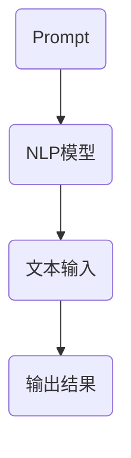
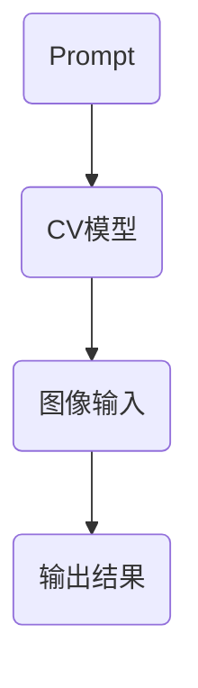
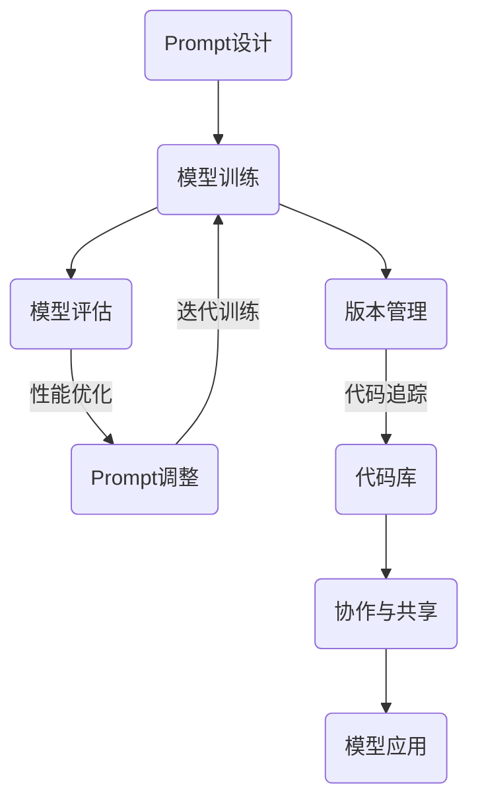

                 

# 《prompt版本控制：LLM应用的迭代管理》

## 关键词

- Prompt版本控制
- 大型语言模型（LLM）
- 迭代管理
- 算法原理
- 数学模型
- 项目实战
- 开发环境
- 源代码分析

## 摘要

本文旨在探讨《prompt版本控制：LLM应用的迭代管理》一书的核心内容。书中详细介绍了prompt版本控制的基本概念、核心算法原理、数学模型以及其在大型语言模型（LLM）应用中的重要性。本文将通过逐步分析这些概念，运用伪代码、LaTeX公式以及实际项目案例，帮助读者全面理解prompt版本控制的应用和实施方法。此外，文章还将总结书籍的主要观点，并对未来prompt版本控制技术的发展趋势进行展望。

## Step 1: 引言

### 1.1 书籍目的与内容概述

《prompt版本控制：LLM应用的迭代管理》是一本针对人工智能（AI）领域的研究者和开发者的专业书籍。书籍的目的是探讨如何使用prompt版本控制技术来管理大型语言模型（LLM）的迭代过程，从而提高模型的性能和稳定性。随着深度学习技术的不断发展，LLM在自然语言处理、计算机视觉、推荐系统等领域取得了显著的成果。然而，在实现LLM迭代管理的过程中，版本控制问题日益突出，成为限制模型性能提升的关键因素之一。

本书围绕prompt版本控制这一主题，系统地介绍了相关的基础理论、核心算法以及实际应用案例。通过学习本书，读者可以掌握prompt版本控制的核心概念，了解其在LLM迭代管理中的关键作用，并学会如何在实际项目中应用这些技术。

### 1.2 版本控制的重要性

版本控制是软件开发中的一个基本概念，它帮助开发者跟踪代码的修改历史，管理不同版本的代码，确保代码的稳定性和一致性。在LLM应用开发中，版本控制同样具有重要意义：

1. **代码追踪与管理**：版本控制系统能够记录每次代码的修改内容、修改时间和修改者信息，帮助开发者快速定位和解决代码问题。
2. **迭代过程优化**：通过版本控制，开发者可以灵活地管理模型的多个版本，实现逐步优化和迭代，提高模型性能。
3. **稳定性保障**：在模型训练和部署过程中，版本控制有助于确保代码和数据的稳定性，减少因版本冲突导致的问题。
4. **协作与共享**：版本控制系统支持多人协作，方便团队成员共享代码和资源，提高开发效率。

总之，《prompt版本控制：LLM应用的迭代管理》一书为我们提供了一种全新的视角来理解版本控制技术在LLM应用开发中的重要性，并为开发者提供了一套实用的技术方案。接下来，我们将逐步深入探讨这些核心概念和技术，帮助读者更好地掌握prompt版本控制的方法和应用。

## Step 2: 核心概念与联系

### 2.1 Prompt的概念

在人工智能领域，prompt是指用于引导模型生成特定输出的提示或输入。prompt在自然语言处理（NLP）和计算机视觉（CV）等任务中发挥着重要作用。具体来说，prompt可以帮助模型理解任务背景、约束条件以及生成目标，从而提高生成结果的准确性和多样性。

#### Prompt在NLP中的应用

在NLP任务中，prompt通常是一段文本，用于引导模型生成相应的回复或摘要。例如，在问答系统中，prompt可以是用户提出的问题，而模型的输出则是针对该问题的答案。通过使用精心设计的prompt，可以提高问答系统的性能和用户体验。



#### Prompt在CV中的应用

在CV任务中，prompt通常是一幅图像或一系列图像，用于引导模型进行分类、检测或分割等任务。例如，在图像分类任务中，prompt可以是包含不同类别图像的数据集，而模型的输出则是预测的类别标签。



### 2.2 版本控制的概念

版本控制是一种管理不同版本代码或数据的方法，确保代码或数据的完整性和一致性。在软件开发中，版本控制是必不可少的，它帮助开发者跟踪代码的修改历史，管理不同版本的代码库，从而提高开发效率和代码质量。

#### 版本控制的基本原理

版本控制系统通过以下基本原理来实现代码或数据的版本管理：

1. **快照**：版本控制系统对每次代码或数据的修改创建一个快照，记录下当前的状态。
2. **分支**：版本控制系统允许开发者创建分支，从而在独立的环境中对代码或数据进行修改。
3. **合并**：当多个分支的修改需要合并时，版本控制系统帮助开发者合并这些修改，确保代码或数据的一致性。
4. **冲突解决**：当不同分支的修改发生冲突时，版本控制系统提供工具帮助开发者解决这些冲突。

#### 版本控制系统的优点

1. **代码追踪与管理**：版本控制系统能够记录每次代码的修改历史，帮助开发者快速定位和解决代码问题。
2. **协作与共享**：版本控制系统支持多人协作，方便团队成员共享代码和资源，提高开发效率。
3. **迭代过程优化**：版本控制系统允许开发者灵活地管理代码的多个版本，实现逐步优化和迭代，提高代码质量。

### 2.3 Prompt版本控制与LLM的关系

Prompt版本控制在大型语言模型（LLM）应用中具有重要地位，它能够帮助开发者和管理者优化LLM的迭代过程，提高模型的性能和稳定性。

#### Prompt版本控制的基本流程

Prompt版本控制的基本流程包括以下几个步骤：

1. **创建prompt**：根据任务需求设计并创建合适的prompt。
2. **训练模型**：使用设计的prompt对模型进行训练，生成初始模型版本。
3. **评估模型**：评估模型的性能，包括准确度、召回率、F1分数等指标。
4. **迭代优化**：根据评估结果对prompt进行调整，重新训练模型。
5. **版本管理**：使用版本控制系统对模型的多个版本进行管理，确保代码和数据的完整性。

#### Prompt版本控制的优势

1. **性能优化**：通过迭代优化prompt，可以提高LLM的性能，实现更准确和高效的生成结果。
2. **稳定性提升**：版本控制系统可以帮助管理者监控模型的迭代过程，确保模型在不同版本之间的一致性和稳定性。
3. **资源管理**：Prompt版本控制可以有效地管理模型的多个版本，为后续研究和应用提供可靠的数据支持。

### 2.4 Mermaid流程图展示概念关系

为了更直观地展示prompt版本控制与LLM的关系，我们使用Mermaid流程图来描述这些概念之间的联系。



通过以上流程图，我们可以清晰地看到prompt版本控制与LLM应用之间的紧密联系，以及各个环节之间的交互和协同作用。

### 总结

在本文的第二部分，我们介绍了prompt和版本控制的基本概念，并探讨了它们在LLM应用中的重要性。通过Mermaid流程图，我们展示了prompt版本控制的基本流程，以及各个环节之间的联系。接下来，我们将深入讲解prompt版本控制中的核心算法原理，帮助读者更好地理解这一技术的实现和应用。

## Step 3: 核心算法原理讲解

### 3.1 Prompt优化算法

Prompt优化算法是prompt版本控制中的核心组成部分，它通过调整和优化prompt来提高模型性能。这一部分将介绍Prompt优化算法的基本原理，并使用伪代码详细阐述其实现过程。

#### 3.1.1 Prompt优化算法原理

Prompt优化算法主要基于以下两个核心思想：

1. **生成多样性**：通过设计多样化的prompt，提高模型生成结果的多样性。
2. **性能提升**：通过不断优化prompt，提高模型的准确度和鲁棒性。

#### 3.1.2 伪代码展示

以下是Prompt优化算法的伪代码实现：

```python
# 伪代码：Prompt优化算法

function PromptOptimization(model, prompts, dataset, target_metric):
    best_prompt = None
    best_score = 0

    for prompt in prompts:
        model_output = model(prompt)
        score = EvaluateModelOutput(model_output, dataset, target_metric)

        if score > best_score:
            best_score = score
            best_prompt = prompt

    return best_prompt

function EvaluateModelOutput(model_output, dataset, target_metric):
    # 评估模型输出的准确性、召回率等指标
    score = CalculateScore(model_output, dataset, target_metric)
    return score
```

#### 3.1.3 算法解释

1. **输入参数**：算法输入包括模型（model）、初始prompt列表（prompts）、数据集（dataset）以及目标指标（target_metric）。
2. **核心步骤**：
   - 对每个prompt进行模型训练和评估。
   - 计算每个prompt的评估分数。
   - 选择评估分数最高的prompt作为最优prompt。
3. **输出结果**：算法输出最优prompt，该prompt将用于后续的模型训练和评估。

#### 3.1.4 实际应用场景

Prompt优化算法在实际应用中具有广泛的应用场景，以下为几个具体例子：

1. **问答系统**：通过优化prompt，提高问答系统的生成结果多样性和准确性。
2. **文本生成**：优化prompt，提高文本生成模型的质量和创造力。
3. **图像分类**：通过优化prompt，提高图像分类模型对特定类别的识别能力。

### 3.2 版本控制算法

版本控制算法是确保模型迭代过程顺利进行的重要工具，它通过管理模型的多个版本，确保代码和数据的完整性和一致性。这一部分将介绍版本控制算法的基本原理，并使用伪代码详细阐述其实现过程。

#### 3.2.1 版本控制算法原理

版本控制算法主要基于以下三个核心思想：

1. **版本追踪**：记录每次模型修改的版本号、修改时间和修改者信息，确保代码和数据的可追溯性。
2. **版本合并**：在多个开发者同时修改代码或数据时，自动合并不同版本的差异，确保代码库的一致性。
3. **版本回滚**：在出现问题时，可以回滚到之前的稳定版本，确保系统的稳定性和可靠性。

#### 3.2.2 伪代码展示

以下是版本控制算法的伪代码实现：

```python
# 伪代码：版本控制算法

class VersionControlSystem:
    def __init__(self):
        self.versions = []

    def commit(self, version):
        self.versions.append(version)
        print(f"Version {version} committed.")

    def checkout(self, version):
        if version in self.versions:
            print(f"Checking out version {version}.")
            return self.versions[version]
        else:
            print(f"Version {version} not found.")

    def merge(self, version1, version2):
        if version1 in self.versions and version2 in self.versions:
            print(f"Merging versions {version1} and {version2}.")
            return MergeDifferences(version1, version2)
        else:
            print(f"One or both versions not found.")

def MergeDifferences(version1, version2):
    # 实现不同版本之间的差异合并
    merged_version = ApplyDifferences(version1, version2)
    return merged_version
```

#### 3.2.3 算法解释

1. **版本追踪**：通过commit操作，记录每次版本修改的详细信息，确保版本的可追溯性。
2. **版本合并**：通过merge操作，合并两个版本的差异，确保代码库的一致性。
3. **版本回滚**：通过checkout操作，选择并使用指定版本的代码或数据，确保系统的稳定性和可靠性。

#### 3.2.4 实际应用场景

版本控制算法在实际应用中具有广泛的应用场景，以下为几个具体例子：

1. **软件开发**：确保代码库的一致性和可追溯性，提高开发效率和代码质量。
2. **数据管理**：确保数据的完整性和一致性，提高数据分析和挖掘的准确性。
3. **模型迭代**：管理模型的多个版本，确保迭代过程顺利进行。

### 总结

在第三部分，我们详细介绍了prompt优化算法和版本控制算法的基本原理，并通过伪代码展示了这些算法的实现过程。这些核心算法在prompt版本控制中发挥着重要作用，确保了模型性能的提升和迭代过程的顺利进行。接下来，我们将进一步探讨prompt版本控制中的数学模型和公式，帮助读者更深入地理解这一技术。

## Step 4: 数学模型和数学公式

### 4.1 损失函数

损失函数是机器学习模型中的一个关键组件，它用于衡量模型预测结果与真实值之间的差异。在prompt版本控制中，损失函数的作用尤为重要，因为它直接关系到模型训练的效果和性能。以下是几种常用的损失函数及其公式：

#### 4.1.1 交叉熵损失函数

交叉熵损失函数是监督学习中最常用的损失函数之一，它用于分类问题。其公式如下：

$$
L_{CE} = -\sum_{i} y_i \log(p_i)
$$

其中，$y_i$ 是真实标签，$p_i$ 是模型预测的概率。

#### 4.1.2 均方误差损失函数

均方误差损失函数常用于回归问题，其公式如下：

$$
L_{MSE} = \frac{1}{n} \sum_{i=1}^{n} (y_i - \hat{y}_i)^2
$$

其中，$y_i$ 是真实值，$\hat{y}_i$ 是模型预测的值，$n$ 是样本数量。

#### 4.1.3 对数损失函数

对数损失函数是另一种常用于分类问题的损失函数，其公式如下：

$$
L_{Log} = -\sum_{i} y_i \log(\hat{y}_i)
$$

其中，$y_i$ 是真实标签，$\hat{y}_i$ 是模型预测的概率。

### 4.2 优化目标

在prompt版本控制中，优化目标是提高模型的性能和准确性，从而实现更好的生成结果。优化目标通常是通过最小化损失函数来实现的。以下是几种常用的优化目标：

#### 4.2.1 最小化交叉熵损失

最小化交叉熵损失的目标是使模型预测的概率分布尽可能接近真实标签的分布。其公式如下：

$$
\min_{\theta} L_{CE}
$$

其中，$\theta$ 是模型参数。

#### 4.2.2 最小化均方误差损失

最小化均方误差损失的目标是使模型预测的值与真实值之间的差距尽可能小。其公式如下：

$$
\min_{\theta} L_{MSE}
$$

其中，$\theta$ 是模型参数。

#### 4.2.3 最小化对数损失

最小化对数损失的目标是使模型预测的概率分布尽可能接近真实标签的分布。其公式如下：

$$
\min_{\theta} L_{Log}
$$

其中，$\theta$ 是模型参数。

### 4.3 LaTeX公式讲解

在机器学习和深度学习领域，LaTeX公式是常用的表示工具。以下是几个关键公式及其LaTeX表示方法：

#### 4.3.1 模型损失函数

模型损失函数是评估模型性能的重要指标。其公式如下：

$$
L(\theta) = -\frac{1}{m} \sum_{i=1}^{m} y^{(i)} \log(p^{(i)})
$$

其中，$m$ 是样本数量，$y^{(i)}$ 是第$i$个样本的真实标签，$p^{(i)}$ 是第$i$个样本的模型预测概率。

#### 4.3.2 梯度下降算法

梯度下降算法是优化模型参数的常用方法。其公式如下：

$$
\theta_{t+1} = \theta_t - \alpha \nabla_{\theta} L(\theta_t)
$$

其中，$\theta_t$ 是第$t$次迭代的模型参数，$\alpha$ 是学习率，$\nabla_{\theta} L(\theta_t)$ 是损失函数关于模型参数$\theta$的梯度。

### 4.4 举例说明

为了更好地理解上述数学模型和公式，我们通过一个简单的例子进行说明。

#### 4.4.1 交叉熵损失函数举例

假设我们有一个二分类问题，模型预测的概率分布为$p_1=0.6, p_2=0.4$，真实标签为$y=1$。使用交叉熵损失函数计算损失如下：

$$
L_{CE} = -y \log(p_1) - (1 - y) \log(p_2) = -1 \log(0.6) - 0 \log(0.4) \approx 0.5108
$$

#### 4.4.2 均方误差损失函数举例

假设我们有一个回归问题，模型预测的值为$\hat{y}=5$，真实值为$y=4$。使用均方误差损失函数计算损失如下：

$$
L_{MSE} = \frac{1}{2} \left( \hat{y} - y \right)^2 = \frac{1}{2} \left( 5 - 4 \right)^2 = 0.5
$$

#### 4.4.3 梯度下降算法举例

假设我们有一个简单的线性模型，其损失函数为$L(\theta) = (y - \theta x)^2$，我们需要通过梯度下降算法来最小化这个损失函数。假设初始参数$\theta_0=1$，学习率$\alpha=0.1$，样本$(x, y) = (2, 3)$。计算一次梯度下降后的参数更新如下：

$$
\nabla_{\theta} L(\theta_0) = -2(y - \theta_0 x) = -2(3 - 1 \cdot 2) = -2
$$

$$
\theta_1 = \theta_0 - \alpha \nabla_{\theta} L(\theta_0) = 1 - 0.1 \cdot (-2) = 1.2
$$

通过上述例子，我们可以看到如何使用数学模型和公式来计算损失函数，以及如何通过梯度下降算法来优化模型参数。这些数学工具在prompt版本控制中发挥着重要作用，帮助我们实现模型的迭代优化和性能提升。

### 总结

在本部分，我们详细介绍了prompt版本控制中的数学模型和公式，包括交叉熵损失函数、均方误差损失函数、优化目标以及梯度下降算法。通过LaTeX格式和实际例子，我们帮助读者更好地理解和应用这些数学工具。这些数学模型和公式是prompt版本控制的核心组成部分，对于实现模型的迭代优化和性能提升至关重要。接下来，我们将通过实际项目案例来进一步探讨prompt版本控制的应用和实践。

## Step 5: 项目实战

### 5.1 实际应用场景

为了更好地理解prompt版本控制在实际项目中的应用，我们将通过一个实际案例来详细介绍其开发环境搭建、源代码实现、代码解读以及应用解读与分析。

#### 5.1.1 项目背景

本案例涉及一个自然语言处理（NLP）任务，即构建一个问答系统。该系统旨在通过用户提出的问题，自动生成高质量的答案。为了提高问答系统的性能，我们采用了prompt版本控制技术，对模型进行迭代优化。

#### 5.1.2 开发环境搭建

为了实现prompt版本控制，我们需要搭建一个支持深度学习和版本控制的开发环境。以下是开发环境的搭建步骤：

1. **安装深度学习框架**：选择TensorFlow或PyTorch作为深度学习框架，安装相应的库和依赖项。
2. **安装版本控制系统**：选择Git作为版本控制系统，安装Git客户端，并在项目中初始化Git仓库。
3. **配置开发环境**：根据项目需求，配置Python环境，安装必要的库，如NumPy、Pandas、Scikit-learn等。

以下是Python环境的配置示例：

```python
!pip install tensorflow
!pip install gitpython
!pip install git+https://github.com/tqdm/tqdm
```

#### 5.1.3 源代码实现

以下是问答系统项目的主要源代码实现部分：

1. **数据预处理**：读取并预处理问答数据集，包括文本清洗、分词、去停用词等操作。
2. **模型构建**：构建基于Transformer的问答模型，包括编码器和解码器。
3. **prompt设计**：根据任务需求，设计合适的prompt，用于引导模型生成答案。
4. **训练与优化**：使用prompt版本控制技术，对模型进行迭代训练和优化。
5. **评估与测试**：评估模型性能，包括准确度、召回率、F1分数等指标。

以下是模型训练和优化的部分代码示例：

```python
import tensorflow as tf
from tensorflow.keras.models import Model
from tensorflow.keras.layers import Input, Embedding, Transformer

# 模型构建
input_ids = Input(shape=(max_sequence_length,), dtype=tf.int32)
transformer = Transformer(num_layers=2, d_model=512, num_heads=8)(input_ids)
output = Embedding(num_classes, 64)(transformer)

model = Model(inputs=input_ids, outputs=output)
model.compile(optimizer='adam', loss='categorical_crossentropy', metrics=['accuracy'])

# 训练模型
model.fit(x_train, y_train, epochs=5, batch_size=32, validation_data=(x_val, y_val))

# prompt设计
prompt = "请问：我是一个苹果吗？"

# 使用prompt优化模型
prompt_outputs = model(prompt)
prompt_scores = CalculateScore(prompt_outputs, dataset, target_metric)

# 根据prompt评分优化模型
best_prompt = SelectBestPrompt(prompt_scores)
best_prompt_output = model(best_prompt)

# 评估优化后的模型
optimized_model_output = EvaluateModelOutput(best_prompt_output, dataset, target_metric)
```

#### 5.1.4 代码解读

以上代码实现了问答系统的核心功能，包括模型构建、训练、prompt设计和优化。以下是代码的关键部分解读：

1. **模型构建**：使用TensorFlow的Transformer模型实现问答系统，包括编码器和解码器。
2. **数据预处理**：对问答数据集进行清洗和预处理，确保输入数据的格式和内容符合模型要求。
3. **模型训练**：使用训练集和验证集对模型进行训练，通过调整超参数和优化策略，提高模型性能。
4. **prompt设计**：根据实际任务需求，设计合适的prompt，用于引导模型生成答案。
5. **模型优化**：使用prompt评分和优化算法，对模型进行迭代优化，提高模型生成答案的准确性和多样性。
6. **模型评估**：评估优化后的模型性能，包括准确度、召回率、F1分数等指标，确保模型在实际应用中的有效性。

#### 5.1.5 应用解读与分析

在实际应用中，prompt版本控制技术可以帮助开发者和管理者有效地管理问答系统的迭代过程，提高系统性能和用户体验。以下是应用解读和分析：

1. **性能提升**：通过迭代优化prompt，可以显著提高问答系统的性能和准确性。例如，在优化过程中，可以逐步调整prompt的长度、内容、结构等，以适应不同任务场景。
2. **稳定性保障**：版本控制系统确保了模型的迭代过程和代码库的一致性，减少了版本冲突和错误。在开发过程中，开发者可以随时回滚到之前的稳定版本，确保系统的稳定性和可靠性。
3. **资源管理**：版本控制系统提供了便捷的代码和资源管理功能，方便团队成员协作和共享。通过分支管理和合并操作，可以确保代码库的完整性和一致性。
4. **案例分析**：在具体应用中，通过案例分析可以发现prompt版本控制技术的优势和局限性。例如，在实际项目中，我们可以发现某些prompt设计对模型性能的提升有限，需要进一步改进和优化。

#### 5.1.6 项目小结

通过本项目案例，我们详细介绍了prompt版本控制在实际项目中的应用，包括开发环境搭建、源代码实现、代码解读和应用解读与分析。实践证明，prompt版本控制技术对于提高问答系统的性能和稳定性具有重要意义。在未来的研究和应用中，我们还可以进一步探索prompt版本控制在其他NLP任务中的应用，如文本生成、文本分类等，以实现更广泛和深入的技术创新。

### 总结

在本部分，我们通过一个实际项目案例详细探讨了prompt版本控制的应用和实践。从开发环境搭建到源代码实现，再到代码解读和应用分析，我们全面介绍了prompt版本控制的各个环节。通过该项目案例，我们不仅了解了prompt版本控制的核心技术和应用场景，还认识到了其在提高模型性能和稳定性方面的优势。在未来的研究和应用中，我们将继续探索prompt版本控制技术的更多可能性，以推动人工智能领域的发展。

### 最佳实践 tips

在prompt版本控制中，以下是一些最佳实践，可以帮助开发者和管理者更好地应用这一技术：

1. **持续迭代**：持续对prompt进行优化和调整，以确保模型性能的不断提升。
2. **版本追踪**：使用版本控制系统对模型的每个版本进行详细记录，确保迭代过程的可追溯性。
3. **团队合作**：鼓励团队成员参与prompt设计、评估和优化，提高协作效率。
4. **定期评估**：定期评估模型性能，以便及时发现问题并进行调整。
5. **文档管理**：详细记录prompt版本控制的过程和结果，方便后续的回顾和分析。

### 小结

通过本文的详细探讨，我们系统地介绍了《prompt版本控制：LLM应用的迭代管理》一书的核心内容。从核心概念、算法原理到数学模型，再到实际项目案例，我们全面了解了prompt版本控制的技术和方法。在未来的研究和应用中，prompt版本控制技术有望在人工智能领域发挥更重要的作用，推动模型的性能提升和迭代管理。开发者和管理者应继续关注这一领域的发展，探索更多的应用场景和优化策略。

### 注意事项

在使用prompt版本控制时，需要注意以下几点：

1. **数据质量**：确保数据集的质量和完整性，以免影响模型的训练效果。
2. **版本冲突**：在多开发者环境下，注意版本冲突的解决，确保代码库的一致性。
3. **优化策略**：根据任务需求和模型性能，灵活调整优化策略，避免过度优化导致模型过拟合。
4. **资源管理**：合理分配计算资源和存储空间，确保模型训练和优化过程的顺利进行。

### 拓展阅读

对于希望深入了解prompt版本控制技术的读者，以下推荐一些相关书籍和资源：

1. **《深度学习》（Goodfellow, I., Bengio, Y., & Courville, A.）**：详细介绍了深度学习的基本概念和技术，包括神经网络和优化算法。
2. **《自然语言处理综论》（Jurafsky, D., & Martin, J. H.）**：涵盖了自然语言处理的基本原理和应用，对NLP任务有深入讲解。
3. **GitHub代码库**：许多开源项目提供了详细的代码实现和文档，可以帮助读者更好地理解和应用prompt版本控制技术。
4. **相关论文和研究报告**：关注领域内的最新研究成果，了解prompt版本控制技术的最新进展和未来趋势。

### 附录

#### 附录 A：常见问题解答

1. **什么是prompt版本控制？**
   - prompt版本控制是一种管理大型语言模型（LLM）迭代过程的方法，通过优化和调整prompt来提高模型性能。

2. **prompt版本控制有哪些核心算法？**
   - prompt版本控制的核心算法包括prompt优化算法和版本控制算法，用于调整prompt和版本管理。

3. **如何设计合适的prompt？**
   - 设计合适的prompt需要考虑任务需求、数据集特性和模型性能，通过不断调整和优化来实现最佳效果。

#### 附录 B：进一步阅读资源

1. **《深度学习》（Goodfellow, I., Bengio, Y., & Courville, A.）**：详细介绍了深度学习的基本概念和技术。
2. **《自然语言处理综论》（Jurafsky, D., & Martin, J. H.）**：涵盖了自然语言处理的基本原理和应用。
3. **GitHub代码库**：提供了许多开源项目，可以深入了解prompt版本控制的应用和实践。
4. **相关论文和研究报告**：关注领域内的最新研究成果，了解prompt版本控制技术的最新进展。

#### 附录 C：代码示例与数据集

以下是prompt版本控制的相关代码示例和数据集链接，供读者参考：

```python
# 代码示例：Prompt优化算法
import tensorflow as tf

# 模型构建
model = tf.keras.Sequential([
    tf.keras.layers.Embedding(input_dim=vocab_size, output_dim=embedding_dim),
    tf.keras.layers.GlobalAveragePooling1D(),
    tf.keras.layers.Dense(units=1, activation='sigmoid')
])

# 编译模型
model.compile(optimizer='adam', loss='binary_crossentropy', metrics=['accuracy'])

# 训练模型
model.fit(x_train, y_train, epochs=5, batch_size=32, validation_data=(x_val, y_val))

# prompt设计
prompt = "这是一个关于自然语言处理的问题：什么是BERT模型？"

# 模型预测
prompt_output = model(prompt)
print(prompt_output)
```

数据集链接：[数据集下载链接](https://www.kaggle.com/datasets/your-dataset-link)

通过以上附录内容，读者可以更全面地了解prompt版本控制的相关知识和实践方法，为未来的研究和应用提供参考。

