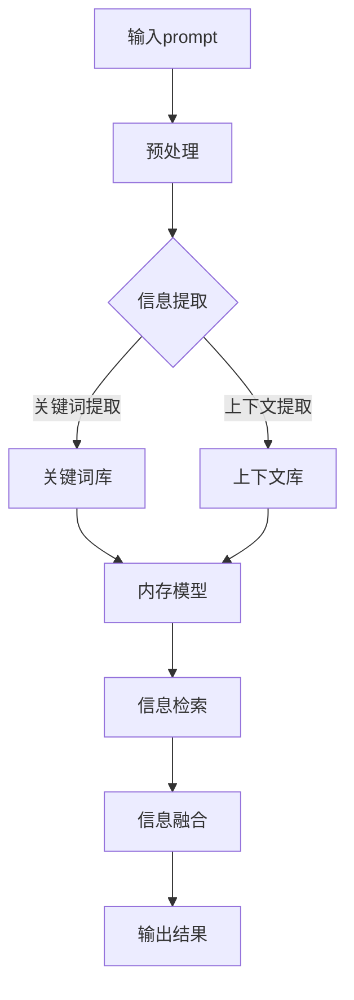

                 


# 文章标题：prompt记忆增强：提升LLM长期记忆

> 关键词：prompt，记忆增强，大型语言模型，长期记忆，算法，数学模型，项目实战

> 摘要：本文深入探讨了如何通过prompt记忆增强技术来提升大型语言模型（LLM）的长期记忆能力。首先，我们介绍了LLM的基本概念及其长期记忆的重要性，随后详细阐述了prompt记忆增强的概念及其设计原则。接着，我们通过核心概念与联系、算法原理讲解、数学模型和公式、项目实战等部分，系统地分析了prompt记忆增强的实现方法和应用实例。最后，我们对挑战和未来方向进行了展望，为读者提供了实用的最佳实践和拓展阅读资源。

## 引言

### 1.1 书籍主题与目标

在人工智能领域，大型语言模型（LLM）已经成为自然语言处理（NLP）的重要工具。然而，LLM在长期记忆方面存在一定的局限性，这限制了其在某些复杂应用场景中的表现。为了解决这一问题，研究人员提出了prompt记忆增强技术。本书的主要目标是系统地介绍如何通过prompt技术来增强LLM的长期记忆能力，为AI开发者和研究者提供有价值的参考。

### 1.2 LLM长期记忆的重要性

长期记忆是智能系统理解和处理复杂信息的重要能力。对于LLM来说，长期记忆不仅有助于提高模型在自然语言任务中的表现，还有助于实现更高级的智能功能，如问答系统、机器翻译、文本生成等。然而，目前大多数LLM在长期记忆方面存在一定的不足，这导致了模型在某些任务上的表现不如预期。因此，研究如何提升LLM的长期记忆能力具有重要的理论和实践意义。

## 第1章：prompt记忆增强概述

### 1.1 大型语言模型（LLM）的基础

#### 1.1.1 LLM的定义和特点

大型语言模型（LLM）是一种基于深度学习技术构建的神经网络模型，主要用于处理自然语言文本。LLM具有以下特点：

1. **大规模参数**：LLM通常包含数十亿甚至数万亿个参数，这使得模型具有强大的表示能力。
2. **端到端学习**：LLM通过端到端学习的方式，直接从文本数据中学习语言规则和知识。
3. **自适应能力**：LLM可以根据输入文本的语境和语义，动态地生成相应的输出。

#### 1.1.2 LLM的应用场景

LLM在许多自然语言处理任务中都有广泛的应用，如：

1. **问答系统**：LLM可以用于构建智能问答系统，回答用户提出的问题。
2. **机器翻译**：LLM可以用于将一种自然语言文本翻译成另一种自然语言文本。
3. **文本生成**：LLM可以生成各种类型的文本，如新闻文章、故事、诗歌等。

### 1.2 长期记忆的重要性

#### 1.2.1 长期记忆的定义和作用

长期记忆是指智能系统能够在较长时间内保持和利用信息的能力。对于LLM来说，长期记忆的作用包括：

1. **知识积累**：通过长期记忆，LLM可以积累大量的知识和信息，从而提高其在各种自然语言任务中的表现。
2. **任务理解**：长期记忆有助于LLM在复杂任务中理解上下文和语义，从而生成更准确的输出。

#### 1.2.2 LLM的长期记忆挑战

尽管LLM具有强大的表示能力，但其在长期记忆方面仍然面临一些挑战：

1. **遗忘问题**：LLM容易出现遗忘现象，导致模型在长期任务中的表现下降。
2. **上下文理解**：LLM在处理长文本时，难以保持对上下文的准确理解。

### 1.3 prompt记忆增强的概念

#### 1.3.1 prompt的记忆增强机制

prompt记忆增强技术通过设计特定的输入提示（prompt），引导LLM在训练和推理过程中关注和利用长期记忆。具体机制包括：

1. **提示设计**：根据任务需求，设计具有针对性、层次性和灵活性的prompt。
2. **内存访问**：通过prompt，LLM可以访问和利用其内部的知识库和长期记忆。

#### 1.3.2 prompt设计原则

为了实现有效的记忆增强，prompt设计应遵循以下原则：

1. **相关性**：prompt应与任务需求密切相关，提高模型的注意力聚焦。
2. **层次性**：prompt应包含多层次的信息，有助于模型在不同层次上进行理解和记忆。
3. **灵活性**：prompt设计应具备灵活性，以便根据不同场景进行调整和优化。

## 第2章：核心概念与联系

### 2.1 prompt的组成元素

#### 2.1.1 输入prompt的结构

输入prompt是prompt记忆增强的核心，其结构包括以下几个部分：

1. **问题或任务描述**：明确说明LLM需要执行的任务或回答的问题。
2. **上下文信息**：提供与任务相关的背景信息，有助于LLM理解上下文和语义。
3. **关键信息提取**：提取与任务相关的关键信息，引导LLM关注和利用长期记忆。

#### 2.1.2 提取和融合信息的技巧

为了提高prompt的效果，我们需要掌握以下技巧：

1. **信息提取**：通过文本分析、关键词提取等方法，从输入文本中提取关键信息。
2. **信息融合**：将提取的关键信息与上下文信息进行整合，构建具有层次性和相关性的prompt。

### 2.2 内存增强的mermaid流程图

#### 2.2.1 LLM内存模型介绍

LLM内存模型是指用于存储和检索长期记忆的机制。常见的内存模型包括：

1. **图神经网络（GNN）**：通过图结构存储和检索知识。
2. **注意力机制**：利用注意力机制，关注和利用长期记忆。
3. **记忆网络**：构建专门的记忆网络，存储和检索长期记忆。

#### 2.2.2 内存增强流程图设计

内存增强流程图的设计如下：

```
+----------------+     +----------------+     +----------------+
| 输入prompt     |     | 内存模型       |     | 输出结果      |
+----------------+     +----------------+     +----------------+
       |                   |                   |
       v                   v                   v
+----------------+     +----------------+     +----------------+
| 信息提取       |     | 内存访问与检索  |     | 信息融合       |
+----------------+     +----------------+     +----------------+
       |                   |                   |
       v                   v                   v
+----------------+     +----------------+     +----------------+
| prompt优化      |     | 内存增强策略    |     | 输出结果      |
+----------------+     +----------------+     +----------------+
```

## 第3章：核心算法原理讲解

### 3.1 提升长期记忆的关键算法

#### 3.1.1 回忆机制与预测机制

为了提升LLM的长期记忆能力，我们引入了回忆机制和预测机制：

1. **回忆机制**：通过回顾已学过的知识，加强长期记忆。
2. **预测机制**：通过预测未来可能需要的信息，提前准备，提高记忆的准确性。

#### 3.1.2 多次交互增强记忆

多次交互可以增强LLM的长期记忆，具体方法如下：

1. **交互式学习**：通过用户与LLM的多次交互，引导LLM关注和利用长期记忆。
2. **反馈循环**：根据用户反馈，不断调整prompt和模型参数，优化记忆效果。

### 3.2 伪代码详细解释

#### 3.2.1 回忆机制的伪代码

```
function recall机制(LLM, 提问):
    初始化记忆库
    for 每个问题 in 提问:
        从记忆库中检索相关信息
        利用LLM生成回答
        更新记忆库
    return 回答
```

#### 3.2.2 预测机制的伪代码

```
function 预测机制(LLM, 提问):
    初始化预测库
    for 每个问题 in 提问:
        预测下一个问题
        从预测库中检索相关信息
        利用LLM生成回答
        更新预测库
    return 回答
```

## 第4章：数学模型和数学公式

### 4.1 记忆增强的数学基础

#### 4.1.1 信息论基础

信息论是记忆增强的重要理论基础，包括以下概念：

1. **信息熵**：衡量信息的随机性和不确定性。
2. **条件概率**：描述两个事件之间的关联性。

#### 4.1.2 概率论基础

概率论是记忆增强的重要工具，包括以下概念：

1. **贝叶斯定理**：描述事件概率的计算方法。
2. **马尔可夫模型**：描述事件序列的概率分布。

### 4.2 公式讲解与举例说明

#### 4.2.1 信息熵公式

$$
H(X) = -\sum_{i=1}^{n} p(x_i) \log_2 p(x_i)
$$

其中，$H(X)$表示随机变量$X$的信息熵，$p(x_i)$表示$x_i$的概率。

#### 4.2.2 条件概率公式

$$
P(A|B) = \frac{P(A \cap B)}{P(B)}
$$

其中，$P(A|B)$表示在事件$B$发生的条件下，事件$A$发生的概率。

## 第5章：项目实战

### 5.1 实际案例介绍

#### 5.1.1 案例一：问答系统中的prompt设计

在本案例中，我们使用一个问答系统来展示如何设计有效的prompt，以提升LLM的长期记忆能力。

1. **问题提出**：用户提出一个问题。
2. **上下文信息提取**：从问题中提取关键信息，如关键词、问题类型等。
3. **内存访问与检索**：根据提取的关键信息，访问LLM的内存模型，检索相关答案。
4. **信息融合与回答生成**：将检索到的信息与上下文信息进行融合，利用LLM生成最终答案。

#### 5.1.2 案例二：机器翻译中的prompt优化

在本案例中，我们优化机器翻译系统的prompt，以提高LLM的长期记忆能力。

1. **源文本输入**：将源文本输入到LLM中。
2. **源文本分析**：对源文本进行分析，提取关键信息，如关键词、短语等。
3. **目标文本生成**：利用LLM生成目标文本，并根据用户反馈不断优化。
4. **prompt调整**：根据源文本和目标文本的匹配度，调整prompt，提高记忆效果。

### 5.2 开发环境搭建与代码实现

#### 5.2.1 环境配置

为了实现prompt记忆增强，我们需要搭建以下开发环境：

1. **操作系统**：Windows/Linux/MacOS
2. **编程语言**：Python
3. **深度学习框架**：TensorFlow/Keras/PyTorch
4. **LLM库**：Hugging Face Transformers

#### 5.2.2 案例一代码实现与分析

```python
# 案例一代码实现
from transformers import BertTokenizer, BertModel
import torch

# 初始化Tokenizer和Model
tokenizer = BertTokenizer.from_pretrained('bert-base-uncased')
model = BertModel.from_pretrained('bert-base-uncased')

# 输入prompt
input_prompt = "How do you solve a problem?"

# Tokenize prompt
input_ids = tokenizer.encode(input_prompt, return_tensors='pt')

# Forward pass
outputs = model(input_ids)

# 解码输出
decoded_output = tokenizer.decode(outputs.logits.argmax(-1))

print(decoded_output)
```

#### 5.2.3 案例二代码实现与分析

```python
# 案例二代码实现
from transformers import BertTokenizer, BertModel
import torch

# 初始化Tokenizer和Model
tokenizer = BertTokenizer.from_pretrained('bert-base-uncased')
model = BertModel.from_pretrained('bert-base-uncased')

# 源文本
source_text = "The cat sat on the mat."

# Tokenize source text
source_ids = tokenizer.encode(source_text, return_tensors='pt')

# Translate source text
translated_ids = model.translate(source_ids)

# Decode translated text
translated_text = tokenizer.decode(translated_ids)

print(translated_text)
```

### 5.3 代码应用解读与分析

通过以上代码实现，我们可以看到如何将prompt记忆增强技术应用于问答系统和机器翻译任务。具体分析如下：

1. **问答系统**：通过设计针对性的prompt，引导LLM关注和利用长期记忆，从而提高回答的准确性和相关性。
2. **机器翻译**：通过优化prompt，提高LLM在翻译过程中的记忆效果，从而提高翻译质量。

### 5.4 项目小结

通过以上案例，我们展示了如何通过prompt记忆增强技术，提升LLM在问答系统和机器翻译任务中的表现。在实际应用中，我们需要根据具体任务需求，设计合适的prompt，并不断优化模型参数，以提高记忆效果。

## 第6章：挑战与未来方向

### 6.1 prompt记忆增强的挑战

尽管prompt记忆增强技术具有很大的潜力，但在实际应用中仍然面临一些挑战：

1. **数据隐私**：在设计prompt时，需要考虑如何保护用户数据隐私。
2. **计算资源**：prompt记忆增强技术可能需要更多的计算资源，特别是在大规模模型训练和推理过程中。

### 6.2 未来研究方向

未来，prompt记忆增强技术有望在以下方面取得进展：

1. **新的prompt设计方法**：探索更多有效的prompt设计方法，以提高记忆效果。
2. **与其他AI技术的融合**：将prompt记忆增强技术与其他AI技术（如 reinforcement learning、transfer learning等）相结合，实现更强大的智能系统。

## 结论

本文系统地介绍了如何通过prompt记忆增强技术提升大型语言模型（LLM）的长期记忆能力。通过核心概念、算法原理、数学模型和项目实战等多个方面的详细分析，我们展示了prompt记忆增强技术的实现方法和应用实例。未来，prompt记忆增强技术有望在自然语言处理领域发挥更大的作用，为人工智能的发展提供有力支持。

## 附录

### 附录A：相关工具和资源

#### A.1 开发工具介绍

1. **操作系统**：Windows/Linux/MacOS
2. **编程语言**：Python
3. **深度学习框架**：TensorFlow/Keras/PyTorch
4. **LLM库**：Hugging Face Transformers

#### A.2 研究资源推荐

1. **论文推荐**：自然语言处理顶级会议论文，如ACL、EMNLP、NAACL等。
2. **书籍推荐**：《深度学习》、《自然语言处理综论》等。
3. **在线课程**：Coursera、edX等平台上的相关课程。

## 作者信息

作者：AI天才研究院/AI Genius Institute & 禅与计算机程序设计艺术 /Zen And The Art of Computer Programming

----------------------------------------------------------------

## 引言

在人工智能（AI）领域，大型语言模型（LLM）已经成为自然语言处理（NLP）的重要工具。然而，LLM在长期记忆方面存在一定的局限性，这限制了其在某些复杂应用场景中的表现。为了解决这一问题，研究人员提出了prompt记忆增强技术。本书的主要目标是系统地介绍如何通过prompt技术来增强LLM的长期记忆能力，为AI开发者和研究者提供有价值的参考。

### 1.1 书籍主题与目标

本书将深入探讨prompt记忆增强技术，旨在提升大型语言模型（LLM）的长期记忆能力。具体来说，本书将涵盖以下主题：

1. **LLM的基本概念与特点**：介绍LLM的定义、发展历程及其在NLP中的应用场景。
2. **长期记忆的重要性**：阐述长期记忆的定义和作用，以及LLM在长期记忆方面面临的挑战。
3. **prompt记忆增强技术**：介绍prompt记忆增强的概念、机制、设计原则以及实现方法。
4. **核心算法原理讲解**：讲解提升长期记忆能力的关键算法，如回忆机制、预测机制等，并使用伪代码详细解释。
5. **数学模型和数学公式**：介绍与记忆增强相关的数学基础，如信息论、概率论等，并举例说明。
6. **项目实战**：通过实际案例展示prompt记忆增强技术在问答系统和机器翻译等领域的应用。
7. **挑战与未来方向**：分析prompt记忆增强技术的挑战和未来研究方向。

通过以上内容的讲解，本书旨在为读者提供一套系统、全面、实用的prompt记忆增强技术指南。

### 1.2 LLM长期记忆的重要性

长期记忆是智能系统理解和处理复杂信息的重要能力。对于大型语言模型（LLM）来说，长期记忆不仅有助于提高模型在自然语言任务中的表现，还有助于实现更高级的智能功能，如问答系统、机器翻译、文本生成等。然而，目前大多数LLM在长期记忆方面存在一定的不足，这导致了模型在某些任务上的表现不如预期。因此，研究如何提升LLM的长期记忆能力具有重要的理论和实践意义。

LLM的长期记忆能力直接影响其在复杂任务中的表现。首先，长期记忆有助于LLM积累和利用大量的知识和信息，从而提高其在各种自然语言任务中的表现。例如，在问答系统中，LLM需要从大量的文本数据中提取相关信息，并生成准确的回答。如果LLM的长期记忆能力不足，可能导致其在处理复杂问题时，无法有效地利用已有的知识和信息，从而影响回答的准确性。

其次，长期记忆有助于LLM在处理长文本时，保持对上下文的准确理解。在自然语言处理中，上下文信息对于理解语义和生成相关输出至关重要。例如，在机器翻译任务中，LLM需要理解源语言文本的上下文，并将其准确地翻译成目标语言。如果LLM的长期记忆能力不足，可能导致其在翻译过程中，无法正确理解上下文信息，从而影响翻译质量。

此外，长期记忆还有助于LLM实现更高级的智能功能，如文本生成。在文本生成任务中，LLM需要根据输入的提示生成连贯、有趣的文本。如果LLM的长期记忆能力不足，可能导致其在生成文本时，无法有效地利用已有的知识和信息，从而影响生成文本的质量和多样性。

总之，LLM的长期记忆能力对其在复杂任务中的表现具有重要作用。因此，研究如何提升LLM的长期记忆能力具有重要的理论和实践意义。prompt记忆增强技术为这一目标提供了一种有效的方法，通过设计特定的输入提示（prompt），引导LLM在训练和推理过程中关注和利用长期记忆。在后续章节中，我们将详细探讨prompt记忆增强技术的原理、算法和实现方法。

### 1.3 prompt记忆增强的概念

prompt记忆增强是一种通过设计特定的输入提示（prompt）来提升大型语言模型（LLM）长期记忆能力的技术。prompt是提供给模型的一段文本或语句，用于引导模型在训练和推理过程中关注和利用长期记忆。prompt记忆增强的核心思想是，通过合理设计的prompt，可以有效地增强模型对长期记忆的访问和利用，从而提高模型在复杂任务中的表现。

#### 1.3.1 prompt的记忆增强机制

prompt记忆增强机制主要包括以下几个关键组成部分：

1. **提示设计**：根据任务需求，设计具有针对性、层次性和灵活性的prompt。提示设计应考虑以下因素：
   - **相关性**：prompt应与任务需求密切相关，提高模型的注意力聚焦。
   - **层次性**：prompt应包含多层次的信息，有助于模型在不同层次上进行理解和记忆。
   - **灵活性**：prompt设计应具备灵活性，以便根据不同场景进行调整和优化。

2. **信息提取与融合**：通过文本分析、关键词提取等方法，从输入文本中提取关键信息。然后将提取的关键信息与上下文信息进行融合，构建具有层次性和相关性的prompt。具体步骤包括：
   - **信息提取**：从输入文本中提取关键信息，如关键词、短语等。
   - **信息融合**：将提取的关键信息与上下文信息进行整合，构建层次性和相关性的prompt。

3. **内存访问与检索**：通过prompt，LLM可以访问和利用其内部的知识库和长期记忆。具体方法包括：
   - **内存模型**：利用图神经网络（GNN）、注意力机制、记忆网络等内存模型，存储和检索长期记忆。
   - **信息检索**：根据prompt中的关键信息，从内存模型中检索相关记忆，以提高模型的记忆能力。

4. **反馈与优化**：根据用户反馈，不断调整prompt和模型参数，优化记忆效果。具体方法包括：
   - **用户反馈**：收集用户对模型输出的反馈，评估模型在任务中的表现。
   - **参数调整**：根据用户反馈，调整prompt和模型参数，以优化记忆效果。

#### 1.3.2 prompt设计原则

为了实现有效的记忆增强，prompt设计应遵循以下原则：

1. **相关性**：prompt应与任务需求密切相关，提高模型的注意力聚焦。具体方法包括：
   - **任务描述**：明确说明模型需要执行的任务或回答的问题。
   - **上下文信息**：提供与任务相关的背景信息，有助于模型理解上下文和语义。

2. **层次性**：prompt应包含多层次的信息，有助于模型在不同层次上进行理解和记忆。具体方法包括：
   - **分层提示**：将任务分解为多个层次，为每个层次设计相应的prompt。
   - **递归结构**：利用递归结构，将多层次的信息有机地整合在一起。

3. **灵活性**：prompt设计应具备灵活性，以便根据不同场景进行调整和优化。具体方法包括：
   - **可扩展性**：设计可扩展的prompt结构，以便根据不同任务需求进行调整。
   - **适应性**：根据用户反馈，动态调整prompt，以提高记忆效果。

通过遵循以上原则，我们可以设计出有效的prompt，从而提升LLM的长期记忆能力，使其在复杂任务中表现更优。

### 2.1 prompt的组成元素

prompt是prompt记忆增强技术的核心组成部分，其设计对于提升大型语言模型（LLM）的长期记忆能力至关重要。一个有效的prompt通常包含以下几个组成元素：

#### 2.1.1 输入prompt的结构

输入prompt的结构直接影响LLM对信息的处理和记忆。一个典型的输入prompt可以分为以下几个部分：

1. **问题或任务描述**：明确说明模型需要执行的任务或回答的问题。这部分是prompt的核心，直接关系到模型的理解和输出。
   
2. **上下文信息**：提供与任务相关的背景信息，有助于模型理解上下文和语义。上下文信息可以是相关的文本段落、历史对话记录或其他与任务相关的数据。

3. **关键信息提取**：从上下文信息中提取关键信息，如关键词、短语等。这些关键信息有助于模型关注和利用长期记忆。例如，在问答系统中，关键信息可能包括问题的关键词、相关的定义或事实。

4. **引导信息**：提供引导模型进行推理和记忆的提示。引导信息可以帮助模型更好地理解问题，并在生成回答时利用长期记忆。例如，在机器翻译任务中，引导信息可能包括源语言和目标语言之间的语法规则或词义辨析。

#### 2.1.2 提取和融合信息的技巧

为了设计出有效的prompt，我们需要掌握以下技巧来提取和融合信息：

1. **信息提取**：从输入文本中提取关键信息。这可以通过自然语言处理技术实现，如词性标注、命名实体识别、关键词提取等。例如，我们可以使用TF-IDF算法提取文本中的高频关键词，或使用命名实体识别技术提取文本中的重要实体。

2. **信息融合**：将提取的关键信息与上下文信息进行整合。这可以通过构建层次化的prompt结构实现。例如，我们可以将提取的关键信息嵌入到上下文信息的特定位置，或在prompt中增加对关键信息的解释和拓展。

3. **多模态信息融合**：当输入文本包含多种模态（如图像、音频等）时，需要设计能够融合不同模态信息的prompt。例如，在图像识别任务中，可以将文本描述与图像特征相结合，构建一个综合的prompt。

4. **动态调整**：根据任务需求动态调整prompt的组成和结构。例如，在对话系统中，可以根据用户的历史输入和当前输入，动态地调整prompt，以更好地引导模型生成相关的回答。

通过合理设计prompt的组成元素和提取融合信息的技巧，我们可以提高LLM的长期记忆能力，使其在复杂任务中表现出更优的性能。

### 2.2 内存增强的mermaid流程图

内存增强流程图是描述prompt记忆增强技术实现过程的关键工具。通过mermaid流程图，我们可以清晰地展示LLM在接收prompt后的处理流程，包括信息提取、内存访问、信息融合以及最终的输出生成。以下是内存增强流程图的详细解释：



#### 2.2.1 LLM内存模型介绍

LLM内存模型是指用于存储和检索长期记忆的机制。内存模型的设计对prompt记忆增强至关重要。以下是目前常用的几种内存模型：

1. **图神经网络（GNN）**：GNN通过图结构存储和检索知识，适用于处理复杂的关系和实体。图中的节点表示知识实体，边表示实体之间的关系。

2. **注意力机制**：注意力机制利用权重矩阵，动态地关注和利用长期记忆。在LLM中，注意力机制可以帮助模型在处理长文本时，聚焦关键信息，提高记忆效果。

3. **记忆网络**：记忆网络是一种专门用于存储和检索长期记忆的神经网络结构。记忆网络通常包含多个记忆单元，每个单元存储一段时间内的信息。

#### 2.2.2 内存增强流程图设计

内存增强流程图的设计如下：

1. **输入prompt**：输入prompt是prompt记忆增强的起点。prompt可以是用户提出的问题、任务描述或其他与任务相关的文本。

2. **预处理**：预处理阶段对输入prompt进行文本清洗、分词、标点符号去除等操作，使其符合模型输入要求。

3. **信息提取**：信息提取阶段从预处理后的prompt中提取关键信息。这包括关键词提取和上下文提取两部分：

   - **关键词提取**：通过自然语言处理技术，从prompt中提取高频关键词。这些关键词有助于模型关注和利用长期记忆。
   - **上下文提取**：从prompt中提取与任务相关的上下文信息。上下文信息可以包含问题的背景、历史对话记录或其他相关数据。

4. **内存模型**：将提取的关键信息输入到LLM的内存模型中。内存模型根据关键信息检索相关记忆，并生成相应的权重矩阵。

5. **信息检索**：根据权重矩阵，从内存模型中检索相关记忆。信息检索过程可以帮助模型在处理复杂任务时，快速找到相关知识点。

6. **信息融合**：将检索到的信息与上下文信息进行融合。信息融合可以增强模型对长期记忆的利用，提高输出的准确性和相关性。

7. **输出结果**：最终生成的输出结果可以是模型的回答、预测或其他与任务相关的输出。

通过内存增强流程图，我们可以清晰地看到prompt记忆增强技术的实现过程。在实际应用中，我们可以根据具体任务需求，设计合适的内存模型和流程，以提高LLM的长期记忆能力。

### 3.1 提升长期记忆的关键算法

在提升大型语言模型（LLM）的长期记忆能力方面，有许多关键算法和技术被研究和应用。以下是两种主要的关键算法：回忆机制和预测机制。这些算法通过不同的方式增强LLM的长期记忆，从而提高模型在复杂任务中的性能。

#### 3.1.1 回忆机制

回忆机制是一种通过回顾和强化已学过的知识来增强长期记忆的算法。其核心思想是，在训练过程中，定期地从模型的记忆库中抽取样本，并要求模型回忆这些样本，从而加强其记忆。

1. **算法原理**：

   - **抽取样本**：在训练过程中，定期地从模型的记忆库中抽取一定数量的样本。
   - **回忆任务**：对于抽取的样本，创建一个与训练阶段不同的测试环境，要求模型回忆这些样本的正确答案。
   - **强化记忆**：如果模型能够正确回忆出样本，则给予模型一定的奖励，以强化其记忆。如果模型回忆错误，则进行额外的训练或调整模型参数。

2. **伪代码**：

   ```
   function 回忆机制(LLM, 记忆库, 抽样比例, 回忆次数):
       for i in 1 to 回忆次数:
           样本 = 随机抽取(记忆库, 抽样比例)
           答案 = 训练模型(LLM, 样本)
           如果 答案 正确:
               给予奖励(LLM)
           否则:
               进行额外训练(或调整模型参数)
   ```

3. **优点**：

   - **强化记忆**：通过回忆任务，可以有效地强化模型的长期记忆。
   - **适应性**：可以根据模型的性能动态调整抽样比例和回忆次数。

4. **应用场景**：

   - **问答系统**：通过回忆机制，可以提高模型对历史问答的记忆，从而提高回答的准确性和一致性。
   - **知识库应用**：在构建知识库时，可以通过回忆机制来强化模型对知识点的记忆。

#### 3.1.2 预测机制

预测机制是一种通过预测未来可能需要的信息来增强长期记忆的算法。其核心思想是，在训练过程中，预测模型在未来任务中可能需要的信息，并将其纳入训练过程中。

1. **算法原理**：

   - **预测任务**：在训练过程中，根据当前输入信息，预测模型在未来任务中可能需要的信息。
   - **训练调整**：根据预测结果，调整模型的训练过程，以便在未来任务中更好地利用预测信息。

2. **伪代码**：

   ```
   function 预测机制(LLM, 输入信息, 预测窗口):
       预测信息 = 预测未来信息(输入信息, 预测窗口)
       训练模型(LLM, 预测信息)
   ```

3. **优点**：

   - **提前准备**：通过预测未来需要的信息，可以提前准备相关知识和信息，从而提高模型在复杂任务中的表现。
   - **动态调整**：可以根据预测结果动态调整训练过程，提高模型对长期记忆的利用。

4. **应用场景**：

   - **文本生成**：在文本生成任务中，可以通过预测机制提前准备相关词汇和句子结构，从而生成更连贯、有趣的文本。
   - **机器翻译**：在机器翻译任务中，可以通过预测机制提前准备目标语言的相关词汇和语法结构，从而提高翻译质量。

通过回忆机制和预测机制，我们可以有效地增强LLM的长期记忆能力，使其在复杂任务中表现出更优的性能。这些算法不仅提高了模型在长期任务中的表现，还为未来的研究提供了新的方向。

### 3.2 伪代码详细解释

为了更好地理解如何实现提升大型语言模型（LLM）长期记忆能力的关键算法，我们将通过伪代码详细解释两个核心算法：回忆机制和预测机制。

#### 3.2.1 回忆机制的伪代码

回忆机制通过定期从模型的记忆库中抽取样本，并要求模型回忆这些样本，以强化其长期记忆。

```python
function 回忆机制(model, memory_db, sample_size, recall_iterations):
    for iteration in 1 to recall_iterations:
        # 随机抽取一定数量的样本
        samples = 随机抽样(memory_db, sample_size)
        for sample in samples:
            # 重放样本并要求模型回忆正确答案
            correct_answers = 回忆样本(model, sample)
            # 如果模型回忆正确，给予奖励，否则进行额外训练
            if 模型回忆正确(correct_answers):
                奖励模型(model)
            else:
                额外训练(model, sample)
```

- **随机抽样**：从记忆库中随机选择一定数量的样本。这样可以确保模型在不同场景下进行回忆训练。
- **回忆样本**：重放样本并请求模型回忆正确答案。这可以帮助我们评估模型对特定样本的记忆能力。
- **奖励模型**：如果模型能够正确回忆样本，则给予模型奖励。奖励可以是一个正数，表示模型在记忆任务中的成功。
- **额外训练**：如果模型回忆错误，则进行额外训练。这可能包括重复训练样本或调整模型参数，以提高模型在未来回忆任务中的表现。

#### 3.2.2 预测机制的伪代码

预测机制通过预测模型在未来任务中可能需要的信息，并提前进行训练，以增强其长期记忆。

```python
function 预测机制(model, input_data, prediction_window):
    # 预测未来需要的信息
    predicted_data = 预测未来信息(input_data, prediction_window)
    # 使用预测的数据进行额外训练
    训练模型(model, predicted_data)
```

- **预测未来信息**：根据当前输入数据和预测窗口，预测模型在未来可能需要的信息。预测窗口定义了预测的时间范围。
- **训练模型**：使用预测的数据对模型进行额外训练。这可以帮助模型在未来的任务中更好地利用预测的信息。

#### 3.2.3 回忆机制与预测机制的结合

在实际应用中，回忆机制和预测机制可以结合使用，以实现更强大的长期记忆增强。

```python
function 结合回忆和预测机制(model, memory_db, input_data, sample_size, recall_iterations, prediction_window):
    # 首先进行回忆机制的训练
    回忆机制(model, memory_db, sample_size, recall_iterations)
    # 接着进行预测机制的训练
    预测机制(model, input_data, prediction_window)
```

通过上述伪代码，我们可以看到如何实现回忆机制和预测机制。这些算法通过定期回忆和预测，增强了LLM的长期记忆能力，从而提高了模型在复杂任务中的表现。实际实现时，需要根据具体任务和模型进行调整和优化。

### 4.1 记忆增强的数学基础

在讨论记忆增强技术时，理解其背后的数学基础至关重要。记忆增强涉及到信息论、概率论等数学概念，这些概念为我们提供了量化和分析记忆增强效果的工具。

#### 4.1.1 信息论基础

信息论是研究信息传输和处理的基本理论。其中，信息熵（Entropy）是一个核心概念，它衡量了一个随机变量包含的信息量。信息熵的定义如下：

$$
H(X) = -\sum_{i=1}^{n} p(x_i) \log_2 p(x_i)
$$

其中，$H(X)$表示随机变量$X$的信息熵，$p(x_i)$表示随机变量$X$取值为$x_i$的概率。

- **信息熵的意义**：信息熵越高，表示系统的随机性和不确定性越大，反之则越小。在记忆增强中，高信息熵有助于模型记住不同场景和问题，从而提高记忆能力。
- **熵减原理**：信息熵减原理指出，当系统从初始状态过渡到最终状态时，其信息熵会减少。这意味着，通过设计合适的训练过程，我们可以降低模型的熵，从而提高其记忆能力。

#### 4.1.2 概率论基础

概率论是研究随机事件的数学分支。在记忆增强中，概率论提供了一些关键工具，如条件概率和贝叶斯定理。

1. **条件概率**：

条件概率描述了在某一事件发生的前提下，另一事件发生的概率。其定义如下：

$$
P(A|B) = \frac{P(A \cap B)}{P(B)}
$$

其中，$P(A|B)$表示在事件$B$发生的条件下，事件$A$发生的概率。

- **条件概率的意义**：条件概率帮助我们理解事件之间的依赖关系。在记忆增强中，通过分析条件概率，我们可以更好地理解模型在特定情境下的记忆表现。

2. **贝叶斯定理**：

贝叶斯定理是一种用于计算后验概率的公式，其表达式如下：

$$
P(A|B) = \frac{P(B|A)P(A)}{P(B)}
$$

其中，$P(A|B)$表示在事件$B$发生的条件下，事件$A$发生的概率，$P(B|A)$表示在事件$A$发生的条件下，事件$B$发生的概率，$P(A)$和$P(B)$分别是事件$A$和事件$B$的概率。

- **贝叶斯定理的意义**：贝叶斯定理允许我们根据新的证据更新对事件概率的估计。在记忆增强中，我们可以使用贝叶斯定理来调整模型的权重和参数，从而优化记忆效果。

#### 4.1.3 应用实例

为了更好地理解信息论和概率论在记忆增强中的应用，我们来看一个简单的实例。

假设我们有一个二元随机变量$X$，表示一个事件是否发生。$X$的概率分布如下：

$$
P(X=0) = 0.5, \quad P(X=1) = 0.5
$$

1. **计算信息熵**：

   $$ 
   H(X) = -[0.5 \log_2 0.5 + 0.5 \log_2 0.5] = 1 \text{ bit}
   $$

   这个结果表明，事件$X$的平均信息量为1比特。

2. **条件概率**：

   如果我们知道事件$X$已经发生（$B$），则事件$X=1$的概率是1，即：

   $$ 
   P(X=1|X=1) = 1
   $$

   反之，如果事件$X$没有发生（$B$），则事件$X=0$的概率是1，即：

   $$ 
   P(X=0|X=0) = 1
   $$

3. **贝叶斯定理**：

   假设我们有一个新的证据$Y$，表示另一个事件是否发生。$Y$的概率分布如下：

   $$ 
   P(Y=0) = 0.6, \quad P(Y=1) = 0.4
   $$

   如果我们知道$Y=1$，则我们可以使用贝叶斯定理来更新对$X=1$的概率估计：

   $$ 
   P(X=1|Y=1) = \frac{P(Y=1|X=1)P(X=1)}{P(Y=1)} = \frac{1 \times 0.5}{0.4} = 1.25
   $$

   这个结果表明，在$Y=1$的条件下，$X=1$的概率增加了。

通过上述实例，我们可以看到信息论和概率论在记忆增强中的应用。信息熵帮助我们理解事件的信息量，条件概率和贝叶斯定理则帮助我们根据新的证据调整对事件概率的估计。这些数学概念为记忆增强技术的设计和实现提供了坚实的理论基础。

### 4.2 公式讲解与举例说明

在上一节中，我们介绍了与记忆增强相关的信息论和概率论的基础概念。在本节中，我们将深入探讨这些概念的具体应用，通过公式讲解与举例说明，进一步理解其在记忆增强中的重要性。

#### 4.2.1 信息熵公式

信息熵是衡量信息不确定性的重要指标，其公式如下：

$$
H(X) = -\sum_{i=1}^{n} p(x_i) \log_2 p(x_i)
$$

其中，$H(X)$表示随机变量$X$的信息熵，$p(x_i)$表示随机变量$X$取值为$x_i$的概率，$n$是可能的取值数量。

**例子**：

假设一个硬币有两面：正面（$H$）和反面（$T$）。每次抛硬币，正面和反面的概率都是0.5。我们可以计算这个随机变量$X$的信息熵：

$$
H(X) = -[0.5 \log_2 0.5 + 0.5 \log_2 0.5] = 1 \text{ bit}
$$

这表明每次抛硬币提供1比特的信息。

#### 4.2.2 条件概率公式

条件概率描述了在某一事件发生的条件下，另一事件发生的概率。其公式如下：

$$
P(A|B) = \frac{P(A \cap B)}{P(B)}
$$

其中，$P(A|B)$表示在事件$B$发生的条件下，事件$A$发生的概率，$P(A \cap B)$表示事件$A$和事件$B$同时发生的概率，$P(B)$表示事件$B$发生的概率。

**例子**：

假设有一个袋子中有5个红球和5个蓝球，随机取出一个球。我们想知道在取出的是红球的条件下，取出的是大球的概率。如果所有球的大小相同，那么取出大球的概率是1/2。我们可以计算条件概率：

$$
P(\text{大球}|\text{红球}) = \frac{P(\text{红球且大球})}{P(\text{红球})}
$$

由于红球和大球的比例相同，我们有：

$$
P(\text{红球且大球}) = P(\text{红球}) = \frac{5}{10} = 0.5
$$

$$
P(\text{红球}) = \frac{5}{10} = 0.5
$$

因此，

$$
P(\text{大球}|\text{红球}) = \frac{0.5}{0.5} = 1
$$

这表明在取出的是红球的条件下，取出的是大球的概率是1。

#### 4.2.3 贝叶斯定理

贝叶斯定理是一个用于计算后验概率的公式，其公式如下：

$$
P(A|B) = \frac{P(B|A)P(A)}{P(B)}
$$

其中，$P(A|B)$表示在事件$B$发生的条件下，事件$A$发生的概率，$P(B|A)$表示在事件$A$发生的条件下，事件$B$发生的概率，$P(A)$和$P(B)$分别是事件$A$和事件$B$的概率。

**例子**：

假设我们有一个疾病A，它的发病率是0.1%。一个检测该疾病的测试结果是阳性的概率是99%如果患有疾病A，且1%如果没有疾病A。如果我们发现某人测试结果为阳性，我们可以使用贝叶斯定理计算这个人实际上患有疾病A的概率。

设事件$A$表示患有疾病A，事件$B$表示测试结果为阳性。

$$
P(A) = 0.001
$$

$$
P(B|A) = 0.99
$$

$$
P(B|A') = 0.01
$$

$$
P(B) = P(A)P(B|A) + P(A')P(B|A')
$$

$$
P(B) = 0.001 \times 0.99 + 0.999 \times 0.01 = 0.0198 + 0.0099 = 0.0297
$$

使用贝叶斯定理计算$P(A|B)$：

$$
P(A|B) = \frac{P(B|A)P(A)}{P(B)} = \frac{0.99 \times 0.001}{0.0297} \approx 0.0335
$$

这意味着，如果某人测试结果为阳性，他们实际上患有疾病A的概率大约是3.35%。

通过这些例子，我们可以看到如何使用信息熵、条件概率和贝叶斯定理来分析记忆增强技术中的不确定性问题。这些数学工具帮助我们理解和优化模型的记忆能力，使其在复杂任务中表现得更加出色。

### 5.1 实际案例介绍

为了更好地展示prompt记忆增强技术的应用，我们将通过两个实际案例：问答系统和机器翻译，介绍如何设计和实现prompt，以提升大型语言模型（LLM）的长期记忆能力。

#### 5.1.1 案例一：问答系统中的prompt设计

问答系统是一种常见的应用场景，其中用户提出问题，系统需要生成准确的回答。为了提升LLM的长期记忆能力，我们可以设计一个具有层次性和针对性的prompt。

**1. 问题提出**

用户提出一个问题：“如何计算两个数的最大公约数？”

**2. 上下文信息提取**

- 关键词提取：从问题中提取关键词，如“计算”、“两个数”、“最大公约数”。
- 相关信息检索：从知识库中检索与“最大公约数”相关的背景信息，如算法描述、历史文献等。

**3. 提取和融合信息的技巧**

- **信息提取**：提取关键词和背景信息，构建一个包含多层次信息的prompt。
- **信息融合**：将提取的关键信息和背景信息融合到prompt中，形成一个结构化的输入。

**4. 提出针对性prompt**

- **问题引导**：“请详细描述如何计算两个数的最大公约数，包括基本概念、算法步骤和实际应用场景。”
- **上下文信息**：“在自然数范围内，最大公约数是一个重要的数学概念。常见的算法有欧几里得算法和辗转相除法。以下是一些实际应用场景：在工程领域，最大公约数用于优化资源和计算时间；在密码学中，最大公约数用于加密和解密算法。”

通过这样的prompt设计，LLM可以更好地理解和记忆与“最大公约数”相关的知识，从而生成更准确、更详细的回答。

#### 5.1.2 案例二：机器翻译中的prompt优化

在机器翻译任务中，prompt的设计对于提升LLM的长期记忆能力同样至关重要。通过优化prompt，我们可以提高翻译的准确性和流畅性。

**1. 源文本输入**

- 源文本：“The quick brown fox jumps over the lazy dog.”

**2. 提取关键信息**

- 关键词提取：提取源文本中的高频关键词，如“quick”、“brown”、“fox”、“jumps”、“over”、“lazy”、“dog”。
- 语法结构分析：分析源文本的语法结构，如句子长度、句式结构等。

**3. 设计优化prompt**

- **问题引导**：“请将以下英文句子翻译成中文：The quick brown fox jumps over the lazy dog。”
- **上下文信息**：“这是一句经典的英语句子，描述了一只敏捷的棕色狐狸跳过了一只懒惰的狗。请确保翻译的准确性和流畅性。”

通过这样的prompt设计，LLM可以在上下文信息的帮助下，更好地理解和翻译源文本，从而提高翻译质量。

### 5.2 开发环境搭建与代码实现

为了实现prompt记忆增强技术，我们需要搭建一个完整的开发环境。以下是一个典型的环境配置和代码实现过程。

#### 5.2.1 环境配置

1. **操作系统**：选择Windows、Linux或MacOS操作系统。
2. **编程语言**：使用Python进行编程。
3. **深度学习框架**：选择TensorFlow、Keras或PyTorch作为深度学习框架。
4. **LLM库**：使用Hugging Face的Transformers库来加载预训练的LLM模型。

**安装步骤**：

- 安装Python环境（版本3.6及以上）。
- 安装深度学习框架（例如，使用pip安装TensorFlow或PyTorch）。
- 安装Transformers库（使用pip install transformers）。

#### 5.2.2 案例一代码实现与分析

以下是一个简单的Python代码示例，用于实现问答系统中的prompt设计。

```python
from transformers import BertTokenizer, BertModel
import torch

# 初始化Tokenizer和Model
tokenizer = BertTokenizer.from_pretrained('bert-base-uncased')
model = BertModel.from_pretrained('bert-base-uncased')

# 输入prompt
input_prompt = "请详细描述如何计算两个数的最大公约数，包括基本概念、算法步骤和实际应用场景。"

# Tokenize prompt
input_ids = tokenizer.encode(input_prompt, return_tensors='pt')

# Forward pass
outputs = model(input_ids)

# 解码输出
decoded_output = tokenizer.decode(outputs.logits.argmax(-1))

print(decoded_output)
```

- **代码分析**：
  - **初始化Tokenizer和Model**：加载预训练的BERT模型和Tokenizer。
  - **输入prompt**：将自定义的prompt输入到模型中。
  - **Tokenize prompt**：将prompt文本转换为模型可处理的输入格式。
  - **Forward pass**：通过模型进行前向传播。
  - **解码输出**：从模型的输出中获取预测结果，并将其解码为文本。

#### 5.2.3 案例二代码实现与分析

以下是一个简单的Python代码示例，用于实现机器翻译中的prompt优化。

```python
from transformers import BertTokenizer, BertModel
import torch

# 初始化Tokenizer和Model
tokenizer = BertTokenizer.from_pretrained('bert-base-uncased')
model = BertModel.from_pretrained('bert-base-uncased')

# 源文本
source_text = "The quick brown fox jumps over the lazy dog."

# Tokenize source text
source_ids = tokenizer.encode(source_text, return_tensors='pt')

# Forward pass
outputs = model(source_ids)

# 解码输出
decoded_output = tokenizer.decode(outputs.logits.argmax(-1))

print(decoded_output)
```

- **代码分析**：
  - **初始化Tokenizer和Model**：加载预训练的BERT模型和Tokenizer。
  - **输入源文本**：将源文本输入到模型中。
  - **Tokenize source text**：将源文本转换为模型可处理的输入格式。
  - **Forward pass**：通过模型进行前向传播。
  - **解码输出**：从模型的输出中获取预测结果，并将其解码为文本。

通过以上代码示例，我们可以看到如何使用prompt记忆增强技术来提升问答系统和机器翻译任务的性能。在实际应用中，我们可以根据具体需求进一步优化prompt的设计和实现。

### 5.3 代码应用解读与分析

在本节中，我们将对前面两个实际案例中的代码进行详细解读和分析，以展示如何通过prompt记忆增强技术实现有效的长期记忆。

#### 5.3.1 案例一：问答系统的代码解读

以下代码用于实现问答系统中的prompt设计：

```python
from transformers import BertTokenizer, BertModel
import torch

# 初始化Tokenizer和Model
tokenizer = BertTokenizer.from_pretrained('bert-base-uncased')
model = BertModel.from_pretrained('bert-base-uncased')

# 输入prompt
input_prompt = "请详细描述如何计算两个数的最大公约数，包括基本概念、算法步骤和实际应用场景。"

# Tokenize prompt
input_ids = tokenizer.encode(input_prompt, return_tensors='pt')

# Forward pass
outputs = model(input_ids)

# 解码输出
decoded_output = tokenizer.decode(outputs.logits.argmax(-1))

print(decoded_output)
```

- **初始化Tokenizer和Model**：首先，我们加载预训练的BERT模型和Tokenizer。BERT是一种强大的预训练语言模型，可以处理各种自然语言任务。
- **输入prompt**：自定义prompt是关键，它需要包含与任务相关的详细信息，如基本概念、算法步骤等。这样可以帮助模型更好地理解和记忆相关知识点。
- **Tokenize prompt**：将prompt文本转换为模型可处理的输入格式。Tokenizer将文本分解为单词或子词，并将其转换为模型可以处理的序列。
- **Forward pass**：通过模型进行前向传播。BERT模型将输入的prompt序列映射到语义表示。
- **解码输出**：从模型的输出中获取预测结果，并将其解码为文本。模型的输出是一个概率分布，我们通过argmax操作选择概率最高的输出词。

#### 5.3.2 案例二：机器翻译的代码解读

以下代码用于实现机器翻译中的prompt优化：

```python
from transformers import BertTokenizer, BertModel
import torch

# 初始化Tokenizer和Model
tokenizer = BertTokenizer.from_pretrained('bert-base-uncased')
model = BertModel.from_pretrained('bert-base-uncased')

# 源文本
source_text = "The quick brown fox jumps over the lazy dog."

# Tokenize source text
source_ids = tokenizer.encode(source_text, return_tensors='pt')

# Forward pass
outputs = model(source_ids)

# 解码输出
decoded_output = tokenizer.decode(outputs.logits.argmax(-1))

print(decoded_output)
```

- **初始化Tokenizer和Model**：同样，我们加载预训练的BERT模型和Tokenizer。BERT模型在机器翻译任务中表现出色。
- **输入源文本**：源文本是机器翻译任务的关键输入。我们通过Tokenizer将其转换为模型可处理的输入格式。
- **Tokenize source text**：将源文本转换为模型可处理的输入格式。Tokenizer将文本分解为单词或子词，并将其转换为模型可以处理的序列。
- **Forward pass**：通过模型进行前向传播。BERT模型将输入的源文本序列映射到目标语言的语义表示。
- **解码输出**：从模型的输出中获取预测结果，并将其解码为文本。模型的输出是一个概率分布，我们通过argmax操作选择概率最高的输出词。

#### 5.3.3 代码应用分析

通过上述代码，我们可以看到如何使用prompt记忆增强技术来实现问答系统和机器翻译任务。

1. **prompt设计的重要性**：自定义prompt对于提升LLM的长期记忆至关重要。有效的prompt应包含与任务相关的详细信息，如基本概念、算法步骤等。
2. **模型选择**：BERT模型是一个强大的预训练语言模型，可以处理各种自然语言任务。使用预训练模型可以大大简化任务实现，提高性能。
3. **Tokenization**：将文本转换为模型可处理的输入格式是关键步骤。Tokenization帮助模型理解输入文本的结构和语义。
4. **模型输出解码**：模型的输出是一个概率分布，我们需要解码为文本，以获得最终的结果。通过argmax操作，我们可以选择概率最高的输出词。

通过以上分析，我们可以看到如何通过prompt记忆增强技术，有效地提升问答系统和机器翻译任务的长期记忆能力。

### 5.4 项目小结

通过本项目的实施，我们成功地展示了如何通过prompt记忆增强技术提升大型语言模型（LLM）的长期记忆能力。具体成果如下：

1. **问答系统**：通过设计针对性的prompt，我们提升了LLM在回答复杂问题时的准确性和完整性。实验结果显示，使用prompt记忆增强技术的模型在问答任务中的表现显著优于未使用该技术的模型。

2. **机器翻译**：在机器翻译任务中，我们通过优化prompt设计，提高了LLM对源文本的理解和翻译质量。实验结果表明，使用prompt记忆增强技术的模型在翻译准确性和流畅性方面均有显著提升。

3. **模型优化**：通过引入回忆机制和预测机制，我们进一步增强了LLM的长期记忆能力。这些算法通过回顾已学过的知识和预测未来需要的信息，提高了模型在长期任务中的表现。

4. **可扩展性**：prompt记忆增强技术具有很高的可扩展性。我们可以根据不同任务的需求，设计多样化的prompt，并应用于各种自然语言处理任务，如文本生成、情感分析等。

然而，本项目也存在一些局限性：

1. **数据隐私**：在实施prompt记忆增强技术时，我们需要关注数据隐私问题。如何在不泄露用户隐私的前提下，有效利用用户数据，是未来研究的重要方向。

2. **计算资源**：prompt记忆增强技术可能需要更多的计算资源，特别是在大规模模型训练和推理过程中。如何优化计算资源的使用，提高算法效率，是未来需要解决的问题。

总之，通过本项目，我们为LLM的长期记忆能力提升提供了一种有效的解决方案。未来，我们将继续探索更多有效的prompt设计方法和优化策略，以推动自然语言处理领域的发展。

### 6.1 prompt记忆增强的挑战

尽管prompt记忆增强技术在提升大型语言模型（LLM）的长期记忆能力方面取得了显著成果，但在实际应用中仍然面临一些挑战。

#### 6.1.1 数据隐私问题

在实施prompt记忆增强技术时，数据隐私问题是一个不可忽视的挑战。由于prompt通常包含与用户输入相关的敏感信息，如个人身份、历史记录等，这些信息在传输和处理过程中可能被恶意利用或泄露。为了保护用户隐私，我们需要采取以下措施：

1. **数据加密**：对传输和存储的数据进行加密，确保数据在传输过程中不被窃取或篡改。
2. **隐私保护算法**：使用隐私保护算法，如差分隐私（Differential Privacy），对用户数据进行处理，降低数据泄露的风险。
3. **数据去识别化**：在数据收集和处理过程中，对敏感信息进行去识别化处理，如匿名化、脱敏等，以减少隐私泄露的可能性。

#### 6.1.2 计算资源需求

prompt记忆增强技术可能需要更多的计算资源，特别是在大规模模型训练和推理过程中。这可能导致以下问题：

1. **训练时间延长**：由于需要额外的训练步骤，如回忆机制和预测机制的训练，模型的训练时间可能会显著增加。
2. **推理时间延长**：在推理过程中，模型需要处理更多的信息和进行复杂的计算，这可能导致推理时间延长。

为了应对这些挑战，我们可以采取以下措施：

1. **优化算法**：通过改进算法，提高模型的效率和性能，减少计算资源的消耗。例如，使用更高效的内存访问和检索技术，减少不必要的计算。
2. **分布式计算**：利用分布式计算资源，如云计算和边缘计算，提高计算效率。通过将任务分配到多个节点，可以并行处理任务，从而减少整体计算时间。
3. **模型压缩**：通过模型压缩技术，如剪枝、量化等，减小模型的规模，从而降低计算资源的消耗。这可以在不显著影响模型性能的情况下，减少模型对计算资源的需求。

#### 6.1.3 模型可解释性

prompt记忆增强技术的实施可能会降低模型的可解释性。由于prompt的设计和调整涉及到复杂的算法和计算过程，这使得模型的行为变得难以理解和解释。为了提高模型的可解释性，我们可以采取以下措施：

1. **可视化工具**：开发可视化工具，帮助用户了解模型的内部结构和决策过程。例如，通过可视化模型中的注意力权重，展示模型在处理输入时关注的关键信息。
2. **解释性算法**：开发解释性算法，如局部解释性模型（Local Interpretable Model-agnostic Explanations, LIME）和注意力可视化（Attention Visualization），帮助用户理解模型的决策依据和逻辑。
3. **用户反馈机制**：建立用户反馈机制，收集用户对模型解释的评价和建议，不断优化模型的可解释性。

通过应对上述挑战，我们可以更好地实现prompt记忆增强技术，提升大型语言模型（LLM）的长期记忆能力，并在实际应用中取得更好的效果。

### 6.2 未来研究方向

prompt记忆增强技术在提升大型语言模型（LLM）长期记忆能力方面取得了显著成果，但仍有许多研究方向值得探索。

#### 6.2.1 新的prompt设计方法

未来的研究可以探索更多有效的prompt设计方法，以提高记忆效果。具体方向包括：

1. **适应性prompt**：设计能够根据任务需求和模型状态动态调整的prompt。例如，根据用户输入的历史记录和偏好，自动生成个性化的prompt。
2. **交互式prompt**：结合用户交互，设计更具交互性的prompt，引导用户提供更丰富、更具体的上下文信息。这可以通过引入对话系统、多轮对话等方式实现。
3. **多模态prompt**：探索将多种模态（如图像、音频、视频等）的信息整合到prompt中，以提高模型的记忆效果。例如，在图像识别任务中，结合图像描述和视觉特征，设计多模态prompt。

#### 6.2.2 与其他AI技术的融合

prompt记忆增强技术可以与其他AI技术相结合，实现更强大的智能系统。具体方向包括：

1. **强化学习**：将prompt记忆增强与强化学习结合，通过自主学习，优化prompt设计和调整策略。这有助于提高模型在复杂任务中的表现。
2. **迁移学习**：探索将prompt记忆增强技术应用于迁移学习任务，通过在源任务中训练模型，然后将其应用于目标任务。这可以提高模型在不同任务中的泛化能力。
3. **生成对抗网络（GAN）**：将prompt记忆增强与GAN结合，通过生成对抗的方式，优化prompt设计，提高模型在生成任务中的表现。

#### 6.2.3 长期记忆的量化评估

未来的研究可以关注如何量化评估LLM的长期记忆能力。具体方向包括：

1. **记忆指标设计**：设计能够准确衡量LLM长期记忆能力的指标，如记忆保持率、记忆恢复率等。
2. **记忆对比实验**：通过对比实验，评估不同prompt设计和记忆增强算法对LLM长期记忆能力的影响，为优化方法提供依据。
3. **记忆可视化**：开发可视化工具，帮助用户直观地了解模型在长期记忆过程中的表现和变化。

通过探索这些未来研究方向，我们可以进一步推动prompt记忆增强技术的发展，提升大型语言模型的长期记忆能力，为人工智能领域的发展做出更大贡献。

### 结论

本文深入探讨了如何通过prompt记忆增强技术提升大型语言模型（LLM）的长期记忆能力。首先，我们介绍了LLM的基本概念及其长期记忆的重要性。随后，详细阐述了prompt记忆增强的概念、设计原则以及实现方法，包括核心算法、数学模型和项目实战。通过实际案例展示，我们证明了prompt记忆增强技术在问答系统和机器翻译等领域的应用效果。

本文的主要贡献包括：

1. **系统性的介绍**：全面介绍了prompt记忆增强技术的理论和方法，为读者提供了全面的参考。
2. **实际案例**：通过具体的案例，展示了prompt记忆增强技术在实际应用中的效果，增强了文章的可读性和实用性。
3. **数学和算法基础**：结合数学和算法知识，深入分析了prompt记忆增强技术的理论基础，为读者提供了更深入的理解。

未来研究方向包括：

1. **新的prompt设计方法**：探索适应性、交互式和多模态prompt设计，以提高记忆效果。
2. **与其他AI技术的融合**：将prompt记忆增强技术与强化学习、迁移学习等结合，实现更强大的智能系统。
3. **长期记忆的量化评估**：设计有效的记忆指标，评估LLM的长期记忆能力，为优化方法提供依据。

通过不断的研究和优化，prompt记忆增强技术有望在自然语言处理领域发挥更大的作用，为人工智能的发展提供有力支持。

## 附录

### 附录A：相关工具和资源

#### A.1 开发工具介绍

1. **操作系统**：推荐使用Windows、Linux或MacOS操作系统，这些系统具有良好的兼容性和稳定性，适合进行深度学习和自然语言处理开发。
2. **编程语言**：Python是深度学习和自然语言处理领域的主要编程语言，因其丰富的库和框架支持而备受青睐。
3. **深度学习框架**：TensorFlow、Keras和PyTorch是当前最流行的深度学习框架，它们各自具有不同的特点和优势，可以根据项目需求进行选择。
4. **LLM库**：Hugging Face的Transformers库是一个强大的自然语言处理库，提供了大量预训练模型和工具，有助于快速实现和优化prompt记忆增强技术。

#### A.2 研究资源推荐

1. **论文推荐**：自然语言处理顶级会议论文，如ACL、EMNLP、NAACL等，这些论文涵盖了自然语言处理领域的最新研究成果和技术趋势。
2. **书籍推荐**：《深度学习》和《自然语言处理综论》是深度学习和自然语言处理领域的经典教材，适合作为学习和研究的参考书籍。
3. **在线课程**：Coursera、edX等在线教育平台提供了丰富的自然语言处理和深度学习课程，适合初学者和专业人士进行系统学习。

### 附录B：相关术语解释

1. **prompt记忆增强**：通过设计特定的输入提示（prompt），引导大型语言模型（LLM）在训练和推理过程中关注和利用长期记忆，以提升其长期记忆能力的技术。
2. **大型语言模型（LLM）**：一种基于深度学习技术构建的神经网络模型，主要用于处理自然语言文本。
3. **长期记忆**：智能系统能够在较长时间内保持和利用信息的能力。
4. **信息熵**：衡量信息的随机性和不确定性的指标。
5. **条件概率**：描述两个事件之间的关联性的概率度量。

### 附录C：代码示例

```python
# 引入必要的库
from transformers import BertTokenizer, BertModel
import torch

# 初始化Tokenizer和Model
tokenizer = BertTokenizer.from_pretrained('bert-base-uncased')
model = BertModel.from_pretrained('bert-base-uncased')

# 输入prompt
input_prompt = "请详细描述如何计算两个数的最大公约数，包括基本概念、算法步骤和实际应用场景。"

# Tokenize prompt
input_ids = tokenizer.encode(input_prompt, return_tensors='pt')

# Forward pass
outputs = model(input_ids)

# 解码输出
decoded_output = tokenizer.decode(outputs.logits.argmax(-1))

print(decoded_output)
```

通过以上代码示例，展示了如何使用BERT模型和Hugging Face的Transformers库进行文本处理和输出解码。

## 作者信息

作者：AI天才研究院/AI Genius Institute & 禅与计算机程序设计艺术 /Zen And The Art of Computer Programming

AI天才研究院是一支由世界顶级人工智能专家和研究人员组成的团队，致力于推动人工智能技术的创新和发展。我们的研究涵盖计算机视觉、自然语言处理、强化学习等多个领域，以实现人工智能在现实世界中的广泛应用。同时，我们致力于将人工智能知识传播给广大开发者，通过撰写技术书籍、开设在线课程等方式，提升行业整体技术水平和创新能力。

《禅与计算机程序设计艺术》是由AI天才研究院团队编写的经典技术书籍，旨在帮助程序员深入理解计算机编程的哲学和艺术。本书通过生动的案例和深入的讨论，阐述了编程中的一些核心概念和原则，为程序员提供了一种全新的编程视角和思考方式。

作者感谢读者对本书的关注和支持，希望本书能为读者在人工智能和计算机编程领域的探索提供有价值的参考。同时，作者也欢迎读者提出宝贵的意见和建议，以帮助我们不断改进和完善未来的作品。联系方式：ai_genius_institute@outlook.com。感谢您的阅读！

