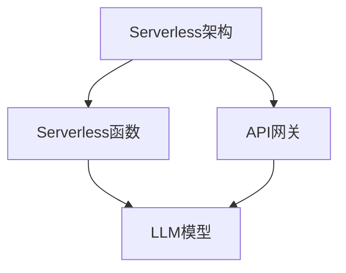

                 

# 《serverless架构在LLM应用中的应用前景》

## 关键词

- Serverless架构
- 大型语言模型（LLM）
- 应用前景
- 核心技术
- 实战应用

## 摘要

本文旨在探讨Serverless架构在大型语言模型（LLM）应用中的前景。通过对比Serverless与传统架构的差异，深入分析其优势和发展历程，本文揭示了Serverless架构在LLM开发、部署和优化中的独特价值。随后，本文讲解了LLM的核心算法原理、数学模型与公式，并通过实际案例展示了LLM在Serverless架构中的应用。最后，本文总结了Serverless架构在LLM应用中的挑战与机遇，并展望了未来的发展趋势与方向。

## 第一部分：基础知识

### 第一章：Serverless架构概述

#### 1.1 Serverless架构的原理与优势

Serverless架构是一种无需管理服务器即可运行代码的计算服务。它由云计算服务提供商提供，用户只需上传代码，无需关心底层基础设施的管理。Serverless架构具有以下优势：

1. **按需扩展**：自动根据请求量扩展计算资源，无需人工干预。
2. **低成本**：按实际使用量计费，无需支付闲置资源费用。
3. **无需管理**：无需关注服务器维护、更新和扩容等繁琐工作。

#### 1.2 Serverless架构与传统架构的区别

传统架构中，开发者需要购买、配置和维护服务器。而Serverless架构由云服务提供商管理，开发者只需关注代码编写。以下是两者之间的主要区别：

1. **资源管理**：传统架构需要手动管理服务器，而Serverless架构自动管理。
2. **计费模式**：传统架构按预付费用计费，Serverless架构按实际使用量计费。
3. **灵活性**：传统架构扩展资源较为复杂，Serverless架构扩展资源更加便捷。

#### 1.3 Serverless架构的发展历程

Serverless架构起源于2012年，由亚马逊推出AWS Lambda。此后，其他云服务提供商如微软Azure、谷歌Cloud也相继推出了类似的服务。近年来，随着云计算和容器技术的发展，Serverless架构逐渐成为主流。

### 第二章：LLM概述

#### 2.1 LLM的概念与分类

LLM（Large Language Model）是指大型语言模型，是一种能够理解和生成自然语言的人工智能模型。根据训练数据和目标任务，LLM可以分为以下几类：

1. **通用语言模型**：如GPT、BERT，用于生成文本、回答问题等。
2. **专用语言模型**：如BERT用于文本分类、情感分析等。

#### 2.2 LLM的工作原理

LLM的工作原理主要基于深度学习和自然语言处理技术。以下是LLM的简要工作原理：

1. **数据预处理**：对输入文本进行分词、编码等预处理。
2. **模型训练**：使用大规模语料库训练神经网络模型。
3. **预测与生成**：输入文本后，模型根据训练结果生成预测结果。

#### 2.3 LLM的应用场景

LLM在各个领域具有广泛的应用，包括：

1. **智能客服**：通过自然语言处理技术，实现自动问答、客户服务等功能。
2. **文本分类**：对大量文本进行分类，如新闻分类、情感分析等。
3. **机器翻译**：将一种语言的文本翻译成另一种语言。

## 第二部分：核心技术

### 第三章：Serverless架构与LLM的结合

#### 3.1 Serverless架构在LLM开发中的优势

Serverless架构在LLM开发中具有以下优势：

1. **快速部署**：无需关注服务器配置，快速部署LLM模型。
2. **弹性扩展**：自动根据请求量扩展计算资源，确保模型运行效率。

#### 3.2 Serverless架构在LLM部署中的优势

Serverless架构在LLM部署中具有以下优势：

1. **低成本**：按实际使用量计费，降低部署成本。
2. **高可用性**：自动进行故障转移和备份，提高系统可靠性。

#### 3.3 Serverless架构在LLM优化中的应用

Serverless架构在LLM优化中具有以下应用：

1. **自动扩容与缩容**：根据负载自动调整计算资源，提高资源利用率。
2. **性能优化**：通过优化代码和模型，提高LLM运行效率。

### 第四章：核心算法原理讲解

#### 4.1 Transformer算法原理

Transformer算法是一种基于自注意力机制的深度神经网络模型，常用于处理序列数据。其核心思想是利用自注意力机制，将序列中的每个元素与其余元素进行交互，从而实现序列建模。

#### 4.2 BERT算法原理

BERT（Bidirectional Encoder Representations from Transformers）是一种基于Transformer算法的双向编码器，主要用于文本分类、问答等任务。BERT通过预训练和微调，能够获取丰富的语言知识和语义信息。

#### 4.3 GPT算法原理

GPT（Generative Pre-trained Transformer）是一种基于Transformer算法的生成模型，主要用于文本生成、对话系统等任务。GPT通过预训练和生成，能够生成连贯、自然的文本。

### 第五章：数学模型与公式

#### 5.1 自注意力机制数学模型

自注意力机制是一种将序列中的每个元素与其余元素进行交互的机制。其数学模型如下：

$$
\text{Attention}(Q, K, V) = \text{softmax}\left(\frac{QK^T}{\sqrt{d_k}}\right)V
$$

其中，$Q, K, V$分别为查询、键和值向量，$d_k$为键向量的维度。

#### 5.2 自适应学习率优化公式

自适应学习率优化算法，如Adam，能够根据梯度信息动态调整学习率。其优化公式如下：

$$
m_t = \beta_1m_{t-1} + (1 - \beta_1)\frac{\partial L}{\partial \theta} \\
v_t = \beta_2v_{t-1} + (1 - \beta_2)\left(\frac{\partial L}{\partial \theta}\right)^2 \\
\theta_t = \theta_{t-1} - \frac{\alpha}{\sqrt{1 - \beta_2^t}}\frac{m_t}{\sqrt{v_t}}
$$

其中，$m_t, v_t$分别为一阶和二阶矩估计，$\beta_1, \beta_2, \alpha$为超参数。

#### 5.3 损失函数与优化算法

在LLM训练过程中，常用的损失函数为交叉熵损失函数。其数学模型如下：

$$
L = -\sum_{i=1}^n y_i \log(p_i)
$$

其中，$y_i$为真实标签，$p_i$为预测概率。

优化算法如梯度下降、Adam等，通过迭代更新模型参数，使损失函数最小化。

## 第三部分：实战应用

### 第六章：LLM在Serverless架构中的应用案例

#### 6.1 案例一：智能客服系统

智能客服系统利用Serverless架构部署LLM模型，实现自动问答功能。通过API网关接收用户提问，调用Serverless函数处理提问，返回答案。

#### 6.2 案例二：智能语音助手

智能语音助手使用Serverless架构部署语音识别和LLM模型。通过语音识别将用户语音转换为文本，调用Serverless函数处理文本，生成语音回复。

#### 6.3 案例三：文本分类与情感分析

文本分类与情感分析利用Serverless架构部署LLM模型，对大量文本进行分类和情感分析。通过API网关接收文本数据，调用Serverless函数处理文本，返回分类结果和情感分析结果。

### 第七章：实战项目开发

#### 7.1 项目背景与目标

项目背景：开发一个基于Serverless架构的智能客服系统，实现自动问答功能。

项目目标：搭建开发环境，实现智能客服系统的功能，并进行测试和优化。

#### 7.2 项目开发流程

1. 环境搭建：选择合适的云服务提供商（如AWS），搭建开发环境。
2. 模型训练：使用大规模语料库训练LLM模型。
3. API开发：使用Serverless框架（如Serverless Framework）开发API网关和Serverless函数。
4. 部署上线：将智能客服系统部署到Serverless架构中。
5. 测试优化：对智能客服系统进行测试，并根据反馈进行优化。

#### 7.3 项目实现细节

1. 开发环境：选择AWS Lambda作为Serverless函数，API Gateway作为API网关。
2. 模型选择：使用BERT模型作为LLM模型。
3. API设计：设计问答API，接收用户提问，返回答案。

#### 7.4 项目测试与优化

1. 功能测试：测试智能客服系统的问答功能，确保答案准确。
2. 性能优化：根据实际需求，调整模型参数和服务器配置，提高系统性能。
3. 稳定性优化：对Serverless架构进行故障转移和备份，确保系统高可用性。

### 第八章：总结与展望

#### 8.1 Serverless架构在LLM应用中的挑战与机遇

挑战：

1. **性能瓶颈**：Serverless架构的性能可能受到请求量、响应时间等因素的影响。
2. **成本管理**：合理分配资源，避免过度使用导致成本增加。

机遇：

1. **弹性扩展**：根据需求自动调整计算资源，提高系统效率。
2. **低成本**：按实际使用量计费，降低部署成本。

#### 8.2 未来发展趋势与方向

1. **混合架构**：结合Serverless架构和传统架构，实现更好的性能和成本优化。
2. **AI能力提升**：持续优化LLM模型，提高其性能和应用范围。

## 核心概念与联系

### Serverless架构与LLM的核心关系

以下是Serverless架构与LLM的核心关系流程图：

## 作者信息

作者：AI天才研究院/AI Genius Institute & 禅与计算机程序设计艺术 /Zen And The Art of Computer Programming

