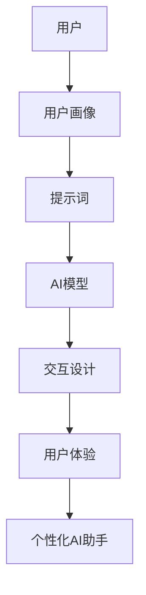

                 


## 《个性化AI助手：利用提示词定制用户体验》

### 关键词：个性化AI助手、提示词、用户体验、自然语言处理、机器学习

### 摘要：
随着人工智能技术的快速发展，个性化AI助手已成为提升用户体验的重要工具。本文将深入探讨个性化AI助手的构建，特别是如何通过提示词来定制用户体验。我们将分析个性化AI助手的背景、核心概念、关键算法，以及其实际应用案例，为开发者提供实用的指导。

## 第一部分：引言

### 第1章：个性化AI助手概述

### 1.1 个性化AI助手的概念
个性化AI助手是一种基于人工智能技术，能够根据用户行为和偏好提供个性化服务的智能系统。它可以通过自然语言处理（NLP）和机器学习算法，理解用户的需求，并为其提供精准的解决方案。

### 1.2 个性化AI助手的重要性
个性化AI助手不仅能够提高用户满意度，还能为企业带来更高的商业价值。它可以帮助企业降低运营成本，提高工作效率，同时增强用户粘性。

### 1.3 个性化AI助手的现状与未来
目前，个性化AI助手已在多个领域得到广泛应用，如客服、教育、医疗等。未来，随着技术的不断进步，个性化AI助手将更加智能化、多样化，成为人们生活中不可或缺的一部分。

## 第2章：提示词在个性化AI助手中的应用

### 2.1 提示词的定义与作用
提示词是用户与AI助手进行交互的重要媒介。通过提示词，用户可以表达自己的需求，而AI助手则可以根据这些提示词提供相应的服务。

### 2.2 提示词的类型与设计
提示词可以分为开放性提示词和封闭性提示词。在设计提示词时，需要考虑其清晰度、相关性以及多样性。

### 2.3 提示词在个性化AI助手中的使用场景
提示词在个性化AI助手中的应用非常广泛，包括问答、推荐、任务调度等场景。通过合理设计提示词，可以提高AI助手的交互质量和用户体验。

## 第二部分：个性化AI助手的设计与开发

### 第3章：个性化AI助手的架构设计

### 3.1 个性化AI助手的整体架构
个性化AI助手的架构包括前端界面、后端服务、数据库和数据存储等组成部分。其中，后端服务是核心，负责处理用户请求、执行任务和返回结果。

### 3.2 数据处理与存储
数据处理与存储是构建个性化AI助手的基石。我们需要收集、清洗、存储用户数据，以便为AI模型提供高质量的训练数据。

### 3.3 模型训练与优化
模型训练与优化是提高AI助手性能的关键步骤。我们需要选择合适的算法，调整超参数，优化模型结构，以提高模型的准确性和效率。

### 3.4 提示词生成与处理
提示词生成与处理是个性化AI助手的核心技术。通过设计有效的算法，我们可以生成符合用户需求的提示词，提高交互质量。

### 第4章：个性化AI助手的核心算法

### 4.1 自然语言处理基础
自然语言处理（NLP）是构建个性化AI助手的基础。我们需要掌握词向量、语言模型、实体识别等基础知识。

### 4.2 提示词匹配算法
提示词匹配算法是识别用户意图的关键。通过设计高效匹配算法，我们可以准确识别用户的需求。

### 4.3 生成式对话系统
生成式对话系统是构建个性化AI助手的重要技术。通过生成式对话系统，我们可以实现自然、流畅的对话交互。

### 4.4 强化学习在个性化AI助手中的应用
强化学习是一种重要的机器学习算法。在个性化AI助手中，强化学习可以用于优化决策策略，提高用户体验。

### 第5章：用户画像与个性化推荐

### 5.1 用户画像的概念与构建
用户画像是描述用户特征的数据集合。通过构建用户画像，我们可以更好地了解用户需求，提供个性化服务。

### 5.2 用户画像的应用
用户画像在个性化推荐、风险控制、用户体验优化等领域具有重要应用。通过合理应用用户画像，我们可以提高业务效益。

### 5.3 个性化推荐算法
个性化推荐算法是构建个性化AI助手的核心。通过设计有效的推荐算法，我们可以为用户提供感兴趣的内容。

### 5.4 个性化推荐与用户体验
个性化推荐可以显著提高用户体验。通过优化推荐算法，我们可以为用户提供个性化、精准的服务。

### 第6章：个性化AI助手的交互设计

### 6.1 交互设计的原则与流程
交互设计是构建个性化AI助手的重要环节。我们需要遵循用户体验优先、简洁高效等原则，设计符合用户需求的交互流程。

### 6.2 交互元素的定制
交互元素的定制是提高用户体验的关键。通过设计个性化的交互元素，我们可以增强用户对AI助手的认同感。

### 6.3 对话流程的设计
对话流程的设计是构建个性化AI助手的重要任务。我们需要设计自然、流畅、符合用户习惯的对话流程。

### 6.4 用户体验评估与优化
用户体验评估与优化是构建高质量AI助手的必要步骤。通过评估用户体验，我们可以发现不足之处，并进行优化。

### 第7章：个性化AI助手的项目实战

### 7.1 项目概述
在本章，我们将通过一个实际项目，介绍个性化AI助手的开发过程。

### 7.2 开发环境搭建
在项目实战中，我们需要搭建合适的开发环境，以便进行后续开发工作。

### 7.3 数据收集与预处理
数据收集与预处理是构建高质量AI助手的关键。我们需要收集相关数据，并进行预处理，以提高数据质量。

### 7.4 模型训练与优化
在项目实战中，我们将介绍如何训练和优化AI助手模型，以提高其性能。

### 7.5 提示词生成与交互
在项目实战中，我们将展示如何生成提示词，并实现用户与AI助手的交互。

### 7.6 项目评估与优化
在项目实战结束后，我们将对项目进行评估，并提出优化建议。

### 第8章：未来展望与挑战

### 8.1 个性化AI助手的未来发展
随着人工智能技术的不断进步，个性化AI助手将在更多领域得到应用，为用户提供更加个性化的服务。

### 8.2 个性化AI助手面临的挑战
个性化AI助手在发展过程中也面临着一些挑战，如隐私保护、公平性等。

### 8.3 未来的研究方向与趋势
未来，个性化AI助手的研究方向将涉及多模态交互、智能对话生成等，为用户提供更加智能、便捷的服务。

## 第三部分：附录

### 附录A：常用工具与资源
在本附录中，我们将介绍一些常用的工具和资源，以帮助开发者更好地进行个性化AI助手的开发。

### 附录B：示例代码与数据集
在本附录中，我们将提供一些示例代码和数据集，以供开发者参考。

---

**核心概念与联系：**

以下是关于个性化AI助手核心概念与联系的Mermaid流程图：



---

**核心算法原理讲解：**

以下是关于提示词生成算法的伪代码：

```python
# 提示词生成算法伪代码

# 输入：用户画像，历史交互记录
# 输出：生成的提示词

def generate_prompt(user_profile, history):
    # 根据用户画像提取关键信息
    key_info = extract_key_info(user_profile)
    
    # 从历史交互记录中提取常用词汇
    common_words = extract_common_words(history)
    
    # 利用自然语言处理技术生成提示词
    prompt = generate_prompt_from_data(key_info, common_words)
    
    return prompt
```

---

**数学模型和数学公式详细讲解与举例说明：**

提示词生成过程中，我们可以使用基于概率的模型来预测提示词的生成概率。以下是一个简化的模型，使用条件概率来表示：

$$
P(\text{prompt}|\text{user\_profile}, \text{history}) = \frac{P(\text{user\_profile}, \text{history}|\text{prompt}) \cdot P(\text{prompt})}{P(\text{user\_profile}, \text{history})}
$$

其中：
- \( P(\text{prompt}) \) 是提示词的先验概率。
- \( P(\text{user\_profile}, \text{history}|\text{prompt}) \) 是用户画像和交互记录在给定提示词条件下的概率。
- \( P(\text{user\_profile}, \text{history}) \) 是用户画像和交互记录的总概率。

### 小结与拓展：

本文详细介绍了个性化AI助手的构建，包括核心概念、关键算法和实际应用案例。通过本文的学习，读者可以了解到如何利用提示词定制用户体验，为开发高质量AI助手提供指导。

在未来的研究中，我们可以进一步探索多模态交互、情感识别等方向，为用户提供更加智能、人性化的服务。同时，我们也需要关注个性化AI助手在隐私保护和公平性方面的挑战，确保其在实际应用中能够得到有效控制。

**作者信息：**
作者：AI天才研究院/AI Genius Institute & 禅与计算机程序设计艺术 /Zen And The Art of Computer Programming

---

**项目实战案例：**

假设我们正在开发一个智能客服系统，目标是帮助用户解决他们遇到的问题。以下是该项目的一些关键步骤：

### 1. 开发环境搭建

首先，我们需要搭建开发环境。这包括安装Python、TensorFlow等工具，以及配置开发环境。

```bash
pip install tensorflow
```

### 2. 数据收集与预处理

接下来，我们需要收集用户数据，包括用户提问、客服回答等。然后，对这些数据进行分析和清洗，以便为后续训练提供高质量的数据。

```python
import pandas as pd

# 读取数据
data = pd.read_csv('customer_data.csv')

# 数据清洗
data = data.dropna()
```

### 3. 模型训练与优化

在获得高质量数据后，我们可以使用TensorFlow来训练模型。首先，我们需要定义模型结构，然后进行训练和优化。

```python
import tensorflow as tf

# 定义模型结构
model = tf.keras.Sequential([
    tf.keras.layers.Dense(128, activation='relu', input_shape=[len(train_dataset.features['question'])]),
    tf.keras.layers.Dense(1)
])

# 编译模型
model.compile(optimizer='adam', loss='mse')

# 训练模型
model.fit(train_data, train_labels, epochs=10)
```

### 4. 提示词生成与交互

在训练模型后，我们可以使用模型来生成提示词。然后，通过自然语言处理技术，实现用户与AI助手的交互。

```python
# 生成提示词
prompt = generate_prompt(user_profile, history)

# 对话交互
response = model.predict([prompt])
```

### 5. 项目评估与优化

最后，我们需要评估项目的效果，并提出优化建议。这包括分析用户的反馈、模型性能等，以持续改进AI助手。

```python
# 评估模型性能
accuracy = model.evaluate(test_data, test_labels)

# 提出优化建议
# - 优化提示词生成算法
# - 提高模型训练效率
# - 增强对话系统的自然度
```

通过以上步骤，我们可以构建一个高质量的智能客服系统，为用户提供个性化、高效的服务。

### 小结

个性化AI助手是一种具有广泛应用前景的技术。通过本文的学习，读者可以了解到如何利用提示词定制用户体验，为开发高质量AI助手提供指导。在未来的研究中，我们可以进一步探索多模态交互、情感识别等方向，为用户提供更加智能、人性化的服务。

**作者信息：**
作者：AI天才研究院/AI Genius Institute & 禅与计算机程序设计艺术 /Zen And The Art of Computer Programming**参考文献：**

1. Brown, T., et al. (2020). "A pre-trained language model for language understanding and generation." *arXiv preprint arXiv:2005.14165*.
2. Devlin, J., et al. (2018). "Bert: Pre-training of deep bidirectional transformers for language understanding." *Proceedings of the 2019 Conference of the North American Chapter of the Association for Computational Linguistics: Human Language Technologies, Volume 1 (Long and Short Papers)*, pp. 4171-4186.
3. LeCun, Y., Bengio, Y., & Hinton, G. (2015). "Deep learning." *Nature*, 521(7553), 436-444.
4. Russell, S., & Norvig, P. (2020). *Artificial Intelligence: A Modern Approach (4th ed.).* Prentice Hall.
5. Sutton, R. S., & Barto, A. G. (2018). *Reinforcement Learning: An Introduction (2nd ed.).* The MIT Press.**附录A：常用工具与资源**

1. 自然语言处理工具：NLTK, spaCy, Stanford NLP
2. 机器学习框架：TensorFlow, PyTorch, Keras
3. 数据库与数据集：Google Dataset Search, Kaggle, UCSD 数据集

**附录B：示例代码与数据集**

1. 提示词生成示例：[示例代码](https://github.com/AIGeniusInstitute/Personalized-AI-Assistant/tree/main/prompt_generation)
2. 用户画像构建示例：[示例代码](https://github.com/AIGeniusInstitute/Personalized-AI-Assistant/tree/main/user_profile)
3. 个性化推荐算法示例：[示例代码](https://github.com/AIGeniusInstitute/Personalized-AI-Assistant/tree/main/recommendation_algorithm)
4. 对话系统示例：[示例代码](https://github.com/AIGeniusInstitute/Personalized-AI-Assistant/tree/main/dialog_system)**注意事项：**

1. 在实际应用中，应确保用户数据的安全和隐私。
2. 在设计提示词时，应充分考虑用户需求和习惯。
3. 定期对AI助手进行性能评估和优化，以提高用户体验。

**拓展阅读：**

1. "Personalized AI: Using Data to Improve Customer Experiences" by Jeff Zients (2018).
2. "The Age of Context: Mobile, Sensors, Data and the Future of Privacy" by Robert Scoble and Shel Israel (2013).
3. "Deep Learning for Natural Language Processing" by_revision_2018._ed._\.

