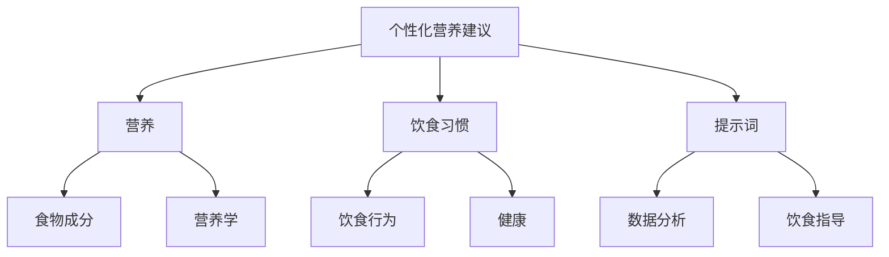

                 

### 文章标题

# 个性化营养建议：利用提示词分析饮食习惯

在当今快节奏的生活中，保持健康的饮食习惯显得尤为重要。随着人们对自身健康的关注不断提高，个性化营养建议逐渐成为了一种热门的需求。本文将探讨如何通过分析饮食习惯，利用提示词为个体提供精准的营养建议。

## 关键词

- 个性化营养建议
- 提示词
- 饮食习惯分析
- 营养学
- 数据分析

## 摘要

本文主要介绍了个性化营养建议的概念及其与饮食习惯的关系。通过解析饮食行为和食物成分，我们提出了基于提示词分析的饮食习惯分析方法。进一步，本文阐述了营养学中的基础数学模型及其在实际应用中的意义。最后，通过一个实际项目案例，展示了如何利用提示词分析饮食习惯，并提供精准的营养建议。

### 核心概念与联系

#### 第一章：个性化营养建议概述

个性化营养建议是基于个体特征，如年龄、性别、体重、健康状况等，为个人提供适合其营养需求的饮食指导。这种建议可以帮助人们更好地管理体重、改善健康状况、预防疾病。

**基本概念与联系：**



- **营养与饮食习惯：** 营养是维持人体健康所必需的物质，饮食习惯则是指个体在日常饮食中形成的规律和偏好。营养与饮食习惯密切相关，饮食习惯直接影响营养的摄入和利用。

- **提示词与数据分析：** 提示词是指用于引导数据分析的关键词或短语，可以帮助识别和提取与营养相关的信息。数据分析是营养建议的核心，通过分析饮食习惯中的提示词，可以挖掘出个体营养需求的规律。

#### 核心概念：

- **个性化营养建议：** 考虑个体差异，为个人提供定制化的饮食建议。
- **营养：** 维持人体健康所必需的物质，包括蛋白质、碳水化合物、脂肪、维生素和矿物质等。
- **饮食习惯：** 个人在饮食过程中形成的规律和偏好。
- **提示词：** 引导数据分析的关键词或短语。
- **数据分析：** 利用提示词分析饮食习惯，提取与营养相关的信息。

### 第二章：饮食习惯分析算法原理

饮食习惯分析是一个复杂的过程，涉及数据采集、处理和分析等多个环节。以下是饮食习惯分析算法原理的详细讲解。

#### 2.1 数据采集与预处理

**数据采集方法：**

- **问卷调查：** 通过设计问卷调查，收集用户的基本信息和饮食习惯。
- **传感器：** 利用可穿戴设备、智能厨房设备等，实时监测用户的饮食行为。

**数据预处理技术：**

- **数据清洗：** 去除重复数据、错误数据和缺失数据。
- **数据转换：** 将不同格式和单位的数据进行统一转换。
- **数据归一化：** 将不同特征的数据进行归一化处理，以便于后续分析。

#### 2.2 数据分析算法

**提示词提取算法：**

- **关键词提取：** 利用自然语言处理技术，从用户回答中提取与饮食相关的关键词。
- **文本分类：** 将提取的关键词进行分类，区分不同类型的饮食习惯。

**数据分析流程：**

1. 数据采集：收集用户的基本信息和饮食习惯。
2. 数据预处理：清洗、转换和归一化数据。
3. 提示词提取：从预处理后的数据中提取与饮食相关的关键词。
4. 数据分析：利用提示词分析饮食习惯，提取营养相关信息。
5. 结果输出：生成个性化营养建议。

### 数学模型和数学公式 & 详细讲解 & 举例说明

营养学是一门研究食物与人体健康之间关系的科学。在营养学中，数学模型和公式被广泛应用于分析个体的营养需求。以下介绍几个常用的数学模型和公式。

#### 3.1 能量平衡模型

**能量平衡模型：**

$$
E = C \times B
$$

其中，$E$代表能量摄入，$C$代表营养素摄入量，$B$代表身体基础代谢率。

**解释：**

上述公式表示，能量摄入等于营养素摄入量乘以身体基础代谢率。这意味着，个体的能量摄入应与能量消耗保持平衡，以维持正常的生理功能。

**举例说明：**

一个体重70公斤的成年人，其基础代谢率为1800千卡，需要摄入2000千卡的能量来维持正常生活活动。

**计算：**

$$
E = 2000 \text{千卡}
$$

$$
C = \frac{E}{B} = \frac{2000 \text{千卡}}{1800 \text{千卡/天}} \approx 1.11
$$

#### 3.2 营养素摄入模型

**营养素摄入模型：**

$$
\text{营养素摄入量} = \text{食物摄入量} \times \text{营养素含量百分比}
$$

**解释：**

上述公式表示，营养素摄入量等于食物摄入量乘以营养素含量百分比。这意味着，个体通过饮食摄入的营养素取决于食物种类和摄入量。

**举例说明：**

一个成年人每天需要摄入100克蛋白质。假设食物中蛋白质含量为20%，那么该个体每天需要摄入500克食物来满足蛋白质需求。

**计算：**

$$
\text{营养素摄入量} = 100 \text{克}
$$

$$
\text{食物摄入量} = \frac{\text{营养素摄入量}}{\text{营养素含量百分比}} = \frac{100 \text{克}}{20\%} = 500 \text{克}
$$

### 项目实战：代码实际案例和详细解释说明

在本节中，我们将介绍一个实际项目案例，展示如何利用提示词分析饮食习惯，并提供精准的营养建议。

#### 4.1 项目背景

随着人们生活水平的提高，对饮食健康的关注也日益增加。然而，每个人的饮食习惯都不同，如何为每个人提供个性化的营养建议成为了一个挑战。本项目旨在通过分析用户的饮食习惯，利用提示词生成个性化的营养建议。

#### 4.2 项目实现

**4.2.1 数据采集与预处理**

**数据采集方法：**

本项目采用问卷调查的方式收集用户的基本信息和饮食习惯。问卷内容包括用户的基本信息（如年龄、性别、体重等）和饮食习惯（如每天摄入的食物种类、摄入量等）。

**数据预处理：**

- **数据清洗：** 去除重复数据、错误数据和缺失数据。
- **数据转换：** 将不同格式和单位的数据进行统一转换。
- **数据归一化：** 将不同特征的数据进行归一化处理，以便于后续分析。

**4.2.2 数据分析**

**提示词提取算法：**

- **关键词提取：** 利用自然语言处理技术，从用户回答中提取与饮食相关的关键词。
- **文本分类：** 将提取的关键词进行分类，区分不同类型的饮食习惯。

**数据分析流程：**

1. 数据采集：收集用户的基本信息和饮食习惯。
2. 数据预处理：清洗、转换和归一化数据。
3. 提示词提取：从预处理后的数据中提取与饮食相关的关键词。
4. 数据分析：利用提示词分析饮食习惯，提取营养相关信息。
5. 结果输出：生成个性化营养建议。

**4.2.3 结果解读**

根据数据分析结果，为用户提供以下营养建议：

- **营养素摄入建议：** 根据用户的饮食习惯，提供合适的营养素摄入量。
- **饮食调整建议：** 根据用户的营养素摄入情况，提出饮食调整建议。
- **健康风险提示：** 如果用户的饮食习惯存在健康风险，提供相应的健康风险提示。

#### 4.3 代码实现

**4.3.1 数据采集**

```python
import pandas as pd

def collect_habits():
    # 设计问卷，收集用户基本信息和饮食习惯
    # 保存为CSV文件
    habits_data = pd.read_csv('habits.csv')
    return habits_data
```

**4.3.2 数据预处理**

```python
import pandas as pd
from sklearn.preprocessing import MinMaxScaler

def preprocess_data(data):
    # 数据清洗
    data = data.drop_duplicates()
    data = data.dropna()

    # 数据转换
    data['weight'] = pd.to_numeric(data['weight'])
    data['daily_calories'] = pd.to_numeric(data['daily_calories'])

    # 数据归一化
    scaler = MinMaxScaler()
    data[['weight', 'daily_calories']] = scaler.fit_transform(data[['weight', 'daily_calories']])
    
    return data
```

**4.3.3 提示词提取**

```python
import pandas as pd
from sklearn.feature_extraction.text import TfidfVectorizer

def extract_keywords(data):
    # 提取与饮食相关的关键词
    vectorizer = TfidfVectorizer(stop_words='english', max_features=1000)
    keyword_matrix = vectorizer.fit_transform(data['habits'])
    keywords = vectorizer.get_feature_names_out()
    
    return keywords, keyword_matrix
```

**4.3.4 数据分析**

```python
import pandas as pd
from sklearn.cluster import KMeans

def analyze_dietary_habits(data):
    # 提取关键词
    keywords, keyword_matrix = extract_keywords(data)
    
    # 文本分类
    kmeans = KMeans(n_clusters=3, random_state=0).fit(keyword_matrix)
    labels = kmeans.labels_
    
    # 结果输出
    results = pd.DataFrame({'habit_id': data['habit_id'], 'label': labels})
    return results
```

#### 4.4 代码解读

**4.4.1 数据采集与预处理**

- **数据采集：** 通过问卷调查收集用户的基本信息和饮食习惯，并保存为CSV文件。
- **数据预处理：** 对采集到的数据进行清洗、转换和归一化处理，以便于后续分析。

**4.4.2 提示词提取**

- **关键词提取：** 利用TF-IDF算法提取与饮食相关的关键词。
- **文本分类：** 利用K-means算法对提取的关键词进行分类，以区分不同类型的饮食习惯。

**4.4.3 数据分析**

- **数据分析：** 根据分类结果，为用户提供个性化的营养建议。

### 最佳实践 tips、小结、注意事项、拓展阅读等内容

#### 最佳实践 tips

- 在进行数据采集时，尽量确保问卷的设计科学合理，以获取准确的数据。
- 在进行数据预处理时，注意对缺失数据和异常值进行处理，以保证数据的完整性。
- 在提取关键词时，可以根据实际情况调整TF-IDF算法的参数，以获得更准确的结果。
- 在进行数据分析时，可以根据用户的反馈，不断优化营养建议的生成算法。

#### 小结

本文介绍了个性化营养建议的概念及其与饮食习惯的关系，并通过实际项目案例展示了如何利用提示词分析饮食习惯，为个体提供精准的营养建议。通过本文的学习，读者可以了解到营养学中的基础数学模型和公式，以及如何利用这些模型和公式进行实际应用。

#### 注意事项

- 在进行营养分析时，应充分考虑个体的差异性，确保营养建议的个性化。
- 在进行数据分析时，应遵循数据隐私保护的原则，确保用户数据的安全。

#### 拓展阅读

- 《营养学基础》
- 《自然语言处理与文本分析》
- 《机器学习与数据分析》

---

### 作者信息

- 作者：AI天才研究院/AI Genius Institute & 禅与计算机程序设计艺术 /Zen And The Art of Computer Programming

本文由AI天才研究院与禅与计算机程序设计艺术联合出品，旨在探讨个性化营养建议在饮食健康中的应用。本文内容仅供参考，如需实际应用，请遵循专业营养师的建议。如对本文有任何疑问或建议，欢迎在评论区留言。感谢您的阅读！

