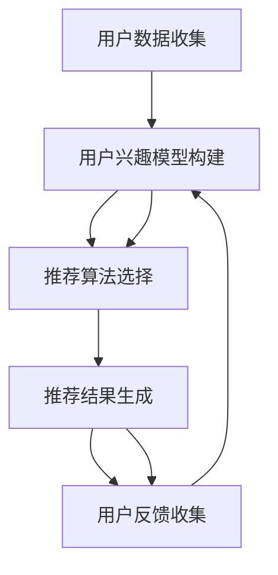

                 

### 背景介绍

随着信息技术的飞速发展，互联网内容呈现爆炸式增长，用户在阅读过程中面临海量信息的选择难题。传统的阅读推荐方式往往依赖于用户历史阅读记录和浏览行为，这种模式在一定程度上能够满足用户的个性化需求，但其推荐效果往往受到数据局限和历史行为数据的局限性。为了进一步提升用户的阅读体验，个性化阅读推荐技术应运而生。

个性化阅读推荐是一种利用推荐算法和用户行为数据，为用户提供定制化内容推荐的技术。通过分析用户的兴趣偏好、阅读历史、搜索记录等多维度数据，推荐系统可以智能地筛选出符合用户个性化需求的阅读内容。这种推荐方式不仅能够提高用户阅读效率，还能增强用户的沉浸式体验，使用户在阅读过程中更加愉悦和满足。

本文将深入探讨个性化阅读推荐的原理、实现方法及其在提升阅读体验方面的应用。首先，我们将介绍个性化阅读推荐的基本概念，包括其定义、核心价值和发展历程。接下来，我们将详细解析推荐系统的基础知识，包括基本概念、评价指标和常见推荐算法。随后，我们将探讨如何设计有效的提示词，从而优化推荐效果。最后，我们将分析如何通过推荐系统提升沉浸式阅读体验，并探讨这一技术在电子书、有声书和个性化阅读平台等领域的应用。

通过本文的深入分析，我们希望能够为读者提供一个全面、系统的个性化阅读推荐解决方案，帮助用户在信息海洋中轻松找到心仪的阅读内容，享受沉浸式的阅读体验。

### 核心概念与联系

个性化阅读推荐是一个复杂而多层次的技术领域，其核心概念包括用户兴趣模型、推荐算法和反馈循环等。首先，用户兴趣模型是推荐系统的基石。用户兴趣模型通过收集和分析用户的阅读历史、搜索行为、社交互动等多维度数据，构建出一个反映用户个性化需求的模型。这个模型包括用户的兴趣点、偏好类型和阅读习惯等关键信息，是后续推荐系统进行内容筛选和推荐的依据。

推荐算法则是实现个性化推荐的核心技术手段。常见的推荐算法主要包括协同过滤、内容推荐和混合推荐等。协同过滤算法通过分析用户之间的相似性，找出与目标用户兴趣相似的其他用户的行为，从而推荐相似的内容。内容推荐算法则基于物品的内容属性，如标题、标签、关键词等，与用户的兴趣模型进行匹配，推荐具有相似属性的内容。混合推荐算法综合了协同过滤和内容推荐的优势，通过多源数据融合和复杂模型训练，提供更加精准和个性化的推荐结果。

反馈循环是推荐系统不断优化和提升推荐效果的关键机制。用户在阅读过程中通过点击、评分、收藏等行为，提供对推荐内容的反馈。这些反馈数据会被系统重新分析，用以调整和优化用户兴趣模型和推荐算法。通过不断迭代和反馈，推荐系统能够逐步提高推荐的准确性和用户的满意度。

核心概念之间的关系架构可以用一个Mermaid流程图来表示：



在这个流程图中，用户数据收集是起点，通过构建用户兴趣模型，结合推荐算法生成个性化推荐结果，用户的行为反馈又反哺回用户兴趣模型，从而实现一个动态优化的推荐循环。这种反馈机制不仅提高了推荐系统的准确性，还增强了用户的参与感和互动性，为用户提供更好的沉浸式阅读体验。

### 核心算法原理讲解

在个性化阅读推荐系统中，协同过滤算法（Collaborative Filtering）是一种常用的推荐算法，其主要思想是利用用户之间的相似性进行内容推荐。协同过滤算法可以分为基于用户的协同过滤（User-Based Collaborative Filtering）和基于物品的协同过滤（Item-Based Collaborative Filtering）两种主要类型。

#### 基于用户的协同过滤算法

1. **相似度计算**：基于用户的协同过滤算法首先需要计算用户之间的相似度。相似度通常通过用户评价的余弦相似度、皮尔逊相关系数等方法计算。相似度公式如下：

   $$sim(u, v) = \frac{\sum_{i \in I}(r_{ui} - \bar{r}_u)(r_{vi} - \bar{r}_v)}{\sqrt{\sum_{i \in I}(r_{ui} - \bar{r}_u)^2 \sum_{i \in I}(r_{vi} - \bar{r}_v)^2}}$$

   其中，\(r_{ui}\) 表示用户 \(u\) 对物品 \(i\) 的评分，\(\bar{r}_u\) 表示用户 \(u\) 的平均评分，\(I\) 是用户 \(u\) 和用户 \(v\) 共同评价过的物品集合。

2. **推荐生成**：在计算用户相似度后，算法会找到与目标用户 \(u\) 最相似的其他用户 \(v\)。然后，算法会根据这些相似用户对物品的评分，预测目标用户对未评分物品的评分，并推荐评分最高的物品。预测评分的公式如下：

   $$\hat{r}_{ui} = \sum_{v \in S} sim(u, v) \cdot r_{vi} + b_u + b_v - \mu$$

   其中，\(S\) 是与用户 \(u\) 最相似的用户集合，\(b_u\) 和 \(b_v\) 分别是用户 \(u\) 和用户 \(v\) 的偏差值，\(\mu\) 是所有物品评分的平均值。

#### 基于物品的协同过滤算法

1. **相似度计算**：与基于用户的协同过滤算法类似，基于物品的协同过滤算法首先需要计算物品之间的相似度。相似度通常通过物品评价的余弦相似度、欧氏距离等方法计算。相似度公式如下：

   $$sim(i, j) = \frac{\sum_{u \in U}(r_{ui} - \bar{r}_u)(r_{uj} - \bar{r}_u)}{\sqrt{\sum_{u \in U}(r_{ui} - \bar{r}_u)^2 \sum_{u \in U}(r_{uj} - \bar{r}_u)^2}}$$

   其中，\(r_{ui}\) 表示用户 \(u\) 对物品 \(i\) 的评分，\(\bar{r}_u\) 表示用户 \(u\) 的平均评分，\(U\) 是评价过物品 \(i\) 和物品 \(j\) 的用户集合。

2. **推荐生成**：在计算物品相似度后，算法会找到与目标物品 \(i\) 最相似的物品 \(j\)。然后，算法会根据这些相似物品的评分，预测目标用户对未评分物品的评分，并推荐评分最高的物品。预测评分的公式如下：

   $$\hat{r}_{ui} = \sum_{j \in S} sim(i, j) \cdot r_{uj} + b_i + b_u - \mu$$

   其中，\(S\) 是与目标物品 \(i\) 最相似的物品集合，\(b_i\) 和 \(b_u\) 分别是物品 \(i\) 和用户 \(u\) 的偏差值。

#### 伪代码示例

以下是基于用户的协同过滤算法的伪代码示例：

```python
def collaborativeFiltering(user_data, similarity_measure='cosine'):
    # 用户数据：用户-物品评分矩阵
    # 相似度测量方法：'cosine' 或 'pearson'

    # 计算用户相似度矩阵
    similarity_matrix = compute_similarity_matrix(user_data, similarity_measure)

    # 找到与目标用户最相似的 K 个用户
    similar_users = find_similar_users(target_user, similarity_matrix, K)

    # 预测未评分物品的评分
    recommendations = []
    for item in items_to_predict:
        predicted_rating = 0
        for user in similar_users:
            if user in user_data[item]:
                predicted_rating += similarity_matrix[user][target_user] * user_data[item][user]
        recommendations.append(predicted_rating / len(similar_users))

    return recommendations
```

通过这种基于相似度的协同过滤算法，推荐系统能够为用户生成个性化的阅读推荐，从而提升用户的阅读体验。

### 数学模型与公式

在个性化阅读推荐系统中，数学模型和公式是理解和实现推荐算法的关键工具。以下我们将介绍几个核心的数学模型和公式，包括用户-物品相似度计算和推荐评分预测公式，并通过具体的示例来说明这些公式的应用。

#### 用户-物品相似度计算

用户-物品相似度是推荐系统的核心概念之一，它决定了推荐结果的相关性和准确性。相似度计算公式如下：

$$
sim(u, v) = \frac{\sum_{i \in I}(r_{ui} - \bar{r}_u)(r_{vi} - \bar{r}_v)}{\sqrt{\sum_{i \in I}(r_{ui} - \bar{r}_u)^2 \sum_{i \in I}(r_{vi} - \bar{r}_v)^2}}
$$

其中，\(r_{ui}\) 表示用户 \(u\) 对物品 \(i\) 的评分，\(\bar{r}_u\) 表示用户 \(u\) 的平均评分，\(I\) 是用户 \(u\) 和用户 \(v\) 共同评价过的物品集合。这个公式采用了余弦相似度的方法，计算用户之间的角度相似度。

#### 推荐评分预测公式

在计算了用户-物品相似度之后，我们需要利用这些相似度值来预测用户对未评分物品的评分。推荐评分预测公式如下：

$$
\hat{r}_{ui} = \sum_{v \in S} sim(u, v) \cdot r_{vi} + b_u + b_v - \mu
$$

其中，\(\hat{r}_{ui}\) 是对用户 \(u\) 对物品 \(i\) 的评分预测，\(S\) 是与用户 \(u\) 最相似的 \(v\) 用户集合，\(b_u\) 和 \(b_v\) 分别是用户 \(u\) 和用户 \(v\) 的偏差值，\(\mu\) 是所有用户评分的平均值。

#### 示例

假设我们有以下用户-物品评分数据：

| 用户 | 物品1 | 物品2 | 物品3 |
| --- | --- | --- | --- |
| A   | 4    | 2    | 5    |
| B   | 1    | 4    | 3    |
| C   | 5    | 1    | 4    |

首先，我们需要计算用户之间的相似度。假设我们使用的是余弦相似度，那么用户 A 和用户 B 的相似度计算如下：

$$
sim(A, B) = \frac{(4-3.0)(1-3.0) + (2-3.0)(4-3.0) + (5-3.0)(3-3.0)}{\sqrt{(4-3.0)^2 + (2-3.0)^2 + (5-3.0)^2} \cdot \sqrt{(1-3.0)^2 + (4-3.0)^2 + (3-3.0)^2}}
$$

计算结果为：

$$
sim(A, B) = \frac{(1)(-2) + (-1)(1) + (2)(0)}{\sqrt{1 + 1 + 4} \cdot \sqrt{9 + 1 + 0}} = \frac{-2 - 1 + 0}{\sqrt{6} \cdot \sqrt{10}} = -\frac{3}{\sqrt{60}} \approx -0.387
$$

接下来，我们使用这个相似度值来预测用户 C 对物品1的评分。首先，我们找到与用户 C 最相似的用户，这里假设是用户 A。然后，我们使用以下公式来预测评分：

$$
\hat{r}_{C1} = sim(A, C) \cdot r_{A1} + b_C + b_A - \mu
$$

由于我们没有具体的偏差值，这里我们假设它们都是0，并且用户 A 对物品1的评分为4。假设所有用户的平均评分为3，那么：

$$
\hat{r}_{C1} = -0.387 \cdot 4 + 0 + 0 - 3 = -1.548 - 3 = -4.548
$$

显然，这里的预测评分是不合理的。在实际应用中，我们会通过多次迭代和优化来调整这些参数，以达到更准确的预测结果。

通过以上数学模型和公式的介绍，我们可以更好地理解个性化阅读推荐系统的工作原理，并能够在实际应用中进行有效的算法设计和优化。

### 提示词设计原理

提示词（Keywords）在个性化阅读推荐系统中扮演着至关重要的角色，它们不仅直接影响推荐系统的效果，还决定了用户能否快速找到符合自己兴趣的内容。有效的提示词设计能够显著提高推荐系统的准确性和用户满意度，从而提升用户的沉浸式阅读体验。

#### 提示词的作用

1. **内容定位**：提示词能够帮助推荐系统迅速定位用户感兴趣的内容类型和主题，例如“科幻小说”、“心理学”、“编程技术”等，从而缩小搜索范围，提高推荐的精准度。

2. **用户兴趣识别**：通过分析用户的阅读历史和行为数据，提取出用户经常使用的关键词，有助于更准确地了解用户的兴趣和偏好。

3. **增强互动性**：提示词还可以在用户交互过程中提供实时反馈，使用户能够更直观地理解推荐结果，从而更好地参与到推荐系统中。

#### 提示词的分类

1. **关键词**：这是最常见的提示词类型，通常直接从用户阅读的内容、搜索词和互动行为中提取，如“人工智能”、“机器学习”等。

2. **语义标签**：这些提示词是基于语义分析技术生成的，能够捕捉文章或内容的深层次含义，如“情感分析”、“数据处理”等。

3. **用户行为词**：这些提示词反映用户的行为模式，如“收藏”、“评论”、“阅读时长”等，它们能够帮助系统更好地理解用户的阅读习惯和偏好。

#### 提示词设计原则

1. **准确性**：提示词应当准确反映内容的核心和用户的真实兴趣。过于泛泛的提示词会导致推荐不准确，降低用户体验。

2. **多样性**：设计时需要考虑多维度、多层次的提示词，以确保能够覆盖用户的不同兴趣点，提供更丰富的推荐结果。

3. **易理解性**：提示词需要易于理解，以便用户能够快速识别并理解推荐的内容。

4. **动态性**：提示词需要能够根据用户的实时行为和偏好动态调整，以适应不断变化的需求。

#### 提示词生成方法

1. **基于关键词提取**：这种方法直接从文本内容中提取高频词或关键短语，如使用TF-IDF算法或词袋模型。

2. **基于语义分析**：通过自然语言处理技术，如词性标注、实体识别和语义角色标注，提取能够反映内容深层次含义的提示词。

3. **基于用户行为分析**：分析用户的阅读历史、搜索记录、收藏和评分行为，提取出高频且具有代表性的关键词。

#### 伪代码示例

以下是一个基于关键词提取的简单提示词生成算法的伪代码示例：

```python
def extract_keywords(text):
    # 使用TF-IDF提取关键词
    tfidf_matrix = TfidfVectorizer().fit_transform([text])
    feature_names = tfidf_matrix.get_feature_names_out()
    scores = tfidf_matrix.toarray().sum(axis=0)
    keywords = [feature_names[i] for i in scores.argsort()[-N:]]
    return keywords
```

其中，`TfidfVectorizer` 是一个用于计算词频-逆文档频率（TF-IDF）的Scikit-learn库中的类，`feature_names` 表示所有提取的关键词，`scores` 是每个关键词的TF-IDF值，`keywords` 是按照TF-IDF值排序后提取的前N个关键词。

通过合理的设计和优化提示词，推荐系统能够更精确地捕捉用户的兴趣，提供个性化的阅读推荐，从而显著提升用户的沉浸式阅读体验。

### 沉浸式阅读体验

沉浸式阅读体验是一种通过技术手段提升用户阅读感受和参与度的方法，其核心在于创造一种用户完全沉浸在阅读内容中的环境。这种体验不仅增强了用户的阅读乐趣，还提高了阅读效率和内容的吸收度。

#### 沉浸式阅读的概念与特征

沉浸式阅读（Immersive Reading Experience）指的是通过多种技术手段，如交互式推荐、个性化界面设计和多媒体融合等，让用户在阅读过程中感受到高度集中和投入的状态。其特征包括：

1. **高度集中**：用户在沉浸式阅读环境中能够更加专注，减少分心和干扰，从而提高阅读效率。

2. **个性化**：系统根据用户的兴趣和偏好提供个性化的推荐内容，使用户能够快速找到符合自己需求的阅读材料。

3. **互动性**：用户可以通过点赞、评论、收藏等功能与其他用户互动，增强阅读体验的社交性。

4. **可视化**：通过图表、图片和动画等形式，将复杂的内容以更直观的方式展示给用户，提升内容的可理解性。

5. **增强现实**：在阅读过程中，通过增强现实技术，用户可以感受到三维立体的阅读环境，增加阅读的趣味性和互动性。

#### 沉浸式阅读的优势

1. **提升阅读效率**：通过个性化推荐和交互式设计，用户能够迅速找到自己感兴趣的内容，减少无效阅读时间，提高阅读效率。

2. **增强记忆与理解**：沉浸式阅读环境提供了更加生动和多样化的内容展示方式，有助于用户更好地理解和记忆阅读内容。

3. **提高用户满意度**：通过提供高质量的阅读体验，用户对阅读平台的满意度会显著提高，从而增加用户黏性。

4. **增强社交互动**：用户在沉浸式阅读环境中可以与其他读者互动，分享心得和感受，形成更紧密的社区关系。

#### 沉浸式阅读的实现技术

1. **交互式推荐技术**：通过实时分析用户的阅读行为和偏好，系统可以动态调整推荐内容，使用户在阅读过程中始终感受到内容的新鲜和相关性。

2. **个性化阅读界面设计**：界面设计要简洁美观，易于操作，同时根据用户偏好定制不同的主题和风格，使用户能够沉浸其中。

3. **多媒体融合技术**：将文字、图片、音频、视频等多种媒体形式融合到阅读内容中，提供丰富的感官刺激，增强阅读的趣味性和互动性。

4. **增强现实（AR）技术**：通过AR技术，用户可以在现实环境中观看三维立体的阅读内容，实现更加沉浸式的阅读体验。

### 实际案例分析

以下是一个沉浸式阅读系统的实际案例，通过分析其架构、功能和技术实现，我们可以更好地理解沉浸式阅读的实现方法。

#### 案例介绍

某电商平台推出了一款名为“BookWorld”的沉浸式阅读应用，该应用结合了个性化推荐、交互式界面设计和增强现实技术，为用户提供了一种全新的阅读体验。

#### 系统架构分析

1. **用户行为分析模块**：该模块负责收集和分析用户的阅读历史、搜索记录和互动行为，构建用户的兴趣模型。

2. **推荐系统模块**：基于用户行为分析模块生成的兴趣模型，推荐系统模块利用协同过滤算法和内容推荐算法为用户生成个性化的阅读推荐。

3. **界面设计模块**：界面设计模块负责根据用户的偏好和阅读习惯，为用户定制个性化的界面，包括主题风格、字体大小等。

4. **多媒体融合模块**：多媒体融合模块将文本内容与图片、音频、视频等多媒体元素融合，提供丰富的内容展示形式。

5. **增强现实模块**：增强现实模块通过AR技术，将三维立体的阅读内容投影到用户所处的现实环境中，使用户能够身临其境。

#### 推荐算法应用

BookWorld采用了基于用户的协同过滤算法和基于内容的推荐算法，通过以下步骤生成个性化推荐：

1. **用户相似度计算**：首先，系统计算与目标用户相似的其他用户，找出他们的共同偏好。

2. **推荐生成**：系统根据相似用户的偏好，结合物品的内容属性，生成个性化的推荐列表。

3. **反馈机制**：用户对推荐内容的反馈（如点击、评分、收藏等）会被系统记录并用于更新用户的兴趣模型，从而进一步优化推荐效果。

#### 用户反馈与优化

用户在使用BookWorld时，会通过点赞、评论和评分等方式提供反馈。这些反馈数据被系统用于以下方面：

1. **兴趣模型调整**：系统根据用户的反馈数据，动态调整用户的兴趣模型，使其更准确地反映用户当前的兴趣和偏好。

2. **推荐算法优化**：通过分析用户的反馈数据，系统可以识别出哪些推荐策略更加有效，从而优化推荐算法，提高推荐质量。

3. **界面设计优化**：用户对界面设计的反馈（如字体大小、主题风格等）会被用于优化界面设计，提供更加符合用户需求的使用体验。

通过这个案例，我们可以看到沉浸式阅读系统在架构设计、算法应用和用户反馈机制等方面是如何实现的，从而为用户提供一种全新的、沉浸式的阅读体验。

### 推荐系统在阅读领域的应用

在电子书、有声书和个性化阅读平台等阅读领域，推荐系统已经成为提升用户体验和内容分发效率的关键技术。以下我们将详细探讨这些领域中的推荐系统应用。

#### 电子书推荐系统

电子书推荐系统通过分析用户的阅读历史、搜索记录和偏好，为用户推荐符合其兴趣的电子书。这种推荐系统通常采用协同过滤算法和内容推荐算法相结合的方式，以提高推荐的准确性和个性化程度。

1. **协同过滤算法**：基于用户行为的协同过滤算法通过分析用户之间的相似性，为用户推荐其他相似用户喜欢的电子书。这种算法能够有效捕捉用户的兴趣偏好，但存在数据稀疏性等问题。

2. **内容推荐算法**：内容推荐算法通过分析电子书的内容属性，如标题、标签、作者和分类等，与用户的兴趣模型进行匹配，推荐具有相似属性的电子书。这种方法能够补充协同过滤算法的不足，提高推荐的准确性。

3. **混合推荐算法**：混合推荐算法结合了协同过滤和内容推荐的优势，通过融合多源数据，提供更加精准和个性化的推荐结果。例如，可以使用矩阵分解和内容特征嵌入相结合的方法，实现电子书的高效推荐。

#### 有声书推荐系统

有声书推荐系统主要针对那些喜欢通过音频形式进行阅读的用户，通过个性化推荐，帮助用户发现感兴趣的有声书内容。推荐系统通常会考虑以下因素：

1. **用户偏好**：通过分析用户的收听历史、搜索记录和偏好，系统可以推断用户的兴趣点，并推荐符合其喜好的有声书。

2. **内容质量**：推荐系统还会分析有声书的质量，包括听众评价、播放时长和内容丰富度等，确保推荐的有声书既有质量又有吸引力。

3. **互动性**：有声书推荐系统可以通过用户对有声书的评分、评论和收藏等反馈，进一步优化推荐算法，提供更加个性化的推荐。

#### 个性化阅读推荐平台设计

个性化阅读推荐平台旨在为用户提供一个一站式的阅读服务，通过整合电子书、有声书、文章和漫画等多种阅读内容，提供个性化的推荐服务。

1. **平台架构设计**：个性化阅读推荐平台通常采用分布式架构，包括数据采集层、数据处理层、推荐算法层和用户界面层。通过这种方式，平台能够高效地处理海量数据，并提供实时、个性化的推荐服务。

2. **功能模块设计**：平台的功能模块包括用户账号管理、内容管理、推荐系统和用户互动等。用户账号管理模块负责用户注册、登录和权限管理；内容管理模块负责图书、有声书、文章等内容的采集、分类和存储；推荐系统模块负责生成个性化的阅读推荐；用户互动模块则通过点赞、评论和社交分享等功能，增强用户的互动性和参与度。

3. **性能优化**：为了确保推荐系统的性能和响应速度，平台需要进行多种性能优化，包括数据缓存、负载均衡和算法优化等。例如，通过使用分布式缓存系统，可以减少数据库的访问压力，提高系统的响应速度。

通过以上方法，个性化阅读推荐平台能够为用户提供丰富的阅读内容，并根据用户的兴趣和行为，提供精准的推荐服务，从而提升用户的阅读体验。

### 案例分析

在本节中，我们将深入分析两个实际案例：一个电商平台阅读推荐系统和某有声书平台的推荐系统。通过这些案例分析，我们可以更直观地了解个性化阅读推荐系统的实际应用和效果。

#### 案例一：电商平台阅读推荐系统

该电商平台阅读推荐系统采用了一种混合推荐算法，结合协同过滤和内容推荐，以提高推荐的准确性和个性化程度。

**系统架构分析**：

1. **用户行为数据采集**：系统通过用户的浏览历史、购买记录、搜索关键词等数据，构建用户的兴趣模型。

2. **协同过滤算法**：系统使用基于用户的协同过滤算法，计算用户之间的相似度，并根据相似用户的行为推荐书籍。

3. **内容推荐算法**：同时，系统使用内容推荐算法，通过分析书籍的标签、分类、作者等属性，与用户的兴趣模型进行匹配，推荐相关书籍。

4. **推荐结果生成**：系统将协同过滤和内容推荐的结果进行融合，生成最终的推荐列表，并展示给用户。

**推荐算法应用**：

- **协同过滤算法**：系统使用余弦相似度计算用户之间的相似度，并利用这些相似度值生成推荐列表。具体公式如下：

  $$
  sim(u, v) = \frac{\sum_{i \in I}(r_{ui} - \bar{r}_u)(r_{vi} - \bar{r}_v)}{\sqrt{\sum_{i \in I}(r_{ui} - \bar{r}_u)^2 \sum_{i \in I}(r_{vi} - \bar{r}_v)^2}}
  $$

- **内容推荐算法**：系统使用TF-IDF算法提取书籍的关键词和标签，并根据这些关键词和标签与用户的兴趣进行匹配。具体公式如下：

  $$
  \text{TF-IDF}(t, d) = \frac{f_t(d)}{N} \log \left(\frac{N}{n_t}\right)
  $$

  其中，$f_t(d)$ 表示关键词 $t$ 在文档 $d$ 中的频率，$N$ 是文档总数，$n_t$ 是包含关键词 $t$ 的文档数。

**用户反馈与优化**：

系统通过用户的点击、收藏和评分等行为收集反馈，并使用这些反馈数据优化推荐算法。例如，通过调整协同过滤中的相似度权重，以及调整内容推荐中的关键词权重，系统可以逐步提高推荐的准确性。

#### 案例二：某有声书平台的推荐系统

该有声书平台推荐系统旨在为用户提供个性化、高质量的有声书推荐，提高用户的听书体验。

**系统架构分析**：

1. **用户行为数据采集**：系统通过用户的听书历史、收藏、评分和评论等行为数据，构建用户的兴趣模型。

2. **协同过滤算法**：系统使用基于用户的协同过滤算法，通过计算用户之间的相似度，推荐其他用户喜欢的有声书。

3. **内容推荐算法**：系统还使用内容推荐算法，通过分析有声书的标签、分类、作者等属性，与用户的兴趣模型进行匹配，推荐相关有声书。

4. **推荐结果生成**：系统将协同过滤和内容推荐的结果进行融合，生成个性化的推荐列表，并展示给用户。

**推荐算法应用**：

- **协同过滤算法**：系统使用余弦相似度计算用户之间的相似度，并利用这些相似度值生成推荐列表。具体公式如下：

  $$
  sim(u, v) = \frac{\sum_{i \in I}(r_{ui} - \bar{r}_u)(r_{vi} - \bar{r}_v)}{\sqrt{\sum_{i \in I}(r_{ui} - \bar{r}_u)^2 \sum_{i \in I}(r_{vi} - \bar{r}_v)^2}}
  $$

- **内容推荐算法**：系统使用基于TF-IDF的内容推荐算法，提取有声书的标签和关键词，并根据这些标签和关键词与用户的兴趣进行匹配。具体公式如下：

  $$
  \text{TF-IDF}(t, d) = \frac{f_t(d)}{N} \log \left(\frac{N}{n_t}\right)
  $$

**用户反馈与优化**：

系统通过用户的听书记录、评分和评论等行为数据，不断优化推荐算法。例如，通过分析用户的听书时长、收听频率和评分等数据，系统可以更准确地捕捉用户的兴趣，从而提供更加个性化的推荐。

通过以上两个案例的分析，我们可以看到个性化阅读推荐系统在电商和有声书平台中的应用，以及如何通过有效的算法和用户反馈机制，提升推荐系统的准确性和用户体验。

### 未来展望与挑战

个性化阅读推荐技术在快速发展的同时，也面临着一系列挑战和机遇。未来，这一领域将迎来以下几个重要发展趋势和潜在解决方案。

#### 未来发展趋势

1. **多模态推荐技术**：随着人工智能和大数据技术的发展，多模态推荐技术将逐渐成熟。通过整合文本、图像、音频等多种数据类型，推荐系统能够提供更加精准和个性化的推荐服务。

2. **智能化推荐算法**：深度学习和强化学习等新兴算法的引入，将使得推荐系统的智能化程度大幅提升。这些算法能够更好地捕捉用户兴趣和行为模式，提高推荐的准确性和用户满意度。

3. **个性化阅读体验**：随着用户需求的多样化，个性化阅读体验将成为推荐系统的重要发展方向。通过虚拟现实（VR）和增强现实（AR）技术，用户将获得更加沉浸式的阅读体验。

4. **社交推荐**：社交推荐技术将结合用户社交网络数据，通过分析用户社交关系和互动行为，提供更加贴近用户社交需求的推荐内容。

#### 面临的挑战

1. **数据隐私保护**：个性化推荐系统依赖于用户的行为数据和偏好数据，如何在保障用户隐私的同时，充分利用这些数据进行推荐，是当前面临的重要挑战。

2. **算法透明性和解释性**：随着推荐算法的复杂度增加，如何确保算法的透明性和解释性，让用户理解和信任推荐结果，也是一项重要任务。

3. **推荐结果多样性**：如何避免推荐系统的“信息茧房”效应，提供多样化、全面的推荐结果，是当前推荐系统面临的另一大挑战。

#### 解决方案

1. **隐私保护技术**：采用差分隐私、同态加密等隐私保护技术，可以在保障用户隐私的同时，充分利用行为数据进行推荐。

2. **透明算法设计**：开发可解释的推荐算法，通过可视化工具和透明化设计，让用户了解推荐背后的逻辑和依据。

3. **多样性增强策略**：通过引入多样性增强策略，如随机化、随机采样和内容多样化等，确保推荐结果的多样性和全面性。

4. **用户互动与反馈**：通过增强用户与系统的互动，收集用户对推荐内容的反馈，不断优化推荐算法，提高推荐的准确性。

未来，个性化阅读推荐技术将在多模态融合、智能化和个性化体验等方面取得突破，同时也需要面对数据隐私保护、算法透明性和多样性挑战。通过技术创新和策略优化，推荐系统将为用户提供更加精准、个性化和沉浸式的阅读服务。

### 小结与注意事项

个性化阅读推荐技术通过精准捕捉用户的兴趣和行为数据，为用户提供高度个性化的阅读内容，显著提升了用户的阅读体验。本文首先介绍了个性化阅读推荐的基本概念、核心算法和数学模型，随后探讨了如何通过提示词设计和沉浸式阅读体验来优化推荐效果。在案例分析中，我们详细分析了电商平台和有声书平台的个性化推荐系统，展示了实际应用中的算法和技术实现。然而，个性化阅读推荐技术也面临数据隐私保护、算法透明性和多样性等挑战。

为确保个性化阅读推荐系统的有效性和用户满意度，以下几点是必须注意的：

1. **数据保护**：应采用先进的数据加密和隐私保护技术，确保用户数据的安全和隐私。

2. **算法透明性**：开发可解释的推荐算法，通过可视化工具和透明化设计，让用户了解推荐结果背后的逻辑。

3. **多样性优化**：引入多样性增强策略，避免推荐结果过于单一，确保用户能够获得丰富多样的阅读内容。

4. **用户互动与反馈**：加强用户与系统的互动，通过实时反馈机制不断优化推荐算法，提高推荐的准确性。

通过这些措施，个性化阅读推荐系统不仅能提升用户的阅读体验，还能在技术发展和应用创新中不断取得新的突破。

### 拓展阅读

为了深入理解个性化阅读推荐技术的广泛应用和前沿进展，以下推荐几篇具有代表性的学术论文和书籍：

1. **学术论文**：
   - **“Collaborative Filtering for the Netflix Prize”**：这是一篇关于协同过滤算法的经典论文，详细介绍了Netflix Prize竞赛中的协同过滤算法设计，对推荐系统的实际应用有着重要启示。
   - **“Item-Item Collaborative Filtering Recommendation Algorithms”**：该论文探讨了基于物品的协同过滤算法，为个性化推荐提供了新的思路。

2. **书籍**：
   - **《推荐系统实践》**：作者提供了一系列实际案例分析，深入讲解了推荐系统的构建和应用。
   - **《深度学习推荐系统》**：本书介绍了深度学习在推荐系统中的应用，包括基于深度神经网络的推荐算法设计和优化。

通过阅读这些文献，读者可以进一步了解个性化阅读推荐技术的发展历程和前沿技术，为实际项目提供有力的理论支持和技术指导。

