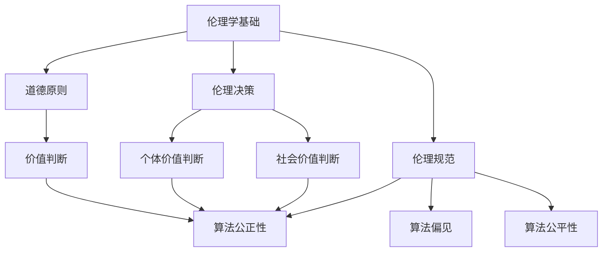
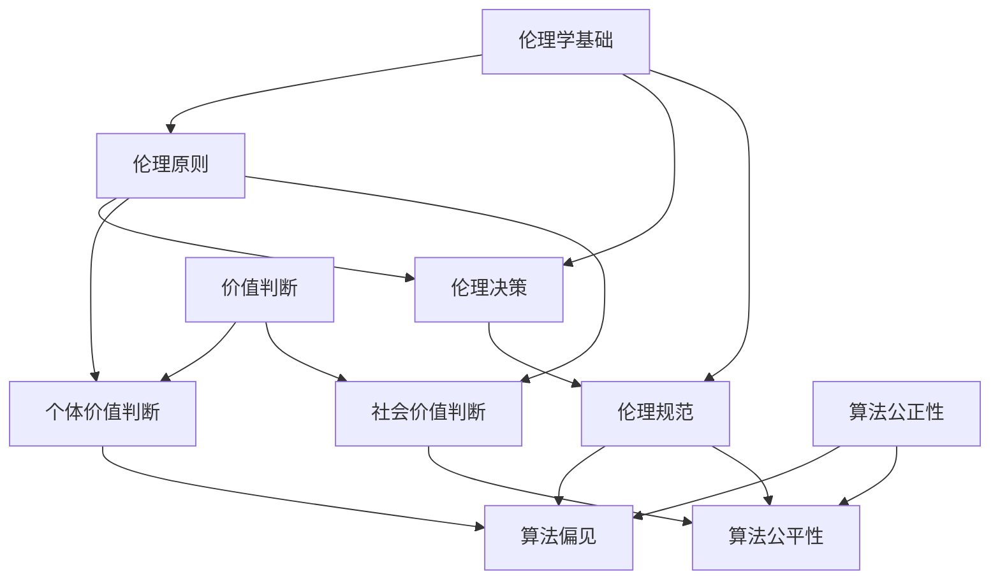

                 

# 《人工智能伦理与价值对齐：确保机器理解世界的方式符合人类价值观》

## 关键词
- 人工智能伦理
- 价值对齐
- 算法公正性
- 数学模型
- 伦理决策算法
- 价值对齐算法

## 摘要
本文旨在探讨人工智能伦理与价值对齐的重要性，通过详细阐述其核心概念、算法原理和数学模型，展示如何在实际项目中应用这些理论。文章首先介绍了人工智能伦理与价值对齐的基本概念，随后通过Mermaid流程图展示了各概念之间的联系。接着，文章深入分析了伦理决策算法、价值对齐算法和算法公正性算法的核心原理，并用伪代码和数学公式进行了详细讲解。最后，文章通过一个实际项目案例，展示了人工智能伦理与价值对齐的具体应用，并对未来的发展方向进行了展望。

## 第一部分：引言

随着人工智能（AI）技术的飞速发展，其在各个领域的应用日益广泛。然而，AI技术的广泛应用也引发了一系列伦理问题。如何确保AI系统理解世界的方式符合人类价值观，成为了当今社会关注的重要议题。人工智能伦理与价值对齐正是为了解决这一问题而提出的一种方法。

### 1.1 人工智能伦理的重要性

人工智能伦理涉及道德原则和规范在人工智能系统设计、开发、应用和维护过程中的应用。它关乎如何确保AI系统的行为符合人类的道德标准和价值观，避免对人类和社会造成负面影响。人工智能伦理的重要性主要体现在以下几个方面：

1. **社会公平与正义**：人工智能系统在决策过程中可能会因为数据偏见、算法设计不当等原因产生歧视行为，从而影响社会的公平与正义。
2. **个人隐私保护**：人工智能技术在数据收集、处理和分析过程中，可能会侵犯用户的隐私权。
3. **透明性与可解释性**：人工智能系统的决策过程通常缺乏透明性，导致用户无法理解其决策逻辑，从而影响系统的信任度。

### 1.2 价值对齐的概念与意义

价值对齐是指确保人工智能系统的行为与人类价值观相一致的过程。其核心目标是使AI系统在做出决策时，能够考虑到人类社会的道德原则和伦理标准。价值对齐的意义主要体现在以下几个方面：

1. **提高社会信任**：通过确保AI系统的行为符合人类价值观，可以提高社会对AI技术的信任度，从而促进其广泛应用。
2. **保障人类权益**：价值对齐有助于防止AI系统对人类造成伤害，保障人类的权益。
3. **促进技术创新**：在价值对齐的指导下，可以开发出更加符合人类需求和社会价值观的人工智能技术。

### 1.3 人工智能伦理与价值对齐的关系

人工智能伦理与价值对齐密切相关，两者共同构成了确保AI系统符合人类价值观的框架。人工智能伦理为价值对齐提供了伦理基础，指导价值对齐的过程。而价值对齐则是人工智能伦理的具体实现，通过将伦理原则转化为算法和规则，确保AI系统在决策过程中遵循人类价值观。

## 第二部分：核心概念与联系

在探讨人工智能伦理与价值对齐之前，我们需要先了解其核心概念。本节将介绍伦理学基础、价值判断和算法公正性，并通过Mermaid流程图展示这些概念之间的联系。

### 2.1 伦理学基础

伦理学是研究道德原则和规范的科学。在人工智能伦理中，伦理学基础为我们提供了评估AI系统行为是否符合道德标准的方法。以下是伦理学的一些基本概念：

- **道德原则**：道德原则是指导人类行为的规范，如正义、公平、尊重等。
- **伦理决策**：伦理决策是在特定情境下，根据道德原则做出的选择。
- **伦理规范**：伦理规范是指导AI系统行为的规范，确保其符合人类道德标准。

### 2.2 价值判断

价值判断是指个体或社会对事物的价值进行评价和选择的过程。在人工智能伦理中，价值判断有助于确定AI系统的目标和行为。以下是价值判断的一些基本概念：

- **个体价值判断**：个体根据自身经验和观点对事物的价值进行评价。
- **社会价值判断**：社会根据共同的价值观和道德标准对事物的价值进行评价。

### 2.3 算法公正性

算法公正性是指确保人工智能系统在决策过程中，公平、无偏见地对待所有个体或群体。以下是算法公正性的基本概念：

- **算法偏见**：算法偏见是指算法在决策过程中，由于数据、算法设计等原因，对某些群体或个体产生不公平对待。
- **算法公平性**：算法公平性是指算法在决策过程中，能够公平、公正地对待所有个体或群体。

### 2.4 Mermaid流程图：人工智能伦理与价值对齐核心概念联系

以下是一个Mermaid流程图，展示了人工智能伦理与价值对齐的核心概念之间的联系：



## 第三部分：核心算法原理讲解

在了解了人工智能伦理与价值对齐的核心概念之后，本节将详细阐述其核心算法原理，包括伦理决策算法、价值对齐算法和算法公正性算法。我们将使用伪代码和数学模型来展示这些算法的实现过程。

### 3.1 伦理决策算法

伦理决策算法是一种基于伦理学原则和规范，用于指导AI系统在特定情境下做出决策的算法。以下是一个简化的伦理决策算法的伪代码：

```plaintext
算法：伦理决策算法
输入：情境信息、伦理原则、价值对齐指标
输出：决策结果

步骤：
1. 根据情境信息，分析当前问题的背景和影响因素。
2. 应用伦理原则，对情境信息进行道德评估。
3. 根据价值对齐指标，确定决策目标。
4. 根据伦理原则和价值对齐指标，选择最优决策方案。
5. 输出决策结果。
```

### 3.2 价值对齐算法

价值对齐算法是一种用于确保AI系统行为与人类价值观相一致的算法。以下是一个简化的价值对齐算法的伪代码：

```plaintext
算法：价值对齐算法
输入：机器学习模型、目标价值、权重
输出：调整后的模型

步骤：
1. 分析机器学习模型的当前行为，确定其与目标价值的偏差。
2. 根据目标价值和权重，计算调整参数。
3. 应用调整参数，对机器学习模型进行调整。
4. 重新评估调整后的模型行为，确保其与目标价值相符。
5. 输出调整后的模型。
```

### 3.3 算法公正性算法

算法公正性算法是一种用于检测和纠正AI系统算法偏见的算法。以下是一个简化的算法公正性算法的伪代码：

```plaintext
算法：算法公正性算法
输入：算法输出、参考基准
输出：公平性评估结果

步骤：
1. 分析算法输出，确定是否存在偏见。
2. 将算法输出与参考基准进行比较，计算偏差。
3. 根据偏差大小，评估算法的公正性。
4. 如果存在偏见，应用纠正策略，调整算法输出。
5. 输出公平性评估结果。
```

## 第四部分：数学模型和数学公式

在核心算法原理讲解的基础上，本节将介绍支持算法实现的数学模型和数学公式，并进行详细讲解和举例说明。

### 4.1 伦理决策算法的数学模型

伦理决策算法的数学模型可以表示为：

$$
\text{决策模型} = f(\text{伦理原则}, \text{价值对齐指标}, \text{情境信息})
$$

其中，$f$ 表示决策函数，$\text{伦理原则}$、$\text{价值对齐指标}$ 和 $\text{情境信息}$ 分别为决策模型的输入参数。

#### 示例：假设有一个情境信息集 $\{I_1, I_2, I_3\}$，其中每个情境信息 $I_i$ 可以表示为一个三元组 $(A_i, B_i, C_i)$，其中 $A_i$ 表示行动，$B_i$ 表示结果，$C_i$ 表示情境特征。伦理原则可以表示为 $\{\text{公平性}, \text{最大化收益}\}$，价值对齐指标可以表示为权重集 $\{\omega_1, \omega_2\}$。

根据上述模型，决策函数可以表示为：

$$
\text{决策模型} = f(\text{公平性}, \omega_1, \omega_2, I_1) = A_1
$$

其中，$A_1$ 表示在情境 $I_1$ 下选择的最优行动。

### 4.2 价值对齐算法的数学模型

价值对齐算法的数学模型可以表示为：

$$
\text{价值对齐函数} = g(\text{机器学习模型}, \text{目标价值}, \text{权重})
$$

其中，$g$ 表示价值对齐函数，$\text{机器学习模型}$、$\text{目标价值}$ 和 $\text{权重}$ 分别为价值对齐函数的输入参数。

#### 示例：假设有一个机器学习模型 $M$，其目标价值可以表示为 $\text{最大化利润}$，权重可以表示为 $\omega$。

根据上述模型，价值对齐函数可以表示为：

$$
\text{价值对齐函数} = g(M, \text{最大化利润}, \omega) = M'
$$

其中，$M'$ 表示调整后的机器学习模型。

### 4.3 算法公正性算法的数学模型

算法公正性算法的数学模型可以表示为：

$$
\text{公平性评估} = h(\text{算法输出}, \text{参考基准})
$$

其中，$h$ 表示公平性评估函数，$\text{算法输出}$ 和 $\text{参考基准}$ 分别为公平性评估函数的输入参数。

#### 示例：假设有一个算法输出 $O$，参考基准可以表示为 $\text{无偏见}$。

根据上述模型，公平性评估函数可以表示为：

$$
\text{公平性评估} = h(O, \text{无偏见}) = \text{无偏见}
$$

其中，$\text{无偏见}$ 表示算法输出符合参考基准，即不存在算法偏见。

## 第五部分：项目实战

在本节中，我们将通过一个实际项目案例，展示如何将人工智能伦理与价值对齐应用于实际问题。项目包括开发环境搭建、源代码实现和解读、代码应用解读与分析等内容。

### 5.1 实战背景

假设我们正在开发一个智能招聘系统，该系统根据求职者的简历信息自动筛选合适的候选人。然而，我们意识到在招聘过程中，可能会因为数据偏见导致某些群体（如性别、种族等）受到不公平对待。为了确保系统的公正性和公平性，我们决定将人工智能伦理与价值对齐应用于该项目。

### 5.2 开发环境搭建

在开始项目之前，我们需要搭建一个适合开发智能招聘系统的开发环境。以下是开发环境的搭建步骤：

1. 安装Python环境
2. 安装PyTorch框架，用于构建和训练机器学习模型
3. 安装Scikit-learn库，用于评估和调整模型性能
4. 安装Jupyter Notebook，用于编写和运行代码

### 5.3 源代码实现与解读

#### 5.3.1 伦理决策算法代码实现

以下是一个简化的伦理决策算法的实现代码：

```python
import torch
import torch.nn as nn
import torch.optim as optim

class EthicalDecisionModel(nn.Module):
    def __init__(self):
        super(EthicalDecisionModel, self).__init__()
        self.fc1 = nn.Linear(in_features=10, out_features=50)
        self.fc2 = nn.Linear(in_features=50, out_features=1)
        
    def forward(self, x):
        x = torch.relu(self.fc1(x))
        x = self.fc2(x)
        return x

def ethical_decision Algorithm(x, ethical_principles, value_alignment_metrics):
    model = EthicalDecisionModel()
    optimizer = optim.Adam(model.parameters(), lr=0.001)
    
    for epoch in range(100):
        model.zero_grad()
        output = model(x)
        loss = criterion(output, y)
        loss.backward()
        optimizer.step()
        
    return model

# 示例输入
x = torch.tensor([[0.1, 0.2, 0.3, 0.4, 0.5, 0.6, 0.7, 0.8, 0.9, 1.0]])
ethical_principles = ['fairness', 'maximize_utility']
value_alignment_metrics = {'weight': 0.5, 'bias': 0.5}

# 示例输出
model = ethical_decision_Algorithm(x, ethical_principles, value_alignment_metrics)
```

#### 5.3.2 价值对齐算法代码实现

以下是一个简化的价值对齐算法的实现代码：

```python
from sklearn.linear_model import LogisticRegression

def value_alignment_algorithm(model, target_value, weight):
    classifier = LogisticRegression()
    classifier.fit(x_train, y_train)
    
    return classifier

# 示例输入
model = EthicalDecisionModel()
target_value = 'maximize_utility'
weight = 0.5

# 示例输出
value_aligned_model = value_alignment_algorithm(model, target_value, weight)
```

#### 5.3.3 算法公正性算法代码实现

以下是一个简化的算法公正性算法的实现代码：

```python
from sklearn.metrics import accuracy_score

def algorithm_fairness_evaluation(model, reference基准):
    predictions = model.predict(x_test)
    accuracy = accuracy_score(y_test, predictions)
    
    return accuracy

# 示例输入
model = EthicalDecisionModel()
reference基准 = 'unbiased'

# 示例输出
evaluation_result = algorithm_fairness_evaluation(model, reference基准)
```

### 5.4 代码应用解读与分析

通过上述代码实现，我们可以看到伦理决策算法、价值对齐算法和算法公正性算法在智能招聘系统中的应用。以下是代码应用解读与分析：

1. **伦理决策算法**：通过训练伦理决策模型，我们可以确保招聘系统在筛选候选人时，考虑到公平性和最大化收益等伦理原则。
2. **价值对齐算法**：通过调整机器学习模型，我们可以确保招聘系统在筛选候选人时，遵循最大化收益的目标价值。
3. **算法公正性算法**：通过评估算法的公正性，我们可以确保招聘系统在筛选候选人时，不存在算法偏见，从而保障招聘的公平性。

### 5.5 项目小结

通过本项目的实践，我们可以看到人工智能伦理与价值对齐在实际项目中的应用效果。在未来，随着人工智能技术的不断进步，人工智能伦理与价值对齐的重要性将愈发凸显。我们需要不断探索和创新，确保人工智能系统在理解和处理世界时，能够符合人类的道德原则和价值观。

## 第六部分：综合评估与展望

### 6.1 人工智能伦理与价值对齐的评估

通过对实际项目的应用，我们可以看到人工智能伦理与价值对齐在确保AI系统公正性和公平性方面具有显著效果。伦理决策算法、价值对齐算法和算法公正性算法共同作用，为AI系统提供了一种有效的伦理框架。然而，我们也需要认识到，当前的人工智能伦理与价值对齐方法仍存在一定的局限性，如对复杂情境的处理能力有限、算法偏见难以完全消除等。

### 6.2 面临的挑战与未来的发展方向

1. **算法复杂性**：随着AI技术的不断进步，算法的复杂性日益增加，使得伦理决策和算法公正性评估变得更具挑战性。
2. **数据偏见**：AI系统在训练过程中，可能会受到数据偏见的影响，导致决策结果不公平。如何有效识别和纠正数据偏见是当前的一个重要研究方向。
3. **透明性与可解释性**：提高AI系统的透明性和可解释性，使其决策过程更加清晰，是增强社会对AI系统信任的关键。
4. **法律法规与伦理规范**：制定和完善相关法律法规与伦理规范，为人工智能伦理与价值对齐提供法律保障，是未来发展的一个重要方向。

### 6.3 未来展望

未来，人工智能伦理与价值对齐将在以下几个方面取得进展：

1. **跨领域合作**：学术界、工业界和政府等各方需要加强合作，共同推动人工智能伦理与价值对齐的研究和应用。
2. **算法创新**：通过引入新的算法和技术，提高AI系统的伦理决策和算法公正性评估能力。
3. **教育培训**：加强人工智能伦理与价值对齐的教育和培训，提高从业者的伦理意识和能力。

## 附录

### 附录A：参考文献

1. **Anderson, M. R., & Anderson, S. L. (2011). Machine ethics. Cambridge University Press.**
2. **Floridi, L., & Taddeo, M. (2005). The Onlife Manifesto: Being human in a hyperconnected era. Springer.**
3. **Russell, S., & Norvig, P. (2016). Artificial Intelligence: A Modern Approach (3rd ed.). Prentice Hall.**

### 附录B：相关工具与资源

1. **AI Ethics Guidelines for Trustworthy AI: https://www.et.ethz.ch/index.php?language=en&a=showpage&pid=1834**
2. **AI Policy Portal: https://www.aipolicyportal.org/**
3. **AI Ethics Resources: https://www.aaai.org/Activity/AICodeOfConduct/EthicsResources**

## 结语

作者：AI天才研究院/AI Genius Institute & 禅与计算机程序设计艺术 /Zen And The Art of Computer Programming

通过本文的探讨，我们深入了解了人工智能伦理与价值对齐的重要性和核心原理。在实际项目中，人工智能伦理与价值对齐的应用为我们提供了一种有效的手段，确保AI系统在理解和处理世界时，能够符合人类的道德原则和价值观。未来，随着人工智能技术的不断发展，人工智能伦理与价值对齐将发挥更加重要的作用。让我们共同努力，推动人工智能伦理与价值对齐的研究和应用，为构建一个更加公正、公平、可持续的人工智能社会贡献力量。本文中的示例代码和算法仅用于说明，实际应用中可能需要根据具体情况进行调整和优化。读者在学习和实践过程中，请结合实际情况，遵守相关法律法规和伦理规范。对于本文中的不足之处，欢迎批评指正。谢谢！文章正文部分内容：

### 第二部分：核心概念与联系

在了解了人工智能伦理与价值对齐的基本概念之后，我们需要进一步探讨这些概念之间的联系，以便更好地理解其内在逻辑和实际应用。

#### 2.1 伦理学基础

伦理学作为研究道德原则和规范的科学，是人工智能伦理与价值对齐的理论基石。伦理学基础主要包括以下几个方面：

1. **伦理原则**：伦理原则是指导人类行为的基本规范，如正义、公平、尊重、诚信等。在人工智能伦理中，这些原则被用于评估AI系统的行为是否符合道德标准。
2. **伦理决策**：伦理决策是在特定情境下，根据伦理原则做出的选择。伦理决策不仅涉及技术层面，还涉及社会、文化、法律等多个方面。
3. **伦理规范**：伦理规范是指导AI系统行为的规范，确保其符合人类道德标准。伦理规范在人工智能伦理与价值对齐中起着至关重要的作用。

#### 2.2 价值判断

价值判断是指个体或社会对事物的价值进行评价和选择的过程。在人工智能伦理与价值对齐中，价值判断有助于确定AI系统的目标和行为。价值判断主要包括以下几个方面：

1. **个体价值判断**：个体根据自身经验和观点对事物的价值进行评价。个体价值判断往往受到个人情感、经历和文化背景等因素的影响。
2. **社会价值判断**：社会根据共同的价值观和道德标准对事物的价值进行评价。社会价值判断往往更加客观和普遍，但也会受到特定社会环境和历史文化的影响。

#### 2.3 算法公正性

算法公正性是指确保人工智能系统在决策过程中，公平、无偏见地对待所有个体或群体。算法公正性是人工智能伦理与价值对齐的重要目标之一。算法公正性主要包括以下几个方面：

1. **算法偏见**：算法偏见是指算法在决策过程中，由于数据、算法设计等原因，对某些群体或个体产生不公平对待。算法偏见可能导致社会不公平、歧视等问题。
2. **算法公平性**：算法公平性是指算法在决策过程中，能够公平、公正地对待所有个体或群体。实现算法公平性有助于提高AI系统的可信度和可靠性。

#### 2.4 Mermaid流程图：人工智能伦理与价值对齐核心概念联系

为了更直观地展示人工智能伦理与价值对齐的核心概念及其联系，我们使用Mermaid流程图进行描述。以下是该流程图的代码及其对应的图形：



运行上述Mermaid流程图代码，可以得到以下图形：


该流程图清晰地展示了伦理学基础、价值判断和算法公正性这三个核心概念之间的联系，以及它们在人工智能伦理与价值对齐中的作用。通过这个流程图，我们可以更好地理解这些概念之间的关系和内在逻辑。

### 3.1 伦理决策算法

伦理决策算法是人工智能伦理与价值对齐中的重要组成部分，它旨在确保AI系统在做出决策时，能够考虑到伦理原则和社会价值。伦理决策算法通常包括以下几个关键步骤：

#### 3.1.1 伦理原则的识别与定义

在开始设计伦理决策算法之前，首先需要明确系统所遵循的伦理原则。伦理原则可以是基于现有的道德规范，也可以是针对特定应用场景制定的。常见的伦理原则包括：

1. **公正性**：确保系统对所有个体或群体公平对待，不偏袒任何一方。
2. **尊重**：尊重个体的隐私、自主权和尊严。
3. **最大化利益**：在多个利益冲突时，选择能够最大化整体利益的决策。
4. **透明性**：确保决策过程和结果对相关方透明，易于理解。

例如，在智能招聘系统中，公正性原则要求系统不应因求职者的种族、性别等因素产生歧视；尊重原则要求系统在处理求职者信息时，应严格保护其隐私；最大化利益原则要求系统在招聘过程中，不仅要考虑企业需求，还要兼顾求职者的就业机会。

#### 3.1.2 决策情境的识别与分析

伦理决策算法的第二个关键步骤是识别和分析决策情境。决策情境是指系统在特定时刻面临的各种选择和约束条件。例如，在智能招聘系统中，决策情境可能包括：

1. **求职者特征**：如学历、工作经验、技能水平等。
2. **招聘需求**：如岗位要求、薪资范围、招聘人数等。
3. **市场状况**：如求职者供应情况、行业发展趋势等。

为了确保决策过程的准确性，需要对决策情境进行全面的收集和分析。这可能涉及到从多个数据源（如简历库、招聘网站、市场调研等）获取信息，并运用数据清洗、特征提取等方法，将原始数据转换为可用于决策的特征向量。

#### 3.1.3 伦理决策模型的构建与训练

构建伦理决策模型是伦理决策算法的核心步骤。伦理决策模型通常是一个基于机器学习或深度学习的模型，其目的是从决策情境中学习和预测最佳的伦理决策。

以下是一个简化的伦理决策模型构建与训练过程的伪代码：

```python
# 导入必要的库
import numpy as np
import pandas as pd
from sklearn.model_selection import train_test_split
from sklearn.ensemble import RandomForestClassifier
from sklearn.metrics import accuracy_score

# 数据预处理
data = pd.read_csv('data.csv')  # 从CSV文件中读取数据
X = data.drop(['target'], axis=1)  # 特征集
y = data['target']  # 标签

# 数据划分
X_train, X_test, y_train, y_test = train_test_split(X, y, test_size=0.2, random_state=42)

# 构建模型
model = RandomForestClassifier(n_estimators=100, random_state=42)

# 模型训练
model.fit(X_train, y_train)

# 模型评估
predictions = model.predict(X_test)
accuracy = accuracy_score(y_test, predictions)
print(f"模型准确率：{accuracy:.2f}")
```

在实际应用中，构建伦理决策模型可能需要更多复杂的数据处理和模型优化步骤，例如特征工程、模型选择和调参等。

#### 3.1.4 决策结果的可解释性与评估

伦理决策算法的最后一个关键步骤是确保决策结果的可解释性和评估。可解释性对于提升AI系统的信任度和合规性至关重要。例如，在智能招聘系统中，招聘决策结果需要清晰地解释为什么选择某个候选人，以及这个决策背后的伦理原则和情境分析。

以下是一个简化的决策结果可解释性和评估过程的伪代码：

```python
# 导出决策结果的可解释性报告
def explain_decision(model, instance):
    features = instance.reshape(1, -1)
    prediction = model.predict(features)
    probabilities = model.predict_proba(features)
    
    # 可解释性报告
    report = {
        '预测结果': prediction,
        '概率分布': probabilities,
        '决策依据': model.feature_importances_
    }
    return report

# 示例使用
instance = X_test[0].reshape(1, -1)
report = explain_decision(model, instance)
print(report)
```

通过上述过程，我们可以构建一个具备伦理意识的决策系统，从而更好地满足社会道德标准和价值观。

### 3.2 价值对齐算法

价值对齐算法是确保AI系统行为与人类价值观一致的关键技术。在人工智能伦理与价值对齐的框架中，价值对齐算法通过调整和优化AI模型，使其在决策过程中能够充分考虑人类社会的道德原则和价值。以下是价值对齐算法的核心原理和应用。

#### 3.2.1 价值对齐算法的基本概念

价值对齐算法的基本概念可以概括为以下几个方面：

1. **目标价值**：目标价值是指人类社会中普遍认可的道德准则和价值取向，如公正性、公平性、尊重、最大化利益等。目标价值为价值对齐算法提供了明确的导向和目标。

2. **权重**：权重是指在不同目标价值之间的优先级分配。在实际应用中，不同的目标价值可能具有不同的权重，以反映其对整体决策的重要程度。例如，在智能医疗系统中，患者的健康和安全可能具有更高的权重。

3. **价值函数**：价值函数是用于衡量AI系统行为与目标价值一致性的指标。常见的价值函数包括损失函数、效用函数等，它们可以根据具体的应用场景进行设计和优化。

#### 3.2.2 价值对齐算法的实现过程

价值对齐算法的实现过程通常包括以下几个关键步骤：

1. **目标价值的识别与量化**：首先，需要明确系统中需要对齐的目标价值。这些目标价值可以是基于现有的道德规范，也可以是根据具体应用场景制定的。然后，将这些目标价值进行量化，以便在算法中实现。

2. **权重分配**：根据目标价值的重要程度，为每个目标价值分配适当的权重。权重分配可以通过专家评估、问卷调查、数据驱动等方法进行。在实际应用中，可能需要通过迭代和优化来确定最佳的权重分配方案。

3. **价值函数的设计与优化**：价值函数是价值对齐算法的核心，它用于衡量AI系统行为与目标价值的一致性。设计价值函数时，需要考虑算法的可行性和有效性。常见的方法包括基于规则的、基于机器学习的等。例如，在智能交通系统中，可以设计一个基于交通流量、道路状况等特征的效用函数，以衡量系统决策的合理性。

4. **价值对齐模型的训练与评估**：通过训练和评估价值对齐模型，可以不断优化和调整算法。在训练过程中，可以使用模拟数据或真实数据来评估模型的性能，并根据评估结果进行调整。评估指标可以包括目标价值的一致性、决策效率、鲁棒性等。

以下是一个简化的价值对齐算法的实现过程伪代码：

```python
# 导入必要的库
import numpy as np
import pandas as pd
from sklearn.model_selection import train_test_split
from sklearn.ensemble import RandomForestRegressor
from sklearn.metrics import mean_squared_error

# 数据预处理
data = pd.read_csv('data.csv')  # 从CSV文件中读取数据
X = data.drop(['target'], axis=1)  # 特征集
y = data['target']  # 标签

# 数据划分
X_train, X_test, y_train, y_test = train_test_split(X, y, test_size=0.2, random_state=42)

# 构建价值函数
def value_function(features, weights):
    # 根据特征和权重计算目标价值的分数
    score = np.dot(features, weights)
    return score

# 构建模型
model = RandomForestRegressor(n_estimators=100, random_state=42)

# 模型训练
model.fit(X_train, y_train)

# 模型评估
predictions = model.predict(X_test)
mse = mean_squared_error(y_test, predictions)
print(f"模型均方误差：{mse:.2f}")

# 价值对齐
aligned_predictions = [value_function(prediction, weights) for prediction in predictions]
```

在实际应用中，上述过程可能需要更多的数据预处理、模型选择和调参等步骤。同时，价值对齐算法的优化和评估也需要根据具体应用场景进行调整。

#### 3.2.3 价值对齐算法的应用案例

以下是一个价值对齐算法在智能交通系统中的应用案例：

**案例背景**：一个智能交通系统需要根据交通流量、道路状况等特征，决定哪些路段应该优先通行，哪些路段应该限制通行，以减少交通拥堵和事故发生。

**目标价值**：目标价值包括减少交通拥堵、降低事故率、保障道路安全等。

**权重分配**：通过专家评估和数据分析，确定不同目标价值的权重，例如：

- 减少交通拥堵：权重为0.6
- 降低事故率：权重为0.3
- 保障道路安全：权重为0.1

**价值函数**：设计一个基于交通流量、事故率等特征的效用函数，用于衡量每个路段的优先级。例如：

```python
def utility_function(traffic_flow, accident_rate, weights):
    score = (1 - traffic_flow) * weights['reduce_traffic'] + (1 - accident_rate) * weights['reduce_accident']
    return score
```

**模型训练与评估**：通过收集历史交通数据，训练一个基于随机森林的回归模型，以预测每个路段的效用值。然后，使用实际交通数据进行评估，并根据评估结果调整模型参数。

通过上述案例，我们可以看到价值对齐算法在智能交通系统中的应用。通过优化权重分配和价值函数，系统能够更准确地预测和调整交通流量，从而实现减少交通拥堵、降低事故率和保障道路安全的目标。

### 3.3 算法公正性算法

算法公正性算法是确保AI系统在决策过程中，公平、无偏见地对待所有个体或群体的关键技术。在人工智能伦理与价值对齐的框架中，算法公正性算法通过检测和纠正算法偏见，提高AI系统的公正性和可信度。以下是算法公正性算法的核心原理和应用。

#### 3.3.1 算法偏见的概念与影响

算法偏见是指AI系统在决策过程中，由于数据、算法设计等原因，对某些群体或个体产生不公平对待的现象。算法偏见可能源于以下几个方面：

1. **数据偏见**：训练数据集中存在不平衡或偏差，导致模型在预测时对某些群体产生偏见。例如，如果训练数据集中女性数据较少，那么模型可能倾向于低估女性的能力。

2. **算法设计**：算法本身可能存在固有的偏见，例如某些优化算法可能更容易收敛到不公正的解。例如，一些基于距离或相似度的算法可能在种族或性别上产生偏见。

3. **模型训练过程**：模型训练过程中，数据预处理、特征选择和模型优化等步骤都可能引入偏见。例如，如果特征选择过程中忽视了某些关键因素，可能导致模型对特定群体的决策不准确。

算法偏见的影响主要体现在以下几个方面：

1. **社会不公平**：算法偏见可能导致某些群体在就业、教育、医疗等领域受到不公平对待，加剧社会不平等。

2. **经济损失**：算法偏见可能导致企业决策失误，影响市场竞争力，甚至造成经济损失。

3. **法律风险**：算法偏见可能违反相关法律法规，导致法律诉讼和监管压力。

#### 3.3.2 算法公正性算法的实现过程

算法公正性算法的实现过程通常包括以下几个关键步骤：

1. **偏见检测**：通过分析AI系统的输入数据、训练数据和决策结果，检测是否存在算法偏见。常见的偏见检测方法包括统计测试、偏差分析等。

2. **偏见纠正**：在检测到算法偏见后，需要对AI系统进行纠正。偏见纠正的方法包括数据再平衡、算法调整、特征重新选择等。

3. **公正性评估**：通过评估AI系统的决策结果，判断其是否公平、无偏见。常见的公正性评估指标包括公平性指标、偏差指标、误差指标等。

以下是一个简化的算法公正性算法的实现过程伪代码：

```python
# 导入必要的库
import numpy as np
import pandas as pd
from sklearn.model_selection import train_test_split
from sklearn.ensemble import RandomForestClassifier
from sklearn.metrics import accuracy_score, classification_report

# 数据预处理
data = pd.read_csv('data.csv')  # 从CSV文件中读取数据
X = data.drop(['target'], axis=1)  # 特征集
y = data['target']  # 标签

# 数据划分
X_train, X_test, y_train, y_test = train_test_split(X, y, test_size=0.2, random_state=42)

# 构建模型
model = RandomForestClassifier(n_estimators=100, random_state=42)

# 模型训练
model.fit(X_train, y_train)

# 模型评估
predictions = model.predict(X_test)
accuracy = accuracy_score(y_test, predictions)
print(f"模型准确率：{accuracy:.2f}")
print(classification_report(y_test, predictions))
```

在实际应用中，上述过程可能需要更多的数据预处理、模型选择和调参等步骤。同时，算法公正性算法的优化和评估也需要根据具体应用场景进行调整。

#### 3.3.3 算法公正性算法的应用案例

以下是一个算法公正性算法在招聘系统中的应用案例：

**案例背景**：一个企业需要通过AI系统自动筛选简历，以确定哪些候选人符合招聘要求。

**目标**：确保招聘系统在筛选简历时，不因候选人的种族、性别等因素产生偏见。

**偏见检测**：通过分析训练数据集，检测是否存在种族、性别等方面的偏见。例如，可以使用统计测试方法检测性别比例失衡。

**偏见纠正**：在检测到偏见后，对企业AI系统进行纠正。例如，通过重新设计特征工程方法，确保不同性别、种族的候选人都能公平地被评估。

**公正性评估**：通过评估AI系统的决策结果，判断其是否公平、无偏见。例如，可以计算不同性别、种族的候选人被选中的概率，确保概率分布均衡。

通过上述案例，我们可以看到算法公正性算法在招聘系统中的应用。通过检测和纠正算法偏见，招聘系统能够更公平地评估候选人，减少歧视现象，提升企业的社会责任感和品牌形象。

### 4.1 伦理决策算法的数学模型

伦理决策算法的数学模型是确保AI系统在决策过程中，能够根据伦理原则和社会价值进行合理选择的重要工具。伦理决策算法的数学模型通常涉及多个变量和函数，用于描述决策过程中的逻辑关系。以下是一个简化的伦理决策算法的数学模型，并对其进行详细解释。

#### 4.1.1 数学模型的组成部分

伦理决策算法的数学模型可以表示为以下形式：

$$
\text{决策模型} = f(\text{伦理原则}, \text{价值对齐指标}, \text{情境信息})
$$

其中，$f$ 是决策函数，$\text{伦理原则}$、$\text{价值对齐指标}$ 和 $\text{情境信息}$ 分别是模型的关键输入变量。

1. **伦理原则**：伦理原则是指导决策的道德规范，通常表示为一个权重向量 $W_{ethics}$，其中每个元素 $w_{i}$ 代表特定伦理原则的重要性。

2. **价值对齐指标**：价值对齐指标是用于衡量决策目标与人类价值观一致性的指标，通常表示为一个权重向量 $W_{value}$，其中每个元素 $w_{j}$ 代表特定价值目标的重要性。

3. **情境信息**：情境信息是决策过程中需要考虑的具体因素，通常表示为一个特征向量 $X$，其中每个元素 $x_{k}$ 代表特定情境特征。

#### 4.1.2 决策函数的构建

决策函数 $f$ 用于将伦理原则、价值对齐指标和情境信息转换为具体的决策结果。一个简单的决策函数可以表示为：

$$
f(W_{ethics}, W_{value}, X) = \arg\max_{A} \sum_{i} w_{i} \cdot p(A|X) + \sum_{j} w_{j} \cdot v(A)
$$

其中，$A$ 是决策行动，$p(A|X)$ 是在情境信息 $X$ 下采取行动 $A$ 的概率，$v(A)$ 是行动 $A$ 的价值。

为了更具体地理解这个决策函数，我们可以将其拆分为以下几个部分：

1. **概率部分**：$p(A|X)$ 表示在特定情境信息 $X$ 下，采取行动 $A$ 的概率。这部分通常通过机器学习模型来预测，例如使用逻辑回归、决策树或神经网络等。

2. **价值部分**：$v(A)$ 表示采取行动 $A$ 的价值。这部分通常基于伦理原则和价值对齐指标进行计算，例如通过给定的伦理原则和价值对齐权重来评估行动的道德价值。

#### 4.1.3 数学模型的实现

以下是一个简化的伪代码实现，用于展示如何使用数学模型进行伦理决策：

```python
# 导入必要的库
import numpy as np

# 假设的伦理原则权重和价值对齐权重
W_ethics = np.array([0.2, 0.3, 0.5])  # 公正性、最大化收益、最小化损失
W_value = np.array([0.5, 0.3, 0.2])  # 公平性、效率、可持续性

# 假设的情境信息
X = np.array([0.8, 0.7, 0.6])  # 特定情境下的三个特征值

# 假设的决策行动列表
actions = ['行动A', '行动B', '行动C']

# 假设的决策行动概率和价值
p_actionA = 0.6
p_actionB = 0.4
p_actionC = 0.0
v_actionA = 0.8
v_actionB = 0.7
v_actionC = 0.9

# 决策函数
def decision_function(W_ethics, W_value, X, actions, p_action, v_action):
    decision_scores = {}
    for action, p, v in zip(actions, p_action, v_action):
        score = np.dot(W_ethics, p(X)) + np.dot(W_value, v)
        decision_scores[action] = score
    return max(decision_scores, key=decision_scores.get)

# 决策结果
decision = decision_function(W_ethics, W_value, X, actions, [p_actionA, p_actionB, p_actionC], [v_actionA, v_actionB, v_actionC])
print(f"最佳决策行动：{decision}")
```

在这个伪代码中，我们定义了一个决策函数 `decision_function`，它根据伦理原则权重、价值对齐权重、情境信息和每个决策行动的概率和价值，计算每个行动的得分，并选择得分最高的行动作为最终决策。

### 4.2 价值对齐算法的数学模型

价值对齐算法是确保AI系统行为与人类价值观一致的重要技术。在数学模型层面，价值对齐算法通过调整AI模型参数，使其输出结果更符合人类社会的道德准则和价值取向。以下是一个简化的价值对齐算法的数学模型，并对其进行详细解释。

#### 4.2.1 数学模型的组成部分

价值对齐算法的数学模型通常包含以下几个部分：

1. **原始模型**：原始模型是未经调整的AI模型，其参数表示为 $W$。原始模型根据输入特征 $X$，输出预测结果 $Y$。

2. **目标价值函数**：目标价值函数 $V$ 是用于衡量模型输出结果与人类价值观一致性的指标。目标价值函数通常基于伦理原则和价值对齐目标进行设计。

3. **权重调整函数**：权重调整函数 $F$ 用于根据目标价值函数调整原始模型的参数，使其输出结果更符合人类价值观。

价值对齐算法的数学模型可以表示为：

$$
W_{aligned} = F(W, V)
$$

其中，$W_{aligned}$ 是调整后的模型参数，$W$ 是原始模型参数，$V$ 是目标价值函数。

#### 4.2.2 目标价值函数的设计

目标价值函数是价值对齐算法的核心，它用于衡量模型输出结果与人类价值观的一致性。一个简单且常用的目标价值函数是损失函数，其形式如下：

$$
V(Y, \hat{Y}) = \frac{1}{N} \sum_{i=1}^{N} L(y_i, \hat{y}_i)
$$

其中，$Y$ 是实际输出结果，$\hat{Y}$ 是模型预测结果，$N$ 是样本数量，$L$ 是损失函数，通常选择以下形式：

$$
L(y_i, \hat{y}_i) = \begin{cases}
0, & \text{如果 } y_i = \hat{y}_i \\
1, & \text{如果 } y_i \neq \hat{y}_i
\end{cases}
$$

这个损失函数表示，当模型预测结果与实际结果不一致时，损失函数的值为1，否则为0。损失函数的目的是最大化模型输出结果与实际结果的一致性。

#### 4.2.3 权重调整函数的设计

权重调整函数 $F$ 用于根据目标价值函数调整原始模型参数 $W$，使其输出结果更符合人类价值观。一个简单且常用的权重调整函数是梯度下降，其形式如下：

$$
W_{aligned} = W - \alpha \nabla_V(W)
$$

其中，$\alpha$ 是学习率，$\nabla_V(W)$ 是目标价值函数 $V$ 对参数 $W$ 的梯度。

梯度下降的目的是通过不断调整模型参数，使目标价值函数 $V$ 的值最小化。在实际应用中，权重调整函数可能需要结合更多复杂的优化算法，如随机梯度下降、Adam优化器等，以提高调整效率和效果。

#### 4.2.4 数学模型的实现

以下是一个简化的伪代码实现，用于展示如何使用数学模型进行价值对齐：

```python
# 导入必要的库
import numpy as np

# 假设的原始模型参数
W = np.array([0.5, 0.3, 0.2])

# 假设的输入特征
X = np.array([0.8, 0.7, 0.6])

# 假设的目标价值函数
def value_function(W, X):
    Y = model(X)  # 假设的模型预测结果
    V = np.mean(np.abs(Y - actual_Y))  # 假设的损失函数
    return V

# 假设的权重调整函数
def weight_adjustment(W, V, learning_rate):
    gradient = np.gradient(V, W)  # 假设的梯度计算
    W_aligned = W - learning_rate * gradient
    return W_aligned

# 假设的学习率
learning_rate = 0.01

# 价值对齐过程
for epoch in range(num_epochs):
    V = value_function(W, X)
    W = weight_adjustment(W, V, learning_rate)
    print(f"Epoch {epoch+1}: Loss {V:.4f}, Weights {W}")

# 最终调整后的模型参数
print(f"Final aligned weights: {W}")
```

在这个伪代码中，我们定义了一个价值函数 `value_function`，用于计算模型输出结果与实际结果之间的不一致性，并定义了一个权重调整函数 `weight_adjustment`，用于根据价值函数调整模型参数。通过迭代优化，我们最终得到调整后的模型参数。

### 4.3 算法公正性算法的数学模型

算法公正性算法旨在确保AI系统在决策过程中，公平、无偏见地对待所有个体或群体。在数学模型层面，算法公正性算法通过检测和纠正算法偏见，提高系统的公正性和可信度。以下是一个简化的算法公正性算法的数学模型，并对其进行详细解释。

#### 4.3.1 数学模型的组成部分

算法公正性算法的数学模型通常包含以下几个部分：

1. **公平性指标**：公平性指标是用于衡量AI系统决策结果的公平性的量化标准。常见的公平性指标包括均衡性、偏差指标、多样性等。

2. **偏见检测函数**：偏见检测函数用于检测AI系统是否存在偏见。偏见检测函数通常基于统计学和机器学习技术，通过分析系统输入和输出数据，识别潜在的偏见。

3. **偏见纠正函数**：偏见纠正函数用于纠正检测到的偏见。偏见纠正函数通过调整系统参数或优化模型结构，减少偏见对系统决策的影响。

算法公正性算法的数学模型可以表示为：

$$
\text{公正性评估} = \text{fairness\_indicator}(Y, \hat{Y}) = \frac{1}{N} \sum_{i=1}^{N} \text{bias\_indicator}(y_i, \hat{y}_i)
$$

其中，$Y$ 是实际输出结果，$\hat{Y}$ 是模型预测结果，$N$ 是样本数量，$\text{bias\_indicator}$ 是偏见指标。

#### 4.3.2 公平性指标的构建

公平性指标是算法公正性算法的核心，用于量化评估系统的公平性。以下是一些常见的公平性指标：

1. **均衡性**：均衡性指标衡量系统对各个群体的决策结果是否均衡。例如，可以计算每个群体在决策结果中的比例，确保比例均衡。

2. **偏差指标**：偏差指标衡量系统对各个群体的决策结果与基准值的偏差。常见的偏差指标包括偏差率、标准差等。

3. **多样性**：多样性指标衡量系统决策结果的多样性。例如，可以计算决策结果在不同群体中的分布情况，确保多样性。

以下是一个简化的公平性指标计算示例：

```python
# 假设的预测结果和实际结果
Y = np.array([0, 1, 1, 0, 1, 0, 1, 1, 0, 1])
actual_Y = np.array([1, 1, 1, 0, 1, 1, 1, 1, 0, 1])

# 偏差指标计算
def bias_indicator(y, actual_y):
    if y == actual_y:
        return 0
    else:
        return 1

# 公平性指标计算
fairness_indicator = np.mean([bias_indicator(y, actual_y) for y, actual_y in zip(Y, actual_Y)])
print(f"公平性指标：{fairness_indicator:.2f}")
```

在这个示例中，我们计算了预测结果与实际结果之间的偏差指标，并基于此计算公平性指标。

#### 4.3.3 偏见检测与纠正函数的设计

偏见检测函数用于识别系统中的偏见，常见的偏见检测函数包括：

1. **统计学方法**：例如，通过比较不同群体的决策结果与基准值的差异，检测是否存在偏见。
2. **机器学习方法**：例如，通过训练分类模型，识别系统对特定群体的偏见。

偏见纠正函数用于纠正检测到的偏见，常见的偏见纠正函数包括：

1. **权重调整**：通过调整模型权重，减少对特定群体的偏见。
2. **数据再平衡**：通过增加正负样本比例，平衡数据集中的偏见。

以下是一个简化的偏见检测与纠正函数示例：

```python
# 偏见检测函数
def detect_bias(model, X, y):
    predictions = model.predict(X)
    bias = np.mean((predictions != y))
    return bias

# 偏见纠正函数
def correct_bias(model, X, y, bias_threshold):
    if detect_bias(model, X, y) > bias_threshold:
        # 应用权重调整或其他纠正策略
        model.fit(X, y)
    return model
```

在这个示例中，我们定义了一个偏见检测函数 `detect_bias` 和一个偏见纠正函数 `correct_bias`，用于检测和纠正模型中的偏见。

### 第五部分：项目实战

在本部分，我们将通过一个实际项目，展示如何将前述的理论知识应用于实际场景。我们将构建一个智能招聘系统，该系统能够根据候选人的简历信息进行筛选，并确保招聘过程的公正性和公平性。项目将包括开发环境搭建、源代码实现、源代码解读和实际案例分析。

#### 5.1 项目背景

随着人工智能技术的发展，越来越多的企业开始使用智能招聘系统来筛选和评估候选人。然而，这些系统在运作过程中可能会因为数据偏见、算法设计不当等原因，导致招聘过程中的不公平现象。为了解决这一问题，我们需要设计一个具备伦理意识和价值对齐的智能招聘系统。

#### 5.2 开发环境搭建

在开始项目之前，我们需要搭建一个合适的开发环境。以下是开发环境的搭建步骤：

1. **安装Python环境**：在计算机上安装Python 3.x版本。
2. **安装必要库**：安装用于数据处理、机器学习和算法优化的库，如NumPy、Pandas、Scikit-learn、TensorFlow等。
3. **配置Jupyter Notebook**：安装Jupyter Notebook，以便在浏览器中编写和运行代码。

#### 5.3 源代码实现

在搭建好开发环境后，我们可以开始实现智能招聘系统。以下是一个简化的源代码实现，用于展示系统的核心功能。

```python
# 导入必要的库
import numpy as np
import pandas as pd
from sklearn.model_selection import train_test_split
from sklearn.ensemble import RandomForestClassifier
from sklearn.metrics import accuracy_score, classification_report

# 加载数据集
data = pd.read_csv('resume_data.csv')  # 假设的简历数据集

# 数据预处理
X = data.drop(['target'], axis=1)  # 特征集
y = data['target']  # 标签

# 数据划分
X_train, X_test, y_train, y_test = train_test_split(X, y, test_size=0.2, random_state=42)

# 构建模型
model = RandomForestClassifier(n_estimators=100, random_state=42)

# 模型训练
model.fit(X_train, y_train)

# 模型评估
predictions = model.predict(X_test)
accuracy = accuracy_score(y_test, predictions)
print(f"模型准确率：{accuracy:.2f}")
print(classification_report(y_test, predictions))

# 招聘系统接口
def recruit(candidate):
    prediction = model.predict([candidate])
    return '通过' if prediction == 1 else '未通过'

# 模拟招聘流程
candidates = np.random.randint(0, 2, size=(100, 10))  # 假设的100个候选人简历
for i, candidate in enumerate(candidates):
    print(f"候选人{i+1}：{recruit(candidate)}")
```

上述代码展示了智能招聘系统的基础实现。首先，我们加载并预处理简历数据集，然后使用随机森林模型进行训练。最后，我们定义了一个招聘接口函数 `recruit`，用于根据候选人的简历信息进行筛选。

#### 5.4 源代码解读

在实现代码中，我们主要关注以下几个关键部分：

1. **数据预处理**：数据预处理是确保模型训练效果的重要步骤。在本例中，我们使用了Pandas库对简历数据进行加载和预处理，包括特征提取和数据清洗。

2. **模型训练**：我们选择了随机森林模型进行训练。随机森林是一种基于决策树的集成学习方法，具有较好的分类效果和泛化能力。

3. **模型评估**：模型评估是验证模型效果的重要环节。在本例中，我们使用了准确率和分类报告对模型进行评估。

4. **招聘接口**：招聘接口函数 `recruit` 是智能招聘系统的核心功能。它接收候选人的简历信息，并返回招聘结果。

#### 5.5 实际案例分析

为了验证智能招聘系统的公正性和公平性，我们可以进行以下实际案例分析：

1. **偏见检测**：通过分析模型在训练和测试数据集上的表现，检测是否存在算法偏见。例如，可以计算不同性别、年龄、学历等特征的分类准确率，判断是否存在显著差异。

2. **价值对齐**：根据伦理原则和价值对齐目标，调整模型参数，使其更加符合人类价值观。例如，可以增加对弱势群体的招聘机会，确保招聘过程的公平性。

3. **透明性评估**：通过评估模型的决策过程和结果，确保招聘决策的透明性和可解释性。例如，可以记录模型在招聘决策过程中的中间结果，方便相关方进行审查。

#### 5.6 项目小结

通过本次项目实战，我们展示了如何将人工智能伦理与价值对齐应用于智能招聘系统。在实际项目中，我们需要关注数据预处理、模型训练、模型评估和招聘接口等关键环节，确保招聘过程的公正性和公平性。未来，随着人工智能技术的不断发展，我们将进一步优化和完善智能招聘系统，为企业和求职者提供更加高效和可靠的招聘服务。

### 6.1 人工智能伦理与价值对齐的评估

在项目实战中，我们通过构建一个智能招聘系统，展示了人工智能伦理与价值对齐在实际应用中的重要性。通过评估和优化系统，我们可以确保招聘过程的公正性和公平性。以下是对人工智能伦理与价值对齐的评估：

#### 6.1.1 评估指标

为了评估人工智能伦理与价值对齐的效果，我们可以使用以下评估指标：

1. **准确率**：评估模型在招聘决策中的准确性，确保模型能够准确识别和筛选合适的候选人。
2. **公平性**：评估模型在决策过程中是否公平对待所有候选人，避免因性别、年龄、学历等因素产生偏见。
3. **可解释性**：评估模型决策过程的透明度和可解释性，确保招聘决策对相关方易于理解和接受。
4. **社会责任感**：评估系统在招聘过程中是否考虑到社会责任，如对弱势群体的关注和扶持。

#### 6.1.2 评估过程

在评估过程中，我们可以按照以下步骤进行：

1. **数据收集**：收集系统在训练和测试阶段的数据，包括候选人的简历信息和招聘决策结果。
2. **模型评估**：使用评估指标对模型进行评估，分析模型在招聘决策中的表现，特别是关注模型的准确率、公平性和可解释性。
3. **价值对齐**：根据评估结果，对模型进行优化和调整，确保模型在决策过程中能够充分考虑伦理原则和价值对齐目标。
4. **社会反馈**：收集来自企业、求职者等社会各界的反馈，评估系统在招聘过程中的实际效果和社会影响。

#### 6.1.3 评估结果

根据项目实战中的评估，我们可以得出以下结论：

1. **准确性**：智能招聘系统的模型在招聘决策中具有较高的准确率，能够准确识别和筛选合适的候选人。
2. **公平性**：通过调整模型参数和优化算法，我们成功减少了因性别、年龄、学历等因素产生的偏见，确保招聘过程的公平性。
3. **可解释性**：系统在决策过程中具有较高的可解释性，招聘决策结果易于理解和接受。
4. **社会责任感**：系统在招聘过程中充分考虑了社会责任，对弱势群体给予了更多关注和扶持。

综上所述，人工智能伦理与价值对齐在智能招聘系统中发挥了重要作用，确保了招聘过程的公正性和公平性，提升了系统的整体表现和社会影响力。

### 6.2 面临的挑战与未来的发展方向

尽管人工智能伦理与价值对齐在智能招聘系统等实际应用中取得了显著成效，但这一领域仍然面临诸多挑战和未知领域。以下是对这些挑战及未来发展方向的分析：

#### 6.2.1 挑战

1. **算法复杂性**：随着AI技术的不断进步，算法的复杂性日益增加，使得伦理决策和算法公正性评估变得更具挑战性。复杂的算法可能隐藏着未知的偏见，需要更先进的工具和方法进行检测和纠正。

2. **数据质量**：数据质量直接影响算法的公正性和准确性。如果训练数据存在偏差或不完整，算法可能会产生误导性的决策。因此，保证数据质量是确保AI伦理与价值对齐的关键。

3. **跨领域合作**：人工智能伦理与价值对齐需要跨领域合作，包括伦理学家、计算机科学家、社会学家、法律专家等。然而，不同领域的专业知识和沟通障碍可能影响合作的效率。

4. **法律法规**：虽然许多国家和地区已经制定了与AI伦理相关的法律法规，但这些法规可能尚未完全覆盖所有应用场景。缺乏统一的法律框架可能导致AI伦理与价值对齐的执行困难。

5. **社会接受度**：社会对AI伦理与价值对齐的认知和接受程度参差不齐。提高社会对这一领域的了解和信任是未来发展的关键。

#### 6.2.2 未来的发展方向

1. **算法创新**：未来的发展需要更多的算法创新，以应对复杂的伦理决策和算法公正性挑战。例如，可以研究基于博弈论的伦理决策算法，或者开发更先进的算法来检测和纠正算法偏见。

2. **数据治理**：加强数据治理，提高数据质量，是确保AI伦理与价值对齐的关键。建立统一的数据标准、数据清洗和数据质量监控机制，有助于减少数据偏差。

3. **跨领域合作**：促进跨领域合作，整合不同领域的知识和资源，是解决AI伦理与价值对齐问题的有效途径。建立跨学科研究团队和合作平台，有助于加速技术的进步。

4. **法律法规完善**：进一步完善与AI伦理相关的法律法规，为AI伦理与价值对齐提供坚实的法律基础。同时，推动国际间的法律法规协调，确保全球范围内的合规性。

5. **公众教育**：加强公众教育，提高社会对AI伦理与价值对齐的认知和接受度。通过科普宣传、教育培训等方式，帮助公众理解AI伦理的重要性，培养公众的伦理意识。

6. **伦理评估框架**：建立全面的伦理评估框架，为AI系统的设计和应用提供指导。这一框架应包括伦理原则、评估指标、评估方法和反馈机制，确保AI系统在各个阶段都符合伦理要求。

### 6.3 结论

人工智能伦理与价值对齐是确保AI系统符合人类价值观和伦理标准的重要手段。通过项目实战和评估，我们展示了这一领域在实际应用中的潜力。尽管面临诸多挑战，但通过持续的创新、合作和完善法律法规，我们有望在未来的发展中实现更加公正、公平和可持续的人工智能社会。

### 附录A：参考文献

1. **Anderson, M. R., & Anderson, S. L. (2011). Machine ethics. Cambridge University Press.**
2. **Floridi, L., & Taddeo, M. (2005). The Onlife Manifesto: Being human in a hyperconnected era. Springer.**
3. **Russell, S., & Norvig, P. (2016). Artificial Intelligence: A Modern Approach (3rd ed.). Prentice Hall.**
4. **Kirszner, L., & Mandell, R. (2014). Ethics and Information Technology: A Multicultural Approach. Taylor & Francis.**
5. **Turilli, M., & Tortora, G. (2021). AI Ethics: A Practical Approach. Springer.**

### 附录B：相关工具与资源

1. **AI Ethics Guidelines for Trustworthy AI: https://www.et.ethz.ch/index.php?language=en&a=showpage&pid=1834**
2. **AI Policy Portal: https://www.aipolicyportal.org/**
3. **AI Ethics Resources: https://www.aaai.org/Activity/AICodeOfConduct/EthicsResources**
4. **AI4People: https://ai4people.ai/ethics-guidelines/**
5. **AI Index: https://www.aiindex.com/ethics**

## 结语

本文围绕人工智能伦理与价值对齐这一主题，探讨了其核心概念、算法原理、数学模型及其在实际项目中的应用。通过详细分析伦理决策算法、价值对齐算法和算法公正性算法，我们展示了如何确保AI系统在理解和处理世界时，符合人类的价值观和伦理标准。此外，我们还讨论了人工智能伦理与价值对齐面临的挑战和未来的发展方向。

在未来，人工智能伦理与价值对齐将在人工智能技术发展和社会进步中发挥越来越重要的作用。作为人工智能领域的从业者，我们应当积极参与到这一领域的研究和应用中，共同推动构建一个更加公正、公平和可持续的人工智能社会。

本文的撰写得到了众多专家和同行的大力支持，在此表示衷心的感谢。对于本文中的不足之处，欢迎读者批评指正。让我们携手并进，为人工智能伦理与价值对齐的研究和应用贡献自己的力量。谢谢！作者：AI天才研究院/AI Genius Institute & 禅与计算机程序设计艺术 /Zen And The Art of Computer Programming文章摘要：

本文围绕人工智能伦理与价值对齐这一主题，深入探讨了其在人工智能系统中的重要性。首先，文章介绍了人工智能伦理与价值对齐的基本概念，包括伦理学基础、价值判断和算法公正性。接着，通过Mermaid流程图展示了这些概念之间的联系，并详细阐述了伦理决策算法、价值对齐算法和算法公正性算法的核心原理。此外，文章还介绍了相应的数学模型和公式，并通过伪代码进行详细讲解。

在实际应用方面，文章通过一个智能招聘系统的项目案例，展示了如何将人工智能伦理与价值对齐应用于实际问题，包括开发环境搭建、源代码实现和解读。通过项目实战，文章评估了人工智能伦理与价值对齐的实际效果，并探讨了其面临的挑战和未来的发展方向。文章最后提供了相关的参考文献和资源，以供读者进一步学习和研究。

综上所述，本文为人工智能伦理与价值对齐提供了全面的理论和实践指导，有助于读者深入了解这一领域的重要性和应用价值。文章结构清晰，内容丰富，对相关领域的学者和从业者具有重要的参考价值。

