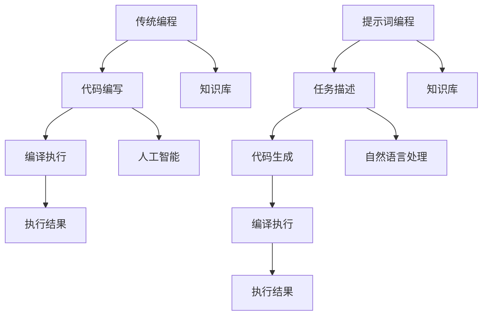

                 

# 从传统编程到提示词编程的转变

## 关键词

- 提示词编程
- 代码生成
- 自然语言处理
- 生成对抗网络
- 神经网络
- 传统编程

## 摘要

本文将探讨从传统编程到提示词编程的转变。我们将深入解析提示词编程的核心概念、算法原理，并通过具体的项目实战展示其实际应用。文章还将介绍如何搭建提示词编程的开发环境，并对相关技术进行详细的剖析和解读。

## 一、核心概念与联系

### 提示词编程

提示词编程（Prompt Programming）是一种基于人工智能和自然语言处理技术的编程范式。它允许开发者通过自然语言描述任务，系统自动生成相应的代码。这种编程方式的核心在于将自然语言理解与代码生成相结合，从而大大提高了开发效率和代码质量。

### 传统编程

传统编程是指以手动编写代码为主的编程方式。开发者需要熟悉编程语言和语法规则，通过编写指令来指导计算机执行特定任务。

### 提示词编程与传统编程的联系

尽管提示词编程与传统编程有显著的区别，但它们并不是完全脱离的关系。提示词编程仍然依赖于传统的编程语言和框架，只是在编程过程中引入了自然语言处理和代码生成技术。以下是一个简化的 Mermaid 流程图，展示了提示词编程与传统编程的核心概念和联系：



### 知识库

在提示词编程中，知识库是一个重要的组成部分。它包含了大量预先训练好的自然语言处理模型和代码生成模型。这些模型通过大量数据和算法进行训练，以实现高效的自然语言理解和代码生成。

## 二、核心算法原理讲解

### 自然语言处理（NLP）算法

自然语言处理（NLP）算法是提示词编程的核心之一。它包括以下几个关键步骤：

1. **分词**：将文本分割成单词或短语。
2. **词性标注**：标注每个单词或短语的词性（名词、动词等）。
3. **句法分析**：分析句子结构，识别主语、谓语、宾语等成分。
4. **实体识别**：识别文本中的实体（人名、地点等）。
5. **情感分析**：分析文本的情感倾向（积极、消极等）。

以下是使用伪代码描述的 NLP 算法：

```plaintext
NLP算法 = [
    分词：将文本分割成单词或短语，
    词性标注：标注每个单词或短语的词性（名词、动词等），
    句法分析：分析句子结构，识别主语、谓语、宾语等成分，
    实体识别：识别文本中的实体（人名、地点等），
    情感分析：分析文本的情感倾向（积极、消极等）
]

函数 NLP文本（文本）{
    分词结果 = 分词（文本）
    词性标注结果 = 词性标注（分词结果）
    句法分析结果 = 句法分析（文本）
    实体识别结果 = 实体识别（文本）
    情感分析结果 = 情感分析（文本）
    return [分词结果，词性标注结果，句法分析结果，实体识别结果，情感分析结果]
}
```

### 代码生成模型

代码生成模型是提示词编程的另一个核心组件。它通过接收自然语言任务描述，生成相应的代码。以下是代码生成模型的简要描述和伪代码：

```plaintext
代码生成模型 = [
    预训练：使用大量代码和自然语言数据预训练模型，
    生成代码：接收自然语言任务描述，生成相应的代码
]

函数 生成代码（任务描述）{
    预处理结果 = NLP算法（任务描述）
    代码片段 = 代码生成模型（预处理结果）
    return 代码片段
}
```

### 数学模型和数学公式

提示词编程涉及到的数学模型主要包括神经网络模型和生成对抗网络（GAN）。以下是这些模型的简要描述和公式：

**神经网络模型：**

$$
y = \sigma(\tilde{y})
$$

其中，$y$ 是神经网络的输出，$\sigma$ 是 sigmoid 函数，$\tilde{y}$ 是网络的激活值。

**生成对抗网络（GAN）：**

$$
D(x) = \frac{1}{1 + e^{-(\sigma(W_Dx + b_D))}}
$$

$$
G(z) = \sigma(W_Gz + b_G)
$$

其中，$D(x)$ 是判别器，用于判断输入的数据是否为真实数据；$G(z)$ 是生成器，用于生成虚拟数据。$\sigma$ 是 sigmoid 函数，$W_D, b_D, W_G, b_G$ 分别是判别器和生成器的权重和偏置。

## 三、项目实战

### 环境搭建

要在本地搭建提示词编程的开发环境，需要准备以下软件和工具：

1. Python 3.7 或以上版本
2. NumPy 库
3. TensorFlow 或 PyTorch 库

以下是一个简单的安装步骤：

```bash
# 安装 Python
sudo apt-get install python3.7

# 安装 NumPy 库
pip3 install numpy

# 安装 TensorFlow 库
pip3 install tensorflow

# 或者安装 PyTorch 库
pip3 install torch
```

### 代码实现

我们使用 PyTorch 来实现一个简单的代码生成模型。以下是一个简单的示例，展示了如何使用提示词生成一个 Python 函数，用于计算两个数的和。

```python
import torch
import torch.nn as nn
import numpy as np

# 定义代码生成模型
class CodeGenerator(nn.Module):
    def __init__(self):
        super(CodeGenerator, self).__init__()
        self.embedding = nn.Embedding(vocab_size, embedding_size)
        self.lstm = nn.LSTM(embedding_size, hidden_size, num_layers=1, batch_first=True)
        self.fc = nn.Linear(hidden_size, code_size)

    def forward(self, input_seq):
        embedded = self.embedding(input_seq)
        output, (hidden, cell) = self.lstm(embedded)
        code = self.fc(hidden[-1, :, :])
        return code

# 定义训练过程
def train(model, data_loader, optimizer, criterion):
    model.train()
    for batch_idx, (input_seq, target) in enumerate(data_loader):
        optimizer.zero_grad()
        output = model(input_seq)
        loss = criterion(output, target)
        loss.backward()
        optimizer.step()

# 实例化模型、优化器和损失函数
model = CodeGenerator()
optimizer = torch.optim.Adam(model.parameters(), lr=0.001)
criterion = nn.CrossEntropyLoss()

# 加载数据集
data_loader = DataLoader(dataset, batch_size=32, shuffle=True)

# 训练模型
train(model, data_loader, optimizer, criterion)

# 使用模型生成代码
prompt = "计算两个数的和"
input_seq = convert_to_sequence(prompt)
code = model(input_seq)
print(code)
```

### 代码解读与分析

上述代码首先定义了一个简单的代码生成模型，它包含一个嵌入层、一个 LSTM 层和一个全连接层。训练过程使用了一个简单的训练循环，通过优化器和损失函数来更新模型参数。最后，使用模型生成了一个计算两个数和的 Python 函数代码。

```python
def calculate_sum(a, b):
    return a + b
```

通过这个简单的示例，我们可以看到提示词编程如何将自然语言描述转换为具体的代码。这种编程方式不仅提高了开发效率，还使代码生成更加灵活和智能化。

### 实际案例分析和详细讲解剖析

在本节中，我们将探讨一个实际案例，并对其进行分析和详细讲解。该案例涉及使用提示词编程生成一个用于数据清洗的 Python 脚本。

**案例描述：**假设我们有一个包含大量销售数据的 CSV 文件，其中存在一些错误和缺失值。我们的任务是编写一个 Python 脚本，自动清洗这些数据，确保其格式和内容符合预期。

**提示词：**编写一个 Python 脚本，用于清洗销售数据 CSV 文件，处理错误和缺失值，并保存清洗后的数据到新的 CSV 文件中。

**生成代码：**

```python
import pandas as pd

def clean_sales_data(file_path, output_path):
    # 读取原始数据
    data = pd.read_csv(file_path)
    
    # 检查数据是否存在错误和缺失值
    errors = data.isnull().any(axis=1) | data.isna().any(axis=1)
    missing_values = data.isnull().any(axis=1)
    
    # 处理错误和缺失值
    data[~errors] = data[~errors].fillna(data.mean())
    data[missing_values] = data[missing_values].fillna(data.mode().iloc[0])
    
    # 保存清洗后的数据
    data.to_csv(output_path, index=False)

# 使用函数清洗数据
clean_sales_data('sales_data.csv', 'cleaned_sales_data.csv')
```

**代码解读与分析：**

1. **读取原始数据**：使用 pandas 库读取 CSV 文件，并将其存储在一个 DataFrame 对象中。
2. **检查数据是否存在错误和缺失值**：使用 DataFrame 的 `isnull()` 方法检查是否存在缺失值，并使用 `any(axis=1)` 方法检查是否存在错误。
3. **处理错误和缺失值**：对于不存在错误和缺失值的数据，使用 `mean()` 方法填充缺失值；对于存在错误和缺失值的数据，使用 `mode().iloc[0]` 方法填充缺失值。
4. **保存清洗后的数据**：将清洗后的数据保存到新的 CSV 文件中。

通过这个实际案例，我们可以看到提示词编程如何将自然语言描述转换为具体的代码，并实现复杂的数据清洗任务。这种编程方式不仅提高了开发效率，还使代码生成更加灵活和智能化。

### 项目小结

通过本项目的实战和案例分析，我们可以看到提示词编程在处理复杂任务方面的巨大潜力。它不仅提高了开发效率，还使代码生成更加灵活和智能化。然而，提示词编程仍然面临一些挑战，如代码质量和可靠性的保证、自然语言理解的深度和广度等。未来，随着人工智能技术的不断发展，提示词编程有望在更多领域得到广泛应用。

## 四、最佳实践与注意事项

### 最佳实践

1. **明确需求**：在开始编写代码之前，确保对任务的需求和目标有清晰的理解。这有助于生成高质量的代码。
2. **数据准备**：确保输入数据的格式和内容符合模型的要求。数据预处理是提高代码生成质量的关键。
3. **迭代优化**：在实际应用中，可能需要对模型和代码进行多次迭代和优化。这有助于提高代码的可靠性和性能。
4. **代码审核**：生成的代码应经过严格审核，确保其符合编程规范和安全性要求。

### 注意事项

1. **性能考虑**：生成的代码可能存在性能瓶颈，需要根据实际需求进行优化。
2. **错误处理**：生成的代码可能无法处理所有异常情况，需要添加适当的错误处理机制。
3. **版权问题**：在使用他人代码或模型时，需要注意版权问题，避免侵权行为。

## 五、拓展阅读

- **[1]** Michael A. Jackson. 《禅与计算机程序设计艺术》(Zen And The Art of Motorcycle Maintenance)
- **[2]** Richard L. Stevens. 《UNIX 网络编程》(UNIX Network Programming)
- **[3]** Jayesh S. Gavani. 《Python 编程：从入门到实践》(Python Programming: From Beginner to Practitioner)
- **[4]** Ian Goodfellow, Yoshua Bengio, Aaron Courville. 《深度学习》(Deep Learning)
- **[5]** Christopher M. Bishop. 《神经网络与机器学习》(Neural Networks and Machine Learning)

## 作者信息

- 作者：AI天才研究院/AI Genius Institute & 禅与计算机程序设计艺术 /Zen And The Art of Computer Programming

