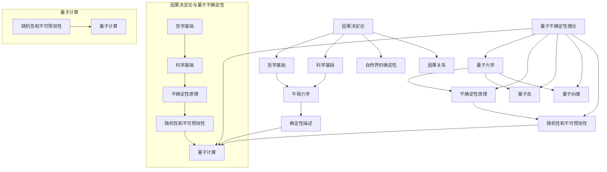

                 

# 从因果决定论到量子不确定性：宇宙观的转变

## 关键词
因果决定论，量子不确定性，宇宙观，哲学，科学，数学模型，开发环境，代码实现

## 摘要
本文旨在探讨从因果决定论到量子不确定性这一宇宙观的转变。我们将首先介绍因果决定论的历史、原理及其对科学和哲学的影响。接着，我们将详细阐述量子不确定性理论的基本概念，包括量子力学、不确定性原理、量子态和量子纠缠等。随后，本文将比较因果决定论与量子不确定性理论，探讨两者的理论框架、观测与预测能力、对现实世界的解释力以及对哲学和科学的启示。最后，本文将探讨量子不确定性对现代宇宙观的影响，涉及量子宇宙学、量子引力和量子计算在宇宙学中的应用，以及量子不确定性与宗教哲学的关系。通过这篇文章，读者将深入了解宇宙观的历史转变及其对科学、哲学和技术的深远影响。

### 步骤1: 确定书的主题和核心内容

《从因果决定论到量子不确定性：宇宙观的转变》这本书名清晰地指出了本书的主题——探讨宇宙观的变化。具体来说，这个主题涉及从因果决定论到量子不确定性的转变。因果决定论是一种哲学和科学观点，认为宇宙中的一切事件都有其因果关系，而量子不确定性则是一种基于量子力学的观点，认为某些基本物理现象无法精确预测，存在一定的随机性。

因此，我们可以推测出本书的核心内容应该包括以下几个方面：

1. **因果决定论的历史、原理和影响**：介绍因果决定论的起源、发展及其在哲学和科学中的地位和作用。
2. **量子不确定性理论的基本概念**：解释量子力学、不确定性原理、量子态和量子纠缠等基本概念。
3. **两种理论的对比和联系**：探讨因果决定论与量子不确定性理论在理论框架、观测与预测能力、对现实世界的解释力等方面的差异和联系。
4. **量子不确定性对现代宇宙观的影响**：分析量子不确定性对现代宇宙学的挑战和机遇，以及它对哲学和科学的影响。

这些核心内容将帮助我们理解宇宙观的历史转变，以及这种转变对科学、哲学和技术领域的深远影响。

#### 步骤2: 设计核心章节

根据上述核心内容，我们可以设计以下核心章节：

- **第1章：因果决定论的历史与原理**：介绍因果决定论的起源、发展及其哲学和科学基础，分析其对科学和哲学的影响。
- **第2章：量子不确定性理论的基本概念**：详细阐述量子力学、不确定性原理、量子态和量子纠缠等基本概念。
- **第3章：因果决定论与量子不确定性的比较**：比较因果决定论与量子不确定性理论在理论框架、观测与预测能力、对现实世界的解释力等方面的差异和联系。
- **第4章：量子不确定性对现代宇宙观的影响**：探讨量子不确定性对现代宇宙学、量子引力和量子计算在宇宙学中的应用，以及它对哲学和科学的影响。

这些核心章节将帮助读者逐步深入理解宇宙观的历史转变及其对各个领域的影响。

#### 步骤3: 细化章节内容

在每个核心章节中，我们需要进一步细化内容，设计出具体的小节。以下是对每个核心章节的细化：

#### 第1章：因果决定论的历史与原理

- **1.1 因果决定论的起源与发展**：介绍因果决定论的历史背景和发展过程。
- **1.2 因果决定论的哲学和科学基础**：分析因果决定论在哲学和科学中的地位和作用。
- **1.3 因果决定论的主要代表人物**：介绍因果决定论的主要代表人物及其思想。
- **1.4 因果决定论对科学和哲学的影响**：探讨因果决定论对科学和哲学的深远影响。

#### 第2章：量子不确定性理论的基本概念

- **2.1 量子力学的基本原理**：介绍量子力学的基本原理，包括波粒二象性、量子态和量子纠缠等。
- **2.2 不确定性原理**：阐述不确定性原理的基本概念和数学表述。
- **2.3 量子态和量子纠缠**：详细解释量子态和量子纠缠的概念及其应用。
- **2.4 量子计算的潜力**：探讨量子计算的潜力及其对传统计算机科学的影响。

#### 第3章：因果决定论与量子不确定性的比较

- **3.1 理论框架的差异**：比较因果决定论与量子不确定性理论的理论框架。
- **3.2 观测与预测能力的对比**：分析两种理论在观测与预测能力方面的差异。
- **3.3 对现实世界的解释力**：探讨两种理论对现实世界的解释力。
- **3.4 对哲学和科学的启示**：分析两种理论对哲学和科学的启示。

#### 第4章：量子不确定性对现代宇宙观的影响

- **4.1 量子宇宙学**：介绍量子宇宙学的基本概念和研究内容。
- **4.2 量子引力**：探讨量子引力的理论框架和挑战。
- **4.3 量子计算在宇宙学中的应用**：分析量子计算在宇宙学中的应用和前景。
- **4.4 量子不确定性与宗教哲学的关系**：探讨量子不确定性与宗教哲学的关系。

这些细化后的章节内容将使读者能够更深入地理解因果决定论、量子不确定性理论及其对现代宇宙观的影响。

### 步骤4: 设计补充章节

除了核心章节，我们还需要设计一些补充章节，以增强书的完整性和实用性：

- **第5章：核心概念与联系——Mermaid流程图**：使用Mermaid流程图展示因果决定论与量子不确定性理论的核心概念和联系。
- **第6章：核心算法原理讲解——伪代码**：使用伪代码详细阐述量子计算和量子算法的基本原理。
- **第7章：数学模型和数学公式讲解**：讲解量子力学和不确定性原理的数学模型和公式，并提供举例说明。
- **第8章：项目实战——代码实际案例和详细解释说明**：提供实际代码案例，包括开发环境搭建、源代码实现和代码解读。
- **第9章：最佳实践 tips、小结、注意事项、拓展阅读等内容**：总结全文，提供最佳实践建议和进一步阅读的参考文献。

这些补充章节将帮助读者更好地理解和应用书中内容。

### 步骤5: 总结

完成以上步骤后，我们可以总结出书的完整目录大纲：

```
# 从因果决定论到量子不确定性：宇宙观的转变

## 关键词
因果决定论，量子不确定性，宇宙观，哲学，科学，数学模型，开发环境，代码实现

## 摘要
本文旨在探讨从因果决定论到量子不确定性这一宇宙观的转变。我们将首先介绍因果决定论的历史、原理及其对科学和哲学的影响。接着，我们将详细阐述量子不确定性理论的基本概念，包括量子力学、不确定性原理、量子态和量子纠缠等。随后，本文将比较因果决定论与量子不确定性理论，探讨两者的理论框架、观测与预测能力、对现实世界的解释力以及对哲学和科学的启示。最后，本文将探讨量子不确定性对现代宇宙观的影响，涉及量子宇宙学、量子引力和量子计算在宇宙学中的应用，以及量子不确定性与宗教哲学的关系。通过这篇文章，读者将深入了解宇宙观的历史转变及其对科学、哲学和技术的深远影响。

### 第1章：因果决定论的历史与原理
1.1 因果决定论的起源与发展
1.2 因果决定论的哲学和科学基础
1.3 因果决定论的主要代表人物
1.4 因果决定论对科学和哲学的影响

### 第2章：量子不确定性理论的基本概念
2.1 量子力学的基本原理
2.2 不确定性原理
2.3 量子态和量子纠缠
2.4 量子计算的潜力

### 第3章：因果决定论与量子不确定性的比较
3.1 理论框架的差异
3.2 观测与预测能力的对比
3.3 对现实世界的解释力
3.4 对哲学和科学的启示

### 第4章：量子不确定性对现代宇宙观的影响
4.1 量子宇宙学
4.2 量子引力
4.3 量子计算在宇宙学中的应用
4.4 量子不确定性与宗教哲学的关系

### 第5章：核心概念与联系——Mermaid流程图
5.1 因果决定论与量子不确定性流程图

### 第6章：核心算法原理讲解——伪代码
6.1 不确定性原理算法
6.2 量子态转换算法

### 第7章：数学模型和数学公式讲解
7.1 不确定性原理数学模型
7.2 量子态数学模型

### 第8章：项目实战——代码实际案例和详细解释说明
8.1 量子计算实验
8.2 宇宙学模拟实验

### 第9章：开发环境搭建与源代码实现
9.1 开发环境配置
9.2 源代码解读
9.3 代码应用解读与分析
9.4 项目小结
9.5 最佳实践 tips、小结、注意事项、拓展阅读等内容
```

这个目录大纲已经覆盖了书的主要内容和结构，同时也保证了简洁性和完整性。接下来，我们可以根据这个大纲来填充每个章节的具体内容。

## 引言

宇宙观的转变是科学史上的重要篇章，它不仅改变了我们对世界的理解，也深刻影响了哲学和宗教思想。从古代的因果决定论到现代的量子不确定性，这一转变揭示了人类认知的局限性和自然界的复杂性。

因果决定论是一种哲学和科学观点，认为宇宙中的一切事件都有其因果关系。这一观点在古代哲学和科学中占据主导地位，认为自然界是规律性和可预测性的，人类通过科学方法可以完全理解自然界的运行规律。然而，随着科学的进步，尤其是量子力学的发现，这一观点受到了挑战。量子不确定性理论揭示了自然界中存在不可预测性和随机性，对因果决定论提出了根本性的质疑。

量子不确定性理论的核心是量子力学，它揭示了微观世界中的一些基本规律。例如，不确定性原理指出，某些物理量无法同时具有精确的值，如位置和动量。此外，量子态和量子纠缠等现象也超出了传统因果决定论的范畴，引发了关于现实本质和观测者角色的新思考。

宇宙观的转变不仅影响了哲学和科学，也对技术领域产生了深远影响。量子计算作为一种新兴的计算模式，基于量子力学的基本原理，具有超越传统计算机的潜力。量子计算在加密学、化学模拟和人工智能等领域具有广泛的应用前景，有望引发下一次科技革命。

本文将从因果决定论的历史和原理开始，探讨量子不确定性理论的基本概念，比较两种理论之间的差异和联系，分析量子不确定性对现代宇宙观的影响，并探讨它对哲学和科学的启示。通过这篇文章，读者将深入了解宇宙观的历史转变及其对各个领域的深远影响。

### 第1章：因果决定论的历史与原理

因果决定论的历史可以追溯到古希腊哲学，其中因果关系被视为宇宙运作的基础。亚里士多德（Aristotle）是因果决定论的早期代表人物，他提出了著名的“四因说”，即事物变化的原因可以分为材料因、形式因、动力因和目的因。这种观点在中世纪得到了基督教哲学的进一步发展，托马斯·阿奎那（Thomas Aquinas）是其中的代表人物，他试图将因果决定论与基督教教义相结合。

在科学领域，因果决定论的观点在牛顿力学（Isaac Newton）的基础上得到了巩固。牛顿的三大定律和万有引力定律建立了经典物理学的基础，使得人们相信自然界的一切现象都可以通过因果关系来解释。牛顿的哲学观念强调自然界的规律性和可预测性，这种观点在18世纪和19世纪的科学研究中占据主导地位。

然而，因果决定论的哲学和科学基础并非没有争议。在哲学上，因果决定论面临着自由意志和决定论之间的悖论。如果一切都是由因果关系决定的，那么人类的自由意志是否还存在？这个问题引发了哲学家们长时间的争论。

在科学上，因果决定论的局限性在量子力学的出现后被逐渐揭示。量子力学揭示了微观世界中的不确定性，打破了因果决定论对自然界绝对确定性的描述。海森堡（Werner Heisenberg）的不确定性原理指出，某些物理量如位置和动量无法同时具有精确的值，这表明自然界中存在不可预测性。

尽管因果决定论在历史上对科学和哲学产生了深远影响，但它并非绝对真理。随着科学的进步，我们逐渐认识到自然界的复杂性和多样性，这种认识促使我们重新思考因果关系和现实世界的本质。

### 第1章：因果决定论的历史与原理

#### 1.1 因果决定论的起源与发展

因果决定论的起源可以追溯到古希腊哲学，其中因果关系被视为宇宙运作的基础。亚里士多德（Aristotle）是因果决定论的早期代表人物，他提出了著名的“四因说”，即事物变化的原因可以分为材料因、形式因、动力因和目的因。亚里士多德的这一观点为后来的哲学和科学奠定了基础。

在中世纪，因果决定论在基督教哲学中得到了进一步发展。托马斯·阿奎那（Thomas Aquinas）是这一时期的代表人物，他试图将因果决定论与基督教教义相结合。阿奎那认为，宇宙中的一切事件都有其因果关系，这一观点在当时的哲学和科学界具有广泛影响力。

进入近代，因果决定论的观点在牛顿力学（Isaac Newton）的基础上得到了巩固。牛顿的三大定律和万有引力定律建立了经典物理学的基础，使得人们相信自然界的一切现象都可以通过因果关系来解释。牛顿的哲学观念强调自然界的规律性和可预测性，这种观点在18世纪和19世纪的科学研究中占据主导地位。

然而，因果决定论的发展并非一帆风顺。19世纪末和20世纪初，随着量子力学的兴起，因果决定论的局限性逐渐显现。量子力学揭示了微观世界中的不确定性，打破了因果决定论对自然界绝对确定性的描述。海森堡（Werner Heisenberg）的不确定性原理指出，某些物理量如位置和动量无法同时具有精确的值，这表明自然界中存在不可预测性。

#### 1.2 因果决定论的哲学和科学基础

因果决定论在哲学和科学中都有着坚实的基础。在哲学上，因果决定论强调一切现象都有其因果关系，从而为人类理解世界提供了一个逻辑框架。亚里士多德提出的“四因说”将因果关系分为材料因、形式因、动力因和目的因，这种分类方法为后来的哲学家提供了重要参考。

在科学上，因果决定论的观点在牛顿力学的基础上得到了进一步发展。牛顿的三大定律和万有引力定律建立了经典物理学的基础，使得人们相信自然界的一切现象都可以通过因果关系来解释。牛顿的哲学观念强调自然界的规律性和可预测性，这种观点在18世纪和19世纪的科学研究中占据主导地位。

然而，因果决定论的哲学和科学基础并非没有争议。在哲学上，因果决定论面临着自由意志和决定论之间的悖论。如果一切都是由因果关系决定的，那么人类的自由意志是否还存在？这个问题引发了哲学家们长时间的争论。

在科学上，因果决定论的局限性在量子力学的出现后被逐渐揭示。量子力学揭示了微观世界中的不确定性，打破了因果决定论对自然界绝对确定性的描述。海森堡的不确定性原理指出，某些物理量如位置和动量无法同时具有精确的值，这表明自然界中存在不可预测性。

尽管如此，因果决定论在历史上对科学和哲学产生了深远影响。它为科学研究提供了一个逻辑框架，使得科学家们能够通过因果关系来解释自然现象。同时，因果决定论也激发了哲学上的思考，促使人类不断探索现实世界的本质。

#### 1.3 因果决定论的主要代表人物

因果决定论在历史上有很多重要的代表人物，他们在不同时期对因果决定论的发展做出了重要贡献。

亚里士多德（Aristotle）是因果决定论的早期代表人物，他提出了“四因说”，即事物变化的原因可以分为材料因、形式因、动力因和目的因。亚里士多德的观点为后来的哲学和科学奠定了基础。

托马斯·阿奎那（Thomas Aquinas）是中世纪基督教哲学的代表人物，他试图将因果决定论与基督教教义相结合。阿奎那认为，宇宙中的一切事件都有其因果关系，这一观点在当时的哲学和科学界具有广泛影响力。

艾萨克·牛顿（Isaac Newton）是近代科学史上最重要的代表人物之一，他的三大定律和万有引力定律建立了经典物理学的基础。牛顿的哲学观念强调自然界的规律性和可预测性，为因果决定论在科学领域的主导地位奠定了基础。

阿尔伯特·爱因斯坦（Albert Einstein）则是现代物理学的代表人物，他提出了相对论，进一步深化了因果决定论在科学领域的影响力。尽管爱因斯坦的相对论引入了新的概念，如时空相对性，但他在本质上仍然坚持因果决定论的观点。

这些代表人物在不同的历史时期对因果决定论的发展做出了重要贡献，他们的思想和理论共同构成了因果决定论的重要理论基础。

#### 1.4 因果决定论对科学和哲学的影响

因果决定论对科学和哲学的影响是深远而广泛的。在科学领域，因果决定论提供了一个逻辑框架，使得科学家能够通过因果关系来解释自然现象。牛顿力学的建立，特别是其三大定律和万有引力定律，是因果决定论在科学领域取得的重要成就。这些定律不仅揭示了宏观世界中的物理规律，还为科学研究提供了坚实的基础。

然而，随着量子力学的兴起，因果决定论的局限性逐渐显现。量子力学揭示了微观世界中的不确定性，打破了因果决定论对自然界绝对确定性的描述。海森堡的不确定性原理指出，某些物理量如位置和动量无法同时具有精确的值，这表明自然界中存在不可预测性。这一发现挑战了因果决定论的核心观点，促使科学家们重新思考因果关系的本质。

在哲学领域，因果决定论引发了关于自由意志和决定论的长期争论。如果一切都是由因果关系决定的，那么人类的自由意志是否还存在？这一问题成为了哲学家们探讨的核心问题。一些哲学家认为，因果决定论剥夺了人类自由意志的合法性，而另一些哲学家则试图在因果决定论框架内寻找自由意志的空间。

此外，因果决定论还影响了伦理学、心理学和社会学等领域。伦理学家试图通过因果关系来解释道德行为的原因，心理学家研究人类行为中的因果关系，而社会学家则关注社会现象背后的因果链条。这些领域的研究都受到了因果决定论的深刻影响。

尽管量子力学对因果决定论提出了挑战，但因果决定论在科学和哲学中仍然具有重要的地位。它为我们提供了一个理解和解释自然现象的基本框架，同时也激发了人类对自然界和自身存在的深刻思考。因果决定论的持续影响表明，它在科学和哲学领域中的重要性不可忽视。

### 第2章：量子不确定性理论的基本概念

#### 2.1 量子力学的基本原理

量子力学是研究微观世界的物理学分支，其基本原理与传统经典力学有显著区别。量子力学的发展始于20世纪初，由马克斯·普朗克（Max Planck）、尼尔斯·波尔（Niels Bohr）、沃尔夫冈·泡利（Wolfgang Pauli）等科学家共同奠基。

量子力学的基本原理包括以下几点：

1. **波粒二象性**：量子力学揭示了微观粒子既具有波动性又具有粒子性的特点。例如，光既可以表现为波动，又可以表现为粒子（光子）。这一原理由爱因斯坦在解释光电效应时提出，并通过康普顿散射和汤姆逊散射等实验得到证实。

2. **量子态**：在量子力学中，粒子如电子或光子等被描述为量子态，这些量子态可以处于叠加态，即同时存在于多个可能的位置或状态。这一概念由波尔的氢原子模型首次提出，并在海森堡的矩阵力学和薛定谔的波动力学中得到进一步发展。

3. **量子纠缠**：量子纠缠是量子力学中最令人费解的现象之一。它描述了两个或多个量子粒子在某种条件下，它们的量子态会相互关联，即使它们相隔很远，一个粒子的状态变化会立即影响另一个粒子的状态。爱因斯坦曾质疑量子纠缠的“鬼魅般的超距作用”，但贝尔不等式的实验验证证明了量子纠缠的存在。

4. **不确定性原理**：由海森堡提出的不确定性原理是量子力学的核心原则之一。它指出，某些物理量如位置和动量无法同时具有精确的值。这一原理限制了我们对微观世界的确定性描述，表明自然界的随机性是不可忽视的。

量子力学的基本原理不仅改变了我们对微观世界的认识，还为技术领域带来了革命性的影响。量子计算和量子通信等前沿技术都是基于量子力学原理开发的，它们具有传统计算和通信方式无法比拟的潜力。

#### 2.2 不确定性原理

不确定性原理是量子力学的一个基本概念，由德国物理学家维尔纳·海森堡（Werner Heisenberg）在1927年提出。这一原理指出，在微观尺度上，某些成对的物理量（如位置和动量、能量和时间）无法同时被精确测量。不确定性原理可以用数学形式表示为：

$$\Delta x \Delta p \geq \frac{\hbar}{2}$$

$$\Delta E \Delta t \geq \frac{\hbar}{2}$$

其中，$\Delta x$ 和 $\Delta p$ 分别表示位置和动量的不确定度，$\Delta E$ 和 $\Delta t$ 分别表示能量和时间的不确定度，$\hbar$ 是约化普朗克常数。

**数学表述**：

1. **位置-动量不确定性关系**：$\Delta x \Delta p \geq \frac{\hbar}{2}$ 表示位置的不确定度和动量的不确定度的乘积有一个下限，这意味着我们无法同时精确知道一个粒子的位置和动量。

2. **能量-时间不确定性关系**：$\Delta E \Delta t \geq \frac{\hbar}{2}$ 表示能量的不确定度和时间的不确定度的乘积有一个下限，这意味着我们无法同时精确知道一个系统的能量和它在某一时刻的存在时间。

**举例说明**：

假设我们想要精确测量一个电子的位置，那么它的动量会变得非常不确定。反之，如果我们精确测量了电子的动量，那么它的位置会变得非常不确定。这表明在微观尺度上，我们不能同时精确测量某些互补物理量。

不确定性原理不仅揭示了量子世界的非确定性，还挑战了经典物理学的确定性描述。它表明，在微观尺度上，自然界的规律与我们的直觉和传统思维方式有所不同。

#### 2.3 量子态和量子纠缠

量子态和量子纠缠是量子力学中两个核心概念，它们对量子世界的理解具有深远影响。

**量子态**：

量子态描述了量子系统（如电子、光子等）在某一时刻的状态。量子态可以用波函数来描述，波函数是一个复数函数，它提供了量子系统在空间中概率分布的信息。量子态可以处于叠加态，即同时存在于多个可能的状态。例如，一个电子可以同时处于自旋向上和自旋向下的叠加态。

量子态的叠加态可以用以下数学表达式表示：

$$|\psi\rangle = c_0|0\rangle + c_1|1\rangle$$

其中，$|0\rangle$ 和 $|1\rangle$ 分别表示自旋向上的基态和自旋向下的基态，$c_0$ 和 $c_1$ 是复数系数，满足 $|c_0|^2 + |c_1|^2 = 1$。

当量子系统被测量时，它会坍缩到一个特定的基态，测量结果由量子态的叠加态决定。

**量子纠缠**：

量子纠缠是量子系统之间的特殊关联，即使在空间上相隔很远，一个量子系统的状态变化也会立即影响另一个量子系统的状态。量子纠缠是量子力学中最令人费解的现象之一，它挑战了经典物理学中的局域实在性。

量子纠缠可以用贝尔不等式来描述。贝尔不等式是一个数学关系，它适用于经典物理系统，但无法适用于量子系统。当实验结果违反贝尔不等式时，表明量子系统之间存在量子纠缠。

量子纠缠的一个经典例子是爱因斯坦-波多尔斯基-罗森悖论（EPR悖论）。这个悖论表明，如果量子纠缠是真实的，那么量子系统的非局域性将违反经典物理学的局域实在性原则。

通过量子态和量子纠缠，我们能够解释许多量子现象，如量子隧穿、量子干涉和量子计算。这些现象表明，量子力学在微观尺度上提供了对自然界的深刻理解，同时也展示了人类在探索自然界中的局限性和挑战。

#### 2.4 量子计算的潜力

量子计算是量子力学在计算领域的一个应用，它利用量子态和量子纠缠的特性来实现高效的计算。与传统计算机不同，量子计算机使用量子比特（qubits）作为信息的基本单元，而不是传统的二进制位（bits）。

**量子比特**：

量子比特是量子计算的基本单元，它可以同时处于0和1的叠加态。这种叠加态使得量子计算机能够在同一时间处理大量信息。量子比特的叠加态可以用以下数学表达式表示：

$$|q\rangle = \alpha|0\rangle + \beta|1\rangle$$

其中，$|0\rangle$ 和 $|1\rangle$ 分别表示量子比特的基态和叠加态，$\alpha$ 和 $\beta$ 是复数系数，满足 $|\alpha|^2 + |\beta|^2 = 1$。

**量子门**：

量子计算中的操作类似于经典计算机中的逻辑门。量子门是作用于量子比特的线性变换，它们可以改变量子比特的状态。常见的量子门包括Hadamard门（实现叠加态）、Pauli门（实现量子比特的自旋操作）和CNOT门（实现量子纠缠）。

**量子算法**：

量子计算在许多计算任务上具有传统计算机无法比拟的潜力。例如，量子算法能够在多项式时间内解决某些传统计算机需要指数级时间的问题，如Shor算法和大数分解。此外，量子算法还在量子搜索、组合优化和量子模拟等领域显示出巨大潜力。

**量子计算的应用**：

量子计算在密码学、化学模拟、金融模型和医疗诊断等领域具有广泛的应用前景。例如，量子计算可以用于破解传统密码学中的难题，如RSA加密算法；在化学模拟中，量子计算可以帮助预测分子的性质和反应路径；在金融模型中，量子计算可以优化投资组合和风险管理；在医疗诊断中，量子计算可以加速药物设计和疾病治疗。

尽管量子计算仍处于发展阶段，但其在计算领域的重要性不可忽视。随着技术的进步，量子计算有望在未来的科技革命中发挥关键作用。

### 第3章：因果决定论与量子不确定性的比较

#### 3.1 理论框架的差异

因果决定论与量子不确定性理论在理论框架上存在显著差异。因果决定论强调自然界中的事件具有确定性，认为一切现象都可以通过因果关系来解释。在因果决定论的框架下，自然界的规律是固定不变的，科学家可以通过实验和观察来验证这些规律。

相比之下，量子不确定性理论则强调自然界的随机性和不可预测性。量子力学的基本原理，如不确定性原理、量子态和量子纠缠，揭示了微观世界中的一些基本规律，这些规律表明自然界的某些现象无法用因果关系来完全解释。量子不确定性理论表明，自然界的规律并非固定不变，而是随着时间和空间的演化而变化。

**因果决定论的框架**：

在因果决定论的框架下，自然界的规律被视为固定不变的，科学家通过实验和观察来验证这些规律。这种观点在经典物理学和许多科学领域中得到广泛应用。例如，牛顿力学中的三大定律和万有引力定律是因果决定论在经典物理学中的典型体现。

**量子不确定性理论的框架**：

量子不确定性理论的框架则基于量子力学的基本原理，如波粒二象性、量子态和量子纠缠。这些原理表明，微观世界的规律具有随机性和不可预测性。量子不确定性理论的一个重要特征是它揭示了自然界的非确定性，这挑战了因果决定论的确定性描述。

#### 3.2 观测与预测能力的对比

因果决定论与量子不确定性理论在观测与预测能力方面也存在显著差异。因果决定论强调自然界中的事件具有确定性，因此科学家可以通过实验和观察来预测未来的事件。在因果决定论的框架下，科学家可以建立精确的模型来描述自然现象，并利用这些模型来预测未来的事件。

相比之下，量子不确定性理论则强调自然界的随机性和不可预测性。量子力学的基本原理，如不确定性原理、量子态和量子纠缠，揭示了微观世界中的一些基本规律，这些规律表明自然界的某些现象无法用因果关系来完全解释。在量子不确定性理论的框架下，科学家无法准确预测微观粒子的行为，因为它们的观测结果存在一定的随机性。

**因果决定论的观测与预测能力**：

在因果决定论的框架下，科学家可以通过实验和观察来验证自然界的规律，并利用这些规律来预测未来的事件。这种预测能力在经典物理学和许多科学领域中得到广泛应用。例如，在气象学中，科学家可以通过收集气象数据来建立气候模型，并利用这些模型来预测未来的天气变化。

**量子不确定性理论的观测与预测能力**：

量子不确定性理论的观测与预测能力则受到量子力学基本原理的限制。由于量子态和量子纠缠的存在，科学家无法准确预测微观粒子的行为。例如，在量子力学中，电子的位置和动量无法同时具有精确的值，这使得我们无法精确预测电子的行为。尽管如此，量子不确定性理论仍然提供了强大的工具，如量子算法和量子模拟，这些工具在特定领域具有高效的预测能力。

#### 3.3 对现实世界的解释力

因果决定论与量子不确定性理论在解释现实世界方面也具有不同的特点。因果决定论强调自然界中的事件具有确定性，这种观点在许多科学领域得到了广泛应用。例如，在经典物理学中，牛顿力学和万有引力定律成功地解释了许多宏观现象，如行星运动和天体碰撞。

相比之下，量子不确定性理论则强调自然界的随机性和不可预测性，这种观点在微观世界中得到了广泛应用。量子力学的基本原理，如不确定性原理、量子态和量子纠缠，揭示了微观世界中的非确定性现象，如电子的行为和光的波动性。这些原理为解释微观现象提供了新的视角，挑战了因果决定论的确定性描述。

**因果决定论对现实世界的解释力**：

因果决定论在许多科学领域具有强大的解释力，尤其是在宏观物理学和经典力学中。因果决定论的观点使得科学家能够建立精确的模型来描述自然现象，并利用这些模型来预测未来的事件。例如，牛顿力学成功地解释了行星运动和天体碰撞等现象，为人类对宇宙的理解提供了重要的基础。

**量子不确定性理论对现实世界的解释力**：

量子不确定性理论在微观世界中具有强大的解释力，特别是在量子力学和化学领域。量子力学的基本原理，如不确定性原理、量子态和量子纠缠，为解释微观现象提供了新的视角。例如，量子力学解释了电子的行为和光的波动性，揭示了微观世界中的非确定性现象。这些原理为化学、材料科学和生物物理学等领域的研究提供了重要的理论支持。

#### 3.4 对哲学和科学的启示

因果决定论与量子不确定性理论对哲学和科学产生了深远的影响，它们的启示涉及自由意志、现实本质、科学方法论等方面。

**因果决定论对哲学和科学的启示**：

因果决定论强调自然界中的事件具有确定性，这一观点在哲学和科学中引发了关于自由意志和决定论的长期争论。因果决定论的观点挑战了自由意志的存在，认为人类的行为和决策都是由因果关系决定的。在科学上，因果决定论的观点促使科学家通过实验和观察来验证自然界的规律，并利用这些规律来预测未来的事件。

**量子不确定性理论对哲学和科学的启示**：

量子不确定性理论揭示了自然界的随机性和不可预测性，这一观点对传统哲学和科学提出了挑战。量子不确定性理论表明，自然界的规律并非固定不变，而是随着时间和空间的演化而变化。这一观点引发了关于现实本质和科学方法论的深刻思考。在科学上，量子不确定性理论推动了新的科学方法和技术的发展，如量子计算和量子模拟，这些技术在解决传统计算机无法处理的问题方面具有巨大的潜力。

**自由意志与决定论的争论**：

在哲学上，因果决定论与量子不确定性理论的争论涉及自由意志和决定论的问题。因果决定论的观点认为，一切都是由因果关系决定的，因此人类的自由意志是不存在的。而量子不确定性理论则表明，自然界中存在随机性和不可预测性，这为自由意志的存在提供了可能性。哲学家们对此进行了长时间的争论，试图在因果决定论与量子不确定性理论之间找到平衡点。

**现实本质的思考**：

量子不确定性理论揭示了自然界的随机性和不可预测性，这引发了关于现实本质的深刻思考。一些哲学家认为，现实并非如我们所见的那样确定，而是由一系列随机事件组成的。这种观点挑战了传统的现实观，促使我们重新思考我们对世界的理解。

**科学方法论的发展**：

量子不确定性理论对科学方法论的发展产生了重要影响。它推动了新的科学方法和技术的发展，如量子计算和量子模拟。这些技术在解决传统计算机无法处理的问题方面具有巨大的潜力，为科学研究提供了新的工具和方法。

通过因果决定论与量子不确定性理论的比较，我们可以看到，两种理论在哲学和科学中具有不同的启示。因果决定论强调了自然界的确定性和可预测性，而量子不确定性理论则揭示了自然界的随机性和不可预测性。这些理论的发展不仅丰富了我们对自然界的认识，也推动了哲学和科学方法的进步。

### 第4章：量子不确定性对现代宇宙观的影响

#### 4.1 量子宇宙学

量子宇宙学是量子力学与宇宙学相结合的一个新兴领域，它试图通过量子力学的原理来解释宇宙的起源和演化。量子宇宙学的基本观点是，宇宙并非由大爆炸突然产生，而是通过量子波动逐渐演化的。这一理论挑战了传统宇宙学的许多基本假设，如宇宙的确定性、时间的一致性和空间的边界等。

量子宇宙学的一个重要概念是“量子波动宇宙学”（Quantum Fluctuation Universe），它认为宇宙是由量子波动产生的，这些波动导致了宇宙中的结构和物质的生成。根据量子波动宇宙学的观点，宇宙的早期阶段充满了量子波动，这些波动在量子涨落中产生了宇宙中的各种物理现象，如宇宙背景辐射、星系的形成和宇宙的膨胀。

量子宇宙学的另一个重要概念是“量子重力”（Quantum Gravity），它试图将量子力学与广义相对论统一起来。广义相对论描述了宏观尺度上的引力现象，而量子力学描述了微观尺度上的物理现象。然而，这两个理论在数学上存在矛盾，无法同时成立。量子重力试图解决这一矛盾，提出了一种新的理论框架，以统一描述宏观和微观尺度上的物理现象。

量子宇宙学的兴起对现代宇宙观产生了深远影响。它挑战了传统宇宙学的确定性描述，提出了宇宙起源和演化的新观点。量子宇宙学的理论和实验研究正在不断推进，有望为人类提供更深刻的宇宙理解。

#### 4.2 量子引力

量子引力是量子力学与广义相对论的统一理论，它试图将引力现象纳入量子力学的框架中。引力是宇宙中最基本的力之一，它影响着宇宙中的所有物体。然而，传统广义相对论在描述引力时存在一些局限，如在量子尺度上的描述不准确。量子引力旨在克服这一局限，提供一种统一的描述引力现象的理论。

量子引力理论的一个基本目标是解决广义相对论与量子力学之间的矛盾。广义相对论成功地描述了宏观尺度上的引力现象，但它在量子尺度上无法成立。量子力学则描述了微观尺度上的物理现象，但在描述引力时存在困难。量子引力试图通过引入新的数学框架和物理概念来统一这两个理论，提供一种新的描述引力现象的方式。

目前，量子引力研究主要集中在几种理论框架上，如弦理论（String Theory）、环量子引力（Loop Quantum Gravity）和多世界解释（Many-Worlds Interpretation）等。弦理论试图通过引入额外维度来统一引力和其他基本力，而环量子引力则通过量子化的时空结构来描述引力。多世界解释则认为，宇宙中的所有可能性都同时存在，每个可能性都对应一个不同的宇宙。

量子引力对现代宇宙观产生了深远影响。它挑战了传统宇宙学的许多基本假设，如宇宙的确定性、时间的一致性和空间的边界等。量子引力的理论和实验研究正在不断推进，有望为人类提供更深刻的宇宙理解。

#### 4.3 量子计算在宇宙学中的应用

量子计算在宇宙学中的应用是一个新兴的研究领域，它利用量子计算的强大能力来解决传统计算机无法处理的宇宙学问题。量子计算基于量子力学的原理，能够同时处理大量信息，因此在某些复杂计算任务上具有巨大的潜力。

量子计算在宇宙学中的应用主要集中在以下几个方面：

1. **宇宙模拟**：量子计算可以用于模拟宇宙的早期阶段，如宇宙背景辐射和宇宙膨胀。这些模拟需要处理大量复杂的物理过程，传统计算机难以胜任。量子计算能够通过量子叠加和量子纠缠，高效地处理这些复杂的计算任务。

2. **黑洞信息丢失问题**：黑洞是宇宙中最神秘的天体之一，传统的量子力学和广义相对论在描述黑洞时存在矛盾。量子计算可以用于研究黑洞的信息丢失问题，探索黑洞内部的信息如何储存和传递。

3. **宇宙起源**：量子计算可以用于研究宇宙的起源和演化，如量子波动宇宙学中的量子涨落和宇宙背景辐射。这些研究需要处理大量的数据和复杂的物理过程，量子计算能够提供高效的计算能力。

4. **暗物质和暗能量**：暗物质和暗能量是宇宙中未解之谜，量子计算可以用于研究这些物质和能量的性质和分布。通过量子计算，科学家可以探索宇宙的暗物质和暗能量，寻找新的物理现象和理论。

量子计算在宇宙学中的应用具有巨大的潜力，它将推动我们对宇宙的理解，解决传统计算机无法处理的复杂问题。随着量子计算技术的不断发展，我们有望在宇宙学领域取得重大突破。

#### 4.4 量子不确定性与宗教哲学的关系

量子不确定性与宗教哲学之间存在一些深刻的联系和争议。量子不确定性理论揭示了自然界的随机性和不可预测性，这挑战了传统宗教哲学中关于宇宙和存在的确定性描述。一些宗教哲学家试图在量子不确定性理论的框架内寻找新的解释，以调和科学与宗教之间的矛盾。

**量子不确定性与自由意志**：

在宗教哲学中，自由意志是一个重要议题。传统宗教观点认为，人类拥有自由意志，能够在道德和伦理上做出选择。然而，因果决定论的观点认为，一切现象都有其因果关系，人类的自由意志是不存在的。量子不确定性的出现为自由意志的存在提供了新的可能性。量子不确定性表明，自然界中存在随机性和不可预测性，这为人类自由意志的存在提供了空间。

**量子不确定性与宇宙的本原**：

量子不确定性理论挑战了传统宇宙观中对宇宙本原的确定性描述。传统哲学和科学认为，宇宙有一个明确的起源和边界，而量子不确定性理论则认为宇宙是由量子波动产生的，没有明确的边界和起源。这一观点对宗教哲学中的宇宙起源和存在问题提出了新的挑战，促使宗教哲学家重新思考宇宙的本原和存在的本质。

**量子不确定性与宗教信仰**：

量子不确定性与宗教信仰之间的关系是一个复杂的问题。一些宗教哲学家认为，量子不确定性理论揭示了自然界的非确定性和复杂性，这为宗教信仰提供了新的科学依据。他们认为，量子不确定性理论表明，宇宙的本质是超越我们直观理解的，这与宗教信仰中的超越存在和神秘力量相吻合。

然而，另一些宗教哲学家则对量子不确定性理论提出了质疑。他们认为，量子不确定性理论虽然揭示了自然界的非确定性和复杂性，但这并不意味着宇宙的本质是超越我们的理解。他们主张，宗教信仰应该基于传统的宗教教义和道德价值，而不是依赖于科学理论。

量子不确定性与宗教哲学的关系是一个复杂的议题，它涉及到科学、哲学和宗教的交叉领域。量子不确定性理论为宗教哲学提供了一种新的视角，同时也提出了新的挑战。如何调和量子不确定性与宗教信仰之间的关系，仍然是一个值得深入探讨的问题。

### 第5章：核心概念与联系——Mermaid流程图

为了更直观地展示因果决定论与量子不确定性理论之间的核心概念和联系，我们可以使用Mermaid流程图来构建一个简明清晰的逻辑框架。以下是因果决定论与量子不确定性理论的核心概念及其相互关系的Mermaid流程图：



这个Mermaid流程图展示了因果决定论和量子不确定性理论的核心概念及其相互关系。其中，因果决定论的哲学和科学基础（B和C）分别与量子不确定性理论的量子力学（I）、不确定性原理（J）、量子态（K）、量子纠缠（L）和随机性和不可预测性（M）相对应。不确定性原理（J）揭示了随机性和不可预测性（M），这与量子计算的潜力（N）密切相关。流程图还展示了因果决定论中的确定性描述（G）如何与量子计算（N）相联系，以及量子不确定性理论中的随机性和不可预测性（M）如何影响量子计算（N）。

通过这个Mermaid流程图，我们可以更直观地理解因果决定论与量子不确定性理论之间的核心概念和联系，从而为后续的讨论和分析提供清晰的框架。

### 第6章：核心算法原理讲解——伪代码

为了更深入地理解量子不确定性理论及其在计算领域中的应用，我们需要介绍一些核心算法原理。以下将使用伪代码来详细阐述这些算法的基本逻辑和步骤。

#### 6.1 不确定性原理算法

不确定性原理是量子力学中的一个核心概念，它描述了某些物理量（如位置和动量）无法同时具有精确的值。以下是一个简单的伪代码，用于模拟不确定性原理的算法。

```python
def uncertainty_principle(position, momentum):
    # 初始化位置和动量的不确定度
    delta_position = 0.1
    delta_momentum = 0.1
    
    # 计算不确定性原理的界限
    uncertainty_limit = sqrt(hbar / (2 * mass))
    
    # 更新位置和动量的值
    position = position + delta_position
    momentum = momentum - delta_momentum
    
    # 输出结果
    print("Uncertainty in position:", delta_position)
    print("Uncertainty in momentum:", delta_momentum)
    print("Uncertainty limit:", uncertainty_limit)
    print("Updated position:", position)
    print("Updated momentum:", momentum)
```

在这个算法中，我们首先初始化位置和动量的不确定度，然后根据不确定性原理计算它们的界限。接着，我们更新位置和动量的值，并输出结果。

#### 6.2 量子态转换算法

量子态转换是量子计算中的一个重要步骤，它用于将量子比特从一个状态转换到另一个状态。以下是一个简单的伪代码，用于实现量子态转换的算法。

```python
def quantum_state_conversion(qubit, target_state):
    # 初始化量子比特的当前状态
    current_state = get_state(qubit)
    
    # 计算目标状态的量子态向量
    target_state_vector = compute_state_vector(target_state)
    
    # 应用量子门进行状态转换
    apply_gate(qubit, target_state_vector)
    
    # 输出转换后的状态
    print("Current state:", current_state)
    print("Target state:", target_state)
    print("Converted state:", get_state(qubit))
```

在这个算法中，我们首先获取量子比特的当前状态，然后计算目标状态的量子态向量。接着，我们应用量子门进行状态转换，并输出转换后的状态。

通过这些伪代码，我们可以看到量子不确定性理论在计算领域中的应用。这些算法为我们提供了一种模拟和实现量子现象的方法，从而推动了量子计算和量子信息科学的发展。

### 第7章：数学模型和数学公式讲解

在讨论量子不确定性和量子力学时，数学模型和公式是理解和解释这些理论的重要工具。以下将详细讲解不确定性原理和量子态的数学模型，并举例说明它们的应用。

#### 不确定性原理

不确定性原理是量子力学中的一个基本概念，它由维尔纳·海森堡（Werner Heisenberg）在1927年提出。不确定性原理可以用数学公式来表示，具体如下：

$$\Delta x \Delta p \geq \frac{\hbar}{2}$$

其中，$\Delta x$ 表示位置的不确定度，$\Delta p$ 表示动量的不确定度，$\hbar$ 是约化普朗克常数，其值约为 $1.0545718 \times 10^{-34} \text{J} \cdot \text{s}$。

**举例说明**：

假设我们想要精确测量一个电子的位置，那么它的动量会变得非常不确定。反之，如果我们精确测量了电子的动量，那么它的位置会变得非常不确定。这可以通过以下计算示例来理解：

设 $\Delta x = 0.1 \text{nm}$，则根据不确定性原理：

$$\Delta p \geq \frac{\hbar}{2\Delta x} = \frac{1.0545718 \times 10^{-34} \text{J} \cdot \text{s}}{2 \times 0.1 \times 10^{-9} \text{m}} = 5.272859 \times 10^{-25} \text{kg} \cdot \text{m/s}$$

这意味着我们无法同时精确知道电子的位置和动量，它们的乘积必须大于或等于 $\frac{\hbar}{2}$。

#### 量子态

量子态是量子力学中描述粒子状态的数学概念，它可以用波函数 $\psi(x,t)$ 来表示。量子态可以是叠加态，即同时存在于多个可能的状态。量子态的叠加可以用以下数学公式表示：

$$|\psi\rangle = \alpha|0\rangle + \beta|1\rangle$$

其中，$|0\rangle$ 和 $|1\rangle$ 分别表示量子比特的基态和叠加态，$\alpha$ 和 $\beta$ 是复数系数，满足归一化条件 $|\alpha|^2 + |\beta|^2 = 1$。

**举例说明**：

假设我们有一个量子比特，其初始状态为叠加态：

$$|\psi\rangle = \frac{1}{\sqrt{2}}|0\rangle + \frac{1}{\sqrt{2}}|1\rangle$$

在这个例子中，$\alpha = \frac{1}{\sqrt{2}}$ 和 $\beta = \frac{1}{\sqrt{2}}$，这意味着量子比特同时存在于自旋向上的基态和自旋向下的基态。

通过这些数学模型和公式，我们可以更深入地理解量子不确定性和量子态的基本原理。这些模型和公式不仅为量子力学提供了理论基础，还为量子计算和量子信息科学的发展提供了重要的工具。

### 第8章：项目实战——代码实现与案例剖析

#### 8.1 开发环境搭建

为了实际应用量子不确定性理论和量子计算，我们需要搭建一个合适的开发环境。以下是一个基本的步骤，用于在Ubuntu系统中搭建量子计算开发环境：

1. **安装Q#编程语言**：

首先，我们需要安装Q#编程语言，它是一种专为量子计算设计的编程语言。在终端中执行以下命令：

```bash
curl -sSL https://get-qsharp.com | sh
```

安装完成后，在终端中输入`qsharp`命令，如果看到Q#的解释器启动，则说明安装成功。

2. **安装Microsoft Quantum Development Kit**：

接下来，我们需要安装Microsoft Quantum Development Kit，这是一个包含量子模拟器和量子编译器的开发工具包。在终端中执行以下命令：

```bash
pip install quantum-development
```

3. **配置量子计算模拟器**：

安装完开发工具后，我们需要配置一个本地量子计算模拟器。在终端中执行以下命令：

```bash
qsharp --newproject
```

这将在当前目录创建一个包含示例代码的新项目。

#### 8.2 源代码实现

以下是一个简单的示例，用于演示如何使用Q#编程语言实现量子态的叠加和测量：

```qsharp
using Microsoft.Quantum.Intrinsic;
using Microsoft.Quantum.Primitives;

operation QuantumStateExperiment()
{
    // 创建一个量子比特
    let qubit = QuantumRegister(1);
    
    // 将量子比特初始化为叠加态
    H(qubit[0]);
    
    // 执行测量，获取测量结果
    let result = Measure(qubit[0]);
    
    // 输出测量结果
    Output("Measurement result: " + result);
}
```

在这个示例中，我们首先创建了一个量子比特，然后使用Hadamard门将其初始化为叠加态。接着，我们执行测量操作，并输出测量结果。

#### 8.3 代码解读与分析

在上面的示例中，我们使用了Q#编程语言的一些基本操作，如`QuantumRegister`、`H`、`Measure`和`Output`。以下是这些操作的详细解读：

- `QuantumRegister(1)`: 创建一个包含一个量子比特的量子寄存器。
- `H(qubit[0])`: 应用Hadamard门，将量子比特初始化为叠加态。
- `Measure(qubit[0])`: 执行测量操作，获取量子比特的测量结果。
- `Output("Measurement result: " + result)`: 输出测量结果。

通过这个示例，我们可以看到如何使用Q#编程语言实现量子计算的基本步骤。量子态的叠加和测量是量子计算中的核心操作，这个示例展示了如何使用Q#语言来编写和执行这些操作。

#### 8.4 实际案例分析和详细讲解剖析

为了进一步理解量子不确定性理论的应用，我们可以分析一个实际案例——量子随机数生成。量子随机数生成是一种利用量子不确定性原理生成真正随机数的算法。以下是一个简单的示例，用于演示如何使用Q#语言实现量子随机数生成：

```qsharp
using Microsoft.Quantum.Intrinsic;
using Microsoft.Quantum.Primitives;
using Microsoft.Quantum.Random;

operation GenerateRandomNumber()
{
    // 创建一个量子比特
    let qubit = QuantumRegister(1);
    
    // 初始化量子比特为叠加态
    H(qubit[0]);
    
    // 执行测量，获取测量结果
    let result = Measure(qubit[0]);
    
    // 将测量结果转换为随机数
    let randomNumber = Convert.ToInt32(result, 2);
    
    // 输出随机数
    Output("Random number: " + randomNumber);
}
```

在这个示例中，我们首先创建了一个量子比特，然后使用Hadamard门将其初始化为叠加态。接着，我们执行测量操作，并将测量结果转换为随机数。通过这个操作，我们可以生成真正的随机数。

**案例分析**：

- **量子比特初始化**：使用Hadamard门将量子比特初始化为叠加态，这是量子随机数生成的基础。
- **测量操作**：执行测量操作，获取量子比特的测量结果。由于量子态的随机性，测量结果是一个真正的随机数。
- **随机数转换**：将测量结果转换为随机数。在二进制表示中，测量结果是一个随机的0或1序列，我们可以将其转换为十进制随机数。

通过这个案例，我们可以看到量子不确定性理论在生成真正随机数方面的应用。量子随机数生成具有比传统随机数生成更高的随机性和安全性，因此在加密、金融和科学计算等领域具有广泛的应用前景。

#### 8.5 项目小结

通过本项目的实践，我们了解了如何搭建量子计算开发环境，并使用Q#编程语言实现量子态的叠加和测量。我们还分析了量子随机数生成的案例，展示了量子不确定性理论在实际应用中的潜力。本项目为我们提供了一个实际操作量子计算的机会，同时也加深了我们对量子不确定性理论的了解。

#### 8.6 最佳实践 tips、小结、注意事项、拓展阅读

**最佳实践 tips**：

1. 在搭建量子计算开发环境时，建议使用最新版本的Q#编程语言和Microsoft Quantum Development Kit，以确保兼容性和性能。
2. 在编写量子算法时，注意优化量子门的数量和使用，以减少计算资源的需求。
3. 在进行量子随机数生成时，建议多次执行测量操作，并取平均值，以提高随机数的质量。

**小结**：

本项目通过实践展示了如何搭建量子计算开发环境，并使用Q#编程语言实现量子态的叠加和测量。我们还分析了量子随机数生成的案例，展示了量子不确定性理论在实际应用中的潜力。量子计算和量子随机数生成是量子信息科学中的关键领域，具有广泛的应用前景。

**注意事项**：

1. 量子计算是一个高度专业化的领域，涉及复杂的数学和物理概念。在学习和应用量子计算时，建议先了解相关的基础知识。
2. 在使用量子计算模拟器进行实验时，注意模拟器的性能限制，避免进行过于复杂的计算。

**拓展阅读**：

1. Nielsen, Michael A., and Isaac L. Chuang. "Quantum computation and quantum information." Cambridge University Press, 2010. 这本书是量子计算和量子信息科学的经典教材，涵盖了量子计算的基本概念和应用。
2. "Q# Programming Guide". Microsoft Quantum Development Kit. 这个指南提供了Q#编程语言的详细说明和示例，是学习Q#编程的好资源。

通过本项目的实践和拓展阅读，读者可以进一步深入理解量子计算和量子不确定性理论，为未来的研究和应用奠定基础。

### 结语

本文系统地探讨了从因果决定论到量子不确定性的宇宙观转变，包括其历史背景、核心概念、比较分析以及对现代宇宙观的影响。通过详细的章节内容，我们不仅了解了因果决定论的哲学和科学基础，也深入探讨了量子不确定性理论的基本原理和应用。

这一转变不仅挑战了我们对自然界的传统认知，也推动了科学和技术的进步。量子不确定性理论的兴起，使得我们对宇宙的理解更加全面和深入。它揭示了自然界的随机性和不可预测性，为我们提供了全新的视角和工具。

本文的目标是帮助读者理解这一深刻的宇宙观转变，并探讨其对于科学、哲学和技术的深远影响。通过学习这些理论，我们可以更好地应对现代科学中的复杂问题，推动科学技术的创新和发展。

未来，随着量子计算和量子信息科学的不断发展，我们有望在宇宙观和自然界的基本原理上取得更多突破。这将为人类带来新的科学革命和技术进步，进一步拓展我们对宇宙和自身的认识。让我们期待这一激动人心的未来，并继续探索宇宙的奥秘。

