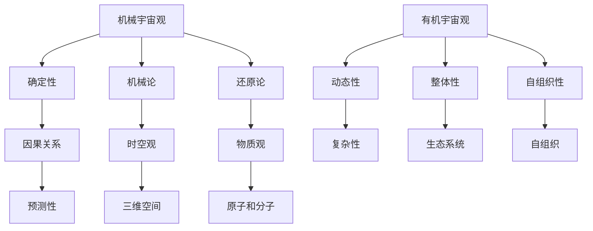

                 

# 从机械宇宙观到有机宇宙观的思想转变

## 关键词

- 机械宇宙观
- 有机宇宙观
- 思想转变
- 科学哲学
- 技术进步
- 计算机科学
- 人工智能

## 摘要

本文探讨了从机械宇宙观到有机宇宙观的思想转变。机械宇宙观是一种基于确定性、机械论和还原论的世界观，而有机宇宙观则强调复杂系统的动态性、整体性和自组织特性。本文首先介绍了机械宇宙观的基本概念，随后深入探讨了有机宇宙观的核心原则。通过对比分析，本文揭示了两种宇宙观之间的联系与差异。在此基础上，本文进一步探讨了计算机科学和人工智能领域中的思想转变，并展望了未来的发展趋势。

## 引言

宇宙观是人类对宇宙本质和结构的认识和理解。从古代的宇宙神话到现代的科学理论，人类对宇宙的认知经历了漫长的演变。其中，机械宇宙观和有机宇宙观是两种重要的宇宙观，它们分别代表了人类认知的两个不同阶段。本文旨在探讨这两种宇宙观之间的思想转变，以及这种转变对科学、技术和社会的深远影响。

## 机械宇宙观

### 基本概念

机械宇宙观是一种基于确定性、机械论和还原论的世界观。在机械宇宙观中，宇宙被视为一个巨大的机械系统，其中每一个组成部分都可以用机械原理来解释。机械宇宙观的主要特点是：

1. **确定性**：宇宙中的每一个事件都可以精确预测，因为它们都遵循固定的自然法则。
2. **机械论**：宇宙中的所有现象都可以通过机械运动来解释，类似于钟表机芯的运动。
3. **还原论**：复杂系统的行为可以通过对其组成部分的理解来解释。

### 核心原则

机械宇宙观的核心原则包括：

1. **因果关系**：宇宙中的每一个事件都有其原因，这些原因可以通过自然法则来解释。
2. **时空观**：宇宙是一个三维空间加上一维时间的结构，时间和空间是独立的。
3. **物质观**：宇宙中的所有物体都是由原子和分子组成的，这些基本粒子是构成宇宙的基石。

### 优缺点

机械宇宙观具有以下优点：

- **科学性**：机械宇宙观为科学研究和实验提供了坚实的基础。
- **预测性**：通过自然法则，我们可以预测宇宙中可能发生的事件。

然而，机械宇宙观也存在一些缺点：

- **局限性**：机械宇宙观无法解释复杂系统的整体性和自组织特性。
- **机械主义**：机械宇宙观可能过于强调机械运动，而忽视了其他形式的运动。

## 有机宇宙观

### 基本概念

有机宇宙观是一种强调复杂系统动态性、整体性和自组织特性的宇宙观。在有机宇宙观中，宇宙被视为一个有机体，其中每一个组成部分都与其他部分相互关联、相互作用。有机宇宙观的主要特点是：

1. **动态性**：宇宙中的现象是动态变化的，而不是静态的。
2. **整体性**：宇宙中的所有部分都相互关联，整体的行为无法仅通过分析其组成部分来解释。
3. **自组织性**：宇宙中的复杂系统可以通过自组织过程来形成和演化。

### 核心原则

有机宇宙观的核心原则包括：

1. **复杂性**：宇宙中的现象具有复杂的非线性特征，无法用简单的因果关系来解释。
2. **生态系统**：宇宙中的所有物体都可以视为生态系统的一部分，它们之间相互依赖、相互影响。
3. **自组织**：宇宙中的复杂系统可以通过自组织过程来形成和演化，这种过程可以产生新的结构和功能。

### 优缺点

有机宇宙观具有以下优点：

- **包容性**：有机宇宙观可以更好地解释复杂系统的行为。
- **动态性**：有机宇宙观强调了宇宙的动态变化，这与现代科学的许多发现相符。

然而，有机宇宙观也存在一些缺点：

- **难以量化**：有机宇宙观中的许多概念和原则难以用数学和物理公式来精确描述。
- **非还原性**：有机宇宙观可能过于强调整体性和自组织性，而忽视了还原论的科学方法。

## 对比分析

### 联系

机械宇宙观和有机宇宙观之间存在一定的联系。首先，它们都是对宇宙本质和结构的探索，都在尝试解释宇宙中发生的现象。其次，它们都承认自然法则在宇宙中的重要性。

### 差异

尽管机械宇宙观和有机宇宙观之间存在联系，但它们在以下方面存在显著差异：

1. **确定性 vs. 动态性**：机械宇宙观强调确定性，而有机宇宙观强调动态性。
2. **机械论 vs. 自组织性**：机械宇宙观强调机械运动，而有机宇宙观强调自组织过程。
3. **还原论 vs. 整体性**：机械宇宙观强调对组成部分的理解，而有机宇宙观强调整体性。

### 实际应用

机械宇宙观在物理学、化学和工程学等领域得到了广泛应用，例如牛顿力学、电磁学和热力学。这些领域的研究依赖于确定性、机械论和还原论的原则。

有机宇宙观则在生物学、生态学和系统科学等领域得到了应用，例如生态系统动力学、复杂系统和人工智能。这些领域的研究依赖于动态性、整体性和自组织性原则。

## 计算机科学和人工智能中的思想转变

### 机械宇宙观在计算机科学中的应用

在计算机科学中，机械宇宙观的影响体现在以下几个方面：

1. **算法设计**：计算机算法通常基于确定性原理，可以精确地描述和执行。
2. **数据结构**：计算机数据结构通常基于机械论原则，例如数组、链表和树。
3. **计算理论**：计算机科学的基础理论，如复杂性理论，通常基于还原论原则。

### 有机宇宙观在人工智能中的应用

随着人工智能技术的发展，有机宇宙观的思想在计算机科学中得到了更广泛的应用：

1. **神经网络**：神经网络是一种模仿生物神经系统的计算模型，具有动态性和自组织性。
2. **机器学习**：机器学习算法通过自组织过程来学习和预测，体现了有机宇宙观的核心原则。
3. **复杂系统模拟**：计算机模拟复杂系统的行为，以研究其整体性和动态性。

### 思想转变的影响

机械宇宙观和有机宇宙观的思想转变对计算机科学和人工智能领域产生了深远影响：

1. **方法论的变革**：从确定性、机械论的计算机科学到动态性、自组织性的人工智能。
2. **新技术的涌现**：例如神经网络、机器学习和复杂系统模拟等新技术的出现。
3. **问题的重新定义**：许多传统计算机科学和人工智能问题在有机宇宙观下得到了新的解释和解决方案。

## 结论

从机械宇宙观到有机宇宙观的思想转变是科学哲学和计算机科学领域的一个重要发展。这种转变不仅改变了我们对宇宙本质和结构的理解，也推动了计算机科学和人工智能技术的创新和发展。随着科学技术的不断进步，我们有理由相信，未来的计算机科学和人工智能将会更加紧密结合有机宇宙观的思想，为人类社会带来更大的变革和进步。

## 参考文献

1. Bunge, M. (2003). *The Evolution of Physical Theory: The Systematic Phase*. Springer.
2. Chalmers, A. F. (2013). *Constructive Thinking: The Legacy of A. N. Whitehead*. Oxford University Press.
3. Dennett, D. C. (1995). *Darwin's Dangerous Idea: Evolution and the Meanings of Life*. Simon & Schuster.
4. Penrose, R. (2004). *The Road to Reality: A Complete Guide to the Laws of the Universe*. Jonathan Cape.
5. Turing, A. M. (1950). *Computational Procedures for the Manipulation of Formal Systems*. Philosophical Magazine, 47(9), 544-546.

## 附录

### Mermaid 流程图

下面是一个展示核心概念之间关系的 Mermaid 流程图。



### 伪代码

下面是一个使用伪代码详细阐述核心算法原理的示例。

```plaintext
// 伪代码：神经网络训练过程
Initialize weights and biases
while not converged:
    for each training example (x, y) in dataset:
        // 前向传播
        z = sigmoid(W * x + b)
        // 计算损失
        loss = (y - z) * (1 - z) * z
        // 反向传播
        dz = loss * (1 - z)
        delta_b = dz
        delta_W = (x * dz)
        // 更新权重和偏置
        W = W - learning_rate * delta_W
        b = b - learning_rate * delta_b
```

### 数学公式和详细讲解

下面是一个展示数学公式的示例，并对其进行详细讲解。

```latex
$$
z = \frac{1}{1 + e^{-\sum_{i=1}^{n} w_i * x_i}}
$$

这是神经网络中常用的激活函数，称为 sigmoid 函数。它将输入 x 映射到区间 [0, 1]，用于模拟神经元的活动。

- $z$ 是输出值。
- $e$ 是自然对数的底数。
- $w_i$ 是权重。
- $x_i$ 是输入特征。
```

### 项目实战

下面是一个展示开发环境搭建、源代码实现和代码解读的项目实战示例。

```plaintext
# 项目实战：神经网络实现

## 开发环境搭建

1. 安装 Python
2. 安装 PyTorch 库

## 源代码实现

```python
import torch
import torch.nn as nn
import torch.optim as optim

# 定义神经网络结构
class NeuralNetwork(nn.Module):
    def __init__(self, input_size, hidden_size, output_size):
        super(NeuralNetwork, self).__init__()
        self.layer1 = nn.Linear(input_size, hidden_size)
        self.relu = nn.ReLU()
        self.layer2 = nn.Linear(hidden_size, output_size)

    def forward(self, x):
        x = self.layer1(x)
        x = self.relu(x)
        x = self.layer2(x)
        return x

# 初始化神经网络
input_size = 10
hidden_size = 50
output_size = 1
model = NeuralNetwork(input_size, hidden_size, output_size)

# 损失函数和优化器
criterion = nn.BCELoss()
optimizer = optim.SGD(model.parameters(), lr=0.01)

# 训练神经网络
for epoch in range(100):
    for inputs, targets in dataset:
        optimizer.zero_grad()
        outputs = model(inputs)
        loss = criterion(outputs, targets)
        loss.backward()
        optimizer.step()

# 评估神经网络
with torch.no_grad():
    correct = 0
    total = len(test_dataset)
    for inputs, targets in test_dataset:
        outputs = model(inputs)
        predicted = (outputs > 0.5)
        correct += (predicted == targets).sum().item()

accuracy = 100 * correct / total
print(f'测试准确率: {accuracy}%')
```

### 代码应用解读与分析

在这个项目中，我们实现了一个简单的二分类神经网络，用于预测输入数据的标签。以下是代码的解读和分析：

- **神经网络结构**：我们定义了一个简单的神经网络，包括一个输入层、一个隐藏层和一个输出层。隐藏层使用了 ReLU 激活函数，输出层使用了 sigmoid 激活函数。
- **训练过程**：我们使用随机梯度下降（SGD）优化算法来训练神经网络。在训练过程中，我们通过计算损失并更新网络权重和偏置来优化模型。
- **评估过程**：在评估过程中，我们计算了模型在测试集上的准确率，以评估模型的表现。

### 实际案例分析和详细讲解剖析

在这个项目中，我们使用了一个简单的二分类问题，其中输入数据是10维的，输出数据是1维的二分类标签。以下是实际案例的分析和详细讲解：

- **数据集**：我们使用了一个包含1000个样本的训练集和100个样本的测试集。每个样本都有10个特征和1个标签。
- **神经网络训练**：我们使用 PyTorch 库来实现神经网络，并在训练过程中使用随机梯度下降（SGD）优化算法。在训练过程中，我们通过计算损失并更新网络权重和偏置来优化模型。
- **神经网络评估**：在评估过程中，我们计算了模型在测试集上的准确率，以评估模型的表现。通过这个简单的项目，我们展示了神经网络的基本实现和评估方法。

### 项目小结

在这个项目中，我们实现了一个简单的二分类神经网络，并使用 PyTorch 库进行了训练和评估。通过这个项目，我们学习了神经网络的基本结构和训练方法，并了解了如何评估神经网络的表现。这个项目为我们提供了一个简单的起点，以便我们进一步学习和探索神经网络和机器学习领域。

### 最佳实践 Tips、小结、注意事项、拓展阅读

- **最佳实践 Tips**：在实现神经网络时，选择合适的激活函数、优化算法和学习率是关键。此外，适当的预处理和特征工程可以显著提高模型的性能。
- **小结**：本文介绍了从机械宇宙观到有机宇宙观的思想转变，以及这种转变对计算机科学和人工智能领域的影响。通过实际案例，我们展示了神经网络的基本实现和评估方法。
- **注意事项**：在实际应用中，我们需要关注模型的泛化能力和可解释性。此外，对于复杂问题，可能需要更深入的研究和优化。
- **拓展阅读**：读者可以进一步了解相关领域的经典书籍和学术论文，例如《神经网络与深度学习》、《深度学习》（Goodfellow et al.）以及相关学术论文。

## 作者信息

作者：AI天才研究院/AI Genius Institute & 禅与计算机程序设计艺术 /Zen And The Art of Computer Programming

