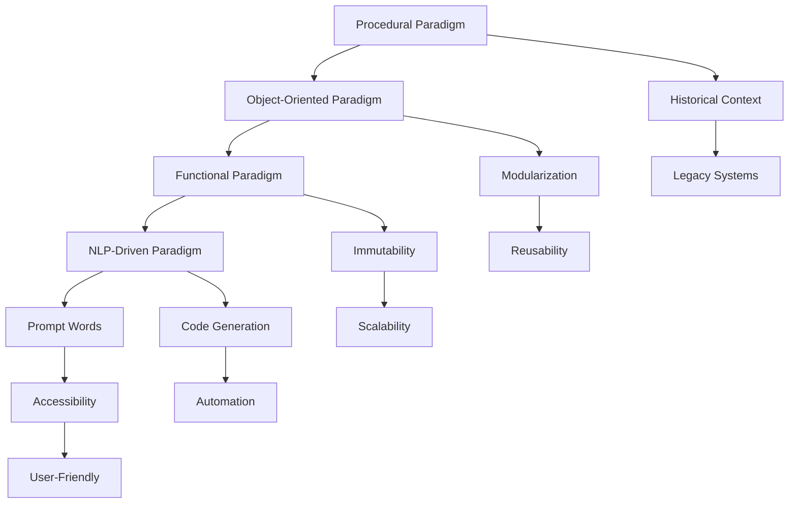

                 

### Title: From Natural Language to Prompt Words: The Revolution of Programming Paradigms

#### Keywords:
- Natural Language Processing (NLP)
- Programming Paradigms
- Prompt Words
- AI-Driven Development
- Code Optimization

#### Abstract:
The intersection of natural language processing (NLP) and programming paradigms is set to redefine software development. This article delves into the transformative journey from natural language to prompt words, exploring how the integration of NLP with programming languages can revolutionize code creation and optimization. We will analyze the historical shift in programming paradigms, introduce the concept of prompt words, and discuss the mathematical models and algorithms underpinning NLP. Through practical examples and case studies, we will illustrate the application of prompt words in modern programming, ultimately showcasing their potential to drive a paradigm shift in the software development industry.

---

### Introduction to Programming Paradigm Evolution

#### 1.1 The Emergence of Modern Programming Paradigms

The landscape of programming has evolved significantly over the decades, transitioning from procedural paradigms to object-oriented, functional, and now, towards more advanced paradigms driven by artificial intelligence and natural language processing. The advent of modern programming paradigms has been driven by the need for more efficient, scalable, and maintainable code.

**1.1.1 Evolution from Traditional to Modern Paradigms**

Historically, programming was dominated by procedural paradigms, which focus on a linear sequence of instructions. Languages like C, Pascal, and BASIC were instrumental in this era, promoting a top-down approach to problem-solving.

In the 1970s and 1980s, the object-oriented paradigm emerged, offering a more modular and reusable approach to software development. Languages like C++, Java, and Python popularized this paradigm, emphasizing encapsulation, inheritance, and polymorphism.

More recently, functional programming has gained traction, particularly in languages like Haskell, Scala, and JavaScript (through its use of functional programming features). Functional programming promotes immutability and the use of higher-order functions, enabling more concise and efficient code.

**1.1.2 Impact of Natural Language Processing on Programming**

The integration of natural language processing (NLP) into programming paradigms represents a significant leap forward. NLP allows computers to understand and generate human language, opening up new possibilities for code generation, documentation, and communication between developers and machines.

**1.1.3 The Concept and Significance of Prompt Words**

Prompt words are a critical component of this evolution. They serve as a bridge between natural language and code, allowing developers to write programs using natural language commands and have them automatically translated into executable code. This paradigm shift has the potential to democratize programming, making it accessible to a broader audience and significantly improving the efficiency of the development process.

#### 1.2 Core Concepts and Relationships

To better understand the relationship between these paradigms and the role of prompt words, we can represent them using a Mermaid flowchart:

This flowchart illustrates the historical progression of programming paradigms and the integration of NLP and prompt words as a revolutionary new approach to software development.

### Conclusion

The transition from traditional programming paradigms to those driven by natural language processing and prompt words marks a significant shift in the landscape of software development. As we delve deeper into the capabilities of NLP, we can expect further innovations that will continue to redefine how we write, optimize, and maintain code. The integration of these advanced techniques has the potential to make programming more accessible, efficient, and scalable, paving the way for a new era in software development.

---

In the following sections, we will explore the foundational concepts of natural language processing, delve into the mathematical models and algorithms that underpin NLP, and examine practical applications of prompt words in modern programming. Together, these elements will provide a comprehensive understanding of the revolution that NLP-driven programming paradigms are poised to bring to the software development industry.

