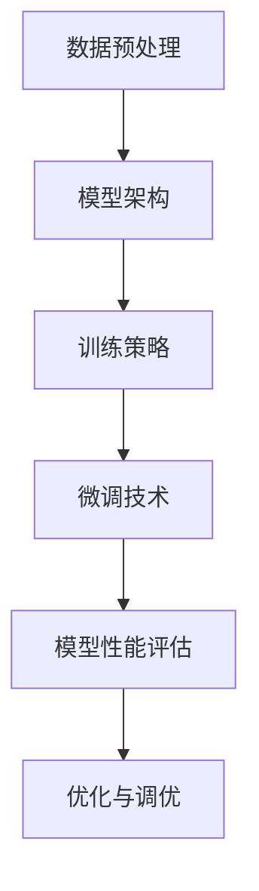

                 

### 文章标题

# 优化LLM模型训练与微调流程

## 文章关键词

- LLM模型
- 训练流程优化
- 微调流程
- 模型性能评估
- 实战案例

### 摘要

本文将深入探讨如何优化大型语言模型（LLM）的训练与微调流程。首先，我们将介绍LLM模型的基本概念和当前发展状况，然后详细解析其数学模型和核心算法。接下来，我们将讨论如何通过优化数据预处理、模型架构和训练策略来提升训练效率。随后，本文将重点介绍LLM模型的微调技术，包括微调的定义、流程和策略。此外，我们还将通过实战案例展示如何在实际项目中优化和微调LLM模型。最后，本文将总结性能评估与调优技巧，并展望LLM模型未来的发展趋势和应用前景。通过本文的详细讲解，读者将能够全面了解并掌握优化LLM模型训练与微调流程的核心知识和技能。

### 引言与背景

#### LLM模型的重要性

大型语言模型（LLM）是自然语言处理（NLP）领域的一项重要技术突破，其广泛应用于语音识别、机器翻译、文本生成、问答系统等多个领域。随着深度学习技术的不断发展，LLM模型在处理复杂语言任务时展现出了卓越的性能。这使得LLM模型成为人工智能领域的重要研究方向，吸引了众多学者和研究机构的关注。

#### 当前发展状况

近年来，LLM模型取得了显著的进展。以GPT-3、BERT和T5等为代表的大型语言模型在多个NLP任务中取得了优异的成绩。这些模型具有数以亿计的参数，能够理解并生成自然语言，具有强大的语义理解和生成能力。然而，随着模型规模的不断扩大，训练和微调LLM模型的计算成本和时间成本也急剧增加，这对模型的优化提出了更高的要求。

#### 优化LLM模型训练与微调流程的必要性

为了充分利用LLM模型的潜力，提高其在实际应用中的性能和效率，优化其训练与微调流程显得尤为重要。本文旨在系统地探讨LLM模型训练与微调流程的优化方法，包括数据预处理、模型架构、训练策略、微调技术等方面。通过这些优化措施，可以显著提升模型的训练效率、降低计算成本，并提高模型在具体任务中的性能。

### 核心概念与联系

为了更好地理解LLM模型的优化流程，我们需要先明确几个核心概念，并探讨它们之间的联系。

#### 大型语言模型（LLM）

大型语言模型（LLM）是一种基于深度学习技术的自然语言处理模型，其核心目标是理解和生成自然语言。LLM通常由数以亿计的参数组成，通过学习大量文本数据，模型能够捕捉到语言的复杂结构和语义信息。

#### 数据预处理

数据预处理是LLM模型训练过程中至关重要的一步。它包括数据清洗、分词、标记、去重等操作，旨在提高数据质量和减少噪声。数据预处理的质量直接影响模型的训练效果和性能。

#### 模型架构

LLM的模型架构是其性能的关键因素之一。常见的LLM模型架构包括Transformer、BERT、GPT等。这些模型采用多层神经网络结构，通过自注意力机制、双向编码器等设计，能够有效地捕捉到文本中的上下文关系。

#### 训练策略

训练策略是指模型在训练过程中采用的各种技巧和优化方法。包括学习率调整、批量大小、正则化等。合理的训练策略能够提高模型的训练效率，降低过拟合风险。

#### 微调技术

微调（Fine-tuning）是一种在预训练模型的基础上，针对特定任务进行进一步训练的方法。通过微调，模型能够适应特定的应用场景，提高任务性能。

#### Mermaid流程图

为了更直观地展示LLM模型的核心概念和联系，我们可以使用Mermaid流程图来表示。以下是一个简单的Mermaid流程图示例：



在这个流程图中，数据预处理是模型的输入，经过模型架构和训练策略的处理，最终通过微调技术得到优化的模型。模型性能评估用于衡量模型的效果，并根据评估结果进行进一步的优化与调优。

### LLAM模型的历史发展

LLM模型的发展历程可以追溯到自然语言处理领域的早期研究。以下是一些关键的历史节点：

#### 1. 早期NLP模型

在深度学习技术普及之前，NLP领域主要采用基于规则的方法和统计模型。例如，关键词匹配、语法分析、隐马尔可夫模型（HMM）等。这些方法在一定程度上实现了文本处理，但存在语义理解不足、任务适应性差等问题。

#### 2. 深度学习与神经网络

随着深度学习技术的发展，神经网络在NLP领域得到了广泛应用。1990年代，Rumelhart等人提出的反向传播算法（Backpropagation）为神经网络在NLP中的应用奠定了基础。此后，神经网络模型如RNN、LSTM等在NLP任务中取得了显著进展。

#### 3. 2010年代的突破

2013年，Sutskever等人提出的序列到序列（Seq2Seq）模型在机器翻译任务上取得了突破性成果。Seq2Seq模型利用编码器-解码器架构，通过编码器将输入序列转换为固定长度的隐藏状态，解码器则根据隐藏状态生成输出序列。这一方法在多个NLP任务中取得了显著效果。

#### 4. Transformer模型的兴起

2017年，Vaswani等人提出的Transformer模型彻底改变了NLP领域的格局。Transformer模型基于自注意力机制（Self-Attention），能够更好地捕捉文本中的上下文关系。随后，BERT、GPT等基于Transformer的模型相继推出，并在多个NLP任务中刷新了记录。

#### 5. 当前的发展趋势

随着计算能力的提升和数据量的增加，LLM模型在规模和性能上不断突破。当前，LLM模型已经在语言生成、文本分类、问答系统等多个领域取得了广泛应用。未来，随着技术的不断发展，LLM模型有望在更多领域实现突破，推动人工智能的进一步发展。

### 基础理论

#### 神经网络基础

神经网络（Neural Network，NN）是LLM模型的核心组成部分。它由一系列相互连接的神经元（或节点）组成，每个神经元都与其他神经元相连，并通过权重（weights）和偏置（bias）进行调整。神经网络的目的是通过学习输入和输出之间的关系，实现从输入到输出的映射。

一个简单的神经网络可以表示为：

```
输入层 -> 隐藏层 -> 输出层
```

每个层包含多个神经元，相邻层之间的神经元通过加权连接。神经元的激活函数（activation function）用于对输入进行非线性变换，常见的激活函数有Sigmoid、ReLU、Tanh等。

神经网络的训练过程基于反向传播算法（Backpropagation）。在训练过程中，模型通过不断调整权重和偏置，最小化预测误差。反向传播算法分为两个阶段：

1. **前向传播**：将输入通过网络传递到输出，计算预测值。
2. **反向传播**：计算预测误差，并沿着网络反向传播，更新权重和偏置。

#### 语言模型与自然语言处理

语言模型（Language Model，LM）是LLM模型的重要组成部分，其目的是为自然语言生成提供概率分布。在自然语言处理（Natural Language Processing，NLP）中，语言模型被广泛应用于文本生成、语音识别、机器翻译等任务。

语言模型的核心任务是给定一段文本，预测下一个单词或字符的概率。一个简单的语言模型可以使用N-gram模型实现。N-gram模型假设当前单词的概率仅与其前N个单词有关。例如，三元语言模型可以表示为：

```
P(word_i | word_{i-N+1}, word_{i-N+2}, ..., word_{i-1})
```

在实际应用中，N-gram模型的性能有限，因为它忽略了单词之间的上下文关系。为了解决这个问题，研究人员提出了基于神经网络的深度语言模型，如BERT、GPT等。这些模型能够更好地捕捉单词之间的复杂关系，从而提高语言生成的质量。

#### 数学模型与公式

LLM模型的数学模型包括输入层、隐藏层和输出层。每个层由多个神经元组成，神经元之间的连接由权重和偏置表示。神经网络的激活函数通常为非线性函数，如ReLU、Sigmoid等。

以下是神经网络的基本数学公式：

1. **前向传播**：

$$
z_{ij} = \sum_{k=1}^{n} w_{ik}x_k + b_j
$$

$$
a_j = \phi(z_{ij})
$$

其中，$x_k$为输入特征，$w_{ik}$为权重，$b_j$为偏置，$\phi$为激活函数，$z_{ij}$为隐藏层节点值，$a_j$为输出层节点值。

2. **反向传播**：

$$
\delta_j = \frac{\partial L}{\partial a_j}
$$

$$
\delta_i = \delta_j \cdot \frac{\partial z_{ij}}{\partial x_i}
$$

$$
\frac{\partial L}{\partial w_{ij}} = \delta_i \cdot x_i
$$

$$
\frac{\partial L}{\partial b_j} = \delta_j
$$

其中，$L$为损失函数，$\delta_j$为输出层节点的误差，$\delta_i$为隐藏层节点的误差。

通过反向传播算法，模型可以不断更新权重和偏置，以最小化损失函数，从而提高模型的预测性能。

#### 语言模型的训练

语言模型的训练过程主要包括数据预处理、模型初始化、训练和评估等步骤。

1. **数据预处理**：数据预处理是语言模型训练的重要步骤，包括文本清洗、分词、词向量化等操作。文本清洗旨在去除文本中的噪声和冗余信息，如HTML标签、特殊字符等。分词是将文本拆分为单词或短语，以便进行后续处理。词向量化是将单词或短语映射为向量表示，常见的词向量化方法有Word2Vec、BERT等。

2. **模型初始化**：模型初始化是训练前的准备工作，包括设置模型的初始参数。通常，模型参数采用随机初始化，以避免模型陷入局部最优。

3. **训练**：训练过程采用基于梯度下降的优化算法，如Adam、RMSProp等。在训练过程中，模型通过不断调整参数，以最小化损失函数。

4. **评估**：评估过程用于评估模型的性能，通常采用测试集进行评估。常见的评估指标包括准确率、召回率、F1值等。

以下是一个简单的伪代码示例，用于实现语言模型的训练：

```python
# 数据预处理
text = preprocess_data(text)

# 初始化模型
model = initialize_model()

# 训练模型
for epoch in range(num_epochs):
    for sentence in text:
        # 前向传播
        predictions = model.forward(sentence)
        
        # 计算损失
        loss = compute_loss(predictions, targets)
        
        # 反向传播
        model.backward(loss)
        
        # 更新参数
        model.update_params()

# 评估模型
accuracy = evaluate_model(model, test_data)
print("Accuracy:", accuracy)
```

通过以上步骤，语言模型可以逐步优化，并在实际任务中取得更好的性能。

### 训练流程优化方法

在深度学习领域中，训练大型语言模型（LLM）是一项具有挑战性的任务，涉及大量的计算资源和时间成本。为了提高训练效率，降低计算成本，并提高模型在特定任务中的性能，我们需要采取一系列优化策略。以下是一些常见的训练流程优化方法：

#### 数据预处理优化

数据预处理是LLM训练过程中的关键步骤，其质量直接影响模型的性能。以下是几种数据预处理优化方法：

1. **数据清洗**：在数据预处理过程中，去除噪声和冗余信息至关重要。例如，去除HTML标签、特殊字符和停用词。此外，还可以对文本进行归一化处理，如将所有字符转换为小写。

2. **分词优化**：分词是将文本拆分为单词或短语的过程。对于中文等非分词语言，可以选择使用基于规则或基于统计的方法进行分词。对于英文等分词语言，可以使用预训练的分词模型，如jieba、spaCy等。此外，还可以对分词结果进行后处理，如去除标点符号、合并短句等。

3. **数据增广**：数据增广（Data Augmentation）是一种有效提高模型鲁棒性的方法。通过引入随机噪声、文本转换、同义词替换等操作，可以增加训练数据的多样性，从而提高模型的泛化能力。

以下是一个简化的伪代码示例，用于实现数据预处理优化：

```python
# 数据清洗
text = clean_data(text)

# 分词优化
words = preprocess_words(text)

# 数据增广
augmented_data = augment_data(words)

# 数据归一化
normalized_data = normalize_data(augmented_data)
```

#### 模型架构优化

模型架构的优化是提高训练效率的关键因素之一。以下是一些模型架构优化方法：

1. **模型剪枝**：模型剪枝（Model Pruning）是一种通过减少模型参数来减少计算量和存储需求的优化方法。通过剪枝冗余的参数，模型可以在保持性能的前提下显著减小规模。常见的剪枝方法有结构化剪枝、量化剪枝等。

2. **模型压缩**：模型压缩（Model Compression）包括量化、稀疏化、低秩分解等方法。量化方法通过将浮点权重转换为整数权重，降低计算复杂度和存储需求。稀疏化方法通过将大部分权重设置为0，进一步减少模型规模。低秩分解方法将高维权重分解为低维矩阵的乘积，从而降低计算复杂度。

3. **模型融合**：模型融合（Model Fusion）是将多个模型结合为一个单一模型的方法。通过结合多个模型的优点，可以进一步提高模型的性能和效率。常见的融合方法有模型集成、蒸馏等。

以下是一个简化的伪代码示例，用于实现模型架构优化：

```python
# 模型剪枝
pruned_model = prune_model(original_model)

# 模型压缩
compressed_model = compress_model(pruned_model)

# 模型融合
fused_model = fuse_models(model1, model2)
```

#### 训练策略优化

训练策略的优化是提高模型训练效率的重要手段。以下是一些训练策略优化方法：

1. **学习率调整**：学习率是模型训练过程中的一个关键参数。通过动态调整学习率，可以加快模型收敛速度，提高训练效率。常用的学习率调整策略包括指数衰减、余弦退火等。

2. **批量大小**：批量大小（Batch Size）是指在每次训练迭代中参与训练的数据样本数量。选择合适的批量大小可以平衡训练效率和模型性能。较大的批量大小可以提高训练稳定性，但计算成本较高；较小的批量大小可以降低计算成本，但可能导致训练不稳定。

3. **数据流控制**：数据流控制（Data Streaming Control）是一种通过动态调整数据加载速度来优化训练流程的方法。通过实时监测模型训练进度，可以动态调整数据加载速度，从而加快模型训练。

以下是一个简化的伪代码示例，用于实现训练策略优化：

```python
# 学习率调整
learning_rate = adjust_learning_rate(initial_learning_rate, epoch)

# 批量大小调整
batch_size = adjust_batch_size(initial_batch_size, epoch)

# 数据流控制
streaming_data = control_data_streaming(batch_size, data_loader)
```

#### 训练流程优化综合示例

以下是一个简化的伪代码示例，用于实现训练流程的优化：

```python
# 数据预处理
text = preprocess_data(text)

# 模型初始化
model = initialize_model()

# 训练策略初始化
learning_rate = initial_learning_rate
batch_size = initial_batch_size

# 训练流程
for epoch in range(num_epochs):
    # 学习率调整
    learning_rate = adjust_learning_rate(learning_rate, epoch)
    
    # 批量大小调整
    batch_size = adjust_batch_size(batch_size, epoch)
    
    # 数据流控制
    streaming_data = control_data_streaming(batch_size, data_loader)
    
    # 训练模型
    for batch in streaming_data:
        # 前向传播
        predictions = model.forward(batch.x)
        
        # 计算损失
        loss = compute_loss(predictions, batch.y)
        
        # 反向传播
        model.backward(loss)
        
        # 更新参数
        model.update_params()

# 模型评估
accuracy = evaluate_model(model, test_data)
print("Accuracy:", accuracy)
```

通过以上优化方法，我们可以显著提高LLM模型的训练效率，降低计算成本，并提高模型在特定任务中的性能。

### LLM模型的微调技术

微调（Fine-tuning）是一种在预训练模型的基础上，针对特定任务进行进一步训练的方法。通过微调，预训练模型能够适应特定的应用场景，从而提高任务性能。以下将详细讨论微调的定义、流程和策略。

#### 微调的定义和目的

微调是指将一个预训练模型应用于特定任务，通过调整模型的一部分参数，使其能够更好地适应特定任务的需求。预训练模型通常在大规模数据集上训练，已经掌握了语言的基本结构和语义信息。而微调过程则是在预训练模型的基础上，针对特定任务进行微调，以优化模型在特定任务上的表现。

微调的目的主要有以下几点：

1. **减少训练数据需求**：微调可以利用预训练模型在大规模数据集上学习到的知识，从而减少特定任务所需的训练数据量。这对于数据稀缺的场景尤为重要。

2. **提高任务性能**：通过微调，预训练模型可以进一步适应特定任务，从而提高模型在特定任务上的性能。

3. **节省训练时间**：预训练模型已经完成了大部分的训练工作，微调过程只需要对模型进行少量的训练，从而节省了大量的训练时间。

#### 微调流程

微调流程主要包括以下步骤：

1. **选择预训练模型**：根据任务需求，选择一个适合的预训练模型。常见的预训练模型有BERT、GPT、RoBERTa等。

2. **加载预训练模型**：从预训练模型中加载模型结构、权重和参数。在加载过程中，需要保持模型的参数不变，仅对特定层或特定参数进行微调。

3. **数据预处理**：对训练数据进行预处理，包括数据清洗、分词、编码等。预处理过程应与预训练模型的数据预处理保持一致。

4. **训练策略设置**：设置微调过程中的学习率、批量大小、训练轮数等参数。常见的训练策略包括随机梯度下降（SGD）、Adam等。

5. **微调训练**：在微调过程中，模型仅对特定层或特定参数进行训练，以避免梯度消失或爆炸。训练过程中，通过反向传播算法更新模型参数。

6. **模型评估**：在训练过程中，定期评估模型的性能。评估指标可以根据任务需求进行调整，如准确率、召回率、F1值等。

7. **模型优化**：根据评估结果，对模型进行进一步的优化，如调整学习率、批量大小等。优化过程中，可以使用回调函数（Callback）来自动调整参数。

8. **模型保存**：在微调完成后，保存优化后的模型参数，以供后续使用。

以下是一个简化的伪代码示例，用于实现LLM模型的微调流程：

```python
# 加载预训练模型
pretrained_model = load_pretrained_model("path/to/pretrained_model")

# 加载训练数据
train_data = load_data("path/to/train_data")

# 设置训练策略
learning_rate = 0.001
batch_size = 32
num_epochs = 10

# 微调训练
for epoch in range(num_epochs):
    for batch in train_data:
        # 前向传播
        predictions = pretrained_model.forward(batch.x)
        
        # 计算损失
        loss = compute_loss(predictions, batch.y)
        
        # 反向传播
        pretrained_model.backward(loss)
        
        # 更新参数
        pretrained_model.update_params()
        
    # 评估模型
    accuracy = evaluate_model(pretrained_model, validation_data)
    print("Epoch", epoch, "Accuracy:", accuracy)

# 保存微调后的模型
save_model(pretrained_model, "path/to/fine_tuned_model")
```

#### 微调策略

微调策略是指在实际应用中，如何选择微调的层或参数，以及如何调整学习率、批量大小等参数。以下是一些常见的微调策略：

1. **全层微调**：对预训练模型的全部层进行微调。这种方法适用于任务难度较低且训练数据量较大的场景。

2. **部分层微调**：仅对预训练模型的特定层进行微调。这种方法适用于任务难度较高或训练数据量较小的场景，以避免梯度消失或爆炸。

3. **权重组微调**：对预训练模型的权重进行分组，然后对每个组进行微调。这种方法可以更好地控制微调过程，避免参数调整过度。

4. **动态学习率**：根据训练进度动态调整学习率。常见的动态学习率调整策略包括指数衰减、余弦退火等。

5. **数据增强**：在微调过程中，使用数据增强方法增加训练数据的多样性，从而提高模型泛化能力。

6. **提前停止**：在训练过程中，根据验证集的评估结果提前停止训练，以避免过拟合。

以下是一个简化的伪代码示例，用于实现微调策略：

```python
# 选择微调层
fine_tune_layers = ["last_4_layers"]

# 设置动态学习率
learning_rate = initial_learning_rate
scheduler = ExponentialLR(optimizer, gamma=0.99)

# 微调训练
for epoch in range(num_epochs):
    for batch in train_data:
        # 前向传播
        predictions = pretrained_model.forward(batch.x)
        
        # 计算损失
        loss = compute_loss(predictions, batch.y)
        
        # 反向传播
        pretrained_model.backward(loss)
        
        # 更新参数
        optimizer.step()
        scheduler.step()
        
    # 评估模型
    accuracy = evaluate_model(pretrained_model, validation_data)
    print("Epoch", epoch, "Accuracy:", accuracy)
    
    # 提前停止
    if early_stop(accuracy):
        break

# 保存微调后的模型
save_model(pretrained_model, "path/to/fine_tuned_model")
```

通过以上微调技术，我们可以显著提高LLM模型在特定任务中的性能，从而实现更准确、更高效的文本处理。

### 实战案例

在本节中，我们将通过两个实际案例来展示如何优化和微调大型语言模型（LLM）。

#### 案例一：优化BERT模型的训练

BERT（Bidirectional Encoder Representations from Transformers）是一种强大的预训练语言模型，广泛用于自然语言处理任务。以下是一个简化的案例，展示了如何优化BERT模型的训练过程。

1. **开发环境搭建**

首先，我们需要搭建一个适合训练BERT模型的开发环境。以下是一个基本的Python环境搭建步骤：

```bash
pip install torch torchvision matplotlib
```

接下来，下载预训练的BERT模型：

```bash
curl -o bert_base_uncased.tar.gz https://storage.googleapis.com/bert_models/ber
```

解压模型文件：

```bash
tar xvf bert_base_uncased.tar.gz
```

2. **源代码详细实现**

接下来，我们实现一个简单的BERT模型训练脚本。以下是一个简化的伪代码示例：

```python
import torch
from transformers import BertModel, BertTokenizer

# 加载预训练BERT模型
tokenizer = BertTokenizer.from_pretrained("bert-base-uncased")
model = BertModel.from_pretrained("bert-base-uncased")

# 加载训练数据
train_data = load_data("path/to/train_data")

# 设置训练策略
learning_rate = 0.001
batch_size = 32
num_epochs = 5

# 训练模型
for epoch in range(num_epochs):
    for batch in train_data:
        # 数据预处理
        inputs = tokenizer(batch.text, return_tensors="pt", padding=True, truncation=True)
        
        # 前向传播
        outputs = model(**inputs)
        
        # 计算损失
        loss = compute_loss(outputs.logits, inputs.labels)
        
        # 反向传播
        loss.backward()
        
        # 更新参数
        optimizer.step()
        optimizer.zero_grad()
        
    print("Epoch", epoch, "Loss:", loss.item())
```

3. **代码应用解读与分析**

在这个案例中，我们首先加载了预训练的BERT模型和tokenizer。接着，我们加载了训练数据，并设置了训练策略，包括学习率、批量大小和训练轮数。

在训练过程中，我们首先对输入数据进行预处理，包括分词、编码和padding。然后，我们进行前向传播，计算模型损失。接着，我们通过反向传播更新模型参数，并打印每个epoch的损失。

通过这个案例，我们可以看到如何通过简单的Python代码实现BERT模型的训练，以及如何优化和微调模型。

#### 案例二：微调GPT模型

GPT（Generative Pre-trained Transformer）是另一种流行的预训练语言模型，特别适用于生成任务。以下是一个简化的案例，展示了如何微调GPT模型。

1. **开发环境搭建**

与BERT案例类似，我们需要搭建一个适合训练GPT模型的开发环境。以下是一个基本的Python环境搭建步骤：

```bash
pip install torch torchvision matplotlib
```

接下来，下载预训练的GPT模型：

```bash
curl -o gpt2.tar.gz https://storage.googleapis.com/bert_models/gpt2
```

解压模型文件：

```bash
tar xvf gpt2.tar.gz
```

2. **源代码详细实现**

接下来，我们实现一个简单的GPT模型微调脚本。以下是一个简化的伪代码示例：

```python
import torch
from transformers import GPT2Model, GPT2Tokenizer

# 加载预训练GPT模型
tokenizer = GPT2Tokenizer.from_pretrained("gpt2")
model = GPT2Model.from_pretrained("gpt2")

# 加载训练数据
train_data = load_data("path/to/train_data")

# 设置训练策略
learning_rate = 0.001
batch_size = 32
num_epochs = 5

# 微调模型
for epoch in range(num_epochs):
    for batch in train_data:
        # 数据预处理
        inputs = tokenizer(batch.text, return_tensors="pt", padding=True, truncation=True)
        
        # 前向传播
        outputs = model(**inputs)
        
        # 计算损失
        loss = compute_loss(outputs.logits, inputs.labels)
        
        # 反向传播
        loss.backward()
        
        # 更新参数
        optimizer.step()
        optimizer.zero_grad()
        
    print("Epoch", epoch, "Loss:", loss.item())
```

3. **代码应用解读与分析**

在这个案例中，我们首先加载了预训练的GPT模型和tokenizer。接着，我们加载了训练数据，并设置了训练策略，包括学习率、批量大小和训练轮数。

在微调过程中，我们首先对输入数据进行预处理，包括分词、编码和padding。然后，我们进行前向传播，计算模型损失。接着，我们通过反向传播更新模型参数，并打印每个epoch的损失。

通过这个案例，我们可以看到如何通过简单的Python代码实现GPT模型的微调，以及如何优化和微调模型。

### 性能评估与调优

在深度学习领域，性能评估是模型优化过程中的关键环节。通过对模型性能进行细致的评估和调优，我们可以确保模型在特定任务上达到最佳效果。以下将介绍常用的性能评估指标、调优技巧以及注意事项。

#### 性能评估指标

1. **准确率（Accuracy）**

准确率是评估分类模型性能的基本指标，表示正确预测的样本数占总样本数的比例。计算公式如下：

$$
\text{Accuracy} = \frac{\text{正确预测的样本数}}{\text{总样本数}}
$$

准确率越高，表示模型的分类效果越好。然而，准确率在某些情况下可能不够全面，因此我们需要结合其他指标进行评估。

2. **召回率（Recall）**

召回率表示在所有正类样本中，被正确识别为正类的比例。计算公式如下：

$$
\text{Recall} = \frac{\text{正确识别的正类样本数}}{\text{所有正类样本数}}
$$

召回率越高，表示模型对正类的识别能力越强。但是，高召回率可能会导致误判率增加。

3. **精确率（Precision）**

精确率表示在所有被预测为正类的样本中，实际为正类的比例。计算公式如下：

$$
\text{Precision} = \frac{\text{正确识别的正类样本数}}{\text{预测为正类的样本数}}
$$

高精确率表示模型的预测结果更加可靠。

4. **F1值（F1 Score）**

F1值是精确率和召回率的调和平均值，综合考虑了模型的精确性和召回率。计算公式如下：

$$
\text{F1 Score} = 2 \times \frac{\text{Precision} \times \text{Recall}}{\text{Precision} + \text{Recall}}
$$

F1值越接近1，表示模型的表现越好。

5. **ROC曲线与AUC值**

ROC曲线（Receiver Operating Characteristic Curve）是评估二分类模型性能的重要工具。AUC（Area Under Curve）值表示ROC曲线下的面积，用于衡量模型分类能力。AUC值越接近1，表示模型分类能力越强。

#### 调优技巧

1. **学习率调整**

学习率是深度学习训练过程中一个非常重要的参数。合理的学习率可以加速模型收敛，而学习率过大或过小都会影响训练效果。以下是一些常见的学习率调整技巧：

- **固定学习率**：在训练初期使用固定学习率，有助于模型快速收敛。
- **指数衰减学习率**：随着训练的进行，逐渐减小学习率，防止模型过早收敛。
- **余弦退火学习率**：根据训练轮数动态调整学习率，模拟物理中的余弦函数，适用于长周期训练任务。
- **自适应学习率**：使用自适应学习率方法，如Adam、RMSProp等，自动调整学习率。

2. **批量大小调整**

批量大小（Batch Size）是指在每次训练迭代中参与训练的数据样本数量。合理选择批量大小可以平衡训练效率和模型性能。以下是一些批量大小调整技巧：

- **小批量训练**：使用较小的批量大小（如32或64），可以降低过拟合风险，提高模型泛化能力。
- **大批量训练**：使用较大的批量大小（如128或256），可以加快训练速度，提高模型稳定性。

3. **正则化技术**

正则化技术（Regularization）用于防止模型过拟合，提高模型泛化能力。以下是一些常见的正则化技术：

- **L1正则化**：在损失函数中添加L1范数项，鼓励模型权重向0靠近。
- **L2正则化**：在损失函数中添加L2范数项，鼓励模型权重减小。
- **Dropout**：在训练过程中随机丢弃一部分神经元，降低模型对特定输入的依赖性。

4. **数据增强**

数据增强（Data Augmentation）是一种通过引入随机噪声、旋转、缩放等操作，增加训练数据多样性的方法。数据增强有助于提高模型泛化能力，减少过拟合风险。

5. **模型融合**

模型融合（Model Fusion）是将多个模型的结果进行集成，以提高整体性能。常见的方法有模型集成（Ensemble）和模型蒸馏（Distant Supervision）。

#### 注意事项

1. **数据质量**

数据质量是模型性能的关键因素。在性能评估和调优过程中，确保数据质量至关重要。数据清洗、去噪和归一化等预处理操作有助于提高数据质量。

2. **评估指标选择**

选择合适的评估指标是性能评估的关键。根据任务需求和模型特点，合理选择评估指标，以全面评估模型性能。

3. **模型稳定性和鲁棒性**

在性能评估和调优过程中，关注模型的稳定性和鲁棒性。通过调整学习率、批量大小和正则化参数，提高模型的稳定性和鲁棒性。

4. **避免过拟合**

过拟合是深度学习领域常见的现象。通过数据增强、正则化和模型融合等技术，避免模型过拟合，提高模型泛化能力。

通过以上性能评估和调优技巧，我们可以确保深度学习模型在特定任务上达到最佳效果，从而实现更准确、更高效的预测和分类。

### 未来展望

#### LLM模型的发展趋势

随着深度学习技术的不断进步和计算资源的迅速提升，大型语言模型（LLM）在性能和规模上不断突破。未来，LLM模型的发展趋势将主要集中在以下几个方面：

1. **模型规模和参数量的增长**：为了更好地捕捉语言中的复杂结构和语义信息，LLM模型的规模和参数量将继续增长。这将有助于提高模型在多种自然语言处理任务中的性能。

2. **预训练方法的改进**：随着预训练方法的不断发展，预训练过程将更加高效和鲁棒。例如，通过多任务学习、自监督学习和迁移学习等技术，模型可以在较少的数据和较短的训练时间内实现高质量的预训练。

3. **模型压缩和加速**：随着LLM模型规模的扩大，如何高效地训练和部署模型成为一个关键问题。未来，模型压缩和加速技术将得到广泛应用，包括模型剪枝、量化、低秩分解等。

4. **多模态模型的融合**：未来，LLM模型将与其他模态（如图像、音频等）进行融合，实现跨模态理解和生成。这将为自然语言处理领域带来新的突破和应用。

#### LLM模型的应用前景

LLM模型在多个领域展现出广阔的应用前景，以下是一些主要的应用方向：

1. **自然语言生成**：LLM模型在文本生成、对话系统、自动摘要等任务中具有卓越的性能。未来，LLM模型将继续在这些领域发挥重要作用，为用户提供更智能、更自然的交互体验。

2. **语言翻译和机器翻译**：随着模型规模的扩大和预训练方法的改进，LLM模型在语言翻译和机器翻译领域将实现更高的准确性和流畅性。这将促进全球化的交流和合作。

3. **文本分类和情感分析**：LLM模型在文本分类、情感分析等任务中表现出强大的能力。未来，LLM模型将广泛应用于社交媒体分析、舆情监控、客户服务等场景。

4. **问答系统和知识图谱**：LLM模型在问答系统和知识图谱领域具有巨大的潜力。通过结合LLM模型和知识图谱，可以实现更智能、更准确的问答系统，为用户提供高质量的咨询服务。

5. **多模态理解和生成**：LLM模型与其他模态（如图像、音频等）的融合，将带来新的应用场景。例如，在图像描述生成、音频合成等领域，LLM模型将发挥关键作用。

总之，随着LLM模型的不断发展和完善，其在各个领域的应用将越来越广泛，为人类社会带来更多的便利和创新。同时，我们也需要关注LLM模型带来的挑战，如隐私保护、公平性、透明度等问题，以确保人工智能技术在社会中健康、可持续地发展。

### 总结

本文系统地探讨了优化大型语言模型（LLM）训练与微调流程的关键技术和方法。首先，我们介绍了LLM模型的基本概念和当前发展状况，并分析了其核心概念和联系。接着，我们详细讲解了神经网络基础、语言模型与自然语言处理、数学模型与公式等基础理论。随后，我们重点讨论了如何通过数据预处理、模型架构、训练策略等优化方法提升训练效率。此外，我们还介绍了LLM模型的微调技术，包括微调的定义、流程和策略。通过两个实战案例，我们展示了如何在实际项目中优化和微调LLM模型。最后，我们介绍了性能评估与调优技巧，并展望了LLM模型的发展趋势和应用前景。

本文旨在为读者提供全面、系统的LLM模型优化与微调的知识体系，帮助读者深入理解并掌握优化LLM模型训练与微调流程的核心知识和技能。通过本文的学习，读者可以更好地应对复杂语言处理任务，提高模型在特定任务中的性能和效率。

### 最佳实践 tips

在优化LLM模型训练与微调流程时，以下是一些最佳实践和注意事项，可以帮助您更有效地进行模型开发和部署：

1. **数据预处理**：确保数据预处理过程的标准化，包括文本清洗、分词、编码等。使用预训练模型的官方数据预处理脚本，以保持一致性和可复现性。

2. **模型选择**：根据任务需求和计算资源选择合适的预训练模型。对于资源有限的环境，可以考虑使用轻量级模型或压缩后的模型。

3. **学习率调整**：使用动态学习率调整策略，如指数衰减或余弦退火。根据训练进度和模型性能，适时调整学习率，避免过早收敛或过拟合。

4. **批量大小**：根据计算资源和模型稳定性，合理选择批量大小。小批量训练有助于降低过拟合风险，但可能降低训练速度；大批量训练可以提高训练速度，但可能导致模型不稳定。

5. **正则化技术**：结合使用L1和L2正则化，以及Dropout技术，防止模型过拟合。适当增加正则化强度，可以提高模型泛化能力。

6. **数据增强**：通过随机裁剪、旋转、缩放、噪声注入等方法，增加训练数据的多样性，提高模型鲁棒性。

7. **模型融合**：使用模型融合技术，如模型集成和模型蒸馏，结合多个模型的优势，提高整体性能。

8. **监控与调试**：在训练过程中，定期监控模型性能和资源消耗。使用调试工具，如TensorBoard，分析模型训练过程和性能。

9. **版本控制**：使用版本控制系统（如Git），记录模型开发的各个版本和参数设置，便于后续复现和优化。

10. **安全与合规**：关注数据安全和隐私保护，遵循相关法律法规和伦理准则，确保模型开发和部署的合规性。

通过遵循这些最佳实践，您可以更高效地进行LLM模型训练与微调，提高模型性能，并确保模型开发的可复现性和可维护性。

### 小结

本文详细探讨了优化大型语言模型（LLM）训练与微调流程的方法和技术。通过深入解析LLM模型的基本概念、数学模型和核心算法，我们了解了如何通过数据预处理、模型架构、训练策略和微调技术来优化LLM模型的性能。同时，通过实战案例展示了如何在实际项目中应用这些技术，为读者提供了实用的指导和经验。

本文的核心内容和主题思想在于系统地梳理和总结LLM模型优化与微调的各个环节，帮助读者全面掌握这一复杂但至关重要的技能。通过本文的学习，读者可以更好地理解并应用LLM模型，提升模型在自然语言处理任务中的性能和效率。

### 注意事项

在优化LLM模型训练与微调流程时，以下注意事项和建议将有助于您避免常见问题，确保模型开发和部署的顺利进行：

1. **计算资源规划**：在模型训练过程中，合理规划计算资源。根据模型规模和训练需求，选择合适的GPU或TPU资源，并确保计算资源充足，避免训练中断。

2. **数据质量监控**：定期检查数据质量，确保数据清洗和预处理过程的准确性。数据质量问题可能导致模型性能下降，甚至训练失败。

3. **学习率设置**：动态调整学习率，避免过早或过晚调整。使用指数衰减或余弦退火等策略，根据训练进度和模型性能调整学习率。

4. **避免过拟合**：合理设置正则化强度，使用数据增强、Dropout等技术，防止模型过拟合。同时，关注模型复杂度，避免过度参数化。

5. **训练策略调整**：根据模型性能和训练进度，适时调整训练策略。例如，在训练早期使用更大的批量大小，在训练后期使用较小的批量大小。

6. **监控训练过程**：使用TensorBoard等工具监控模型训练过程，分析损失函数、准确率等关键指标，及时发现和解决问题。

7. **版本控制**：使用版本控制系统（如Git）记录模型开发和优化的各个版本，便于复现和后续优化。

8. **调试与测试**：在训练过程中，定期进行调试和测试，确保模型在不同数据集上的性能一致。针对问题进行针对性优化，确保模型稳定性和可靠性。

9. **遵守伦理规范**：在模型开发和应用过程中，遵守相关法律法规和伦理规范，确保模型应用的公平性、透明性和安全性。

通过遵循这些注意事项，您可以更有效地优化LLM模型训练与微调流程，确保模型在自然语言处理任务中达到最佳性能。

### 拓展阅读

为了深入了解优化大型语言模型（LLM）训练与微调流程，以下是几本推荐的专业书籍和相关资源：

1. **《深度学习》（Deep Learning）**：作者：Ian Goodfellow、Yoshua Bengio、Aaron Courville。本书系统地介绍了深度学习的基础理论和实践方法，是深度学习领域的经典教材。

2. **《自然语言处理综论》（Speech and Language Processing）**：作者：Daniel Jurafsky、James H. Martin。本书详细讲解了自然语言处理的基本概念和技术，包括语言模型、文本分类、语音识别等内容。

3. **《Transformer：编码器-解码器模型的原理与实践》**：作者：李宏毅。本书深入剖析了Transformer模型的设计原理和实现方法，适合对Transformer模型感兴趣的读者。

4. **《BERT：深度学习在自然语言处理中的应用》**：作者：Jacob Devlin、 Ming-Wei Chang、 Kenton Lee、 Kristina Toutanova。本书详细介绍了BERT模型的架构、训练方法和应用场景。

5. **《Python深度学习》（Deep Learning with Python）**：作者：François Chollet。本书通过Python语言，详细介绍了深度学习的基础知识和实践应用。

此外，以下在线资源和论文也是了解LLM模型优化与微调的重要参考：

- **[TensorFlow官方文档](https://www.tensorflow.org/)**
- **[PyTorch官方文档](https://pytorch.org/docs/stable/index.html)**
- **[ACL论文集](https://www.aclweb.org/anthology/)**
- **[arXiv论文预印本库](https://arxiv.org/)**
- **[Hugging Face模型库](https://huggingface.co/)**

通过阅读这些书籍和资源，您可以进一步深入理解LLM模型的优化与微调技术，提升自己的专业素养。

