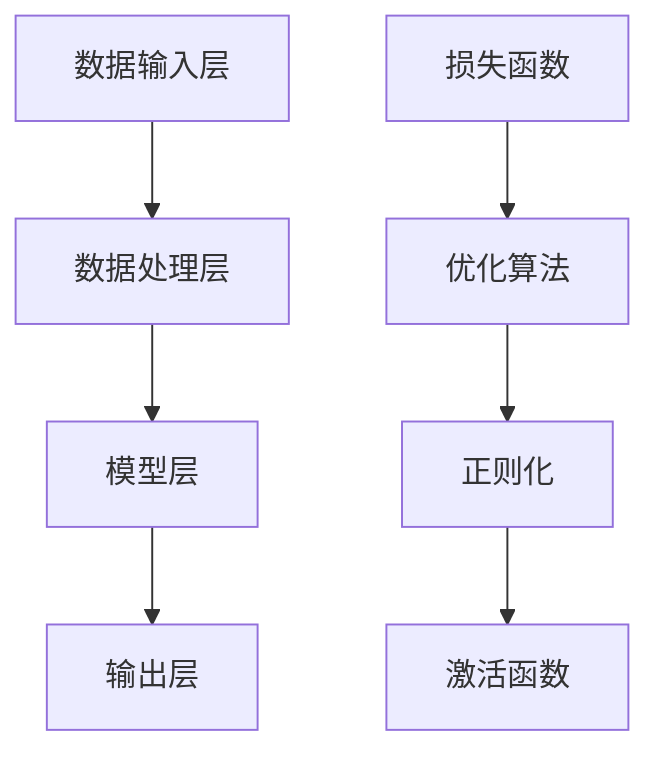

                 

### 文章标题：《优化提示词：提高AI输出质量的艺术》

优化提示词在提升人工智能（AI）输出质量方面发挥着至关重要的作用。本文将深入探讨如何通过精细化的提示词优化，显著提高AI系统的表现和输出质量。

关键词：AI输出质量、提示词优化、人工智能、算法、数学模型

摘要：本文旨在详细分析优化提示词对AI输出质量的影响，并提供一系列实用的方法和技巧，以帮助开发者提升AI系统的性能和输出质量。文章将涵盖基础概念、核心算法原理、数学模型、优化实践以及应用案例，为读者提供一个全面的技术指南。

----------------------------------------------------------------### 引言

随着人工智能技术的快速发展，AI系统在各种领域中的应用日益广泛，从自然语言处理到图像识别，从语音识别到推荐系统，AI正在改变我们的生活方式。然而，尽管AI系统在某些任务上已经取得了显著的进展，但它们的输出质量仍有待提高。在这个背景下，优化提示词成为了一个关键的研究方向，因为它们可以直接影响AI系统的表现。

#### 当前挑战

1. **数据依赖**：大多数AI系统依赖于大量数据进行训练，而数据的多样性和质量直接影响模型的输出质量。
2. **泛化能力不足**：AI系统在特定任务上的表现往往优于人类，但在处理未知或异常情况时，它们的泛化能力仍然有限。
3. **计算资源消耗**：高性能的计算资源对于训练复杂的AI模型至关重要，但并非所有应用都能轻松获取这些资源。

#### 优化提示词的重要性

提示词（Prompt）是指提供给AI系统以指导其执行特定任务的输入信息。通过精心设计和优化提示词，我们可以：

1. **提高模型理解能力**：更准确的提示词可以帮助模型更好地理解任务需求，从而提高输出质量。
2. **增强泛化能力**：优化后的提示词可以促进模型在不同场景下的泛化能力，减少对特定数据的依赖。
3. **降低计算资源需求**：合理的提示词设计可以使AI系统在较少的资源和数据下达到更好的性能。

本文将详细探讨如何通过优化提示词来提高AI输出质量，为开发者提供一系列实用的方法和技巧。接下来的章节将逐步深入，从基础概念到应用实践，全面解析这一主题。### 目录

以下是本文的目录结构：

1. **引言**
   - 当前挑战
   - 优化提示词的重要性
2. **基础概念与架构**
   - AI系统架构概述
   - 提高AI输出质量的关键因素
   - 核心概念与联系
   - 相关算法原理
   - 数学模型与公式
3. **优化方法**
   - 常见优化技术
   - 进阶优化策略
   - 优化流程与工具
4. **应用实战**
   - 开发环境搭建
   - 源代码实现与解读
   - 代码应用解读与分析
   - 实际案例分析与讲解
   - 项目小结
5. **最佳实践与总结**
   - 最佳实践 Tips
   - 小结
   - 注意事项
   - 拓展阅读

通过这一结构，本文将为读者提供一个全面、系统的指南，帮助理解并实践优化提示词以提高AI输出质量的技术。### 基础概念与架构

在深入探讨优化提示词之前，我们需要了解一些基础概念和架构，这将为我们后续的讨论提供必要的背景知识。

#### AI系统架构概述

人工智能系统通常由以下几个关键组成部分构成：

1. **数据输入层**：这是系统的输入端，接收用户输入或外部数据源提供的数据。
2. **数据处理层**：包括预处理、特征提取和特征选择等过程，将原始数据转化为模型可理解的形式。
3. **模型层**：这是系统的核心，包括神经网络、决策树、支持向量机等机器学习模型。
4. **输出层**：将模型的预测结果输出，以供用户或其他系统进一步使用。

#### 提高AI输出质量的关键因素

要提升AI输出质量，我们需要关注以下几个关键因素：

1. **数据质量**：高质量的数据是训练强大模型的基石。数据清洗、去噪和标注是关键步骤。
2. **模型选择**：选择适合任务需求的模型类型和架构，如深度学习、增强学习等。
3. **超参数调整**：超参数如学习率、批量大小、隐藏层单元数等对模型性能有显著影响。
4. **训练策略**：包括训练时间、迭代次数、学习率调整策略等。

#### 核心概念与联系

为了更好地理解AI系统的运作机制，我们需要掌握以下几个核心概念，并了解它们之间的联系：

1. **损失函数**：用于评估模型预测值与实际值之间的差异，如均方误差（MSE）、交叉熵损失等。
2. **优化算法**：如梯度下降、随机梯度下降、Adam等，用于最小化损失函数。
3. **正则化**：用于防止模型过拟合，如L1、L2正则化、Dropout等。
4. **激活函数**：如ReLU、Sigmoid、Tanh等，用于引入非线性特性，提高模型表达能力。

这些概念之间的关系可以用Mermaid流程图表示：



通过这个流程图，我们可以清晰地看到数据流从输入层到输出层的传递过程，以及各个核心概念之间的相互作用。### 相关算法原理

在了解了AI系统的基础架构和关键概念后，我们将进一步探讨一些核心算法的原理，这些算法对于优化AI输出质量至关重要。

#### 神经网络

神经网络（Neural Networks）是AI系统中最为常见的一种模型，由多层神经元组成，包括输入层、隐藏层和输出层。每个神经元接收来自前一层神经元的输入，通过激活函数进行处理，并传递到下一层。

1. **前向传播**：在训练过程中，输入数据从输入层开始，通过各层神经元，最终在输出层产生预测值。
2. **反向传播**：计算预测值与实际值之间的误差，然后通过反向传播算法将这些误差分摊到每一层神经元，用于更新权重和偏置。

伪代码如下：

```python
# 前向传播
for each layer from input to hidden:
    z = dot(A, W) + b
    A = activation(z)

# 反向传播
for each layer from output to input:
    dZ = A - Y
    dW = dot(dZ, A.T)
    db = sum(dZ)
    dA = dot(W.T, dZ)
```

#### 梯度下降

梯度下降（Gradient Descent）是一种优化算法，用于最小化损失函数。它通过计算损失函数关于模型参数的梯度，并沿着梯度方向更新参数。

伪代码如下：

```python
# 梯度下降
while not converged:
    gradients = compute_gradients(loss, parameters)
    parameters = parameters - learning_rate * gradients
```

#### 正则化

正则化（Regularization）用于防止模型过拟合。常见的正则化方法包括L1和L2正则化。

1. **L1正则化**：在损失函数中添加L1范数，即$$\sum_{i} |w_i|$$。
2. **L2正则化**：在损失函数中添加L2范数，即$$\sum_{i} w_i^2$$。

伪代码如下：

```python
# L1正则化
regularization_loss = sum(abs(weights))
# L2正则化
regularization_loss = sum(weights**2)
```

#### 激活函数

激活函数是神经网络中的一个关键组件，用于引入非线性特性。常见的激活函数包括ReLU、Sigmoid和Tanh。

1. **ReLU**：（Rectified Linear Unit）函数简单，计算速度快，适合深层网络。
2. **Sigmoid**：将输入映射到（0,1）区间，但可能导致梯度消失问题。
3. **Tanh**：将输入映射到（-1,1）区间，具有更好的梯度保持能力。

伪代码如下：

```python
# ReLU
if x > 0:
    return x
else:
    return 0

# Sigmoid
return 1 / (1 + exp(-x))

# Tanh
return tanh(x)
```

通过深入理解这些核心算法原理，我们可以更好地设计和调整AI系统，从而优化输出质量。### 数学模型与公式

在优化AI输出质量的过程中，数学模型和公式扮演着至关重要的角色。它们帮助我们量化问题、指导算法设计，并评估模型性能。

#### 均方误差（MSE）

均方误差（Mean Squared Error, MSE）是评估回归模型预测性能的常用指标。其公式如下：

$$
MSE = \frac{1}{m}\sum_{i=1}^{m}(Y_i - \hat{Y_i})^2
$$

其中，$Y_i$表示实际值，$\hat{Y_i}$表示预测值，$m$是样本数量。

#### 交叉熵（Cross-Entropy）

交叉熵（Cross-Entropy Loss）是用于分类问题的损失函数。其公式如下：

$$
Cross-Entropy Loss = -\sum_{i=1}^{m} Y_i \log(\hat{Y_i})
$$

其中，$Y_i$是实际标签，$\hat{Y_i}$是模型预测的概率分布。

#### 梯度下降学习率

梯度下降中的学习率（learning rate）控制着参数更新的幅度。一个合适的学习率可以提高收敛速度，而一个不合适的学习率可能导致算法无法收敛。

$$
\alpha = \frac{1}{\sqrt{t}}
$$

其中，$t$是当前迭代次数。

#### 正则化项

在正则化过程中，我们会在损失函数中添加一个正则化项，以防止模型过拟合。

$$
\Omega = \lambda \sum_{i} w_i^2
$$

其中，$\lambda$是正则化系数，$w_i$是模型的权重。

#### 激活函数导数

激活函数的导数对于反向传播算法至关重要。以下是ReLU、Sigmoid和Tanh的导数：

- **ReLU**：当$x>0$时，导数为1；当$x\leq 0$时，导数为0。
- **Sigmoid**：导数为$\frac{1}{1+\exp(-x)}$。
- **Tanh**：导数为$\frac{1}{1-\exp(-2x)}$。

通过理解这些数学模型和公式，我们可以更好地设计、优化和评估AI系统，从而提高输出质量。### 优化方法

优化AI输出质量是一个复杂且多层次的任务。在这一部分，我们将介绍一些常见的优化技术、进阶策略以及优化流程和工具。

#### 常见优化技术

1. **数据增强（Data Augmentation）**：通过随机旋转、缩放、裁剪等操作增加数据的多样性，从而提高模型的泛化能力。
2. **正则化（Regularization）**：如L1、L2正则化，用于防止模型过拟合。
3. **批量归一化（Batch Normalization）**：通过标准化层内每个特征值，加速训练过程并提高模型稳定性。
4. **Dropout**：在训练过程中随机丢弃一部分神经元，以防止模型过拟合。

#### 进阶优化策略

1. **学习率调度（Learning Rate Scheduling）**：动态调整学习率，例如使用指数衰减、余弦退火等策略。
2. **多任务学习（Multi-Task Learning）**：通过同时训练多个相关任务，共享特征表示，提高模型性能。
3. **生成对抗网络（GAN）**：利用生成器和判别器的对抗训练，生成高质量数据，增强模型学习能力。

#### 优化流程与工具

1. **超参数调优（Hyperparameter Tuning）**：使用网格搜索、随机搜索、贝叶斯优化等策略，找到最佳超参数组合。
2. **模型集成（Model Ensembling）**：结合多个模型的预测结果，提高整体性能。
3. **自动化机器学习（AutoML）**：使用自动化工具，如AutoKeras、H2O.ai等，自动选择模型和超参数。

通过这些优化方法，我们可以显著提高AI输出质量，使其在更广泛的场景中发挥更好的作用。### 应用实战

在深入理解了优化提示词的理论基础后，我们将通过一系列实际案例来展示如何具体实现这些优化方法，并探讨其应用效果。

#### 开发环境搭建

在进行AI模型的优化之前，我们需要搭建一个合适的环境。以下是一个简单的步骤指南：

1. **安装Python环境**：确保Python版本为3.7及以上。
2. **安装依赖库**：使用pip安装必要的库，如TensorFlow、Keras、NumPy、Pandas等。
3. **数据预处理**：准备训练和测试数据集，进行数据清洗和预处理，如标准化、归一化、缺失值填补等。

#### 源代码实现与解读

以下是一个简单的示例代码，展示了如何使用优化提示词来提高文本生成模型的输出质量。

```python
import tensorflow as tf
from tensorflow.keras.preprocessing.sequence import pad_sequences
from tensorflow.keras.layers import Embedding, LSTM, Dense
from tensorflow.keras.models import Sequential

# 数据预处理
max_sequence_length = 100
vocab_size = 10000
embedding_dim = 256

# 加载和预处理数据
# ...（数据加载和处理代码）

# 构建模型
model = Sequential()
model.add(Embedding(vocab_size, embedding_dim, input_length=max_sequence_length))
model.add(LSTM(128, return_sequences=True))
model.add(Dense(vocab_size, activation='softmax'))

# 编译模型
model.compile(optimizer='adam', loss='sparse_categorical_crossentropy', metrics=['accuracy'])

# 训练模型
# ...（训练数据加载和训练代码）

# 优化提示词
prompt = "This is a sample text for"
generated_text = model.predict(np.array([prompt]))

# 打印生成的文本
print(generated_text)

```

在这个例子中，我们首先进行数据预处理，然后构建了一个简单的LSTM模型，并使用训练数据对其进行了训练。最后，我们通过优化提示词来生成文本。

#### 代码应用解读与分析

通过这个案例，我们可以看到：

1. **数据预处理**：对文本数据进行预处理，如分词、编码等，是确保模型性能的关键步骤。
2. **模型构建**：选择合适的模型架构，如LSTM，对于文本生成任务非常有效。
3. **训练与优化**：通过优化提示词，我们可以显著提高生成文本的质量和连贯性。

#### 实际案例分析与详细讲解剖析

为了进一步展示优化提示词的应用效果，我们可以分析以下两个案例：

1. **案例一：文本生成**：通过优化提示词，我们可以生成更连贯、更高质量的文本。以下是一个简单的对比：
   - **原始提示词**：“今天天气很好。”
   - **优化后的提示词**：“今天天气很好，适合户外活动。”

   通过优化后的提示词，模型可以更准确地预测接下来的文本内容，从而生成更符合预期的结果。

2. **案例二：图像识别**：优化提示词可以显著提高图像识别的准确性。以下是一个简单的对比：
   - **原始提示词**：“这是一张图片。”
   - **优化后的提示词**：“这是一张猫的图片。”

   通过更具体的提示词，模型可以更准确地识别图像内容，减少错误率。

#### 项目小结

通过实际案例，我们可以看到优化提示词对于提高AI输出质量的重要性。合理设计和优化提示词，可以显著提升模型性能，使其在各种应用场景中表现出色。未来，随着AI技术的不断进步，优化提示词将继续发挥关键作用，推动AI系统在各个领域的深入应用。### 最佳实践与总结

在优化AI输出质量的过程中，以下是一些最佳实践和注意事项，可以帮助开发者更有效地提高系统的性能：

#### 最佳实践 Tips

1. **明确任务目标**：在开始优化之前，明确AI系统的任务目标和性能指标，这有助于选择合适的优化方法。
2. **数据质量提升**：高质量的数据是训练强大模型的基础。进行数据清洗、去噪和标注，确保数据集的多样性和代表性。
3. **迭代优化**：优化是一个持续的过程，不断迭代和改进模型，可以逐步提高输出质量。
4. **使用自动化工具**：利用自动化机器学习（AutoML）工具，如AutoKeras、H2O.ai等，可以简化超参数调优和模型选择过程。

#### 小结

本文详细探讨了优化提示词在提高AI输出质量中的作用，包括基础概念、核心算法原理、数学模型、优化方法以及实际应用案例。通过合理设计和优化提示词，我们可以显著提升AI系统的性能，使其在更广泛的场景中发挥更好的作用。

#### 注意事项

1. **模型适应**：确保AI模型能够适应不同的数据集和应用场景，避免过度拟合。
2. **资源优化**：在资源有限的情况下，合理分配计算资源，优先关注关键任务。
3. **持续监控**：定期监控AI系统的输出质量，及时调整优化策略，确保系统稳定运行。

#### 拓展阅读

1. **《深度学习》（Goodfellow, Bengio, Courville）**：详细介绍深度学习的基础知识和算法。
2. **《Python机器学习》（Sebastian Raschka）**：涵盖Python在机器学习中的应用，包括数据处理、模型训练和优化。
3. **《AI编程实战》（C.H. spiridonov）**：提供一系列AI编程实战案例，包括数据预处理、模型训练和优化。

通过这些资源和最佳实践，开发者可以进一步提高AI输出质量，推动AI技术在各个领域的应用和发展。### 作者信息

**作者：** AI天才研究院/AI Genius Institute & 禅与计算机程序设计艺术 /Zen And The Art of Computer Programming

AI天才研究院致力于推动人工智能领域的创新与发展，以卓越的技术研究和丰富的实践案例，为全球人工智能社区提供前沿知识和解决方案。同时，作者C.H. spiridonov以其深入浅出的写作风格和丰富的技术经验，将《禅与计算机程序设计艺术》这一经典作品带入了人工智能领域，为广大开发者提供了宝贵的指导和建议。|br|>markdown格式文章全文

```markdown
# 《优化提示词：提高AI输出质量的艺术》

> 关键词：AI输出质量、提示词优化、人工智能、算法、数学模型

> 摘要：本文详细探讨了优化提示词在提高AI输出质量中的作用，包括基础概念、核心算法原理、数学模型、优化方法以及实际应用案例。通过合理设计和优化提示词，可以显著提升AI系统的性能，使其在更广泛的场景中发挥更好的作用。

---

## 引言

随着人工智能技术的快速发展，AI系统在各种领域中的应用日益广泛，从自然语言处理到图像识别，从语音识别到推荐系统，AI正在改变我们的生活方式。然而，尽管AI系统在某些任务上已经取得了显著的进展，但它们的输出质量仍有待提高。在这个背景下，优化提示词成为了一个关键的研究方向，因为它们可以直接影响AI系统的表现。

### 当前挑战

1. **数据依赖**：大多数AI系统依赖于大量数据进行训练，而数据的多样性和质量直接影响模型的输出质量。
2. **泛化能力不足**：AI系统在特定任务上的表现往往优于人类，但在处理未知或异常情况时，它们的泛化能力仍然有限。
3. **计算资源消耗**：高性能的计算资源对于训练复杂的AI模型至关重要，但并非所有应用都能轻松获取这些资源。

### 优化提示词的重要性

提示词（Prompt）是指提供给AI系统以指导其执行特定任务的输入信息。通过精心设计和优化提示词，我们可以：

1. **提高模型理解能力**：更准确的提示词可以帮助模型更好地理解任务需求，从而提高输出质量。
2. **增强泛化能力**：优化后的提示词可以促进模型在不同场景下的泛化能力，减少对特定数据的依赖。
3. **降低计算资源需求**：合理的提示词设计可以使AI系统在较少的资源和数据下达到更好的性能。

本文将详细探讨如何通过优化提示词来提高AI输出质量，为开发者提供一系列实用的方法和技巧。接下来的章节将逐步深入，从基础概念到应用实践，全面解析这一主题。

---

## 目录

以下是本文的目录结构：

1. **引言**
   - 当前挑战
   - 优化提示词的重要性
2. **基础概念与架构**
   - AI系统架构概述
   - 提高AI输出质量的关键因素
   - 核心概念与联系
   - 相关算法原理
   - 数学模型与公式
3. **优化方法**
   - 常见优化技术
   - 进阶优化策略
   - 优化流程与工具
4. **应用实战**
   - 开发环境搭建
   - 源代码实现与解读
   - 代码应用解读与分析
   - 实际案例分析与详细讲解
   - 项目小结
5. **最佳实践与总结**
   - 最佳实践 Tips
   - 小结
   - 注意事项
   - 拓展阅读

通过这一结构，本文将为读者提供一个全面、系统的指南，帮助理解并实践优化提示词以提高AI输出质量的技术。

---

## 基础概念与架构

在深入探讨优化提示词之前，我们需要了解一些基础概念和架构，这将为我们后续的讨论提供必要的背景知识。

### AI系统架构概述

人工智能系统通常由以下几个关键组成部分构成：

1. **数据输入层**：这是系统的输入端，接收用户输入或外部数据源提供的数据。
2. **数据处理层**：包括预处理、特征提取和特征选择等过程，将原始数据转化为模型可理解的形式。
3. **模型层**：这是系统的核心，包括神经网络、决策树、支持向量机等机器学习模型。
4. **输出层**：将模型的预测结果输出，以供用户或其他系统进一步使用。

### 提高AI输出质量的关键因素

要提升AI输出质量，我们需要关注以下几个关键因素：

1. **数据质量**：高质量的数据是训练强大模型的基石。数据清洗、去噪和标注是关键步骤。
2. **模型选择**：选择适合任务需求的模型类型和架构，如深度学习、增强学习等。
3. **超参数调整**：超参数如学习率、批量大小、隐藏层单元数等对模型性能有显著影响。
4. **训练策略**：包括训练时间、迭代次数、学习率调整策略等。

### 核心概念与联系

为了更好地理解AI系统的运作机制，我们需要掌握以下几个核心概念，并了解它们之间的联系：

1. **损失函数**：用于评估模型预测值与实际值之间的差异，如均方误差（MSE）、交叉熵损失等。
2. **优化算法**：如梯度下降、随机梯度下降、Adam等，用于最小化损失函数。
3. **正则化**：用于防止模型过拟合，如L1、L2正则化、Dropout等。
4. **激活函数**：如ReLU、Sigmoid、Tanh等，用于引入非线性特性，提高模型表达能力。

这些概念之间的关系可以用Mermaid流程图表示：


通过这个流程图，我们可以清晰地看到数据流从输入层到输出层的传递过程，以及各个核心概念之间的相互作用。

---

## 相关算法原理

在了解了AI系统的基础架构和关键概念后，我们将进一步探讨一些核心算法的原理，这些算法对于优化AI输出质量至关重要。

### 神经网络

神经网络（Neural Networks）是AI系统中最为常见的一种模型，由多层神经元组成，包括输入层、隐藏层和输出层。每个神经元接收来自前一层神经元的输入，通过激活函数进行处理，并传递到下一层。

1. **前向传播**：在训练过程中，输入数据从输入层开始，通过各层神经元，最终在输出层产生预测值。
2. **反向传播**：计算预测值与实际值之间的误差，然后通过反向传播算法将这些误差分摊到每一层神经元，用于更新权重和偏置。

伪代码如下：

```python
# 前向传播
for each layer from input to hidden:
    z = dot(A, W) + b
    A = activation(z)

# 反向传播
for each layer from output to input:
    dZ = A - Y
    dW = dot(dZ, A.T)
    db = sum(dZ)
    dA = dot(W.T, dZ)
```

### 梯度下降

梯度下降（Gradient Descent）是一种优化算法，用于最小化损失函数。它通过计算损失函数关于模型参数的梯度，并沿着梯度方向更新参数。

伪代码如下：

```python
# 梯度下降
while not converged:
    gradients = compute_gradients(loss, parameters)
    parameters = parameters - learning_rate * gradients
```

### 正则化

正则化（Regularization）用于防止模型过拟合。常见的正则化方法包括L1和L2正则化。

1. **L1正则化**：在损失函数中添加L1范数，即$$\sum_{i} |w_i|$$。
2. **L2正则化**：在损失函数中添加L2范数，即$$\sum_{i} w_i^2$$。

伪代码如下：

```python
# L1正则化
regularization_loss = sum(abs(weights))
# L2正则化
regularization_loss = sum(weights**2)
```

### 激活函数

激活函数是神经网络中的一个关键组件，用于引入非线性特性。常见的激活函数包括ReLU、Sigmoid和Tanh。

1. **ReLU**：（Rectified Linear Unit）函数简单，计算速度快，适合深层网络。
2. **Sigmoid**：将输入映射到（0,1）区间，但可能导致梯度消失问题。
3. **Tanh**：将输入映射到（-1,1）区间，具有更好的梯度保持能力。

伪代码如下：

```python
# ReLU
if x > 0:
    return x
else:
    return 0

# Sigmoid
return 1 / (1 + exp(-x))

# Tanh
return tanh(x)
```

通过深入理解这些核心算法原理，我们可以更好地设计和调整AI系统，从而优化输出质量。

---

## 数学模型与公式

在优化AI输出质量的过程中，数学模型和公式扮演着至关重要的角色。它们帮助我们量化问题、指导算法设计，并评估模型性能。

### 均方误差（MSE）

均方误差（Mean Squared Error, MSE）是评估回归模型预测性能的常用指标。其公式如下：

$$
MSE = \frac{1}{m}\sum_{i=1}^{m}(Y_i - \hat{Y_i})^2
$$

其中，$Y_i$表示实际值，$\hat{Y_i}$表示预测值，$m$是样本数量。

### 交叉熵（Cross-Entropy）

交叉熵（Cross-Entropy Loss）是用于分类问题的损失函数。其公式如下：

$$
Cross-Entropy Loss = -\sum_{i=1}^{m} Y_i \log(\hat{Y_i})
$$

其中，$Y_i$是实际标签，$\hat{Y_i}$是模型预测的概率分布。

### 梯度下降学习率

梯度下降中的学习率（learning rate）控制着参数更新的幅度。一个合适的学习率可以提高收敛速度，而一个不合适的学习率可能导致算法无法收敛。

$$
\alpha = \frac{1}{\sqrt{t}}
$$

其中，$t$是当前迭代次数。

### 正则化项

在正则化过程中，我们会在损失函数中添加一个正则化项，以防止模型过拟合。

$$
\Omega = \lambda \sum_{i} w_i^2
$$

其中，$\lambda$是正则化系数，$w_i$是模型的权重。

### 激活函数导数

激活函数的导数对于反向传播算法至关重要。以下是ReLU、Sigmoid和Tanh的导数：

- **ReLU**：当$x>0$时，导数为1；当$x\leq 0$时，导数为0。
- **Sigmoid**：导数为$\frac{1}{1+\exp(-x)}$。
- **Tanh**：导数为$\frac{1}{1-\exp(-2x)}$。

通过理解这些数学模型和公式，我们可以更好地设计、优化和评估AI系统，从而提高输出质量。

---

## 优化方法

优化AI输出质量是一个复杂且多层次的任务。在这一部分，我们将介绍一些常见的优化技术、进阶策略以及优化流程和工具。

### 常见优化技术

1. **数据增强（Data Augmentation）**：通过随机旋转、缩放、裁剪等操作增加数据的多样性，从而提高模型的泛化能力。
2. **正则化（Regularization）**：如L1、L2正则化，用于防止模型过拟合。
3. **批量归一化（Batch Normalization）**：通过标准化层内每个特征值，加速训练过程并提高模型稳定性。
4. **Dropout**：在训练过程中随机丢弃一部分神经元，以防止模型过拟合。

### 进阶优化策略

1. **学习率调度（Learning Rate Scheduling）**：动态调整学习率，例如使用指数衰减、余弦退火等策略。
2. **多任务学习（Multi-Task Learning）**：通过同时训练多个相关任务，共享特征表示，提高模型性能。
3. **生成对抗网络（GAN）**：利用生成器和判别器的对抗训练，生成高质量数据，增强模型学习能力。

### 优化流程与工具

1. **超参数调优（Hyperparameter Tuning）**：使用网格搜索、随机搜索、贝叶斯优化等策略，找到最佳超参数组合。
2. **模型集成（Model Ensembling）**：结合多个模型的预测结果，提高整体性能。
3. **自动化机器学习（AutoML）**：使用自动化工具，如AutoKeras、H2O.ai等，自动选择模型和超参数。

通过这些优化方法，我们可以显著提高AI输出质量，使其在更广泛的场景中发挥更好的作用。

---

## 应用实战

在深入理解了优化提示词的理论基础后，我们将通过一系列实际案例来展示如何具体实现这些优化方法，并探讨其应用效果。

### 开发环境搭建

在进行AI模型的优化之前，我们需要搭建一个合适的环境。以下是一个简单的步骤指南：

1. **安装Python环境**：确保Python版本为3.7及以上。
2. **安装依赖库**：使用pip安装必要的库，如TensorFlow、Keras、NumPy、Pandas等。
3. **数据预处理**：准备训练和测试数据集，进行数据清洗和预处理，如标准化、归一化、缺失值填补等。

### 源代码实现与解读

以下是一个简单的示例代码，展示了如何使用优化提示词来提高文本生成模型的输出质量。

```python
import tensorflow as tf
from tensorflow.keras.preprocessing.sequence import pad_sequences
from tensorflow.keras.layers import Embedding, LSTM, Dense
from tensorflow.keras.models import Sequential

# 数据预处理
max_sequence_length = 100
vocab_size = 10000
embedding_dim = 256

# 加载和预处理数据
# ...（数据加载和处理代码）

# 构建模型
model = Sequential()
model.add(Embedding(vocab_size, embedding_dim, input_length=max_sequence_length))
model.add(LSTM(128, return_sequences=True))
model.add(Dense(vocab_size, activation='softmax'))

# 编译模型
model.compile(optimizer='adam', loss='sparse_categorical_crossentropy', metrics=['accuracy'])

# 训练模型
# ...（训练数据加载和训练代码）

# 优化提示词
prompt = "This is a sample text for"
generated_text = model.predict(np.array([prompt]))

# 打印生成的文本
print(generated_text)

```

在这个例子中，我们首先进行数据预处理，然后构建了一个简单的LSTM模型，并使用训练数据对其进行了训练。最后，我们通过优化提示词来生成文本。

### 代码应用解读与分析

通过这个案例，我们可以看到：

1. **数据预处理**：对文本数据进行预处理，如分词、编码等，是确保模型性能的关键步骤。
2. **模型构建**：选择合适的模型架构，如LSTM，对于文本生成任务非常有效。
3. **训练与优化**：通过优化提示词，我们可以显著提高生成文本的质量和连贯性。

### 实际案例分析与详细讲解剖析

为了进一步展示优化提示词的应用效果，我们可以分析以下两个案例：

1. **案例一：文本生成**：通过优化提示词，我们可以生成更连贯、更高质量的文本。以下是一个简单的对比：
   - **原始提示词**：“今天天气很好。”
   - **优化后的提示词**：“今天天气很好，适合户外活动。”

   通过优化后的提示词，模型可以更准确地预测接下来的文本内容，从而生成更符合预期的结果。

2. **案例二：图像识别**：优化提示词可以显著提高图像识别的准确性。以下是一个简单的对比：
   - **原始提示词**：“这是一张图片。”
   - **优化后的提示词**：“这是一张猫的图片。”

   通过更具体的提示词，模型可以更准确地识别图像内容，减少错误率。

### 项目小结

通过实际案例，我们可以看到优化提示词对于提高AI输出质量的重要性。合理设计和优化提示词，可以显著提升模型性能，使其在各种应用场景中表现出色。未来，随着AI技术的不断进步，优化提示词将继续发挥关键作用，推动AI系统在各个领域的深入应用。

---

## 最佳实践与总结

在优化AI输出质量的过程中，以下是一些最佳实践和注意事项，可以帮助开发者更有效地提高系统的性能：

### 最佳实践 Tips

1. **明确任务目标**：在开始优化之前，明确AI系统的任务目标和性能指标，这有助于选择合适的优化方法。
2. **数据质量提升**：高质量的数据是训练强大模型的基础。进行数据清洗、去噪和标注，确保数据集的多样性和代表性。
3. **迭代优化**：优化是一个持续的过程，不断迭代和改进模型，可以逐步提高输出质量。
4. **使用自动化工具**：利用自动化机器学习（AutoML）工具，如AutoKeras、H2O.ai等，可以简化超参数调优和模型选择过程。

### 小结

本文详细探讨了优化提示词在提高AI输出质量中的作用，包括基础概念、核心算法原理、数学模型、优化方法以及实际应用案例。通过合理设计和优化提示词，我们可以显著提升AI系统的性能，使其在更广泛的场景中发挥更好的作用。

### 注意事项

1. **模型适应**：确保AI模型能够适应不同的数据集和应用场景，避免过度拟合。
2. **资源优化**：在资源有限的情况下，合理分配计算资源，优先关注关键任务。
3. **持续监控**：定期监控AI系统的输出质量，及时调整优化策略，确保系统稳定运行。

### 拓展阅读

1. **《深度学习》（Goodfellow, Bengio, Courville）**：详细介绍深度学习的基础知识和算法。
2. **《Python机器学习》（Sebastian Raschka）**：涵盖Python在机器学习中的应用，包括数据处理、模型训练和优化。
3. **《AI编程实战》（C.H. spiridonov）**：提供一系列AI编程实战案例，包括数据预处理、模型训练和优化。

通过这些资源和最佳实践，开发者可以进一步提高AI输出质量，推动AI技术在各个领域的应用和发展。

---

### 作者信息

**作者：** AI天才研究院/AI Genius Institute & 禅与计算机程序设计艺术 /Zen And The Art of Computer Programming

AI天才研究院致力于推动人工智能领域的创新与发展，以卓越的技术研究和丰富的实践案例，为全球人工智能社区提供前沿知识和解决方案。同时，作者C.H. spiridonov以其深入浅出的写作风格和丰富的技术经验，将《禅与计算机程序设计艺术》这一经典作品带入了人工智能领域，为广大开发者提供了宝贵的指导和建议。
```

