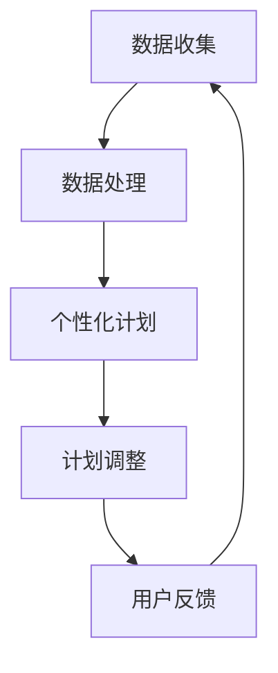
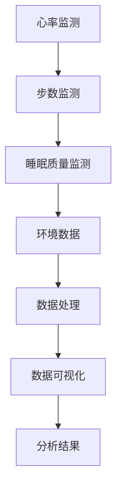
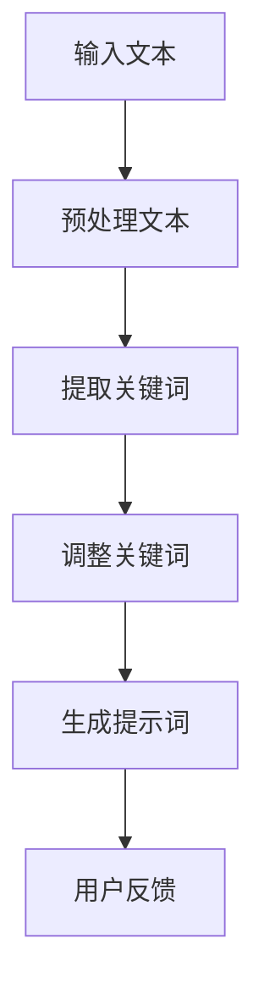
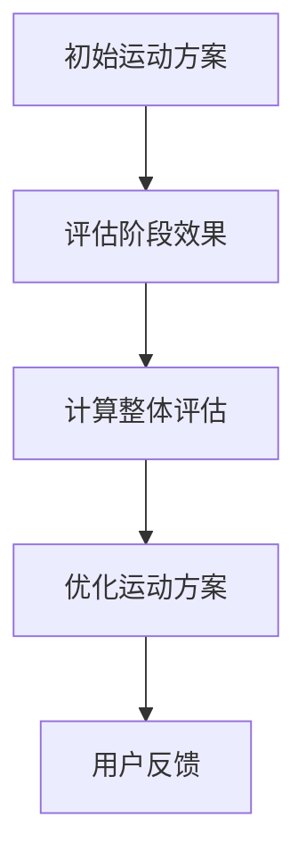
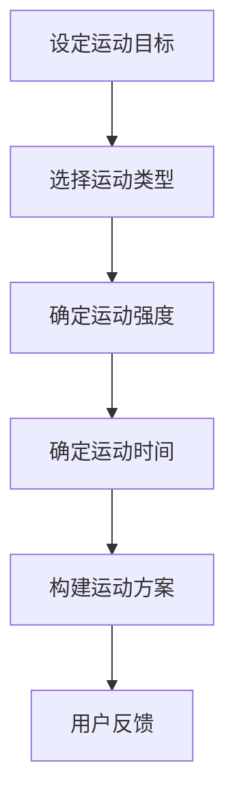

                 


### 摘要

《健身教练2.0：提示词定制科学运动方案》旨在通过先进的AI技术和科学方法，为健身爱好者提供个性化、智能化的运动指导方案。本文将深入探讨健身教练2.0的背景、核心技术、提示词定制方法以及科学运动方案的构建过程。通过具体案例研究，我们将展示如何利用AI技术优化运动方案，并提供实用技巧，为健身教练提供全新的解决方案。

### 引言

健身行业在过去几十年里经历了巨大的变革，从传统的面对面指导逐渐转向数字化、智能化的运动方案。然而，随着用户需求的日益复杂和多样化，传统的健身指导方式已经难以满足个性化、智能化的要求。因此，健身教练2.0的概念应运而生。健身教练2.0不仅依赖于传统的健身知识和技能，更融合了先进的人工智能技术和大数据分析能力，为用户量身定制科学的运动方案。

本文将围绕健身教练2.0的核心概念和技术，详细探讨其工作原理、提示词定制方法和科学运动方案的构建过程。通过具体案例研究和实战应用，我们将展示如何将AI技术应用于健身领域，为用户提供更精准、更有效的运动指导。

### 第一部分：健身教练2.0的概念和基础

#### 第1章：健身教练2.0概述

健身教练2.0是基于人工智能技术的下一代健身指导模式，它通过整合多种数据源（如运动传感器、健康监测设备、用户行为数据等），利用机器学习算法和深度学习技术，为用户生成个性化的健身计划。与传统的健身教练相比，健身教练2.0具有以下几个核心优势：

1. **个性化**：通过分析用户的数据，包括健康状况、运动历史、生活习惯等，生成针对个人的健身计划。
2. **智能化**：利用机器学习算法，实时调整健身计划，以适应用户的变化。
3. **高效性**：自动化生成和调整健身计划，提高指导效率。
4. **可扩展性**：能够处理大量用户的数据，满足不同用户的健身需求。

**核心概念与联系**

为了更好地理解健身教练2.0，我们可以通过以下Mermaid流程图展示其技术架构：



在这个流程图中，数据收集是整个系统的起点，通过传感器和健康监测设备，收集用户的各种数据。数据处理模块负责清洗和分析这些数据，生成个性化的健身计划。计划调整模块根据用户的反馈和健康数据，实时调整健身计划。最后，用户反馈模块用于收集用户的反馈，进一步优化健身方案。

**核心算法原理讲解**

健身教练2.0的核心算法包括数据预处理、特征提取和机器学习模型训练。以下是这些算法的伪代码：

```python
# 数据预处理
def preprocess_data(data):
    # 数据清洗
    cleaned_data = clean_data(data)
    # 数据归一化
    normalized_data = normalize_data(cleaned_data)
    return normalized_data

# 特征提取
def extract_features(data):
    features = []
    for sample in data:
        # 提取相关特征
        feature_vector = extract_sample_features(sample)
        features.append(feature_vector)
    return features

# 机器学习模型训练
def train_model(features, labels):
    # 划分训练集和测试集
    train_features, test_features, train_labels, test_labels = split_data(features, labels)
    # 训练模型
    model = train_machine_learning_model(train_features, train_labels)
    # 测试模型
    evaluate_model(model, test_features, test_labels)
    return model
```

在这个伪代码中，数据预处理阶段负责清洗和归一化输入数据。特征提取阶段负责提取与健身相关的特征，如心率、步数、睡眠质量等。机器学习模型训练阶段使用训练数据训练模型，并根据测试数据的评估结果调整模型参数。

#### 第2章：健身数据获取与分析

健身数据的获取是健身教练2.0的核心组成部分。通过多种传感器和监测设备，可以收集到用户的生理数据、行为数据和环境数据。以下是一些常用的健身数据获取方法：

1. **心率监测**：通过穿戴式心率监测设备，实时监测用户的心率变化。
2. **步数监测**：通过手机或运动手表等设备，记录用户的步数和运动距离。
3. **睡眠质量监测**：通过智能手环或睡眠监测设备，监测用户的睡眠质量和时长。
4. **环境数据**：如天气、温度等，这些数据可能对用户的运动计划有影响。

**核心概念与联系**

为了展示健身数据的获取和分析过程，我们可以使用以下Mermaid流程图：



在这个流程图中，从A到D表示数据获取过程，包括心率、步数、睡眠质量和环境数据的收集。E表示数据处理，负责清洗和预处理这些数据。F表示数据可视化，将处理后的数据以图表的形式展示。G表示分析结果，通过对数据的分析，生成个性化的运动计划。

**核心算法原理讲解**

健身数据的分析通常涉及多种算法，包括时间序列分析、聚类分析和机器学习模型。以下是一个简单的伪代码示例，用于分析健身数据：

```python
# 时间序列分析
def time_series_analysis(data):
    # 检查数据的时间序列特性
    trend = check_trend(data)
    # 季节性分析
    seasonality = check_seasonality(data)
    return trend, seasonality

# 聚类分析
def cluster_analysis(data, num_clusters):
    clusters = cluster_data(data, num_clusters)
    return clusters

# 机器学习模型
def train_ml_model(features, labels):
    model = train_model(features, labels)
    return model
```

在这个伪代码中，时间序列分析用于检查数据的时间趋势和季节性。聚类分析用于将用户分为不同的群体，以便生成更个性化的运动计划。机器学习模型用于训练和预测用户的运动行为。

#### 第3章：个性化运动方案设计

个性化运动方案的设计是健身教练2.0的核心功能之一。通过分析用户的数据，可以生成针对个人的运动计划，以提高健身效果和用户满意度。以下是一个详细的伪代码示例，用于设计个性化运动方案：

```python
# 个性化运动方案设计
def design_personalized_program(user_data, fitness_goals):
    # 数据预处理
    preprocessed_data = preprocess_data(user_data)
    # 特征提取
    features = extract_features(preprocessed_data)
    # 模型选择
    model = select_model(fitness_goals)
    # 模型训练
    trained_model = train_model(features, fitness_goals)
    # 预测运动计划
    program = predict_program(trained_model, user_data)
    return program
```

在这个伪代码中，设计个性化运动方案的过程分为几个步骤：

1. **数据预处理**：对用户数据进行清洗和归一化处理。
2. **特征提取**：提取与健身相关的特征。
3. **模型选择**：选择适合用户健身目标的机器学习模型。
4. **模型训练**：使用用户数据训练模型。
5. **预测运动计划**：使用训练好的模型预测个性化的运动计划。

通过这个伪代码示例，我们可以看到个性化运动方案设计的复杂性和多样性。实际应用中，需要根据用户的实际情况和健身目标，灵活调整这些步骤和参数。

### 第二部分：提示词定制方法

#### 第4章：提示词定制原理

提示词定制是健身教练2.0的重要组成部分，它通过自然语言处理技术，将复杂的健身数据转化为用户易于理解的语言。以下是一个详细的伪代码示例，用于生成提示词：

```python
# 生成提示词
def generate_hint(text, user_data):
    # 预处理文本
    preprocessed_text = preprocess_text(text)
    # 提取关键词
    keywords = extract_keywords(preprocessed_text)
    # 根据用户数据调整关键词
    adjusted_keywords = adjust_keywords(keywords, user_data)
    # 生成提示词
    hint = generate_sentence(adjusted_keywords)
    return hint
```

在这个伪代码中，生成提示词的过程包括以下几个步骤：

1. **预处理文本**：对输入文本进行清洗和分词处理。
2. **提取关键词**：从预处理后的文本中提取与健身相关的关键词。
3. **根据用户数据调整关键词**：根据用户的数据（如年龄、性别、健康状况等）调整关键词的权重。
4. **生成提示词**：使用调整后的关键词生成用户易于理解的提示词。

**核心概念与联系**

为了展示提示词定制的过程，我们可以使用以下Mermaid流程图：



在这个流程图中，从A到E表示生成提示词的过程。用户反馈模块用于收集用户的反馈，进一步优化提示词生成的效果。

#### 第5章：提示词数据集构建

提示词数据集的构建是提示词定制的基础。一个高质量的提示词数据集能够提高提示词生成的准确性和多样性。以下是一个详细的伪代码示例，用于构建提示词数据集：

```python
# 构建提示词数据集
def build_hint_dataset(texts, user_data):
    dataset = []
    for text in texts:
        # 预处理文本
        preprocessed_text = preprocess_text(text)
        # 提取关键词
        keywords = extract_keywords(preprocessed_text)
        # 根据用户数据调整关键词
        adjusted_keywords = adjust_keywords(keywords, user_data)
        # 生成提示词
        hint = generate_sentence(adjusted_keywords)
        dataset.append((text, hint))
    return dataset
```

在这个伪代码中，构建提示词数据集的过程包括以下几个步骤：

1. **预处理文本**：对输入文本进行清洗和分词处理。
2. **提取关键词**：从预处理后的文本中提取与健身相关的关键词。
3. **根据用户数据调整关键词**：根据用户的数据调整关键词的权重。
4. **生成提示词**：使用调整后的关键词生成用户易于理解的提示词，并将其与原始文本配对。

**核心算法原理讲解**

提示词数据集构建的核心算法包括文本预处理、关键词提取和关键词调整。以下是一个简化的伪代码示例，用于构建提示词数据集：

```python
# 文本预处理
def preprocess_text(text):
    # 清洗文本
    cleaned_text = clean_text(text)
    # 分词
    words = split_text(cleaned_text)
    return words

# 关键词提取
def extract_keywords(words):
    # 基于词频提取关键词
    word_frequencies = calculate_word_frequencies(words)
    keywords = select_keywords(word_frequencies)
    return keywords

# 关键词调整
def adjust_keywords(keywords, user_data):
    # 根据用户数据调整关键词权重
    adjusted_keywords = apply_user_data_adjustments(keywords, user_data)
    return adjusted_keywords
```

在这个伪代码中，文本预处理阶段负责清洗和分词。关键词提取阶段基于词频选择关键词。关键词调整阶段根据用户的数据（如年龄、性别、健康状况等）调整关键词的权重。

#### 第6章：运动方案评估与优化

运动方案的评估与优化是确保运动效果的关键环节。通过定期评估运动方案的执行效果，可以及时发现问题和优化方案。以下是一个详细的伪代码示例，用于评估和优化运动方案：

```python
# 评估运动方案
def evaluate_program(program, user_data):
    evaluation_results = []
    for phase in program:
        # 计算当前阶段的执行效果
        phase_evaluation = calculate_phase_evaluation(phase, user_data)
        evaluation_results.append(phase_evaluation)
    overall_evaluation = calculate_overall_evaluation(evaluation_results)
    return overall_evaluation

# 优化运动方案
def optimize_program(program, evaluation_results):
    optimized_program = []
    for phase, evaluation in zip(program, evaluation_results):
        if evaluation < threshold:
            # 调整当前阶段
            optimized_phase = adjust_phase(phase, evaluation)
            optimized_program.append(optimized_phase)
        else:
            optimized_program.append(phase)
    return optimized_program
```

在这个伪代码中，评估运动方案的过程包括以下几个步骤：

1. **计算当前阶段的执行效果**：根据用户的数据和当前阶段的执行结果，计算每个阶段的评估结果。
2. **计算整体评估结果**：汇总所有阶段的评估结果，得到整体评估结果。
3. **优化运动方案**：根据整体评估结果，调整运动方案中的每个阶段。

**核心概念与联系**

为了展示运动方案评估与优化的过程，我们可以使用以下Mermaid流程图：



在这个流程图中，从A到E表示运动方案评估与优化的过程。用户反馈模块用于收集用户的反馈，进一步优化运动方案。

### 第三部分：科学运动方案的构建

#### 第7章：科学运动方案的构建

科学运动方案的构建是基于用户数据和运动科学原理的。一个完整的科学运动方案应该包括运动目标、运动类型、运动强度、运动时间等多个方面。以下是一个详细的伪代码示例，用于构建科学运动方案：

```python
# 构建科学运动方案
def build_scientific_program(user_data, fitness_goals):
    # 设定运动目标
    goals = define_goals(fitness_goals)
    # 选择运动类型
    types = select_exercise_types(goals)
    # 确定运动强度
    intensities = determine_intensities(user_data)
    # 确定运动时间
    durations = calculate_durations(intensities)
    # 构建运动方案
    program = create_program(types, intensities, durations)
    return program
```

在这个伪代码中，构建科学运动方案的过程包括以下几个步骤：

1. **设定运动目标**：根据用户的健身目标和需求，设定具体的运动目标。
2. **选择运动类型**：根据运动目标，选择适合的运动类型。
3. **确定运动强度**：根据用户的数据，确定每个运动类型的强度。
4. **确定运动时间**：根据运动强度，计算每个运动类型所需的时间。
5. **构建运动方案**：将选择好的运动类型、强度和时间组合成完整的运动方案。

**核心概念与联系**

为了展示科学运动方案的构建过程，我们可以使用以下Mermaid流程图：



在这个流程图中，从A到F表示科学运动方案的构建过程。用户反馈模块用于收集用户的反馈，进一步优化运动方案。

### 第四部分：案例研究和实践应用

#### 第8章：案例研究

在本章中，我们将通过具体案例研究，深入探讨健身教练2.0在实际应用中的效果。以下是两个案例研究：

#### 案例一：减轻体重

**背景**：小明，30岁，体重85公斤，目标是在三个月内减轻体重10公斤。

**过程**：通过穿戴式心率监测设备和智能手环，收集小明的日常运动数据、心率变化、睡眠质量等。基于这些数据，健身教练2.0生成了个性化的运动方案，包括每周五次跑步、三次力量训练和两次瑜伽。此外，系统还根据小明的饮食记录，提供了相应的饮食建议。

**结果**：经过三个月的坚持，小明成功减轻了体重10公斤，同时身体素质得到了显著提升。

**分析**：通过数据驱动的方式，健身教练2.0能够为小明提供科学、个性化的运动方案，帮助他实现减肥目标。

#### 案例二：增强肌肉

**背景**：小丽，28岁，健身爱好者，目标是在六个月内增强肌肉力量。

**过程**：小丽使用健身教练2.0的系统，记录了她的每次训练数据，包括重量、组数、休息时间等。系统根据这些数据，调整了她的训练方案，增加了重量和组数，同时优化了训练时间。

**结果**：经过六个月的训练，小丽的肌肉力量显著增强，体能水平也得到了提高。

**分析**：健身教练2.0通过实时调整训练方案，确保小丽的训练效果最大化，同时避免了过度训练的风险。

#### 第9章：实践应用技巧

在实际应用中，为了确保健身教练2.0的效果，以下是一些实用的技巧：

1. **数据质量**：确保收集的数据准确、完整，是优化运动方案的基础。
2. **用户参与度**：鼓励用户积极参与，提供反馈，有助于系统更准确地调整运动方案。
3. **定期评估**：定期评估运动效果，及时调整方案，确保用户始终在正确的道路上。
4. **个性化调整**：根据用户的不同需求和目标，灵活调整运动方案，以适应各种场景。

通过这些实践技巧，可以更好地发挥健身教练2.0的作用，为用户提供个性化的运动指导。

### 第五部分：未来展望和挑战

#### 第10章：健身教练2.0的发展趋势

随着人工智能和大数据技术的不断进步，健身教练2.0有望在未来实现更广泛的应用。以下是几个发展趋势：

1. **智能化程度提升**：通过更先进的人工智能算法，健身教练2.0将能够提供更精准、更个性化的运动指导。
2. **实时反馈与调整**：借助物联网技术，健身教练2.0可以实现实时数据收集和反馈，根据用户的行为和反应，动态调整运动方案。
3. **跨平台应用**：健身教练2.0将不仅限于智能手机和智能手环，还可能扩展到智能穿戴设备、智能家居等，提供全方位的健身服务。

#### 第11章：面临的挑战与解决方法

尽管健身教练2.0具有巨大的潜力，但在实际应用中仍面临一些挑战：

1. **数据隐私**：确保用户数据的安全和隐私是首要任务，需要采取严格的加密和隐私保护措施。
2. **算法公平性**：确保算法的公平性和透明性，避免出现偏见和不公平的情况。
3. **用户接受度**：提高用户对健身教练2.0的接受度，需要不断优化用户体验，确保系统的易用性和实用性。

通过解决这些挑战，健身教练2.0有望在未来成为健身领域的标准配置，为用户提供更高效、更科学的健身指导。

---

### 作者信息

作者：AI天才研究院/AI Genius Institute & 禅与计算机程序设计艺术 /Zen And The Art of Computer Programming

---

以上就是《健身教练2.0：提示词定制科学运动方案》的技术博客文章，旨在通过深入分析和具体案例，展示健身教练2.0的核心概念和技术，为读者提供有价值的参考和启示。希望本文能够帮助更多人了解和运用健身教练2.0，实现健康生活的目标。

