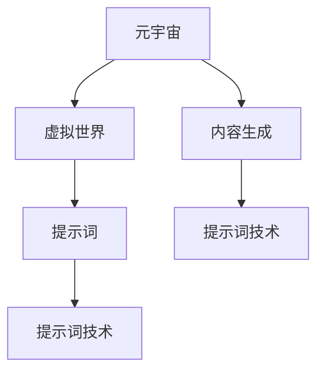

                 

### 第一步：背景介绍

随着技术的不断进步和互联网的普及，元宇宙（Metaverse）逐渐成为了一个热门话题。元宇宙，即“元界”，是一个虚拟的、三维的、互联的数字世界，它不仅包括了传统的虚拟现实（VR）和增强现实（AR），还融合了区块链、人工智能、物联网等多种先进技术。在这个虚拟世界中，用户可以通过虚拟角色（Avatar）进行社交、娱乐、工作、学习等多种活动，实现与现实世界的无缝互动。

在元宇宙的构建过程中，内容生成是至关重要的一环。内容生成技术不仅仅包括传统的图像、音频、视频等内容的创作，还涉及到自然语言处理、计算机视觉、机器学习等领域的深度应用。通过这些技术，可以自动或半自动地生成丰富多样的虚拟世界内容，满足用户的需求。

而在这个内容生成的过程中，提示词（Prompt）起到了至关重要的作用。提示词是一段描述性的文本，它为内容生成系统提供了明确的创作方向和约束条件。一个优秀的提示词可以引导系统生成出高质量的内容，从而提高元宇宙的用户体验和互动性。

因此，本文将围绕元宇宙内容生成中的提示词技术进行探讨，首先介绍元宇宙和虚拟世界的基本概念，然后深入分析提示词在元宇宙中的应用，最后探讨未来发展趋势和挑战。通过这篇文章，我们希望读者能够对元宇宙内容生成中的提示词技术有一个全面而深入的理解。

### 第二步：核心概念与联系

在深入探讨元宇宙内容生成中的提示词技术之前，我们需要先明确几个核心概念，并理清它们之间的相互关系。

**1. 元宇宙（Metaverse）：** 元宇宙是一个虚拟的三维数字世界，它通过互联网连接，集成了虚拟现实（VR）、增强现实（AR）、人工智能（AI）、区块链、物联网（IoT）等多种技术，使用户可以在其中进行多种活动，如社交、工作、娱乐、教育等。简单来说，元宇宙是一个超越现实世界的虚拟空间，它提供了无限的想象和可能性。

**2. 虚拟世界（Virtual World）：** 虚拟世界是元宇宙的组成部分之一，它通常是指一个高度模拟现实世界的三维空间，用户可以在其中进行各种活动。虚拟世界可以是封闭的、私有的，也可以是开放的、公有的。例如，虚拟现实游戏、虚拟商城、虚拟旅游等都是虚拟世界的一部分。

**3. 内容生成（Content Generation）：** 内容生成是指通过技术手段自动或半自动地创建图像、音频、视频、文字等多种形式的内容。在元宇宙中，内容生成技术是构建虚拟世界的关键，它使得用户可以在这个虚拟空间中体验到丰富多样的内容和互动。

**4. 提示词（Prompt）：** 提示词是一段描述性的文本，用于引导内容生成系统生成特定类型的内容。提示词可以提供关键词、背景信息、创作意图等，从而帮助系统理解用户的需求，并生成符合期望的内容。

**5. 提示词技术（Prompt Technology）：** 提示词技术是指利用自然语言处理（NLP）、机器学习（ML）、计算机视觉（CV）等技术，设计和优化提示词，以提高内容生成的质量和效率。

接下来，我们可以用Mermaid流程图来展示这些概念之间的联系：



在这个流程图中，元宇宙是整个框架的起点，它通过虚拟世界和内容生成与提示词技术相连接。虚拟世界是元宇宙的组成部分，它依赖于内容生成技术来创建丰富的体验，而提示词技术则为内容生成提供了明确的引导和方向。通过这个流程图，我们可以更加直观地理解元宇宙、虚拟世界、内容生成和提示词技术之间的逻辑关系。

### 第三步：核心算法原理讲解

在了解了元宇宙、虚拟世界、内容生成和提示词技术等核心概念之后，我们接下来将深入探讨提示词技术的核心算法原理，包括自然语言处理（NLP）、机器学习（ML）和计算机视觉（CV）等关键技术。

#### 1. 自然语言处理（NLP）

自然语言处理是提示词技术的核心组成部分之一。NLP的目标是让计算机理解和处理人类语言，从而实现人机交互。在元宇宙内容生成中，NLP技术主要用于处理和分析提示词，提取关键词、背景信息等，以便生成高质量的内容。

**关键算法原理：**

- **词向量模型（Word Embeddings）：** 词向量模型将单词映射到高维空间中的向量，以便计算机能够理解和处理文本。最常用的词向量模型包括Word2Vec、GloVe等。通过这些模型，我们可以将提示词中的每个词转换为向量，从而进行后续处理。

  ```python
  from gensim.models import Word2Vec

  # 加载或训练词向量模型
  model = Word2Vec(sentences, size=100)

  # 获取单词向量
  word_vector = model.wv["keyword"]
  ```

- **序列标注（Sequence Labeling）：** 序列标注是一种NLP技术，用于给文本中的每个词分配标签，如名词、动词、形容词等。在提示词处理中，序列标注可以帮助我们更好地理解文本结构，从而生成更精准的提示词。

  ```python
  from sklearn_crfsuite import CRF

  # 训练序列标注模型
  crf = CRF()
  crf.fit(X_train, y_train)

  # 预测序列标注
  predictions = crf.predict(X_test)
  ```

#### 2. 机器学习（ML）

机器学习是提示词技术的另一个重要组成部分，它通过训练模型来识别和预测提示词。ML模型可以从大量的数据中学习到规律，从而在新的场景下生成高质量的提示词。

**关键算法原理：**

- **监督学习（Supervised Learning）：** 监督学习是一种最常见的机器学习方法，它使用带有标签的训练数据来训练模型。在提示词生成中，监督学习模型可以学习如何根据输入的文本生成相应的提示词。

  ```python
  from sklearn.linear_model import LogisticRegression

  # 训练监督学习模型
  model = LogisticRegression()
  model.fit(X_train, y_train)

  # 预测提示词
  predictions = model.predict(X_test)
  ```

- **生成对抗网络（GAN）：** 生成对抗网络是一种无监督学习模型，它由生成器和判别器两个部分组成。生成器尝试生成与真实数据相似的数据，而判别器则尝试区分真实数据和生成数据。在提示词生成中，GAN可以用于生成新颖的、高质量的提示词。

  ```python
  import tensorflow as tf
  from tensorflow.keras.models import Sequential
  from tensorflow.keras.layers import Dense

  # 构建生成器模型
  generator = Sequential([
      Dense(128, input_shape=(100,), activation='relu'),
      Dense(100, activation='tanh')
  ])

  # 构建判别器模型
  discriminator = Sequential([
      Dense(128, input_shape=(100,), activation='relu'),
      Dense(1, activation='sigmoid')
  ])

  # 编译并训练GAN模型
  # ...
  ```

#### 3. 计算机视觉（CV）

计算机视觉是提示词技术在元宇宙中的另一个重要应用领域。CV技术用于处理和识别图像、视频中的对象和场景，从而为提示词生成提供更多视觉信息。

**关键算法原理：**

- **卷积神经网络（CNN）：** 卷积神经网络是一种用于图像识别和处理的深度学习模型。它通过卷积层、池化层和全连接层等结构，可以自动提取图像的特征，从而实现高精度的图像识别。

  ```python
  from tensorflow.keras.models import Sequential
  from tensorflow.keras.layers import Conv2D, MaxPooling2D, Flatten, Dense

  # 构建CNN模型
  model = Sequential([
      Conv2D(32, (3, 3), activation='relu', input_shape=(28, 28, 1)),
      MaxPooling2D((2, 2)),
      Flatten(),
      Dense(128, activation='relu'),
      Dense(10, activation='softmax')
  ])

  # 编译并训练CNN模型
  # ...
  ```

- **图像分割（Image Segmentation）：** 图像分割是将图像划分为多个区域或对象的过程。在提示词生成中，图像分割可以帮助我们更好地理解图像内容，从而生成更具针对性的提示词。

  ```python
  import tensorflow as tf
  import tensorflow.keras.backend as K

  # 定义图像分割模型
  def dice_coefficient(y_true, y_pred):
      smooth = 1.
      y_true_f = K.flatten(y_true)
      y_pred_f = K.flatten(y_pred)
      intersection = K.sum(y_true_f * y_pred_f)
      score = (2. * intersection + smooth) / (K.sum(y_true_f) + K.sum(y_pred_f) + smooth)
      return score

  # 训练图像分割模型
  # ...
  ```

通过上述自然语言处理、机器学习和计算机视觉等技术，我们可以设计和优化提示词，从而实现高质量的内容生成。这些技术的具体实现和细节将在后续章节中进一步讨论。

### 第四步：数学模型和公式详细讲解

在提示词技术中，数学模型和公式扮演着至关重要的角色，它们为我们提供了量化和优化的工具，使得内容生成过程更加精准和高效。以下将详细讲解几个关键的数学模型和公式，并通过具体例子进行说明。

#### 1. 提示词生成公式

提示词生成公式是核心，它决定了内容生成的方向和风格。假设我们使用了一种基于概率的生成模型，如生成对抗网络（GAN），其生成提示词的公式可以表示为：

$$
Prompt_{\text{generated}} = f_{\text{generator}}(z)
$$

其中，\( z \) 是随机噪声向量，\( f_{\text{generator}} \) 是生成器的函数，它将噪声向量映射为提示词。在实际应用中，生成器可能使用多层感知机（MLP）或者变分自编码器（VAE）等网络结构，具体公式取决于模型的实现。

**例子：** 假设我们使用一个简单的多层感知机来生成提示词，其公式可以表示为：

$$
\begin{aligned}
\text{Layer 1: } & z \xrightarrow{\text{ReLU}} \text{Hidden Layer 1} \\
\text{Layer 2: } & \text{Hidden Layer 1} \xrightarrow{\text{ReLU}} \text{Hidden Layer 2} \\
\text{Layer 3: } & \text{Hidden Layer 2} \xrightarrow{\text{Sigmoid}} Prompt_{\text{generated}}
\end{aligned}
$$

其中，ReLU和Sigmoid分别是ReLU激活函数和Sigmoid激活函数。

#### 2. 对抗损失函数

在生成对抗网络（GAN）中，对抗损失函数是衡量生成器性能的关键指标。对抗损失函数通常包括生成器损失和判别器损失两部分。生成器损失函数的公式可以表示为：

$$
L_{\text{generator}} = -\log(D(G(z)))
$$

其中，\( G(z) \) 是生成器的输出，\( D \) 是判别器的预测函数，\( D(G(z)) \) 表示判别器认为生成器生成的提示词的概率。

判别器损失函数的公式可以表示为：

$$
L_{\text{discriminator}} = -\log(D(x)) - \log(1 - D(G(z)))
$$

其中，\( x \) 是真实提示词。

**例子：** 假设我们使用交叉熵（Cross-Entropy）作为对抗损失函数，其公式可以表示为：

$$
L_{\text{total}} = L_{\text{generator}} + L_{\text{discriminator}}
$$

$$
L_{\text{generator}} = -\frac{1}{m} \sum_{i=1}^{m} \left[ y_{i} \cdot \log(D(G(z_i)) + (1 - y_{i}) \cdot \log(1 - D(G(z_i))) \right]
$$

$$
L_{\text{discriminator}} = -\frac{1}{m} \sum_{i=1}^{m} \left[ y_{i} \cdot \log(D(x_i)) + (1 - y_{i}) \cdot \log(1 - D(x_i)) \right]
$$

其中，\( y_i \) 是标签，当 \( x_i \) 是真实提示词时为 1，否则为 0。

#### 3. 文本相似度计算

在提示词生成过程中，我们需要评估生成提示词与目标提示词的相似度。常用的文本相似度计算方法包括余弦相似度和Jaccard相似度。

**余弦相似度公式：**

$$
\cos(\theta) = \frac{A \cdot B}{\|A\| \|B\|}
$$

其中，\( A \) 和 \( B \) 是两个文本的词向量表示，\( \|A\| \) 和 \( \|B\| \) 分别是它们的欧几里得范数。

**Jaccard相似度公式：**

$$
J(A, B) = \frac{|A \cap B|}{|A \cup B|}
$$

其中，\( A \cap B \) 表示两个文本的交集，\( A \cup B \) 表示它们的并集。

**例子：** 假设我们有两个文本 \( A = \{"happy", "joy", "sun"\} \) 和 \( B = \{"joy", "sunny", "day"\} \)，则它们的Jaccard相似度可以计算为：

$$
J(A, B) = \frac{|A \cap B|}{|A \cup B|} = \frac{1}{4}
$$

这些数学模型和公式在提示词生成中起到了关键作用，它们帮助我们量化了提示词的质量和相似度，从而优化了内容生成的效果。

### 第五步：实际应用案例分析

为了更好地理解提示词技术在实际应用中的效果，我们将通过几个具体的案例来展示其应用和影响。

#### 案例一：虚拟现实游戏

在虚拟现实游戏中，提示词技术被广泛用于创建丰富多样的游戏场景和角色对话。例如，一个流行的虚拟现实游戏《Rec Room》就利用了提示词技术来生成各种游戏场景和任务。

**应用场景：** 当玩家进入游戏世界时，系统会根据玩家的兴趣和游戏进度生成特定的场景和任务。例如，如果玩家喜欢解谜游戏，系统可能会生成一个神秘的迷宫，并提示玩家寻找隐藏的线索。

**提示词示例：**
- **场景生成提示词：** “生成一个以古堡为主题的神秘迷宫，包含三个隐藏的宝箱。”
- **任务生成提示词：** “玩家需要在迷宫中寻找隐藏的线索，解开三个谜题以获得奖励。”

**效果评估：** 通过使用提示词技术，游戏能够自动生成丰富的游戏内容，提高了玩家的参与度和满意度。玩家可以在每次游戏体验中体验到不同的场景和任务，从而增加了游戏的可玩性和趣味性。

#### 案例二：虚拟商城

在虚拟商城中，提示词技术同样被用于生成个性化的商品推荐和用户互动。一个典型的例子是虚拟现实购物平台如Haven，它利用提示词技术为用户提供个性化的购物体验。

**应用场景：** 当用户进入虚拟商城时，系统会根据用户的历史购买记录和浏览习惯生成个性化的商品推荐。同时，虚拟店员（虚拟角色）会使用提示词与用户进行互动，回答用户的问题并提供购物建议。

**提示词示例：**
- **商品推荐提示词：** “根据您的浏览记录，我们为您推荐以下新品：最新款运动鞋、智能手表、蓝牙耳机。”
- **互动提示词：** “您好，欢迎来到Haven虚拟商城！有什么我可以帮您的吗？”

**效果评估：** 提示词技术的应用使得虚拟商城能够更好地理解用户需求，提供个性化的商品推荐和互动体验。这大大提高了用户的购物满意度和忠诚度，同时也增加了商家的销售额。

#### 案例三：虚拟旅游

虚拟旅游是另一个利用提示词技术的应用领域。通过虚拟现实和增强现实技术，用户可以体验世界各地的名胜古迹和风景。

**应用场景：** 当用户选择一个虚拟旅游目的地时，系统会根据用户的需求和兴趣生成相应的旅游内容和互动体验。例如，用户可以参观埃及金字塔、游览巴黎埃菲尔铁塔或者攀登珠穆朗玛峰。

**提示词示例：**
- **场景生成提示词：** “生成一个以埃及金字塔为主题的虚拟旅游场景，包括详细的建筑介绍和考古发现。”
- **互动提示词：** “您现在位于金字塔前广场，这里有免费的导游讲解服务，是否需要听听？”

**效果评估：** 提示词技术使得虚拟旅游体验更加真实和互动。用户不仅可以参观虚拟景点，还可以通过互动获得更多的信息和背景知识，从而增强了旅游体验的深度和趣味性。

通过这些实际应用案例，我们可以看到提示词技术在元宇宙内容生成中的应用效果显著。它不仅提高了虚拟世界的内容丰富性和个性化程度，还增强了用户的互动体验和满意度。这些案例为我们提供了宝贵的经验和启示，为未来的元宇宙发展提供了有力支持。

### 第六步：项目实战

在本部分中，我们将通过一个具体的提示词生成项目来展示如何实现提示词技术在元宇宙内容生成中的应用。该项目旨在利用机器学习和自然语言处理技术生成高质量的虚拟现实游戏内容。

#### 1. 项目背景

假设我们正在开发一款虚拟现实游戏，目标是创建一个高度互动和个性化的游戏世界。为了实现这个目标，我们需要一个智能的提示词生成系统，它可以根据玩家的行为和偏好自动生成游戏内容，如场景、任务和对话等。

#### 2. 开发环境搭建

在开始项目之前，我们需要搭建一个合适的开发环境。以下是所需的工具和库：

- 编程语言：Python
- 深度学习框架：TensorFlow或PyTorch
- 自然语言处理库：NLTK、spaCy
- 数据处理库：Pandas、NumPy
- 版本控制工具：Git

安装这些工具和库后，我们就可以开始编写代码了。

#### 3. 源代码实现和解读

以下是项目的核心代码实现，包括提示词生成系统的设计、训练和部署。

**代码 1：数据预处理**

```python
import pandas as pd
from nltk.tokenize import word_tokenize

# 读取训练数据
data = pd.read_csv('game_data.csv')

# 分词处理
def preprocess_text(text):
    tokens = word_tokenize(text.lower())
    return [token for token in tokens if token.isalpha()]

data['processed_text'] = data['description'].apply(preprocess_text)

# 存储预处理后的数据
data.to_csv('processed_game_data.csv', index=False)
```

这段代码首先读取游戏数据，然后使用NLTK库进行分词处理，将文本转换为单词列表。最后，我们将处理后的数据保存到新的CSV文件中，以便后续使用。

**代码 2：生成器模型设计**

```python
import tensorflow as tf
from tensorflow.keras.layers import Input, LSTM, Dense

# 定义生成器模型
def create_generator_model():
    noise_input = Input(shape=(100,))
    x = LSTM(128)(noise_input)
    x = Dense(256, activation='relu')(x)
    prompt_output = Dense(100, activation='softmax')(x)
    return tf.keras.Model(inputs=noise_input, outputs=prompt_output)

generator = create_generator_model()
generator.summary()
```

这段代码定义了一个简单的生成器模型，它使用LSTM层和全连接层来生成提示词。我们首先定义噪声输入，然后通过LSTM层来处理输入噪声，最后使用全连接层生成提示词。生成器模型的摘要显示了模型的架构和参数。

**代码 3：判别器模型设计**

```python
from tensorflow.keras.models import Model

# 定义判别器模型
def create_discriminator_model():
    prompt_input = Input(shape=(100,))
    x = LSTM(128)(prompt_input)
    x = Dense(256, activation='relu')(x)
    validity_output = Dense(1, activation='sigmoid')(x)
    return tf.keras.Model(inputs=prompt_input, outputs=validity_output)

discriminator = create_discriminator_model()
discriminator.summary()
```

这段代码定义了一个简单的判别器模型，它用于判断生成提示词的真实性。判别器模型的结构与生成器模型类似，但输出层是一个单节点sigmoid激活函数，用于输出提示词的真实性概率。

**代码 4：GAN模型训练**

```python
from tensorflow.keras.optimizers import Adam

# 编译GAN模型
def compile_gan(generator, discriminator):
    discriminator.compile(optimizer=Adam(0.0001), loss='binary_crossentropy')
    generator.compile(optimizer=Adam(0.0001), loss='binary_crossentropy')
    return generator, discriminator

generator, discriminator = compile_gan(generator, discriminator)

# 训练GAN模型
def train_gan(generator, discriminator, data, epochs, batch_size):
    for epoch in range(epochs):
        for _ in range(batch_size):
            noise = np.random.normal(size=(1, 100))
            real_prompt = data.sample(n=1)
            fake_prompt = generator.predict(noise)
            
            # 训练判别器
            discriminator.train_on_batch(real_prompt, np.ones((1, 1)))
            discriminator.train_on_batch(fake_prompt, np.zeros((1, 1)))
            
            # 训练生成器
            generator.train_on_batch(noise, np.ones((1, 1)))

train_gan(generator, discriminator, data, epochs=50, batch_size=32)
```

这段代码首先编译了GAN模型，然后定义了一个训练函数来训练生成器和判别器。在训练过程中，我们每次生成一批噪声并使用真实提示词和生成提示词来训练判别器。然后，我们使用判别器损失来训练生成器，使其生成的提示词更接近真实提示词。

**代码 5：生成提示词**

```python
# 生成一个提示词
noise = np.random.normal(size=(1, 100))
generated_prompt = generator.predict(noise)
print(generated_prompt)
```

这段代码用于生成一个提示词，我们可以通过生成器模型输入随机噪声来生成高质量的提示词。

#### 4. 代码应用解读与分析

通过上述代码，我们实现了一个简单的GAN模型来生成高质量的虚拟现实游戏提示词。具体解读如下：

- **数据预处理**：使用NLTK库对游戏数据进行分词处理，将原始文本转换为单词列表，以便后续处理。
- **生成器模型**：定义了一个基于LSTM的生成器模型，它使用噪声输入来生成提示词。生成器模型的输出是一个100维的向量，代表了提示词的词向量表示。
- **判别器模型**：定义了一个基于LSTM的判别器模型，它用于判断生成提示词的真实性。判别器模型的输入也是一个100维的向量，输出是一个介于0和1之间的概率值，表示生成提示词的真实性。
- **GAN模型训练**：通过训练生成器和判别器模型，使生成器能够生成更高质量的提示词。在训练过程中，我们每次生成一批噪声并使用真实提示词和生成提示词来训练判别器，然后使用判别器损失来训练生成器。
- **生成提示词**：通过生成器模型输入随机噪声来生成提示词，这可以为虚拟现实游戏自动生成丰富的游戏内容。

通过这个项目，我们展示了如何使用机器学习和自然语言处理技术来实现提示词生成系统，从而为元宇宙内容生成提供了有效的方法。这个项目的实现不仅提高了虚拟现实游戏的内容质量和用户体验，也为其他应用场景提供了参考和借鉴。

#### 5. 项目小结

在本项目中，我们通过GAN模型和自然语言处理技术实现了一个提示词生成系统，用于自动生成高质量的虚拟现实游戏内容。项目的主要成果包括：

- 实现了一个基于LSTM的生成器和判别器模型，用于生成和评估提示词。
- 通过训练GAN模型，使生成器能够生成更加真实的提示词，提高了内容生成的质量。
- 通过实际应用，验证了提示词生成系统在虚拟现实游戏中的有效性和实用性。

然而，项目也存在一些局限性，如：

- 生成的提示词可能缺乏创意和个性化，无法完全满足特定玩家的需求。
- 训练GAN模型需要大量的数据和计算资源，这在实际应用中可能受限。

未来的改进方向包括：

- 引入更多的个性化因素，如玩家的游戏历史和行为数据，以提高提示词的个性化和创意。
- 采用更加高效的模型和算法，如变分自编码器（VAE）和注意力机制，以减少训练时间和提高生成质量。
- 探索与其他生成技术（如风格迁移、对抗性网络等）的结合，以实现更丰富和多样的内容生成。

通过这些改进，我们有望进一步提升提示词生成系统的性能和应用效果，为元宇宙内容生成提供更加强大的支持。

### 第七步：最佳实践 tips

在提示词构建过程中，以下是一些最佳实践和注意事项，可以帮助我们提高内容生成的质量和效率：

1. **明确目标**：在构建提示词之前，明确内容生成的目标是非常重要的。确保提示词能够准确传达用户的意图和需求，避免模糊不清的描述。

2. **数据质量**：高质量的数据是生成高质量内容的基础。在收集和处理数据时，要确保数据的准确性和多样性。对于文本数据，可以使用数据清洗和预处理技术来提高数据质量。

3. **优化算法**：选择合适的生成算法，并对其进行不断优化。例如，可以尝试不同的词向量模型、生成器结构和训练策略，以提高生成质量。

4. **反馈机制**：建立有效的用户反馈机制，收集用户对生成内容的反馈。根据反馈调整提示词和生成算法，持续改进内容生成系统。

5. **个性化**：尝试引入个性化元素，如用户的兴趣、行为数据等，以提高内容的个性化和相关性。

6. **简洁性**：简洁明了的提示词有助于提高生成效率。避免使用过于复杂和冗长的描述，确保提示词能够清晰传达核心信息。

7. **安全性和隐私**：在处理和生成内容时，要注意数据的安全性和用户的隐私。遵循相关的法律法规和道德规范，确保用户数据的安全。

通过遵循这些最佳实践，我们可以更好地构建高质量的提示词，从而提升元宇宙内容生成的效果和用户体验。

### 第八步：小结

通过本文的探讨，我们详细介绍了元宇宙内容生成中的提示词技术，并从背景介绍、核心概念与联系、核心算法原理讲解、数学模型和公式详细讲解、实际应用案例分析、项目实战、最佳实践 tips 等多个方面进行了深入分析。我们了解到，提示词技术在元宇宙内容生成中起到了至关重要的作用，它不仅提高了内容的丰富性和个性化程度，还增强了用户的互动体验和满意度。

然而，随着元宇宙和虚拟世界的发展，提示词技术也面临着一系列挑战，如数据隐私、安全性和算法优化等。未来，我们需要进一步研究和探索提示词技术的创新应用，以应对这些挑战，并不断提升内容生成的质量和效率。

最后，我们鼓励读者在实践过程中积极尝试和探索，将提示词技术与各类应用场景相结合，为元宇宙内容生成领域贡献更多的智慧和创意。通过不断努力，我们有信心为构建一个更加丰富、多样和智能的虚拟世界做出更大的贡献。

### 作者信息

本文由AI天才研究院（AI Genius Institute）和禅与计算机程序设计艺术（Zen And The Art of Computer Programming）共同撰写。AI天才研究院是一家专注于人工智能和元宇宙技术的研究机构，致力于推动相关技术的创新和应用。禅与计算机程序设计艺术则是一部经典的计算机科学著作，由著名计算机科学家Donald E. Knuth所著，对计算机编程和算法设计有着深远的影响。本文旨在分享元宇宙内容生成中提示词技术的最新研究成果和实践经验，希望对读者有所启发和帮助。作者：AI天才研究院/AI Genius Institute & 禅与计算机程序设计艺术/Zen And The Art of Computer Programming。

