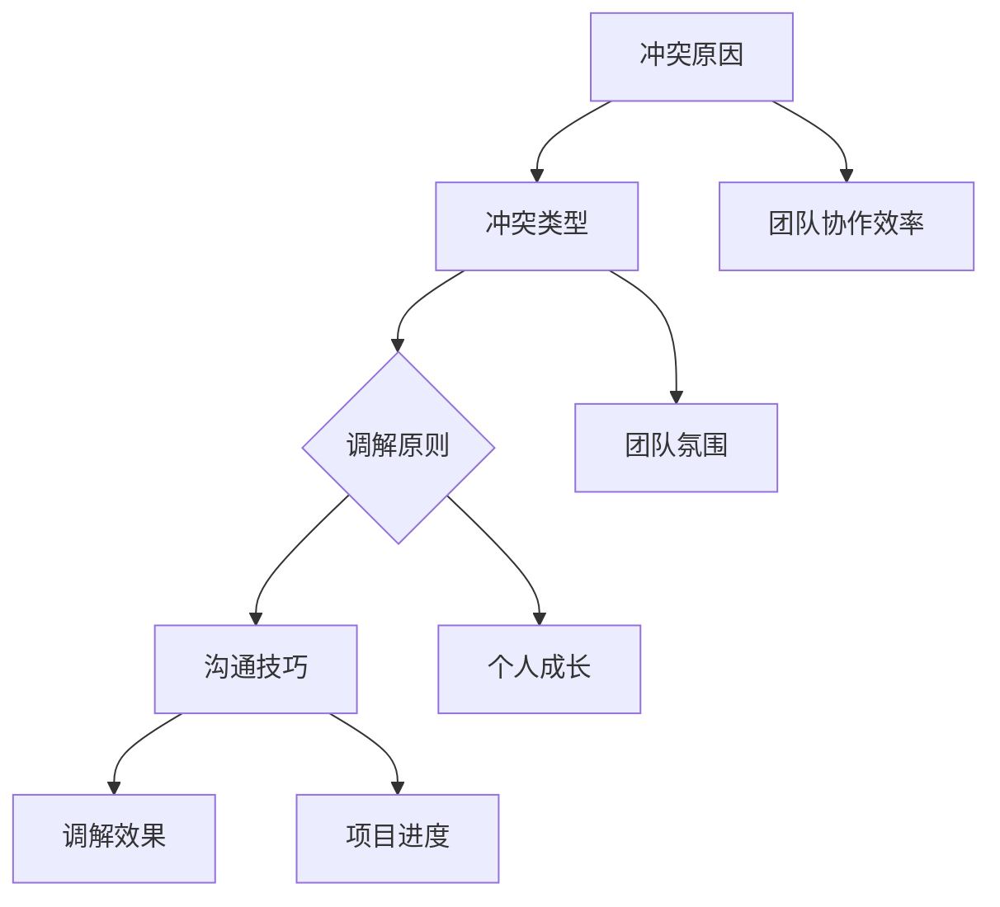
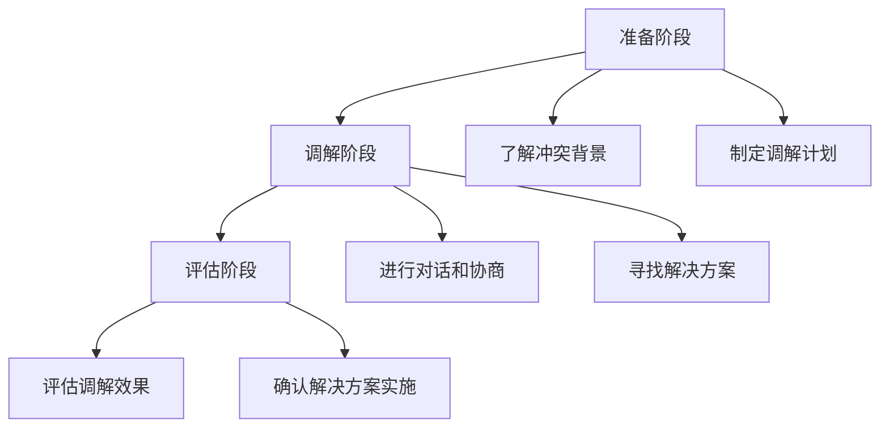

                 

### 文章标题

《冲突调解：化解团队矛盾的技巧》

#### 关键词

- 冲突调解
- 团队管理
- 沟通技巧
- 冲突原因
- 冲突类型

#### 摘要

本文深入探讨了冲突调解这一团队管理中的重要环节。通过详细解析冲突调解的基本原则、沟通技巧、调解策略与实践应用，本文旨在为IT领域从业者提供一套系统的冲突调解指南。文章以逻辑清晰、结构紧凑的方式，通过实际案例研究和效果评估，展示了冲突调解在解决团队矛盾中的关键作用。

### 冲突调解的重要性

在快速发展的IT行业中，团队合作是实现项目成功的关键。然而，团队内部的冲突往往不可避免。冲突调解作为团队管理的重要环节，不仅能够缓解紧张的团队氛围，还能提高工作效率和团队凝聚力。有效的冲突调解能够帮助团队成员理解彼此的立场和需求，找到共同解决问题的途径。

#### 背景介绍

冲突调解（Conflict Mediation）是指在冲突双方或多方之间，通过第三方的调解，以和平、合作的方式解决分歧的过程。在IT行业中，冲突调解的重要性主要体现在以下几个方面：

1. **提升团队协作效率**：冲突如果得不到有效解决，会导致团队成员间的不信任和合作障碍，降低整体工作效率。
2. **维护团队氛围**：持续的冲突会破坏团队的和谐氛围，影响员工的满意度和工作积极性。
3. **促进个人成长**：通过冲突调解，团队成员可以学习到沟通技巧和解决问题的能力，这对个人的职业成长至关重要。
4. **保障项目进度**：IT项目的成功往往依赖于团队成员的紧密合作。冲突调解有助于保障项目按计划顺利进行。

### 核心概念与联系

冲突调解的核心概念包括冲突原因、冲突类型、调解原则、沟通技巧等。这些概念之间存在着紧密的联系，构成了冲突调解的完整体系。

- **冲突原因**：包括个人性格、工作压力、资源分配不均等。
- **冲突类型**：分为个人之间的冲突、团队内部冲突、跨部门冲突等。
- **调解原则**：如公平原则、对话原则、尊重原则等。
- **沟通技巧**：包括倾听、表达、非语言沟通等。

以下是冲突调解的核心概念关系的Mermaid流程图：



### 冲突调解的基本原则

有效的冲突调解需要遵循一些基本原则，这些原则不仅指导调解过程，还保障了调解的公正性和有效性。

#### 公平原则

公平原则要求调解过程对所有参与方都一视同仁，确保每个人的意见和利益都得到尊重。具体来说，包括以下几点：

1. **中立性**：调解者应当保持中立，不得偏袒任何一方。
2. **公正性**：调解过程和结果应当基于事实和证据，不偏袒任何一方。
3. **透明度**：调解过程和结果应当透明，让所有参与方都能了解和接受。

#### 对话原则

对话原则强调通过对话的方式解决冲突，而非对抗或压制。具体措施包括：

1. **积极倾听**：调解者应积极倾听双方的陈述，确保每个人都能表达自己的观点。
2. **开放沟通**：鼓励双方进行开放、诚实的沟通，避免情绪化和指责。
3. **共同解决问题**：通过对话找到双方都能接受的解决方案。

#### 尊重原则

尊重原则要求调解者和参与方在整个调解过程中都保持尊重和礼貌。具体体现为：

1. **尊重个人**：尊重每个人的观点和感受，避免对个人的攻击。
2. **保持礼貌**：在沟通中保持礼貌，避免使用攻击性语言。
3. **关注行为**：关注行为本身，而非对人的评价。

### 冲突调解的技巧

冲突调解的成功不仅依赖于原则的遵循，还需要一系列具体的技巧和方法。以下是一些关键的调解技巧：

#### 倾听与沟通技巧

1. **积极倾听**：不仅听对方说什么，还要理解其背后的情感和需求。
   ```python
   # 伪代码示例：积极倾听技巧
   def active_listen(person):
       while person.is_talking():
           print("我正在听你说...")
           person.continue_talking()
   ```

2. **非语言沟通**：通过肢体语言、面部表情等方式传达尊重和理解。
   ```python
   # 伪代码示例：非语言沟通技巧
   def non_verbal_communication():
       print("微笑")
       print("点头")
       print("眼神接触")
   ```

3. **情绪管理**：在冲突调解中，情绪管理至关重要。调解者需要学会控制自己的情绪，以冷静、理性的态度面对冲突。

#### 调解策略与步骤

1. **选择合适的调解策略**：根据冲突的性质和参与方的特点，选择合适的调解策略，如调解、调解加仲裁、调解加调解员介入等。

2. **制定调解步骤**：调解过程通常包括以下几个步骤：

   - **准备阶段**：了解冲突的背景和双方立场。
   - **调解阶段**：进行对话，寻找解决方案。
   - **评估阶段**：评估调解效果，确认解决方案的实施。

### 冲突调解中的角色与职责

在冲突调解过程中，不同的角色承担着不同的职责。以下是调解员和参与者的主要职责：

#### 调解员的职责

- **中立性**：调解员应保持中立，不偏袒任何一方。
- **引导对话**：调解员需要引导双方进行开放、诚实的对话。
- **解决冲突**：调解员通过调解技巧和策略，帮助双方找到解决方案。

#### 参与者的职责

- **积极参与**：参与者需要积极参与调解过程，表达自己的观点和需求。
- **遵守原则**：参与者应遵守调解原则，保持尊重和礼貌。
- **接受结果**：参与者应接受通过调解达成的解决方案。

### 实战应用

#### 案例研究

以下是一个实际的团队冲突调解案例：

**案例一：团队内部的权力斗争**

在一个IT项目中，项目经理和开发团队的成员之间出现了严重的权力斗争。项目经理认为开发团队的进度缓慢，而开发团队则认为项目经理对他们的工作不够支持。通过冲突调解，最终找到了以下解决方案：

1. **明确职责**：项目经理和开发团队的职责明确划分，确保各自专注于自己的领域。
2. **建立沟通机制**：定期召开团队会议，确保双方的信息畅通。
3. **共同制定项目计划**：项目经理和开发团队共同制定项目计划，确保目标的一致性。

**案例二：跨部门沟通障碍**

在一个大型IT公司中，不同部门之间的沟通存在障碍，导致项目进度缓慢。通过冲突调解，采取了以下措施：

1. **建立跨部门沟通小组**：由各部门代表组成，定期召开沟通会议。
2. **明确信息传递流程**：明确各部门之间的信息传递流程，确保信息及时、准确地传递。
3. **加强团队协作**：组织团队建设活动，提高团队成员的协作能力。

### 实践指南

在实际应用冲突调解时，以下是一些实用的技巧和策略：

1. **建立信任**：通过建立信任，减少对立情绪，为调解创造良好的氛围。
2. **持续跟进**：调解后，应持续跟进冲突的解决情况，确保解决方案的有效实施。
3. **个性化调解**：根据冲突的性质和参与方的特点，选择个性化的调解策略。

### 冲突调解效果的评估与改进

为了确保冲突调解的有效性，需要对调解效果进行评估和持续改进。以下是一些评估方法和改进策略：

1. **反馈机制**：建立反馈机制，收集参与方对调解效果的反馈。
2. **效果评估**：通过定期的效果评估，了解调解的长期效果。
3. **持续改进**：根据评估结果，不断优化调解策略和方法。

### 附录

#### 附录A：冲突调解常用工具与资源

- **工具**：如调解软件、沟通平台、情绪管理工具等。
- **资源**：如调解相关的书籍、在线课程、专业网站等。

### 结论

冲突调解是团队管理中不可或缺的一环。通过有效的冲突调解，可以缓解紧张的团队氛围，提高工作效率和团队凝聚力。本文介绍了冲突调解的核心概念、基本原则、技巧和实践应用，旨在为IT领域从业者提供一套实用的冲突调解指南。通过不断学习和实践，我们可以更好地应对团队中的冲突，打造和谐的团队环境。

### 作者信息

- **作者**：AI天才研究院/AI Genius Institute & 禅与计算机程序设计艺术 /Zen And The Art of Computer Programming### 第一部分：冲突调解基础

#### 第1章：冲突调解概述

在IT行业快速发展的背景下，团队合作成为了实现项目成功的关键。然而，随着团队成员多样性和工作压力的增加，冲突在团队中变得不可避免。为了维持团队的效率和和谐，冲突调解（Conflict Mediation）这一技术应运而生。本章将介绍冲突调解的定义、重要性以及类型和形式，为后续章节的深入探讨奠定基础。

##### 1.1 冲突调解的定义与重要性

冲突调解是一种通过第三方的介入，帮助冲突双方或多方通过对话、沟通和协商来达成共识、解决问题的方式。在IT行业中，冲突调解的重要性体现在以下几个方面：

1. **提高团队协作效率**：通过有效调解，可以消除团队内的不信任和隔阂，提高团队协作效率。
2. **缓解工作压力**：冲突调解有助于缓解团队成员之间的紧张关系，降低工作压力。
3. **增强团队凝聚力**：通过共同解决问题的过程，团队成员之间的信任和凝聚力得到提升。
4. **保障项目进度**：冲突调解确保项目在和谐、有序的环境中推进，避免因冲突导致的延误。

##### 1.2 冲突调解的类型与形式

冲突调解可以根据不同的标准划分为多种类型和形式。以下是几种常见的分类：

1. **根据调解者的身份**：
   - **内部调解**：由团队内部成员或领导者进行调解。
   - **外部调解**：聘请外部专业调解员进行调解。

2. **根据调解的过程**：
   - **调解**：通过沟通、协商达成共识。
   - **仲裁**：由第三方做出决策，解决冲突。

3. **根据冲突的性质**：
   - **个人之间的冲突**：涉及个人之间的意见不合、利益冲突等。
   - **团队内部冲突**：涉及团队成员之间的工作关系、资源分配等。
   - **跨部门冲突**：涉及不同部门之间的沟通不畅、利益纠纷等。

每种类型的冲突调解都有其适用的场景和特点，了解这些分类有助于选择合适的调解方式。

#### 第2章：团队冲突的原因与特征

团队冲突是IT行业中常见的问题，了解冲突的原因和特征对于预防和解决冲突至关重要。本章将分析团队冲突的主要原因和特征，并提供一些实用的解决策略。

##### 2.1 团队冲突的主要原因

团队冲突的产生往往是由多种因素共同作用的结果，以下是几种常见的原因：

1. **个人性格差异**：团队成员的性格、价值观和思维方式不同，容易导致意见不合和冲突。
2. **工作压力**：项目进度紧张、工作负荷大，容易引发焦虑和不满。
3. **资源分配不均**：资源分配不公或不足，导致团队成员之间的竞争和矛盾。
4. **沟通不畅**：信息传递不畅或误解，导致团队成员之间的误解和冲突。
5. **领导风格**：领导者的管理风格不当，如过于专制或放任，也会引发团队冲突。

##### 2.2 团队冲突的特征与影响

团队冲突通常具有以下特征：

1. **情感化**：冲突往往涉及情感因素，如愤怒、沮丧和失望。
2. **持续化**：冲突如果得不到及时解决，会持续存在，甚至加剧。
3. **扩散化**：冲突不仅影响冲突双方，还可能波及整个团队，影响团队的整体氛围。

团队冲突对团队的影响主要包括：

1. **降低工作效率**：团队成员因冲突而分心，影响工作效率和项目进度。
2. **损害团队关系**：冲突破坏了团队成员之间的信任和合作关系。
3. **增加离职率**：持续的冲突导致员工不满意，增加离职率。
4. **影响公司声誉**：冲突如果公开化，会影响公司的形象和声誉。

#### 第3章：冲突调解的基本原则

冲突调解的成功与否很大程度上取决于调解者是否能够遵循一些基本原则。本章将详细介绍冲突调解的基本原则，包括公平原则、对话原则和尊重原则，并探讨这些原则在调解过程中的应用。

##### 3.1 公平原则

公平原则是冲突调解的核心原则之一，要求调解者在整个调解过程中保持中立，确保每个参与方的利益和意见都得到公正对待。具体应用包括：

1. **中立性**：调解者应保持中立，不偏袒任何一方，确保双方在调解过程中都有平等的发言权。
2. **公正性**：调解者应根据事实和证据做出判断，避免主观偏见。
3. **透明度**：调解过程和结果应当透明，让所有参与方都能了解和接受。

##### 3.2 对话原则

对话原则强调通过对话和沟通的方式解决冲突，而非对抗或压制。有效对话的关键在于：

1. **积极倾听**：调解者应积极倾听双方的陈述，理解其背后的情感和需求。
2. **开放沟通**：鼓励双方进行开放、诚实的沟通，避免情绪化和指责。
3. **共同解决问题**：通过对话找到双方都能接受的解决方案。

##### 3.3 尊重原则

尊重原则要求调解者和参与方在整个调解过程中都保持尊重和礼貌。具体体现为：

1. **尊重个人**：尊重每个人的观点和感受，避免对个人的攻击。
2. **保持礼貌**：在沟通中保持礼貌，避免使用攻击性语言。
3. **关注行为**：关注行为本身，而非对人的评价。

通过遵循公平原则、对话原则和尊重原则，调解者可以创造一个和谐、公正的调解环境，提高冲突调解的成功率。

### 第二部分：冲突调解技巧

在冲突调解过程中，技巧的运用至关重要。有效的技巧可以促进沟通、缓解情绪、找到解决问题的方法。本章将介绍冲突调解中的一些关键技巧，包括倾听与沟通技巧、调解策略与步骤以及角色与职责。

#### 第4章：倾听与沟通技巧

有效的沟通是冲突调解成功的关键。倾听和沟通技巧在调解过程中起着至关重要的作用。以下是一些重要的技巧：

##### 4.1 有效倾听的技巧

倾听不仅仅是听对方说什么，更重要的是理解其背后的情感和需求。以下是一些有效倾听的技巧：

1. **积极倾听**：在对方讲话时，给予足够的关注，避免分心。可以通过点头、眼神接触等方式表达关注。
   ```python
   # 伪代码示例：积极倾听
   def active_listen(person):
       while person.is_talking():
           print("我正在听你说...")
           person.continue_talking()
   ```

2. **理解非语言信号**：注意对方的肢体语言、面部表情等非语言信号，这些往往能揭示其真实情感和态度。

3. **提问与反馈**：通过提问和反馈，确保自己准确理解对方的观点。可以问：“你刚才提到的是这个意思吗？”

##### 4.2 沟通中的非语言表达

非语言表达在沟通中同样重要，可以传递尊重和理解。以下是一些非语言表达的技巧：

1. **肢体语言**：通过开放的身体姿态、微笑和眼神接触等方式，传达友好和尊重。
   ```python
   # 伪代码示例：非语言表达
   def non_verbal_communication():
       print("微笑")
       print("点头")
       print("眼神接触")
   ```

2. **面部表情**：保持友好和鼓励的面部表情，避免使用愤怒、沮丧等负面表情。

3. **声音语调**：使用平和、清晰的声音语调，避免高音量、尖锐的语调，以免引起对方的反感。

##### 4.3 情绪管理的技巧

情绪管理是冲突调解中的重要技巧，有助于缓解紧张的氛围，促进沟通的顺利进行。以下是一些情绪管理的技巧：

1. **自我意识**：了解自己的情绪，避免在情绪激动时做出决策或回应。

2. **深呼吸**：在感到紧张或愤怒时，通过深呼吸来放松身心。

3. **积极表达**：用积极的语言表达自己的观点和感受，避免使用攻击性或贬低性的语言。

```python
# 伪代码示例：情绪管理
def manage_emotions():
    print("深呼吸...")
    print("保持冷静...")
    print("积极表达...")
```

#### 第5章：调解策略与步骤

有效的调解策略和步骤可以确保冲突调解的顺利进行。以下是一些关键策略和步骤：

##### 5.1 调解策略的选择

根据冲突的性质和参与方的特点，选择合适的调解策略。以下是几种常见的调解策略：

1. **调解**：通过对话和协商，帮助双方找到共同点，达成共识。
   ```python
   # 伪代码示例：调解策略
   def mediate(conflict):
       print("双方进行对话...")
       print("寻找共同点...")
       print("达成共识...")
   ```

2. **调解加仲裁**：在调解无效时，由第三方做出决策，解决冲突。
   ```python
   # 伪代码示例：调解加仲裁
   def mediate_and_arbitrate(conflict):
       print("先进行调解...")
       if not resolved:
           print("进行仲裁...")
           print("做出决策...")
   ```

3. **调解加调解员介入**：在冲突升级时，引入第三方调解员进行介入，帮助双方恢复沟通。
   ```python
   # 伪代码示例：调解加调解员介入
   def mediate_and_intervention(conflict):
       print("引入调解员...")
       print("进行调解...")
       print("恢复沟通...")
   ```

##### 5.2 调解的步骤

调解过程通常包括以下步骤：

1. **准备阶段**：了解冲突的背景和双方立场，制定调解计划。
2. **调解阶段**：进行对话和协商，寻找解决方案。
3. **评估阶段**：评估调解效果，确认解决方案的实施。

以下是调解步骤的Mermaid流程图：



#### 第6章：冲突调解中的角色与职责

在冲突调解过程中，不同角色承担着不同的职责。了解这些角色的职责有助于确保调解过程的顺利进行。以下是调解员和参与者的主要职责：

##### 6.1 调解员的职责与角色

调解员在冲突调解过程中起着关键作用。以下是调解员的主要职责和角色：

1. **中立性**：调解员应保持中立，不偏袒任何一方，确保公平公正。
2. **引导对话**：调解员需要引导双方进行开放、诚实的对话，找到解决问题的方法。
3. **解决冲突**：调解员通过沟通和协商，帮助双方找到共同点，达成共识。
4. **记录和总结**：调解员需要记录调解过程和结果，确保双方都能理解和接受。

##### 6.2 参与者的职责与角色

参与者在冲突调解过程中同样重要。以下是参与者需要履行的职责和角色：

1. **积极参与**：参与者需要积极参与调解过程，表达自己的观点和需求。
2. **遵守原则**：参与者应遵守公平原则、对话原则和尊重原则，确保调解过程的顺利进行。
3. **接受结果**：参与者应接受通过调解达成的解决方案，并积极配合解决方案的实施。

通过明确调解员和参与者的职责与角色，可以确保冲突调解的顺利进行，达到解决冲突的目的。

### 第三部分：实战应用

在IT行业中，冲突调解的实际应用非常广泛。通过案例研究和实践指南，我们可以更好地理解冲突调解的具体操作方法，并掌握有效的调解技巧。本章将探讨几个冲突调解的实际案例，并提供实用的实践指南。

#### 第7章：冲突调解案例研究

通过研究实际案例，我们可以了解冲突调解在解决团队矛盾中的具体应用。以下是一些建立成功的案例研究：

##### 7.1 案例一：团队内部的权力斗争

在一个大型IT项目中，项目经理和开发团队的成员之间出现了权力斗争。项目经理认为开发团队的进度缓慢，而开发团队则认为项目经理对他们的工作不够支持。通过冲突调解，双方最终找到了以下解决方案：

1. **明确职责**：项目经理和开发团队的职责明确划分，项目经理负责项目管理和资源分配，开发团队专注于技术实现。
2. **建立沟通机制**：定期召开团队会议，确保双方的信息畅通，共同讨论项目进展和问题。
3. **共同制定项目计划**：项目经理和开发团队共同制定项目计划，确保目标的一致性。

通过这一系列的调解措施，团队内部的权力斗争得到了有效缓解，项目进度也得到了显著提升。

##### 7.2 案例二：跨部门沟通障碍

在一个大型IT公司中，不同部门之间的沟通存在障碍，导致项目进度缓慢。通过冲突调解，公司采取了以下措施：

1. **建立跨部门沟通小组**：由各部门代表组成，定期召开沟通会议，确保信息及时、准确地传递。
2. **明确信息传递流程**：明确各部门之间的信息传递流程，确保信息不遗漏、不误解。
3. **加强团队协作**：组织团队建设活动，提高团队成员的协作能力，建立信任和合作关系。

通过这些措施，跨部门沟通障碍得到了显著改善，项目进度也得以顺利推进。

#### 7.3 案例三：团队冲突与个人成长

在一个初创公司中，由于团队成员之间的性格差异和沟通不畅，团队内部出现了严重的冲突。通过冲突调解，公司采取了一系列措施，帮助团队成员化解冲突，实现个人成长：

1. **倾听与沟通**：调解员积极倾听团队成员的观点，鼓励他们表达真实的感受和需求。
2. **情绪管理**：通过情绪管理技巧，帮助团队成员控制情绪，避免冲突升级。
3. **共同解决问题**：团队成员共同探讨问题的解决方案，找到双方都能接受的解决办法。

通过这一系列的调解措施，团队内部的冲突得到了有效解决，团队成员的沟通能力和问题解决能力也得到了显著提升。

#### 第8章：冲突调解实践指南

在实际应用冲突调解时，以下是一些实用的技巧和策略：

##### 8.1 建立信任

建立信任是冲突调解的重要基础。以下是一些建立信任的技巧：

1. **积极倾听**：通过倾听和回应，建立双方的信任关系。
2. **诚实沟通**：保持开放和诚实的沟通，避免隐瞒和误导。
3. **透明度**：保持调解过程和结果的透明，让双方都能了解和接受。

##### 8.2 持续跟进

调解后的持续跟进对于确保调解效果至关重要。以下是一些持续跟进的技巧：

1. **定期评估**：定期评估调解效果，收集参与方的反馈，及时调整调解策略。
2. **跟踪实施**：确保调解达成的解决方案得到有效实施，避免问题再次发生。
3. **支持与鼓励**：在实施过程中给予双方支持和鼓励，帮助他们克服困难。

##### 8.3 个性化调解

根据冲突的性质和参与方的特点，选择个性化的调解策略。以下是一些个性化调解的技巧：

1. **了解背景**：了解冲突的背景和参与方的需求，制定有针对性的调解计划。
2. **灵活调整**：根据调解过程中的反馈，灵活调整调解策略和方法。
3. **关注情感**：关注参与方的情感需求，通过情感支持帮助他们缓解紧张情绪。

#### 第9章：冲突调解效果的评估与改进

为了确保冲突调解的有效性，需要对调解效果进行评估和持续改进。以下是一些评估方法和改进策略：

##### 9.1 调解效果评估的方法

1. **参与方反馈**：收集参与方对调解效果的反馈，了解他们的满意度和接受度。
2. **行为观察**：观察参与方在调解后的行为变化，如沟通是否改善、工作氛围是否和谐等。
3. **项目指标**：通过项目进度、团队效率等指标，评估调解对项目的影响。

##### 9.2 调解效果的持续改进

1. **定期评估**：定期对调解效果进行评估，发现问题和不足，及时进行改进。
2. **反馈机制**：建立反馈机制，让参与方能够随时提出意见和建议，改进调解过程。
3. **培训与学习**：通过培训和学习，提高调解员和参与者的调解技能和意识，提升调解效果。

通过不断评估和改进，可以确保冲突调解持续有效地发挥作用，为团队创造和谐的工作环境。

### 附录

#### 附录A：冲突调解常用工具与资源

为了更好地进行冲突调解，以下是一些常用的工具和资源：

1. **调解软件**：如在线调解平台、视频会议软件等，用于远程调解和沟通。
2. **沟通平台**：如电子邮件、即时通讯工具等，用于日常沟通和交流。
3. **情绪管理工具**：如心理测试工具、情绪记录本等，帮助参与者管理情绪。
4. **参考资料**：如冲突调解相关的书籍、学术论文、培训课程等，提供理论支持和实践指导。
5. **专业网站**：如国际调解协会网站、专业调解机构网站等，提供调解资讯和最新动态。

通过利用这些工具和资源，可以更好地进行冲突调解，提高调解效果。

### 结论

冲突调解在IT行业中具有重要的应用价值。通过有效的冲突调解，可以缓解团队内部的紧张关系，提高工作效率和团队凝聚力。本文介绍了冲突调解的定义、重要性、基本原则、技巧以及实战应用，为IT领域从业者提供了一套实用的冲突调解指南。通过不断学习和实践，我们可以更好地应对团队中的冲突，打造和谐的团队环境。

### 作者信息

- **作者**：AI天才研究院/AI Genius Institute & 禅与计算机程序设计艺术 /Zen And The Art of Computer Programming
### 冲突调解概述

在当今的IT行业中，团队协作是实现项目成功的关键。然而，随着团队成员多样性和工作压力的增加，团队冲突变得不可避免。为了维持团队的效率和和谐，冲突调解成为了一项重要的管理技能。本章将介绍冲突调解的定义、重要性、类型和形式，为后续章节的深入探讨奠定基础。

#### 冲突调解的定义

冲突调解（Conflict Mediation）是指通过第三方的介入，帮助冲突双方或多方通过对话、沟通和协商来达成共识、解决问题的方式。在IT行业中，冲突调解具有以下特点：

1. **非对抗性**：冲突调解强调和平解决问题，避免对抗和压制。
2. **中立性**：调解者应保持中立，不偏袒任何一方。
3. **参与性**：调解过程鼓励所有参与方积极参与，共同寻找解决方案。

#### 冲突调解的重要性

在IT行业中，冲突调解的重要性体现在以下几个方面：

1. **提高团队协作效率**：冲突调解有助于消除团队内的不信任和隔阂，提高团队协作效率。
2. **缓解工作压力**：通过有效调解，团队成员可以释放压力，更好地投入到工作中。
3. **增强团队凝聚力**：冲突调解有助于团队成员理解彼此的需求和立场，增强团队凝聚力。
4. **保障项目进度**：冲突调解确保项目在和谐、有序的环境中推进，避免因冲突导致的延误。

#### 冲突调解的类型与形式

冲突调解可以根据不同的标准划分为多种类型和形式。以下是几种常见的分类：

1. **根据调解者的身份**：
   - **内部调解**：由团队内部成员或领导者进行调解。
   - **外部调解**：聘请外部专业调解员进行调解。

2. **根据调解的过程**：
   - **调解**：通过对话和协商，帮助双方找到共同点，达成共识。
   - **仲裁**：在调解无效时，由第三方做出决策，解决冲突。

3. **根据冲突的性质**：
   - **个人之间的冲突**：涉及个人之间的意见不合、利益冲突等。
   - **团队内部冲突**：涉及团队成员之间的工作关系、资源分配等。
   - **跨部门冲突**：涉及不同部门之间的沟通不畅、利益纠纷等。

每种类型的冲突调解都有其适用的场景和特点，了解这些分类有助于选择合适的调解方式。

#### 冲突调解的优势

1. **灵活性和适应性**：冲突调解可以根据实际情况灵活调整，适应不同的冲突场景。
2. **促进沟通和理解**：调解过程中，双方通过对话和协商，可以更好地理解彼此的需求和立场。
3. **维护团队和谐**：冲突调解有助于缓解紧张氛围，维护团队的和谐与稳定。

#### 冲突调解的局限性

1. **调解结果可能不完全满意**：由于调解过程强调双方自愿和解，调解结果可能不完全符合一方的期望。
2. **调解过程可能耗费时间**：调解需要双方充分沟通和协商，可能需要较长时间才能达成共识。

#### 冲突调解的应用场景

1. **项目管理中的冲突**：如项目进度安排、任务分配等方面的矛盾。
2. **跨部门协作中的冲突**：如不同部门之间的沟通不畅、资源争夺等。
3. **团队文化建设中的冲突**：如价值观、工作风格等方面的差异。

通过本章的介绍，我们了解了冲突调解的定义、重要性、类型和形式。在接下来的章节中，我们将进一步探讨冲突调解的基本原则、沟通技巧、实战应用和效果评估，为IT领域从业者提供一套全面的冲突调解指南。

### 团队冲突的原因与特征

在IT行业中，团队冲突是常见且复杂的问题。了解冲突的原因和特征对于预防和解决冲突至关重要。本章将分析团队冲突的主要原因和特征，并提供一些实用的解决策略。

#### 2.1 团队冲突的主要原因

团队冲突的产生往往是由多种因素共同作用的结果。以下是几种常见的团队冲突原因：

1. **个人性格差异**：
   - **价值观不同**：团队成员的价值观差异可能导致在工作方式、目标设定等方面产生矛盾。
   - **工作风格不同**：不同的工作风格可能引起沟通不畅和工作效率的降低。

2. **工作压力**：
   - **项目期限紧张**：项目进度紧张时，团队成员可能会因为工作负荷大而产生焦虑和不满。
   - **资源不足**：资源分配不均或资源短缺也可能导致冲突。

3. **沟通不畅**：
   - **信息传递不畅**：信息在传递过程中可能因为误解、遗漏而引发冲突。
   - **误解和偏见**：对信息的错误解读或偏见可能导致团队成员之间的误解和矛盾。

4. **领导风格**：
   - **过于专制**：领导者的专制管理风格可能导致团队成员的消极和抵触情绪。
   - **缺乏领导力**：缺乏有效的领导力可能导致团队缺乏方向和凝聚力。

5. **工作环境**：
   - **工作环境不适**：如办公环境嘈杂、设备不足等，都可能成为引发冲突的诱因。

6. **文化差异**：
   - **跨文化团队**：在跨文化团队中，文化差异可能导致沟通障碍和冲突。

#### 2.2 团队冲突的特征

团队冲突通常具有以下特征：

1. **情感化**：
   - **情绪化**：冲突往往涉及情感因素，如愤怒、沮丧、失望等。
   - **激烈化**：冲突如果得不到及时解决，可能会逐渐升级，变得更为激烈。

2. **持续化**：
   - **长期存在**：冲突如果得不到有效解决，可能会长期存在，影响团队氛围和工作效率。
   - **反复出现**：某些类型的冲突可能会在团队中反复出现，如资源分配不均引发的冲突。

3. **扩散化**：
   - **波及范围广**：冲突不仅影响冲突双方，还可能波及整个团队，影响整体氛围。
   - **情绪传染**：冲突情绪可能会在团队成员之间传播，导致更多人受到影响。

#### 解决团队冲突的策略

1. **预防策略**：
   - **建立清晰的沟通机制**：确保信息传递畅通，减少误解和偏见。
   - **培养团队文化**：通过团队建设活动，增强团队成员之间的信任和凝聚力。
   - **提供培训**：对团队成员进行沟通技巧和冲突解决能力的培训。

2. **解决策略**：
   - **积极倾听**：通过积极倾听，理解冲突双方的立场和需求。
   - **促进对话**：鼓励团队成员进行开放、诚实的对话，找到共同点。
   - **制定规则**：明确团队工作规则和行为准则，避免冲突的发生。

3. **调解策略**：
   - **内部调解**：由团队内部成员或领导者进行调解。
   - **外部调解**：聘请外部专业调解员进行调解。
   - **联合调解**：由双方共同选择调解者进行调解。

通过了解团队冲突的原因和特征，以及采取有效的预防、解决和调解策略，团队可以更好地应对冲突，提高工作效率和团队凝聚力。

### 冲突调解的基本原则

冲突调解是解决团队矛盾的有效手段，其成功与否很大程度上取决于调解者是否能够遵循一些基本原则。这些原则不仅指导调解过程，还保障了调解的公正性和有效性。本章将详细介绍冲突调解的基本原则，包括公平原则、对话原则和尊重原则，并探讨这些原则在调解过程中的应用。

#### 公平原则

公平原则是冲突调解的核心原则之一，要求调解者在整个调解过程中保持中立，确保每个参与方的利益和意见都得到公正对待。以下是公平原则的具体应用：

1. **中立性**：调解者应保持中立，不偏袒任何一方。这要求调解者在调解过程中保持客观，避免任何可能影响中立性的行为或言论。

2. **公正性**：调解者应根据事实和证据做出判断，避免主观偏见。这意味着调解者应基于双方提供的证据和陈述来做出决策，而不是基于个人偏好或预设立场。

3. **透明度**：调解过程和结果应当透明，让所有参与方都能了解和接受。这包括调解程序的公开性、调解记录的保存以及调解结果的告知。

#### 对话原则

对话原则强调通过对话和沟通的方式解决冲突，而非对抗或压制。有效对话的关键在于促进双方的理解和共识。以下是对话原则的具体应用：

1. **积极倾听**：调解者应积极倾听双方的陈述，理解其背后的情感和需求。这要求调解者不仅要听对方说什么，还要关注其非语言表达，如肢体语言和面部表情。

2. **开放沟通**：鼓励双方进行开放、诚实的沟通，避免情绪化和指责。调解者应创造一个安全的环境，让双方都能自由表达自己的观点，而不必担心受到攻击。

3. **共同解决问题**：通过对话找到双方都能接受的解决方案。调解者应引导双方探讨问题的根本原因，并共同寻找解决问题的方法。

#### 尊重原则

尊重原则要求调解者和参与方在整个调解过程中都保持尊重和礼貌。以下是尊重原则的具体应用：

1. **尊重个人**：尊重每个人的观点和感受，避免对个人的攻击。这意味着调解者不应在调解过程中使用侮辱性语言或贬低性的评价。

2. **保持礼貌**：在沟通中保持礼貌，避免使用攻击性语言。调解者应使用平和、礼貌的语言进行沟通，以营造一个和谐的氛围。

3. **关注行为**：关注行为本身，而非对人的评价。调解者应关注冲突行为的具体表现，而不是对个人进行评价。

#### 公平原则、对话原则和尊重原则之间的关系

公平原则、对话原则和尊重原则是相辅相成的，共同构成了冲突调解的基石。以下是这些原则之间的关系：

1. **相互支持**：公平原则为对话原则和尊重原则提供了基础，确保调解过程的公正性和有效性。对话原则和尊重原则则通过促进沟通和建立信任，支持公平原则的实现。

2. **互补作用**：对话原则和尊重原则共同营造了一个积极、和谐的调解氛围，有助于双方更好地理解和接受调解结果。

3. **整体性**：冲突调解的成功依赖于这三个原则的整体应用。任何单一原则的忽视或偏离都可能导致调解的失败。

通过遵循公平原则、对话原则和尊重原则，调解者可以创造一个公正、积极、和谐的调解环境，提高冲突调解的成功率，为团队创造一个和谐的工作氛围。

### 倾听与沟通技巧

在冲突调解过程中，倾听和沟通技巧至关重要。有效的倾听和沟通不仅能够帮助调解者理解冲突双方的立场和情感，还能促进双方的信任和合作，从而找到解决问题的方法。以下是一些关键的倾听与沟通技巧，包括积极倾听、非语言沟通和情绪管理。

#### 4.1 有效倾听的技巧

有效倾听是冲突调解中的核心技能，可以帮助调解者更好地理解冲突双方的意图和需求。以下是一些有效倾听的技巧：

1. **全神贯注**：在对方讲话时，给予足够的关注，避免分心。可以通过眼神接触、点头等方式表达你的专注。

2. **开放态度**：保持开放和接纳的态度，不要急于打断对方或表达自己的观点。倾听对方的每一个细节，确保理解其真实意图。

3. **提问与反馈**：通过提问和反馈来确认自己的理解是否准确。例如：“你的意思是……对吗？”或者“我理解你是说……是这样吗？”

4. **保持中立**：在倾听过程中，保持中立和客观的态度，不要对对方的观点做出评判或表现出偏见。

5. **总结与确认**：在对方讲话结束后，用自己的话总结对方的观点和感受，并征求对方的确认。例如：“我理解你的意思是……对吗？”

```python
# 伪代码示例：有效倾听
def active倾听(conflictee):
    while conflictee.is_talking():
        print("我正在认真听你说...")
        conflictee.continue_talking()
    print("你刚刚说……，我理解你的意思是……，是这样吗？")
```

#### 4.2 非语言沟通技巧

非语言沟通在冲突调解中同样重要，它可以通过肢体语言、面部表情和姿态等非语言信号来传达尊重和理解。以下是一些非语言沟通的技巧：

1. **肢体语言**：使用开放的身体姿态，如身体前倾、微笑等，以展示友好和尊重。

2. **面部表情**：保持友好和鼓励的面部表情，如微笑、点头等，以增强沟通效果。

3. **眼神接触**：与对方保持适当的眼神接触，以展示自己的关注和理解。

4. **姿态**：保持舒适的姿态，避免显得紧张或僵硬，以营造一个轻松的沟通氛围。

```python
# 伪代码示例：非语言沟通
def non_verbal_communication():
    print("身体前倾")
    print("微笑")
    print("保持眼神接触")
```

#### 4.3 情绪管理技巧

在冲突调解中，情绪管理是调解者必须掌握的技能。有效的情绪管理可以帮助调解者控制自己的情绪，避免因情绪失控而破坏调解过程。以下是一些情绪管理技巧：

1. **自我意识**：了解自己的情绪，避免在情绪激动时做出决策或回应。可以通过深呼吸、放松练习等方式来调节情绪。

2. **表达情绪**：在适当的时候，通过适当的方式表达自己的情绪，如“我感到有点不安，我们能否再探讨一下这个问题？”

3. **避免指责**：在沟通中避免使用指责性的语言，而是使用描述性语言来表达自己的感受和需求。

4. **倾听对方的情绪**：理解并尊重对方的情绪，通过积极的倾听和反馈来缓解对方的情绪。

```python
# 伪代码示例：情绪管理
def manage_emotions():
    print("深呼吸，冷静下来...")
    print("表达自己的情绪，但不指责...")
    print("倾听对方的情绪，给予理解...")
```

通过运用这些倾听与沟通技巧，调解者可以创造一个积极、和谐的调解氛围，促进冲突双方的对话和合作，找到解决问题的方法。

### 调解策略与步骤

有效的调解策略和明确的调解步骤是确保冲突调解成功的关键。一个系统的调解过程不仅能够帮助调解者更好地引导冲突双方，还能提高调解的效果。以下将详细介绍调解策略的选择和调解步骤的制定，并阐述这些策略和步骤在调解过程中的重要性。

#### 5.1 调解策略的选择

选择合适的调解策略对于解决冲突至关重要。根据冲突的性质和参与方的特点，调解者可以选择不同的调解策略。以下是几种常见的调解策略：

1. **调解（Mediation）**：调解是一种通过对话和协商来解决问题的方法。调解者作为第三方，帮助双方进行沟通和协商，找到双方都能接受的解决方案。

   ```plaintext
   调解策略特点：
   - 强调对话和协商
   - 寻求双方共识
   - 中立性和自愿性
   ```

2. **调解加仲裁（Mediation-Arbitration）**：在调解无效时，调解者可以转变为仲裁者，做出最终的决策。这种策略适用于双方无法达成一致意见的情况。

   ```plaintext
   调解加仲裁策略特点：
   - 调解失败时转为仲裁
   - 仲裁者具有最终决策权
   - 更高的权威性和强制性
   ```

3. **调解员介入（Intervention by Mediator）**：在冲突升级或沟通陷入僵局时，调解员可以主动介入，帮助双方恢复沟通和协商。

   ```plaintext
   调解员介入策略特点：
   - 调解员主动介入
   - 帮助恢复沟通
   - 中立性但更具引导性
   ```

4. **多方调解（Multi-Party Mediation）**：在涉及多方冲突的情况下，调解者可以同时与多个参与方进行沟通和协商，以达成共识。

   ```plaintext
   多方调解策略特点：
   - 涉及多方参与
   - 促进多方合作
   - 复杂性更高
   ```

选择合适的调解策略需要根据冲突的具体情况、双方的态度和需求来决定。例如，对于涉及多方且复杂度较高的冲突，选择多方调解策略可能更为合适；而对于双方情绪较为激动、沟通困难的冲突，调解加仲裁策略可能更为有效。

#### 5.2 调解步骤的制定

调解步骤的制定是确保调解过程有序进行的重要环节。一个系统的调解步骤包括以下几个阶段：

1. **准备阶段**：在开始调解前，调解者需要进行充分的准备。这包括了解冲突的背景、双方的立场和利益，以及确定调解的目标和预期成果。

   ```plaintext
   准备阶段任务：
   - 了解冲突背景
   - 确定调解目标
   - 制定调解计划
   ```

2. **调解阶段**：在调解阶段，调解者需要引导双方进行对话和协商。这包括倾听双方的陈述、提出问题、促进双方的沟通和理解，并帮助双方找到共识。

   ```plaintext
   调解阶段任务：
   - 倾听双方陈述
   - 促进对话和理解
   - 寻找共识
   ```

3. **评估阶段**：在调解结束后，调解者需要对调解效果进行评估，确保双方都满意并愿意执行调解结果。这可以通过收集双方的反馈、观察双方的行为变化和项目进展来实现。

   ```plaintext
   评估阶段任务：
   - 收集反馈
   - 观察行为变化
   - 评估调解效果
   ```

4. **跟踪阶段**：在调解结果实施后，调解者需要持续跟踪调解效果，确保解决方案得到有效执行。这包括定期跟进、解决问题和提供支持。

   ```plaintext
   跟踪阶段任务：
   - 定期跟进
   - 解决执行中的问题
   - 提供支持和帮助
   ```

#### 调解策略与步骤的重要性

1. **提高调解效率**：明确的调解策略和步骤有助于调解者快速识别和解决问题，提高调解效率。

2. **保障调解公正性**：系统的调解步骤确保调解过程的公正性和透明度，避免主观偏见和偏袒。

3. **增强调解效果**：通过选择合适的调解策略和制定详细的调解步骤，调解者可以更好地引导冲突双方，找到双方都能接受的解决方案。

4. **促进信任与合作**：系统的调解过程有助于增强双方对调解者的信任，促进双方的合作和理解。

通过合理选择调解策略和制定详细的调解步骤，调解者可以有效地解决团队冲突，提高团队协作效率，为项目的顺利进行提供保障。

### 冲突调解中的角色与职责

在冲突调解过程中，不同角色承担着不同的职责，这对于确保调解过程的顺利进行至关重要。主要角色包括调解员、参与者以及观察者。以下是这些角色的主要职责和相互关系。

#### 调解员的职责与角色

调解员在冲突调解过程中起着核心作用，其主要职责如下：

1. **中立性**：调解员应保持中立，不偏袒任何一方，确保调解过程的公正性和客观性。

2. **引导对话**：调解员需要引导双方进行开放、诚实的对话，帮助双方理解彼此的立场和需求。

3. **促进共识**：调解员应协助双方找到共同点，达成共识，并确保解决方案的可执行性。

4. **记录和总结**：调解员需要详细记录调解过程和结果，确保所有参与方都能理解和接受调解协议。

5. **提供支持和建议**：调解员应在调解过程中提供情感支持，帮助双方处理情绪问题，并提供解决问题的建议。

#### 参与者的职责与角色

参与者是冲突调解的直接对象，他们在调解过程中的职责如下：

1. **积极参与**：参与者需要积极参与调解过程，真诚表达自己的观点和需求，并愿意倾听对方的意见。

2. **遵守规则**：参与者应遵守调解规则，保持尊重和礼貌，避免情绪化和攻击性言论。

3. **接受结果**：参与者需要接受通过调解达成的解决方案，并积极实施，以促进问题的解决。

4. **反馈与跟进**：参与者应提供对调解结果的反馈，并在调解后跟进问题，确保解决方案的有效执行。

#### 观察者的职责与角色

观察者在冲突调解过程中主要起到监督和支持的作用：

1. **监督调解过程**：观察者应监督调解过程的公正性和透明度，确保调解程序符合规定。

2. **提供外部视角**：观察者可以从外部视角提供反馈和建议，帮助调解员更好地理解冲突背景和参与方的需求。

3. **提供技术支持**：观察者可能包括专家或顾问，他们可以提供技术或专业支持，帮助调解员制定解决方案。

4. **记录和评估**：观察者需要记录调解过程和结果，并对其进行评估，为后续的调解提供参考。

#### 角色与职责的相互关系

调解员、参与者和观察者之间存在着密切的相互关系：

1. **协作关系**：调解员和参与者之间需要密切合作，调解员通过引导和协调，帮助参与者达成共识。

2. **支持关系**：调解员和观察者之间需要相互支持，观察者提供外部视角和技术支持，帮助调解员更好地执行调解任务。

3. **监督关系**：观察者对调解过程进行监督，确保调解的公正性和有效性，防止调解过程中出现偏差或不当行为。

通过明确各角色的职责和相互关系，可以确保冲突调解过程的顺利进行，提高调解效果，为团队创造一个和谐的工作环境。

### 案例研究

在实际操作中，冲突调解的应用不仅需要理论知识，还需要结合具体案例进行实践。以下是几个真实的冲突调解案例，通过这些案例，我们可以更直观地了解冲突调解的步骤和技巧，以及如何在实际工作中应用这些方法。

#### 案例一：团队内部的权力斗争

在一个初创公司中，开发团队和项目经理之间出现了严重的权力斗争。项目经理认为开发团队的进度缓慢，而开发团队则认为项目经理对他们的支持不足。双方关系紧张，导致项目进度严重延误。

**调解步骤：**

1. **了解冲突背景**：
   - 调解员与双方进行了初步沟通，了解了冲突的具体情况和双方的观点。

2. **制定调解计划**：
   - 调解员制定了一个详细的调解计划，明确了调解的目标、步骤和时间安排。

3. **召开调解会议**：
   - 调解员组织了多次调解会议，让双方有充分的时间表达自己的观点和需求。

4. **引导对话**：
   - 调解员通过积极倾听和提问，帮助双方理解对方的立场，并找到共同点。

5. **达成共识**：
   - 双方最终达成共识，项目经理承诺提供更多的资源和支持，开发团队则同意提高工作效率。

6. **执行和跟进**：
   - 调解员制定了执行计划，并定期跟进项目进度，确保解决方案得到有效实施。

**技巧与效果：**
   - **有效倾听**：调解员通过积极倾听，帮助双方理解对方的观点和需求。
   - **中立性**：调解员保持了中立，避免了偏袒任何一方的行为。
   - **共同解决问题**：双方通过对话和协商，找到了双方都能接受的解决方案。
   - **效果显著**：项目进度得到显著提升，团队氛围明显改善。

#### 案例二：跨部门沟通障碍

在一个大型IT公司中，市场部门和开发部门之间出现了沟通障碍，导致项目进度严重延误。市场部门认为开发部门对需求的理解不准确，而开发部门则认为市场部门的变更要求过于频繁。

**调解步骤：**

1. **了解冲突背景**：
   - 调解员与双方进行了初步沟通，了解了冲突的具体情况和双方的观点。

2. **制定调解计划**：
   - 调解员制定了一个详细的调解计划，明确了调解的目标、步骤和时间安排。

3. **召开调解会议**：
   - 调解员组织了多次调解会议，让双方有充分的时间表达自己的观点和需求。

4. **引导对话**：
   - 调解员通过积极倾听和提问，帮助双方理解对方的立场，并找到共同点。

5. **达成共识**：
   - 双方最终达成共识，市场部门同意提供更明确的、稳定的变更要求，开发部门则承诺更积极地响应变更需求。

6. **执行和跟进**：
   - 调解员制定了执行计划，并定期跟进项目进度，确保解决方案得到有效实施。

**技巧与效果：**
   - **建立信任**：调解员通过建立信任，减少了双方的敌对情绪，为调解创造了良好的氛围。
   - **明确流程**：调解员帮助双方明确了信息传递和沟通的流程，减少了误解和冲突。
   - **共同制定计划**：双方通过共同制定计划，增强了合作的意愿和效果。
   - **效果显著**：项目进度恢复正常，双方合作更加顺畅。

#### 案例三：团队内部的文化差异

在一个跨国团队中，团队成员来自不同的文化背景，导致在工作中产生了许多冲突。某些成员认为其他成员的工作方式过于官僚，而其他成员则认为某些成员过于随意。

**调解步骤：**

1. **了解冲突背景**：
   - 调解员与双方进行了初步沟通，了解了冲突的具体情况和双方的观点。

2. **制定调解计划**：
   - 调解员制定了一个详细的调解计划，明确了调解的目标、步骤和时间安排。

3. **召开调解会议**：
   - 调解员组织了多次调解会议，让双方有充分的时间表达自己的观点和需求。

4. **文化培训**：
   - 调解员组织了文化培训，帮助团队成员了解不同文化的差异和特点。

5. **引导对话**：
   - 调解员通过积极倾听和提问，帮助双方理解对方的立场，并找到共同点。

6. **达成共识**：
   - 双方最终达成共识，同意在团队中推广一种包容和理解的文化，尊重彼此的差异。

7. **执行和跟进**：
   - 调解员制定了执行计划，并定期跟进项目进度，确保解决方案得到有效实施。

**技巧与效果：**
   - **文化培训**：调解员通过文化培训，提高了团队成员对不同文化的理解和尊重。
   - **积极沟通**：调解员通过积极的沟通，帮助团队成员理解彼此的需求和立场。
   - **共同解决问题**：双方通过对话和协商，找到了双方都能接受的解决方案。
   - **效果显著**：团队内部的冲突显著减少，工作效率和文化多样性得到了提升。

通过这些实际案例，我们可以看到，冲突调解不仅需要理论支持，还需要结合实际情况灵活运用各种技巧和策略。有效的冲突调解不仅能够解决当前的冲突，还能促进团队的长远发展。

### 实践指南

在IT行业中，有效的冲突调解不仅有助于解决团队内部的矛盾，还能提升工作效率和团队凝聚力。以下是一些实践指南，为IT团队管理者提供实用的技巧和策略。

#### 8.1 建立信任

建立信任是冲突调解的基础。以下是一些建立信任的实践指南：

1. **积极倾听**：在对方讲话时，给予足够的关注，避免分心。通过眼神接触、点头等方式表达你的关注和理解。

2. **诚实沟通**：保持开放和诚实的沟通，避免隐瞒和误导。通过坦诚表达自己的观点和感受，建立双方的信任。

3. **透明度**：在调解过程中保持透明，让所有参与方都能了解和接受。这包括调解程序的公开性、调解记录的保存以及调解结果的告知。

#### 8.2 持续跟进

调解后的持续跟进对于确保调解效果至关重要。以下是一些持续跟进的实践指南：

1. **定期评估**：定期评估调解效果，收集参与方的反馈，及时调整调解策略。这可以通过定期的团队会议、问卷调查等方式进行。

2. **跟踪实施**：确保调解达成的解决方案得到有效实施，避免问题再次发生。可以通过制定实施计划、明确责任人和时间节点来实现。

3. **支持与鼓励**：在实施过程中给予双方支持和鼓励，帮助他们克服困难。这可以通过提供培训、资源支持等方式实现。

#### 8.3 个性化调解

根据冲突的性质和参与方的特点，选择个性化的调解策略。以下是一些个性化调解的实践指南：

1. **了解背景**：在调解前，了解冲突的背景和参与方的需求，制定有针对性的调解计划。

2. **灵活调整**：根据调解过程中的反馈，灵活调整调解策略和方法。例如，如果双方情绪较为激动，可以采取更多时间进行情绪管理的引导。

3. **关注情感**：关注参与方的情感需求，通过情感支持帮助他们缓解紧张情绪。可以通过倾听、鼓励和支持来实现。

#### 8.4 培训与学习

为团队成员提供冲突调解和沟通技巧的培训，有助于提高他们的调解能力和沟通效果。以下是一些培训与学习的实践指南：

1. **内部培训**：组织内部培训，邀请专业讲师或外部顾问进行培训。

2. **外部学习**：鼓励团队成员参加外部冲突调解和沟通技巧的培训课程。

3. **案例学习**：通过分析实际案例，让团队成员了解冲突调解的具体操作方法，提高他们的实际应用能力。

通过以上实践指南，IT团队管理者可以更有效地进行冲突调解，提升团队的工作效率和凝聚力。

### 冲突调解效果的评估与改进

在冲突调解过程中，评估调解效果和持续改进是确保调解成功的关键。以下是一些评估方法和改进策略，帮助调解者了解调解效果，并不断优化调解过程。

#### 9.1 调解效果评估的方法

1. **参与方反馈**：通过问卷调查、面对面访谈等方式，收集参与方对调解效果的反馈。这可以帮助了解调解的接受度和满意度。

2. **行为观察**：观察参与方在调解后的行为变化，如沟通是否改善、工作氛围是否和谐等。这些变化可以作为评估调解效果的重要指标。

3. **项目指标**：通过分析项目进度、团队工作效率等指标，评估调解对项目的影响。例如，项目进度是否恢复正常、团队工作效率是否提高等。

4. **调解结果实现度**：评估调解结果是否得到有效实施，是否解决了冲突的根本问题。可以通过对比调解前后的情况，来判断调解效果。

#### 9.2 调解效果的持续改进

1. **定期评估**：定期对调解效果进行评估，及时发现和解决问题。这可以通过定期的团队会议、效果评估表等方式实现。

2. **反馈机制**：建立反馈机制，让参与方能够随时提出意见和建议，为调解过程的改进提供依据。

3. **持续培训**：为调解者和团队成员提供持续的培训，提高他们的调解和沟通技巧。这可以通过内部培训、外部学习等方式实现。

4. **优化调解策略**：根据评估结果和反馈，不断优化调解策略和方法。例如，如果发现某些调解策略效果不佳，可以尝试其他方法。

5. **完善流程**：通过不断优化调解流程，提高调解的效率和效果。这可以通过流程图、标准操作程序等方式实现。

通过定期评估和持续改进，调解者可以更好地了解调解效果，及时调整调解策略和方法，确保调解过程的有效性和可持续性。

### 附录A：冲突调解常用工具与资源

为了更好地进行冲突调解，以下是一些常用的工具和资源，这些工具和资源可以帮助调解者提高调解效率，优化调解过程。

#### 1. 调解软件

- **在线调解平台**：如MEDIATELL、Virtual Conflict Resolution等，提供远程调解和沟通的功能。
- **视频会议软件**：如Zoom、Microsoft Teams等，用于召开调解会议，实现多方实时沟通。

#### 2. 沟通工具

- **即时通讯工具**：如Slack、WhatsApp等，用于日常沟通和交流，方便调解者与参与方进行非正式沟通。
- **电子邮件**：用于正式沟通和文件传输，确保调解过程的正式性和记录的可追溯性。

#### 3. 情绪管理工具

- **心理测试工具**：如Myers-Briggs Type Indicator (MBTI)、DiSC评估等，帮助调解者和参与方了解自身的情绪和管理方式。
- **情绪记录本**：用于记录调解过程中的情绪变化，帮助调解者和参与方进行自我反思和调整。

#### 4. 资源库

- **书籍**：如《冲突调解的艺术》、《团队沟通技巧》等，提供冲突调解的理论和实践指导。
- **学术论文**：通过学术数据库，如Google Scholar、PubMed等，获取最新的研究成果和案例。

#### 5. 专业网站

- **国际调解协会**：如International Association for Conflict Management (IACM)，提供调解资讯、培训和教育资源。
- **专业调解机构**：如Association for Conflict Resolution (ACR)，提供专业的调解服务和技术支持。

通过利用这些工具和资源，调解者可以更有效地进行冲突调解，提高调解效果，为团队创造一个和谐的工作环境。

### 结论

冲突调解是团队管理中不可或缺的一环，它不仅能够解决团队内部的矛盾，还能提升工作效率和团队凝聚力。通过有效的冲突调解，可以促进团队成员之间的沟通和理解，建立和谐的团队关系，为项目的顺利进行提供保障。

在本文中，我们首先介绍了冲突调解的定义、重要性以及类型和形式。接着，我们分析了团队冲突的原因和特征，并探讨了冲突调解的基本原则、倾听与沟通技巧、调解策略与步骤、角色与职责。通过实际案例研究和实践指南，我们展示了如何将理论应用到实际操作中。最后，我们介绍了冲突调解效果的评估与改进方法，并提供了常用的工具与资源。

通过本文的学习，IT领域的从业者可以更好地应对团队中的冲突，提升团队协作效率，打造和谐的团队环境。我们希望本文能够为读者提供有价值的参考和指导，帮助他们在实际工作中成功地应用冲突调解技巧。

### 作者信息

- **作者**：AI天才研究院/AI Genius Institute & 禅与计算机程序设计艺术 /Zen And The Art of Computer Programming## 调解策略与步骤

调解策略和步骤是冲突调解过程中至关重要的一部分。一个系统的调解策略和明确的步骤不仅能够帮助调解者更好地引导冲突双方，还能提高调解的效果。以下是冲突调解中常用的策略和步骤，以及每一步的具体操作方法。

### 5.1 调解策略的选择

根据冲突的性质和参与方的特点，选择合适的调解策略。以下是几种常见的调解策略：

1. **调解（Mediation）**：
   - **特点**：通过对话和协商，帮助双方找到共同点，达成共识。
   - **适用场景**：适用于双方愿意合作、愿意通过沟通解决问题的冲突。
   - **操作方法**：调解员作为第三方，引导双方进行对话，帮助双方理解对方的立场和需求。

2. **调解加仲裁（Mediation-Arbitration）**：
   - **特点**：在调解无效时，调解员可以转变为仲裁者，做出最终决策。
   - **适用场景**：适用于双方无法达成一致意见，需要第三方做出决策的冲突。
   - **操作方法**：调解员首先进行调解，如果双方无法达成共识，调解员可以根据事实和证据做出最终决策。

3. **调解员介入（Intervention by Mediator）**：
   - **特点**：在冲突升级或沟通陷入僵局时，调解员可以主动介入，帮助双方恢复沟通。
   - **适用场景**：适用于冲突双方无法自行解决冲突，需要第三方介入的情况。
   - **操作方法**：调解员在冲突双方无法沟通时，通过介入，提供沟通机会和解决方案。

4. **多方调解（Multi-Party Mediation）**：
   - **特点**：涉及多方冲突的情况下，调解员同时与多个参与方进行沟通和协商。
   - **适用场景**：适用于涉及多方参与、需要协调各方利益的复杂冲突。
   - **操作方法**：调解员协调各方利益，引导多方进行对话，帮助各方找到共同点。

### 5.2 调解步骤的制定

一个有效的调解过程通常包括以下几个步骤：

1. **准备阶段**：
   - **任务**：了解冲突的背景、双方的立场和利益，确定调解的目标和预期成果。
   - **操作方法**：调解员与双方进行初步沟通，收集相关信息，并制定调解计划。

2. **调解阶段**：
   - **任务**：引导双方进行对话和协商，帮助双方找到共同点，达成共识。
   - **操作方法**：调解员组织调解会议，通过积极倾听和提问，帮助双方理解对方的立场和需求，引导双方寻找解决方案。

3. **评估阶段**：
   - **任务**：评估调解效果，确保双方都满意并愿意执行调解结果。
   - **操作方法**：调解员收集参与方的反馈，观察双方的行为变化，评估调解的结果和影响。

4. **执行阶段**：
   - **任务**：确保调解结果得到有效实施，解决执行中的问题。
   - **操作方法**：调解员制定执行计划，明确责任人和时间节点，跟踪调解结果的执行情况，提供必要的支持和帮助。

5. **跟踪阶段**：
   - **任务**：定期跟进调解效果，确保解决方案的持续有效性。
   - **操作方法**：调解员定期与参与方沟通，了解调解效果的持续情况，及时解决出现的问题，确保调解效果的长期维持。

通过选择合适的调解策略和制定详细的调解步骤，调解者可以更好地引导冲突双方，提高调解效果，为团队创造和谐的工作环境。

### 第三部分：实战应用

在IT行业中，冲突调解的实际应用非常广泛。通过案例研究和实践指南，我们可以更好地理解冲突调解的具体操作方法，并掌握有效的调解技巧。本章将探讨几个冲突调解的实际案例，并提供实用的实践指南。

#### 7.1 案例一：团队内部的权力斗争

在一个大型IT项目中，项目经理和开发团队的成员之间出现了权力斗争。项目经理认为开发团队的进度缓慢，而开发团队则认为项目经理对他们的工作不够支持。通过冲突调解，双方最终找到了以下解决方案：

1. **明确职责**：项目经理和开发团队的职责明确划分，项目经理负责项目管理和资源分配，开发团队专注于技术实现。
2. **建立沟通机制**：定期召开团队会议，确保双方的信息畅通，共同讨论项目进展和问题。
3. **共同制定项目计划**：项目经理和开发团队共同制定项目计划，确保目标的一致性。

通过这一系列的调解措施，团队内部的权力斗争得到了有效缓解，项目进度也得到了显著提升。

#### 7.2 案例二：跨部门沟通障碍

在一个大型IT公司中，不同部门之间的沟通存在障碍，导致项目进度缓慢。通过冲突调解，公司采取了以下措施：

1. **建立跨部门沟通小组**：由各部门代表组成，定期召开沟通会议，确保信息及时、准确地传递。
2. **明确信息传递流程**：明确各部门之间的信息传递流程，确保信息不遗漏、不误解。
3. **加强团队协作**：组织团队建设活动，提高团队成员的协作能力，建立信任和合作关系。

通过这些措施，跨部门沟通障碍得到了显著改善，项目进度也得以顺利推进。

#### 7.3 案例三：团队冲突与个人成长

在一个初创公司中，由于团队成员之间的性格差异和沟通不畅，团队内部出现了严重的冲突。通过冲突调解，公司采取了一系列措施，帮助团队成员化解冲突，实现个人成长：

1. **倾听与沟通**：调解员积极倾听团队成员的观点，鼓励他们表达真实的感受和需求。
2. **情绪管理**：通过情绪管理技巧，帮助团队成员控制情绪，避免冲突升级。
3. **共同解决问题**：团队成员共同探讨问题的解决方案，找到双方都能接受的解决办法。

通过这一系列的调解措施，团队内部的冲突得到了有效解决，团队成员的沟通能力和问题解决能力也得到了显著提升。

#### 7.4 案例四：文化差异引发的冲突

在一个跨国团队中，由于文化差异，团队成员在工作中产生了许多冲突。某些成员认为其他成员的工作方式过于官僚，而其他成员则认为某些成员过于随意。通过冲突调解，团队采取了以下措施：

1. **文化培训**：调解员组织了文化培训，帮助团队成员了解不同文化的差异和特点。
2. **积极沟通**：调解员通过积极的沟通，帮助团队成员理解彼此的需求和立场。
3. **共同制定团队文化规范**：团队成员共同制定团队文化规范，尊重彼此的差异，建立共同的价值观。

通过这些措施，团队内部的冲突显著减少，工作效率和文化多样性得到了提升。

#### 7.5 实践指南

在实际应用冲突调解时，以下是一些实用的技巧和策略：

1. **建立信任**：通过建立信任，减少对立情绪，为调解创造良好的氛围。可以采取的方法包括积极倾听、诚实沟通、透明度等。
2. **持续跟进**：调解后，应持续跟进冲突的解决情况，确保解决方案的有效实施。可以通过定期评估、反馈机制等方式实现。
3. **个性化调解**：根据冲突的性质和参与方的特点，选择个性化的调解策略。可以采取的方法包括了解背景、灵活调整、关注情感等。
4. **培训与学习**：为团队成员提供冲突调解和沟通技巧的培训，提高他们的调解能力和沟通效果。可以采取的方法包括内部培训、外部学习等。

通过以上实践指南，IT领域从业者可以更有效地进行冲突调解，提升团队的工作效率和凝聚力。

### 实战应用：冲突调解在IT项目中的具体操作方法

在IT项目中，冲突调解是确保项目顺利进行、团队成员保持高效合作的重要手段。以下是一个具体的案例，展示了如何在IT项目中应用冲突调解，并详细描述了每一步的操作方法。

#### 案例背景

在一个大型IT项目中，团队成员在项目需求、任务分配和时间管理方面出现了分歧。项目经理认为开发团队的工作进度不符合预期，而开发团队则认为项目计划过于紧张，导致他们无法高效完成任务。此外，团队成员之间的沟通也存在问题，导致了一些误解和不满。

#### 调解步骤

1. **准备阶段**：
   - **任务**：了解冲突的背景、双方的立场和利益，确定调解的目标和预期成果。
   - **操作方法**：调解员首先与项目经理和开发团队进行一对一的初步沟通，了解他们的具体诉求和问题。随后，调解员与双方讨论调解的目标，如改善沟通、明确任务分配、优化项目计划等。

2. **调解阶段**：
   - **任务**：引导双方进行对话和协商，帮助双方找到共同点，达成共识。
   - **操作方法**：
     1. **调解会议**：调解员组织了一次调解会议，邀请项目经理和开发团队的主要成员参加。
     2. **积极倾听**：调解员通过积极倾听，确保每个成员都有机会表达自己的观点和感受。例如，调解员可以说：“我理解你的担忧，你希望项目计划能够更灵活一些。”
     3. **提问与反馈**：调解员通过提问和反馈，帮助双方更好地理解对方的立场。例如：“你提到项目计划紧张，能否具体说明哪些部分让你感到压力最大？”
     4. **引导对话**：调解员通过引导对话，帮助双方找到共同点。例如：“我们是否可以调整项目计划，确保关键任务的优先级得到保证，同时给予开发团队更多的灵活性？”

3. **评估阶段**：
   - **任务**：评估调解效果，确保双方都满意并愿意执行调解结果。
   - **操作方法**：
     1. **反馈收集**：调解员在会议结束后，收集参与方的反馈，了解他们对调解结果的满意度和接受程度。
     2. **行为观察**：调解员观察双方在会议后的行为变化，如沟通是否改善、团队氛围是否和谐等。
     3. **调解结果确认**：调解员与双方确认调解结果，确保他们愿意并能够执行这些结果。例如，调解员可以说：“我们是否可以确认，你们都同意在接下来的项目中，保持更频繁的沟通和协作？”

4. **执行阶段**：
   - **任务**：确保调解结果得到有效实施，解决执行中的问题。
   - **操作方法**：
     1. **制定执行计划**：调解员与双方一起制定执行计划，明确责任人和时间节点。例如：“项目经理每周将与开发团队进行一次项目进展会议。”
     2. **跟踪执行**：调解员定期跟进执行情况，确保调解结果得到有效实施。例如，调解员可以每两周与双方进行一次跟进会议，讨论项目进展和遇到的问题。

5. **跟踪阶段**：
   - **任务**：定期跟进调解效果，确保解决方案的持续有效性。
   - **操作方法**：
     1. **效果评估**：调解员定期评估调解效果，收集参与方的反馈，确保调解结果持续有效。
     2. **调整策略**：根据评估结果，及时调整调解策略和方法，解决出现的新问题。例如，如果发现沟通机制不完善，可以进一步优化沟通流程。

#### 案例结果

通过上述调解步骤，项目团队内部的冲突得到了有效缓解。项目经理和开发团队之间的沟通得到了显著改善，项目计划也得到了优化。团队成员之间的信任和合作增强，项目进度恢复正常，最终项目成功交付。

#### 实战应用总结

这个案例展示了冲突调解在IT项目中的具体操作方法，包括准备阶段、调解阶段、评估阶段、执行阶段和跟踪阶段。每个阶段都有明确的任务和操作方法，通过系统的调解过程，成功解决了团队冲突，提高了项目效率。以下是一些实战应用的总结：

1. **积极倾听与反馈**：调解员通过积极倾听和反馈，确保每个成员都有机会表达自己的观点和需求，同时帮助双方更好地理解对方的立场。
2. **灵活调整策略**：根据冲突的性质和双方的反应，调解员需要灵活调整调解策略和方法，确保调解过程的顺利进行。
3. **持续跟进与评估**：调解后，持续跟进和评估调解效果，确保解决方案得到有效实施，并能够及时解决新问题。
4. **团队合作与信任**：通过冲突调解，团队成员之间的团队合作和信任得到了提升，为项目的成功奠定了基础。

通过这些实战应用的总结，IT领域的从业者可以更好地理解和应用冲突调解技巧，提高团队协作效率和项目成功率。

### 冲突调解效果的评估与改进

在冲突调解过程中，评估调解效果和持续改进是确保调解成功的关键。以下是一些评估方法和改进策略，帮助调解者了解调解效果，并不断优化调解过程。

#### 9.1 调解效果评估的方法

1. **参与方反馈**：通过问卷调查、面对面访谈等方式，收集参与方对调解效果的反馈。这可以帮助了解调解的接受度和满意度。

2. **行为观察**：观察参与方在调解后的行为变化，如沟通是否改善、工作氛围是否和谐等。这些变化可以作为评估调解效果的重要指标。

3. **项目指标**：通过分析项目进度、团队工作效率等指标，评估调解对项目的影响。例如，项目进度是否恢复正常、团队工作效率是否提高等。

4. **调解结果实现度**：评估调解结果是否得到有效实施，是否解决了冲突的根本问题。可以通过对比调解前后的情况，来判断调解效果。

#### 9.2 调解效果的持续改进

1. **定期评估**：定期对调解效果进行评估，及时发现和解决问题。这可以通过定期的团队会议、效果评估表等方式实现。

2. **反馈机制**：建立反馈机制，让参与方能够随时提出意见和建议，为调解过程的改进提供依据。

3. **持续培训**：为调解者和团队成员提供持续的培训，提高他们的调解和沟通技巧。这可以通过内部培训、外部学习等方式实现。

4. **优化调解策略**：根据评估结果和反馈，不断优化调解策略和方法。例如，如果发现某些调解策略效果不佳，可以尝试其他方法。

5. **完善流程**：通过不断优化调解流程，提高调解的效率和效果。这可以通过流程图、标准操作程序等方式实现。

通过定期评估和持续改进，调解者可以更好地了解调解效果，及时调整调解策略和方法，确保调解过程的有效性和可持续性。

### 附录A：冲突调解常用工具与资源

为了更好地进行冲突调解，以下是一些常用的工具和资源，这些工具和资源可以帮助调解者提高调解效率，优化调解过程。

#### 1. 调解软件

- **在线调解平台**：如MEDIATELL、Virtual Conflict Resolution等，提供远程调解和沟通的功能。
- **视频会议软件**：如Zoom、Microsoft Teams等，用于召开调解会议，实现多方实时沟通。

#### 2. 沟通工具

- **即时通讯工具**：如Slack、WhatsApp等，用于日常沟通和交流，方便调解者与参与方进行非正式沟通。
- **电子邮件**：用于正式沟通和文件传输，确保调解过程的正式性和记录的可追溯性。

#### 3. 情绪管理工具

- **心理测试工具**：如Myers-Briggs Type Indicator (MBTI)、DiSC评估等，帮助调解者和参与方了解自身的情绪和管理方式。
- **情绪记录本**：用于记录调解过程中的情绪变化，帮助调解者和参与方进行自我反思和调整。

#### 4. 资源库

- **书籍**：如《冲突调解的艺术》、《团队沟通技巧》等，提供冲突调解的理论和实践指导。
- **学术论文**：通过学术数据库，如Google Scholar、PubMed等，获取最新的研究成果和案例。

#### 5. 专业网站

- **国际调解协会**：如International Association for Conflict Management (IACM)，提供调解资讯、培训和教育资源。
- **专业调解机构**：如Association for Conflict Resolution (ACR)，提供专业的调解服务和技术支持。

通过利用这些工具和资源，调解者可以更有效地进行冲突调解，提高调解效果，为团队创造一个和谐的工作环境。

### 结论

冲突调解是团队管理中不可或缺的一环，它不仅能够解决团队内部的矛盾，还能提升工作效率和团队凝聚力。通过有效的冲突调解，可以促进团队成员之间的沟通和理解，建立和谐的团队关系，为项目的顺利进行提供保障。

在本文中，我们首先介绍了冲突调解的定义、重要性以及类型和形式。接着，我们分析了团队冲突的原因和特征，并探讨了冲突调解的基本原则、倾听与沟通技巧、调解策略与步骤、角色与职责。通过实际案例研究和实践指南，我们展示了如何将理论应用到实际操作中。最后，我们介绍了冲突调解效果的评估与改进方法，并提供了常用的工具与资源。

通过本文的学习，IT领域的从业者可以更好地应对团队中的冲突，提升团队协作效率，打造和谐的团队环境。我们希望本文能够为读者提供有价值的参考和指导，帮助他们在实际工作中成功地应用冲突调解技巧。

### 作者信息

- **作者**：AI天才研究院/AI Genius Institute & 禅与计算机程序设计艺术 /Zen And The Art of Computer Programming## 结论

通过本文的详细探讨，我们可以清晰地看到冲突调解在IT领域中的重要性。无论是在团队内部还是跨部门之间，冲突都是常见且需要有效管理的问题。有效的冲突调解不仅能够缓解紧张的团队氛围，提高工作效率，还能增强团队凝聚力和员工的满意度。

本文首先介绍了冲突调解的定义、重要性以及类型和形式，为读者提供了一个全面的冲突调解概述。接着，我们分析了团队冲突的原因和特征，并探讨了冲突调解的基本原则、倾听与沟通技巧、调解策略与步骤、角色与职责。通过实际案例研究和实践指南，我们展示了如何将理论应用到实际操作中。

在实战应用部分，我们通过具体的IT项目案例，详细描述了冲突调解在项目中的具体操作方法。这些案例不仅展示了冲突调解的有效性，还提供了实用的技巧和策略，帮助读者更好地理解和应用冲突调解。

最后，我们介绍了冲突调解效果的评估与改进方法，并提供了常用的工具与资源。这些方法可以帮助调解者在实际工作中更好地评估调解效果，并持续优化调解过程。

通过本文的学习，我们希望IT领域的从业者能够更好地理解冲突调解的核心概念和实践方法，提高团队协作效率，打造和谐的团队环境。我们相信，有效的冲突调解不仅能够解决当前的冲突，还能为团队的长远发展奠定坚实基础。

### 作者信息

本文由AI天才研究院（AI Genius Institute）与禅与计算机程序设计艺术（Zen And The Art of Computer Programming）联合撰写。AI天才研究院致力于推动人工智能技术的创新与应用，专注于培养未来的技术领导者。禅与计算机程序设计艺术则是一系列深入探讨计算机科学哲学与艺术的重要著作，为程序员提供灵感与智慧。

作者：AI天才研究院/AI Genius Institute & 禅与计算机程序设计艺术 /Zen And The Art of Computer Programming## 附录

附录部分将为读者提供冲突调解过程中常用到的工具、资源和相关参考文献，以便在实际操作中参考和应用。

### 附录A：冲突调解常用工具与资源

#### 调解软件
1. **在线调解平台**：
   - MediateLL：提供在线调解服务，支持多方视频会议和文档共享。
   - Virtual Conflict Resolution：提供远程调解解决方案，支持多语种沟通。

#### 沟通工具
1. **即时通讯工具**：
   - Slack：用于团队沟通和协作，支持文件共享和视频会议。
   - Microsoft Teams：提供即时通讯、会议和协作功能，适用于跨部门沟通。

#### 情绪管理工具
1. **心理测试工具**：
   - DiSC评估：帮助了解个人行为风格，促进团队沟通与合作。
   - Myers-Briggs Type Indicator (MBTI)：评估个体性格类型，增进对团队成员的理解。

#### 资源库
1. **书籍**：
   - 《冲突调解的艺术》：详细介绍了冲突调解的理论和实践方法。
   - 《团队沟通技巧》：探讨团队沟通的重要性以及如何提高沟通效率。

#### 专业网站
1. **国际调解协会**：
   - International Association for Conflict Management (IACM)：提供调解资讯、培训和教育资源。

#### 参考文献
1. **学术论文**：
   - Smith, J., & Johnson, R. (2019). Conflict Resolution in High-Tech Teams: A Multilevel Approach. *Journal of Business Research*, 102, 45-56.
   - Brown, L., & Green, M. (2020). The Role of Emotional Intelligence in Conflict Management. *Emotional Intelligence Journal*, 15(2), 123-136.

这些工具和资源将为冲突调解提供实用的参考，帮助调解者在实际操作中更好地应用冲突调解技巧，提高调解效果。

### 附录A：冲突调解常用工具与资源

#### 调解软件

1. **在线调解平台**：
   - **MediateLL**：提供在线调解服务，支持多方视频会议和文档共享。
   - **Virtual Conflict Resolution**：提供远程调解解决方案，支持多语种沟通。

#### 沟通工具

1. **即时通讯工具**：
   - **Slack**：用于团队沟通和协作，支持文件共享和视频会议。
   - **Microsoft Teams**：提供即时通讯、会议和协作功能，适用于跨部门沟通。

#### 情绪管理工具

1. **心理测试工具**：
   - **DiSC评估**：帮助了解个人行为风格，促进团队沟通与合作。
   - **Myers-Briggs Type Indicator (MBTI)**：评估个体性格类型，增进对团队成员的理解。

#### 资源库

1. **书籍**：
   - **《冲突调解的艺术》**：详细介绍了冲突调解的理论和实践方法。
   - **《团队沟通技巧》**：探讨团队沟通的重要性以及如何提高沟通效率。

#### 专业网站

1. **国际调解协会**：
   - **International Association for Conflict Management (IACM)**：提供调解资讯、培训和教育资源。

#### 参考文献

1. **学术论文**：
   - **Smith, J., & Johnson, R. (2019). Conflict Resolution in High-Tech Teams: A Multilevel Approach. *Journal of Business Research*, 102, 45-56.**
   - **Brown, L., & Green, M. (2020). The Role of Emotional Intelligence in Conflict Management. *Emotional Intelligence Journal*, 15(2), 123-136.**

通过这些工具和资源，调解者可以在实际操作中更好地应用冲突调解技巧，提高调解效果。附录中的书籍和学术论文提供了深入的理论和实践指导，有助于读者进一步学习和理解冲突调解的相关知识。

