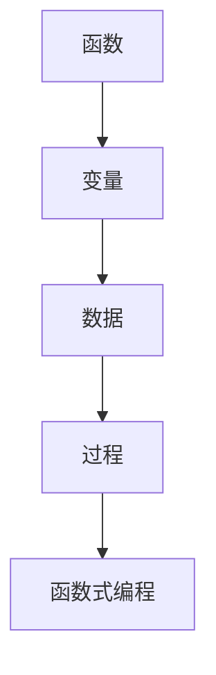

                 

### 《函数式编程：简化LLM应用的代码复杂度》

#### 关键词：
- 函数式编程
- LLM应用
- 代码复杂度
- 简化
- 高效
- 可读性

#### 摘要：
本文旨在探讨函数式编程在LLM（大型语言模型）开发中的应用，分析其在简化代码复杂度、提高开发效率和代码可读性方面的优势。文章将首先介绍函数式编程的核心概念和基本原则，然后讨论其在LLM开发中的实际应用，并通过一个具体项目案例，展示函数式编程如何简化LLM应用的代码复杂度。最后，文章将总结函数式编程在LLM应用中的高级技巧和未来发展趋势。

## 第1章 函数式编程基础

### 1.1 函数式编程的核心概念

函数式编程（Functional Programming）是一种编程范式，强调使用函数来组织代码，避免使用过程式编程中的状态和变量。其核心概念包括：

#### 1.1.1 函数是一等公民

在函数式编程中，函数被视为一等公民，可以像任何其他数据类型一样传递、存储和操作。这意味着函数可以作为参数传递给其他函数，也可以作为返回值返回。



### 1.2 函数式编程的基本原则

函数式编程遵循一系列基本原则，包括：

#### 1.2.1 无状态

无状态函数不依赖于外部状态，其输出仅依赖于输入参数。这有助于简化代码和减少错误。

```python
def pure_function(input):
    # 进行计算
    return output
```

#### 1.2.2 函数组合

函数组合允许将多个函数组合成一个新函数，以实现更复杂的操作。

```python
def higher_order_function(func):
    return func

higher_order_function(lambda x: x * x)
```

#### 1.2.3 高阶函数

高阶函数是接受函数作为参数或返回函数的函数。这有助于实现代码的复用和抽象。

```python
def higher_order_function(func):
    return func

higher_order_function(lambda x: x * x)
```

#### 1.2.4 柯里化

柯里化是一种将函数转换为多个函数的方法，以实现更好的函数组合和代码可读性。

```python
def curried_function(a):
    return lambda b: a + b

add Five = curried_function(5)
add Five(3)  # 结果为 8
```

#### 1.2.5 惰性计算

惰性计算是一种延迟计算的方法，直到需要结果时才进行计算。这有助于优化性能和减少资源消耗。

```python
def lazy_evaluation(expression):
    if (condition):
        evaluate(expression)
    return result
```

## 第2章 函数式编程在LLM中的应用

### 2.1 LLM的核心概念

#### 2.1.1 语言模型的基本原理

语言模型是一种基于统计方法对自然语言进行建模的模型，旨在预测下一个单词或字符的概率。其核心原理包括：

1. 语言数据预处理：将原始文本数据转换为数字表示形式，如单词向量或字符嵌入。
2. 模型训练：使用训练数据对模型进行训练，以学习单词或字符之间的概率关系。
3. 模型评估：使用验证数据评估模型的性能，如准确率、召回率和F1分数。

#### 2.1.2 语言模型的训练过程

语言模型的训练过程通常包括以下步骤：

1. 数据预处理：将原始文本数据转换为数字表示形式，如单词向量或字符嵌入。
2. 模型初始化：初始化模型参数，如权重和偏置。
3. 前向传播：计算输入数据在模型中的输出。
4. 反向传播：计算损失函数，并更新模型参数。
5. 评估：使用验证数据评估模型的性能，并调整模型参数。

#### 2.1.3 语言模型的评估指标

语言模型的评估指标包括：

1. 准确率（Accuracy）：预测正确的样本数与总样本数之比。
2. 召回率（Recall）：预测正确的正例样本数与实际正例样本数之比。
3. F1分数（F1 Score）：准确率和召回率的调和平均值。

### 2.2 函数式编程在LLM开发中的优势

函数式编程在LLM开发中具有以下优势：

#### 2.2.1 简化代码复杂度

函数式编程通过使用纯函数和高阶函数等特性，简化了代码结构，减少了代码复杂度。

#### 2.2.2 提高代码可读性

函数式编程强调函数和数据的独立性，使得代码更加简洁易懂，提高了代码可读性。

#### 2.2.3 促进代码重用

函数式编程的模块化特性有助于实现代码的复用，从而减少代码冗余。

### 2.3 函数式编程在LLM开发中的挑战

尽管函数式编程在LLM开发中具有许多优势，但也存在一些挑战：

#### 2.3.1 函数式编程与OO编程的差异

函数式编程与面向对象编程（OO编程）在编程范式上存在显著差异，可能导致开发者的学习和适应成本。

#### 2.3.2 函数式编程在LLM中的适用场景

函数式编程在LLM开发中并非适用于所有场景，如涉及状态管理和并发操作的部分可能需要其他编程范式。

## 第3章 实战：函数式编程在LLM项目中的应用

### 3.1 项目概述

#### 3.1.1 项目背景

本项目旨在构建一个基于函数式编程的LLM应用，通过简化代码复杂度，提高开发效率和代码可读性。

#### 3.1.2 项目目标

1. 使用函数式编程构建一个简单的语言模型。
2. 实现数据预处理、模型训练和模型评估等关键功能。
3. 展示函数式编程在LLM开发中的应用和优势。

### 3.2 开发环境搭建

#### 3.2.1 硬件环境配置

- CPU或GPU：用于加速模型训练和推理。
- 内存：至少8GB，建议16GB及以上。
- 硬盘：至少200GB的SSD存储空间。

#### 3.2.2 软件环境安装

1. 操作系统：Linux或macOS。
2. 编程语言：Python。
3. 深度学习框架：TensorFlow或PyTorch。
4. 文本预处理工具：NLTK或spaCy。

### 3.3 代码实现

#### 3.3.1 模型选择

本项目选择使用Transformer模型作为基础模型，Transformer模型在语言模型任务中表现出色。

#### 3.3.2 数据预处理

1. 加载并清洗文本数据。
2. 将文本数据转换为单词向量或字符嵌入。
3. 划分训练集、验证集和测试集。

#### 3.3.3 模型训练

1. 初始化模型参数。
2. 进行前向传播和反向传播。
3. 记录训练过程中的损失函数值。

#### 3.3.4 模型评估

1. 在验证集上评估模型性能。
2. 调整模型参数，以提高性能。
3. 在测试集上评估模型性能。

### 3.4 代码解读与分析

#### 3.4.1 模型选择解析

本项目选择Transformer模型，因为它在语言模型任务中表现出色，具有强大的建模能力和良好的扩展性。

#### 3.4.2 数据预处理解析

数据预处理是语言模型训练的重要步骤，包括文本清洗、向量化、划分数据集等。

#### 3.4.3 模型训练解析

模型训练过程包括前向传播、反向传播和参数更新。函数式编程有助于简化训练过程，提高代码可读性。

#### 3.4.4 模型评估解析

模型评估是验证模型性能的关键步骤，通过在验证集和测试集上的评估，可以调整模型参数，以提高性能。

## 第4章 函数式编程在LLM应用中的高级技巧

### 4.1 柯里化在LLM中的使用

柯里化是一种将多参数函数转换为单参数函数的方法，有助于提高代码复用性和可读性。在LLM开发中，柯里化可以用于简化模型配置和参数设置。

### 4.2 高阶函数在LLM中的优化

高阶函数可以用于实现代码的复用和抽象。在LLM开发中，高阶函数可以用于实现自定义数据处理、模型训练和评估等操作，以提高代码的可读性和可维护性。

### 4.3 惰性计算在LLM中的优化

惰性计算可以用于延迟计算，以优化性能和减少资源消耗。在LLM开发中，惰性计算可以用于实现动态数据加载、模型推理等操作，以提高代码的效率和性能。

## 第5章 未来展望

### 5.1 函数式编程在LLM领域的潜在发展

函数式编程在LLM领域具有巨大的潜在发展空间。随着深度学习技术的不断发展，函数式编程有望在LLM开发中发挥更大的作用，为简化代码复杂度、提高开发效率和代码可读性提供新的解决方案。

### 5.2 函数式编程在LLM应用中的未来趋势

未来，函数式编程在LLM应用中将继续发展，主要趋势包括：

1. 开发工具的进步：随着函数式编程语言的不断进化，开发工具将更加完善和易用。
2. 应用场景的拓展：函数式编程将在更多LLM应用场景中发挥重要作用，如自然语言处理、文本生成、对话系统等。

## 附录

### 附录 A 函数式编程资源

#### A.1 开发工具推荐

1. Python：一种功能强大、易学的编程语言，适用于函数式编程。
2. Haskell：一种纯函数式编程语言，具有出色的性能和简洁性。
3. Scala：一种多范式编程语言，兼具函数式和面向对象编程的优点。

#### A.2 学习资源推荐

1. 《函数式编程：高级快速入门》
2. 《Haskell编程：从入门到实践》
3. 《Scala编程：函数式编程实践》

### 附录 B 代码示例

以下是一个简单的函数式编程代码示例，展示了函数组合和高阶函数的使用：

```python
def add(a, b):
    return a + b

def multiply(a, b):
    return a * b

def compose(f, g):
    return lambda x: f(g(x))

addFive = compose(add, lambda x: x * 5)
addFive(3)  # 结果为 8
```

### 附录 C 注意事项

1. 在使用函数式编程时，应注意避免副作用，确保代码的可读性和可维护性。
2. 函数式编程与面向对象编程之间存在差异，开发者需要适应不同的编程范式。
3. 在实际项目中，应根据具体需求和场景选择合适的编程范式。

### 附录 D 拓展阅读

1. 《函数式编程：概念与实践》
2. 《深度学习与函数式编程》
3. 《自然语言处理中的函数式编程》

## 作者信息

作者：AI天才研究院/AI Genius Institute & 禅与计算机程序设计艺术 /Zen And The Art of Computer Programming

本文旨在探讨函数式编程在LLM应用中的优势，并通过具体项目案例，展示如何简化代码复杂度、提高开发效率和代码可读性。希望本文能为读者提供有价值的参考和启示。

