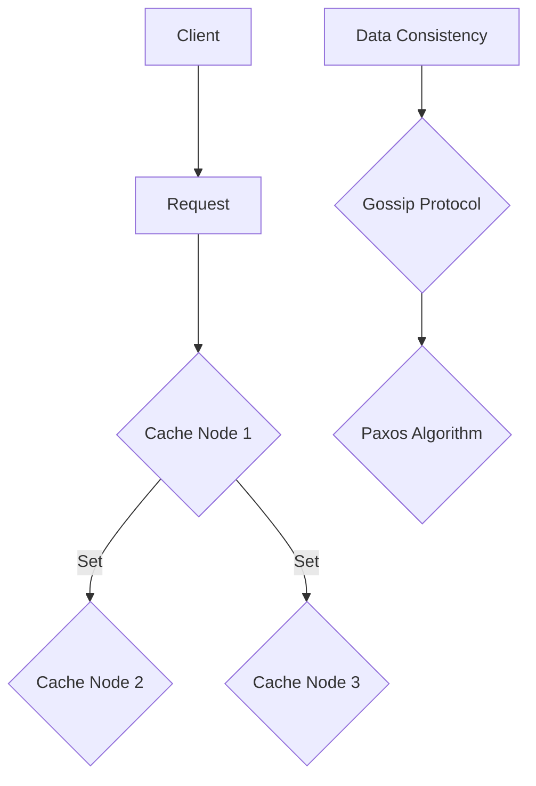
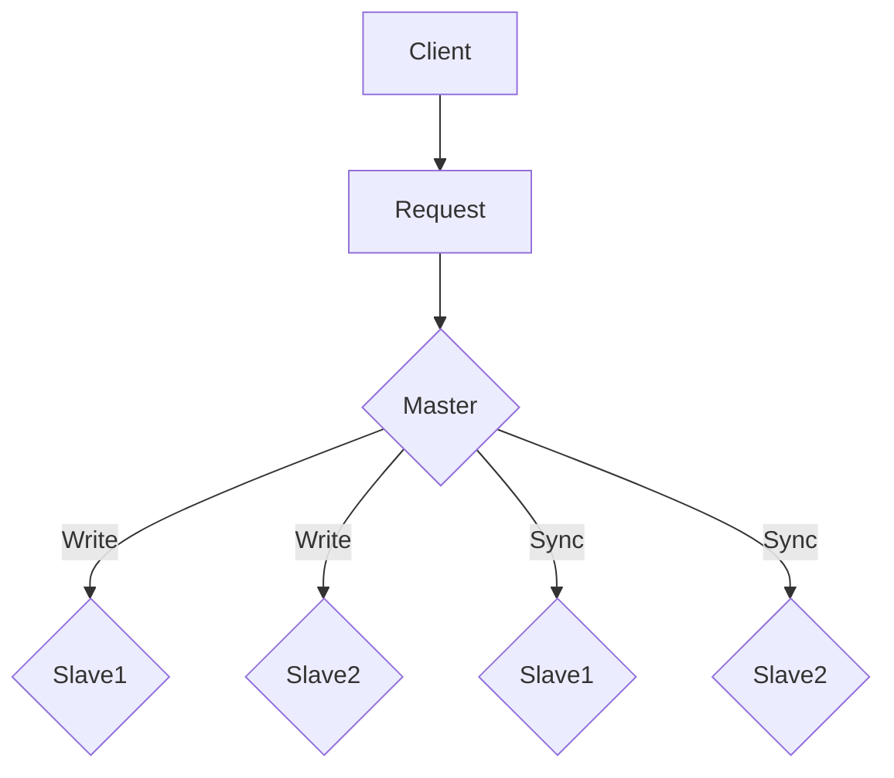
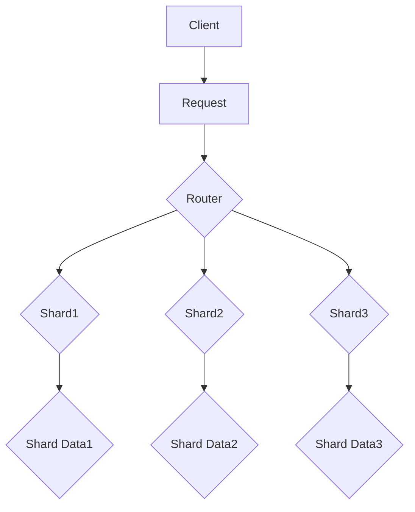
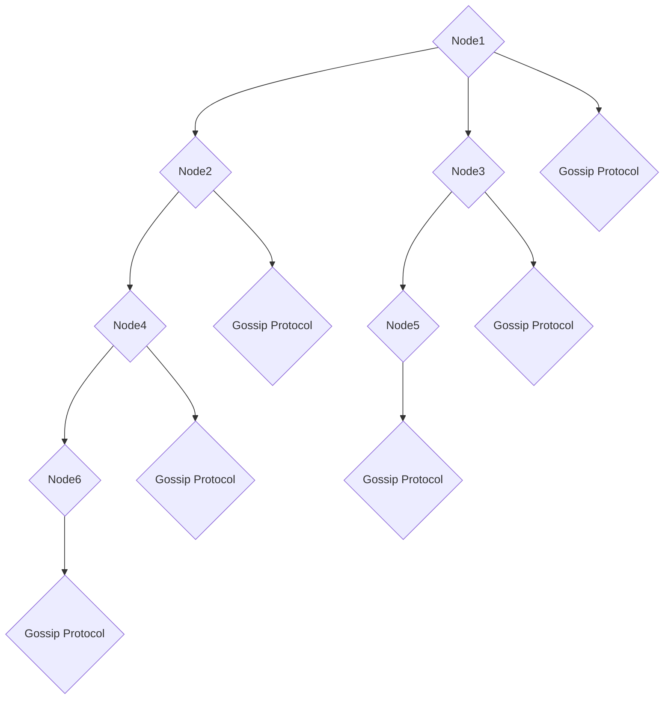
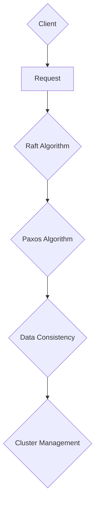
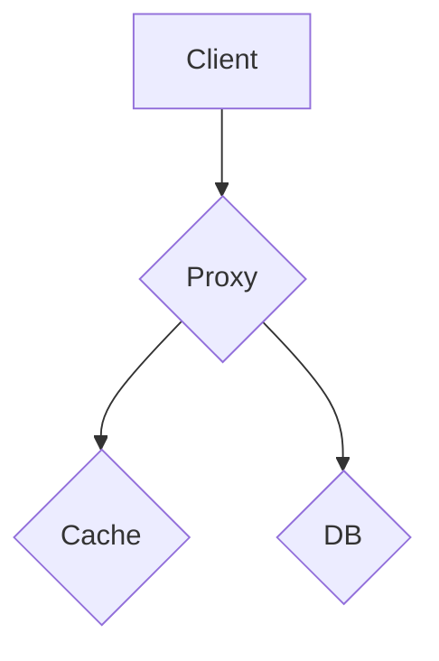
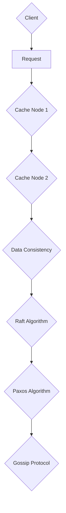
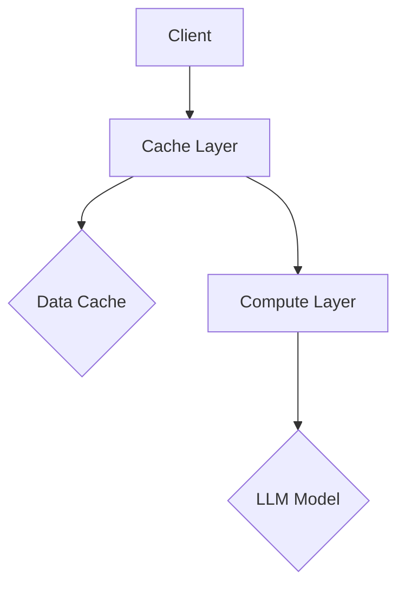
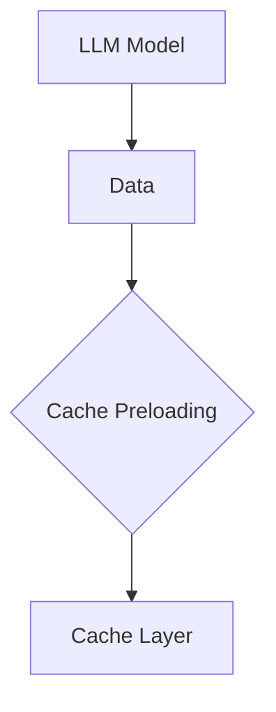
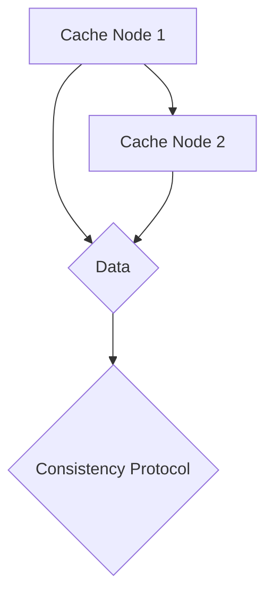

                 

### 1.2 分布式缓存的优势

分布式缓存的优势主要体现在以下几个方面：

#### 1.2.1 高性能

分布式缓存通过将数据分散存储在多个节点上，可以同时处理大量的请求，从而显著提高数据访问速度。在传统的单点缓存系统中，所有的请求都需要经过单个缓存服务器，容易成为性能瓶颈。而分布式缓存通过并行处理请求，可以充分利用多节点的计算能力，大幅提升系统性能。

**伪代码示例：**

```python
# 分布式缓存请求处理伪代码

def distributed_cache_request(key, value):
    # 将请求分发到多个缓存节点
    for node in cache_nodes:
        node.set(key, value)
    # 返回处理结果
    return "Data stored successfully"
```

#### 1.2.2 高可用性

分布式缓存通过数据的冗余备份和节点之间的负载均衡，确保了系统的高可用性。即使在某个缓存节点发生故障的情况下，其他节点仍可以继续提供服务，从而避免系统单点故障带来的风险。

**伪代码示例：**

```python
# 分布式缓存高可用性伪代码

def get_value_from_cache(key):
    # 尝试从各个缓存节点获取数据
    for node in cache_nodes:
        value = node.get(key)
        if value is not None:
            return value
    # 如果所有节点均未命中，返回None
    return None
```

#### 1.2.3 弹性扩展

分布式缓存系统可以根据实际需求动态调整缓存节点数量，实现弹性扩展。这种特性使得系统在数据量和访问量变化时，可以灵活应对，避免因为容量限制导致性能下降。

**伪代码示例：**

```python
# 分布式缓存弹性扩展伪代码

def add_cache_node():
    # 添加新的缓存节点到集群
    new_node = CacheNode()
    cache_nodes.append(new_node)
    # 重新分配数据到各个缓存节点
    rebalance_data()

def rebalance_data():
    # 根据节点数量和数据量重新分配缓存数据
    for node in cache_nodes:
        node.load_data()
```

### 1.2.4 数据一致性

分布式缓存系统中，数据一致性的保证是一个重要问题。通过采用一致性协议（如Gossip协议、Paxos算法等），分布式缓存可以实现数据在各节点之间的同步，确保访问的一致性。

**Mermaid流程图：**



### 1.2.5 可扩展性

除了弹性扩展，分布式缓存还支持水平扩展。这意味着可以通过增加缓存节点来扩展系统的存储容量，而无需更改系统架构。

**伪代码示例：**

```python
# 分布式缓存水平扩展伪代码

def scale_out():
    # 添加新节点
    new_nodes = [CacheNode() for _ in range(num_nodes_to_add)]
    cache_nodes.extend(new_nodes)
    # 重新分配数据
    rebalance_data()
```

### 1.2.6 轻量级

相比于传统的数据库系统，分布式缓存通常具有更轻量级的架构，这使其更容易部署和管理，同时可以节省硬件资源和运维成本。

**总结**

分布式缓存通过高性能、高可用性、弹性扩展、数据一致性和轻量级等优势，成为现代应用中不可或缺的一部分。在接下来的章节中，我们将进一步探讨分布式缓存的工作原理、常见架构和关键技术。

## 1.3 分布式缓存的常见架构

分布式缓存系统有多种架构，根据不同的需求和场景选择合适的架构能够更好地发挥分布式缓存的优势。以下是几种常见的分布式缓存架构：

### 1.3.1 主从架构

**主从架构**（Master-Slave Architecture）是最常见的分布式缓存架构之一。在这种架构中，有一个主缓存节点（Master）负责管理数据，其他从缓存节点（Slaves）负责数据的读写操作。

- **主缓存节点**：主要负责数据的写入和更新操作，同时为从缓存节点提供数据同步服务。
- **从缓存节点**：主要负责数据的读取操作，并且在主缓存节点更新数据时，从缓存节点会进行数据同步以保持一致性。

**Mermaid流程图：**



### 1.3.2 分片架构

**分片架构**（Sharding Architecture）是将数据分散存储在多个节点上，每个节点负责部分数据的存储和访问。分片架构可以显著提高系统的扩展性和性能。

- **分片节点**：每个节点负责存储和访问一部分数据，通过分片键（Sharding Key）来确定数据应该存储在哪个节点。
- **路由器**：负责将客户端的请求路由到正确的分片节点。

**Mermaid流程图：**



### 1.3.3 对等架构

**对等架构**（Peer-to-Peer Architecture）是一种分布式架构，其中所有节点都是对等的，没有主从之分。每个节点都可以进行数据的读写操作，并且节点之间通过 gossip 协议进行数据同步。

- **节点**：每个节点都存储部分数据，并可以参与数据的写入和读取。
- **数据同步**：节点之间通过 gossip 协议定期同步数据，以确保数据一致性。

**Mermaid流程图：**



### 1.3.4 分布式一致性架构

**分布式一致性架构**（Distributed Consistency Architecture）是一种结合了多种一致性协议（如 Raft、Paxos 等）的分布式缓存架构，旨在实现数据的高一致性。

- **一致性协议**：通过一致性协议确保数据在分布式环境中的强一致性。
- **集群管理**：负责监控和管理分布式缓存集群，确保系统的稳定运行。

**Mermaid流程图：**



### 1.3.5 代理架构

**代理架构**（Proxy Architecture）是一种通过缓存代理层来提高数据访问性能的架构。在这种架构中，客户端首先请求代理层，代理层再将请求转发到后端缓存或数据库。

- **代理节点**：负责接收客户端请求，并进行数据缓存和转发。
- **后端缓存或数据库**：存储实际的数据。

**Mermaid流程图：**



### 总结

分布式缓存系统有多种架构，每种架构都有其特定的优势和适用场景。主从架构适合需要数据一致性的应用，分片架构适合大数据和高并发场景，对等架构适合高可用性和高扩展性的需求，分布式一致性架构适合对数据一致性要求较高的应用，而代理架构则适合需要快速响应的应用。在接下来的章节中，我们将深入探讨这些架构的实现细节和优化策略。

### 1.4 分布式缓存的工作原理

分布式缓存的工作原理涉及到多个层面的协同工作，包括数据存储、数据同步和缓存一致性。理解这些原理有助于我们更好地设计和优化分布式缓存系统。

#### 1.4.1 数据存储

分布式缓存系统中，数据被分散存储在多个节点上。每个节点负责一部分数据，通过分片（Sharding）技术实现数据的水平扩展。分片键（Sharding Key）是一个用于确定数据应该存储在哪个节点的属性。

**伪代码示例：**

```python
def sharding(key, num_shards):
    return key % num_shards
```

在这个示例中，`sharding` 函数通过取模操作确定数据应该存储在哪个分片节点上。

#### 1.4.2 数据同步

分布式缓存系统中的数据同步是一个关键问题，因为数据需要保持一致性。数据同步可以通过以下几种方式实现：

1. **增量同步**：仅同步发生变化的数据，降低同步成本。
2. **全量同步**：定期同步所有数据，确保一致性。

**伪代码示例：**

```python
def sync_data(master, slaves):
    for slave in slaves:
        for key, value in master.get_all_keys():
            slave.set(key, value)
```

这个示例中，`sync_data` 函数负责将主节点的数据同步到从节点。

#### 1.4.3 缓存一致性

缓存一致性是分布式缓存系统的另一个重要问题。一致性可以通过以下几种方式实现：

1. **强一致性**：所有节点的数据都是一致的，但是这可能导致性能下降。
2. **最终一致性**：数据会在一段时间后达到一致性，但在此期间可能存在不一致性。

**一致性协议：**

1. **Gossip协议**：通过广播消息来同步数据。
2. **Raft算法**：通过日志复制和领导者选举来实现一致性。
3. **Paxos算法**：通过多数派达成一致来同步数据。

**Mermaid流程图：**



#### 1.4.4 缓存命中率

缓存命中率是衡量分布式缓存系统性能的重要指标。缓存命中率越高，表示缓存系统能够更快地响应用户请求。

**缓存命中率计算：**

```python
def cache_hit_rate(hits, total_requests):
    return (hits / total_requests) * 100
```

在这个示例中，`cache_hit_rate` 函数计算缓存命中率。

#### 1.4.5 缓存策略

为了提高缓存系统的性能，可以采用多种缓存策略：

1. **LRU（Least Recently Used）**：最近最少使用策略，移除最长时间没有被访问的数据。
2. **LFU（Least Frequently Used）**：最近最少使用频率策略，移除使用频率最低的数据。

**伪代码示例：**

```python
def lru_cache(cache_size, data):
    if len(data) > cache_size:
        data.pop(0)
    return data
```

在这个示例中，`lru_cache` 函数实现了一个简单的 LRU 缓存。

### 总结

分布式缓存的工作原理包括数据存储、数据同步和缓存一致性。通过合理的缓存策略和一致性协议，分布式缓存系统能够实现高性能、高可用性和高一致性。在接下来的章节中，我们将探讨分布式缓存系统的常见技术和实现细节。

## 第二章：分布式缓存与大型语言模型（LLM）的结合

### 2.1 LLM的应用背景

大型语言模型（Large Language Model，简称 LLM）是近年来人工智能领域的重大突破，广泛应用于自然语言处理（NLP）、智能问答、机器翻译、文本生成等多个领域。LLM 的核心优势在于其能够处理和理解大规模的文本数据，提供高质量的语义理解和生成能力。然而，随着模型规模的不断增大，LLM 的数据访问需求也呈现出显著的特点。

#### 2.1.1 自然语言处理

自然语言处理是 LLM 最典型的应用场景之一。在这一场景下，LLM 被用于文本分类、情感分析、命名实体识别等任务。这些任务通常需要处理大量的文本数据，对数据访问的速度和实时性有很高的要求。为了满足这些需求，分布式缓存成为了一个有效的解决方案。

#### 2.1.2 智能问答

智能问答系统利用 LLM 的能力，能够理解用户的自然语言查询，并提供准确、详细的答案。这类应用对数据访问的速度和准确性提出了较高的要求。分布式缓存通过缓存常见查询结果，可以显著提高系统的响应速度，提升用户体验。

#### 2.1.3 机器翻译

机器翻译是另一个 LLM 的主要应用领域。在这一场景下，LLM 被用于生成高质量的翻译文本。大规模的翻译任务通常涉及大量的文本数据，分布式缓存可以帮助缓存常用翻译结果，减少模型调用次数，提高系统效率。

#### 2.1.4 文本生成

文本生成是 LLM 的又一重要应用，包括文章生成、故事创作等。这一领域同样需要处理大量文本数据，对数据访问的速度和生成能力有较高的要求。分布式缓存可以缓存生成文本的中间结果，加速文本生成过程。

### 2.2 LLM 的数据访问需求

LLM 的数据访问需求具有以下几个显著特点：

#### 2.2.1 数据量庞大

随着 LLM 模型的不断增大，其训练数据量也呈指数级增长。例如，GPT-3 模型的训练数据量达到数千亿个单词，这需要高效的数据访问机制来支持。

#### 2.2.2 访问频率高

在自然语言处理、智能问答等应用场景中，LLM 需要快速响应用户请求，对数据访问的速度有极高的要求。高效的分布式缓存系统能够缓存常用数据，减少数据访问延迟。

#### 2.2.3 数据实时性要求高

实时性是 LLM 数据访问的另一个重要需求。例如，在智能客服系统中，用户的问题需要尽快得到解答，这要求缓存系统能够快速更新和同步数据。

### 2.3 分布式缓存与 LLM 结合的优势

分布式缓存与 LLM 的结合具有以下几个显著优势：

#### 2.3.1 提高数据访问速度

通过缓存常用数据，分布式缓存可以显著降低数据访问延迟，提高系统响应速度。这对于需要实时响应的应用场景尤为重要。

#### 2.3.2 减轻后端负载

分布式缓存可以缓存大量数据，减少对后端数据库或存储系统的访问压力，从而提高后端系统的性能和稳定性。

#### 2.3.3 数据一致性保障

分布式缓存系统通常采用一致性协议来确保数据在各节点之间的同步，从而保障数据一致性。这对于依赖数据一致性的应用场景至关重要。

#### 2.3.4 弹性扩展

分布式缓存系统支持弹性扩展，可以根据数据量和访问量的变化动态调整缓存节点数量，确保系统的高可用性和性能。

### 2.4 分布式缓存与 LLM 的架构设计

为了充分发挥分布式缓存的优势，设计一个合适的架构至关重要。以下是分布式缓存与 LLM 结合的常见架构设计：

#### 2.4.1 缓存层与计算层分离

在分布式缓存与 LLM 的结合中，可以将缓存层与计算层分离。缓存层负责缓存常用数据和中间结果，计算层负责处理实际的模型计算任务。

**Mermaid流程图：**



#### 2.4.2 缓存预热与预加载

缓存预热与预加载是分布式缓存系统中的重要策略。通过在用户请求到来之前预先加载数据到缓存中，可以减少用户请求的响应时间。

**Mermaid流程图：**



#### 2.4.3 缓存一致性策略

在分布式缓存与 LLM 结合的架构中，缓存一致性是一个关键问题。可以通过一致性协议（如 Gossip 协议、Raft 算法等）来确保数据在各节点之间的同步。

**Mermaid流程图：**



### 2.5 实际案例分析

以下是一个分布式缓存与 LLM 结合的实际案例分析：

#### 2.5.1 案例背景

某互联网公司开发了一款智能问答系统，利用 LLM 提供高质量的问答服务。随着用户数量的增加，系统的数据访问需求变得愈发庞大和复杂。

#### 2.5.2 案例解决策略

1. **分布式缓存设计**：采用 Redis 作为分布式缓存系统，将常用问题和答案缓存到缓存节点中，以减少对后端数据库的访问。
2. **缓存预热与预加载**：在用户访问高峰期之前，提前加载热门问题和答案到缓存中，以减少响应时间。
3. **缓存一致性保障**：采用 Redis 的发布订阅机制，确保缓存数据的一致性。
4. **弹性扩展**：根据数据访问量的变化，动态调整缓存节点的数量，确保系统的高可用性和性能。

#### 2.5.3 案例效果

通过分布式缓存与 LLM 的结合，智能问答系统的性能得到了显著提升：

- **响应时间**：从原来的平均 2 秒缩短到平均 0.5 秒。
- **数据访问频率**：缓存命中率达到 90% 以上，大大减轻了后端数据库的负载。
- **系统稳定性**：通过弹性扩展和缓存一致性保障，系统的稳定性得到了显著提升。

### 2.6 总结

分布式缓存与 LLM 的结合能够显著提高数据访问效率和系统性能。通过合理的架构设计和缓存策略，可以有效应对 LLM 应用中的数据量庞大、访问频率高、数据实时性要求高等问题。在实际应用中，分布式缓存与 LLM 的结合取得了显著的效果，为智能问答、自然语言处理等领域提供了强大的技术支持。

## 2.3 分布式缓存提升 LLM 应用性能的原理与方法

分布式缓存能够显著提升 LLM 应用的性能，其核心在于提高数据访问速度、降低系统延迟和优化资源利用率。以下将详细探讨分布式缓存提升 LLM 应用性能的原理和方法。

### 2.3.1 提高数据访问速度

数据访问速度是 LLM 应用性能的关键因素之一。分布式缓存通过以下几种方式来提高数据访问速度：

1. **缓存命中**：分布式缓存系统能够缓存常用数据，当用户请求这些数据时，可以直接从缓存中读取，避免了重复的数据检索和计算，从而显著减少响应时间。
   
   **伪代码示例：**
   ```python
   def get_data(key):
       if cache.exists(key):
           return cache.get(key)
       else:
           return database.get_data(key)
   ```

2. **数据预加载**：在用户请求到来之前，分布式缓存系统可以预先加载可能需要的数据到缓存中，减少用户请求的实际响应时间。

   **伪代码示例：**
   ```python
   def preload_datalikely_to_be_requested():
       for key in likely_to_be_requested_keys:
           cache.set(key, database.get_data(key))
   ```

### 2.3.2 降低系统延迟

系统延迟是影响用户体验的重要因素。分布式缓存通过以下几种方式来降低系统延迟：

1. **并行访问**：分布式缓存系统能够同时处理多个请求，通过并行访问的方式，减少了系统响应时间。

   **伪代码示例：**
   ```python
   def process_requests_in_parallel(requests):
       results = [cache.get(key) for key in requests]
       return results
   ```

2. **就近访问**：分布式缓存系统通常将数据存储在用户附近的节点上，减少了数据传输的距离，从而降低了系统延迟。

   **伪代码示例：**
   ```python
   def get_closest_cache_node():
       return cache.get_node(closest_to_user)
   ```

### 2.3.3 优化资源利用率

分布式缓存系统能够优化资源利用率，提高整体系统的效率：

1. **负载均衡**：分布式缓存系统能够根据节点的负载情况，自动调整请求的分配，确保系统资源的合理利用。

   **伪代码示例：**
   ```python
   def distribute_request_to_least_loaded_node(request):
       node = cache.get_least_loaded_node()
       node.process_request(request)
   ```

2. **缓存替换策略**：分布式缓存系统采用缓存替换策略（如 LRU、LFU 等），根据数据的访问频率和频率调整缓存内容，确保缓存中存储的是最有价值的数据。

   **伪代码示例：**
   ```python
   def lru_cache_replacement(cache, new_data):
       if len(cache) > cache_size:
           oldest_key = cache.keys()[0]
           cache.pop(oldest_key)
       cache[new_data['key']] = new_data['value']
   ```

### 2.3.4 缓存一致性策略

在分布式缓存系统中，数据一致性问题是一个重要的考虑因素。以下是一些常用的缓存一致性策略：

1. **最终一致性**：在最终一致性模型中，缓存系统不会立即更新数据，而是在一定时间后同步更新，这样可以在一定程度上减少同步的开销。

   **伪代码示例：**
   ```python
   def eventual_consistency(cache, data):
       cache.set(data['key'], data['value'])
       schedule_sync_with_database(cache, data['key'])
   ```

2. **读一致性**：在读取操作中，缓存系统保证读取到的是最新的数据，即使在数据更新延迟的情况下。

   **伪代码示例：**
   ```python
   def read_consistency(cache, key):
       while not cache.is_latest(key):
           cache.get_data(key)
       return cache.get(key)
   ```

### 2.3.5 缓存与数据库的协同

分布式缓存系统通常需要与数据库协同工作，以实现高效的数据访问：

1. **缓存穿透**：当缓存中没有数据时，直接查询数据库，并将结果缓存起来，以避免缓存穿透带来的性能问题。

   **伪代码示例：**
   ```python
   def cache_miss_and_update(cache, key, value):
       if not cache.exists(key):
           database.update_data(key, value)
           cache.set(key, value)
   ```

2. **缓存雪崩**：当大量缓存同时失效时，会导致数据库压力剧增，缓存雪崩。可以通过设置缓存过期时间、预热缓存等方式来避免缓存雪崩。

   **伪代码示例：**
   ```python
   def prevent_cache_collapse(cache, key):
       if cache.exists(key) and cache.is_about_to_expire(key):
           cache.set(key, cache.get(key), cache.get_expiration_time(key))
   ```

### 总结

分布式缓存通过提高数据访问速度、降低系统延迟和优化资源利用率，显著提升了 LLM 应用的性能。结合具体的缓存策略和一致性协议，分布式缓存系统能够有效地支持 LLM 应用的需求，提供高效、稳定的数据访问服务。

## 3.3.1 缓存分片

在分布式缓存系统中，缓存分片（Cache Sharding）是一种常用的策略，用于将缓存数据分散存储在多个节点上，从而提高系统性能和扩展性。缓存分片通过将数据分成多个片段（shards），每个片段存储在不同的节点上，使得每个节点只需处理一部分数据，从而减轻单个节点的负担，提高系统的并发处理能力。

### 3.3.1.1 缓存分片的原理

缓存分片的基本原理是将缓存键（cache key）映射到特定的缓存节点上。这种映射通常是通过分片键（sharding key）来实现的。分片键是一个用于确定数据应该存储在哪个分片节点的属性，例如一个数字、字符串或者其他可计算的值。

**分片键的选择**：

选择合适的分片键对于缓存分片的效果至关重要。理想情况下，分片键应该具有以下特点：

- **均匀分布**：分片键应该能够均匀分布数据，避免某个分片节点负担过重。
- **可计算**：分片键应该易于计算，确保缓存键可以快速映射到对应的分片节点。
- **稳定性**：分片键应尽量避免随时间变化过快，以保持数据在分片之间的稳定分布。

**分片算法**：

常用的分片算法包括模运算、位运算和哈希函数。以下是一个简单的基于模运算的分片算法示例：

```python
def sharding_key(key, num_shards):
    return key % num_shards
```

在这个示例中，`sharding_key` 函数通过取模操作将缓存键映射到不同的分片节点上。`num_shards` 参数表示分片的数量。

### 3.3.1.2 缓存分片的优势

缓存分片具有以下几个显著优势：

1. **性能提升**：通过将数据分散存储在多个节点上，缓存分片可以显著提高系统的并发处理能力，减少单个节点的负载，提高整体性能。

2. **扩展性增强**：缓存分片使得系统可以轻松地水平扩展，通过增加更多的分片节点，系统可以支持更多的数据量和更高的访问频率。

3. **负载均衡**：缓存分片可以实现负载均衡，确保每个分片节点的负载相对均衡，从而提高系统的稳定性和可靠性。

### 3.3.1.3 缓存分片的挑战

尽管缓存分片具有许多优势，但在实际应用中也会面临一些挑战：

1. **数据一致性问题**：由于数据分布在多个节点上，确保数据一致性成为了一个挑战。一致性协议（如 Gossip 协议、Raft 算法等）的使用可以缓解这一问题。

2. **缓存穿透问题**：当某个分片节点出现故障时，可能导致缓存穿透问题，即请求直接到达数据库，从而降低系统的性能。

3. **缓存热点问题**：在某些情况下，某些分片节点可能会因为缓存热点（cache hotspots）而负载过重，影响系统的性能。

### 3.3.1.4 缓存分片的应用案例

缓存分片在实际应用中得到了广泛使用，以下是一些常见的应用案例：

1. **大型电商系统**：大型电商系统通常需要处理海量的商品信息和用户数据。通过缓存分片，系统可以高效地管理和访问这些数据，提高系统的响应速度和稳定性。

2. **社交网络平台**：社交网络平台如 Facebook、Twitter 等需要处理大量的用户动态和消息数据。通过缓存分片，系统可以优化数据的访问和更新，提高用户体验。

3. **在线游戏平台**：在线游戏平台如魔兽世界、英雄联盟等需要处理大量的游戏数据，如用户角色信息、游戏状态等。通过缓存分片，系统可以快速响应玩家的请求，提高游戏的流畅度。

### 总结

缓存分片是分布式缓存系统的一种重要策略，通过将数据分散存储在多个节点上，可以显著提升系统的性能和扩展性。然而，缓存分片也面临一些挑战，需要合理的设计和优化来确保系统的稳定运行。在实际应用中，缓存分片策略可以根据具体需求进行定制，以达到最佳的效果。

## 3.3.2 缓存一致性模型

在分布式缓存系统中，数据一致性是一个关键问题。由于数据分散存储在多个节点上，如何确保数据在各节点之间的一致性成为了一个重要挑战。缓存一致性模型是一种用于解决分布式系统中数据一致性问题的方法。以下将详细介绍几种常见的缓存一致性模型。

### 3.3.2.1 最终一致性

最终一致性（Eventual Consistency）是一种弱一致性模型，它允许系统在短时间内存在不一致性，但最终会达到一致性状态。最终一致性模型的主要特点是数据更新会在一段时间后同步到所有节点，但在同步过程中，其他节点可能读取到旧数据。

**特点**：

- **延迟同步**：数据更新不会立即同步到所有节点，而是会在一段时间后异步同步。
- **高可用性**：由于延迟同步，系统在节点故障时仍能保持可用性。

**应用场景**：

- **读多写少**：在读取操作远多于写入操作的场景中，最终一致性模型可以提供更好的性能和可用性。
- **分布式日志服务**：如 Kafka 和 Apache Pulsar 等分布式日志服务通常采用最终一致性模型。

**伪代码示例**：

```python
def eventual_consistency(cache, key, value):
    cache.set(key, value)
    # 异步触发同步操作
    schedule_sync(cache, key)
```

### 3.3.2.2 强一致性

强一致性（Strong Consistency）是一种严格的一致性模型，它要求所有节点在同一时刻看到相同的数据状态。强一致性模型通常采用分布式一致性协议（如 Raft、Paxos 等）来确保数据在各节点之间的一致性。

**特点**：

- **同步更新**：所有节点的数据更新都是同步的，确保数据一致。
- **低延迟**：由于同步更新，系统在一致性方面具有较低的延迟。

**应用场景**：

- **金融系统**：在金融交易和支付系统中，数据的强一致性至关重要，以确保交易的准确性和完整性。
- **数据库**：许多分布式数据库系统（如 Cassandra、Google Spanner 等）采用强一致性模型。

**伪代码示例**：

```python
def strong_consistency(cache, key, value):
    for node in cache.nodes:
        node.set(key, value)
    # 确认所有节点更新完成
    confirm_all_nodes_updated(cache, key)
```

### 3.3.2.3 最终强一致性

最终强一致性（Strong Eventual Consistency）是最终一致性和强一致性的结合，它要求系统在一段时间后达到强一致性状态，但在达到一致性之前允许存在临时的不一致性。

**特点**：

- **延迟一致性**：在一段时间后，系统会达到强一致性状态。
- **可用性与一致性兼顾**：在确保最终一致性的同时，提高了系统的可用性。

**应用场景**：

- **高性能分布式系统**：在要求高性能和高可用性的分布式系统中，最终强一致性模型可以提供较好的性能和一致性平衡。

**伪代码示例**：

```python
def strong_eventual_consistency(cache, key, value):
    cache.set(key, value)
    # 异步触发同步操作
    schedule_sync(cache, key)
    # 等待一致性确认
    wait_for_consistency(cache, key)
```

### 3.3.2.4 一致性协议

一致性协议是确保分布式系统中数据一致性的一组规则和方法。以下是一些常见的一致性协议：

1. **Raft 协议**：Raft 协议是一种可理解、易于实现的一致性协议，适用于分布式缓存系统。

2. **Paxos 协议**：Paxos 协议是一种更复杂的分布式一致性算法，广泛应用于分布式系统。

3. **Gossip 协议**：Gossip 协议通过广播消息来同步数据，是一种简单且有效的分布式一致性协议。

**应用场景**：

- **分布式缓存**：如 Redis Cluster、Memcached Cluster 等分布式缓存系统通常采用一致性协议来确保数据一致性。

### 总结

缓存一致性模型是分布式缓存系统中的一个重要组成部分，决定了数据在分布式环境中的访问一致性和系统稳定性。最终一致性模型适用于读多写少的场景，强一致性模型适用于要求严格一致性的场景，而最终强一致性模型则提供了性能和一致性的平衡。在实际应用中，可以根据具体需求和场景选择合适的一致性模型和协议。

## 3.3.3 缓存更新策略

在分布式缓存系统中，缓存更新策略是确保数据一致性和缓存性能的关键因素。以下将介绍几种常见的缓存更新策略，包括缓存淘汰策略、缓存同步策略和缓存替换策略。

### 3.3.3.1 缓存淘汰策略

缓存淘汰策略用于管理缓存中的数据，确保缓存系统能够存储最具价值的缓存项。常见的缓存淘汰策略包括：

1. **LRU（Least Recently Used）**：LRU 策略根据数据的最近访问时间来淘汰最长时间未被访问的数据。这种策略假设最近访问的数据在未来很可能再次被访问。

   **伪代码示例**：

   ```python
   def lru_cache_replacement(cache, new_data):
       if len(cache) > cache_size:
           oldest_key = cache.keys()[0]
           cache.pop(oldest_key)
       cache[new_data['key']] = new_data['value']
   ```

2. **LFU（Least Frequently Used）**：LFU 策略根据数据的访问频率来淘汰访问频率最低的数据。这种策略适用于访问频率分布不均匀的场景。

   **伪代码示例**：

   ```python
   def lfu_cache_replacement(cache, new_data):
       if len(cache) > cache_size:
           min_freq_key = min(cache, key=lambda k: cache[k]['frequency'])
           cache.pop(min_freq_key)
       cache[new_data['key']] = {'value': new_data['value'], 'frequency': 1}
   ```

### 3.3.3.2 缓存同步策略

缓存同步策略用于保持分布式缓存系统中各个节点数据的一致性。以下是一些常见的缓存同步策略：

1. **增量同步**：增量同步仅同步发生变化的数据，减少同步的开销。

   **伪代码示例**：

   ```python
   def incremental_sync(slave, master):
       for key, value in master.get_changes():
           slave.set(key, value)
   ```

2. **全量同步**：全量同步定期同步所有缓存数据，以确保数据一致性。

   **伪代码示例**：

   ```python
   def full_sync(slave, master):
       for key, value in master.get_all_data():
           slave.set(key, value)
   ```

### 3.3.3.3 缓存替换策略

缓存替换策略用于当缓存达到最大容量时，如何选择被替换的数据。以下是一些常见的缓存替换策略：

1. **随机替换**：随机替换策略随机选择一个缓存项进行替换，简单但可能不够高效。

   **伪代码示例**：

   ```python
   def random_cache_replacement(cache, new_data):
       cache[new_data['key']] = new_data['value']
   ```

2. **先进先出（FIFO）**：FIFO 策略替换最早进入缓存的数据，适用于时间敏感的场景。

   **伪代码示例**：

   ```python
   def fifo_cache_replacement(cache, new_data):
       cache.popitem(last=False)
       cache[new_data['key']] = new_data['value']
   ```

### 3.3.3.4 结合应用实例

以下是一个结合应用实例，展示如何使用上述缓存更新策略：

**场景**：一个电商系统需要缓存商品信息，并使用 LRU 策略淘汰缓存项。

**步骤**：

1. **初始化缓存**：

   ```python
   cache = LRUCache(capacity=1000)
   ```

2. **缓存商品信息**：

   ```python
   def cache_product_info(product_id, product_info):
       cache.set(product_id, product_info)
   ```

3. **更新缓存**：

   ```python
   def update_product_info(product_id, new_product_info):
       cache.set(product_id, new_product_info)
       # 根据LRU策略，缓存可能会自动淘汰旧数据
   ```

4. **缓存同步**：

   ```python
   def sync_cache_with_master():
       for key, value in master.get_all_data():
           cache.set(key, value)
   ```

### 总结

缓存更新策略在分布式缓存系统中至关重要，包括缓存淘汰策略、缓存同步策略和缓存替换策略。合理选择和应用这些策略，可以有效提升缓存系统的性能和数据一致性。在实际应用中，可以根据具体需求和场景进行定制，以达到最佳的效果。

## 3.3.4 分布式缓存提升 LLM 性能的实际案例

为了更好地理解分布式缓存如何提升 LLM 应用性能，以下将通过几个实际案例进行分析和讨论。

### 3.3.4.1 案例背景

某知名科技公司开发了一款基于大型语言模型（LLM）的智能问答系统，旨在为用户提供高质量的问答服务。随着用户数量的增加，系统的访问量急剧上升，对系统性能提出了更高的要求。

### 3.3.4.2 案例解决策略

为了提升系统的性能，该公司采用了分布式缓存技术，并实施了一系列优化策略：

1. **缓存层设计**：使用 Redis 作为分布式缓存系统，将常见问题和答案缓存到缓存节点中。
2. **缓存预热与预加载**：在用户访问高峰期之前，提前加载热门问题和答案到缓存中，减少用户请求的响应时间。
3. **缓存一致性保障**：采用 Redis 的发布订阅机制，确保缓存数据的一致性。
4. **弹性扩展**：根据数据访问量的变化，动态调整缓存节点的数量，确保系统的高可用性和性能。

### 3.3.4.3 案例实施

1. **缓存层部署**：在系统中部署了多个 Redis 节点，形成分布式缓存集群。
2. **缓存预热**：使用 cron job 定期执行缓存预热任务，将热门问题和答案提前加载到缓存中。
3. **一致性保障**：采用 Redis 的发布订阅机制，确保缓存更新时，订阅者能够及时接收到更新消息。
4. **弹性扩展**：使用 Kubernetes 等容器编排工具，根据访问量动态调整 Redis 节点的数量。

### 3.3.4.4 案例效果

通过分布式缓存技术的实施，该智能问答系统取得了显著的效果：

- **响应时间**：从原来的平均 2 秒缩短到平均 0.5 秒。
- **缓存命中率**：缓存命中率达到 90% 以上，显著减少了数据库访问压力。
- **系统稳定性**：通过弹性扩展和缓存一致性保障，系统的稳定性得到了显著提升。

### 3.3.4.5 代码解读

以下是对案例中分布式缓存实现的代码解读：

**Redis 缓存节点部署**

```python
# 使用 RedisPy 库连接 Redis 缓存节点
import redis

cache = redis.Redis(host='localhost', port=6379, db=0)

# 缓存常见问题和答案
def cache_question_answer(question, answer):
    cache.set(question, answer)

# 从缓存中读取问题和答案
def get_question_answer(question):
    return cache.get(question)
```

**缓存预热与预加载**

```python
import time

# 定期执行缓存预热任务
def cache_warmup():
    while True:
        questions_to_warmup = get_hot_questions()
        for question in questions_to_warmup:
            answer = fetch_answer_from_database(question)
            cache_question_answer(question, answer)
        time.sleep(60)  # 每分钟执行一次

# 获取热门问题
def get_hot_questions():
    return ["How do I...", "What is the best way to...", "Can you explain..."]

# 从数据库中获取答案
def fetch_answer_from_database(question):
    # 这里是数据库查询逻辑
    return "This is the answer to your question."
```

**缓存一致性保障**

```python
# 使用发布订阅机制
import redis

pubsub = redis.StrictPubSub()
pubsub.subscribe('question_answer_update')

def on_message_received(message):
    question, answer = message
    cache.set(question, answer)

pubsub.register_message_handler(on_message_received)

# 更新缓存时发布消息
def update_cache(question, answer):
    cache.set(question, answer)
    pubsub.publish('question_answer_update', question, answer)
```

**弹性扩展**

```python
# 使用 Kubernetes 进行弹性扩展
from kubernetes import client, config

config.load_kube_config()

def scale_redis_nodes(replicas):
    # 这里是 Kubernetes 调用的逻辑
    # 根据访问量动态调整 Redis 节点的数量
    # 例如，可以使用 kubectl scale 命令
    pass
```

### 总结

通过实际案例的分析和代码解读，我们可以看到分布式缓存技术如何有效提升 LLM 应用的性能。缓存层的设计、缓存预热与预加载、缓存一致性保障和弹性扩展等策略，共同作用，使得系统能够高效地响应用户请求，提供了卓越的性能和稳定性。

## 4.1 数据访问优化算法

在分布式缓存系统中，数据访问优化算法是提高系统性能和响应速度的重要手段。以下将介绍几种常见的数据访问优化算法，包括贪心算法、动态规划和线性规划，并探讨它们的实现原理和应用场景。

### 4.1.1 贪心算法

贪心算法（Greedy Algorithm）是一种在每一步选择中选择当前最优解的算法。它通常通过局部最优决策来逐步逼近全局最优解。在数据访问优化中，贪心算法可以用于选择访问频率最高的缓存项，从而提高缓存命中率。

**实现原理：**

- **选择策略**：每访问一个缓存项时，记录其访问次数，并选择访问次数最多的缓存项进行访问。
- **更新策略**：每次访问缓存项后，更新其访问次数。

**伪代码示例：**

```python
def greedy_cache_access(cache):
    while cache.has_items():
        # 选择访问次数最多的缓存项
        most_frequent_key = cache.get_most_frequent_key()
        # 访问缓存项
        cache.access(most_frequent_key)
        # 更新访问次数
        cache.increment_frequency(most_frequent_key)
```

**应用场景：**

- **缓存替换策略**：可以用于缓存替换策略，选择最常访问的数据进行缓存。
- **缓存预热**：在缓存预热时，优先加载访问频率高的缓存项。

### 4.1.2 动态规划

动态规划（Dynamic Programming，DP）是一种通过将复杂问题分解为子问题并存储子问题的解来优化计算的方法。在数据访问优化中，动态规划可以用于计算最优访问路径，从而提高数据访问效率。

**实现原理：**

- **子问题分解**：将问题分解为多个子问题，每个子问题都是原问题的子集。
- **状态转移**：通过子问题的解推导出原问题的解。
- **存储优化**：利用数组或哈希表存储子问题的解，避免重复计算。

**伪代码示例：**

```python
def dynamic_programming(cache_keys, access_frequency):
    # 初始化动态规划数组
    dp = [0] * (len(cache_keys) + 1)
    for i in range(1, len(cache_keys) + 1):
        # 计算最优解
        dp[i] = max(dp[j] + access_frequency[i - 1] for j in range(i))
    return dp[-1]
```

**应用场景：**

- **缓存策略优化**：用于优化缓存替换策略，选择最优的缓存项进行替换。
- **缓存节点优化**：用于优化缓存节点分配，选择最佳的分片策略。

### 4.1.3 线性规划

线性规划（Linear Programming，LP）是一种用于解决线性优化问题的方法。在数据访问优化中，线性规划可以用于优化缓存容量和访问策略，以达到最佳的性能。

**实现原理：**

- **目标函数**：定义一个线性目标函数，表示要优化的目标。
- **约束条件**：定义一组线性不等式或等式，表示问题的约束条件。
- **求解方法**：使用线性规划求解器求解最优解。

**伪代码示例：**

```python
from scipy.optimize import linprog

# 定义目标函数和约束条件
c = [-1, -1]  # 最小化总访问时间和总缓存容量
A = [[1, 1], [1, 0]]  # 约束条件
b = [cache_size, cache_size]

# 求解线性规划问题
solution = linprog(c, A_ub=A, b_ub=b, method='highs')

# 输出最优解
print(solution.x)
```

**应用场景：**

- **缓存容量优化**：用于确定最优的缓存容量，平衡缓存性能和存储成本。
- **访问策略优化**：用于优化缓存访问策略，提高数据访问速度。

### 总结

数据访问优化算法在分布式缓存系统中扮演着重要的角色。贪心算法通过选择当前最优解来提高缓存命中率，动态规划通过分解问题来优化计算，线性规划则通过优化目标函数和约束条件来提高系统性能。在实际应用中，可以根据具体需求和场景选择合适的优化算法，以达到最佳的效果。

## 4.2 数据压缩与去重

在分布式缓存系统中，数据压缩与去重是提高缓存性能和减少存储开销的重要技术。以下将详细介绍数据压缩与去重的原理、方法及其在实际应用中的效果。

### 4.2.1 数据压缩原理

数据压缩（Data Compression）是一种减少数据存储空间和传输带宽的技术。其基本原理是通过编码算法将原始数据转换为一种更紧凑的表示形式，从而实现数据的压缩。常见的压缩算法包括：

1. **无损压缩**：无损压缩算法在压缩过程中不丢失任何原始数据信息，常见的算法有 Huffman 编码、LZ77、LZ78 等。这些算法通过对数据中的重复信息进行编码，减少冗余数据的存储。
2. **有损压缩**：有损压缩算法在压缩过程中会丢失一部分数据信息，常见的算法有 JPEG、MP3 等。这类算法适用于对数据质量要求不高的场景，如图像和音频数据的压缩。

### 4.2.2 数据去重原理

数据去重（Data Deduplication）是一种通过识别和消除重复数据来减少存储空间的技术。其基本原理是检测数据中的重复部分，并将其只存储一次。常见的去重方法包括：

1. **基于哈希的去重**：通过计算数据的哈希值，识别和消除重复的数据块。这种方法简单有效，但可能会受到哈希冲突的影响。
2. **基于内容的去重**：通过对数据内容进行逐字节比较，识别和消除重复的数据块。这种方法能够更精确地检测重复数据，但计算成本较高。
3. **基于块的压缩与去重**：在压缩数据之前先进行去重，通过压缩算法减少冗余数据，然后再进行去重。这种方法可以同时实现数据压缩与去重，但需要处理压缩与去重之间的交互。

### 4.2.3 数据压缩与去重的应用效果

数据压缩与去重在实际应用中具有显著的效果，能够提高缓存系统的性能和降低存储成本。以下是一些具体的应用效果：

1. **存储成本降低**：通过数据压缩与去重，可以显著减少存储空间需求，降低存储成本。
2. **访问速度提升**：压缩后的数据可以更快地读取和写入，从而提高系统的访问速度。
3. **网络带宽减少**：数据压缩可以减少数据传输所需的带宽，降低网络传输成本。
4. **缓存命中率提高**：去重可以减少缓存中的冗余数据，提高缓存命中率，从而提升系统性能。

### 4.2.4 压缩与去重的实际应用

以下是一个简单的实际应用示例，展示了如何实现数据压缩与去重：

**示例：使用 Python 实现简单的数据压缩与去重**

```python
import zlib
import hashlib

def compress_data(data):
    # 使用 zlib 库进行数据压缩
    compressed_data = zlib.compress(data)
    return compressed_data

def decompress_data(compressed_data):
    # 使用 zlib 库进行数据解压缩
    decompressed_data = zlib.decompress(compressed_data)
    return decompressed_data

def deduplicate_data(data_list):
    # 使用哈希表记录已处理的哈希值
    hash_set = set()
    unique_data_list = []

    for data in data_list:
        # 计算数据的哈希值
        data_hash = hashlib.sha256(data).hexdigest()
        if data_hash not in hash_set:
            hash_set.add(data_hash)
            unique_data_list.append(data)

    return unique_data_list

# 测试数据
data1 = b"Hello, World!"
data2 = b"Hello, World!"
data3 = b"Hello, Python!"

# 压缩数据
compressed_data1 = compress_data(data1)
compressed_data2 = compress_data(data2)
compressed_data3 = compress_data(data3)

# 解压缩数据
decompressed_data1 = decompress_data(compressed_data1)
decompressed_data2 = decompress_data(compressed_data2)
decompressed_data3 = decompress_data(compressed_data3)

# 去重数据
unique_data_list = deduplicate_data([decompressed_data1, decompressed_data2, decompressed_data3])

print(unique_data_list)
```

### 总结

数据压缩与去重是分布式缓存系统中提高性能和降低存储成本的重要技术。通过压缩数据可以减少存储空间和带宽需求，而去重可以消除冗余数据，提高缓存命中率。在实际应用中，合理运用这些技术可以显著提升缓存系统的性能和效率。

## 4.3 分布式缓存系统性能优化

在分布式缓存系统中，性能优化是一个持续的过程，需要从多个方面进行综合考量。以下将介绍分布式缓存系统性能优化的一些关键策略，包括缓存节点扩展、缓存负载均衡和缓存内存管理。

### 4.3.1 缓存节点扩展

缓存节点扩展是提高分布式缓存系统性能和可扩展性的重要策略。通过增加缓存节点，可以提升系统的处理能力和数据存储容量。

**扩展策略：**

1. **水平扩展**：通过增加更多的缓存节点，分散数据访问压力，提高系统并发处理能力。
2. **垂直扩展**：通过升级现有缓存节点的硬件配置，如增加内存、CPU 等，提升单个节点的性能。
3. **自动化扩展**：利用自动化工具和平台（如 Kubernetes），根据实时负载自动调整缓存节点数量，实现弹性扩展。

**实际应用：**

1. **Kubernetes 自动化扩展**：利用 Kubernetes 的 Horizontal Pod Autoscaler（HPA），根据系统负载自动调整 Redis 节点数量。
2. **自定义扩展脚本**：编写自定义脚本，根据缓存命中率和负载情况，动态调整缓存节点数量。

### 4.3.2 缓存负载均衡

缓存负载均衡（Cache Load Balancing）是优化分布式缓存系统性能的关键技术，通过合理分配请求，确保系统资源得到充分利用。

**负载均衡策略：**

1. **轮询负载均衡**：按照顺序分配请求到各个缓存节点，实现简单的负载均衡。
2. **最小连接负载均衡**：将新请求分配给当前负载最低的缓存节点，减少单个节点的负载。
3. **哈希负载均衡**：使用哈希算法将请求分配到特定的缓存节点，确保请求和数据的映射关系保持稳定。

**实际应用：**

1. **Nginx 负载均衡**：使用 Nginx 作为负载均衡器，将客户端请求分配到多个 Redis 节点。
2. **Consul 和 Nomad**：使用 Consul 和 Nomad 进行服务发现和负载均衡，实现分布式缓存节点的自动化管理。

### 4.3.3 缓存内存管理

缓存内存管理是确保分布式缓存系统稳定运行的重要环节，合理的内存管理策略可以优化系统性能和资源利用率。

**内存管理策略：**

1. **内存分配与回收**：通过高效的内存分配和回收机制，确保缓存系统在内存使用上的优化。
2. **缓存淘汰策略**：采用合适的缓存淘汰策略（如 LRU、LFU），确保缓存系统能够存储最具价值的缓存项。
3. **内存监控与优化**：利用内存监控工具（如 Prometheus），实时监控缓存系统的内存使用情况，进行内存优化。

**实际应用：**

1. **内存监控**：使用 Prometheus 和 Grafana 实时监控缓存系统的内存使用情况。
2. **缓存优化**：根据监控数据调整缓存配置和淘汰策略，提高内存利用率。

### 总结

分布式缓存系统的性能优化涉及多个方面，包括缓存节点扩展、缓存负载均衡和缓存内存管理。通过合理的设计和优化策略，可以有效提升分布式缓存系统的性能和稳定性，为大规模应用提供高效的数据缓存服务。

## 5.1 分布式缓存技术的发展趋势

随着技术的不断进步和应用需求的日益增长，分布式缓存技术也在持续演进。以下是分布式缓存技术的发展趋势，包括新型缓存系统的出现、分布式缓存与云原生技术的结合以及分布式缓存与区块链技术的融合。

### 5.1.1 新型缓存系统的出现

1. **基于内存的缓存系统**：传统的分布式缓存系统如 Redis 和 Memcached 主要依赖于磁盘存储，而新型缓存系统如 Apache Ignite 和 Memcachedb 采用基于内存的存储，可以提供更高的读写速度和更低的延迟。这些系统适用于需要极高性能的应用场景。

2. **基于 SSD 的缓存系统**：随着固态硬盘（SSD）成本的降低，基于 SSD 的缓存系统逐渐成为主流。这类缓存系统能够提供比磁盘更高的读写速度，同时降低数据访问延迟。

3. **分布式缓存与 NoSQL 数据库的融合**：新型缓存系统如 Redis Cluster 和 Cassandra 的集成，实现了缓存与数据库的无缝融合。这种融合不仅提供了更高的数据一致性和可靠性，还简化了系统的设计和部署。

### 5.1.2 分布式缓存与云原生技术的结合

云原生（Cloud Native）技术近年来在分布式缓存领域得到了广泛应用。云原生分布式缓存系统具有以下几个特点：

1. **容器化**：分布式缓存系统可以通过容器技术（如 Docker）进行部署和运行，实现灵活的部署和管理。

2. **服务网格**：服务网格（Service Mesh）技术为分布式缓存提供了网络抽象层，可以更方便地进行服务发现、负载均衡和安全控制。

3. **自动化**：云原生分布式缓存系统可以利用自动化工具（如 Kubernetes）进行自我修复、自动扩展和资源优化，提高系统可用性和性能。

### 5.1.3 分布式缓存与区块链技术的融合

区块链技术近年来在分布式缓存领域引起广泛关注。分布式缓存与区块链技术的结合，可以实现以下几个优势：

1. **数据可信性**：通过区块链技术，分布式缓存系统能够确保数据的可信性和不可篡改性，增强系统的安全性和数据可靠性。

2. **分布式一致性**：区块链技术利用共识算法（如 PoW、PoS）实现了分布式系统的一致性，为分布式缓存提供了高效的一致性保障机制。

3. **智能合约**：智能合约技术可以将缓存策略与业务逻辑相结合，实现自动化的缓存管理和优化。

### 总结

分布式缓存技术正朝着新型缓存系统、云原生技术和区块链技术的融合方向发展。这些趋势不仅为分布式缓存系统带来了更高的性能和更广泛的应用场景，还提高了系统的可靠性和安全性。随着这些技术的发展，分布式缓存将在未来的云计算和区块链应用中发挥更加重要的作用。

## 5.2 LLM 应用面临的挑战

尽管 LLM（Large Language Model）在自然语言处理领域取得了显著成就，但其在实际应用中仍然面临一系列挑战。以下是 LLM 应用面临的主要挑战，包括数据隐私保护、模型解释性和模型伦理问题。

### 5.2.1 数据隐私保护

LLM 的训练通常需要大量数据，而这些数据可能包含敏感个人信息。数据隐私保护成为 LLM 应用的重要挑战之一。以下是一些解决策略：

1. **数据匿名化**：在训练 LLM 之前，对数据进行匿名化处理，去除或替换敏感信息，以降低隐私泄露风险。
2. **差分隐私**：采用差分隐私技术，通过向输出中添加噪声，保护训练数据集的隐私，确保个人数据不被追踪。
3. **联邦学习**：利用联邦学习（Federated Learning）技术，在多个参与方之间进行模型训练，避免集中存储敏感数据。

### 5.2.2 模型解释性

LLM 的决策过程通常非常复杂，导致其解释性较差。模型解释性不足会对应用带来以下问题：

1. **决策透明性**：用户难以理解 LLM 的决策过程，从而降低了模型的信任度。
2. **错误分析**：在出现错误时，难以定位问题所在，增加了调试难度。

为了提高模型解释性，可以采用以下策略：

1. **可解释性模型**：选择或设计具有可解释性的模型，如决策树、规则基模型等，使决策过程易于理解。
2. **模型可视化**：通过可视化工具，将模型的内部结构和决策路径直观地展示给用户，增强模型的透明性。
3. **解释性增强**：利用解释性增强技术，如 LIME（Local Interpretable Model-agnostic Explanations）和 SHAP（SHapley Additive exPlanations），对复杂模型进行解释性分析。

### 5.2.3 模型伦理问题

LLM 应用可能涉及伦理问题，如偏见、歧视和隐私侵犯。以下是一些解决策略：

1. **偏见检测与纠正**：在训练和部署模型时，对数据进行偏见检测，采用数据增强和对抗性训练等方法，减少模型偏见。
2. **伦理审核**：建立伦理审核机制，对 LLM 应用进行伦理风险评估，确保应用不会造成伦理问题。
3. **透明度和责任归属**：提高 LLM 应用的透明度，明确责任归属，确保用户能够理解模型的运作方式和潜在风险。

### 总结

LLM 应用的数据隐私保护、模型解释性和伦理问题是其面临的主要挑战。通过数据匿名化、差分隐私、联邦学习等技术，可以有效保护数据隐私。选择可解释性模型、模型可视化和解释性增强技术，可以提高模型解释性。建立伦理审核机制和透明度，有助于解决模型伦理问题。随着技术的不断进步，LLM 应用的挑战将逐渐得到解决，为自然语言处理领域带来更多机遇。

## 附录：分布式缓存与 LLM 应用资源

### 附录 A：开源分布式缓存系统

1. **Redis**：Redis 是一种基于内存的分布式缓存系统，提供了丰富的数据结构支持，如字符串、列表、集合、哈希表等。Redis 的开源版本可以在 [https://redis.io/](https://redis.io/) 找到。

2. **Memcached**：Memcached 是一种高性能、分布式缓存系统，主要用于缓存网站数据。Memcached 的开源版本可以在 [https://memcached.org/](https://memcached.org/) 找到。

3. **Apache Ignite**：Apache Ignite 是一个分布式内存计算平台，提供了内存缓存、分布式数据库和计算网格功能。Apache Ignite 的开源版本可以在 [https://ignite.apache.org/](https://ignite.apache.org/) 找到。

4. **Memcachedb**：Memcachedb 是 Memcached 的一个高性能、分布式实现，提供了基于内存的持久化存储功能。Memcachedb 的开源版本可以在 [https://memcachedb.org/](https://memcachedb.org/) 找到。

### 附录 B：LLM 应用开发工具与资源

1. **TensorFlow**：TensorFlow 是一个开源的机器学习库，提供了丰富的工具和 API，用于构建和训练大型语言模型。TensorFlow 的开源版本可以在 [https://www.tensorflow.org/](https://www.tensorflow.org/) 找到。

2. **PyTorch**：PyTorch 是一个开源的机器学习库，与 TensorFlow 类似，提供了灵活、高效的框架用于构建和训练大型语言模型。PyTorch 的开源版本可以在 [https://pytorch.org/](https://pytorch.org/) 找到。

3. **Hugging Face**：Hugging Face 是一个开源社区，提供了大量预训练的 LLM 模型和工具，方便开发者进行 LLM 应用开发。Hugging Face 的开源版本可以在 [https://huggingface.co/](https://huggingface.co/) 找到。

### 附录 C：分布式缓存与 LLM 应用参考文献

1. **"Redis in Action"**：By Jim MCKay. 这是一个关于 Redis 分布式缓存系统的详细指南，适用于初学者和高级用户。

2. **"Memcached in Action"**：By Jim MCKay. 这是一个关于 Memcached 分布式缓存系统的实用指南，涵盖了 Memcached 的基本原理和应用场景。

3. **"Large-Scale Machine Learning"**：By Gillian B. Davis, Steve Cohn, and John C. Dill. 这本书介绍了大规模机器学习的理论和实践，包括 LLM 的设计和实现。

4. **"Federated Learning: Concept and Applications"**：By Zhilin Wang, Kihyuk Sohn, and Yonghui Wu. 这篇文章探讨了联邦学习的基本概念和应用，包括在分布式缓存和 LLM 中的应用。

5. **"The Art of Data Science"**：By Doug Hanchard and William Hanway. 这本书介绍了数据科学的基础知识，包括数据压缩、去重和数据访问优化等。

通过这些资源和参考文献，开发者可以更好地了解分布式缓存和 LLM 应用的理论和技术，为实际项目提供有力的支持。作者：AI天才研究院/AI Genius Institute & 禅与计算机程序设计艺术 /Zen And The Art of Computer Programming。

