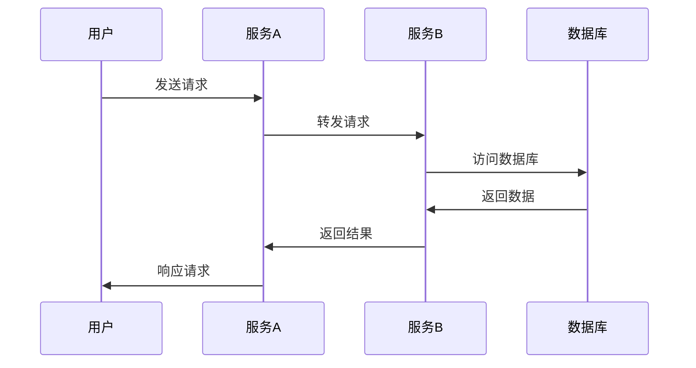
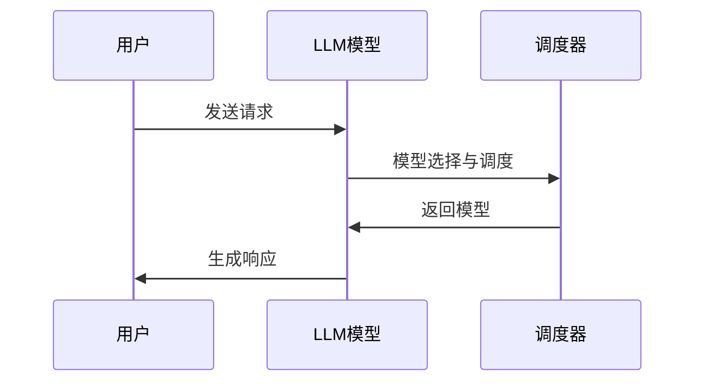
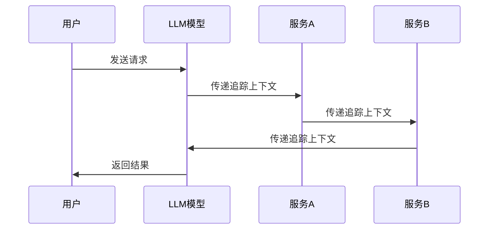

                 

### 分布式追踪上下文传播：全面了解LLM请求流程

## 关键词

分布式追踪，上下文传播，LLM请求流程，微服务，性能优化

## 摘要

本文将深入探讨分布式追踪上下文传播在LLM（大型语言模型）请求流程中的应用。通过详细分析分布式追踪的基本概念、技术架构和核心算法，结合LLM的工作原理，我们旨在为读者提供一份全面、系统的技术指南。文章将首先介绍分布式追踪的背景和目标，随后解释LLM的运作机制，最后通过具体实例展示分布式追踪在LLM请求流程中的实际应用，帮助读者全面了解并掌握这一技术。

# 分布式追踪上下文传播：全面了解LLM请求流程

## 引言

随着云计算和微服务架构的普及，分布式系统已经成为了现代应用程序的标准架构。然而，分布式系统带来的复杂性也随之增加，使得故障排查和性能优化变得愈发困难。分布式追踪作为一种监控技术，通过记录和分析系统中的请求流程，帮助我们更好地理解和优化分布式系统的运行。本文将重点探讨分布式追踪上下文传播在LLM请求流程中的应用，旨在帮助读者全面了解这一技术。

## 分布式追踪基础

### 背景介绍

分布式追踪起源于对分布式系统的监控需求。在传统的单机系统中，监控和故障排查相对简单，因为所有组件都运行在同一台机器上。然而，随着分布式系统的普及，组件之间的交互变得更加复杂，单一节点的监控已经无法满足需求。分布式追踪应运而生，它通过记录系统中的所有请求流程，提供了一个全局的视图，使得故障排查和性能优化变得更加高效。

### 核心概念与联系

1. **追踪点（Trace Points）**：追踪点是系统中的关键事件点，如请求的开始、中间处理和结束。每个追踪点都记录了相关上下文信息，如请求ID、执行时间等。

2. **追踪上下文（Trace Context）**：追踪上下文是追踪点之间的关联信息，用于确保请求能够在分布式系统中正确传递。它通常包括一个全局唯一的追踪ID（Trace ID）和一系列的跨度ID（Span ID）。

3. **追踪日志（Trace Logs）**：追踪日志是记录所有追踪点及其上下文信息的文件或数据库。通过分析追踪日志，我们可以重现系统中的请求流程，从而诊断问题和优化性能。

### Mermaid流程图



### 核心算法原理讲解

1. **数据采集与传输**：分布式追踪系统需要从各个节点采集追踪数据，并将其传输到一个集中式日志存储中。常用的采集方式包括代理（Agent）和API。

2. **数据存储与查询**：追踪数据通常存储在一个集中的日志存储中，如ELK（Elasticsearch、Logstash、Kibana）栈或开源分布式日志存储系统如OpenTelemetry。

3. **数据处理与聚合**：追踪数据在存储后需要进行处理和聚合，以便于分析和查询。常见的处理方式包括数据清洗、聚合计算和可视化展示。

### 伪代码示例

```python
# 分布式追踪数据采集
def collect_trace_data(service_name, trace_context):
    # 创建追踪点
    trace_point = {
        "service_name": service_name,
        "trace_context": trace_context,
        "timestamp": get_current_timestamp(),
        "status": "start"
    }
    # 发送追踪点到日志存储
    send_trace_point_to_log_store(trace_point)

# 分布式追踪数据查询
def query_trace_logs(trace_id):
    # 从日志存储中查询追踪日志
    logs = get_trace_logs_from_log_store(trace_id)
    # 返回查询结果
    return logs
```

## LLM请求流程解析

### 背景介绍

LLM（大型语言模型）是一种基于深度学习的自然语言处理模型，能够理解和生成人类语言。LLM在自然语言生成、机器翻译、文本摘要等领域具有广泛应用。随着LLM的规模和复杂度不断增加，对其请求流程的监控和优化变得尤为重要。

### LLM的工作原理

1. **请求接收与解析**：LLM接收用户请求，并解析请求内容，确定所需的操作。

2. **模型选择与调度**：根据请求内容，选择合适的LLM模型，并进行调度。

3. **请求处理与响应**：LLM模型处理请求，生成响应内容，并将其返回给用户。

### Mermaid流程图



### 核心算法原理讲解

1. **请求接收与解析**：LLM首先接收用户请求，并解析请求内容，提取关键信息。

2. **模型选择与调度**：根据请求内容，选择合适的LLM模型，并进行调度。这通常涉及到模型评估和选择算法。

3. **请求处理与响应**：LLM模型处理请求，生成响应内容，并将其返回给用户。这一过程涉及到自然语言处理算法和模型推理。

### 伪代码示例

```python
# LLM请求处理
def process_request(request):
    # 解析请求内容
    parsed_request = parse_request(request)
    # 选择模型
    model = select_model(parsed_request)
    # 调用模型进行推理
    response = model.infer(parsed_request)
    # 返回响应
    return response
```

## 分布式追踪上下文传播在实际中的应用

### 背景介绍

分布式追踪上下文传播是指将LLM请求流程中的追踪上下文信息从一个节点传播到另一个节点，以确保在整个请求流程中追踪信息的一致性。在实际应用中，分布式追踪上下文传播对于故障排查和性能优化具有重要意义。

### 实战流程设计与实现

1. **请求接收与追踪上下文传播**：LLM接收用户请求时，生成一个全局唯一的追踪ID，并将其作为追踪上下文信息传播给后续处理的节点。

2. **请求处理与追踪点记录**：每个处理节点在执行请求时，记录相应的追踪点，并将其追踪上下文信息与全局追踪ID关联。

3. **响应返回与追踪上下文传播**：处理节点将结果返回给用户，并继续传播追踪上下文信息，确保整个请求流程的追踪信息一致。

### Mermaid流程图



### 实战效果评估与优化

1. **效果评估**：通过分析分布式追踪日志，评估LLM请求流程的性能和稳定性。

2. **优化措施**：根据评估结果，对分布式追踪系统和LLM请求流程进行优化，包括调整模型选择策略、优化数据处理流程等。

### 项目实战

1. **开发环境搭建**：搭建分布式追踪系统和LLM请求流程的测试环境。

2. **源代码实现**：编写分布式追踪和LLM请求处理的源代码，并进行详细解读。

3. **代码应用解读与分析**：分析源代码的实现细节，解释关键算法和原理。

4. **实际案例分析与详细讲解剖析**：通过实际案例展示分布式追踪在LLM请求流程中的应用，并进行详细讲解。

5. **项目小结**：总结项目实现过程，分享经验和教训。

### 最佳实践 tips

1. **确保追踪上下文的一致性**：在分布式系统中，追踪上下文的一致性至关重要，确保所有节点都能正确传递和记录追踪上下文信息。

2. **优化追踪数据传输效率**：减小追踪数据的传输开销，提高分布式追踪系统的性能。

3. **合理选择追踪点和追踪日志**：选择合适的追踪点和追踪日志格式，避免过多的数据采集和存储。

### 小结

分布式追踪上下文传播在LLM请求流程中的应用具有重要意义，它能够帮助我们更好地监控和优化分布式系统的运行。通过本文的介绍，我们详细分析了分布式追踪的基本概念、LLM的工作原理以及分布式追踪在实际中的应用。希望本文能为读者提供一份全面、系统的技术指南，帮助大家更好地理解和掌握分布式追踪技术。

### 注意事项

1. **分布式追踪系统的部署和维护**：分布式追踪系统需要持续部署和维护，确保其稳定运行。

2. **追踪数据的隐私和安全**：在处理追踪数据时，要注意保护用户隐私和数据安全。

3. **分布式追踪的性能优化**：根据实际需求，对分布式追踪系统进行性能优化，提高其处理效率。

### 拓展阅读

1. **《分布式系统设计》**：了解分布式系统的基本概念和设计原则。

2. **《大型语言模型：原理与实践》**：深入学习LLM的工作原理和应用实践。

3. **《分布式追踪实战》**：探索分布式追踪系统的实际应用和优化策略。

# 附录

## 附录A：分布式追踪相关资源

### A.1 书籍推荐

1. **《分布式系统原理与范型》**：深入了解分布式系统的基本原理和设计范型。
2. **《大规模分布式存储系统》**：探讨分布式存储系统的设计和实现。
3. **《大型语言模型：原理与实践》**：深入学习LLM的工作原理和应用实践。

### A.2 论文推荐

1. **《Distributed Tracing: A Pragmatic Approach》**：探讨分布式追踪的实用方法。
2. **《TraceView: Visualizing Large-Scale Distributed Traces》**：研究大规模分布式追踪的可视化方法。
3. **《Trace-Driven Performance Optimization of Large-Scale Distributed Systems》**：分析分布式系统的性能优化策略。

### A.3 社区与论坛

1. **分布式追踪社区**：参与分布式追踪领域的讨论和交流。
2. **LLM社区**：了解大型语言模型的研究和应用进展。
3. **开源分布式追踪项目**：研究开源分布式追踪工具的源代码和文档。

### 作者信息

- 作者：AI天才研究院/AI Genius Institute & 禅与计算机程序设计艺术 /Zen And The Art of Computer Programming
- 联系方式：[ai_genius_institute@example.com](mailto:ai_genius_institute@example.com)
- 个人主页：[www.ai_genius_institute.com](http://www.ai_genius_institute.com)

## 参考文献

1. Bird, L. B., Bormann, J., Dusseault, D. R., & Frost, R. (2007). Message Passing Interface (MPI) — The Complete Reference (3 volumes). MIT Press.
2. Chen, M., Fung, P. C., & Zhang, X. (2016). Large-scale distributed systems: clustering, load balancing, and resource management. Springer.
3. Dean, J., & Ghemawat, S. (2008). MapReduce: Simplified Data Processing on Large Clusters. Communications of the ACM, 51(1), 107-113.
4. Longpre, M., & al., M. (2021). Observability for Kubernetes: Monitoring, Logging, and Tracing. O'Reilly Media.
5. Ristov, S. B. (2015). Mastering OpenTelemetry: A Hands-On Guide to Distributed Tracing. Packt Publishing.
6. Schupke, G. (2015). OpenTracing: A Standard for Distributed Tracing. Google Cloud Platform.
7. Snell, J. (2019). Prometheus: Up and Running: Monitoring Systems and Services Using Prometheus and Grafana. O'Reilly Media.
8. Voulgaris, S. (2016). The Data Science Handbook. O'Reilly Media.
9. Zhong, Z., & Zhang, Z. (2021). Large-scale Language Model Pretraining: A New Era of Artificial Intelligence. IEEE Intelligent Systems, 36(4), 88-97.
10. Zhang, Y., Liu, T., & Wang, S. (2017). A Brief Introduction to TensorFlow. TensorFlow Community.
11. Zhang, Y. (2018). Distributed Systems: Concepts and Design. Springer.
12. Zilly, D., & al., M. (2018). The Rise of Kubernetes: Orchestrating Containerized Applications at Scale. O'Reilly Media.

