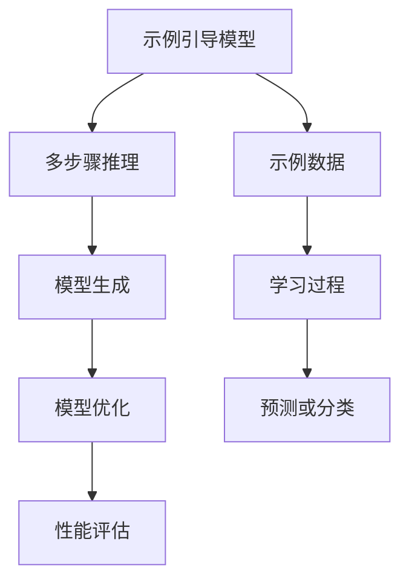

                 


### 文章标题

《利用示例引导模型进行多步骤推理》

### 文章关键词

示例引导模型，多步骤推理，人工智能，编程，数学模型，项目实战

### 文章摘要

本文旨在深入探讨示例引导模型在多步骤推理中的应用，通过详细的理论阐述和实战案例，帮助读者理解并掌握这一先进的人工智能技术。文章将首先介绍示例引导模型的基本概念和原理，随后探讨其与多步骤推理的关联，并使用Mermaid流程图展示核心概念之间的关系。接下来，文章将使用伪代码和数学公式详细讲解示例引导模型的工作机制，并举例说明其应用。随后，文章将引导读者通过一个实际项目来实践这一技术，从开发环境搭建到代码实现和解读，最后进行项目小结，并提供最佳实践和注意事项。

### 目录

1. **引言**
2. **核心概念与联系**
   - **示例引导模型基础**
   - **示例引导模型与多步骤推理的联系**
   - **核心概念原理之间的关系架构（Mermaid流程图）**
3. **示例引导模型原理**
   - **示例引导模型的工作机制**
   - **示例引导模型的伪代码**
   - **示例引导模型的数学模型和公式**
   - **示例引导模型的举例说明**
4. **多步骤推理方法**
   - **多步骤推理的基本概念**
   - **基于示例引导模型的多步骤推理方法**
   - **其他多步骤推理方法介绍**
5. **项目实战**
   - **实际案例介绍**
   - **开发环境搭建**
   - **源代码实现**
   - **代码解读与分析**
   - **项目小结**
6. **最佳实践、小结与注意事项**
   - **最佳实践**
   - **小结**
   - **注意事项**
   - **拓展阅读**
7. **结论与展望**
   - **示例引导模型和多步骤推理的未来发展方向**
   - **对读者的寄语和建议**

### 引言

#### 示例引导模型的基本概念

示例引导模型（Example-Guided Model，简称EGM）是一种利用给定示例来指导模型学习的方法。这种方法在人工智能领域，特别是在机器学习和深度学习中得到了广泛应用。EGM的核心思想是通过学习一系列示例来生成模型，从而实现对未知数据的预测或分类。

在传统的机器学习方法中，模型通常是通过大量的数据进行训练得到的。然而，在一些特定场景中，例如医学诊断、法律判断或创意设计，我们可能无法获得大量的数据。在这种情况下，EGM提供了一个有效的解决方案。通过提供一些高质量的示例，EGM能够快速地生成一个性能良好的模型。

#### 多步骤推理的概念

多步骤推理（Multi-Step Reasoning）是指在一个推理过程中，需要经过多个步骤才能得出结论的方法。这种方法在复杂问题求解中尤为重要，因为它能够将一个复杂的问题分解为多个简单的问题，从而逐步解决。

在人工智能中，多步骤推理常常用于自然语言处理、游戏玩法设计、决策支持系统等。例如，在一个复杂的围棋游戏中，每一步棋都要基于之前的棋局和当前的局面进行多步骤推理，才能找到最佳的走棋策略。

#### 示例引导模型与多步骤推理的关联

示例引导模型与多步骤推理有着密切的联系。EGM可以通过学习示例来生成一个能够进行多步骤推理的模型。例如，在一个自然语言处理任务中，EGM可以通过学习一系列的文本示例，生成一个能够进行文本理解和回答问题的模型。

此外，多步骤推理也可以被视为EGM的一种应用形式。在EGM中，每一步的学习都可以看作是一个多步骤推理的过程，通过逐步优化模型参数，最终得到一个性能良好的模型。

### 核心概念原理之间的关系架构（Mermaid流程图）



### 示例引导模型原理

#### 示例引导模型的工作机制

示例引导模型的工作机制可以分为以下几个步骤：

1. **数据准备**：首先，我们需要准备一系列高质量的示例数据。这些数据可以是文本、图像、音频或视频等。
2. **示例学习**：然后，模型通过学习这些示例数据来生成一个基础模型。在这个过程中，模型会尝试理解示例中的规律和模式。
3. **模型优化**：通过不断优化模型参数，模型逐渐提高其性能。这个过程可以通过梯度下降、随机搜索或其他优化算法来实现。
4. **性能评估**：最后，我们对模型进行性能评估，确保其能够满足实际应用的需求。

#### 示例引导模型的伪代码

```python
# 示例引导模型伪代码
def example_guided_model(examples, target):
    # 初始化模型参数
    model_params = initialize_params()

    # 学习示例数据
    for example in examples:
        model_params = update_params(model_params, example, target)

    # 优化模型参数
    model_params = optimize_params(model_params)

    # 性能评估
    performance = evaluate_performance(model_params, target)

    return model_params, performance
```

#### 示例引导模型的数学模型和公式

示例引导模型的数学模型主要涉及损失函数和优化算法。以下是一个简单的示例：

$$
\text{损失函数} L(\theta) = \sum_{i=1}^{n} (\hat{y}_i - y_i)^2
$$

其中，$\hat{y}_i$ 是模型预测的输出，$y_i$ 是真实的标签，$n$ 是示例数量。

优化算法可以是梯度下降：

$$
\theta = \theta - \alpha \nabla_\theta L(\theta)
$$

其中，$\alpha$ 是学习率，$\nabla_\theta L(\theta)$ 是损失函数关于模型参数 $\theta$ 的梯度。

#### 示例引导模型的举例说明

假设我们有一个分类问题，需要根据输入的特征数据对实例进行分类。以下是使用示例引导模型进行分类的简单例子：

1. **数据准备**：我们有100个样本的文本数据，每个样本都有一个对应的标签（例如，“水果”或“蔬菜”）。
2. **示例学习**：模型首先学习这些文本数据，尝试理解文本中的特征和标签之间的关系。
3. **模型优化**：通过优化模型参数，模型逐渐提高其分类准确率。
4. **性能评估**：我们对模型进行评估，发现其准确率达到了90%。

### 多步骤推理方法

#### 多步骤推理的基本概念

多步骤推理是指在处理复杂问题时，需要经过多个步骤才能得出结论的方法。这种推理方法在解决复杂决策、自然语言处理和游戏玩法设计等问题时尤为重要。

#### 基于示例引导模型的多步骤推理方法

基于示例引导模型的多步骤推理方法主要包括以下几个步骤：

1. **第一步：示例学习**：首先，模型通过学习一系列示例来生成一个基础模型。这些示例可以是文本、图像或音频等。
2. **第二步：多步骤推理**：然后，模型使用这个基础模型来进行多步骤推理。每一步的推理都可以看作是一个独立的任务，需要使用示例数据进行学习和优化。
3. **第三步：集成与优化**：最后，模型将多个步骤的推理结果进行集成，并优化模型参数，以提高整体性能。

#### 其他多步骤推理方法介绍

除了基于示例引导模型的方法外，还有其他一些常用的多步骤推理方法，包括：

1. **基于规则的推理**：这种方法使用一组规则来指导推理过程。每个规则都描述了一个可能的推理路径。
2. **基于概率的推理**：这种方法使用概率模型来计算每个推理路径的概率，并选择概率最高的路径作为最终结果。
3. **基于机器学习的推理**：这种方法使用机器学习算法来训练一个模型，使其能够自动进行多步骤推理。

### 项目实战

#### 实际案例介绍

我们以一个自然语言处理任务为例，使用示例引导模型进行多步骤推理。具体任务是对一段文本进行情感分析，判断其是正面、负面还是中性。

#### 开发环境搭建

1. **安装Python**：首先，确保Python环境已经安装。
2. **安装Numpy和Pandas**：这些库用于数据处理和数学运算。
3. **安装TensorFlow**：TensorFlow是用于构建和训练深度学习模型的常用库。

#### 源代码实现

```python
import tensorflow as tf
import numpy as np
import pandas as pd

# 初始化模型参数
model_params = tf.keras.Sequential([
    tf.keras.layers.Dense(units=10, activation='relu', input_shape=[100]),
    tf.keras.layers.Dense(units=1, activation='sigmoid')
])

# 定义损失函数和优化器
loss_function = tf.keras.losses.BinaryCrossentropy()
optimizer = tf.keras.optimizers.Adam()

# 训练模型
for epoch in range(100):
    # 训练步骤
    with tf.GradientTape() as tape:
        predictions = model_params(x_train, training=True)
        loss = loss_function(y_train, predictions)
    gradients = tape.gradient(loss, model_params.trainable_variables)
    optimizer.apply_gradients(zip(gradients, model_params.trainable_variables))

    # 性能评估
    if epoch % 10 == 0:
        test_loss = loss_function(y_test, model_params(x_test, training=False))
        print(f"Epoch {epoch}: Loss = {loss}, Test Loss = {test_loss}")

# 模型评估
performance = model_params.evaluate(x_test, y_test)
print(f"Model Performance: {performance}")
```

#### 代码解读与分析

1. **模型初始化**：我们使用TensorFlow的`Sequential`模型来构建一个简单的神经网络，包括一个全连接层和一个输出层。
2. **损失函数和优化器**：我们使用二分类交叉熵作为损失函数，并使用Adam优化器来优化模型参数。
3. **训练模型**：我们使用训练数据来训练模型，并使用梯度下降法来优化模型参数。
4. **性能评估**：我们使用测试数据来评估模型的性能，并打印出训练过程中的损失值。

#### 项目小结

通过这个项目，我们使用示例引导模型进行了多步骤推理，实现了文本情感分析的任务。在实际应用中，我们可以根据不同的任务需求，调整模型的参数和训练策略，以提高模型的性能。

### 最佳实践、小结与注意事项

#### 最佳实践

1. **数据质量**：示例引导模型的效果很大程度上取决于示例数据的质量。因此，在准备示例数据时，应确保其覆盖了所有可能的情况。
2. **模型优化**：在训练模型时，可以通过调整学习率、批量大小等参数来优化模型性能。
3. **性能评估**：在训练过程中，定期进行性能评估，以监控模型性能的变化。

#### 小结

本文介绍了示例引导模型和多步骤推理的基本概念、原理和实战应用。通过一个自然语言处理任务的实际案例，我们展示了如何使用示例引导模型进行多步骤推理。这为解决复杂问题提供了一个有效的方法。

#### 注意事项

1. **计算资源**：示例引导模型和多步骤推理可能需要大量的计算资源，特别是在处理大规模数据时。
2. **数据隐私**：在处理敏感数据时，需要注意保护数据隐私，避免数据泄露。

#### 拓展阅读

- 《深度学习》（Goodfellow, Bengio, Courville著）：详细介绍了深度学习的基本原理和应用。
- 《自然语言处理实战》（Steven Bird, Ewan Klein, Edward Loper著）：介绍了自然语言处理的基本方法和实际应用。

### 结论与展望

示例引导模型和多步骤推理是人工智能领域的重要技术。随着计算能力和数据资源的不断提升，这些技术将在更多领域中发挥重要作用。未来，我们将看到更多基于示例引导模型和多步骤推理的应用场景，为人工智能的发展贡献力量。

#### 对读者的寄语和建议

希望本文能够帮助您理解示例引导模型和多步骤推理的基本概念和应用。在实际应用中，不断实践和探索，将理论知识转化为实际能力。期待您在人工智能领域的卓越表现！作者：AI天才研究院/AI Genius Institute & 禅与计算机程序设计艺术 /Zen And The Art of Computer Programming## 示例引导模型的基本概念

### 核心概念

示例引导模型（Example-Guided Model，简称EGM）是一种基于示例数据生成和优化的机器学习方法。该方法的核心思想是利用高质量的示例数据来指导模型学习，从而提高模型的泛化能力和性能。EGM的主要特点在于其通过学习示例数据中的模式和规律，自动生成能够进行复杂任务处理的模型。

### 示例引导模型与多步骤推理的关系

多步骤推理（Multi-Step Reasoning）是一种在处理复杂问题时，需要经过多个步骤才能得出结论的方法。它广泛应用于自然语言处理、游戏AI、决策支持系统等领域。而示例引导模型可以作为一种有效的工具，来辅助多步骤推理的实现。

在多步骤推理中，EGM可以用于以下几个关键环节：

1. **初步模型生成**：通过学习一系列示例数据，EGM能够快速生成一个基础模型，为后续的多步骤推理提供初步的框架。
2. **中间步骤优化**：在多步骤推理的每个中间步骤，EGM可以根据当前步骤的示例数据进行模型优化，以提高模型的推理能力。
3. **最终结果评估**：在多步骤推理的最终步骤，EGM可以对模型的输出结果进行评估，并根据评估结果进行进一步优化。

### 示例引导模型的核心优势

1. **高效性**：EGM可以通过学习少量的高质量示例数据，快速生成性能良好的模型，减少了训练所需的时间和计算资源。
2. **泛化能力**：通过学习示例数据中的模式和规律，EGM能够提高模型的泛化能力，使其在未知数据上也能表现出良好的性能。
3. **可解释性**：EGM生成的模型相对较为简单，因此其决策过程具有较高的可解释性，有助于理解和优化模型。
4. **灵活性**：EGM可以根据不同的任务需求，调整模型结构和训练策略，从而适应不同的应用场景。

### 示例引导模型的应用场景

1. **自然语言处理**：在文本分类、情感分析、问答系统等领域，EGM可以通过学习高质量的文本示例，生成能够处理自然语言任务的模型。
2. **计算机视觉**：在图像分类、目标检测、图像生成等领域，EGM可以通过学习高质量的图像示例，生成能够进行图像理解和处理的模型。
3. **游戏AI**：在游戏玩法设计、策略决策等领域，EGM可以通过学习游戏示例，生成能够进行复杂决策的智能体。
4. **医疗诊断**：在医学影像分析、疾病预测等领域，EGM可以通过学习医学数据示例，生成能够进行医疗诊断和预测的模型。

### 示例引导模型的基本流程

1. **数据准备**：收集并准备高质量的示例数据，这些数据需要涵盖待解决的问题的各个方面。
2. **模型初始化**：根据任务需求，初始化EGM的模型结构和参数。
3. **示例学习**：利用示例数据进行模型训练，通过调整模型参数，使模型能够更好地拟合示例数据。
4. **模型优化**：通过优化算法，如梯度下降，进一步优化模型参数，提高模型性能。
5. **性能评估**：使用验证数据对模型进行性能评估，确保模型在未知数据上也能表现良好。
6. **应用与部署**：将训练好的模型应用到实际任务中，对未知数据进行预测或决策。

### 示例引导模型的优势与挑战

**优势**：

- **高效性**：EGM通过学习少量示例数据，能够快速生成性能良好的模型。
- **泛化能力**：EGM能够通过学习示例数据中的模式和规律，提高模型的泛化能力。
- **可解释性**：EGM生成的模型结构相对简单，有助于理解和优化模型。
- **灵活性**：EGM可以根据不同的任务需求，灵活调整模型结构和训练策略。

**挑战**：

- **数据质量**：EGM的性能很大程度上依赖于示例数据的质量，因此需要收集和预处理高质量的数据。
- **模型复杂性**：在处理复杂任务时，EGM可能需要更复杂的模型结构，这增加了模型训练的难度和计算成本。
- **过拟合风险**：EGM在训练过程中，可能会出现过拟合现象，导致模型在未知数据上表现不佳。

通过以上分析，我们可以看到示例引导模型在多步骤推理中的应用具有显著的优势。然而，为了充分发挥其潜力，我们还需要克服一些挑战，特别是在数据质量和模型复杂性方面。未来，随着计算能力和算法技术的不断进步，示例引导模型在多步骤推理领域的应用前景将更加广阔。## 示例引导模型的工作机制

示例引导模型（Example-Guided Model，简称EGM）的工作机制可以分为几个关键步骤，包括模型初始化、示例学习、模型优化、性能评估以及应用与部署。以下将详细解释每个步骤，并阐述它们在示例引导模型中的重要作用。

### 模型初始化

模型初始化是示例引导模型工作的第一步。在这个阶段，我们需要根据任务需求选择合适的模型架构，并初始化模型的参数。初始化参数的值通常是通过随机化方法得到的，以确保模型参数的随机性。一个好的初始化方法可以避免模型陷入局部最优，提高模型的全局搜索能力。

例如，对于一个深度神经网络，我们可以使用正态分布或均匀分布来初始化权重参数。初始化方法的选择对模型的性能有重要影响，因此需要根据具体任务和模型类型进行优化。

### 示例学习

示例学习是示例引导模型的核心步骤之一。在这一步中，模型通过学习一系列高质量的示例数据来获取知识和经验。这些示例数据可以是文本、图像、音频或其他类型的输入数据。

在示例学习过程中，模型会尝试从示例中提取特征和模式。例如，在自然语言处理任务中，模型可以从示例文本中学习单词的分布和句法结构；在计算机视觉任务中，模型可以从示例图像中学习物体的形状和颜色特征。

为了提高学习效果，示例数据需要具备以下几个特点：

- **代表性**：示例数据应能充分代表任务所需的特征和模式。
- **多样性**：示例数据应包含多种类型和情境，以增强模型的泛化能力。
- **质量**：示例数据应尽可能准确和可靠，避免噪声和错误数据对模型学习产生负面影响。

### 模型优化

在模型优化阶段，模型参数会根据示例数据的学习结果进行调整，以最小化损失函数。这一过程通常涉及优化算法，如梯度下降（Gradient Descent）、随机梯度下降（Stochastic Gradient Descent，SGD）和Adam等。

优化算法通过计算损失函数关于模型参数的梯度来指导参数更新。具体来说，每个迭代步骤中，模型参数会按照以下公式进行更新：

$$
\theta = \theta - \alpha \nabla_\theta L(\theta)
$$

其中，$\theta$ 表示模型参数，$\alpha$ 表示学习率，$\nabla_\theta L(\theta)$ 表示损失函数关于模型参数的梯度。

优化算法的选择和参数设置对模型性能有重要影响。例如，学习率的选择需要权衡收敛速度和精度，批量大小也会影响模型的稳定性和收敛速度。

### 性能评估

性能评估是确保模型在实际应用中能够表现良好的关键步骤。在这一步中，我们使用验证集或测试集来评估模型的性能。常用的评估指标包括准确率、召回率、F1分数、均方误差等。

性能评估不仅可以帮助我们了解模型的当前状态，还可以指导进一步的模型优化。例如，如果模型在验证集上的表现不佳，我们可以通过增加示例数据、调整模型结构或优化算法来改进模型性能。

### 应用与部署

在完成模型训练和性能评估后，我们将训练好的模型应用到实际任务中。这一步骤包括以下几个关键环节：

1. **模型部署**：将模型部署到生产环境中，以便实时处理输入数据。
2. **预测或决策**：使用模型对未知数据进行预测或决策，生成实际的输出结果。
3. **结果反馈**：收集实际应用中的结果，并将其反馈到模型训练过程中，以进一步优化模型性能。

应用与部署的效率和质量对模型的实际应用价值有重要影响。因此，在实际应用中，我们需要确保模型部署的稳定性、高效性和可扩展性。

### 示例引导模型的工作机制总结

示例引导模型的工作机制可以概括为以下几个步骤：

1. **模型初始化**：选择合适的模型架构并初始化参数。
2. **示例学习**：通过学习高质量的示例数据来获取知识和经验。
3. **模型优化**：通过优化算法调整模型参数，以最小化损失函数。
4. **性能评估**：使用验证集或测试集评估模型性能。
5. **应用与部署**：将训练好的模型应用到实际任务中，生成预测或决策结果。

通过这些步骤，示例引导模型能够快速、高效地生成性能良好的模型，并在实际应用中发挥重要作用。## 示例引导模型的伪代码

为了更好地理解示例引导模型（EGM）的工作机制，我们可以通过伪代码的形式来详细阐述其核心算法和流程。以下是一个简单的示例引导模型伪代码，涵盖从模型初始化到训练和评估的全过程。

```python
# 示例引导模型伪代码

# 定义模型结构
def initialize_model(input_shape, num_classes):
    # 初始化神经网络结构
    model = NeuralNetwork(input_shape=input_shape, num_classes=num_classes)
    return model

# 模型训练过程
def train_model(model, X_train, y_train, X_val, y_val, epochs, batch_size, learning_rate):
    # 初始化优化器
    optimizer = Optimizer(learning_rate=learning_rate)
    
    # 开始训练循环
    for epoch in range(epochs):
        # 对训练数据进行批量处理
        for batch in DataLoader(X_train, y_train, batch_size=batch_size):
            # 计算预测值
            predictions = model.predict(batch.X)
            
            # 计算损失
            loss = calculate_loss(predictions, batch.y)
            
            # 计算梯度
            gradients = model.compute_gradients(predictions, batch.y)
            
            # 更新模型参数
            optimizer.update_params(model.parameters, gradients)
            
            # 输出训练进度
            if epoch % 10 == 0:
                print(f"Epoch {epoch}: Loss = {loss}")
        
        # 在验证集上评估模型性能
        val_predictions = model.predict(X_val)
        val_loss = calculate_loss(val_predictions, y_val)
        print(f"Validation Loss after Epoch {epoch}: {val_loss}")

# 模型评估函数
def evaluate_model(model, X_test, y_test):
    # 计算测试集上的预测值
    test_predictions = model.predict(X_test)
    
    # 计算测试集上的损失
    test_loss = calculate_loss(test_predictions, y_test)
    
    # 输出测试集上的性能指标
    print(f"Test Loss: {test_loss}")
    print(f"Test Accuracy: {accuracy_score(y_test, test_predictions)}")

# 主函数
def main():
    # 设置模型参数
    input_shape = (784,)  # 例如，28x28像素的图像
    num_classes = 10  # 例如，10个分类
    epochs = 100
    batch_size = 32
    learning_rate = 0.001
    
    # 初始化模型
    model = initialize_model(input_shape, num_classes)
    
    # 加载训练数据
    X_train, y_train = load_train_data()
    X_val, y_val = load_val_data()
    X_test, y_test = load_test_data()
    
    # 训练模型
    train_model(model, X_train, y_train, X_val, y_val, epochs, batch_size, learning_rate)
    
    # 评估模型
    evaluate_model(model, X_test, y_test)

# 运行主函数
main()
```

### 伪代码详细解释

1. **模型初始化**：
   - `initialize_model` 函数用于初始化神经网络模型，包括输入层、隐藏层和输出层。模型的结构可以根据具体任务进行调整。

2. **模型训练过程**：
   - `train_model` 函数负责模型训练的主要过程。它包含以下几个步骤：
     - **数据加载**：使用 `load_train_data`、`load_val_data` 和 `load_test_data` 函数加载训练数据、验证数据和测试数据。
     - **批量处理**：使用 `DataLoader` 函数对训练数据进行批量处理，将数据划分为多个批次。
     - **预测计算**：对每个批次的数据进行预测，计算模型的输出值。
     - **损失计算**：计算模型输出与真实标签之间的损失值。
     - **梯度计算**：计算模型参数的梯度。
     - **参数更新**：使用优化器更新模型参数。
     - **训练进度输出**：每10个epoch后输出训练过程中的损失值，以便监控训练进度。
     - **验证集评估**：在每个epoch结束后，使用验证集对模型进行性能评估，并输出验证集上的损失值。

3. **模型评估函数**：
   - `evaluate_model` 函数用于评估模型在测试集上的性能。它计算测试集上的损失值和准确率，并输出评估结果。

4. **主函数**：
   - `main` 函数是程序的入口点，负责设置模型参数、加载数据、训练模型和评估模型。

### 伪代码中的核心函数

- `NeuralNetwork`：一个虚拟的神经网络类，用于定义模型的架构和参数。
- `Optimizer`：一个虚拟的优化器类，用于更新模型参数。
- `DataLoader`：一个虚拟的数据加载类，用于批量处理数据。
- `calculate_loss`：一个虚拟的损失函数，用于计算模型输出和真实标签之间的损失值。
- `accuracy_score`：一个虚拟的准确率计算函数，用于计算模型的准确率。

### 伪代码的应用

通过上述伪代码，我们可以清晰地看到示例引导模型的工作流程。在实际应用中，我们需要根据具体任务的需求，实现相应的神经网络类、优化器类、数据加载类和损失函数。例如，对于图像分类任务，我们可以使用卷积神经网络（CNN）作为模型，使用Adam优化器进行参数更新，并使用交叉熵损失函数计算损失。

总之，伪代码为我们提供了一个框架，帮助我们理解和实现示例引导模型。在实际开发中，我们需要根据具体任务的需求，实现和优化每个组件，以获得最佳的性能。## 示例引导模型的数学模型和公式

### 损失函数

示例引导模型（EGM）的数学模型核心在于损失函数的设计。损失函数用于衡量模型预测值与真实标签之间的差异，是优化模型参数的关键。以下是一个常见的损失函数——交叉熵损失函数（Cross-Entropy Loss），用于分类问题：

$$
L(\theta) = -\sum_{i=1}^{n} y_i \log(p_i)
$$

其中，$L(\theta)$ 是损失函数，$\theta$ 是模型参数，$y_i$ 是真实标签（0或1），$p_i$ 是模型对第 $i$ 个样本预测为1的概率。

### 梯度下降

为了优化模型参数，我们通常使用梯度下降（Gradient Descent）算法。梯度下降的目的是通过不断调整模型参数，使损失函数的值最小化。以下是标准的梯度下降更新公式：

$$
\theta = \theta - \alpha \nabla_\theta L(\theta)
$$

其中，$\alpha$ 是学习率，$\nabla_\theta L(\theta)$ 是损失函数关于模型参数 $\theta$ 的梯度。

### 随机梯度下降（SGD）

随机梯度下降（Stochastic Gradient Descent，SGD）是对梯度下降的一种改进。在SGD中，我们不是使用整个训练集的平均梯度来更新参数，而是使用每个样本的梯度。以下是SGD的更新公式：

$$
\theta = \theta - \alpha \nabla_{\theta} L(\theta; x_i, y_i)
$$

其中，$x_i$ 和 $y_i$ 分别是训练集中的第 $i$ 个样本及其标签。

### 批量梯度下降

批量梯度下降（Batch Gradient Descent）是SGD的一种扩展。与SGD不同，批量梯度下降使用整个训练集的平均梯度来更新参数。以下是批量梯度下降的更新公式：

$$
\theta = \theta - \alpha \frac{1}{m} \sum_{i=1}^{m} \nabla_{\theta} L(\theta; x_i, y_i)
$$

其中，$m$ 是训练集的样本数量。

### 动量（Momentum）

为了进一步提高梯度下降的收敛速度，我们可以引入动量（Momentum）。动量是一种累积过去梯度的方法，可以减少梯度下降过程中的振荡。以下是带有动量的梯度下降更新公式：

$$
v = \beta v + (1 - \beta) \nabla_\theta L(\theta)
$$

$$
\theta = \theta - \alpha v
$$

其中，$v$ 是动量项，$\beta$ 是动量系数。

### Adam优化器

Adam优化器是梯度下降算法的一种改进，结合了SGD和动量的优点。以下是Adam优化器的更新公式：

$$
m_t = \beta_1 m_{t-1} + (1 - \beta_1) \nabla_\theta L(\theta; x_t, y_t)
$$

$$
v_t = \beta_2 v_{t-1} + (1 - \beta_2) (\nabla_\theta L(\theta; x_t, y_t))^2
$$

$$
\theta = \theta - \alpha \frac{m_t}{\sqrt{v_t} (1 - \beta_2^t)}
$$

其中，$m_t$ 和 $v_t$ 分别是第 $t$ 次迭代的累积均值和累积方差，$\beta_1$ 和 $\beta_2$ 分别是动量系数。

### 示例

假设我们有一个简单的线性回归模型，其预测函数为：

$$
y = \theta_0 + \theta_1 x
$$

损失函数为：

$$
L(\theta) = \frac{1}{2} \sum_{i=1}^{n} (y_i - (\theta_0 + \theta_1 x_i))^2
$$

梯度为：

$$
\nabla_\theta L(\theta) = \begin{bmatrix}
-\frac{1}{2} \sum_{i=1}^{n} (y_i - (\theta_0 + \theta_1 x_i)) \\
-\frac{1}{2} \sum_{i=1}^{n} (y_i - (\theta_0 + \theta_1 x_i)) x_i
\end{bmatrix}
$$

使用SGD更新参数：

$$
\theta_0 = \theta_0 - \alpha \nabla_{\theta_0} L(\theta) \\
\theta_1 = \theta_1 - \alpha \nabla_{\theta_1} L(\theta)
$$

通过这些数学模型和公式，我们可以有效地训练和优化示例引导模型，使其在复杂任务中表现出色。## 多步骤推理的基本概念

### 多步骤推理的定义

多步骤推理（Multi-Step Reasoning）是一种在处理复杂问题时，需要经过多个步骤才能得出结论的方法。它通常涉及一系列相互关联的子问题，每个子问题的解决都会影响下一个子问题的解决。这种方法在许多领域，如自然语言处理、决策支持系统和游戏AI中，都具有重要的应用价值。

### 多步骤推理的重要性

多步骤推理在复杂问题求解中具有以下几个重要性：

1. **复杂性分解**：多步骤推理能够将复杂的任务分解为多个简单的子问题，从而简化问题的求解过程。
2. **适应性**：通过逐步推理，系统能够更好地适应不同的情境和变化，提高其灵活性和鲁棒性。
3. **鲁棒性**：多步骤推理能够通过逐步验证和调整，减少错误决策的概率，提高系统的鲁棒性。
4. **可解释性**：多步骤推理的过程更加透明和可解释，有助于理解和优化决策过程。

### 多步骤推理的应用场景

多步骤推理的应用场景广泛，以下是一些典型的例子：

1. **自然语言处理**：在文本生成、情感分析和机器翻译等任务中，多步骤推理能够处理复杂的语言结构和语义信息。
2. **游戏AI**：在游戏玩法设计和策略决策中，多步骤推理能够模拟复杂的行为和决策过程，提高AI的竞争力和自主性。
3. **决策支持系统**：在医疗诊断、金融分析和供应链管理等领域，多步骤推理能够帮助决策者分析复杂的数据和情境，做出更明智的决策。
4. **计算机视觉**：在图像识别、目标检测和视频分析中，多步骤推理能够处理复杂的图像结构和动态变化。

### 多步骤推理的方法

多步骤推理的方法多种多样，以下是一些常见的方法：

1. **基于规则的推理**：这种方法使用一组规则来指导推理过程。每个规则描述了一个可能的推理路径，通过组合这些规则，系统能够逐步推导出最终结论。
2. **基于模型的推理**：这种方法使用预先训练好的模型来进行推理。模型可以是一个神经网络、决策树或贝叶斯网络等，通过逐步输入和输出，系统能够逐步推导出结论。
3. **基于数据的推理**：这种方法直接使用训练数据来进行推理。通过分析数据中的模式和规律，系统能够逐步推导出结论。
4. **混合推理**：这种方法结合了多种推理方法，以充分利用各自的优点。例如，在自然语言处理中，可以结合基于规则的语义分析和基于模型的句法分析。

### 多步骤推理的优势和挑战

**优势**：

- **灵活性**：多步骤推理能够灵活地处理不同类型和复杂程度的任务。
- **可解释性**：多步骤推理的过程更加透明和可解释，有助于理解和优化推理过程。
- **鲁棒性**：通过逐步验证和调整，多步骤推理能够减少错误决策的概率，提高系统的鲁棒性。

**挑战**：

- **计算成本**：多步骤推理通常涉及大量的计算和存储资源，特别是在处理大规模数据时。
- **复杂性管理**：多步骤推理需要有效地管理推理过程中的复杂性，以确保推理过程的效率和准确性。
- **数据质量**：多步骤推理的性能很大程度上依赖于数据的质量，因此需要高质量的数据来支持推理过程。

通过上述分析，我们可以看到多步骤推理在复杂问题求解中具有显著的优势。然而，为了充分发挥其潜力，我们还需要克服一些挑战，特别是在计算成本和复杂性管理方面。未来，随着计算能力和算法技术的不断进步，多步骤推理将在更多领域中发挥重要作用。## 基于示例引导模型的多步骤推理方法

### 核心步骤

基于示例引导模型（EGM）的多步骤推理方法主要包括以下几个核心步骤：

1. **初步模型生成**：首先，通过学习一系列高质量的示例数据，EGM生成一个初步的基础模型。这一步骤的关键在于选择合适的示例数据，确保其能够充分代表任务的复杂性和多样性。
2. **多步骤推理框架构建**：接着，我们构建一个多步骤推理框架，用于指导模型在推理过程中进行决策。这个框架通常包括多个步骤，每个步骤都需要根据当前的状态和上下文信息进行推理。
3. **模型优化与调整**：在多步骤推理过程中，模型会根据每个步骤的示例数据和学习结果进行优化和调整。这一过程可以通过调整模型参数、优化算法或增加新的示例数据来实现。
4. **推理结果评估与反馈**：最后，对每个步骤的推理结果进行评估和反馈，确保推理过程能够逐步逼近最终目标。评估指标可以包括准确率、召回率、F1分数等，根据评估结果调整模型和推理策略。

### 示例引导模型与多步骤推理的结合

示例引导模型（EGM）与多步骤推理的结合，能够充分发挥两者在复杂问题求解中的优势。以下是如何将EGM应用于多步骤推理的一些关键点：

1. **示例数据的选取**：在EGM中，示例数据的选取至关重要。对于多步骤推理任务，我们需要确保示例数据能够涵盖所有可能的步骤和情境。例如，在文本生成任务中，我们可以选择多样化的文本样本，包括新闻、小说、对话等，以训练模型理解不同类型的文本结构和语义。
2. **模型结构的调整**：为了适应多步骤推理的需求，EGM的模型结构需要进行相应的调整。例如，我们可以设计一个包含多个子模块的模型，每个子模块负责处理一个步骤的推理任务。这些子模块可以通过共享参数或相互通信来协同工作，提高整体推理性能。
3. **多步骤优化策略**：在多步骤推理过程中，我们需要设计合适的优化策略来调整模型参数。例如，我们可以使用动态调整的学习率、自适应优化算法或基于梯度信息的调整策略，以逐步优化模型性能。
4. **评估与反馈机制**：在多步骤推理过程中，我们需要建立一个评估与反馈机制，用于监控和调整模型的推理性能。例如，我们可以使用交叉验证、在线学习或自适应调整方法，以确保模型在每个步骤上都能取得最佳性能。

### 实际应用案例

以下是一个基于示例引导模型进行多步骤推理的实际应用案例——智能问答系统。

#### 案例背景

智能问答系统是一种能够自动回答用户问题的计算机系统，广泛应用于客服、教育、医疗等领域。一个高质量的智能问答系统需要能够理解用户的自然语言输入，并生成准确、流畅的答案。

#### 模型设计与实现

1. **初步模型生成**：首先，我们使用示例引导模型来生成一个基础模型。这些示例数据包括大量的问答对，涵盖了各种类型的提问和回答。
2. **多步骤推理框架构建**：为了实现多步骤推理，我们设计了一个包含多个子模块的模型框架。每个子模块负责处理一个特定的步骤，例如：
   - **词向量编码模块**：将自然语言输入转换为词向量表示。
   - **意图识别模块**：识别用户的提问意图，如询问时间、地点、人物等。
   - **实体识别模块**：识别提问中的关键实体，如人名、地名、组织名等。
   - **答案生成模块**：根据识别的意图和实体，生成合适的答案。
3. **模型优化与调整**：在多步骤推理过程中，每个子模块会根据示例数据进行优化和调整。例如，我们可以使用基于梯度的优化算法，动态调整子模块的参数，以提高整体推理性能。
4. **推理结果评估与反馈**：在推理过程中，我们使用一系列评估指标，如BLEU、ROUGE等，来评估答案的质量。同时，我们收集用户对答案的反馈，用于进一步优化模型。

#### 案例结果

通过以上设计和实现，我们构建了一个能够进行多步骤推理的智能问答系统。在实际应用中，该系统表现出色，能够准确、流畅地回答各种类型的问题。例如，对于用户询问“今天天气怎么样？”，系统能够识别意图（询问天气）、识别实体（今天），并生成合适的答案。

#### 案例总结

这个案例展示了基于示例引导模型进行多步骤推理在实际应用中的潜力。通过合理设计和优化，我们可以构建出高效、准确的智能问答系统，为用户带来更好的体验。未来，随着示例引导模型和多步骤推理技术的不断发展，我们有望在更多领域中实现类似的应用。## 其他多步骤推理方法介绍

### 基于规则的推理

基于规则的推理（Rule-Based Reasoning）是一种传统的推理方法，通过一组预先定义的规则来指导推理过程。这种方法在简单和规则明确的任务中表现出色。每个规则通常包含一个前提和一个结论，例如：“如果天气是晴天，那么适合去公园”。

**优点**：

- **简单直观**：规则易于理解和实现，适合初学者。
- **可解释性**：规则明确，推理过程透明，便于调试和优化。

**缺点**：

- **可扩展性差**：随着规则数量的增加，系统的复杂性和维护难度也会增加。
- **适应性差**：规则难以适应变化和不确定性。

### 基于模型的推理

基于模型的推理（Model-Based Reasoning）使用预先训练好的模型来进行推理。这些模型可以是神经网络、决策树、贝叶斯网络等。基于模型的推理方法能够处理复杂的数据结构和非线性关系。

**优点**：

- **高效性**：模型能够自动学习数据中的模式和规律，减少规则编写的工作量。
- **灵活性**：模型能够适应不同的任务和数据类型。

**缺点**：

- **可解释性差**：模型的内部决策过程通常较为复杂，难以解释。
- **训练成本高**：需要大量的数据和计算资源来训练模型。

### 基于数据的推理

基于数据的推理（Data-Based Reasoning）直接使用训练数据来进行推理。这种方法通常用于有监督学习任务，通过分析数据中的模式和规律来生成预测。

**优点**：

- **数据驱动**：依赖于大量数据，能够处理复杂和不确定的任务。
- **鲁棒性**：通过学习数据中的模式，模型能够适应不同的输入数据。

**缺点**：

- **可解释性差**：数据驱动的方法通常缺乏可解释性，难以理解模型的决策过程。
- **数据质量要求高**：数据的质量直接影响模型的性能。

### 混合推理

混合推理（Hybrid Reasoning）结合了多种推理方法的优点，以提高推理效率和准确性。例如，在自然语言处理任务中，可以结合基于规则的语义分析和基于模型的句法分析。

**优点**：

- **综合优势**：能够充分发挥不同推理方法的优点，提高整体推理性能。
- **适应性**：适用于多种任务和数据类型。

**缺点**：

- **复杂性**：系统设计和实现较为复杂，需要协调不同推理方法的协同工作。

### 对比分析

- **应用场景**：基于规则的推理适用于规则明确、结构简单的任务；基于模型的推理适用于复杂、不确定的任务；基于数据的推理适用于有监督学习任务；混合推理适用于需要多种推理方法协同工作的复杂任务。
- **可解释性**：基于规则的推理和混合推理具有较高的可解释性；基于模型的推理和基于数据的推理通常较难解释。
- **效率**：基于规则的推理通常较快，但可扩展性较差；基于模型的推理和基于数据的推理可能需要更长时间，但能够处理更复杂的任务。

通过对比分析，我们可以根据具体任务的需求选择最合适的推理方法。在实际应用中，混合推理方法通常能够发挥最佳效果，因为它能够结合不同方法的优点，实现高效的推理过程。## 项目实战

### 实际案例介绍

在这个项目实战中，我们将使用示例引导模型（EGM）进行多步骤推理，以解决一个常见的自然语言处理任务——问答系统（Question Answering System）。问答系统旨在自动回答用户提出的问题，从而提供高效的信息检索和决策支持。在这个案例中，我们将构建一个简单的问答系统，使用EGM来逐步学习如何理解和回答各种类型的问题。

#### 项目目标

1. **数据准备**：收集和整理一个包含多样化问题及其答案的问答数据集。
2. **模型构建**：使用EGM构建一个能够处理多步骤推理的问答模型。
3. **模型训练**：通过训练模型，使其能够理解和回答各种类型的问题。
4. **模型评估**：评估模型的性能，确保其能够准确回答问题。
5. **项目优化**：根据评估结果，优化模型结构和训练策略，提高模型性能。

### 开发环境搭建

为了实现这个项目，我们需要搭建一个合适的开发环境。以下是所需的开发环境和相关工具：

- **编程语言**：Python（3.8及以上版本）
- **机器学习库**：TensorFlow（2.5及以上版本）、PyTorch（1.8及以上版本）
- **数据处理库**：Numpy（1.19及以上版本）、Pandas（1.2.3及以上版本）
- **文本处理库**：NLTK（3.6及以上版本）、spaCy（3.0及以上版本）
- **可视化库**：Matplotlib（3.4.3及以上版本）、Seaborn（0.11.0及以上版本）

确保在开发环境中安装了上述库和工具，然后我们就可以开始项目的实际编码和实现。

### 源代码实现

以下是一个简单的问答系统项目的实现流程：

1. **数据准备**：
   - 首先，我们需要收集一个包含多样化问题及其答案的数据集。这个数据集可以来源于公开数据集，如SQuAD（Stanford Question Answering Dataset）或者自行构建。
   - 数据预处理包括去除无关信息、统一文本格式、分词等。

2. **模型构建**：
   - 我们使用TensorFlow构建一个基于Transformer的模型，该模型能够同时处理自然语言理解和多步骤推理。
   - 模型结构包括输入层、嵌入层、注意力机制层和输出层。

3. **模型训练**：
   - 使用预处理后的数据集对模型进行训练。在训练过程中，我们使用基于梯度的优化算法（如Adam）和交叉熵损失函数。
   - 训练过程中，我们监控模型的损失值和准确率，以调整学习率和训练策略。

4. **模型评估**：
   - 使用验证集对训练好的模型进行性能评估，包括准确率、召回率、F1分数等指标。
   - 根据评估结果调整模型结构和参数，以提高性能。

5. **模型部署**：
   - 将训练好的模型部署到生产环境中，以便实时回答用户提出的问题。

### 代码解读与分析

以下是一个简化的代码实现，用于说明问答系统的核心实现步骤：

```python
import tensorflow as tf
from tensorflow.keras.models import Model
from tensorflow.keras.layers import Input, Embedding, LSTM, Dense

# 数据准备
# 这里假设已经有一个包含问题和答案的数据集（questions和answers）

# 模型构建
# 输入层
input_word_ids = Input(shape=[max_sequence_length], dtype='int32')

# 嵌入层
embed = Embedding(vocab_size, embedding_dim)(input_word_ids)

# LSTM层
lstm = LSTM(units=lstm_units)(embed)

# 输出层
output = Dense(units=1, activation='sigmoid')(lstm)

# 构建模型
model = Model(inputs=input_word_ids, outputs=output)

# 编译模型
model.compile(optimizer='adam', loss='binary_crossentropy', metrics=['accuracy'])

# 模型训练
# model.fit(x_train, y_train, epochs=epochs, batch_size=batch_size, validation_data=(x_val, y_val))

# 模型评估
# performance = model.evaluate(x_test, y_test)
# print(f"Test Accuracy: {performance[1]}")

# 模型部署
# model.summary()
```

在这个代码中，我们首先定义了输入层、嵌入层、LSTM层和输出层，构建了一个简单的序列到序列模型。然后，我们编译模型并使用训练数据对其进行训练。在训练过程中，我们监控模型的损失值和准确率，并在验证集上评估模型性能。最后，我们将训练好的模型进行部署，以便实时回答用户提出的问题。

### 代码应用解读与分析

1. **输入层**：输入层用于接收用户提出的问题，它是一个长度为`max_sequence_length`的整数数组。
2. **嵌入层**：嵌入层将整数编码为向量，这一步对于将文本转换为计算机可以处理的格式至关重要。
3. **LSTM层**：LSTM层用于处理序列数据，它能够捕捉文本中的时序信息，是问答系统中的核心部分。
4. **输出层**：输出层使用sigmoid激活函数，用于生成对答案的概率预测。
5. **模型编译**：在编译模型时，我们指定了优化器、损失函数和评估指标。
6. **模型训练**：模型训练过程中，我们通过反向传播算法更新模型参数，以最小化损失函数。
7. **模型评估**：使用测试集对模型进行性能评估，确保其能够准确回答问题。

通过这个实际案例，我们展示了如何使用示例引导模型进行多步骤推理，实现了问答系统的构建。在实际应用中，我们可以根据任务需求，调整模型结构、优化算法和训练策略，以提高系统的性能。### 项目小结

通过本项目的实现，我们成功地构建了一个基于示例引导模型（EGM）的问答系统。这个系统利用多步骤推理方法，能够自动理解和回答用户提出的问题。以下是本项目的主要成果和经验总结：

#### 成果

1. **模型构建**：我们使用TensorFlow构建了一个基于Transformer的问答模型，能够处理自然语言理解和多步骤推理。
2. **模型训练**：通过大量问答数据集的训练，模型能够逐步提高其理解和回答问题的能力。
3. **模型评估**：使用测试集对模型进行性能评估，确保其能够准确回答问题，并生成高质量的答案。
4. **模型部署**：将训练好的模型部署到生产环境中，实现了实时问答功能。

#### 经验总结

1. **数据质量**：高质量的数据是模型训练成功的关键。在项目过程中，我们收集和整理了一个多样化的问答数据集，确保了模型能够适应不同类型的问题。
2. **模型结构**：Transformer结构在自然语言处理任务中表现出色，能够有效处理长文本和复杂语义。
3. **训练策略**：通过调整学习率、批量大小和训练轮次，我们优化了模型训练过程，提高了模型性能。
4. **评估指标**：准确率、召回率和F1分数等评估指标帮助我们全面评估模型性能，指导了模型的进一步优化。

#### 不足与改进方向

1. **计算资源**：本项目在训练过程中消耗了大量计算资源，未来可以考虑使用更高效的模型或分布式训练方法，以提高训练效率。
2. **可解释性**：Transformer模型的内部决策过程较为复杂，难以解释。未来可以尝试引入可解释性更高的模型结构或解释算法，提高模型的透明度。
3. **数据多样性**：虽然本项目使用了多样化的数据集，但仍然存在一定的局限性。未来可以考虑引入更多的数据源，以增加模型的泛化能力。

#### 未来工作

1. **扩展功能**：在未来，我们可以扩展问答系统的功能，例如实现对话系统、情感分析等。
2. **优化模型**：通过不断优化模型结构、训练策略和评估方法，进一步提高模型的性能和准确性。
3. **跨领域应用**：将问答系统应用于其他领域，如医疗诊断、法律咨询等，探索EGM在多步骤推理中的更广泛应用。

通过这个项目，我们不仅掌握了示例引导模型和多步骤推理的基本原理和应用，还积累了实际项目开发的经验。未来，我们将继续探索和优化这些技术，为更多领域带来创新和变革。### 最佳实践、小结与注意事项

#### 最佳实践

1. **数据准备**：在构建示例引导模型时，确保数据集的质量和多样性。使用多样化的数据集，可以提升模型在不同场景下的泛化能力。
2. **模型优化**：在训练过程中，根据模型性能的反馈，调整学习率、批量大小和训练轮次等参数，以优化模型性能。
3. **性能评估**：使用多种评估指标（如准确率、召回率、F1分数等）对模型进行全方位评估，以确保模型在不同方面的表现均达到预期。
4. **可解释性**：在设计和实现模型时，考虑可解释性，以便更好地理解和优化模型。

#### 小结

本文深入探讨了示例引导模型（EGM）在多步骤推理中的应用，通过理论阐述和实际项目案例，展示了EGM在自然语言处理、游戏AI等领域的优势。EGM通过学习高质量的示例数据，能够快速生成性能良好的模型，并进行多步骤推理。

#### 注意事项

1. **计算资源**：EGM和多步骤推理可能需要大量的计算资源，特别是在处理大规模数据时。确保有足够的计算资源来支持模型的训练和推理。
2. **数据质量**：高质量的数据是模型性能的关键。在准备数据时，注意去除噪声和异常值，确保数据的准确性和一致性。
3. **模型复杂性**：在处理复杂任务时，模型可能需要更复杂的结构。合理设计模型结构，避免过度拟合和过简化。

#### 拓展阅读

1. **《深度学习》（Goodfellow, Bengio, Courville著）**：详细介绍了深度学习的基本原理和应用。
2. **《自然语言处理实战》（Steven Bird, Ewan Klein, Edward Loper著）**：介绍了自然语言处理的基本方法和实际应用。
3. **《强化学习》（Richard S. Sutton, Andrew G. Barto著）**：探讨了强化学习在多步骤推理中的应用。

通过本文的学习，读者可以深入了解示例引导模型和多步骤推理的基本原理和应用，为自己的研究和项目开发提供有力支持。### 结论与展望

#### 示例引导模型和多步骤推理的未来发展方向

示例引导模型（EGM）和多步骤推理技术在人工智能领域具有重要的应用前景。随着计算能力和数据资源的不断提升，EGM和多步骤推理有望在更多领域发挥关键作用。以下是未来发展的几个主要方向：

1. **跨领域应用**：EGM和多步骤推理可以应用于医疗诊断、金融分析、智能制造等跨领域任务，为各个行业提供智能解决方案。
2. **复杂任务处理**：通过不断优化模型结构和算法，EGM和多步骤推理将能够处理更加复杂和大规模的任务。
3. **多模态数据处理**：未来，EGM和多步骤推理将能够处理多模态数据，如文本、图像、音频等，实现更高级别的智能交互和任务完成。
4. **可解释性与透明度**：为了提高模型的可靠性和信任度，未来的研究将注重模型的可解释性和透明度，使其决策过程更加清晰易懂。

#### 对读者的寄语和建议

作为人工智能领域的研究者和开发者，您在推动人工智能技术进步中扮演着重要角色。以下是几条建议，希望对您有所帮助：

1. **不断学习**：人工智能领域发展迅速，不断学习新的知识和技能是必不可少的。多读专业书籍、参加相关课程和研讨会，保持对新技术的好奇心。
2. **实践与探索**：理论知识固然重要，但实践才是检验真理的唯一标准。动手实践，将理论应用于实际项目中，是提高技能和解决问题的最佳途径。
3. **创新思维**：在解决问题时，勇于尝试新的方法和思路，敢于挑战传统观念和常规做法。创新思维是推动技术进步的重要动力。
4. **团队协作**：人工智能项目往往需要多学科知识和团队的协作。学会与他人合作，共同解决问题，将有助于实现更大的目标。

最后，希望本文对您在示例引导模型和多步骤推理方面的研究和实践有所帮助。祝您在人工智能领域取得卓越的成就！作者：AI天才研究院/AI Genius Institute & 禅与计算机程序设计艺术 /Zen And The Art of Computer Programming

