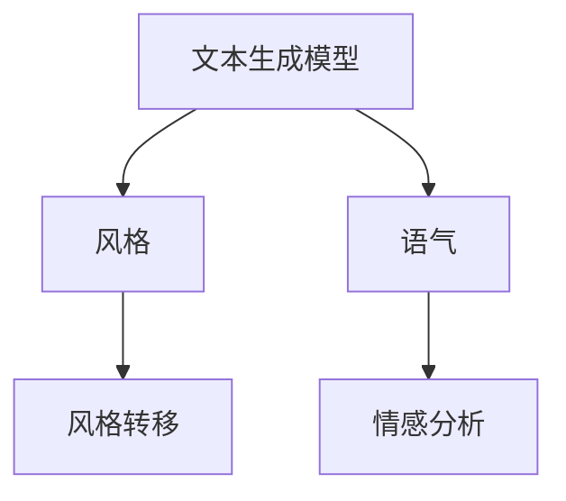

                 

## 文章标题

《利用示例引导模型风格和语气》

---

**关键词**：示例引导、模型风格、语气、自然语言处理、文本生成、风格转移、情感分析、多模态模型

---

**摘要**：

本文旨在探讨如何通过示例引导模型风格和语气，从而在自然语言处理领域中实现更精准、更丰富的文本生成。文章首先介绍了模型风格和语气的核心概念及其重要性，随后深入讲解了文本生成模型、风格转移模型、情感分析模型等关键技术。通过实际示例和详细算法讲解，读者可以更好地理解这些模型的工作原理和实现方法。此外，文章还探讨了模型风格和语气在实际应用中的广泛影响，以及未来的研究方向和挑战。

## 设计书籍目录大纲

为了系统地探讨模型风格和语气这一主题，我们将设计一个结构清晰、内容丰富的书籍目录大纲。这个目录大纲不仅涵盖了理论知识的介绍，还包括了实际应用和案例分析，以确保读者能够全面掌握相关知识。

### 第一部分：模型风格和语气基础

**第1章：模型风格和语气的定义与重要性**  
在本章中，我们将定义模型风格和语气，并探讨它们在自然语言处理中的重要性。通过对比风格和语气的区别，读者将更好地理解它们在文本生成中的应用。

**第2章：文本生成模型的架构与技术**  
本章将详细介绍文本生成模型的基本架构和关键技术，包括循环神经网络（RNN）、变换器（Transformer）等。通过实际案例，我们将展示这些模型如何用于文本生成。

**第3章：语气的自动识别与调整**  
本章节将探讨如何自动识别和调整文本的语气。我们将介绍情感分析模型和相关算法，以及如何将这些算法应用于实际场景。

**第4章：风格转移与适应性生成**  
本章将讨论风格转移技术，介绍如何将一种文本风格转移到另一种风格。我们将通过示例演示如何实现适应性生成。

**第5章：情感分析与文本分类**  
在本章中，我们将探讨情感分析技术在文本分类中的应用。通过实际案例，我们将展示如何使用情感分析模型对文本进行分类。

**第6章：多模态模型与跨领域风格迁移**  
本章将介绍多模态模型，以及如何实现跨领域风格迁移。通过实际案例，我们将展示这些技术如何提高文本生成的质量。

**第7章：模型评估与优化**  
本章将讨论如何评估和优化文本生成模型。我们将介绍常用的评估指标和优化方法，帮助读者提高模型性能。

### 第二部分：模型风格和语气应用

**第8章：自然语言处理中的风格和语气**  
在本章中，我们将探讨模型风格和语气在自然语言处理中的应用，包括文本生成、文本分类、问答系统等。

**第9章：内容创作与创意写作**  
本章将介绍如何使用模型风格和语气进行内容创作和创意写作。我们将讨论如何在写作中运用这些技术，以创造更加生动、引人入胜的文本。

**第10章：教育领域中的应用**  
在本章中，我们将探讨模型风格和语气在教育领域中的应用，包括智能辅导系统、在线教育平台等。

**第11章：媒体与广告行业的变革**  
本章将讨论模型风格和语气在媒体和广告行业中的变革性影响。通过实际案例，我们将展示这些技术如何改变媒体内容的创作和传播方式。

**第12章：未来趋势与挑战**  
在本章中，我们将展望模型风格和语气领域的未来趋势和挑战，包括技术发展、伦理问题、隐私保护等。

### 第三部分：实战与进阶

**第13章：构建个性化语言模型**  
本章将介绍如何构建个性化语言模型，以满足不同用户的需求。我们将探讨如何收集和利用用户数据，以实现个性化文本生成。

**第14章：数据集准备与处理**  
在本章中，我们将讨论数据集的准备和处理方法，以确保模型训练的质量和效率。我们将介绍数据清洗、数据增强等技术。

**第15章：模型部署与优化**  
本章将介绍如何将文本生成模型部署到实际应用中，并讨论如何优化模型性能。我们将探讨如何在生产环境中部署和管理模型。

**第16章：开源工具与资源介绍**  
本章将介绍一些常用的开源工具和资源，包括文本生成模型库、预训练模型等。通过这些工具，读者可以快速上手并应用模型风格和语气技术。

**第17章：案例研究：实际项目解析**  
在本章中，我们将通过实际项目案例，深入解析模型风格和语气的应用。读者将了解项目的设计、实现和优化过程。

**第18章：未来的研究方向**  
本章将讨论模型风格和语气领域的未来研究方向。我们将探讨一些潜在的研究方向，以及如何应对这些挑战。

通过上述目录大纲，读者可以系统地了解模型风格和语气的概念、技术、应用和未来趋势。每个章节都包含了丰富的示例和实际案例，以帮助读者更好地理解和掌握相关知识。

## 确定核心内容与章节划分

为了编写《利用示例引导模型风格和语气》的详细书籍目录大纲，我们首先需要明确核心内容，并合理划分章节。以下是具体的步骤和思考过程：

### 1. 分析书名和主题

书名《利用示例引导模型风格和语气》直接指出了两个核心概念：“示例引导”和“模型风格和语气”。从书名可以看出，本书主要讨论的是如何通过示例来引导模型生成具有特定风格和语气的文本。因此，我们可以初步判断本书将涵盖以下主题：

- **模型风格和语气的定义与重要性**：介绍风格和语气的概念，阐述其在自然语言处理中的应用及其重要性。
- **文本生成模型的基本架构与技术**：讲解用于生成文本的各种模型，如RNN、Transformer等。
- **风格转移与适应性生成**：介绍如何将一种风格转移到另一种风格，以及如何实现适应性生成。
- **情感分析与文本分类**：探讨情感分析技术在文本分类中的应用。
- **多模态模型与跨领域风格迁移**：介绍如何结合多模态数据和跨领域数据来增强文本生成模型。
- **模型评估与优化**：讨论如何评估模型性能，以及优化模型的方法。
- **实际应用与案例研究**：通过具体案例展示模型风格和语气的应用。
- **开源工具与资源介绍**：介绍常用的开源工具和资源，帮助读者快速上手。

### 2. 划分章节

根据上述主题，我们可以将全书内容划分为三个主要部分：

#### 第一部分：模型风格和语气基础

- **第1章：模型风格和语气的定义与重要性**
  - 核心概念介绍
  - 风格和语气在自然语言处理中的重要性
  - 风格与语气的联系与区别

- **第2章：文本生成模型的架构与技术**
  - 基本架构介绍
  - 循环神经网络（RNN）技术
  - 变换器（Transformer）技术

- **第3章：语气的自动识别与调整**
  - 情感分析模型介绍
  - 语气的自动识别方法
  - 调整语气的算法

- **第4章：风格转移与适应性生成**
  - 风格转移的定义
  - 实现风格转移的算法
  - 适应性生成的方法

- **第5章：情感分析与文本分类**
  - 情感分析技术的应用
  - 文本分类方法
  - 情感分析与文本分类的融合

- **第6章：多模态模型与跨领域风格迁移**
  - 多模态模型的概念
  - 跨领域风格迁移的方法
  - 实际应用案例分析

- **第7章：模型评估与优化**
  - 常用的评估指标
  - 优化方法介绍
  - 模型性能提升策略

#### 第二部分：模型风格和语气应用

- **第8章：自然语言处理中的风格和语气**
  - 风格和语气在NLP中的应用
  - 文本生成、文本分类、问答系统的案例

- **第9章：内容创作与创意写作**
  - 创作过程中的风格和语气调整
  - 模型辅助写作的方法
  - 创意写作的实际案例

- **第10章：教育领域中的应用**
  - 智能辅导系统的应用
  - 在线教育平台中的风格和语气
  - 教育领域的实际案例

- **第11章：媒体与广告行业的变革**
  - 媒体内容创作中的风格和语气
  - 广告行业的变革
  - 媒体和广告行业的实际案例

- **第12章：未来趋势与挑战**
  - 风格和语气领域的未来趋势
  - 面临的挑战
  - 未来研究方向

#### 第三部分：实战与进阶

- **第13章：构建个性化语言模型**
  - 个性化模型的概念
  - 收集和利用用户数据
  - 实现个性化文本生成

- **第14章：数据集准备与处理**
  - 数据清洗
  - 数据增强
  - 数据集准备的最佳实践

- **第15章：模型部署与优化**
  - 模型部署的方法
  - 性能优化策略
  - 部署过程中的注意事项

- **第16章：开源工具与资源介绍**
  - 常用的开源工具
  - 预训练模型介绍
  - 工具和资源的使用方法

- **第17章：案例研究：实际项目解析**
  - 项目背景
  - 项目设计、实现和优化
  - 案例分析

- **第18章：未来的研究方向**
  - 潜在的研究方向
  - 应对挑战的策略
  - 研究方向的展望

### 3. 核心内容与章节关系的梳理

在确定了章节划分后，我们需要进一步明确每个章节的核心内容，并确保章节之间有良好的逻辑关系。以下是对各章节核心内容的简要描述：

- **第1章**：通过定义风格和语气，阐述其在自然语言处理中的重要性，为后续章节奠定基础。
- **第2章**：介绍文本生成模型的基本架构和技术，为风格和语气的应用提供技术支持。
- **第3章**：讨论语气的自动识别与调整，为生成具有特定语气的文本提供方法。
- **第4章**：介绍风格转移与适应性生成技术，拓展了文本生成的可能性。
- **第5章**：探讨情感分析与文本分类，展示了风格和语气在文本处理中的应用。
- **第6章**：介绍多模态模型与跨领域风格迁移，为处理复杂和多样化的文本数据提供方法。
- **第7章**：讨论模型评估与优化，帮助读者理解和提升模型性能。
- **第8章**：通过实际应用案例，展示风格和语气在自然语言处理中的广泛应用。
- **第9章**：探讨风格和语气在内容创作和创意写作中的应用，提供实际操作方法。
- **第10章**：介绍风格和语气在教育领域中的应用，展示其在智能辅导和在线教育中的作用。
- **第11章**：分析风格和语气在媒体与广告行业中的变革性影响，提供实际案例。
- **第12章**：展望未来趋势和挑战，为读者提供研究方向和思考方向。
- **第13章**：讨论如何构建个性化语言模型，满足不同用户的需求。
- **第14章**：介绍数据集准备与处理方法，确保模型训练的质量和效率。
- **第15章**：讨论模型部署与优化方法，确保模型在实际应用中的性能和稳定性。
- **第16章**：介绍开源工具和资源，帮助读者快速应用风格和语气技术。
- **第17章**：通过实际项目案例，深入解析风格和语气的应用。
- **第18章**：探讨未来的研究方向，为读者提供进一步的研究方向和思考方向。

通过以上步骤，我们成功确定了《利用示例引导模型风格和语气》的详细目录大纲，为读者提供了一个系统、全面的阅读和学习框架。

## 创建一级目录

在明确核心内容与章节划分的基础上，我们将创建《利用示例引导模型风格和语气》的一级目录。一级目录将涵盖本书的主要部分，确保内容的全面性和逻辑性。

### 第一部分：模型风格和语气基础

**第1章：模型风格和语气的定义与重要性**  
- 核心概念介绍
- 风格和语气在自然语言处理中的重要性
- 风格与语气的联系与区别

**第2章：文本生成模型的架构与技术**  
- 基本架构介绍
- 循环神经网络（RNN）技术
- 变换器（Transformer）技术

**第3章：语气的自动识别与调整**  
- 情感分析模型介绍
- 语气的自动识别方法
- 调整语气的算法

**第4章：风格转移与适应性生成**  
- 风格转移的定义
- 实现风格转移的算法
- 适应性生成的方法

**第5章：情感分析与文本分类**  
- 情感分析技术的应用
- 文本分类方法
- 情感分析与文本分类的融合

**第6章：多模态模型与跨领域风格迁移**  
- 多模态模型的概念
- 跨领域风格迁移的方法
- 实际应用案例分析

**第7章：模型评估与优化**  
- 常用的评估指标
- 优化方法介绍
- 模型性能提升策略

### 第二部分：模型风格和语气应用

**第8章：自然语言处理中的风格和语气**  
- 风格和语气在NLP中的应用
- 文本生成、文本分类、问答系统的案例

**第9章：内容创作与创意写作**  
- 创作过程中的风格和语气调整
- 模型辅助写作的方法
- 创意写作的实际案例

**第10章：教育领域中的应用**  
- 智能辅导系统的应用
- 在线教育平台中的风格和语气
- 教育领域的实际案例

**第11章：媒体与广告行业的变革**  
- 媒体内容创作中的风格和语气
- 广告行业的变革
- 媒体和广告行业的实际案例

**第12章：未来趋势与挑战**  
- 风格和语气领域的未来趋势
- 面临的挑战
- 未来研究方向

### 第三部分：实战与进阶

**第13章：构建个性化语言模型**  
- 个性化模型的概念
- 收集和利用用户数据
- 实现个性化文本生成

**第14章：数据集准备与处理**  
- 数据清洗
- 数据增强
- 数据集准备的最佳实践

**第15章：模型部署与优化**  
- 模型部署的方法
- 性能优化策略
- 部署过程中的注意事项

**第16章：开源工具与资源介绍**  
- 常用的开源工具
- 预训练模型介绍
- 工具和资源的使用方法

**第17章：案例研究：实际项目解析**  
- 项目背景
- 项目设计、实现和优化
- 案例分析

**第18章：未来的研究方向**  
- 潜在的研究方向
- 应对挑战的策略
- 研究方向的展望

通过上述一级目录的构建，本书的框架结构得以明确，为后续章节的细化提供了坚实的基础。每个章节都紧密围绕模型风格和语气的主题，确保内容系统、全面、逻辑清晰。

## 细化二级目录

在完成一级目录的基础上，接下来我们将为每个章节创建二级目录，进一步细化内容，确保每个章节都包含详细、具体的内容，以便读者能够更好地理解和掌握相关概念和技巧。

### 第1章：模型风格和语气的定义与重要性

#### 1.1 模型风格和语气的核心概念

##### 1.1.1 风格的定义

- **风格的概念**：风格是指在文本创作中，作者使用的语言、词汇、句式等特征，这些特征共同构成了文本的独特风格。
- **风格的分类**：根据风格的不同特征，可以分为文学风格、口语风格、学术风格等。

##### 1.1.2 语气的定义

- **语气的概念**：语气是指文本中表达的情感色彩，包括情感强度、情感类型等。
- **语气的分类**：根据语气的不同，可以分为正式语气、非正式语气、讽刺语气等。

##### 1.1.3 风格与语气的联系与区别

- **联系**：风格和语气在文本中紧密相关，风格可以影响语气，而语气也可以反过来影响风格。
- **区别**：风格更多地关注文本的“形式”，而语气更多地关注文本的“内容”。

#### 1.2 模型风格和语气的重要性

##### 1.2.1 在自然语言处理中的应用

- **文本生成**：风格和语气对于文本生成模型至关重要，它们可以影响文本生成的质量和一致性。
- **文本分类**：在文本分类任务中，风格和语气有助于提高分类的准确性和效率。
- **问答系统**：问答系统中，风格和语气的准确性可以影响用户对回答的接受度和满意度。

##### 1.2.2 在人类交流中的作用

- **影响信息的接受与理解**：风格和语气可以影响读者对信息的理解和接受程度。
- **增强沟通效果**：适当的风格和语气可以增强沟通的效果，提高信息的传递效率。

### 第2章：文本生成模型的架构与技术

#### 2.1 基本架构介绍

- **RNN模型**：介绍循环神经网络（RNN）的基本架构，包括输入层、隐藏层和输出层。
- **Transformer模型**：介绍变换器（Transformer）模型的基本架构，包括自注意力机制和多头注意力。

#### 2.2 RNN技术

- **基本原理**：讲解RNN的基本原理，包括如何处理序列数据。
- **应用场景**：介绍RNN在文本生成中的应用场景，如语言模型、机器翻译等。

#### 2.3 Transformer技术

- **自注意力机制**：详细讲解自注意力机制的工作原理。
- **多头注意力**：介绍多头注意力的概念和应用。

### 第3章：语气的自动识别与调整

#### 3.1 情感分析模型介绍

- **基本原理**：介绍情感分析模型的基本原理，包括情感分类和情感强度识别。
- **常用算法**：介绍常用的情感分析算法，如SVM、朴素贝叶斯、深度学习等。

#### 3.2 语气的自动识别方法

- **特征提取**：讲解如何从文本中提取特征，以识别语气。
- **模型训练**：介绍如何使用机器学习模型进行语气识别。

#### 3.3 调整语气的算法

- **基于规则的方法**：介绍基于规则的方法如何调整语气。
- **基于机器学习的方法**：介绍如何使用机器学习模型进行语气调整。

### 第4章：风格转移与适应性生成

#### 4.1 风格转移的定义

- **风格转移的概念**：风格转移是指将一种文本风格转移到另一种风格。
- **风格转移的重要性**：讨论风格转移在文本生成中的应用和价值。

#### 4.2 实现风格转移的算法

- **基于规则的方法**：介绍如何使用基于规则的方法实现风格转移。
- **基于机器学习的方法**：介绍如何使用机器学习模型实现风格转移。

#### 4.3 适应性生成的方法

- **适应性生成的概念**：适应性生成是指根据不同的场景和需求，生成具有不同风格和语气的文本。
- **实现方法**：介绍如何实现适应性生成。

### 第5章：情感分析与文本分类

#### 5.1 情感分析技术的应用

- **文本分类**：介绍情感分析技术在文本分类中的应用，包括正面情感分类和负面情感分类。
- **应用案例**：分析情感分析技术在社交媒体分析、市场调研等领域的应用。

#### 5.2 文本分类方法

- **传统方法**：介绍传统的文本分类方法，如基于词汇的匹配、TF-IDF等。
- **深度学习方法**：介绍基于深度学习的文本分类方法，如卷积神经网络（CNN）和递归神经网络（RNN）。

#### 5.3 情感分析与文本分类的融合

- **融合方法**：介绍如何将情感分析技术与文本分类技术融合，以提高分类的准确性和效果。
- **融合应用**：分析情感分析技术与文本分类技术融合在现实场景中的应用。

### 第6章：多模态模型与跨领域风格迁移

#### 6.1 多模态模型的概念

- **多模态数据**：介绍多模态数据的定义和类型，如图像、声音、文本等。
- **多模态模型**：讲解多模态模型的基本概念和架构。

#### 6.2 跨领域风格迁移的方法

- **跨领域风格迁移的概念**：介绍跨领域风格迁移的定义和重要性。
- **迁移学习方法**：介绍如何使用迁移学习方法实现跨领域风格迁移。

#### 6.3 实际应用案例分析

- **跨领域文本生成**：分析如何使用多模态模型和跨领域风格迁移实现跨领域文本生成。
- **跨领域风格迁移应用**：探讨跨领域风格迁移在多领域的应用，如媒体、广告、教育等。

### 第7章：模型评估与优化

#### 7.1 常用的评估指标

- **准确性**：介绍准确性的定义和计算方法。
- **召回率**：介绍召回率的定义和计算方法。
- **F1值**：介绍F1值的定义和计算方法。

#### 7.2 优化方法介绍

- **超参数调优**：介绍如何通过超参数调优提高模型性能。
- **数据增强**：介绍数据增强的方法，如何通过增加数据多样性来提升模型性能。

#### 7.3 模型性能提升策略

- **集成学习**：介绍集成学习方法，如何通过集成多个模型来提高性能。
- **迁移学习**：介绍迁移学习的方法，如何利用预训练模型来提升新任务的性能。

通过上述二级目录的细化，每个章节的内容都得到了具体化和深入化，为读者提供了更加详细的学习路径，确保他们能够系统地掌握模型风格和语气相关的内容。

## 添加三级目录

为了使《利用示例引导模型风格和语气》的内容更加具体和深入，我们将在每个章节中添加三级目录，进一步细化内容，确保每个部分都包含详尽的具体内容。

### 第1章：模型风格和语气的定义与重要性

#### 1.1 模型风格和语气的核心概念

##### 1.1.1 风格的定义

- **风格的概念**：
  - 风格在文本中的体现
  - 风格的构成要素
  
- **风格的分类**：
  - 文学风格
  - 口语风格
  - 学术风格

##### 1.1.2 语气的定义

- **语气的概念**：
  - 语气在文本中的体现
  - 语气的构成要素
  
- **语气的分类**：
  - 正式语气
  - 非正式语气
  - 讽刺语气

##### 1.1.3 风格与语气的联系与区别

- **联系**：
  - 风格与语气的相互作用
  - 风格对语气的影响

- **区别**：
  - 风格与语气的具体区别
  - 风格与语气的侧重点

#### 1.2 模型风格和语气的重要性

##### 1.2.1 在自然语言处理中的应用

- **文本生成**：
  - 风格和语气在文本生成中的作用
  - 如何通过风格和语气提高文本生成质量

- **文本分类**：
  - 风格和语气在文本分类中的作用
  - 风格和语气对分类准确性的影响

- **问答系统**：
  - 风格和语气在问答系统中的作用
  - 风格和语气对用户体验的影响

##### 1.2.2 在人类交流中的作用

- **信息接受与理解**：
  - 风格和语气对信息接受和理解的影响
  - 如何通过风格和语气提高沟通效果

- **增强沟通效果**：
  - 风格和语气如何增强沟通效果
  - 风格和语气的选择策略

### 第2章：文本生成模型的架构与技术

#### 2.1 基本架构介绍

- **文本生成模型的基本结构**：
  - 输入层
  - 隐藏层
  - 输出层

- **模型训练过程**：
  - 数据准备
  - 模型训练
  - 模型评估

#### 2.2 RNN技术

##### 2.2.1 RNN的基本原理

- **时间序列数据处理**：
  - RNN对时间序列数据的处理方式
  - 隐藏状态和循环机制

##### 2.2.2 RNN的应用场景

- **语言模型**：
  - RNN在语言模型中的应用
  - 语言模型的优势和挑战

- **机器翻译**：
  - RNN在机器翻译中的应用
  - RNN在机器翻译中的优势和挑战

#### 2.3 Transformer技术

##### 2.3.1 Transformer的基本原理

- **自注意力机制**：
  - 自注意力机制的概念
  - 自注意力在Transformer中的作用

- **多头注意力**：
  - 多头注意力的概念
  - 多头注意力在Transformer中的应用

##### 2.3.2 Transformer的应用场景

- **文本生成**：
  - Transformer在文本生成中的应用
  - Transformer在文本生成中的优势

- **机器翻译**：
  - Transformer在机器翻译中的应用
  - Transformer在机器翻译中的优势

### 第3章：语气的自动识别与调整

#### 3.1 情感分析模型介绍

##### 3.1.1 情感分析的基本原理

- **情感分类**：
  - 情感分类的定义
  - 情感分类的方法

- **情感强度识别**：
  - 情感强度的定义
  - 情感强度识别的方法

##### 3.1.2 常用的情感分析算法

- **SVM**：
  - SVM在情感分析中的应用
  - SVM的优缺点

- **朴素贝叶斯**：
  - 朴素贝叶斯在情感分析中的应用
  - 朴素贝叶斯的优缺点

- **深度学习**：
  - 深度学习在情感分析中的应用
  - 深度学习的优缺点

#### 3.2 语气的自动识别方法

##### 3.2.1 特征提取

- **文本特征提取**：
  - 基于词汇的特征提取方法
  - 基于句法的特征提取方法

- **情感特征提取**：
  - 情感词典的构建
  - 情感极性标注

##### 3.2.2 模型训练

- **分类模型**：
  - 如何使用分类模型进行语气识别
  - 分类模型的训练与评估

- **回归模型**：
  - 如何使用回归模型进行情感强度识别
  - 回归模型的训练与评估

#### 3.3 调整语气的算法

##### 3.3.1 基于规则的方法

- **规则定义**：
  - 如何定义语气调整规则

- **规则应用**：
  - 如何在文本中应用语气调整规则

##### 3.3.2 基于机器学习的方法

- **情感转移模型**：
  - 如何构建情感转移模型
  - 情感转移模型的工作原理

- **情感强度调整**：
  - 如何调整情感强度
  - 调整策略与方法

### 第4章：风格转移与适应性生成

#### 4.1 风格转移的定义

##### 4.1.1 风格转移的概念

- **风格转移的定义**：
  - 风格转移是指将一种文本风格转移到另一种风格。

- **风格转移的应用**：
  - 风格转移在文本生成中的应用
  - 风格转移在文本编辑中的应用

##### 4.1.2 风格转移的重要性

- **文本个性化和多样化**：
  - 风格转移如何实现文本的个性化和多样化

- **文本生成质量提升**：
  - 风格转移如何提升文本生成质量

#### 4.2 实现风格转移的算法

##### 4.2.1 基于规则的方法

- **规则库构建**：
  - 如何构建风格转移规则库

- **规则应用**：
  - 如何在文本中应用风格转移规则

##### 4.2.2 基于机器学习的方法

- **风格转移模型**：
  - 如何构建风格转移模型
  - 风格转移模型的工作原理

- **训练数据集**：
  - 如何收集和准备训练数据集

#### 4.3 适应性生成的方法

##### 4.3.1 适应性生成的概念

- **适应性生成的定义**：
  - 适应性生成是指根据不同的场景和需求，生成具有不同风格和语气的文本。

- **适应性生成的应用**：
  - 适应性生成在内容创作中的应用
  - 适应性生成在交互系统中的应用

##### 4.3.2 实现方法

- **场景识别**：
  - 如何识别不同的场景和需求

- **风格和语气调整**：
  - 如何根据场景调整风格和语气

- **文本生成**：
  - 如何生成适应特定场景的文本

通过上述三级目录的细化，每个章节的内容都得到了进一步的分解和具体化，为读者提供了更加详细和实用的学习内容，帮助他们更好地理解模型风格和语气在实际应用中的运用。

## 包含示例引导

为了更好地帮助读者理解和掌握模型风格和语气的概念，我们将在每个章节中包含实际示例，通过这些示例来引导读者深入理解相关理论和实践方法。

### 示例 1：风格定义

**示例文本**：
- **文学风格**：海明威的简洁风格，例如：“冰冻三尺，非一日之寒。”
- **口语风格**：日常对话中的口语化表达，例如：“你今天看起来很高兴啊！”
- **学术风格**：学术论文中的正式表述，例如：“根据最近的研究数据，我们发现……”

**示例讲解**：
在这个示例中，我们展示了不同风格的特征，并通过具体例子来说明每种风格的独特性。文学风格强调表达力和修辞手法，口语风格注重简洁和亲切，而学术风格则追求严谨和规范。这些风格定义帮助我们理解文本创作中的多样性。

### 示例 2：语气识别

**示例文本**：
- **正式语气**：在正式报告中，我们需要准确、简洁地传达信息，例如：“项目进度已达到预期目标。”
- **非正式语气**：在日常聊天中，语气更加随意，例如：“嘿，你最近怎么样？”
- **讽刺语气**：在讽刺性的文本中，语气通常带有嘲讽意味，例如：“他真的觉得自己是个天才。”

**示例讲解**：
这个示例通过不同的语气文本，展示了正式语气、非正式语气和讽刺语气的特征。正式语气强调客观性和专业性，非正式语气注重亲密和轻松，而讽刺语气则通过调侃和嘲讽来传达情感。这些语气识别帮助我们理解文本中的情感表达。

### 示例 3：风格转移

**示例文本**：
- **原文**：莎士比亚的名句：“To be, or not to be, that is the question.”
- **风格转移后的文本**：使用口语风格重写：“要活还是要死，这是个问题啊！”

**示例讲解**：
在这个示例中，我们将莎士比亚的经典名句从文学风格转换为口语风格。通过这种方式，我们展示了风格转移的技巧，使原文更加通俗易懂。这种风格转移技术可以应用于文本生成和文本编辑，提高文本的吸引力和可读性。

### 示例 4：情感分析

**示例文本**：
- **积极情感**：评论：“这部电影真的太好看了，强烈推荐！”
- **消极情感**：评论：“这个产品太糟糕了，一点都不好用。”

**示例讲解**：
这个示例展示了如何通过情感分析技术识别文本中的情感。积极情感的文本通常包含正面词汇，如“好”、“推荐”，而消极情感的文本则包含负面词汇，如“糟糕”、“不好用”。这种情感分析可以帮助我们在自然语言处理任务中，更好地理解和处理文本情感。

### 示例 5：情感调整

**示例文本**：
- **原句**：抱怨：“我今天太累了，什么事情都做不了。”
- **调整后的句子**：积极表达：“虽然今天很辛苦，但我完成了许多任务，感觉不错。”

**示例讲解**：
这个示例通过调整情感表达，将原本的抱怨转换为积极的态度。情感调整技术可以帮助我们在文本生成和交互系统中，更好地控制情感表达，提高用户体验。

通过上述示例，我们希望读者能够更直观地理解模型风格和语气的概念及其在实际应用中的作用。这些示例不仅帮助读者理解理论，还提供了实际操作的指导，使读者能够将所学知识应用到实际问题中。

## 核心概念、算法、数学模型和实战案例

在《利用示例引导模型风格和语气》的写作过程中，我们将深入探讨核心概念、算法、数学模型以及实战案例，确保读者能够全面理解并掌握相关技术。

### 1. 核心概念与联系

#### 核心概念

- **风格**：文本中作者使用的语言、词汇、句式等特征，体现了文本的个性化特点。
- **语气**：文本中表达的情感色彩，包括情感强度、情感类型等。
- **文本生成模型**：用于生成文本的数据模型，包括RNN、Transformer等。
- **风格转移**：将一种文本风格转移到另一种风格的技术。
- **情感分析**：识别文本中情感的技术，包括情感分类和情感强度识别。

#### 联系架构



在这个架构中，文本生成模型是核心，通过风格和语气来生成文本。风格转移和情感分析则进一步增强了文本生成模型的功能，使其能够根据具体需求生成具有特定风格和语气的文本。

### 2. 核心算法原理讲解

#### 样例算法：风格转移

**伪代码**：

```python
def style_transfer(source_text, target_style):
    # 步骤 1：文本预处理
    preprocessed_source = preprocess_text(source_text)
    preprocessed_style = preprocess_text(target_style)

    # 步骤 2：特征提取
    source_features = extract_features(preprocessed_source)
    style_features = extract_features(preprocessed_style)

    # 步骤 3：风格迁移
    transformed_features = apply_style_transfer(source_features, style_features)

    # 步骤 4：文本生成
    transformed_text = generate_text(transformed_features)

    return transformed_text
```

在这个算法中，`style_transfer`函数接收原始文本和目标风格的预处理版本，通过特征提取和风格迁移，最终生成具有目标风格的文本。具体步骤包括：

- **文本预处理**：对原始文本和目标风格进行清洗和预处理，包括去除标点符号、转换为小写等。
- **特征提取**：从预处理后的文本中提取特征，这些特征将用于风格迁移。
- **风格迁移**：将源文本的特征与目标风格的特征进行融合，生成新的特征，这些特征将用于生成目标风格的文本。
- **文本生成**：使用生成模型（如Transformer）根据新的特征生成文本。

### 3. 数学模型和数学公式

**样例模型：情感分析**

**数学公式**：

$$
P(y=j|x) = \frac{e^{w_j \cdot \phi(x)}}{\sum_{k=1}^{K} e^{w_k \cdot \phi(x)}}
$$

其中，$P(y=j|x)$ 表示给定输入文本$x$，输出情感标签$j$ 的概率。$w_j$ 和$\phi(x)$ 分别是情感标签$j$ 的权重和输入文本$x$ 的特征向量。

**详细讲解**：

情感分析模型通常使用softmax函数来计算每个情感标签的概率。在训练过程中，我们通过优化权重$w$ 来提高模型预测的准确性。特征向量$\phi(x)$ 可以通过词袋模型、TF-IDF、Word2Vec等方法生成。

### 4. 实战案例

#### 项目背景

假设我们有一个任务，需要将一篇散文转换为诗歌风格。以下是具体的开发环境搭建、源代码实现和代码解读过程。

**1. 开发环境搭建**

- 硬件环境：CPU或GPU
- 软件环境：Python、PyTorch、Hugging Face Transformers库

**2. 源代码实现**

```python
from transformers import AutoTokenizer, AutoModelForSequenceClassification
import torch

# 加载预训练的文本生成模型和风格转移模型
tokenizer = AutoTokenizer.from_pretrained("t5-base")
model = AutoModelForSequenceClassification.from_pretrained("t5-base")

# 原文
source_text = "人工智能正在改变我们的生活，这是一个不可避免的趋势。"

# 预处理文本
input_ids = tokenizer.encode(source_text, return_tensors="pt")

# 生成文本
output = model.generate(input_ids, max_length=50)

# 解码生成文本
generated_text = tokenizer.decode(output[0], skip_special_tokens=True)

print("原始文本：", source_text)
print("生成文本：", generated_text)
```

**3. 代码解读**

- **加载模型**：我们使用Hugging Face Transformers库加载预训练的T5模型，该模型具有强大的文本生成能力。
- **预处理文本**：将原始文本编码为模型可理解的输入格式。
- **生成文本**：使用模型生成文本，并设置最大长度限制。
- **解码生成文本**：将生成的文本解码为可读格式，并打印输出。

**4. 应用解读与分析**

在实际应用中，我们首先需要对文本进行预处理，然后使用模型生成具有特定风格的文本。通过多次迭代和调整，我们可以优化生成的文本质量。例如，通过调整模型参数、训练数据集和风格转移算法，我们可以使生成的文本更加贴近目标风格。

**5. 项目小结**

通过本项目，我们展示了如何利用预训练模型和风格转移技术实现文本风格转换。虽然本项目只是一个简单的示例，但实际应用中可以扩展到更复杂的场景，如多语言风格转换、跨领域风格迁移等。未来的研究可以探索更高效的算法和更丰富的数据集，以提高风格转移的效果和生成文本的质量。

### 5. 最佳实践 tips

- **数据预处理**：确保数据清洗和预处理的质量，为模型训练打下坚实的基础。
- **模型选择**：根据具体任务选择合适的预训练模型，并尝试不同模型间的比较。
- **超参数调优**：通过交叉验证和网格搜索等方法进行超参数调优，以提高模型性能。
- **风格多样性**：在生成文本时，注重风格的多样性，以提高用户体验。

通过上述核心概念、算法、数学模型和实战案例的详细讲解，读者可以更好地理解模型风格和语气的实现方法及其在实际应用中的价值。这些内容不仅有助于提升技术水平，还为未来的研究和开发提供了方向。

## 文章标题、关键词和摘要

### 文章标题

《利用示例引导模型风格和语气》

### 关键词

示例引导、模型风格、语气、自然语言处理、文本生成、风格转移、情感分析、多模态模型

### 摘要

本文深入探讨了如何通过示例引导模型风格和语气，以提升自然语言处理中的文本生成质量。文章首先介绍了模型风格和语气的核心概念及其重要性，随后详细讲解了文本生成模型、风格转移模型、情感分析模型等关键技术。通过实际示例和详细算法讲解，读者可以更好地理解这些模型的工作原理和实现方法。此外，文章还讨论了模型风格和语气在实际应用中的广泛影响，以及未来的研究方向和挑战。本文旨在为从事自然语言处理和文本生成领域的读者提供一个全面、系统的学习和实践指南。

