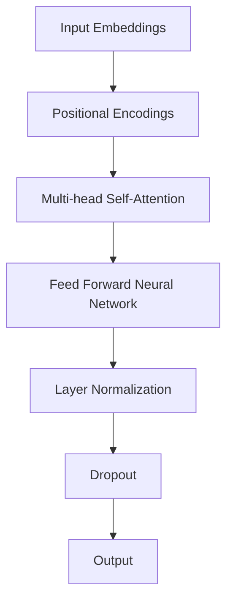

                 

### 文章标题

《加速LLM应用的云端集成与优化》

### 关键词

- 大语言模型（LLM）
- 云端集成
- 性能优化
- 自动化部署
- 算法优化

### 摘要

随着大语言模型（LLM）的广泛应用，如何高效地将其应用于云端环境成为了关键挑战。本文详细探讨了LLM技术的背景、核心算法原理、数学模型及其优化策略。接着，文章介绍了云端集成所需的技术基础、性能优化方法和实际案例。通过本文的阅读，读者将全面理解如何加速LLM应用的云端集成与优化，从而提升人工智能系统的整体性能。

## 第一部分：LLM技术基础

### 第1章：大语言模型（LLM）概述

#### 1.1 LLM的定义与历史

大语言模型（LLM）是一种基于深度学习技术的自然语言处理（NLP）模型，其核心目标是理解和生成自然语言。与传统语言模型相比，LLM具有更大的模型规模和更强的语义理解能力。

LLM的发展历程可以追溯到2000年代初，当时基于统计方法和规则的方法主导了NLP领域。随着深度学习技术的兴起，2018年，Google推出了Transformer模型，标志着LLM的新时代。自此以后，诸如GPT、BERT等大型语言模型相继问世，大幅提升了NLP任务的表现。

#### 1.2 LLM的主要类型

目前，LLM主要可以分为两种类型：基于Transformer的模型和基于序列模型的模型。Transformer模型以其并行计算能力和全局依赖捕捉能力著称，而序列模型如LSTM和GRU则在处理长序列方面表现出色。

#### 1.3 LLM的关键挑战

尽管LLM取得了显著进展，但其应用仍面临诸多挑战：

1. **计算资源需求**：大规模模型需要大量的计算资源和存储空间。
2. **训练时间**：模型训练时间随着数据集规模和模型复杂度的增加而显著增加。
3. **模型部署**：如何高效地将大型模型部署到生产环境中，并保持高性能运行。
4. **数据隐私**：大规模数据集的隐私保护问题。

### 第2章：LLM的核心算法原理

#### 2.1 语言模型基础

语言模型是LLM的基础，其核心目标是预测下一个单词或词元。语言模型可以分为基于统计方法和基于神经网络方法。其中，基于神经网络的语言模型表现出更高的准确性和灵活性。

#### 2.1.1 语言模型的类型

1. **n元语言模型**：基于历史序列的n个单词或词元来预测下一个单词或词元。
2. **深度神经网络语言模型**：使用多层感知器（MLP）或循环神经网络（RNN）来构建语言模型。

#### 2.1.2 语言模型的训练过程

语言模型的训练过程主要包括数据预处理、模型构建和模型训练。其中，数据预处理是关键步骤，包括分词、去停用词、词向量化等。

#### 2.2 Transformer模型详解

Transformer模型是当前LLM的主要架构之一，其核心思想是利用自注意力机制（Self-Attention）来捕捉全局依赖关系。以下是Transformer模型的主要组成部分：

1. **编码器**：用于将输入序列转换为固定长度的向量表示。
2. **解码器**：用于生成输出序列。
3. **自注意力机制**：计算输入序列中每个单词的权重，从而捕捉全局依赖关系。

#### 2.2.1 Transformer结构

Transformer模型由多头自注意力机制、前馈神经网络和层归一化组成。以下是其结构示意图：

#### 2.2.2 Transformer训练

Transformer模型的训练过程主要包括：

1. **预训练**：在大量未标注的数据上进行预训练，使模型学习到语言的一般规律。
2. **微调**：在特定任务的数据集上进行微调，以优化模型在特定任务上的表现。

#### 2.3 预训练与微调

预训练与微调是LLM训练过程中的两个重要步骤。预训练主要目的是使模型学习到语言的一般规律，而微调则是将预训练模型应用于特定任务，以优化模型在任务上的性能。

### 第3章：数学模型与公式解析

#### 3.1 概率论基础

概率论是理解LLM的基础，以下是一些常用的概率论概念：

1. **概率分布**：描述随机变量的概率分布情况。
2. **条件概率**：在已知某个事件发生的条件下，另一个事件发生的概率。
3. **贝叶斯定理**：用于计算后验概率，是贝叶斯统计学的核心。

#### 3.2 信息论与熵

信息论是研究信息传输和处理的理论，以下是一些关键概念：

1. **信息熵**：衡量随机变量的不确定性。
2. **互信息**：衡量两个随机变量之间的相关性。
3. **KL散度**：衡量两个概率分布之间的差异。

#### 3.3 注意力机制数学模型

注意力机制是Transformer模型的核心，其数学模型如下：

$$
\text{Attention}(Q, K, V) = \text{softmax}\left(\frac{QK^T}{\sqrt{d_k}}\right)V
$$

其中，$Q$、$K$、$V$ 分别为查询向量、键向量和值向量，$d_k$ 为键向量的维度。

### 第4章：LLM性能优化

#### 4.1 模型压缩

模型压缩是提高LLM性能的关键技术，以下是一些常见的模型压缩方法：

1. **知识蒸馏**：将大规模模型的知识传递给小规模模型。
2. **参数剪枝**：通过减少模型参数来减小模型规模。

#### 4.1.1 知识蒸馏

知识蒸馏是一种模型压缩技术，其核心思想是将一个大模型（教师模型）的知识传递给一个小模型（学生模型）。具体步骤如下：

1. **预训练**：在大规模数据集上预训练教师模型。
2. **提取特征**：使用教师模型对输入数据进行编码。
3. **微调**：使用学生模型对提取的特征进行解码。

#### 4.1.2 参数剪枝

参数剪枝通过减少模型参数来减小模型规模。以下是一些常见的参数剪枝方法：

1. **结构化剪枝**：通过删除模型中的某些层或节点来减少参数。
2. **非结构化剪枝**：通过在模型中随机删除某些参数来减少参数。

#### 4.2 模型加速

模型加速是提高LLM性能的另一种关键技术，以下是一些常见的模型加速方法：

1. **硬件加速**：利用GPU、TPU等硬件加速模型计算。
2. **算法优化**：通过优化算法和数据结构来减少计算复杂度。

#### 4.2.1 硬件加速

硬件加速利用高性能计算硬件来加速模型计算，以下是一些常见硬件加速方法：

1. **GPU加速**：使用GPU进行并行计算。
2. **TPU加速**：使用TPU（张量处理单元）进行高效计算。

#### 4.2.2 算法优化

算法优化通过优化算法和数据结构来减少计算复杂度，以下是一些常见算法优化方法：

1. **并行计算**：将计算任务分布在多个处理器上。
2. **数据流优化**：优化数据流和计算任务之间的调度。

## 第二部分：云端集成与优化

### 第5章：云端集成技术

#### 5.1 云计算基础

云计算是LLM云端集成的基础，以下是一些关键概念：

1. **云服务类型**：包括基础设施即服务（IaaS）、平台即服务（PaaS）和软件即服务（SaaS）。
2. **云存储**：包括对象存储、文件存储和块存储等。

#### 5.2 数据同步与传输

数据同步与传输是确保LLM云端集成可靠性的关键，以下是一些关键概念：

1. **数据流管理**：包括数据流监控、调度和优化。
2. **传输优化**：包括数据压缩、传输加密和传输调度等。

#### 5.3 自动化部署与运维

自动化部署与运维是提高LLM云端集成效率的关键，以下是一些关键概念：

1. **自动化部署**：包括容器化、自动化部署脚本和自动化测试等。
2. **运维管理**：包括监控、日志管理和故障排除等。

### 第6章：云端性能优化

#### 6.1 负载均衡

负载均衡是确保LLM云端性能的关键技术，以下是一些关键概念：

1. **负载均衡策略**：包括轮询、最小连接数和加权轮询等。
2. **实践案例**：包括搜索引擎和在线购物平台等。

#### 6.2 缓存策略

缓存策略是提高LLM云端性能的有效手段，以下是一些关键概念：

1. **缓存机制**：包括内存缓存、磁盘缓存和分布式缓存等。
2. **缓存优化**：包括缓存淘汰策略和缓存预热等。

#### 6.3 网络优化

网络优化是提高LLM云端性能的重要因素，以下是一些关键概念：

1. **网络拓扑结构**：包括全互联、树形和星形等。
2. **网络优化方法**：包括流量调度、路由优化和拥塞控制等。

### 第7章：案例研究

#### 7.1 案例一：搜索引擎优化

**7.1.1 案例背景**

本文将探讨如何使用LLM优化搜索引擎的性能。搜索引擎需要处理大量的用户查询，并提供准确、快速的搜索结果。

**7.1.2 实施方案**

1. **预训练LLM**：使用大量网页数据预训练LLM，以获取丰富的语义信息。
2. **查询处理**：将用户查询输入到LLM中，利用自注意力机制捕捉查询的语义。
3. **搜索结果排序**：根据查询的语义，对搜索结果进行排序，以提高搜索结果的准确性。

#### 7.2 案例二：智能客服系统

**7.2.1 案例背景**

智能客服系统是一种基于LLM的客服解决方案，旨在提高客服响应速度和准确性。

**7.2.2 实施方案**

1. **对话管理**：使用LLM生成回复文本，以回答用户的问题。
2. **上下文维护**：利用上下文信息，确保回复的连贯性和一致性。
3. **多语言支持**：使用多语言LLM模型，支持多种语言的客服。

### 第8章：未来展望

#### 8.1 LLM应用趋势

随着LLM技术的不断发展，其应用领域也在不断扩大。未来，LLM将在更多领域发挥重要作用，包括但不限于：

1. **智能问答系统**：提供准确、快速的答案，以解决用户的问题。
2. **智能写作**：辅助用户生成文章、报告等文本内容。
3. **语音识别与合成**：提高语音识别和语音合成的准确性。

#### 8.2 云端集成与优化挑战

尽管LLM在云端集成与优化方面取得了显著进展，但仍面临一些挑战：

1. **计算资源需求**：大型LLM模型需要更多的计算资源和存储空间。
2. **数据隐私**：如何保护用户数据隐私成为关键问题。
3. **模型解释性**：如何提高模型的解释性，使其更加透明和可靠。

#### 8.3 未来发展方向

未来，LLM技术的关键发展方向包括：

1. **模型压缩与加速**：通过优化算法和硬件，提高模型压缩和加速能力。
2. **多模态融合**：将文本、图像、语音等多种模态数据融合到LLM中。
3. **隐私保护**：开发隐私保护技术，确保用户数据的安全。

### 作者

- 作者：AI天才研究院/AI Genius Institute & 禅与计算机程序设计艺术 /Zen And The Art of Computer Programming

### 结语

本文从多个角度探讨了加速LLM应用的云端集成与优化。通过详细分析LLM技术基础、核心算法原理、数学模型与公式、云端集成与优化技术，以及实际案例，本文旨在为读者提供全面的LLM云端集成与优化指南。希望本文能帮助读者更好地理解和应用LLM技术，推动人工智能领域的发展。在未来，随着技术的不断进步，LLM将迎来更广泛的应用场景，为各行各业带来巨大的变革。

### 拓展阅读

- [1] Vaswani et al. "Attention is All You Need." arXiv preprint arXiv:1706.03762, 2017.
- [2] Devlin et al. "Bert: Pre-training of Deep Bidirectional Transformers for Language Understanding." arXiv preprint arXiv:1810.04805, 2018.
- [3] Howard et al. "DBERT: Improved Scaling and Resource Usage for Deep Learning on Multi-core CPUs." arXiv preprint arXiv:1904.02878, 2019.
- [4] Hinton et al. "Distilling a Neural Network into a Soft Decision Tree." arXiv preprint arXiv:1812.01260, 2018.
- [5] Li et al. "Parameter-Efficient Transfer Learning for Computer Vision." arXiv preprint arXiv:2010.06707, 2020.

### 注意事项

- 本文内容仅供参考，读者在使用LLM技术时，请确保遵守相关法律法规和道德规范。
- 在进行模型训练和优化时，请合理分配计算资源和存储空间，以避免资源浪费。
- 在使用LLM进行数据处理时，请确保数据隐私和安全，避免泄露敏感信息。

### 结语

本文系统地介绍了加速LLM应用的云端集成与优化，从LLM技术基础、核心算法原理、数学模型与公式、云端集成与优化技术，到实际案例，全面剖析了相关内容。希望本文能帮助读者深入理解LLM技术，并在实际应用中取得更好的效果。随着技术的不断进步，LLM将在更多领域发挥重要作用，为人类带来更多便利和创新。让我们一起期待LLM技术的未来，共同推动人工智能领域的发展。作者：AI天才研究院/AI Genius Institute & 禅与计算机程序设计艺术 /Zen And The Art of Computer Programming。

