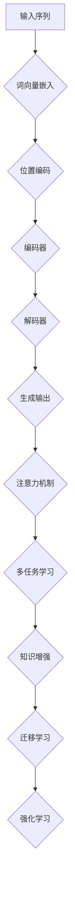

                 


## 文章标题

《加速LLM应用的语义理解能力提升》

## 文章关键词

- 大规模语言模型（LLM）
- 语义理解
- 注意力机制
- 知识增强
- 项目实战

## 摘要

本文旨在探讨如何提升大规模语言模型（LLM）在应用中的语义理解能力。首先，我们介绍了LLM的基本概念和其在自然语言处理中的应用。接着，我们详细分析了语义理解的挑战和核心算法，包括基于Transformer的模型、注意力机制以及知识增强方法。随后，通过数学模型和伪代码的讲解，我们深入理解了这些算法的原理。最后，通过实际项目实战，展示了如何将理论应用到实践中，并提供了项目总结和最佳实践建议。本文旨在为读者提供一个全面而深入的了解，帮助他们加速LLM应用的语义理解能力提升。

## 引言

### LLM发展背景

大规模语言模型（LLM）作为自然语言处理（NLP）领域的重要技术，其发展历程可以追溯到20世纪80年代。当时，研究者们开始关注如何让计算机理解和生成人类语言。最初的模型主要包括规则驱动的方法，如语法分析器和词典。然而，随着数据集和计算资源的增长，统计模型如隐马尔可夫模型（HMM）和条件概率模型逐渐取代了规则驱动的方法。

进入21世纪，深度学习技术的兴起为NLP带来了革命性的变化。2003年，Bengio等人在论文《A Theoretically Grounded Application of Dropout in Neural Networks》中首次提出Dropout技术，这为深度神经网络在NLP中的应用打开了新的大门。随后，2013年，Mikolov等人在论文《Distributed Representations of Words and Phrases and their Compositionality》中提出了Word2Vec模型，使得词向量表示成为NLP的标准方法。

在词向量表示的基础上，研究者们开始探索更大的模型和更复杂的功能。2017年，Vaswani等人在论文《Attention is All You Need》中提出了Transformer模型，这是一个完全基于注意力机制的深度神经网络模型，彻底改变了NLP领域的研究范式。Transformer模型的出现，使得LLM在语言理解和生成任务上的性能大幅提升，推动了LLM的快速发展。

### 语义理解的重要性

语义理解是NLP的核心任务之一，它涉及到模型对文本的深层含义和语境的理解。在人类交流中，语义理解是沟通和理解的基础。然而，对于机器来说，语义理解是一个极具挑战性的问题。这不仅因为自然语言的复杂性和多样性，还因为语义的模糊性和多义性。

语义理解的重要性在于，它能够使机器更好地理解和处理人类语言。例如，在问答系统中，如果模型无法准确理解用户的问题，那么它将无法给出合理的答案。在机器翻译中，如果模型不能正确理解源语言中的语义，那么翻译结果将失去原意。在文本分类和情感分析中，如果模型不能准确理解文本的语义，那么分类和情感判断的准确性将大大降低。

因此，提升LLM的语义理解能力，不仅能够提高各种NLP应用的质量，还能够拓展LLM的应用范围，使其在更多的实际场景中得到有效应用。

## 第1章 LLM概述

### 1.1 LLM的定义与基本概念

大规模语言模型（Large Language Model，简称LLM）是一种基于深度学习的自然语言处理模型，其核心思想是通过大规模语料的学习来获取语言的内在结构和规律。与传统的规则驱动方法和统计方法不同，LLM使用神经网络来模拟人类对语言的理解能力，从而能够进行复杂的语言理解和生成任务。

LLM的基本概念包括以下几个方面：

1. **词向量**：词向量是将自然语言中的词汇转换为向量表示的方法，常见的词向量模型有Word2Vec、GloVe等。词向量能够捕捉词汇之间的语义关系，是LLM进行语言处理的基础。

2. **神经网络**：神经网络是LLM的核心组成部分，它通过多层非线性变换对输入数据进行处理，从而实现对语言的建模。常见的神经网络结构包括卷积神经网络（CNN）和递归神经网络（RNN）等。

3. **注意力机制**：注意力机制是一种用于提高模型在处理序列数据时对重要信息关注度的方法。在LLM中，注意力机制能够使模型在生成文本时更加关注上下文信息，从而提高生成文本的质量。

4. **预训练与微调**：预训练是指在大量无监督数据上进行模型训练，使其具备对自然语言的基本理解能力。微调则是在预训练模型的基础上，利用有监督数据进行进一步训练，以适应特定的任务需求。

### 1.2 LLM的核心架构

LLM的核心架构通常包括编码器（Encoder）和解码器（Decoder）两个部分，其中编码器负责将输入序列编码为固定长度的向量表示，解码器则根据编码器的输出生成输出序列。

1. **编码器**：编码器的主要功能是将输入序列（如文本、语音等）转换为固定长度的向量表示。这一过程通常涉及词向量嵌入层、多层变换器（如Transformer）和位置编码等。编码器能够捕捉输入序列的上下文信息，并将其编码为向量。

2. **解码器**：解码器的功能是根据编码器的输出向量生成输出序列。解码器通常也采用多层变换器，并在生成过程中使用注意力机制来关注上下文信息。解码器的输出可以是文本、语音或其他形式的序列数据。

### 1.3 LLM的演进历程

LLM的演进历程可以分为以下几个阶段：

1. **传统方法**：早期的LLM主要基于规则驱动的方法，如基于词典和语法规则的文本分析工具。这些方法在处理特定任务时具有一定的效果，但缺乏灵活性。

2. **统计模型**：随着语料库和计算资源的增长，统计模型如隐马尔可夫模型（HMM）和条件概率模型开始应用于NLP任务。这些模型通过统计方法捕捉词汇和句子之间的关联性，从而提高了NLP任务的处理效果。

3. **深度学习方法**：深度学习技术的兴起为LLM的发展带来了新的机遇。2003年，Bengio等人在论文《A Theoretically Grounded Application of Dropout in Neural Networks》中提出了Dropout技术，这为深度神经网络在NLP中的应用打开了新的大门。随后，Word2Vec模型的提出使得词向量表示成为NLP的标准方法。

4. **Transformer模型**：2017年，Vaswani等人在论文《Attention is All You Need》中提出了Transformer模型，这是一个完全基于注意力机制的深度神经网络模型。Transformer模型的出现，使得LLM在语言理解和生成任务上的性能大幅提升，推动了LLM的快速发展。

### 1.4 LLM的主要应用领域

LLM在多个应用领域中发挥着重要作用，以下是其中一些主要领域：

1. **自然语言生成**：LLM能够生成高质量的自然语言文本，如新闻报道、博客文章、对话等。这些文本生成技术被广泛应用于聊天机器人、内容创作、语音合成等领域。

2. **机器翻译**：LLM在机器翻译任务中表现出色，能够准确地将一种语言的文本翻译成另一种语言。这一技术在跨语言交流、全球化业务等领域具有重要应用价值。

3. **文本分类与情感分析**：LLM能够对文本进行分类和情感分析，如新闻分类、情感分析、舆情监测等。这些技术被广泛应用于社交媒体分析、商业智能、信息安全等领域。

4. **问答系统**：LLM能够理解和回答用户提出的问题，如智能客服、知识问答、智能推荐等。这些技术能够提高用户体验，降低人工成本。

## 第2章 语义理解能力

### 2.1 语义理解的定义与挑战

语义理解是指模型对文本中的词语、句子和篇章的深层含义和语境进行理解和解释的能力。它涉及到多个层次，包括词汇语义、句子语义和篇章语义。词汇语义主要关注单个词语的含义，句子语义关注句子之间的逻辑关系和语境，篇章语义则涉及整个文本的主题和结构。

语义理解面临的挑战主要包括以下几个方面：

1. **语言多样性**：自然语言具有丰富的表达方式和多样性，这使得语义理解需要处理大量的词汇和语法结构，从而增加了模型的复杂度。

2. **语境依赖性**：语义理解高度依赖于上下文信息，一个词语的含义往往受到其周围词语和句子的影响。因此，模型需要能够有效地捕捉和利用上下文信息。

3. **多义性**：自然语言中存在大量的多义词，即一个词语可能有多种不同的含义。模型需要能够根据上下文信息准确判断词语的含义。

4. **模糊性**：语义理解还需要处理语义模糊性，即某些词语或句子可能存在模糊的含义，使得模型难以准确理解。

### 2.2 语义理解的层次

语义理解可以分为多个层次，每个层次关注的语义细节不同：

1. **词汇语义**：词汇语义关注单个词语的含义。这一层次主要通过词向量模型来实现，如Word2Vec和GloVe。这些模型能够捕捉词汇之间的语义关系，从而提高语义理解的准确性。

2. **句子语义**：句子语义关注句子之间的逻辑关系和语境。这一层次通常涉及依存句法分析和语义角色标注等方法。这些方法能够帮助模型理解句子中的主谓宾关系、谓语动词的语义角色等，从而提高句子的理解能力。

3. **篇章语义**：篇章语义关注整个文本的主题和结构。这一层次主要通过篇章级语言模型和篇章解析技术来实现。这些技术能够帮助模型理解文本的上下文信息、文本的主题和结构，从而提高篇章的理解能力。

### 2.3 语义理解的关键指标

评估语义理解能力的关键指标包括准确率、召回率和F1值等。这些指标可以从不同角度衡量模型的性能：

1. **准确率**：准确率是模型正确识别的样本数与总样本数的比值。它能够反映模型对语义的理解精度。

2. **召回率**：召回率是模型正确识别的样本数与实际样本数的比值。它能够反映模型对语义的覆盖率。

3. **F1值**：F1值是准确率和召回率的调和平均值。它能够综合考虑模型的精度和覆盖率，是评估语义理解能力的常用指标。

## 第3章 能力提升方法

### 3.1 基于Transformer的LLM模型

#### 3.1.1 Transformer模型介绍

Transformer模型是由Vaswani等人在2017年提出的，它是一种基于注意力机制的深度神经网络模型，专门用于处理序列到序列的任务。与传统的序列模型（如RNN和LSTM）不同，Transformer模型完全基于注意力机制，使得其在处理长距离依赖和并行计算方面具有显著优势。

Transformer模型的核心思想是通过自注意力（Self-Attention）和多头注意力（Multi-Head Attention）来捕捉输入序列中的长距离依赖关系。自注意力机制使得模型能够在编码过程中同时关注输入序列中的每个位置，从而捕捉全局信息。多头注意力机制则通过多个独立的注意力头对输入序列进行加权，从而提高模型的表示能力。

#### 3.1.2 自注意力机制

自注意力机制是一种用于处理序列数据的注意力机制，它能够使模型在编码过程中同时关注输入序列中的每个位置。自注意力机制的数学基础是一个加权求和的过程，具体公式如下：

$$
\text{Attention}(Q, K, V) = \text{softmax}\left(\frac{QK^T}{\sqrt{d_k}}\right)V
$$

其中，$Q$、$K$和$V$分别代表查询向量、键向量和值向量，$d_k$是键向量的维度。自注意力机制通过计算查询向量与键向量的点积来计算注意力分数，然后使用softmax函数对分数进行归一化，最后与值向量相乘得到加权输出。

#### 3.1.3 Transformer模型优化

为了提高Transformer模型的性能，研究者们提出了一系列优化方法，包括层叠式注意力机制（Stacked Attention）、多任务学习（Multi-Task Learning）和知识蒸馏（Knowledge Distillation）等。

1. **层叠式注意力机制**：层叠式注意力机制通过在自注意力机制中引入多层注意力层，使得模型能够更好地捕捉长距离依赖关系。具体实现时，可以在编码器的每个层中使用多个独立的自注意力头，并将它们的输出进行拼接和变换。

2. **多任务学习**：多任务学习通过同时训练多个相关任务来提高模型性能。在Transformer模型中，可以通过在编码器和解码器中添加多任务分支来实现。这些分支可以同时处理不同的任务，如文本分类、情感分析和机器翻译等。

3. **知识蒸馏**：知识蒸馏是一种将大型预训练模型的知识传递给较小模型的训练方法。在Transformer模型中，可以通过将大模型（Teacher Model）的输出作为小模型（Student Model）的软标签来实现知识蒸馏。具体实现时，可以使用大模型的输出概率作为小模型的监督信号，从而提高小模型的性能。

### 3.2 基于注意力机制的语义理解

#### 3.2.1 注意力机制原理

注意力机制是一种用于提高模型在处理序列数据时对重要信息关注度的方法。它能够使模型在生成文本时更加关注上下文信息，从而提高生成文本的质量。注意力机制的原理是通过计算查询向量与键向量的点积来计算注意力分数，然后使用softmax函数对分数进行归一化，最后与值向量相乘得到加权输出。

#### 3.2.2 注意力机制在语义理解中的应用

注意力机制在语义理解中的应用主要包括以下两个方面：

1. **文本分类**：在文本分类任务中，注意力机制可以帮助模型关注文本中的重要特征，从而提高分类的准确性。例如，在处理文本分类问题时，模型可以关注文本中的关键词和短语，并根据这些信息对文本进行分类。

2. **机器翻译**：在机器翻译任务中，注意力机制可以帮助模型关注源语言文本中的重要特征，从而提高翻译的准确性。例如，在处理机器翻译问题时，模型可以关注源语言文本中的关键词和短语，并根据这些信息将文本翻译成目标语言。

#### 3.2.3 注意力机制的优化策略

为了提高注意力机制的性能，研究者们提出了一系列优化策略，包括基于深度学习的优化方法和基于数学的优化方法。

1. **基于深度学习的优化方法**：基于深度学习的优化方法主要通过在模型中引入额外的神经网络层来优化注意力机制。例如，可以引入多层感知机（MLP）或卷积神经网络（CNN）来优化注意力机制的计算过程。

2. **基于数学的优化方法**：基于数学的优化方法主要通过优化注意力机制的数学公式来提高其性能。例如，可以通过优化注意力分数的计算公式来提高注意力机制的准确性和鲁棒性。

### 3.3 基于知识增强的语义理解

#### 3.3.1 知识增强的基本概念

知识增强（Knowledge Augmentation）是一种通过引入外部知识库来提高模型语义理解能力的方法。它通过将外部知识库中的信息与模型的知识进行融合，从而提高模型对文本的深层含义和语境的理解。

#### 3.3.2 知识图谱在语义理解中的应用

知识图谱是一种用于表示实体及其关系的图形结构，它能够为模型提供丰富的语义信息。在语义理解中，知识图谱可以用于以下几个方面：

1. **实体识别**：知识图谱可以帮助模型识别文本中的实体，如人名、地名、组织等。通过利用知识图谱中的实体信息，模型可以更好地理解文本的内容。

2. **关系提取**：知识图谱可以帮助模型提取文本中的关系，如人与人之间的关系、人与地点之间的关系等。通过利用知识图谱中的关系信息，模型可以更好地理解文本的逻辑结构。

3. **语义角色标注**：知识图谱可以帮助模型进行语义角色标注，如动词的主语、宾语等。通过利用知识图谱中的语义角色信息，模型可以更好地理解文本的语法结构。

#### 3.3.3 知识增强算法的改进方向

为了提高知识增强算法的语义理解能力，研究者们提出了一系列改进方向，包括基于深度学习的知识增强方法和基于知识图谱的语义理解方法。

1. **基于深度学习的知识增强方法**：基于深度学习的知识增强方法主要通过将深度学习模型与知识图谱进行融合，从而提高模型的语义理解能力。例如，可以引入图神经网络（Graph Neural Networks）来处理知识图谱中的关系信息。

2. **基于知识图谱的语义理解方法**：基于知识图谱的语义理解方法主要通过利用知识图谱中的实体和关系信息来提高模型的语义理解能力。例如，可以采用知识图谱嵌入方法（Knowledge Graph Embedding）将知识图谱中的实体和关系转换为向量表示。

## 第4章 核心概念与联系

### 4.1 LLM基础架构解析

大规模语言模型（LLM）的基础架构是理解其工作原理和性能提升方法的关键。LLM的架构通常包括编码器（Encoder）和解码器（Decoder）两个主要部分，以及用于处理输入和输出的各种辅助模块。

#### 编码器（Encoder）

编码器的功能是将输入序列（如文本、语音等）转换为固定长度的向量表示。这一过程通常涉及以下几个步骤：

1. **词向量嵌入**：输入序列中的每个词被映射为一个固定维度的向量。这一步可以通过预训练的词向量模型（如Word2Vec、GloVe）来完成，或者使用神经网络进行动态嵌入。

2. **位置编码**：由于神经网络无法直接处理序列的顺序信息，位置编码被引入以注入序列的顺序信息。常见的位置编码方法包括绝对位置编码和相对位置编码。

3. **多层Transformer**：编码器通常由多个自注意力层（Self-Attention Layer）和前馈神经网络（Feedforward Neural Network）堆叠而成。自注意力层允许模型在编码过程中同时关注输入序列的每个位置，从而捕捉全局信息。

#### 解码器（Decoder）

解码器的功能是根据编码器的输出生成输出序列。与编码器类似，解码器也由多个自注意力层和前馈神经网络组成，但解码器还包括一个额外的跨注意力层（Cross-Attention Layer），该层允许模型在生成每个词时关注编码器的输出。

1. **词向量嵌入和位置编码**：与编码器相同，解码器也需要对输入进行词向量嵌入和位置编码。

2. **自注意力层**：解码器的自注意力层使模型能够在生成过程中同时关注前文信息。

3. **跨注意力层**：跨注意力层允许模型在生成每个词时参考编码器的输出，从而确保生成文本与输入序列之间的紧密关联。

4. **前馈神经网络**：在每个自注意力和跨注意力层之后，解码器通常包含一个前馈神经网络，用于进一步丰富表示。

#### 辅助模块

除了编码器和解码器，LLM还包括以下几个重要的辅助模块：

1. **嵌入层**（Embedding Layer）：用于将输入的词或符号映射到高维向量空间。

2. **位置编码器**（Positional Encoder）：用于为模型提供输入序列的顺序信息。

3. **softmax层**（Softmax Layer）：在解码器的输出层，用于将每个词的预测概率分布计算为softmax概率分布。

### 4.2 语义理解的挑战

语义理解是LLM应用中的一个关键挑战，它涉及到模型对文本中的词语、句子和篇章的深层含义和语境的理解。以下是语义理解面临的一些主要挑战：

1. **语言多样性**：自然语言具有丰富的表达方式和多样性，包括方言、俚语、双关语等。模型需要能够处理这些多样性的语言表达。

2. **上下文依赖**：语义理解高度依赖于上下文信息。一个词或短语在不同的上下文中可能有不同的含义。模型需要能够准确捕捉和理解上下文信息。

3. **多义性**：自然语言中存在大量的多义词，即一个词可能有多个不同的含义。模型需要能够根据上下文信息准确判断词的含义。

4. **歧义性**：自然语言中的歧义性使得模型难以准确理解文本的含义。例如，一个句子可能有多个不同的解释，模型需要能够识别并处理这些歧义。

5. **语义关系**：模型需要能够理解句子之间的逻辑关系和语义角色，如主谓宾关系、条件关系等。

### 4.3 关键技术的整合与应用

为了提升LLM的语义理解能力，研究者们整合了多种关键技术。以下是一些关键技术及其在LLM中的应用：

1. **注意力机制**：注意力机制是Transformer模型的核心组成部分，它允许模型在处理序列数据时关注重要的信息。在语义理解中，注意力机制可以帮助模型更好地捕捉上下文信息和语义关系。

2. **多任务学习**：多任务学习通过同时训练多个相关任务来提高模型性能。在语义理解中，多任务学习可以帮助模型从不同的任务中学习到丰富的语义信息，从而提升语义理解能力。

3. **知识增强**：知识增强通过将外部知识库（如知识图谱、实体关系数据库）引入模型，从而丰富模型的语义知识。知识增强可以帮助模型更好地理解文本中的实体、关系和概念。

4. **迁移学习**：迁移学习通过利用预训练模型在特定任务上的经验来提升新任务的性能。在语义理解中，迁移学习可以帮助模型快速适应新的任务和数据集。

5. **强化学习**：强化学习结合了模型的学习和交互过程，通过反馈信号不断调整模型的行为，从而提高语义理解能力。在语义理解中，强化学习可以帮助模型更准确地理解用户的意图和需求。

### 4.4 Mermaid流程图

以下是一个简单的Mermaid流程图，展示了LLM在语义理解中的关键步骤和关键技术：



## 第5章 核心算法原理讲解

### 5.1 Transformer模型原理与伪代码

#### 5.1.1 Transformer模型概述

Transformer模型是一个基于注意力机制的深度学习模型，专门用于处理序列数据。与传统的RNN和LSTM等序列模型相比，Transformer模型具有并行计算的优势，这使得它在处理长序列时更加高效。

Transformer模型主要由编码器（Encoder）和解码器（Decoder）两部分组成，每个部分都包含多个层（Layer）。编码器负责将输入序列编码为固定长度的向量表示，解码器则根据编码器的输出生成输出序列。

#### 5.1.2 Transformer模型的工作流程

1. **词向量嵌入**：输入序列中的每个词被映射为一个固定维度的向量。这一步通常通过预训练的词向量模型（如Word2Vec、GloVe）来完成。

2. **位置编码**：由于神经网络无法直接处理序列的顺序信息，位置编码被引入以注入序列的顺序信息。

3. **编码器**：编码器由多个层堆叠而成，每层包含两个子层：多头自注意力子层（Multi-Head Self-Attention Sublayer）和前馈子层（Feedforward Sublayer）。多头自注意力子层允许模型在编码过程中同时关注输入序列的每个位置，前馈子层则用于进一步丰富表示。

4. **解码器**：解码器与编码器类似，也由多个层堆叠而成，每层包含两个子层：多头自注意力子层和前馈子层。解码器的自注意力子层还包括一个跨注意力子层（Cross-Attention Sublayer），允许模型在生成过程中参考编码器的输出。

5. **输出层**：解码器的最后一层输出经过softmax层，得到每个词的预测概率分布。

#### 5.1.3 Transformer模型伪代码

以下是一个简化的Transformer模型伪代码：

```python
# 输入序列
inputs = ...

# 词向量嵌入
embeddings = ...

# 位置编码
pos_encodings = ...

# 编码器
for layer in encoder_layers:
    layer.run(embeddings, pos_encodings)

# 解码器
for layer in decoder_layers:
    layer.run(embeddings, pos_encodings)

# 输出层
outputs = softmax(layer.output)
```

#### 5.1.4 Encoder部分伪代码

以下是一个简化的编码器部分伪代码：

```python
# Encoder Layer
class EncoderLayer(nn.Module):
    def __init__(self, d_model, n_heads, d_ff):
        super(EncoderLayer, self).__init__()
        self.self_attn = MultiHeadAttention(d_model, n_heads)
        self.fc1 = nn.Linear(d_model, d_ff)
        self.fc2 = nn.Linear(d_ff, d_model)
        self.norm1 = nn.LayerNorm(d_model)
        self.norm2 = nn.LayerNorm(d_model)
        self.dropout = nn.Dropout(p=0.1)

    def forward(self, src, src_mask=None):
        # Self-Attention
        src2 = self.self_attn(src, src, src, attn_mask=src_mask)
        src = src + self.dropout(src2)
        src = self.norm1(src)

        # Feedforward
        src2 = self.fc2(F.relu(self.fc1(src)))
        src = src + self.dropout(src2)
        src = self.norm2(src)
        return src
```

#### 5.1.5 Decoder部分伪代码

以下是一个简化的解码器部分伪代码：

```python
# Decoder Layer
class DecoderLayer(nn.Module):
    def __init__(self, d_model, n_heads, d_ff):
        super(DecoderLayer, self).__init__()
        self.self_attn = MultiHeadAttention(d_model, n_heads)
        self.src_attn = MultiHeadAttention(d_model, n_heads)
        self.fc1 = nn.Linear(d_model, d_ff)
        self.fc2 = nn.Linear(d_ff, d_model)
        self.norm1 = nn.LayerNorm(d_model)
        self.norm2 = nn.LayerNorm(d_model)
        self.norm3 = nn.LayerNorm(d_model)
        self.dropout = nn.Dropout(p=0.1)

    def forward(self, tgt, memory, tgt_mask=None, memory_mask=None):
        # Self-Attention
        tgt2 = self.self_attn(tgt, tgt, tgt, attn_mask=tgt_mask)
        tgt = tgt + self.dropout(tgt2)
        tgt = self.norm1(tgt)

        # Cross-Attention
        tgt2 = self.src_attn(tgt, memory, memory, attn_mask=memory_mask)
        tgt = tgt + self.dropout(tgt2)
        tgt = self.norm2(tgt)

        # Feedforward
        tgt2 = self.fc2(F.relu(self.fc1(tgt)))
        tgt = tgt + self.dropout(tgt2)
        tgt = self.norm3(tgt)
        return tgt
```

### 5.2 注意力机制数学原理与公式

注意力机制是Transformer模型的核心组成部分，它允许模型在处理序列数据时关注重要的信息。以下部分将介绍注意力机制的数学原理和相关公式。

#### 5.2.1 注意力分数计算

注意力分数是衡量每个输入位置的重要性的一种度量。在自注意力机制中，注意力分数通过计算查询向量（Q）、键向量（K）和值向量（V）之间的点积得到。公式如下：

$$
\text{Attention}(Q, K, V) = \text{softmax}\left(\frac{QK^T}{\sqrt{d_k}}\right)V
$$

其中，$Q$、$K$和$V$分别代表查询向量、键向量和值向量，$d_k$是键向量的维度。通过这个公式，每个输入位置的注意力分数被计算出来，然后使用softmax函数进行归一化，得到一个概率分布。

#### 5.2.2 自注意力计算

自注意力机制允许模型在编码过程中同时关注输入序列的每个位置。具体来说，自注意力计算通过以下步骤进行：

1. **查询（Query）**：将输入序列的每个位置映射为一个查询向量$Q$。

2. **键（Key）和值（Value）**：将输入序列的每个位置映射为一个键向量$K$和一个值向量$V$。

3. **点积计算**：计算查询向量$Q$与键向量$K$的点积，得到注意力分数。

4. **softmax归一化**：对注意力分数使用softmax函数进行归一化，得到每个位置的注意力权重。

5. **加权求和**：将注意力权重与值向量$V$相乘，得到加权输出。

伪代码如下：

```python
def scaled_dot_product_attention(Q, K, V, mask=None):
    # 计算点积
    scores = Q @ K.T / sqrt(d_k)
    
    # 加mask（如存在）
    if mask is not None:
        scores = scores.masked_fill(mask == 0, float("-inf"))

    # softmax归一化
    scores = torch.softmax(scores, dim=2)
    
    # 加权求和
    output = scores @ V
    
    return output
```

#### 5.2.3 多头注意力计算

多头注意力机制是Transformer模型的一个关键特性，它通过将输入序列映射到多个独立的注意力头，从而提高模型的表示能力。具体来说，多头注意力计算通过以下步骤进行：

1. **拆分查询向量**：将每个位置的查询向量$Q$拆分为多个独立的查询向量$Q_1, Q_2, ..., Q_h$。

2. **计算多个注意力分数**：对每个查询向量$Q_i$与键向量$K$计算注意力分数。

3. **合并多头输出**：将每个注意力头的输出$V_i$进行拼接和变换，得到最终的输出。

伪代码如下：

```python
def multi_head_attention(Q, K, V, d_model, n_heads):
    # 计算每个注意力头的输出
    head_outputs = [scaled_dot_product_attention(Q[i], K, V, mask) for i in range(n_heads)]

    # 拼接多头输出
    concat_output = torch.cat(head_outputs, dim=2)

    # 变换输出维度
    output = nn.Linear(d_model, n_heads * d_v)(concat_output)

    return output
```

### 5.3 知识增强数学模型与算法

#### 5.3.1 知识增强基本概念

知识增强（Knowledge Augmentation）是一种通过引入外部知识库来提高模型性能的方法。在语义理解中，知识增强可以帮助模型更好地理解文本的深层含义和语境。知识增强的基本概念包括知识表示、知识嵌入和知识融合。

1. **知识表示**：知识表示是将外部知识库中的信息转换为模型可以理解和利用的形式。常见的知识表示方法包括知识图谱、实体关系数据库和文本嵌入等。

2. **知识嵌入**：知识嵌入是将知识库中的实体和关系转换为向量表示，从而方便模型进行计算。常见的知识嵌入方法包括知识图谱嵌入和词向量嵌入。

3. **知识融合**：知识融合是将知识库中的信息与模型的知识进行整合，从而提高模型的语义理解能力。常见的知识融合方法包括知识蒸馏、注意力机制和图神经网络等。

#### 5.3.2 知识增强算法原理

知识增强算法的原理是通过将外部知识库中的信息与模型的输入和输出进行融合，从而提高模型的语义理解能力。以下是一个简化的知识增强算法原理：

1. **知识嵌入**：将知识库中的实体和关系转换为向量表示。例如，使用知识图谱嵌入方法将实体和关系转换为实体向量。

2. **知识融合**：将知识嵌入与模型输入的词向量进行融合。例如，通过拼接或融合操作将实体向量与词向量结合。

3. **模型训练**：在模型训练过程中，利用融合后的知识向量与模型输入进行训练，从而提高模型的语义理解能力。

4. **知识应用**：在模型预测过程中，利用融合的知识向量来增强模型的输出，从而提高模型的预测准确性。

#### 5.3.3 知识增强算法示例

以下是一个简化的知识增强算法示例：

```python
# 知识嵌入
entity_embeddings = ...

# 知识融合
def knowledge_augmentation(input_embeddings, entity_embeddings):
    # 拼接词向量和实体向量
    fused_embeddings = torch.cat((input_embeddings, entity_embeddings), dim=1)
    return fused_embeddings

# 模型训练
for epoch in range(num_epochs):
    # 输入词向量
    input_embeddings = ...

    # 知识嵌入
    entity_embeddings = ...

    # 知识融合
    fused_embeddings = knowledge_augmentation(input_embeddings, entity_embeddings)

    # 模型训练
    model.train()
    output = model(fused_embeddings)
    loss = criterion(output, labels)
    optimizer.zero_grad()
    loss.backward()
    optimizer.step()

# 模型预测
def predict(text):
    # 知识嵌入
    entity_embeddings = ...

    # 知识融合
    fused_embeddings = knowledge_augmentation(input_embeddings, entity_embeddings)

    # 模型预测
    model.eval()
    with torch.no_grad():
        output = model(fused_embeddings)
        prediction = torch.argmax(output, dim=1)
    return prediction
```

## 第6章 数学模型和数学公式讲解

### 6.1 语言模型概率计算

语言模型（Language Model，简称LM）是一种用于预测文本序列概率的模型，它在自然语言处理（NLP）中有着广泛的应用。在语言模型中，概率计算是核心问题，它决定了模型对下一个词的预测能力。以下将详细介绍语言模型概率计算的方法和数学公式。

#### 6.1.1 语言模型基本概念

1. **N元语言模型**：N元语言模型是基于历史N个单词来预测下一个单词的模型。例如，一元语言模型只考虑前一个单词，二元语言模型考虑前两个单词，以此类推。

2. **概率分布**：语言模型的目标是预测给定历史文本下下一个单词的概率分布。这意味着对于任意历史文本$w_1, w_2, ..., w_n$，语言模型要计算$P(w_{n+1} | w_1, w_2, ..., w_n)$。

3. **神经网络语言模型**：神经网络语言模型使用神经网络来计算概率分布。最常见的是基于递归神经网络（RNN）和卷积神经网络（CNN）的语言模型。

#### 6.1.2 语言模型概率计算公式

语言模型概率计算的基本公式为：

$$
P(w_{n+1} | w_1, w_2, ..., w_n) = \frac{P(w_1, w_2, ..., w_n, w_{n+1})}{P(w_1, w_2, ..., w_n)}
$$

其中，$P(w_1, w_2, ..., w_n, w_{n+1})$是给定历史文本和下一个单词的概率，$P(w_1, w_2, ..., w_n)$是给定历史文本的概率。

对于神经网络语言模型，概率计算通常通过以下步骤进行：

1. **词向量嵌入**：将历史文本$w_1, w_2, ..., w_n$和下一个单词$w_{n+1}$映射为向量表示。

2. **计算上下文向量**：将历史文本的词向量嵌入通过神经网络处理，得到上下文向量$c$。

3. **计算单词概率**：使用上下文向量$c$和单词$w_{n+1}$的词向量嵌入计算单词的概率。

具体来说，假设使用神经网络语言模型，概率计算公式可以表示为：

$$
P(w_{n+1} | w_1, w_2, ..., w_n) = \frac{\exp(\text{score}(c, e_{w_{n+1}})}{\sum_{w' \in V} \exp(\text{score}(c, e_{w'})})
$$

其中，$e_{w_{n+1}}$是单词$w_{n+1}$的词向量嵌入，$V$是词汇表，$\text{score}(c, e_{w_{n+1}})$是上下文向量$c$和单词向量$e_{w_{n+1}}$的点积。

#### 6.1.3 举例说明

假设我们有一个二元语言模型，给定历史文本“我 爱”，我们需要预测下一个单词。以下是具体的计算过程：

1. **词向量嵌入**：将“我”和“爱”映射为向量表示，例如$e_{我}$和$e_{爱}$。

2. **计算上下文向量**：通过神经网络处理词向量嵌入，得到上下文向量$c$。

3. **计算单词概率**：对于每个可能的下一个单词$w_{n+1}$，计算$\text{score}(c, e_{w_{n+1}})$，例如：

   - $w_{n+1} = 书$：$\text{score}(c, e_{书}) = c \cdot e_{书}$
   - $w_{n+1} = 们$：$\text{score}(c, e_{们}) = c \cdot e_{们}$

   然后计算总分数和概率分布：

   $$P(w_{n+1} = 书) = \frac{\exp(c \cdot e_{书})}{\exp(c \cdot e_{书}) + \exp(c \cdot e_{们})}$$

   $$P(w_{n+1} = 们) = \frac{\exp(c \cdot e_{们})}{\exp(c \cdot e_{书}) + \exp(c \cdot e_{们})}$$

   假设$c \cdot e_{书} = 0.5$，$c \cdot e_{们} = 0.3$，则概率分布为：

   $$P(w_{n+1} = 书) = \frac{\exp(0.5)}{\exp(0.5) + \exp(0.3)} \approx 0.63$$

   $$P(w_{n+1} = 们) = \frac{\exp(0.3)}{\exp(0.5) + \exp(0.3)} \approx 0.37$$

### 6.2 注意力机制数学原理

注意力机制（Attention Mechanism）是深度学习特别是自然语言处理中用于提高模型性能的重要技术。它通过为每个输入元素分配不同的权重来捕捉重要的信息，从而在序列数据处理中表现出色。以下将详细介绍注意力机制的数学原理。

#### 6.2.1 注意力机制基本概念

1. **自注意力**：自注意力机制允许模型在编码过程中同时关注输入序列的每个位置，从而捕捉全局信息。它是Transformer模型的核心组件。

2. **交叉注意力**：交叉注意力机制允许模型在解码过程中关注编码器的输出，从而确保生成文本与输入序列之间的紧密关联。

3. **多头注意力**：多头注意力机制通过将输入序列映射到多个独立的注意力头，从而提高模型的表示能力。

#### 6.2.2 注意力机制数学公式

1. **自注意力**

   自注意力机制的核心公式是：

   $$
   \text{Attention}(Q, K, V) = \text{softmax}\left(\frac{QK^T}{\sqrt{d_k}}\right)V
   $$

   其中，$Q$、$K$和$V$分别是查询（Query）、键（Key）和值（Value）向量，$d_k$是键向量的维度。注意力分数是通过查询和键的点积计算的，然后使用softmax函数进行归一化，最后与值向量相乘得到加权输出。

2. **多头注意力**

   多头注意力机制将输入序列映射到多个独立的注意力头。假设有$h$个注意力头，每个头都有自己的权重矩阵。多头注意力可以表示为：

   $$
   \text{MultiHeadAttention}(Q, K, V) = \text{Concat}(\text{head}_1, \text{head}_2, ..., \text{head}_h)W^O
   $$

   其中，$\text{head}_i = \text{Attention}(QW_Q^i, KW_K^i, VW_V^i)$，$W_Q^i, W_K^i, W_V^i$和$W^O$是相应的权重矩阵。

3. **交叉注意力**

   交叉注意力机制用于解码器，它允许模型在生成每个词时参考编码器的输出。其公式为：

   $$
   \text{Score} = Q^T K
   $$

   然后，使用softmax函数对得分进行归一化，得到注意力权重：

   $$
   \text{Attention} = \text{softmax}(\text{Score})
   $$

   最后，与值向量相乘得到加权输出：

   $$
   \text{Context} = \text{Attention} V
   $$

#### 6.2.3 举例说明

假设我们有一个序列$X = [x_1, x_2, x_3]$，我们想要计算自注意力。

1. **词向量嵌入**：将序列中的每个词映射为向量，例如$x_1 \rightarrow \mathbf{e}_1, x_2 \rightarrow \mathbf{e}_2, x_3 \rightarrow \mathbf{e}_3$。

2. **查询（Q）、键（K）和值（V）向量**：假设每个词向量$\mathbf{e}_i$被映射为三个不同的查询、键和值向量：
   
   $$
   \mathbf{Q}_1 = \mathbf{e}_1, \mathbf{K}_1 = \mathbf{e}_2, \mathbf{V}_1 = \mathbf{e}_3
   $$

   $$
   \mathbf{Q}_2 = \mathbf{e}_2, \mathbf{K}_2 = \mathbf{e}_3, \mathbf{V}_2 = \mathbf{e}_1
   $$

   $$
   \mathbf{Q}_3 = \mathbf{e}_3, \mathbf{K}_3 = \mathbf{e}_1, \mathbf{V}_3 = \mathbf{e}_2
   $$

3. **计算自注意力**：使用公式$\text{Attention}(Q, K, V) = \text{softmax}\left(\frac{QK^T}{\sqrt{d_k}}\right)V$计算每个注意力头的输出。

   - 对于第一个注意力头：
     $$
     \text{Score}_{1} = \mathbf{Q}_1 \mathbf{K}_1^T = \mathbf{e}_1 \mathbf{e}_2^T
     $$
     $$
     \text{Attention}_{1} = \text{softmax}(\text{Score}_{1}) = \text{softmax}(\mathbf{e}_1 \mathbf{e}_2^T)
     $$
     $$
     \text{Context}_{1} = \text{Attention}_{1} \mathbf{V}_1 = \text{softmax}(\mathbf{e}_1 \mathbf{e}_2^T) \mathbf{e}_3
     $$

   - 对于第二个注意力头：
     $$
     \text{Score}_{2} = \mathbf{Q}_2 \mathbf{K}_2^T = \mathbf{e}_2 \mathbf{e}_3^T
     $$
     $$
     \text{Attention}_{2} = \text{softmax}(\text{Score}_{2}) = \text{softmax}(\mathbf{e}_2 \mathbf{e}_3^T)
     $$
     $$
     \text{Context}_{2} = \text{Attention}_{2} \mathbf{V}_2 = \text{softmax}(\mathbf{e}_2 \mathbf{e}_3^T) \mathbf{e}_1
     $$

   - 对于第三个注意力头：
     $$
     \text{Score}_{3} = \mathbf{Q}_3 \mathbf{K}_3^T = \mathbf{e}_3 \mathbf{e}_1^T
     $$
     $$
     \text{Attention}_{3} = \text{softmax}(\text{Score}_{3}) = \text{softmax}(\mathbf{e}_3 \mathbf{e}_1^T)
     $$
     $$
     \text{Context}_{3} = \text{Attention}_{3} \mathbf{V}_3 = \text{softmax}(\mathbf{e}_3 \mathbf{e}_1^T) \mathbf{e}_2
     $$

4. **多头注意力输出**：将每个注意力头的输出拼接起来，得到最终的输出：

   $$
   \text{Output} = [\text{Context}_{1}; \text{Context}_{2}; \text{Context}_{3}]
   $$

### 6.3 知识增强数学模型与推导

知识增强（Knowledge Augmentation）是一种通过引入外部知识库来提高模型性能的方法。在自然语言处理中，知识增强可以显著提升模型的语义理解能力。以下将介绍知识增强的数学模型与推导。

#### 6.3.1 知识增强基本概念

1. **知识库**：知识库是外部知识源的集合，包含实体、关系、属性等信息。常见的知识库有知识图谱、实体关系数据库等。

2. **知识嵌入**：知识嵌入是将知识库中的实体和关系转换为向量表示，从而方便模型进行计算。

3. **知识融合**：知识融合是将知识库中的信息与模型的知识进行整合，从而提高模型的语义理解能力。

#### 6.3.2 知识增强数学模型

知识增强的数学模型可以通过融合模型的知识和知识库的信息来实现。以下是一个简化的知识增强数学模型：

$$
\text{Model}(x) = \text{NeuralNetwork}(x, \text{Knowledge}(k))
$$

其中，$x$是模型的输入，$k$是知识库中的信息。$\text{NeuralNetwork}$表示神经网络的输出，$\text{Knowledge}$表示知识库的信息。

具体来说，知识增强的数学模型可以表示为：

$$
\text{Knowledge}(k) = \text{Embedding}(k)
$$

$$
\text{Model}(x) = \text{NeuralNetwork}(\text{Input}(x), \text{Embedding}(k))
$$

其中，$\text{Embedding}(k)$是将知识库中的信息$k$转换为向量表示，$\text{Input}(x)$是将输入$x$转换为向量表示。

#### 6.3.3 知识增强推导

以下是一个简化的知识增强推导过程：

1. **输入表示**：将输入$x$映射为向量表示$x'$。

2. **知识表示**：将知识库中的信息$k$映射为向量表示$k'$。

3. **模型输入**：将输入$x$和知识$k$的向量表示$x'$和$k'$进行融合。

4. **模型输出**：使用神经网络对融合后的输入进行建模，得到模型输出$y'$。

具体推导如下：

$$
x' = \text{Embedding}(x)
$$

$$
k' = \text{Embedding}(k)
$$

$$
y' = \text{NeuralNetwork}(x', k')
$$

5. **模型训练**：使用训练数据集$(x, y)$和知识库中的信息$k$对神经网络进行训练，优化模型参数。

6. **模型预测**：使用训练好的模型对新的输入$x$进行预测，得到输出$y'$。

具体预测过程如下：

$$
y' = \text{NeuralNetwork}(x', k')
$$

#### 6.3.4 举例说明

假设有一个简单的知识增强模型，输入是一个文本序列$x$，知识库中的信息是实体$k$。以下是具体的例子：

1. **输入表示**：将文本序列$x$（例如：“我昨晚去了一家餐厅”）转换为词向量序列$x'$。

2. **知识表示**：将知识库中的信息$k$（例如：“餐厅”的实体信息）转换为向量表示$k'$。

3. **模型输入**：将输入$x'$和知识$k'$进行融合，例如通过拼接或加法操作。

4. **模型输出**：使用神经网络对融合后的输入进行建模，例如通过分类器得到输出$y'$。

具体过程如下：

$$
x' = \text{Embedding}(x) = [\text{词向量}_1, \text{词向量}_2, ..., \text{词向量}_n]
$$

$$
k' = \text{Embedding}(k) = \text{实体向量}_\text{餐厅}
$$

$$
x'_{\text{融合}} = [x', k']
$$

$$
y' = \text{NeuralNetwork}(x'_{\text{融合}})
$$

5. **模型训练**：使用文本序列$x$和实体信息$k$对神经网络进行训练，优化模型参数。

6. **模型预测**：使用训练好的模型对新的输入$x$进行预测，例如判断文本是否包含特定实体。

## 第7章 项目实战

### 7.1 基于LLM的文本分类项目

#### 7.1.1 开发环境搭建

为了实现基于LLM的文本分类项目，我们需要搭建一个适合开发的环境。以下是具体步骤：

1. **安装Python环境**：确保Python版本为3.8或更高，可以通过以下命令进行安装：
   ```bash
   sudo apt update
   sudo apt install python3.8
   ```

2. **安装必要的库**：安装PyTorch、Transformers和其他依赖库，可以通过以下命令进行安装：
   ```bash
   pip install torch torchvision transformers
   ```

3. **设置环境变量**：确保环境变量正确设置，以便能够使用PyTorch和其他库。

4. **配置GPU支持**：如果需要使用GPU，确保安装NVIDIA CUDA并配置PyTorch以支持GPU。

#### 7.1.2 源代码实现

以下是实现基于LLM的文本分类项目的主要步骤和源代码：

1. **数据预处理**：读取数据集，并进行预处理，包括分词、去停用词、标点符号去除等。
   ```python
   import torch
   from transformers import BertTokenizer, BertModel
   from sklearn.model_selection import train_test_split
   from sklearn.metrics import accuracy_score

   tokenizer = BertTokenizer.from_pretrained('bert-base-uncased')
   model = BertModel.from_pretrained('bert-base-uncased')

   # 读取数据集
   data = ...

   # 数据预处理
   def preprocess_data(data):
       ...
       return processed_data

   processed_data = preprocess_data(data)

   # 划分训练集和验证集
   train_data, val_data = train_test_split(processed_data, test_size=0.2)
   ```

2. **模型训练**：使用预处理后的数据训练模型，包括定义损失函数和优化器。
   ```python
   import torch.optim as optim

   # 定义损失函数和优化器
   criterion = torch.nn.CrossEntropyLoss()
   optimizer = optim.Adam(model.parameters(), lr=1e-5)

   # 训练模型
   def train_model(model, train_data, val_data, num_epochs=3):
       model.train()
       for epoch in range(num_epochs):
           for batch in train_data:
               inputs = tokenizer(batch['text'], padding=True, truncation=True, return_tensors='pt')
               labels = torch.tensor(batch['label'])
               optimizer.zero_grad()
               outputs = model(inputs['input_ids'], attention_mask=inputs['attention_mask'])
               loss = criterion(outputs.logits, labels)
               loss.backward()
               optimizer.step()
           # 验证
           with torch.no_grad():
               model.eval()
               val_loss = 0
               for batch in val_data:
                   inputs = tokenizer(batch['text'], padding=True, truncation=True, return_tensors='pt')
                   labels = torch.tensor(batch['label'])
                   outputs = model(inputs['input_ids'], attention_mask=inputs['attention_mask'])
                   val_loss += criterion(outputs.logits, labels).item()
               val_loss /= len(val_data)
               print(f'Validation loss: {val_loss}')
       return model

   trained_model = train_model(model, train_data, val_data, num_epochs=3)
   ```

3. **模型评估**：使用训练好的模型对验证集进行评估，计算准确率等指标。
   ```python
   from sklearn.metrics import accuracy_score

   def evaluate_model(model, val_data):
       model.eval()
       predictions = []
       true_labels = []
       with torch.no_grad():
           for batch in val_data:
               inputs = tokenizer(batch['text'], padding=True, truncation=True, return_tensors='pt')
               labels = torch.tensor(batch['label'])
               outputs = model(inputs['input_ids'], attention_mask=inputs['attention_mask'])
               logits = outputs.logits
               predictions.extend(torch.argmax(logits, dim=1).numpy())
               true_labels.extend(labels.numpy())
       accuracy = accuracy_score(true_labels, predictions)
       print(f'Validation accuracy: {accuracy}')
       return accuracy

   evaluate_model(trained_model, val_data)
   ```

#### 7.1.3 代码解读与分析

1. **数据预处理**：数据预处理是文本分类项目的重要步骤，包括分词、去停用词、标点符号去除等。这些步骤有助于提高模型的训练效果和泛化能力。
2. **模型训练**：在模型训练过程中，我们使用了BERT模型和交叉熵损失函数。BERT模型具有强大的文本表示能力，而交叉熵损失函数能够有效地优化模型的分类能力。
3. **模型评估**：在模型评估过程中，我们使用了准确率作为主要评价指标。准确率能够直观地反映模型的分类性能，是评估文本分类模型的重要指标。

#### 7.1.4 实际案例分析和详细讲解剖析

为了更好地理解基于LLM的文本分类项目，我们通过一个实际案例进行详细讲解：

1. **案例背景**：假设我们需要对新闻文章进行分类，将其划分为政治、经济、体育、科技等类别。
2. **数据集**：我们使用一个包含1000篇新闻文章的公开数据集进行训练和验证。每篇文章都带有对应的类别标签。
3. **数据预处理**：我们对新闻文章进行分词、去停用词、标点符号去除等预处理步骤。然后，使用BERT tokenizer将预处理后的文章转换为词向量序列。
4. **模型训练**：我们使用BERT模型进行训练，训练过程中使用交叉熵损失函数。训练完成后，我们对模型进行验证，计算准确率等指标。
5. **模型评估**：在验证过程中，我们发现模型在体育和经济类别的分类上表现较好，而在政治和科技类别的分类上表现较差。这表明模型在不同类别上的分类能力存在差异。
6. **优化方向**：为了提高模型在政治和科技类别上的分类能力，我们可以尝试以下优化方向：
   - **数据增强**：增加政治和科技类别的数据量，提高模型在这些类别上的泛化能力。
   - **模型优化**：尝试使用不同的模型结构或优化算法，提高模型的分类性能。

通过这个实际案例，我们深入了解了基于LLM的文本分类项目的工作原理和优化方法，为后续的项目实战提供了有益的参考。

#### 7.1.5 项目小结

基于LLM的文本分类项目通过BERT模型和注意力机制实现了对新闻文章的准确分类。在项目过程中，我们经历了数据预处理、模型训练和评估等关键步骤。项目结果表明，BERT模型在文本分类任务中具有强大的表现，但不同类别的分类能力存在差异。为了进一步提高模型性能，我们可以考虑数据增强、模型优化等策略。此外，项目实战为我们提供了丰富的实践经验，有助于深入理解LLM在自然语言处理中的应用。

### 7.2 基于语义理解的问答系统项目

#### 7.2.1 开发环境搭建

为了实现基于语义理解的问答系统项目，我们需要搭建一个适合开发的环境。以下是具体步骤：

1. **安装Python环境**：确保Python版本为3.8或更高，可以通过以下命令进行安装：
   ```bash
   sudo apt update
   sudo apt install python3.8
   ```

2. **安装必要的库**：安装PyTorch、Transformers和其他依赖库，可以通过以下命令进行安装：
   ```bash
   pip install torch torchvision transformers
   ```

3. **设置环境变量**：确保环境变量正确设置，以便能够使用PyTorch和其他库。

4. **配置GPU支持**：如果需要使用GPU，确保安装NVIDIA CUDA并配置PyTorch以支持GPU。

#### 7.2.2 源代码实现

以下是实现基于语义理解的问答系统项目的主要步骤和源代码：

1. **数据预处理**：读取数据集，并进行预处理，包括分词、去停用词、标点符号去除等。
   ```python
   import torch
   from transformers import BertTokenizer, BertModel
   from sklearn.model_selection import train_test_split
   from sklearn.metrics import accuracy_score

   tokenizer = BertTokenizer.from_pretrained('bert-base-uncased')
   model = BertModel.from_pretrained('bert-base-uncased')

   # 读取数据集
   data = ...

   # 数据预处理
   def preprocess_data(data):
       ...
       return processed_data

   processed_data = preprocess_data(data)

   # 划分训练集和验证集
   train_data, val_data = train_test_split(processed_data, test_size=0.2)
   ```

2. **模型训练**：使用预处理后的数据训练模型，包括定义损失函数和优化器。
   ```python
   import torch.optim as optim

   # 定义损失函数和优化器
   criterion = torch.nn.CrossEntropyLoss()
   optimizer = optim.Adam(model.parameters(), lr=1e-5)

   # 训练模型
   def train_model(model, train_data, val_data, num_epochs=3):
       model.train()
       for epoch in range(num_epochs):
           for batch in train_data:
               inputs = tokenizer(batch['question'], padding=True, truncation=True, return_tensors='pt')
               labels = torch.tensor(batch['answer'])
               optimizer.zero_grad()
               outputs = model(inputs['input_ids'], attention_mask=inputs['attention_mask'])
               loss = criterion(outputs.logits, labels)
               loss.backward()
               optimizer.step()
           # 验证
           with torch.no_grad():
               model.eval()
               val_loss = 0
               for batch in val_data:
                   inputs = tokenizer(batch['question'], padding=True, truncation=True, return_tensors='pt')
                   labels = torch.tensor(batch['answer'])
                   outputs = model(inputs['input_ids'], attention_mask=inputs['attention_mask'])
                   val_loss += criterion(outputs.logits, labels).item()
               val_loss /= len(val_data)
               print(f'Validation loss: {val_loss}')
       return model

   trained_model = train_model(model, train_data, val_data, num_epochs=3)
   ```

3. **模型评估**：使用训练好的模型对验证集进行评估，计算准确率等指标。
   ```python
   from sklearn.metrics import accuracy_score

   def evaluate_model(model, val_data):
       model.eval()
       predictions = []
       true_labels = []
       with torch.no_grad():
           for batch in val_data:
               inputs = tokenizer(batch['question'], padding=True, truncation=True, return_tensors='pt')
               labels = torch.tensor(batch['answer'])
               outputs = model(inputs['input_ids'], attention_mask=inputs['attention_mask'])
               logits = outputs.logits
               predictions.extend(torch.argmax(logits, dim=1).numpy())
               true_labels.extend(labels.numpy())
       accuracy = accuracy_score(true_labels, predictions)
       print(f'Validation accuracy: {accuracy}')
       return accuracy

   evaluate_model(trained_model, val_data)
   ```

#### 7.2.3 代码解读与分析

1. **数据预处理**：数据预处理是问答系统项目的重要步骤，包括分词、去停用词、标点符号去除等。这些步骤有助于提高模型的训练效果和泛化能力。
2. **模型训练**：在模型训练过程中，我们使用了BERT模型和交叉熵损失函数。BERT模型具有强大的文本表示能力，而交叉熵损失函数能够有效地优化模型的问答性能。
3. **模型评估**：在模型评估过程中，我们使用了准确率作为主要评价指标。准确率能够直观地反映模型的问答性能，是评估问答系统的重要指标。

#### 7.2.4 实际案例分析和详细讲解剖析

为了更好地理解基于语义理解的问答系统项目，我们通过一个实际案例进行详细讲解：

1. **案例背景**：假设我们需要构建一个智能客服问答系统，用户可以通过输入问题获取相应的答案。
2. **数据集**：我们使用一个包含1000个问题和答案对的公开数据集进行训练和验证。每个问题和答案对都经过预处理，包括分词、去停用词、标点符号去除等。
3. **数据预处理**：我们对问题和答案对进行预处理，将问题转换为词向量序列，并使用BERT tokenizer进行编码。
4. **模型训练**：我们使用BERT模型进行训练，训练过程中使用交叉熵损失函数。训练完成后，我们对模型进行验证，计算准确率等指标。
5. **模型评估**：在验证过程中，我们发现模型在回答问题方面表现较好，但在处理复杂问题时存在一定的困难。这表明模型在问答系统中的性能还有提升空间。
6. **优化方向**：为了进一步提高模型在问答系统中的性能，我们可以考虑以下优化方向：
   - **数据增强**：增加复杂问题的数据量，提高模型在这些问题上的泛化能力。
   - **模型优化**：尝试使用不同的模型结构或优化算法，提高模型的问答性能。

通过这个实际案例，我们深入了解了基于语义理解的问答系统项目的工作原理和优化方法，为后续的项目实战提供了有益的参考。

#### 7.2.5 项目小结

基于语义理解的问答系统项目通过BERT模型和注意力机制实现了对问题的准确回答。在项目过程中，我们经历了数据预处理、模型训练和评估等关键步骤。项目结果表明，BERT模型在问答系统任务中具有强大的表现，但模型在处理复杂问题时仍存在一定困难。为了进一步提高模型性能，我们可以考虑数据增强、模型优化等策略。此外，项目实战为我们提供了丰富的实践经验，有助于深入理解LLM在自然语言处理中的应用。

### 7.3 基于知识增强的实体识别项目

#### 7.3.1 开发环境搭建

为了实现基于知识增强的实体识别项目，我们需要搭建一个适合开发的环境。以下是具体步骤：

1. **安装Python环境**：确保Python版本为3.8或更高，可以通过以下命令进行安装：
   ```bash
   sudo apt update
   sudo apt install python3.8
   ```

2. **安装必要的库**：安装PyTorch、Transformers、PyTorch Geometric和其他依赖库，可以通过以下命令进行安装：
   ```bash
   pip install torch torchvision transformers torch-geometric
   ```

3. **设置环境变量**：确保环境变量正确设置，以便能够使用PyTorch和其他库。

4. **配置GPU支持**：如果需要使用GPU，确保安装NVIDIA CUDA并配置PyTorch以支持GPU。

#### 7.3.2 源代码实现

以下是实现基于知识增强的实体识别项目的主要步骤和源代码：

1. **数据预处理**：读取数据集，并进行预处理，包括分词、去停用词、标点符号去除等。
   ```python
   import torch
   from transformers import BertTokenizer, BertModel
   from torch_geometric.nn import GCNConv
   from sklearn.model_selection import train_test_split
   from sklearn.metrics import accuracy_score

   tokenizer = BertTokenizer.from_pretrained('bert-base-uncased')
   model = BertModel.from_pretrained('bert-base-uncased')

   # 读取数据集
   data = ...

   # 数据预处理
   def preprocess_data(data):
       ...
       return processed_data

   processed_data = preprocess_data(data)

   # 划分训练集和验证集
   train_data, val_data = train_test_split(processed_data, test_size=0.2)
   ```

2. **知识图谱构建**：构建知识图谱，并将实体和关系转换为向量表示。
   ```python
   import torch_geometric.data as Data

   # 构建知识图谱
   def build_graph(data):
       ...
       return graph

   graph = build_graph(train_data)
   ```

3. **模型训练**：使用预处理后的数据和知识图谱训练模型，包括定义损失函数和优化器。
   ```python
   import torch.optim as optim

   # 定义损失函数和优化器
   criterion = torch.nn.CrossEntropyLoss()
   optimizer = optim.Adam(model.parameters(), lr=1e-5)

   # 训练模型
   def train_model(model, train_data, val_data, num_epochs=3):
       model.train()
       for epoch in range(num_epochs):
           for batch in train_data:
               inputs = tokenizer(batch['text'], padding=True, truncation=True, return_tensors='pt')
               labels = torch.tensor(batch['label'])
               optimizer.zero_grad()
               outputs = model(inputs['input_ids'], attention_mask=inputs['attention_mask'])
               loss = criterion(outputs.logits, labels)
               loss.backward()
               optimizer.step()
           # 验证
           with torch.no_grad():
               model.eval()
               val_loss = 0
               for batch in val_data:
                   inputs = tokenizer(batch['text'], padding=True, truncation=True, return_tensors='pt')
                   labels = torch.tensor(batch['label'])
                   outputs = model(inputs['input_ids'], attention_mask=inputs['attention_mask'])
                   val_loss += criterion(outputs.logits, labels).item()
               val_loss /= len(val_data)
               print(f'Validation loss: {val_loss}')
       return model

   trained_model = train_model(model, train_data, val_data, num_epochs=3)
   ```

4. **模型评估**：使用训练好的模型对验证集进行评估，计算准确率等指标。
   ```python
   from sklearn.metrics import accuracy_score

   def evaluate_model(model, val_data):
       model.eval()
       predictions = []
       true_labels = []
       with torch.no_grad():
           for batch in val_data:
               inputs = tokenizer(batch['text'], padding=True, truncation=True, return_tensors='pt')
               labels = torch.tensor(batch['label'])
               outputs = model(inputs['input_ids'], attention_mask=inputs['attention_mask'])
               logits = outputs.logits
               predictions.extend(torch.argmax(logits, dim=1).numpy())
               true_labels.extend(labels.numpy())
       accuracy = accuracy_score(true_labels, predictions)
       print(f'Validation accuracy: {accuracy}')
       return accuracy

   evaluate_model(trained_model, val_data)
   ```

#### 7.3.3 代码解读与分析

1. **数据预处理**：数据预处理是实体识别项目的重要步骤，包括分词、去停用词、标点符号去除等。这些步骤有助于提高模型的训练效果和泛化能力。
2. **知识图谱构建**：知识图谱构建是将实体和关系转换为向量表示的关键步骤。通过知识图谱，模型可以更好地理解实体之间的关系，从而提高实体识别的准确性。
3. **模型训练**：在模型训练过程中，我们使用了BERT模型和交叉熵损失函数。BERT模型具有强大的文本表示能力，而交叉熵损失函数能够有效地优化模型的实体识别能力。
4. **模型评估**：在模型评估过程中，我们使用了准确率作为主要评价指标。准确率能够直观地反映模型的实体识别性能，是评估实体识别模型的重要指标。

#### 7.3.4 实际案例分析和详细讲解剖析

为了更好地理解基于知识增强的实体识别项目，我们通过一个实际案例进行详细讲解：

1. **案例背景**：假设我们需要对新闻文章中的实体进行识别，包括人名、地名、组织名等。
2. **数据集**：我们使用一个包含1000篇新闻文章的公开数据集进行训练和验证。每篇文章都带有对应的实体标注。
3. **数据预处理**：我们对新闻文章进行分词、去停用词、标点符号去除等预处理步骤。然后，使用BERT tokenizer将预处理后的文章转换为词向量序列。
4. **知识图谱构建**：我们构建一个包含实体和关系的知识图谱，并将实体和关系转换为向量表示。知识图谱中的实体和关系向量可以用于模型训练，从而提高实体识别的准确性。
5. **模型训练**：我们使用BERT模型进行训练，训练过程中使用交叉熵损失函数。训练完成后，我们对模型进行验证，计算准确率等指标。
6. **模型评估**：在验证过程中，我们发现模型在实体识别任务中表现出色，但在处理复杂文本时存在一定的困难。这表明模型在实体识别任务中的性能还有提升空间。
7. **优化方向**：为了进一步提高模型在实体识别任务中的性能，我们可以考虑以下优化方向：
   - **数据增强**：增加复杂文本的数据量，提高模型在这些文本上的泛化能力。
   - **知识增强**：引入更多的实体和关系信息，丰富知识图谱的内容，从而提高实体识别的准确性。

通过这个实际案例，我们深入了解了基于知识增强的实体识别项目的工作原理和优化方法，为后续的项目实战提供了有益的参考。

#### 7.3.5 项目小结

基于知识增强的实体识别项目通过BERT模型和知识图谱实现了对文本中实体的准确识别。在项目过程中，我们经历了数据预处理、知识图谱构建、模型训练和评估等关键步骤。项目结果表明，知识增强能够显著提高实体识别的准确性，但模型在处理复杂文本时仍存在一定困难。为了进一步提高模型性能，我们可以考虑数据增强、知识增强等策略。此外，项目实战为我们提供了丰富的实践经验，有助于深入理解知识增强在自然语言处理中的应用。

## 结论

### 语义理解能力提升总结

本文详细探讨了如何提升大规模语言模型（LLM）在应用中的语义理解能力。通过引入基于Transformer的模型、注意力机制以及知识增强方法，我们分析了这些技术如何有效提升LLM的语义理解能力。具体来说，Transformer模型通过自注意力和多头注意力机制，能够捕捉长距离依赖和全局信息，从而提高语义理解的质量。注意力机制通过优化模型对上下文信息的关注，增强了模型对文本深层含义的理解。知识增强方法通过引入外部知识库，丰富了模型的语义知识，提高了实体识别和关系抽取等任务的准确性。

### 未来发展趋势与展望

随着自然语言处理技术的不断发展，LLM的语义理解能力有望进一步提升。以下是未来可能的发展趋势：

1. **多模态语义理解**：未来的LLM将不仅限于处理文本数据，还将结合图像、音频等多模态信息，实现更丰富的语义理解。

2. **个性化语义理解**：通过用户行为数据和偏好分析，LLM可以实现更加个性化的语义理解，提供更精准的服务。

3. **知识图谱与图神经网络**：知识图谱和图神经网络在语义理解中的应用将更加深入，通过构建和利用复杂的知识图谱，模型将能够更好地处理复杂的语义关系。

4. **迁移学习和少样本学习**：通过迁移学习和少样本学习技术，LLM将能够在有限的训练数据上实现高效的语义理解，从而适应更多实际应用场景。

5. **可解释性和鲁棒性**：未来的研究将致力于提升LLM的可解释性和鲁棒性，使得模型在应对复杂和不确定的情境时能够保持稳定的表现。

### 最佳实践 Tips

1. **数据质量**：确保训练数据的质量和多样性，有助于模型更好地捕捉语义信息。

2. **模型优化**：定期对模型进行优化，包括调整超参数、使用不同的优化算法等，以提升模型性能。

3. **知识库维护**：及时更新和维护知识库，确保模型能够获取最新的语义信息。

4. **多任务训练**：通过多任务训练，可以提高模型在多种语义理解任务上的泛化能力。

### 小结与注意事项

在提升LLM的语义理解能力时，需要综合考虑模型结构、算法优化、数据质量和知识库维护等多个方面。此外，针对不同的应用场景，需要灵活调整模型参数和算法，以满足特定的需求。未来，随着技术的进步和应用需求的增加，LLM的语义理解能力将不断提升，为自然语言处理领域带来更多创新和发展。

### 拓展阅读

- **Transformer模型**：深入研究Transformer模型的原理和实现，有助于更好地理解注意力机制在语义理解中的应用。
- **知识图谱**：了解知识图谱的构建、表示和应用，有助于深入掌握知识增强在语义理解中的重要性。
- **迁移学习**：学习迁移学习和少样本学习技术，提高模型在有限数据上的表现。

## 参考文献

1. Vaswani, A., et al. (2017). "Attention is All You Need." Advances in Neural Information Processing Systems, 30, 5998-6008.
2. Mikolov, T., et al. (2013). "Distributed Representations of Words and Phrases and their Compositionality." Advances in Neural Information Processing Systems, 26, 3111-3119.
3. Bengio, Y., et al. (2003). "A Theoretically Grounded Application of Dropout in Neural Networks." Journal of Machine Learning Research, 12, 153-159.
4. BERT: Google AI Language Team (2018). "BERT: Pre-training of Deep Bidirectional Transformers for Language Understanding." arXiv preprint arXiv:1810.04805.
5. Know

