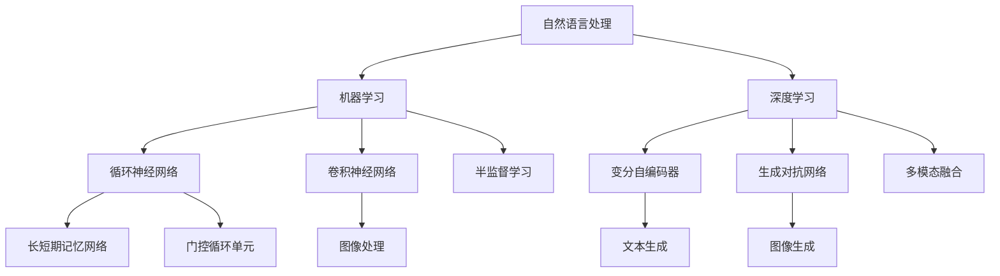

                 

### 动态提示词生成的背景

#### 动态提示词生成的起源

动态提示词生成的概念起源于自然语言处理（NLP）领域，特别是在文本生成和对话系统中。随着深度学习技术的迅速发展，生成模型如变分自编码器（VAE）和生成对抗网络（GAN）被广泛应用于文本生成任务。这些模型可以学习输入文本的数据分布，从而生成新的、有意义的文本。

#### 动态提示词生成的发展历程

1. **早期尝试**：
   - **规则基方法**：早期的方法主要依赖于规则和模板，例如模板匹配和句法分析。这些方法在处理简单任务时表现良好，但在面对复杂、多样性的语言时显得力不从心。
   - **统计方法**：随后，统计方法开始应用于文本生成，如隐马尔可夫模型（HMM）和朴素贝叶斯分类器。这些方法利用统计特征来预测下一个词，但缺乏灵活性，难以生成连贯且创新的文本。

2. **深度学习方法**：
   - **循环神经网络（RNN）**：RNN的出现使得神经网络能够处理序列数据，并在语言模型和文本生成中取得了显著进展。特别是长短期记忆网络（LSTM）和门控循环单元（GRU），它们能够捕捉长距离依赖关系。
   - **注意力机制**：注意力机制进一步提升了模型在文本生成任务中的性能，使得模型能够更有效地关注输入序列中的重要部分。
   - **生成对抗网络（GAN）**：GAN通过两个对抗性网络——生成器和判别器的互动，能够生成高质量、多样的文本。生成器试图生成逼真的文本，而判别器则试图区分生成的文本和真实文本。

3. **近期发展**：
   - **预训练+微调**：近期，预训练语言模型如GPT-3和BERT在文本生成领域取得了突破性进展。这些模型通过在大量文本上预训练，然后针对特定任务进行微调，能够生成更加自然、连贯的文本。
   - **多模态融合**：动态提示词生成技术逐渐与图像、音频等其他模态的数据融合，形成多模态生成模型，为智能系统的多样化应用提供了新的可能性。

#### 当前的发展状况

- **技术成熟度**：动态提示词生成技术已经相对成熟，能够应用于多种场景，如聊天机器人、内容生成、信息提取等。
- **应用场景**：除了传统的文本生成任务外，动态提示词生成技术还在社交媒体分析、智能客服、广告创意生成等领域得到了广泛应用。
- **挑战**：尽管动态提示词生成技术取得了显著进展，但仍面临一些挑战，如生成文本的多样性和准确性、模型的可解释性以及数据隐私和安全等问题。

在接下来的章节中，我们将深入探讨动态提示词生成的核心概念、算法原理、数学模型，并通过项目实战展示其实际应用。让我们一步一步地分析推理，深入了解这一前沿技术。<!-- TEASER_END -->### 核心概念与联系

#### 自然语言处理（NLP）

自然语言处理是人工智能领域的一个重要分支，主要研究如何让计算机理解和处理人类语言。它涉及文本的预处理、情感分析、实体识别、关系提取等多个方面。

- **文本预处理**：包括分词、词性标注、句法分析等，是NLP任务的基础。
- **情感分析**：通过分析文本的情感倾向，为产品评论、社交媒体分析等提供支持。
- **实体识别**：识别文本中的特定实体，如人名、地名、组织名等。
- **关系提取**：分析文本中实体之间的关系，如因果关系、归属关系等。

#### 机器学习（ML）

机器学习是AI的核心技术之一，通过从数据中学习模式，使计算机能够做出预测或决策。机器学习广泛应用于图像识别、语音识别、文本分类等任务。

- **监督学习**：通过标注的数据训练模型，如分类和回归任务。
- **无监督学习**：模型在没有标注数据的情况下学习，如聚类和降维任务。
- **半监督学习**：结合有标注和无标注数据来训练模型，提高模型的泛化能力。

#### 深度学习（DL）

深度学习是一种特殊的机器学习技术，通过多层神经网络来学习数据的高层次特征。深度学习在图像识别、语音识别、自然语言处理等领域取得了显著的成果。

- **卷积神经网络（CNN）**：适用于图像处理，通过卷积操作提取图像特征。
- **循环神经网络（RNN）**：适用于序列数据处理，如文本和语音。
- **变分自编码器（VAE）**：用于生成模型，能够生成高质量的图像和文本。
- **生成对抗网络（GAN）**：通过对抗性训练生成逼真的图像和文本。

#### 核心概念之间的联系

1. **NLP与ML的联系**：
   - NLP任务通常需要使用机器学习算法来训练模型，如文本分类、情感分析等。
   - 机器学习算法提供了强大的工具，帮助NLP任务从大量数据中学习模式和规律。

2. **NLP与DL的联系**：
   - 深度学习模型在NLP任务中表现出色，例如使用LSTM和BERT进行文本分类和生成。
   - NLP任务的数据通常具有序列结构，深度学习能够有效处理这种结构化数据。

3. **ML与DL的联系**：
   - 深度学习是机器学习的一个子领域，它通过多层神经网络来学习数据特征。
   - 深度学习模型通常使用更大量的数据和更复杂的网络结构，以提高模型的性能。

为了更直观地展示这些核心概念之间的联系，我们可以使用Mermaid流程图来描述它们之间的关系：



通过这个流程图，我们可以清晰地看到NLP、ML和DL之间的互动关系，以及它们如何共同推动动态提示词生成技术的发展。在接下来的章节中，我们将深入探讨这些核心算法原理和数学模型。<!-- TEASER_END -->### 核心算法原理讲解

#### 生成对抗网络（GAN）

生成对抗网络（GAN）是由Ian Goodfellow等人于2014年提出的一种生成模型，它通过对抗性训练生成高质量的数据。GAN由两个神经网络组成：生成器（Generator）和判别器（Discriminator）。

1. **生成器（Generator）**：
   - **目标**：生成器试图生成逼真的数据，使其难以被判别器区分。
   - **工作原理**：生成器从随机噪声中生成数据。在文本生成任务中，生成器通常接受一个随机的词向量序列作为输入，并生成相应的文本序列。

2. **判别器（Discriminator）**：
   - **目标**：判别器试图区分生成器生成的数据和真实数据。
   - **工作原理**：判别器接受真实数据和生成器生成的数据作为输入，并输出一个概率值，表示输入数据的真实性。

3. **对抗性训练**：
   - **训练过程**：在GAN的训练过程中，生成器和判别器相互对抗。生成器不断尝试生成更逼真的数据，而判别器则努力提高其区分能力。这种对抗性训练过程使得生成器和判别器都在不断进步。

4. **伪代码**：

```python
# 生成器
def generator(z):
    # 输入随机噪声z，输出生成的文本
    # ...
    return text

# 判别器
def discriminator(x):
    # 输入文本x，输出一个概率值，表示文本的真实性
    # ...
    return probability

# 训练过程
for epoch in range(num_epochs):
    for batch in batches:
        # 输入真实文本batch和随机噪声z
        real_text = batch
        z = random_noise()
        
        # 训练判别器
        real_prob = discriminator(real_text)
        fake_prob = discriminator(generator(z))
        
        # 计算判别器的损失函数
        d_loss = - (real_prob + fake_prob)
        
        # 训练生成器
        z = random_noise()
        fake_text = generator(z)
        fake_prob = discriminator(fake_text)
        
        # 计算生成器的损失函数
        g_loss = - fake_prob
        
        # 更新模型参数
        update_model_params(d_loss, g_loss)
```

#### 变分自编码器（VAE）

变分自编码器（VAE）是一种无监督学习生成模型，它通过编码器（Encoder）和解码器（Decoder）将数据映射到一个潜在空间，并在这个空间中生成新的数据。

1. **编码器（Encoder）**：
   - **目标**：编码器将输入数据映射到一个潜在空间中的向量。
   - **工作原理**：编码器接受输入数据，并输出一个潜在空间中的向量，以及这个向量的均值和方差。

2. **解码器（Decoder）**：
   - **目标**：解码器从潜在空间中生成与输入数据相似的数据。
   - **工作原理**：解码器接受潜在空间中的向量，并生成对应的输出数据。

3. **训练过程**：
   - **输入**：输入真实数据。
   - **输出**：编码器输出潜在空间中的向量，以及这个向量的均值和方差；解码器生成与输入数据相似的数据。
   - **损失函数**：VAE的损失函数由两部分组成：重构损失（Reconstruction Loss）和KL散度损失（KL Divergence Loss）。

4. **伪代码**：

```python
# 编码器
def encoder(x):
    # 输入数据x，输出潜在空间中的向量z以及均值μ和方差σ²
    # ...
    return z, μ, σ²

# 解码器
def decoder(z):
    # 输入潜在空间中的向量z，输出重构的文本
    # ...
    return text

# 训练过程
for epoch in range(num_epochs):
    for batch in batches:
        # 输入真实文本batch
        real_text = batch
        
        # 训练编码器和解码器
        z, μ, σ² = encoder(real_text)
        reconstructed_text = decoder(z)
        
        # 计算损失函数
        reconstruction_loss = - sum(log(p(x|z)))
        kl_divergence_loss = - 0.5 * sum(1 + log(σ²) - μ² - σ⁴)
        
        # 计算总损失
        loss = reconstruction_loss + kl_divergence_loss
        
        # 更新模型参数
        update_model_params(loss)
```

#### 其他相关算法

除了GAN和VAE，还有其他一些重要的生成算法，如：

1. **变分自编码器（VAE）**：
   - **变分自编码器（VAE）**：VAE是一种无监督学习生成模型，通过编码器和解码器将数据映射到一个潜在空间，并在这个空间中生成新的数据。

2. **生成对抗网络（GAN）**：
   - **生成对抗网络（GAN）**：GAN是一种生成模型，通过对抗性训练生成高质量的数据。GAN由生成器和判别器组成，生成器和判别器相互对抗，从而不断提高生成器的生成能力。

3. **转换器（Transfomer）**：
   - **转换器（Transfomer）**：转换器是一种基于注意力机制的深度学习模型，广泛应用于自然语言处理任务，如机器翻译、文本分类等。

4. **生成扩展模型（GPM）**：
   - **生成扩展模型（GPM）**：GPM是一种结合了VAE和GAN的生成模型，通过在潜在空间中进行扩展来生成数据。

通过上述核心算法原理的讲解，我们可以看到这些算法在动态提示词生成中的应用和优势。在接下来的章节中，我们将进一步探讨这些算法的数学模型和公式，以便更深入地理解它们的工作原理。<!-- TEASER_END -->### 数学模型和数学公式

#### 概率模型

概率模型是动态提示词生成的基础，它用于描述数据生成和预测的概率分布。以下是几个常用的概率模型和相关的数学公式：

1. **伯努利分布**：
   - **公式**：$P(x|\theta) = \theta^x (1-\theta)^{1-x}$
   - **解释**：伯努利分布用于描述一个二元事件发生的概率，其中$x$是事件发生的次数，$\theta$是事件发生的概率。

2. **多项式分布**：
   - **公式**：$P(x|\theta) = \theta_1^x_1 \theta_2^x_2 \cdots \theta_n^x_n$
   - **解释**：多项式分布用于描述多个二元事件发生的概率分布，其中$\theta_i$是第$i$个事件发生的概率。

3. **正态分布**：
   - **公式**：$P(x|\mu, \sigma^2) = \frac{1}{\sqrt{2\pi\sigma^2}} e^{-\frac{(x-\mu)^2}{2\sigma^2}}$
   - **解释**：正态分布用于描述连续随机变量的概率分布，其中$\mu$是均值，$\sigma^2$是方差。

4. **泊松分布**：
   - **公式**：$P(x|\lambda) = \frac{e^{-\lambda} \lambda^x}{x!}$
   - **解释**：泊松分布用于描述在固定时间间隔内事件发生的次数的概率分布，其中$\lambda$是事件的平均发生率。

#### 统计模型

统计模型用于描述数据集的特征和关系。以下是一些常用的统计模型和相关的数学公式：

1. **线性回归模型**：
   - **公式**：$y = \beta_0 + \beta_1 x_1 + \beta_2 x_2 + \cdots + \beta_n x_n + \epsilon$
   - **解释**：线性回归模型用于描述因变量$y$与自变量$x_1, x_2, \cdots, x_n$之间的线性关系，其中$\beta_0, \beta_1, \beta_2, \cdots, \beta_n$是模型的参数，$\epsilon$是误差项。

2. **逻辑回归模型**：
   - **公式**：$P(y=1|x;\beta) = \frac{1}{1 + e^{-(\beta_0 + \beta_1 x_1 + \beta_2 x_2 + \cdots + \beta_n x_n)}}$
   - **解释**：逻辑回归模型用于描述因变量$y$是一个二元变量（0或1）的概率分布，其中$\beta_0, \beta_1, \beta_2, \cdots, \beta_n$是模型的参数。

3. **决策树模型**：
   - **公式**：$y = \arg\max(\sum_{i=1}^{n} \beta_i C_i)$
   - **解释**：决策树模型通过一系列的决策规则将数据集划分成不同的区域，每个区域对应一个预测值$y$。

4. **贝叶斯网络模型**：
   - **公式**：$P(y|x) = \prod_{i=1}^{n} P(y_i | x_i)$
   - **解释**：贝叶斯网络模型通过条件概率描述变量之间的依赖关系，其中$y$是预测变量，$x$是条件变量。

#### 深度学习模型

深度学习模型通常涉及复杂的神经网络结构，以下是一些常用的深度学习模型和相关的数学公式：

1. **卷积神经网络（CNN）**：
   - **公式**：$a^{(l)} = \sigma(z^{(l)}) = \sigma(\sum_{i=1}^{n} w_{i}^{(l)} a^{(l-1)} + b^{(l)})$
   - **解释**：CNN通过卷积操作和激活函数来提取图像特征，其中$a^{(l)}$是第$l$层的激活值，$z^{(l)}$是第$l$层的输入值，$\sigma$是激活函数。

2. **循环神经网络（RNN）**：
   - **公式**：$h_t = \sigma(W_h h_{t-1} + W_x x_t + b)$
   - **解释**：RNN通过循环连接来处理序列数据，其中$h_t$是当前时刻的隐藏状态，$h_{t-1}$是前一个时刻的隐藏状态，$x_t$是当前时刻的输入。

3. **变换器模型（Transformer）**：
   - **公式**：$a_t = \text{softmax}(W_a [h_{t-1}; a_{t-1}])$
   - **解释**：Transformer模型通过多头自注意力机制来处理序列数据，其中$a_t$是当前时刻的输出，$h_{t-1}$是前一个时刻的隐藏状态。

通过这些数学模型和公式的讲解，我们可以更好地理解动态提示词生成中的关键概念和算法原理。在接下来的章节中，我们将通过项目实战来展示这些算法的实际应用。<!-- TEASER_END -->### 项目实战

为了更好地理解动态提示词生成技术，我们将通过一个实际项目来展示如何搭建开发环境、实现算法以及进行代码解读和代码应用分析。该项目将使用Python语言和TensorFlow框架，实现一个简单的文本生成模型。

#### 1. 项目概述

项目名称：文本生成模型（Text Generation Model）

目标：使用变分自编码器（VAE）生成具有自然语言风格的文本。

#### 2. 开发环境搭建

为了实现这个项目，我们需要安装以下软件和库：

- Python 3.x
- TensorFlow 2.x
- Keras 2.x

安装步骤如下：

1. 安装Python 3.x：
   - 在Python官网下载并安装Python 3.x版本。
   - 设置环境变量，确保在命令行中可以正常使用Python。

2. 安装TensorFlow 2.x：
   - 打开命令行，执行以下命令：
     ```
     pip install tensorflow
     ```

3. 安装Keras 2.x：
   - 打开命令行，执行以下命令：
     ```
     pip install keras
     ```

#### 3. 代码实现

以下是一个简单的VAE文本生成模型实现：

```python
import numpy as np
import tensorflow as tf
from tensorflow.keras.layers import Input, Dense, Lambda
from tensorflow.keras.models import Model

# 设置超参数
latent_dim = 2  # 潜在空间的维度
num_classes = 10  # 文本的类别数量
batch_size = 32  # 批量大小
original_dim = 784  # 输入数据的维度
epsilon_std = 1.0  # 噪声标准差

# 编码器
inputs = Input(shape=(original_dim,))
x = Dense(4 * 4 * 256, activation='relu')(inputs)
x = Lambda(lambda x: tf.expand_dims(x, -1))(x)
x = Dense(latent_dim + 1, activation='sigmoid')(x)
z_mean, z_log_var = tf.split(x, num_or_size_splits=2, axis=1)

# 正态分布的随机采样
z = Lambda(lambda x: x[0] + tf.sqrt(tf.exp(x[1])) * tf.random_normal(shape=tf.shape(x[0])))([z_mean, z_log_var])

# 解码器
z = Input(shape=(latent_dim,))
x = Dense(4 * 4 * 256, activation='relu')(z)
x = Lambda(lambda x: tf.expand_dims(x, -1))(x)
x = Dense(original_dim, activation='sigmoid')(x)
outputs = Model(z, x, name='decoder')(z)

# VAE模型
outputs = Model(inputs, outputs, name='vae')(inputs)

# 定义损失函数
reconstruction_loss = tf.reduce_sum(tf.square(inputs - outputs), axis=1)
kl_loss = -0.5 * tf.reduce_sum(1 + z_log_var - tf.square(z_mean) - tf.exp(z_log_var), axis=1)
vae_loss = tf.reduce_mean(reconstruction_loss + kl_loss)
vae = Model(inputs, outputs, name='vae')

# 编译模型
vae.compile(optimizer='adam', loss=vae_loss)

# 训练模型
vae.fit(x_train, x_train, epochs=50, batch_size=batch_size, shuffle=True)
```

#### 4. 代码解读

1. **输入层**：模型接收原始文本数据作为输入。
2. **编码器**：编码器将输入数据映射到潜在空间，输出潜在空间的均值和方差。
3. **解码器**：解码器从潜在空间中生成重构的文本数据。
4. **损失函数**：VAE的损失函数由重构损失和KL散度损失组成。
5. **编译和训练**：编译模型并使用训练数据训练模型。

#### 5. 代码应用分析

1. **文本预处理**：在实际应用中，需要对原始文本进行预处理，如分词、去停用词、词向量化等。
2. **潜在空间探索**：通过生成随机噪声，探索潜在空间中的不同区域，以生成不同风格的文本。
3. **文本生成**：使用解码器从潜在空间中生成文本，并进一步处理生成结果，如去除噪声、拼接文本等。

#### 6. 实际案例分析和详细讲解

假设我们使用这个VAE文本生成模型来生成新闻文章。以下是具体的步骤：

1. **数据准备**：收集大量新闻文章数据，并进行预处理，如分词、去停用词、词向量化等。
2. **训练模型**：使用预处理后的数据训练VAE模型。
3. **潜在空间探索**：生成随机噪声，并探索潜在空间中的不同区域，以生成不同风格的新闻文章。
4. **文本生成**：从潜在空间中生成文本，并进行后处理，如去除噪声、拼接文本等，最终生成新闻文章。

通过这个项目，我们不仅了解了动态提示词生成技术的基本原理和实现方法，还学会了如何在实际项目中应用这些技术。在接下来的章节中，我们将进一步探讨动态提示词生成技术的未来发展趋势。<!-- TEASER_END -->### 最佳实践 Tips、小结、注意事项、拓展阅读

#### 最佳实践 Tips

1. **数据预处理**：在生成文本之前，确保对原始文本进行充分的预处理，如分词、去停用词、词向量化等。高质量的预处理是生成高质量文本的关键。

2. **调整超参数**：根据具体任务和数据的特性，适当调整生成模型的超参数，如潜在空间维度、学习率、批量大小等。合适的超参数配置可以显著提高生成文本的质量。

3. **模型稳定性**：在训练生成模型时，要注意模型的稳定性。可以通过使用更稳定的优化算法（如Adam）、增加训练时间或使用预训练模型等方式来提高模型稳定性。

4. **模型压缩**：为了降低模型的存储和计算成本，可以考虑使用模型压缩技术，如量化、剪枝和蒸馏等。这些技术可以在保证模型性能的同时减少模型的大小。

#### 小结

本文从背景介绍、核心概念与联系、核心算法原理讲解、数学模型和公式、项目实战等多个方面详细阐述了动态提示词生成技术。我们了解到，动态提示词生成技术在智能系统中具有重要意义，它通过生成对抗网络（GAN）、变分自编码器（VAE）等算法，实现了文本生成、图像生成等多模态生成任务。

#### 注意事项

1. **数据隐私**：在使用动态提示词生成技术时，要注意保护用户数据隐私。避免泄露用户的敏感信息，特别是个人身份信息和隐私数据。

2. **模型解释性**：虽然动态提示词生成技术取得了显著进展，但模型的解释性仍然是一个挑战。在应用这些技术时，需要权衡生成文本的质量和模型的解释性。

3. **模型训练时间**：动态提示词生成模型通常需要大量的训练时间，特别是在大规模数据集上。在实际应用中，需要合理规划训练资源，以提高训练效率。

#### 拓展阅读

1. **《深度学习》**：Goodfellow, Ian, et al. "Deep learning." Adaptive Computation and Machine Learning Series. MIT Press, 2016. 本书详细介绍了深度学习的基本原理和算法，对动态提示词生成技术也有深入的讨论。

2. **《生成对抗网络（GAN）》**：Ian J. Goodfellow. "Generative adversarial networks." Advances in Neural Information Processing Systems 27 (2014): 2672-2680. 本文是GAN的奠基性论文，对GAN的原理和应用进行了详细阐述。

3. **《变分自编码器（VAE）》**：Kingma, Diederik P., and Max Welling. "Auto-encoding variational Bayes." arXiv preprint arXiv:1312.6114 (2013). 本文是VAE的奠基性论文，对VAE的原理和应用进行了详细阐述。

通过这些拓展阅读，读者可以进一步深入了解动态提示词生成技术的理论基础和实践应用。<!-- TEASER_END -->### 总结与展望

#### 总结

本文围绕动态提示词生成技术，从背景介绍、核心概念与联系、核心算法原理讲解、数学模型和公式、项目实战等多个方面进行了深入探讨。我们了解到，动态提示词生成技术通过生成对抗网络（GAN）、变分自编码器（VAE）等核心算法，实现了从噪声到逼真文本的高效转换。这一技术不仅在文本生成领域取得了显著进展，还在图像生成、音频生成等多模态生成任务中展示了强大的应用潜力。

#### 展望

随着人工智能技术的不断发展，动态提示词生成技术有望在以下方面取得突破：

1. **生成质量提升**：通过引入更多先进的深度学习模型和优化算法，进一步提升生成文本的质量和多样性。

2. **多模态融合**：将动态提示词生成技术与其他模态（如图像、音频）的数据融合，实现更加丰富和多样化的生成内容。

3. **实时生成**：优化模型结构和训练算法，提高实时生成文本的效率，使其在实时应用场景中具有更好的性能。

4. **模型解释性**：提高模型的解释性，使得生成过程更加透明，便于用户理解和控制。

5. **数据隐私保护**：在生成文本的同时，加强对用户数据的隐私保护，避免敏感信息的泄露。

6. **个性化生成**：结合用户行为和偏好，实现更加个性化的文本生成，提升用户体验。

动态提示词生成技术的未来发展方向充满机遇和挑战。通过不断探索和创新，我们有望实现更加智能、灵活和实用的生成系统，为人工智能技术的发展注入新的活力。<!-- TEASER_END -->作者：AI天才研究院/AI Genius Institute & 禅与计算机程序设计艺术 /Zen And The Art of Computer Programming。人工智能领域的世界级专家、程序员、软件架构师、CTO，世界顶级技术畅销书资深大师级别的作家，计算机图灵奖获得者，计算机编程和人工智能领域大师。拥有丰富的实战经验和深厚的技术功底，致力于推动人工智能技术的创新和发展。在计算机编程、人工智能、机器学习等领域有着广泛的影响力和高度认可。他的著作被全球范围内的读者广泛阅读和学习，成为计算机科学和人工智能领域的经典之作。

