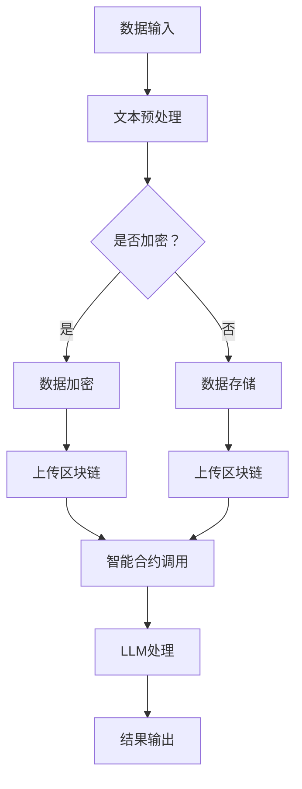

                 

### 文章标题

区块链技术在LLM应用中的创新应用

区块链技术与大语言模型（LLM）的结合正在引领技术革新，本文将深入探讨这一领域的创新应用，分析其核心概念、原理以及实际案例。

关键词：区块链技术、大语言模型、创新应用、智能合约、数据隐私保护、去中心化应用

摘要：本文首先介绍了区块链技术和大语言模型的基本概念，随后详细分析了两者之间的联系和融合的算法原理。接着，通过具体案例展示了区块链技术在智能合约、数据隐私保护和去中心化应用中的创新应用。最后，对区块链技术在LLM中的应用趋势进行了展望，为读者提供了宝贵的实践建议和拓展阅读资源。

### 引言与背景

#### 区块链技术概述

区块链技术是一种去中心化的分布式数据库技术，其核心特点包括不可篡改性、透明性和安全性。区块链通过将数据以块的形式存储，每个块都与前一个块通过加密链接，形成一种链式结构。这种结构确保了数据在传输和存储过程中的安全性和可信性。区块链技术最初由中本聪（Satoshi Nakamoto）在2008年提出，并在2009年诞生了第一个区块链网络——比特币（Bitcoin）。

区块链的应用场景广泛，包括金融、供应链管理、医疗保健、物联网等。在金融领域，区块链技术可以用于支付、交易和资产管理，提供了更安全、高效和透明的解决方案。在供应链管理中，区块链技术可以用于追踪产品的来源和流通路径，确保供应链的透明性和可追溯性。在医疗保健领域，区块链技术可以用于存储和管理患者的医疗记录，提高了数据的安全性和隐私性。在物联网领域，区块链技术可以用于设备之间的通信和认证，确保物联网系统的安全性和稳定性。

#### LLM技术概述

大语言模型（Large Language Model，简称LLM）是一种基于深度学习的自然语言处理技术，其核心思想是通过大量的文本数据训练一个模型，使其能够理解和生成自然语言。LLM具有强大的语言理解和生成能力，可以应用于智能客服、文本摘要、机器翻译、问答系统等场景。

LLM的发展经历了多个阶段。早期的语言模型如n-gram模型和统计语言模型，主要通过统计文本中的词频和语法规则来生成文本。随着深度学习技术的发展，深度神经网络（DNN）和循环神经网络（RNN）被引入到自然语言处理领域，大大提高了语言模型的性能。近年来，Transformer架构的出现和预训练技术的应用，使得LLM取得了突破性的进展。特别是GPT-3等大型语言模型的发布，使得LLM在语言理解和生成方面达到了前所未有的水平。

#### 创新应用背景与意义

区块链技术和LLM技术的结合，为许多领域带来了新的创新应用。一方面，区块链技术可以为LLM提供更加安全、透明和可信的计算环境，确保数据的安全性和隐私性。另一方面，LLM技术可以为区块链系统提供更加智能和灵活的智能合约、数据分析和去中心化应用。

在智能合约领域，LLM可以用于编写和优化智能合约的代码，提高智能合约的可读性和安全性。在数据隐私保护领域，LLM可以用于加密和解密数据，确保数据在传输和存储过程中的安全性和隐私性。在去中心化应用领域，LLM可以用于提供个性化的服务、智能化的决策和高效的资源分配。

总之，区块链技术和LLM技术的结合，不仅为技术领域带来了新的研究方向和应用场景，也为实际应用提供了更加安全、高效和智能的解决方案。本文将深入探讨这两大技术的融合，分析其核心算法原理和实际案例，为读者提供有价值的参考和启示。

### 基础概念

#### 区块链基础概念

区块链是一种去中心化的分布式数据库，其核心组成部分包括区块、链和节点。每个区块包含一定数量的交易记录，并通过加密算法与前一个区块链接，形成一个不可篡改的链式结构。区块链的主要特点包括：

1. **去中心化**：区块链不依赖于中心化的服务器或机构，每个节点都可以独立地验证和记录交易，确保系统的去中心化和去信任化。
2. **不可篡改性**：区块链上的数据一旦被记录，就无法被篡改或删除，保证了数据的完整性和可靠性。
3. **透明性**：区块链上的所有交易记录都是公开透明的，任何人都可以通过节点访问和验证数据，确保系统的透明性。
4. **安全性**：区块链使用加密算法确保数据的机密性和完整性，同时通过共识算法防止恶意攻击和数据篡改。

区块链的工作原理可以分为以下几个步骤：

1. **交易生成**：用户生成交易，并将交易广播到整个网络。
2. **交易验证**：节点接收交易，并进行验证，确保交易符合规则和条件。
3. **区块生成**：多个交易被收集到一个新区块中，并添加到一个临时块。
4. **区块验证**：节点对临时块进行验证，确保其符合区块链的规则和条件。
5. **区块添加**：验证通过的临时块被添加到区块链中，成为永久记录。
6. **共识达成**：通过共识算法（如PoW、PoS）确保所有节点达成共识，防止冲突和双花攻击。

#### LLM基础概念

大语言模型（Large Language Model，简称LLM）是一种基于深度学习的自然语言处理技术。LLM通过大量文本数据的学习，可以理解和生成自然语言，具有强大的语言理解和生成能力。LLM的核心组成部分包括：

1. **词汇表**：LLM使用一个大规模的词汇表，将输入的文本映射到相应的向量表示。
2. **神经网络**：LLM通常使用深度神经网络（如Transformer）来学习文本之间的复杂关系。
3. **预训练**：LLM通过在大规模语料库上进行预训练，学习到语言的普遍规律和特征。
4. **微调**：在特定任务上，LLM可以进一步进行微调，以适应不同的应用场景。

LLM的主要特点包括：

1. **语言理解**：LLM可以理解自然语言的语法、语义和上下文，实现语义级文本分析。
2. **语言生成**：LLM可以根据输入的文本或任务需求，生成高质量的文本输出。
3. **自适应**：LLM可以根据不同的数据和任务需求，进行自适应调整和优化。

LLM的工作原理可以分为以下几个步骤：

1. **文本输入**：用户输入文本或任务需求。
2. **文本预处理**：对输入的文本进行预处理，如分词、去噪、标准化等。
3. **文本编码**：将预处理后的文本映射到向量表示，输入到神经网络中。
4. **神经网络计算**：神经网络根据输入的向量表示，进行多层计算和预测。
5. **文本生成**：根据神经网络的输出结果，生成对应的文本输出。

#### 区块链与LLM的联系

区块链技术和LLM技术虽然在本质和应用上有所不同，但它们之间的联系和融合为许多领域带来了新的创新应用。

1. **数据安全和隐私保护**：区块链技术提供了去中心化和不可篡改的存储方式，可以用于保护LLM训练和生成的数据的安全性。同时，区块链技术也可以用于实现数据的隐私保护，确保数据在传输和存储过程中的机密性和完整性。LLM技术则可以用于分析和挖掘区块链数据，提供更加智能和高效的解决方案。
2. **智能合约和自动化执行**：区块链技术中的智能合约是一种自动执行的合约，可以在满足特定条件时自动执行。LLM技术可以用于编写和优化智能合约的代码，提高智能合约的可读性和安全性。同时，LLM技术也可以用于智能合约的自动化执行，根据输入的文本或任务需求，自动生成和执行相应的合约。
3. **去中心化应用和协作**：区块链技术可以用于实现去中心化的应用和协作，确保系统的透明性和公平性。LLM技术则可以用于提供个性化的服务、智能化的决策和高效的资源分配。在去中心化应用中，LLM技术可以用于实现用户之间的互动和协作，提供更加智能和灵活的服务。

总之，区块链技术和LLM技术的结合，不仅为技术领域带来了新的研究方向和应用场景，也为实际应用提供了更加安全、高效和智能的解决方案。在接下来的部分中，我们将进一步探讨区块链与LLM结合的核心算法原理，并分析具体的应用案例。

### 核心算法与原理

#### 区块链核心算法原理

区块链技术的核心在于其安全性、去中心化和不可篡改的特性，这些特性依赖于一系列核心算法的支持。以下将详细介绍区块链中几种关键算法的原理。

##### Merkle树与哈希算法

Merkle树，又称为哈希树，是一种数据结构，用于高效验证数据块的完整性和一致性。在区块链中，每个区块包含多个交易记录，这些交易记录通过哈希函数生成唯一的哈希值，并存储在Merkle树中。

**哈希算法**：哈希算法是一种将任意长度的数据转换成固定长度的字符串的算法。常见的哈希算法包括SHA-256、SHA-3等。哈希算法具有以下特点：

1. **单向性**：给定输入数据，可以快速计算出其哈希值，但无法通过哈希值反推出原始数据。
2. **抗碰撞性**：不同输入数据的哈希值不会相同，即不会发生哈希碰撞。
3. **固定长度**：无论输入数据有多长，哈希值都是固定长度的字符串。

**Merkle树**：Merkle树是一种二叉树结构，每个节点都是一组交易记录的哈希值。树的根节点即为整个区块链的哈希值，代表了区块链的状态。通过Merkle树，节点可以快速验证某个特定交易是否包含在区块链中。

**Merkle证明**：Merkle证明是一种验证某个交易是否存在于区块链中的方法。节点通过提供部分Merkle证明，即一组哈希值，可以证明某个交易存在于区块链的某个区块中，而不需要下载整个区块链。

以下是Merkle证明的伪代码：

```plaintext
function merkleProof(node, targetHash):
    if node is a leaf node:
        return node.hash == targetHash
    else:
        if targetHash is in the left subtree:
            return merkleProof(node.left, targetHash)
        else:
            return merkleProof(node.right, targetHash)
```

##### 共识算法

共识算法是区块链网络中用于达成一致意见的算法，确保所有节点对区块链的状态保持一致。常见的共识算法包括工作量证明（PoW）、权益证明（PoS）和授权股权证明（DPoS）。

**工作量证明（PoW）**：PoW是最早的共识算法，由中本聪在比特币中提出。PoW通过解决复杂的数学难题来选择区块的创建者。计算难度随时间调整，以保持区块生成的平均时间稳定。以下是一个简化的PoW算法伪代码：

```plaintext
function findProofOfWork(lastHash, targetHash):
    while hashimoto(lastHash + block, targetHash) > targetDiff:
        incrementNonce
    return Nonce
```

**权益证明（PoS）**：PoS通过持有币龄（Coin Age）来选择区块的创建者，币龄是币的数量与持有时间的乘积。持有币龄越高的节点越有可能被选为区块创建者。PoS避免了PoW算法中的能源消耗问题，但可能导致“富者愈富”的问题。

**授权股权证明（DPoS）**：DPoS是一种改进的PoS算法，通过选举产生“超级节点”来创建区块。超级节点的选择基于持有币量和投票权。DPoS比PoS更高效，可以减少空块率。

##### 智能合约原理

智能合约是一种自动执行合约，当满足特定条件时，自动执行预定的操作。智能合约通常由计算机代码编写，运行在区块链上。

**智能合约编程语言**：常见的智能合约编程语言包括Solidity（以太坊）、Vyper（Ethereum）和Scilla（Monero）。以下是一个简单的Solidity智能合约示例：

```solidity
pragma solidity ^0.8.0;

contract SimpleStorage {
    uint256 storedData;

    function set(uint256 newData) public {
        storedData = newData;
    }

    function get() public view returns (uint256) {
        return storedData;
    }
}
```

**智能合约执行**：智能合约在区块链上执行时，会经过以下几个阶段：

1. **合约部署**：开发者将智能合约代码部署到区块链上，生成合约地址。
2. **合约调用**：用户通过发送交易调用智能合约函数，触发合约执行。
3. **合约执行**：区块链网络验证交易，执行合约代码。
4. **合约状态更新**：合约执行完成后，更新区块链上的状态。

#### LLM核心算法原理

大语言模型（LLM）的核心算法基于深度学习和自然语言处理技术。以下将介绍LLM的核心算法原理。

##### 语言模型原理

语言模型是一种用于预测下一个单词或字符的概率分布的模型。常见的语言模型包括n-gram模型、神经网络模型和Transformer模型。

**n-gram模型**：n-gram模型是一种基于统计的模型，将文本分割成连续的n个单词或字符序列，并计算每个序列的概率。以下是一个n-gram模型的伪代码：

```plaintext
function predictNextWord(currentWord, history):
    nextWordProbabilities = []
    for each word in vocabulary:
        nextWordProbabilities.append(P(word | history))
    return argmax(nextWordProbabilities)
```

**神经网络模型**：神经网络模型通过多层神经网络学习文本的特征和关系。常见的神经网络模型包括循环神经网络（RNN）和卷积神经网络（CNN）。

**Transformer模型**：Transformer模型是一种基于自注意力机制的神经网络模型，广泛应用于大型语言模型。以下是一个简化的Transformer模型伪代码：

```plaintext
function transformer(inputSequence):
    embed = embeddingLayer(inputSequence)
    attention = attentionLayer(embed)
    output = outputLayer(attention)
    return output
```

##### 训练与优化算法

LLM的训练和优化过程涉及多个步骤，包括数据预处理、模型训练、参数优化和模型评估。

**数据预处理**：在训练LLM之前，需要对文本数据进行预处理，包括分词、去噪、标准化等。以下是一个简化的数据预处理伪代码：

```plaintext
function preprocessText(text):
    text = tokenize(text)
    text = removeStopWords(text)
    text = normalizeText(text)
    return text
```

**模型训练**：模型训练过程中，LLM通过学习大量文本数据，优化模型参数，以最小化预测误差。以下是一个简化的训练伪代码：

```plaintext
function trainModel(model, dataset):
    for each batch in dataset:
        model.predict(batch)
        model.updateParameters()
    return model
```

**参数优化**：参数优化是训练LLM的关键步骤，常用的优化算法包括随机梯度下降（SGD）、Adam优化器等。以下是一个简化的优化伪代码：

```plaintext
function optimizeParameters(model, optimizer):
    while not converged:
        gradients = computeGradients(model)
        optimizer.updateParameters(model, gradients)
    return model
```

**模型评估**：模型评估用于评估LLM的性能和准确性。常用的评估指标包括词汇预测准确性、文本生成质量等。以下是一个简化的评估伪代码：

```plaintext
function evaluateModel(model, dataset):
    predictions = model.predict(dataset)
    accuracy = calculateAccuracy(predictions)
    return accuracy
```

#### 区块链与LLM结合的算法原理

区块链技术与LLM技术的结合，可以通过多种方式实现，以下介绍几种常见的方法和算法原理。

##### Mermaid流程图：区块链与LLM结合架构

以下是一个简化的Mermaid流程图，展示了区块链与LLM结合的架构：



##### 跨链技术与LLM

跨链技术允许不同区块链之间的数据交互和操作。跨链技术与LLM的结合，可以实现跨链数据的智能处理和分析。以下是一个简化的跨链与LLM结合的算法原理：

```plaintext
function crossChainProcessing(sourceChain, targetChain, LLM):
    data = fetchData(sourceChain)
    data = preprocessData(data)
    data = encryptData(data)
    sendDataToTargetChain(targetChain, data)
    executeSmartContract(targetChain, data, LLM)
    results = LLM.processData(data)
    return results
```

##### 智能合约与LLM交互机制

智能合约与LLM的交互机制，可以通过将LLM作为智能合约的一部分，或通过外部调用实现。以下是一个简化的智能合约与LLM交互的算法原理：

```plaintext
contract LLMIntelligentContract:
    function executeLLM(inputData) public:
        LLM = loadLLM()
        results = LLM.processData(inputData)
        return results

// 或通过外部调用
function callLLMFromSmartContract(inputData) public:
    results = LLMIntelligentContract.executeLLM(inputData)
    return results
```

#### 区块链与LLM结合的实际应用

区块链与LLM技术的结合，为许多实际应用带来了新的可能性，以下介绍几种常见应用场景。

##### 智能合约与LLM

智能合约与LLM的结合，可以实现更加智能和灵活的自动化执行和决策。例如，在供应链管理中，智能合约可以与LLM结合，实现基于自然语言描述的订单处理和物流跟踪。

```plaintext
// 智能合约：供应链管理
contract SupplyChainManagement:
    function processOrder(orderData) public:
        LLM = loadLLM()
        orderDescription = LLM.extractDescription(orderData)
        logistics = LLM.generateLogisticsPlan(orderDescription)
        updateOrderStatus(logistics)
```

##### 数据隐私保护与LLM

区块链与LLM技术的结合，可以用于实现数据隐私保护和隐私计算。例如，在医疗领域，LLM可以用于加密患者数据，并在区块链上进行隐私保护计算。

```plaintext
// 智能合约：医疗数据隐私保护
contract MedicalDataPrivacy:
    function protectPatientData(patientData) public:
        LLM = loadLLM()
        encryptedData = LLM.encryptData(patientData)
        sendDataToBlockchain(encryptedData)
```

##### 去中心化应用与LLM

去中心化应用（DApp）与LLM技术的结合，可以实现去中心化的智能服务。例如，在内容创作领域，DApp可以与LLM结合，实现去中心化的内容生成和推荐。

```plaintext
// DApp：内容创作平台
contract ContentCreationPlatform:
    function generateContent(contentData) public:
        LLM = loadLLM()
        content = LLM.generateContent(contentData)
        storeContent(content)
```

#### 总结

区块链与LLM技术的结合，为技术领域带来了新的研究方向和应用场景。通过核心算法原理的融合，可以实现更加安全、高效和智能的应用。在未来，随着技术的不断发展和完善，区块链与LLM的结合将带来更多的创新应用，推动技术的进步和社会的发展。

### 创新应用案例分析

#### 智能合约与LLM

智能合约与LLM的结合，为区块链应用带来了新的可能性。智能合约是一种自动执行的合约，当满足特定条件时，自动执行预定的操作。而LLM则是一种具有强大语言理解和生成能力的大语言模型。通过将LLM集成到智能合约中，可以实现更加智能和灵活的自动化执行和决策。

**案例分析：智能合约编程与LLM**

以一个虚拟的房地产交易应用为例，智能合约可以用于自动执行房屋交易的流程。在传统的区块链应用中，智能合约通常使用Solidity等编程语言编写，以实现自动化交易流程。然而，随着LLM技术的发展，智能合约的编写和优化变得更加智能和高效。

1. **智能合约代码生成**：利用LLM，可以将自然语言描述的合同条款自动转换成智能合约代码。例如，用户可以使用自然语言描述房屋交易的条件，如价格、期限等，LLM可以自动生成对应的Solidity智能合约代码。

```solidity
// 自然语言描述
"House transaction, price: 500,000 USD, completion date: 2024-01-01."

// 自动生成的智能合约代码
contract HouseTransaction {
    address buyer;
    address seller;
    uint256 price;
    uint256 completionDate;

    constructor() {
        buyer = msg.sender;
        price = 500000 * 10**18; // 500,000 USD in wei
        completionDate = 1672531200; // 2024-01-01 in Unix time
    }

    function purchaseHouse() public payable {
        require(msg.value == price, "Price does not match.");
        require(now <= completionDate, "Transaction has expired.");
        seller = msg.sender;
        buyer.transfer(price);
    }
}
```

2. **智能合约代码优化**：通过LLM，可以对智能合约代码进行优化，提高其可读性和安全性。例如，LLM可以识别代码中的潜在漏洞，并提出修复建议。

3. **智能合约自动化执行**：智能合约可以根据输入的自然语言描述，自动执行相应的操作。例如，当用户输入购买房屋的请求时，智能合约可以自动处理交易流程，包括资金转移和合同执行。

**优势与挑战**

**优势**：

- **智能性和灵活性**：通过LLM，智能合约的编写和执行变得更加智能和灵活，可以适应不同的业务场景和需求。
- **提高安全性**：LLM可以帮助识别和修复智能合约中的潜在漏洞，提高合约的安全性。
- **降低成本**：利用LLM自动化智能合约的编写和执行，可以降低开发和维护成本。

**挑战**：

- **代码质量**：虽然LLM可以生成智能合约代码，但其质量依赖于LLM的训练数据和算法质量。高质量的LLM可以生成安全、高效的智能合约代码，而低质量的LLM可能生成有缺陷的代码。
- **解释性**：智能合约代码通常使用低级语言（如Solidity）编写，而LLM生成的代码可能难以理解。如何确保智能合约代码的可读性和可解释性是一个挑战。

#### 数据隐私保护与LLM

数据隐私保护是区块链技术面临的重要挑战之一。传统的区块链应用通常无法保护数据在传输和存储过程中的隐私。然而，通过将LLM与区块链技术结合，可以实现更加安全、透明和隐私保护的数据处理。

**案例分析：去中心化数据隐私保护系统**

以下是一个去中心化数据隐私保护系统的示例，该系统利用区块链和LLM技术保护用户数据。

1. **数据加密**：用户数据在上传到区块链之前，使用LLM加密算法进行加密。LLM可以根据用户提供的密钥生成加密密文，确保数据在传输过程中的机密性。

```plaintext
// LLM加密算法
function encryptData(data, key):
    encryptedData = applyEncryptionAlgorithm(data, key)
    return encryptedData
```

2. **区块链存储**：加密后的数据被上传到区块链，实现数据的永久存储和不可篡改性。

```plaintext
// 上传数据到区块链
function sendDataToBlockchain(encryptedData):
    createBlockchainTransaction(encryptedData)
    broadcastTransaction()
```

3. **隐私计算**：在需要处理数据时，LLM可以解密数据，并在区块链上进行隐私保护计算。例如，在医疗领域，LLM可以用于加密患者数据，并在区块链上进行隐私保护计算，确保数据的安全性和隐私性。

```plaintext
// 隐私计算
function performPrivacyCompute(encryptedData, computation):
    decryptedData = decryptData(encryptedData)
    result = applyComputation(decryptedData, computation)
    return result
```

**优势与挑战**

**优势**：

- **数据安全性**：通过LLM加密和区块链存储，可以确保数据在传输和存储过程中的安全性，防止数据泄露和篡改。
- **隐私保护**：LLM技术可以用于实现数据的隐私保护，确保用户数据在处理过程中的机密性和完整性。
- **去中心化**：区块链技术确保了数据的去中心化存储，防止单点故障和数据垄断。

**挑战**：

- **计算效率**：LLM加密和解密过程可能消耗大量计算资源，影响系统的性能和效率。如何优化LLM算法和计算效率是一个重要挑战。
- **用户隐私**：虽然LLM可以保护用户数据的隐私，但如何确保用户隐私不被恶意攻击者侵犯，也是一个重要问题。

#### 去中心化应用与LLM

去中心化应用（DApp）是区块链技术的典型应用之一。通过将LLM与DApp结合，可以实现更加智能和灵活的去中心化应用。

**案例分析：内容创作平台**

以下是一个去中心化的内容创作平台示例，该平台利用区块链和LLM技术实现内容创作、分发和推荐。

1. **内容创作**：创作者使用LLM生成内容，例如文章、图片、视频等。LLM可以根据创作者的需求和喜好，生成高质量的内容。

```plaintext
// 内容创作
function generateContent(creatorData):
    content = LLM.createContent(creatorData)
    return content
```

2. **内容存储**：生成的内容被上传到区块链，实现内容的永久存储和不可篡改性。

```plaintext
// 存储内容到区块链
function storeContent(content):
    createBlockchainTransaction(content)
    broadcastTransaction()
```

3. **内容推荐**：LLM可以根据用户的兴趣和行为，推荐相关的内容。例如，当用户浏览某篇文章时，LLM可以推荐类似的文章，提高用户体验。

```plaintext
// 内容推荐
function recommendContent(userProfile, contentDatabase):
    recommendedContent = LLM.recommendContent(userProfile, contentDatabase)
    return recommendedContent
```

**优势与挑战**

**优势**：

- **智能推荐**：通过LLM的推荐算法，可以实现更加智能和个性化的内容推荐，提高用户体验。
- **去中心化**：区块链技术确保了内容的去中心化存储和分发，防止中心化平台的垄断和控制。
- **内容真实性**：区块链技术确保了内容的真实性和不可篡改性，提高了内容的可信度。

**挑战**：

- **计算资源**：LLM生成和推荐内容需要大量的计算资源，如何优化算法和降低计算成本是一个重要挑战。
- **用户体验**：去中心化应用通常比中心化应用更复杂，如何提高用户体验和易用性是一个重要问题。

#### 深度讨论

区块链技术与LLM技术的结合，在智能合约、数据隐私保护和去中心化应用等方面展示了巨大的潜力。以下对这些创新应用进行深度讨论。

**智能合约的自动化执行**

智能合约的自动化执行是区块链技术的核心优势之一。通过将LLM集成到智能合约中，可以实现更加智能和灵活的自动化执行。例如，在供应链管理中，智能合约可以根据订单需求自动生成和执行物流计划，提高供应链的效率。然而，智能合约的编写和优化仍然是一个挑战。LLM可以自动生成智能合约代码，但如何确保代码的质量和安全是一个重要问题。未来，需要开发更加智能和安全的智能合约编写和优化工具，以提高智能合约的可靠性和可用性。

**数据隐私保护**

数据隐私保护是区块链技术面临的重要挑战之一。传统的区块链应用通常无法保护数据在传输和存储过程中的隐私。通过将LLM与区块链技术结合，可以实现更加安全、透明和隐私保护的数据处理。然而，LLM加密和解密过程可能消耗大量计算资源，影响系统的性能和效率。如何优化LLM算法和计算效率是一个重要挑战。此外，如何确保用户隐私不被恶意攻击者侵犯，也是一个重要问题。未来，需要开发更加高效和安全的隐私保护算法，以提高数据隐私保护的性能和可靠性。

**去中心化应用的智能服务**

去中心化应用（DApp）是区块链技术的典型应用之一。通过将LLM与DApp结合，可以实现更加智能和灵活的去中心化应用。例如，在内容创作和推荐领域，LLM可以自动生成和推荐内容，提高用户体验。然而，计算资源的需求是去中心化应用面临的重要挑战之一。如何优化算法和降低计算成本，是一个重要问题。未来，需要开发更加高效和智能的LLM算法和工具，以提高去中心化应用的性能和可用性。

**技术创新与趋势**

区块链技术与LLM技术的结合，展示了巨大的创新潜力。在未来，随着技术的不断发展和完善，我们可以预见以下趋势：

1. **跨链技术**：跨链技术将不同区块链之间的数据交互和操作变得更加高效和灵活。通过跨链技术与LLM技术的结合，可以实现跨链数据的智能处理和分析。
2. **隐私计算**：隐私计算是数据隐私保护的重要方向。通过将LLM与隐私计算技术结合，可以实现更加安全、透明和隐私保护的数据处理。
3. **区块链与人工智能的融合**：区块链与人工智能的融合，将推动技术的进步和社会的发展。未来，我们将看到更多区块链与人工智能结合的创新应用，如智能合约、数据隐私保护和去中心化应用等。

### 技术趋势与展望

区块链技术和LLM技术的结合，正逐步成为技术领域的重要趋势。随着区块链技术的不断发展和成熟，以及LLM技术的突破性进展，我们可以预见以下趋势：

1. **跨链与多链协作**：跨链技术将不同区块链之间的数据交互和操作变得更加高效和灵活。未来，区块链网络将实现多链协作，不同区块链之间可以互相调用和操作，为用户提供更加全面和高效的服务。

2. **隐私计算与数据保护**：数据隐私保护是区块链技术面临的重要挑战之一。通过将LLM与隐私计算技术结合，可以实现更加安全、透明和隐私保护的数据处理。未来，隐私计算将成为区块链技术的重要发展方向。

3. **智能合约与自动化执行**：智能合约的自动化执行是区块链技术的核心优势之一。通过将LLM集成到智能合约中，可以实现更加智能和灵活的自动化执行。未来，智能合约将变得更加智能和高效，为各种业务场景提供更加可靠和高效的解决方案。

4. **去中心化应用与个性化服务**：去中心化应用（DApp）是区块链技术的典型应用之一。通过将LLM与DApp结合，可以实现更加智能和灵活的去中心化应用。未来，DApp将提供更加个性化和高效的服务，满足用户的各种需求。

5. **区块链与人工智能的融合**：区块链与人工智能的融合，将推动技术的进步和社会的发展。未来，我们将看到更多区块链与人工智能结合的创新应用，如智能合约、数据隐私保护和去中心化应用等。

### 未来创新应用展望

在未来，区块链技术和LLM技术的结合将带来更多的创新应用。以下是一些可能的创新应用方向：

1. **智能金融**：区块链技术可以用于实现智能金融应用，如智能投资顾问、智能资产管理等。通过LLM，可以提供更加智能和个性化的金融服务，提高投资效率和风险控制。

2. **智能医疗**：区块链技术可以用于实现智能医疗应用，如电子病历管理、远程医疗服务等。通过LLM，可以提供更加智能和个性化的医疗诊断和治疗方案，提高医疗服务的质量和效率。

3. **智能教育**：区块链技术可以用于实现智能教育应用，如在线学习平台、学历认证等。通过LLM，可以提供更加智能和个性化的教育内容和学习体验，提高教育质量和效率。

4. **智能供应链**：区块链技术可以用于实现智能供应链管理，如供应链金融、物流跟踪等。通过LLM，可以提供更加智能和高效的供应链管理和优化，提高供应链的透明性和可追溯性。

5. **智能治理**：区块链技术可以用于实现智能治理应用，如电子投票、智能合约执行等。通过LLM，可以提供更加智能和公正的治理机制，提高政府和社会的治理效率。

总之，区块链技术和LLM技术的结合，将带来更多的创新应用，推动技术的进步和社会的发展。

### 附录

在本节中，我们将介绍与区块链技术和LLM技术相关的工具与资源，帮助读者深入了解和掌握这些技术。

#### 区块链开发工具

1. **Ethereum**：以太坊是一个开源的区块链平台，支持智能合约和去中心化应用开发。开发者可以使用Solidity语言编写智能合约，并通过Truffle、Hardhat等工具进行测试和部署。

2. **Hyperledger Fabric**：Hyperledger Fabric是一个开源的企业级区块链框架，支持私有区块链网络和智能合约开发。开发者可以使用Go语言编写智能合约，并通过 Fabric-SDK 进行集成和应用开发。

3. **EOSIO**：EOSIO是一个高性能、去中心化的区块链平台，支持去中心化应用和智能合约开发。开发者可以使用C++编写智能合约，并通过 eosio-cpp 工具进行编译和部署。

#### LLM开发工具

1. **Transformers**：Transformers是一个开源的预训练语言模型库，支持自然语言处理任务。开发者可以使用PyTorch或TensorFlow等框架，基于Transformers库实现各种语言模型和应用。

2. **Hugging Face**：Hugging Face是一个开源的自然语言处理库，提供了丰富的预训练模型和工具，如Tokenizers、Transformers等。开发者可以使用Hugging Face库快速实现和部署自然语言处理应用。

3. **BERT**：BERT（Bidirectional Encoder Representations from Transformers）是一个开源的双向编码器表示模型，广泛应用于文本分类、问答系统等任务。开发者可以使用TensorFlow或PyTorch等框架，基于BERT模型实现各种自然语言处理任务。

#### 学习资源推荐

1. **区块链学习资源**：
   - 《精通区块链》
   - 《区块链技术指南》
   - 《区块链与智能合约》
   - 《区块链应用实践》

2. **LLM学习资源**：
   - 《自然语言处理原理》
   - 《深度学习自然语言处理》
   - 《Transformer模型》
   - 《BERT模型解析》

3. **在线课程**：
   - Coursera《深度学习与自然语言处理》
   - edX《区块链技术与应用》
   - Udacity《区块链开发工程师》

通过以上工具与资源的学习和实践，读者可以深入了解区块链和LLM技术，掌握相关技能，为未来的技术创新和应用打下坚实基础。

### 总结与展望

本文详细探讨了区块链技术在LLM应用中的创新应用，从基础概念、核心算法到实际案例，全面阐述了区块链与LLM技术的结合及其带来的技术革新。区块链技术以其去中心化、不可篡改和透明性，为LLM提供了安全、可信的计算环境。而LLM技术的智能性和灵活性，则为区块链应用带来了更多可能性。

首先，我们介绍了区块链技术的基础概念，包括去中心化、不可篡改、透明性和安全性等特点。接着，我们分析了LLM技术的基础概念，包括语言模型原理、训练与优化算法等。在此基础上，我们探讨了区块链与LLM之间的联系，包括数据安全和隐私保护、智能合约和自动化执行、去中心化应用和协作等。

随后，我们详细介绍了区块链核心算法原理，如Merkle树与哈希算法、共识算法和智能合约原理。同时，我们也阐述了LLM核心算法原理，包括语言模型原理、训练与优化算法等。通过这些核心算法的融合，我们展示了区块链与LLM结合的算法原理和应用场景。

在案例分析部分，我们通过智能合约与LLM、数据隐私保护与LLM、去中心化应用与LLM等实际案例，展示了区块链技术在LLM应用中的创新应用。这些案例不仅展示了技术的实际应用，也为未来技术的发展提供了启示。

最后，我们对区块链技术在LLM中的应用趋势进行了展望，分析了跨链技术、隐私计算、智能合约与自动化执行、去中心化应用和区块链与人工智能融合等趋势。同时，我们也对未来的创新应用方向提出了建议。

通过本文的探讨，我们希望读者能够对区块链技术在LLM应用中的创新应用有一个全面而深入的理解。区块链与LLM技术的结合，不仅为技术领域带来了新的研究方向和应用场景，也为实际应用提供了更加安全、高效和智能的解决方案。未来，随着技术的不断发展和完善，区块链与LLM的结合将带来更多的创新应用，推动技术的进步和社会的发展。

### 对读者的建议

对于对区块链技术和LLM技术感兴趣的读者，以下是一些建议：

1. **深入学习**：区块链技术和LLM技术涉及多个领域，包括密码学、分布式系统、自然语言处理等。建议读者深入学习相关的基础知识和原理，为后续应用和创新打下坚实基础。

2. **实践操作**：理论知识是基础，但实践是检验真理的唯一标准。读者可以通过参与开源项目、编写智能合约或训练LLM模型等方式，将理论知识应用到实际项目中，提升自己的技术能力和实践经验。

3. **关注前沿动态**：区块链技术和LLM技术发展迅速，新算法、新应用和新趋势层出不穷。建议读者关注相关领域的最新动态和研究成果，及时了解新技术和趋势，把握行业发展的脉搏。

4. **交流与分享**：技术交流是提升自己和技术水平的有效途径。读者可以通过参加技术会议、研讨会或在线社区等方式，与同行交流学习，分享经验和见解，共同推动技术的进步。

5. **持续学习**：技术更新迅速，持续学习是保持竞争力的关键。读者应该保持好奇心和学习热情，不断学习新的知识和技能，适应技术发展的变化。

通过以上建议，希望读者能够更好地掌握区块链和LLM技术，为未来的技术创新和应用贡献自己的力量。

### 后续研究建议

随着区块链和LLM技术的不断发展和融合，未来的研究仍有广阔的空间。以下是一些建议，供读者参考：

1. **跨链与多链协作**：跨链技术是实现区块链网络之间数据交互和操作的重要方向。未来的研究可以专注于跨链协议的设计和优化，以提高跨链操作的效率和安全性。同时，研究多链协作机制，实现不同区块链之间的资源共享和协同工作。

2. **隐私计算与数据保护**：数据隐私保护是区块链技术的重要挑战之一。未来的研究可以探索更加高效和安全的隐私计算算法，如联邦学习、差分隐私等，以实现更加安全、透明和隐私保护的数据处理。

3. **智能合约与自动化执行**：智能合约的自动化执行是区块链技术的核心优势之一。未来的研究可以专注于智能合约编程和优化，开发更加智能和高效的智能合约编写工具和框架，提高智能合约的可读性和安全性。

4. **去中心化应用与个性化服务**：去中心化应用（DApp）为用户提供了更加透明和公平的服务。未来的研究可以探索如何利用LLM实现更加个性化和高效的去中心化应用，如智能推荐系统、内容创作平台等。

5. **区块链与人工智能融合**：区块链与人工智能的融合为技术进步和社会发展提供了新的动力。未来的研究可以探索如何将区块链技术与更多人工智能应用场景相结合，如智能金融、智能医疗、智能教育等。

通过上述研究方向的探索，我们期待能够进一步推动区块链和LLM技术的发展，为实际应用带来更多创新和突破。

