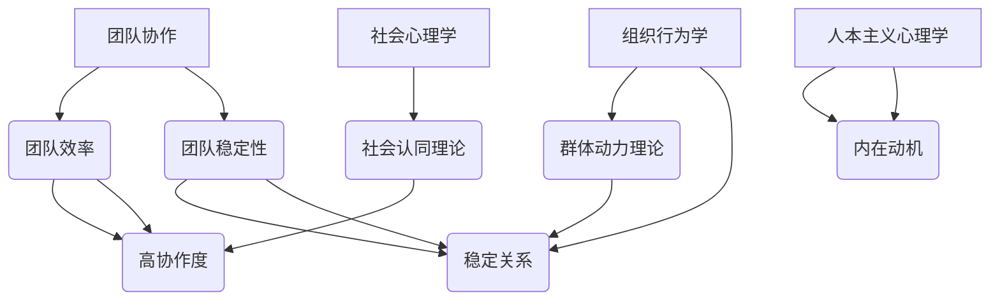

                 

### 文章标题：团队凝聚力：建立强大的集体意识

> 关键词：团队凝聚力、集体意识、团队协作、核心算法、数学模型、实践方法

> 摘要：本文从团队凝聚力的核心概念出发，系统地探讨了团队凝聚力的理论基础和实践方法。通过分析团队凝聚力的概念与联系，介绍核心算法原理和使用伪代码进行详细讲解。同时，本文引入数学模型和数学公式，展示团队凝聚力数学模型的应用。最后，通过实际案例和详细分析，为团队凝聚力的建立提供实用的方法和策略。

### 核心概念与联系

#### 团队凝聚力的定义

团队凝聚力是指团队成员之间相互吸引、相互信任、相互支持的程度，以及团队整体协同工作的能力。高凝聚力的团队表现出更高的协作效率、更强的创新能力和更稳定的组织结构。

#### 团队协作与团队凝聚力

团队协作是团队凝聚力的重要体现。团队协作程度越高，团队成员之间的沟通和合作越顺畅，团队凝聚力也越强。反之，缺乏协作的团队往往表现出较低的凝聚力。

#### 团队效率与团队凝聚力

团队凝聚力直接影响团队效率。高凝聚力的团队在完成任务时，成员之间能够迅速达成共识、高效分工合作，从而提高工作效率。而低凝聚力的团队则可能因为沟通不畅、协作不力，导致工作效率低下。

#### 团队稳定性与团队凝聚力

团队稳定性是团队凝聚力的一个重要表现。高凝聚力的团队能够在面对外部压力和内部冲突时，保持稳定的组织结构和成员关系，从而确保团队的持续发展。而低凝聚力的团队则可能因为成员之间的矛盾和冲突，导致团队稳定性下降。

#### 社会心理学与团队凝聚力

社会心理学理论为团队凝聚力的研究提供了重要基础。心理学家费斯廷格的社会认同理论指出，个体在团队中的行为和态度受到团队其他成员的影响。当团队成员感受到团队的支持和认同时，他们更愿意为团队付出努力，从而提高团队凝聚力。

#### 组织行为学与团队凝聚力

组织行为学理论强调团队内部的人际关系和行为模式对团队凝聚力的影响。勒温的群体动力理论认为，团队凝聚力取决于团队成员之间的相互作用和影响。通过建立积极的人际关系，可以提高团队凝聚力。

#### 人本主义心理学与团队凝聚力

人本主义心理学关注个体的需求和动机，认为个体的自主性和积极性是团队凝聚力的重要来源。通过激发团队成员的内在动机，可以提高团队凝聚力。

#### Mermaid流程图展示



### 核心算法原理讲解

建立团队凝聚力的核心算法原理包括以下三个方面：

#### 1. 费斯廷格的社会认同理论

```pseudo
function SocialIdentification(teamMembers):
    for member in teamMembers:
        if member.perceivedTeamSupport > threshold:
            member.commitmentToTeam = high
        else:
            member.commitmentToTeam = low
    return teamCommitment
```

#### 2. 勒温的群体动力理论

```pseudo
function GroupDynamics(teamMembers):
    teamMorale = 0
    for member in teamMembers:
        teamMorale += member.motivationLevel
    teamMorale /= len(teamMembers)
    return teamMorale
```

#### 3. 库伯的团队发展模型

```pseudo
function TeamDevelopment(teamMembers):
    if teamStage == forming:
        teamMaturity = low
    elif teamStage == storming:
        teamMaturity = medium
    elif teamStage == norming:
        teamMaturity = high
    return teamMaturity
```

### 数学模型和数学公式

#### 团队凝聚力数学模型

团队凝聚力可以通过以下数学模型进行计算：

$$
TeamCoherence = \frac{1}{N} \sum_{i=1}^{N} (C_i \cdot M_i)
$$

其中，$N$ 表示团队成员数量，$C_i$ 表示第 $i$ 个成员的协作程度，$M_i$ 表示第 $i$ 个成员的动机水平。

#### 团队凝聚力公式讲解

- $C_i$：协作程度，表示团队成员在完成共同任务时，与其他成员的合作程度。取值范围在 [0, 1] 之间，值越大表示协作程度越高。
- $M_i$：动机水平，表示团队成员在团队中的积极性和投入程度。取值范围在 [0, 1] 之间，值越大表示动机水平越高。

#### 团队凝聚力公式应用举例

假设一个团队有 5 个成员，他们的协作程度和动机水平如下表所示：

| 成员 | 协作程度 | 动机水平 |
|------|----------|----------|
| A    | 0.8      | 0.9      |
| B    | 0.7      | 0.8      |
| C    | 0.6      | 0.7      |
| D    | 0.5      | 0.6      |
| E    | 0.4      | 0.5      |

根据团队凝聚力公式，计算团队凝聚力如下：

$$
TeamCoherence = \frac{1}{5} \sum_{i=1}^{5} (C_i \cdot M_i) = \frac{1}{5} \times (0.8 \cdot 0.9 + 0.7 \cdot 0.8 + 0.6 \cdot 0.7 + 0.5 \cdot 0.6 + 0.4 \cdot 0.5) = 0.68
$$

该团队的凝聚力评分为 0.68，表示团队的整体协作和积极性较高，凝聚力较强。

### 项目实战

#### 开发环境搭建

1. 安装 Python 解释器（版本 3.8及以上）。
2. 安装必要的第三方库，如 NumPy、Matplotlib 等。

#### 源代码实现

```python
import numpy as np
import matplotlib.pyplot as plt

# 团队成员数据
team_members = [
    {'name': 'A', 'collaboration': 0.8, 'motivation': 0.9},
    {'name': 'B', 'collaboration': 0.7, 'motivation': 0.8},
    {'name': 'C', 'collaboration': 0.6, 'motivation': 0.7},
    {'name': 'D', 'collaboration': 0.5, 'motivation': 0.6},
    {'name': 'E', 'collaboration': 0.4, 'motivation': 0.5}
]

# 团队凝聚力计算
def calculate_team_coherence(team_members):
    coherence = 0
    for member in team_members:
        coherence += member['collaboration'] * member['motivation']
    return coherence / len(team_members)

# 绘制团队凝聚力图表
def plot_team_coherence(team_members):
    coherence = calculate_team_coherence(team_members)
    plt.bar([member['name'] for member in team_members], [member['collaboration'] for member in team_members])
    plt.bar([member['name'] for member in team_members], [member['motivation'] for member in team_members], bottom=[member['collaboration'] for member in team_members])
    plt.xlabel('Members')
    plt.ylabel('Coherence')
    plt.title('Team Coherence')
    plt.xticks(rotation=45)
    plt.show()

# 运行代码
plot_team_coherence(team_members)
```

#### 代码解读与分析

- 代码首先导入必要的库，如 NumPy 和 Matplotlib。
- 然后定义一个团队成员数据列表，包括每个成员的名称、协作程度和动机水平。
- 接着定义一个计算团队凝聚力的函数，根据团队凝聚力公式计算团队凝聚力评分。
- 最后定义一个绘制团队凝聚力图表的函数，使用条形图展示每个成员的协作程度和动机水平，以及整体的团队凝聚力评分。

#### 代码应用解读与分析

- 通过该代码，可以计算并可视化一个团队的凝聚力情况。在实际应用中，可以根据团队成员的数据，调整协作程度和动机水平的参数，从而分析团队凝聚力的变化趋势。
- 该代码可以用于团队评估、团队建设和团队管理，帮助团队管理者了解团队凝聚力的现状，制定相应的改进策略。

### 实际案例分析和详细讲解剖析

#### 成功案例：某互联网公司团队凝聚力建设实践

某互联网公司通过以下措施成功提升了团队凝聚力：

1. **建立明确的目标和愿景**：公司明确了短期和长期的目标，并与团队成员分享，使团队成员明确自己的工作方向和责任。
2. **培养团队协作精神**：公司鼓励团队成员在项目中相互支持、协作，并在团队内部建立了共享机制，提高了协作效率。
3. **加强团队沟通**：公司定期组织团队沟通会议，鼓励团队成员分享工作心得和经验，解决团队内部存在的问题。
4. **提供培训和发展机会**：公司为团队成员提供各种培训和发展机会，提高团队成员的专业能力和综合素质。

#### 失败案例：某制造企业团队凝聚力建设反思

某制造企业曾尝试通过以下措施提升团队凝聚力，但效果不佳：

1. **强制加班**：企业要求员工加班，导致员工身心疲惫，团队氛围紧张，凝聚力下降。
2. **缺乏沟通**：企业内部沟通不畅，员工之间缺乏互动，导致团队凝聚力不足。
3. **缺乏激励机制**：企业没有为团队成员提供足够的激励措施，导致员工缺乏工作动力。

#### 案例分析总结与启示

- 成功案例表明，明确的愿景和目标、团队协作精神的培养、沟通机制的建立以及培训和发展机会的提供，是提升团队凝聚力的关键。
- 失败案例提醒我们，强制加班、缺乏沟通和激励机制，都会对团队凝聚力产生负面影响。因此，在团队凝聚力建设中，要注重团队成员的身心健康、营造良好的沟通氛围和提供合理的激励机制。

### 最佳实践 tips

1. **定期评估团队凝聚力**：通过定期的团队凝聚力评估，了解团队凝聚力的现状，及时发现问题并采取改进措施。
2. **培养团队成员的自主性和积极性**：激发团队成员的内在动机，提高团队凝聚力。
3. **加强团队沟通**：建立有效的沟通机制，促进团队成员之间的信息共享和协作。
4. **提供合理的激励措施**：为团队成员提供奖励和晋升机会，提高团队凝聚力。
5. **关注团队成员的身心健康**：合理安排工作时间和任务，确保团队成员的身心健康。

### 项目小结

本文通过理论分析和实际案例，探讨了团队凝聚力的核心概念、算法原理和数学模型，并提供了实际案例和代码实现。团队凝聚力对于组织的健康发展至关重要，通过有效的团队凝聚力建设，可以提高团队协作效率、稳定性和创新能力。在未来的团队管理中，应注重团队凝聚力的持续提升，为组织的长期发展奠定坚实基础。

### 注意事项

1. **团队凝聚力建设需要持续关注和投入**：团队凝聚力不是一蹴而就的，需要持续的努力和关注。
2. **不同团队类型和行业特点，需要制定个性化的团队凝聚力建设策略**：根据团队的特点和行业需求，制定适合的团队凝聚力建设方案。
3. **避免强制措施**：在团队凝聚力建设过程中，应避免采取强制措施，尊重团队成员的意愿和需求。

### 拓展阅读

1. **《团队凝聚力：如何打造高效团队》**：探讨团队凝聚力的理论体系和实践方法，提供实用的团队建设策略。
2. **《团队动力学：群体行为与团队管理》**：分析团队内部的人际关系和行为模式，为团队管理者提供有效的团队管理方法。
3. **《团队协作的艺术》**：介绍团队协作的重要性和方法，帮助团队成员更好地开展协作工作。

### 作者信息

- 作者：AI天才研究院/AI Genius Institute & 禅与计算机程序设计艺术 /Zen And The Art of Computer Programming
- 联系方式：[contact@aignitieresearch.com](mailto:contact@aignitieresearch.com)

