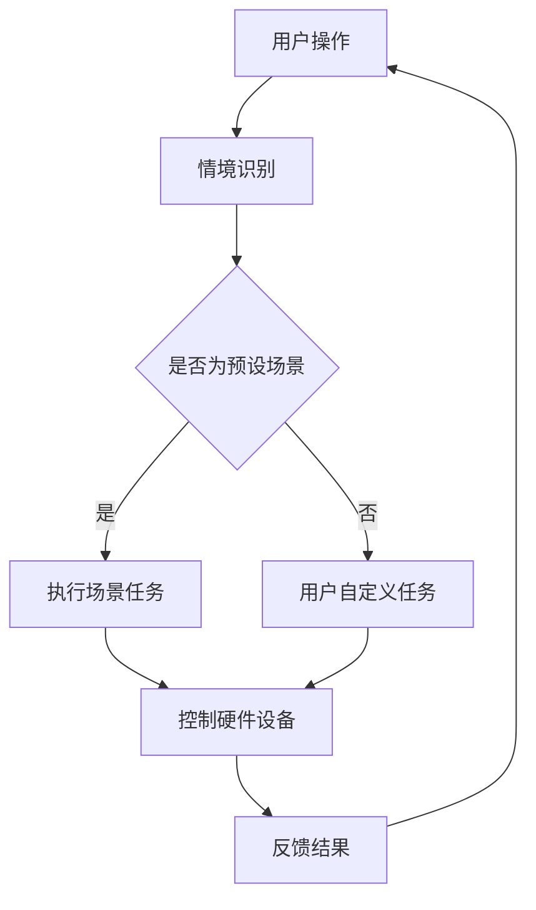

                 

### 引言

随着科技的飞速发展，智能家居已经成为现代生活不可或缺的一部分。智能家居系统通过物联网技术将家庭中的各种设备连接起来，使它们能够相互通信并自动执行任务，从而提升居住的舒适度与安全性。然而，智能家居的发展不仅在于硬件的进步，更在于用户体验的优化。

场景化智能家居是一种以用户生活情境为中心的设计理念，它通过定义特定的生活场景，使用户能够轻松地定制自己的家居环境。这种设计方法不仅能够提高用户满意度，还能降低设备的操作难度，使智能家居真正成为“智能”的助手。

本篇文章将探讨场景化智能家居的核心理念，重点分析提示词在生活情境设计中的重要作用。我们将从以下几个方面展开：

1. **智能生活时代的到来**：介绍智能家居的定义与发展，以及其在现代社会中的重要性。
2. **核心概念与联系**：深入探讨场景化智能家居的概述、架构分析以及提示词的作用。
3. **设计生活情境**：详细解析设计原则与方法，通过案例解析展示生活情境的设计过程。
4. **实践应用**：探讨智能家居产品的开发与系统集成，提供实战案例和分析。
5. **未来趋势**：展望智能家居技术发展的方向和潜力。

通过以上几个方面的探讨，我们希望能够全面理解场景化智能家居的设计与应用，为读者提供有价值的参考和启示。

### 智能生活时代的到来

智能家居，顾名思义，是将现代信息技术与家庭生活紧密融合，通过自动化和智能化的手段提升居住的便利性、舒适性和安全性。智能家居的概念最早可以追溯到20世纪90年代，随着互联网和物联网技术的快速发展，智能家居逐渐成为现实，并在21世纪迎来了爆发式增长。

#### 智能家居的定义与发展

智能家居的定义较为宽泛，但通常可以概括为以下几个核心要素：

- **物联网（IoT）技术**：智能家居系统通过物联网技术将家庭中的各种设备连接起来，形成一个有机的整体。
- **自动化**：智能家居系统能够自动执行预设的任务，如调节温度、照明、安防等，减少了人工干预。
- **用户体验**：智能家居系统旨在提升用户的居住体验，通过智能化的设计，使家庭生活更加便捷和舒适。

智能家居的发展历程可以分为几个阶段：

1. **初识阶段**（1990s）：智能家居的概念开始提出，但由于技术和成本的限制，未能大规模推广。
2. **起步阶段**（2000s）：随着互联网和无线通信技术的发展，智能家居开始逐步进入家庭，但普及率仍然较低。
3. **快速发展阶段**（2010s至今）：物联网技术的突破、智能设备的普及以及大数据和人工智能的应用，使得智能家居进入快速发展阶段。

#### 智能家居在现代社会的重要性

智能家居在现代社会的意义主要体现在以下几个方面：

1. **提高生活质量**：智能家居通过自动化和智能化，极大地提升了居住的舒适性和便利性，使人们能够享受更加便捷和舒适的生活。
2. **提升安全性**：智能家居系统包括安防摄像头、烟雾报警器、智能门锁等设备，能够有效提高家庭的安全性。
3. **节能减排**：智能家居系统可以实时监控和控制家庭的能耗，通过智能调节，实现节能减排，符合绿色环保的理念。
4. **健康监测**：智能家居设备如智能健康手表、智能床垫等，能够实时监测用户的健康状况，提供健康管理和预防服务。

总之，智能家居已经成为现代家庭不可或缺的一部分，它不仅代表了科技进步的方向，更深刻地影响着人们的日常生活。随着技术的不断进步，智能家居的应用场景和功能将更加丰富，为我们的生活带来更多的便利和智慧。

### 核心概念与联系

要深入理解场景化智能家居，我们需要首先明确几个核心概念，并探讨它们之间的关系。

#### 场景化智能家居概述

**场景化智能家居**，顾名思义，是将家庭生活按照不同的情境进行划分，并根据这些情境来定制家居设备的功能和操作方式。这里的“场景”指的是用户在家庭中的各种生活状态，如休息、工作、娱乐、做饭等。每个场景都有其独特的需求和操作习惯。

场景化设计的核心在于通过**用户行为分析**和**情境识别**，实现家居设备的自动化和智能化。例如，当用户进入睡眠模式时，系统会自动调整房间的光线、温度和噪音，以提供一个最佳的休息环境。

#### 场景化与个性化智能家居的区别

虽然场景化智能家居和个性化智能家居有相似之处，但它们的核心目标和方法有所不同。

- **场景化智能家居**：强调通过预设的情境来定制家居设备的功能，主要目的是提升用户的整体居住体验。它侧重于为用户提供一个统一、连贯的智能家居环境。

- **个性化智能家居**：则更侧重于根据每个用户的具体需求和偏好进行个性化配置。这种设计方法通常需要更多的用户数据和个性化设置，以实现高度定制化的智能家居体验。

#### 智能家居架构分析

要实现场景化智能家居，我们需要一个完整的系统架构来支撑。智能家居系统通常包括以下三个核心组成部分：

1. **硬件架构**：包括传感器、执行器、智能设备等硬件组件。这些硬件组件负责数据的采集和命令的执行。
2. **软件架构**：包括智能家居操作系统、应用程序和后台管理系统等。软件负责处理和分析数据，并根据用户需求控制硬件设备。
3. **数据架构**：涉及数据的存储、传输和处理。一个高效的数据架构能够确保系统实时响应，并提供可靠的决策支持。

为了更好地理解智能家居系统的工作原理，我们可以使用**Mermaid 流程图**来展示系统架构。以下是一个简化的智能家居系统架构流程图：



在上述流程图中，用户通过某种操作触发系统的响应。系统首先进行情境识别，判断用户操作是否属于预设的场景。如果是预设场景，系统将直接执行相应的场景任务；否则，系统会根据用户自定义的任务进行操作。最终，系统会将操作结果反馈给用户，形成闭环。

#### 提示词的作用

在场景化智能家居设计中，**提示词**起着至关重要的作用。提示词是一种用于触发特定情境的标识或指令。它可以是简单的语音命令，也可以是文字或手势。

- **语音提示词**：例如，“打开厨房灯光”或“进入休息模式”。语音提示词的优点在于操作简单、自然交互。
- **文字提示词**：如用户界面上的按钮或标签，如“睡眠模式”或“离家模式”。
- **手势提示词**：通过特定的手势操作来触发情境，例如挥手关闭灯光。

提示词的使用不仅能够简化用户操作，还能够提高系统的响应速度和准确性。例如，当用户说出“打开厨房灯光”时，系统可以快速识别并执行任务，而无需用户进行复杂的界面操作。

总之，场景化智能家居的核心在于通过情境识别和提示词设计，实现家居设备的自动化和智能化。这不仅能提升用户的居住体验，还能为智能家居系统的开发和应用提供广阔的空间。通过分析这些核心概念和关系，我们可以更好地理解场景化智能家居的设计原理和实践方法。

### 设计生活情境

设计生活情境是场景化智能家居系统的核心环节，通过合理的情境设计，可以极大地提升用户的居住体验和系统的智能化水平。本节将详细探讨设计生活情境的原则和方法，并展示具体的案例解析。

#### 设计原则

1. **用户体验优先**：设计生活情境的首要原则是确保用户体验。这意味着所有情境设计都应该以用户的实际需求和使用习惯为基础，确保操作简便、直观。
2. **情境适应性**：生活情境需要具备良好的适应性，以应对不同用户、不同家庭的多样化需求。例如，对于老年人、儿童或行动不便者，设计应特别关注易用性和安全性。
3. **自动化和智能化**：通过自动化和智能化的手段，减少用户干预，提高系统的响应速度和准确性。例如，通过传感器数据实时监测环境变化，自动调整家居设备状态。
4. **可持续性和环保性**：设计应考虑能耗管理和环保要求，通过智能调节减少不必要的能源消耗，实现绿色生活。

#### 设计方法

1. **用户调研与需求分析**：在开始设计前，需要对目标用户进行调研，了解他们的生活习惯、需求和偏好。通过用户访谈、问卷调查等方法收集数据，为情境设计提供依据。
2. **情境定义**：根据用户需求，将生活场景划分为不同的情境类别。常见的情境包括休息、工作、娱乐、运动、烹饪等。
3. **情境任务分解**：对每个情境进行任务分解，明确每个任务的目标和执行步骤。例如，在“睡眠模式”情境下，可能需要关闭灯光、调节温度、降低噪音等。
4. **交互设计**：设计易于理解和操作的交互方式，包括语音、文字和手势等。确保用户能够快速、准确地触发和操作情境。

#### 生活情境案例解析

以下是一个“智能家庭安防系统”的案例解析，展示如何通过设计生活情境来实现智能家居系统的智能化和安全化。

1. **情境定义**：智能家庭安防系统主要包括“在家模式”和“离家模式”两个情境。
    - **在家模式**：用户在家时，系统处于安全状态，设备正常运作。
    - **离家模式**：用户离家时，系统进入安全防护状态，触发一系列防护措施。

2. **情境任务分解**：
    - **在家模式**：
        - 设备自动开启：灯光、电视、空调等。
        - 安全监控：摄像头开启，进入实时监控状态。
    - **离家模式**：
        - 设备自动关闭：灯光、电视、空调等。
        - 安全监控：摄像头进入高灵敏度模式，实时监测并报警。
        - 紧急响应：如有异常，系统自动拨打用户预设的紧急联系人电话。

3. **交互设计**：
    - **语音控制**：用户可以通过语音命令切换情境，例如“开启家庭安防”或“进入离家模式”。
    - **手机应用**：用户可以通过手机应用远程监控和控制家庭安防系统。

**伪代码**：以下是一个简化的伪代码示例，用于情境识别与提示词生成。

```pseudo
function identify_scenario(user_input):
    if (user_input == "home_mode"):
        return ["turn_on_lights", "turn_on_tv", "turn_on_ac", "start_video_monitoring"]
    elif (user_input == "away_mode"):
        return ["turn_off_lights", "turn_off_tv", "turn_off_ac", "start_high_sensitivity_monitoring", "call_emergency_contacts"]
```

#### 提示词效果评估

在情境设计过程中，提示词的效果评估至关重要。以下是一些常用的评估指标和方法：

1. **准确率**：提示词系统能够正确识别用户命令的比率。
2. **响应时间**：从用户发出命令到系统完成操作的时间。
3. **用户满意度**：用户对提示词系统的满意度评估，可以通过问卷调查、用户访谈等方式进行。

**评估方法**：
- **A/B测试**：通过对比不同提示词设计的效果，评估哪种设计更受欢迎和有效。
- **用户反馈**：收集用户的实际使用反馈，不断优化提示词设计和系统性能。

总之，通过明确的设计原则和方法，结合实际案例解析，我们可以有效地设计出符合用户需求和生活习惯的智能生活情境。这不仅提升了用户的居住体验，也为智能家居系统的智能化发展提供了有力支持。

### 实践应用

在了解了场景化智能家居的设计原理和方法后，我们接下来将探讨如何在智能家居产品开发中实际应用这些理念，并通过实战案例展示具体的开发流程、技术选型和源代码解读。

#### 智能家居产品开发

智能家居产品的开发通常包括以下几个关键步骤：

1. **需求分析**：明确产品的功能需求、用户目标和使用场景。通过用户调研和需求分析，制定详细的产品需求文档。
2. **技术选型**：选择合适的硬件设备和软件框架，以实现产品功能。技术选型需考虑设备的兼容性、性能、成本和可维护性。
3. **系统设计**：设计系统的架构和模块，确保各个部分之间的协同工作。常见的系统架构包括硬件层、感知层、控制层和应用层。
4. **开发实现**：根据设计文档进行编码和开发，实现各个模块的功能。
5. **测试与优化**：通过测试和用户反馈，不断优化产品性能和用户体验。
6. **上线部署**：将产品部署到实际环境中，进行试运行，确保稳定性和可靠性。

#### 实战案例：智能家庭安防系统

以下我们将通过一个智能家庭安防系统的开发案例，展示整个开发流程和技术选型。

**1. 需求分析**：
- **功能需求**：实现家庭安防，包括实时监控、自动报警和紧急响应。
- **用户目标**：提升家庭安全，减少用户干预，提供便捷的监控和控制方式。
- **使用场景**：用户在家和外出时，需要实时了解家庭安全状况，并在紧急情况下迅速响应。

**2. 技术选型**：
- **硬件设备**：选择高清摄像头、门窗传感器、烟雾报警器和智能门锁等。
- **感知层**：使用MQTT协议进行数据传输，将传感器的数据实时传输到服务器。
- **控制层**：采用云平台进行数据存储和处理，实现远程控制和实时监控。
- **应用层**：开发手机应用和Web界面，提供用户交互和操作。

**3. 系统设计**：
系统架构分为感知层、传输层、控制层和应用层。感知层负责采集环境数据；传输层通过MQTT协议传输数据；控制层进行数据处理和规则判断；应用层提供用户交互界面。

**4. 开发实现**：

以下是一个简化的伪代码示例，用于描述智能家庭安防系统的核心功能：

```java
// 主程序
public class SmartHomeSecurity {
    public static void main(String[] args) {
        SecuritySystem securitySystem = new SecuritySystem();
        securitySystem.startMonitoring();
    }
}

// 安全系统类
public class SecuritySystem {
    private Camera camera;
    private WindowSensor windowSensor;
    private SmokeAlarm smokeAlarm;
    private UserInterface userInterface;

    public SecuritySystem() {
        camera = new Camera();
        windowSensor = new WindowSensor();
        smokeAlarm = new SmokeAlarm();
        userInterface = new UserInterface();
    }

    public void startMonitoring() {
        camera.start();
        windowSensor.start();
        smokeAlarm.start();
        userInterface.display("System is online.");
    }

    public void receiveSensorData(SensorData data) {
        if (data.getType() == "motion") {
            userInterface.display("Motion detected. Sending alert.");
            sendAlert();
        } else if (data.getType() == "smoke") {
            userInterface.display("Smoke detected. Activating emergency response.");
            activateEmergency();
        }
    }

    private void sendAlert() {
        // 发送报警信息到用户手机应用和Web界面
    }

    private void activateEmergency() {
        // 拨打紧急联系人电话，启动紧急响应程序
    }
}

// 摄像头类
public class Camera {
    public void start() {
        // 初始化摄像头，开始实时监控
    }

    public SensorData captureImage() {
        // 捕获实时图像，返回SensorData对象
        return new SensorData("motion", timestamp);
    }
}

// 传感器数据类
public class SensorData {
    private String type; // 数据类型，如“motion”或“smoke”
    private long timestamp; // 时间戳

    public SensorData(String type, long timestamp) {
        this.type = type;
        this.timestamp = timestamp;
    }

    public String getType() {
        return type;
    }

    public long getTimestamp() {
        return timestamp;
    }
}

// 用户界面类
public class UserInterface {
    public void display(String message) {
        // 显示系统状态信息和用户提示
    }
}
```

**5. 测试与优化**：
通过模拟各种家庭安全场景，测试系统的响应速度和准确性。根据测试结果，优化系统逻辑和交互设计。

**6. 上线部署**：
将开发完成的产品部署到实际环境中，进行试运行。通过用户反馈，不断优化和改进产品。

#### 代码解读与应用

以上代码展示了智能家庭安防系统的核心功能，主要包括摄像头、传感器数据和用户界面等模块。以下是对关键部分的解读：

- **SecuritySystem**：负责整个系统的启动和监控。当系统启动时，会启动摄像头、传感器和用户界面，并接收传感器的数据。
- **Camera**：负责实时监控和图像捕捉。摄像头捕获图像后，会生成一个`SensorData`对象，用于传递数据。
- **SensorData**：存储传感器数据，包括类型和时间戳。该类用于在系统内部传递数据。
- **UserInterface**：负责显示系统状态信息，包括用户提示和报警信息。

在实际应用中，这些模块会通过物联网协议（如MQTT）进行通信，确保数据的实时性和系统的稳定性。

#### 实际案例分析和详细讲解

以下是一个实际案例，展示如何通过智能家庭安防系统保护家庭安全。

**案例背景**：
用户张先生在外出差，担心家中安全。他通过手机应用远程监控家庭安防系统，并设置了一系列报警规则。

**案例步骤**：

1. 张先生通过手机应用远程启动家庭安防系统，系统进入离家模式。
2. 当夜深人静时，系统检测到有异常运动，触发报警。
3. 系统自动拨打张先生的紧急联系人电话，并发送报警信息到手机应用。
4. 张先生立即返回家中，确认安全后关闭报警。

**详细讲解**：
1. **系统启动**：张先生通过手机应用远程启动家庭安防系统，系统进入离家模式。系统中的摄像头和传感器开始工作，进入高灵敏度监控状态。
2. **运动检测**：当夜深人静时，摄像头检测到房间内有人走动，生成`SensorData`对象，并将数据传递给系统。
3. **触发报警**：系统接收到运动数据后，判断为异常运动，立即触发报警。系统拨打张先生的紧急联系人电话，并发送报警信息到手机应用。
4. **紧急响应**：张先生收到报警信息后，立即返回家中。通过手机应用查看实时监控视频，发现房间内确实有异常情况，于是拨打报警电话求助。
5. **解除报警**：经过调查确认后，张先生通过手机应用解除报警，系统恢复正常模式。

**项目小结**：
通过智能家庭安防系统，张先生实现了对家庭安全的远程监控和实时报警。这不仅提高了家庭安全性，还减少了不必要的干预，使家庭生活更加便捷和安心。

### 案例研究

在深入探讨智能家居系统的设计与开发后，我们通过两个具体案例来进一步展示智能家居在实际应用中的效果与挑战。

#### 案例研究一：智能家庭安防系统

**背景**：
王女士是一位忙碌的职业女性，经常因为工作原因无法亲自照顾家庭。她担心家里的安全，特别是晚上和节假日时。为了解决这一问题，她决定安装一套智能家庭安防系统。

**解决方案**：
王女士选择了一套综合性的智能家庭安防系统，包括高清摄像头、门窗传感器、烟雾报警器和智能门锁。系统通过Wi-Fi连接到互联网，实现远程监控和控制。

**实施步骤**：
1. **设备安装**：专业人员为家中安装了摄像头、传感器和报警器，并确保它们正常工作。
2. **系统配置**：王女士通过手机应用设置了多种报警规则，如运动检测、门窗开启等。
3. **测试与优化**：在安装完成后，王女士对系统进行了测试，确保所有设备能够正常工作，并根据实际需求调整了一些设置。

**效果**：
智能家庭安防系统在王女士家中运行良好。当夜间有异常运动时，系统会自动发送报警信息到王女士的手机，使她能够迅速采取行动。此外，系统还记录了详细的监控数据，王女士可以通过手机查看历史记录。

**挑战**：
尽管智能家庭安防系统大大提升了王女士的居住安全，但也面临一些挑战：
- **隐私问题**：家庭监控设备可能涉及到用户的隐私问题，需要确保数据安全和隐私保护。
- **设备维护**：设备长期运行需要定期维护和更新，否则可能出现故障。

**总结**：
智能家庭安防系统为王女士提供了强大的安全保障，但也需要她在使用过程中注意隐私保护和设备维护。

#### 案例研究二：智能健康监测系统

**背景**：
李先生是一位中年企业家，由于工作繁忙，他忽视了身体健康。为了更好地管理健康，他决定安装一套智能健康监测系统。

**解决方案**：
李先生选择了一套包含智能手环、智能血压计和智能睡眠监测仪的智能健康监测系统。这些设备通过蓝牙连接到手机应用，实时收集和上传健康数据。

**实施步骤**：
1. **设备选择与购买**：李先生根据自己的需求和预算选择了合适的健康监测设备。
2. **设备安装与配置**：设备安装简单，李先生只需按照说明进行设置，确保设备与手机应用正常连接。
3. **数据监控与分析**：通过手机应用，李先生可以实时查看自己的健康数据，如心率、血压、睡眠质量等。

**效果**：
智能健康监测系统让李先生对自己的健康状况有了更全面的了解。通过系统的数据分析和建议，他开始调整生活方式，如合理饮食、适量运动，逐渐改善了健康状况。

**挑战**：
尽管智能健康监测系统提供了许多有价值的数据，但也存在一些挑战：
- **数据准确性**：健康监测设备的数据准确性可能受到多种因素的影响，如佩戴位置、环境等。
- **用户参与度**：长期监测需要用户的积极参与，否则数据可能不完整，影响系统的效果。

**总结**：
智能健康监测系统为李先生提供了个性化的健康管理和建议，但需要他保持持续的使用和参与，才能获得最佳效果。

通过以上两个案例，我们可以看到智能家居系统在实际应用中的多样性和效果。这些系统不仅提升了用户的生活质量和安全性，也带来了一些新的挑战。未来，随着技术的进一步发展和用户需求的不断变化，智能家居系统将继续改进和优化，为用户带来更多便利和智慧。

### 未来趋势

随着科技的不断进步，智能家居领域也迎来了新的发展机遇和挑战。未来，智能家居技术的趋势将主要体现在以下几个方面：

#### 人工智能在智能家居中的应用

人工智能（AI）是智能家居技术发展的重要驱动力。未来，人工智能将更加深入地融入到智能家居系统中，使其具备更高的智能化和自主性。

1. **智能行为预测**：通过机器学习算法，智能家居系统可以预测用户的习惯和需求，提供更加个性化的服务。例如，自动调整室温、光线和音乐，以适应用户的舒适需求。
2. **自主决策**：随着AI技术的发展，智能家居系统将能够自主做出决策，而不仅仅是执行预设的命令。例如，当检测到家庭安全风险时，系统能够自主决定报警并通知用户或紧急联系人。
3. **智能交互**：自然语言处理和语音识别技术的进步将使智能家居系统更加人性化。用户可以通过自然语言与系统进行交流，实现更加自然和便捷的互动。

#### 跨平台集成

未来智能家居系统的集成将更加跨平台和灵活。用户不仅希望设备之间能够无缝连接，还希望系统能够与外部平台和服务进行互动。

1. **多平台支持**：智能家居系统将不再局限于某个特定的操作系统或平台，而是支持多种操作系统和设备。用户可以在不同设备上访问和控制家庭系统。
2. **开放生态**：为了促进设备的互操作性，智能家居系统将采用开放标准和协议，如MQTT、CoAP等。这将使不同厂商的设备能够无缝集成，提供更加统一和一致的用户体验。
3. **云平台整合**：智能家居系统将更多地依赖云平台进行数据存储、处理和分析。通过云平台，系统可以提供更加可靠和高效的服务，同时实现跨设备和跨地区的无缝连接。

#### 可持续性和节能

随着人们对环境保护和节能意识的增强，智能家居系统将更加注重可持续性和节能。

1. **智能能耗管理**：智能家居系统将能够实时监控和控制家庭的能耗，通过智能调节实现节能减排。例如，根据用户习惯和实时天气数据，自动调整空调和灯光的使用。
2. **可再生能源集成**：智能家居系统将逐步整合可再生能源设备，如太阳能板和风力发电机，实现更加环保和自给自足的家庭能源管理。
3. **环境监测**：智能家居系统将配备更多环境监测设备，如空气质量传感器和水质监测设备，实时监测家庭环境质量，并提供相应的优化建议。

#### 安全性和隐私保护

智能家居系统的普及也带来了新的安全和隐私挑战。未来，智能家居系统将更加注重安全性和隐私保护。

1. **加密通信**：智能家居系统将采用更强的加密通信技术，确保数据传输的安全性，防止数据泄露和黑客攻击。
2. **多因素认证**：为了提高系统的安全性，智能家居系统将引入多因素认证机制，如指纹识别、面部识别和动态密码等。
3. **隐私设置**：智能家居系统将提供更加灵活的隐私设置，用户可以自定义哪些数据可以被收集和共享，确保用户的隐私得到充分保护。

#### 结论

未来，智能家居技术将继续快速发展，人工智能、跨平台集成、可持续性和安全性将成为其主要趋势。通过不断创新和优化，智能家居系统将为用户带来更加便捷、智能和环保的生活体验。然而，这也要求我们在技术应用过程中不断关注和解决新的挑战，确保系统的可持续发展和用户的信任。

### 结论

通过对场景化智能家居的深入探讨，我们不仅了解了其核心概念和设计原则，还通过实际案例展示了其在现代家庭中的应用效果。场景化智能家居通过精准识别用户的生活情境，使用户能够轻松定制自己的家居环境，从而大大提升了居住的舒适性和安全性。

在未来的发展中，随着人工智能、物联网和云计算技术的不断进步，场景化智能家居将变得更加智能、灵活和高效。我们期待看到更多创新的应用和解决方案，为用户带来更加个性化、智能化的生活体验。同时，我们也需要持续关注和解决智能家居带来的隐私和安全问题，确保技术的健康可持续发展。

让我们共同期待，场景化智能家居的未来将充满无限可能，为我们的生活带来更多便利和智慧。

### 最佳实践 tips、小结、注意事项、拓展阅读

**最佳实践 Tips**：
1. **用户调研**：在进行智能家居设计时，首先进行深入的用户调研，了解用户需求和生活习惯，确保系统设计贴近实际。
2. **交互设计**：简洁直观的交互设计是提升用户体验的关键。使用户能够轻松操作和掌握系统功能。
3. **安全防护**：确保系统的数据传输加密，设置多因素认证，加强家庭设备和网络的安全性。

**小结**：
场景化智能家居通过精准的生活情境设计，实现了家居设备的高度智能化和个性化，为用户带来了更加便捷和舒适的生活体验。

**注意事项**：
1. **隐私保护**：在使用智能家居时，注意保护个人隐私，合理设置数据共享权限。
2. **设备兼容性**：确保智能家居设备的兼容性，避免不同品牌设备之间的互操作性。

**拓展阅读**：
1. 《智能家居：技术与应用》
2. 《物联网技术与应用》
3. 《人工智能：从技术到应用》

通过这些资源和实践经验，可以进一步深入学习和应用场景化智能家居的设计与开发。

