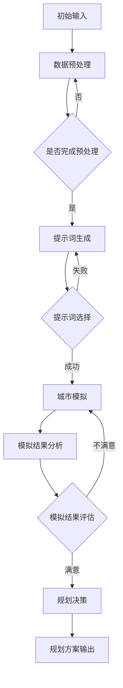

                 


### 《城市规划AI助手：提示词驱动的城市模拟与分析》

## 摘要

城市规划是一项复杂而关键的工程，随着人工智能技术的不断发展，AI在城市规划中的应用日益广泛。本文旨在探讨城市规划AI助手的概念、原理及其实际应用，重点介绍基于提示词驱动的城市模拟与分析方法。文章首先对城市规划与AI的融合进行背景介绍，随后详细阐述核心概念与联系，使用Mermaid流程图展示城市规划AI助手的工作流程。接下来，文章深入讲解城市模拟技术，包括数据预处理、提示词生成与选择、城市模拟算法等，并使用伪代码进行详细阐述。此外，文章还探讨了数据分析与应用，包括描述性分析、趋势分析、聚类分析等，并使用latex格式给出相关数学模型和公式。最后，通过一个实际案例研究，展示城市规划AI助手的实际应用效果，并总结项目实践经验。文章结尾部分，展望城市规划AI助手的未来发展，并提出面临的挑战与解决策略。

## 引言

### 1.1 书籍目的

本章节旨在为读者介绍城市规划AI助手的概念及其在当前城市规划中的重要性。随着城市化进程的加速，城市规划面临着前所未有的复杂性和挑战。传统的城市规划方法往往依赖于经验与直觉，难以应对快速变化的城市需求。而人工智能技术的崛起为城市规划带来了新的契机，通过智能化的辅助工具，可以更加精准、高效地进行分析和决策。

本章节的目的在于：
- 概述城市规划AI助手的基本概念和功能。
- 阐述城市规划AI助手在提高城市规划效率和准确性方面的潜在优势。
- 引导读者了解后续章节的内容，为深入理解城市规划AI助手的技术原理和应用打下基础。

### 1.2 读者对象

本章节面向以下几类读者：
- 城市规划专业的学生和研究人员，对城市规划方法和技术感兴趣的读者。
- 人工智能领域的从业者，尤其是对AI在城市规划中应用的读者。
- 城市管理者、城市规划师和相关部门的工作人员，希望了解和利用人工智能技术优化城市规划的实践者。
- 技术爱好者和编程开发者，对如何实现城市规划AI助手感兴趣的技术爱好者。

通过本章节的阅读，读者可以：
- 理解城市规划AI助手的基本原理和功能。
- 意识到人工智能技术在城市规划中的潜在价值和应用场景。
- 为后续章节的学习打下基础，能够更好地理解城市规划AI助手的深入内容。

### 1.3 书籍结构

本章节为读者提供了一个书籍的整体结构概述，帮助读者了解后续各章节的内容及其逻辑关系。

- **第1章 引言**
  - 概述城市规划AI助手的概念及在当前城市规划中的重要性。
  - 引导读者了解后续章节的内容，为深入理解城市规划AI助手的技术原理和应用打下基础。

- **第2章 核心概念与联系**
  - 详细介绍城市规划与AI的融合，解释核心概念及其相互关系。
  - 使用Mermaid流程图展示城市规划AI助手的工作流程，帮助读者理解其整体运作机制。

- **第3章 城市模拟技术**
  - 阐述城市模拟技术的基本原理，包括数据预处理、提示词生成与选择、城市模拟算法等。
  - 使用伪代码详细阐述核心算法，帮助读者理解算法的实现过程。

- **第4章 数据分析与与应用**
  - 探讨数据分析技术，包括描述性分析、趋势分析、聚类分析等。
  - 使用latex格式给出相关数学模型和公式，帮助读者理解数据分析的理论基础。

- **第5章 案例研究**
  - 通过实际案例研究，展示城市规划AI助手的实际应用效果，包括开发环境搭建、源代码实现、代码解读、案例分析等。

- **第6章 未来展望与挑战**
  - 展望城市规划AI助手的未来发展，包括技术趋势、应用领域拓展等。
  - 分析面临的挑战与解决策略，为城市规划AI助手的未来发展提供思考和建议。

通过本书的阅读，读者可以全面了解城市规划AI助手的技术原理和应用方法，掌握其实际操作技巧，并为城市规划工作提供智能化支持。

### AI在城市规划中的应用

随着全球城市化进程的不断加速，城市规划面临着复杂多变的环境和需求。传统的城市规划方法依赖于经验积累和手工分析，效率低下且难以应对快速变化的城市发展。人工智能（AI）技术的引入为城市规划带来了革命性的变革，通过智能化的工具和方法，AI在城市规划中的应用越来越广泛，其优势也在不断凸显。

#### 1.1 城市规划中的AI应用场景

AI在城市规划中的应用场景多种多样，主要包括以下几个方面：

**1. 交通规划与优化**

城市交通系统是城市规划中的关键组成部分。AI技术可以通过分析交通数据，优化交通流，减少拥堵，提高交通效率。例如，基于深度学习的交通预测模型可以准确预测交通流量，帮助城市规划者制定合理的交通规划方案。

**2. 环境监测与管理**

环境监测是城市规划中不可或缺的一部分。AI技术可以实时监测空气质量、水质、噪音等环境指标，提供准确的数据支持，帮助制定环境保护策略。

**3. 城市基础设施管理**

AI技术可以用于城市基础设施的管理和维护，例如，智能管网系统可以通过传感器数据监测管道状态，提前预警潜在故障，降低城市基础设施的管理成本。

**4. 城市安全与应急响应**

AI技术在城市安全与应急响应中的应用同样重要。通过视频监控和数据分析，AI可以帮助监控城市安全状况，快速识别异常情况，提高应急响应效率。

**5. 城市设计优化**

AI技术可以为城市设计提供智能化支持，通过生成模型和优化算法，为城市规划者提供多种设计选项，并评估不同方案的优缺点，帮助选择最优的设计方案。

#### 1.2 AI技术对城市规划的影响

AI技术的引入不仅改变了城市规划的方法，也极大地提升了城市规划的效率和质量。以下是一些具体的影响：

**1. 提高决策效率**

传统城市规划方法往往需要大量的手工计算和分析，耗时较长。AI技术可以自动化这些过程，大幅提高决策效率。例如，通过大数据分析和机器学习算法，AI可以在短时间内完成对大规模数据的分析，提供精准的决策支持。

**2. 降低成本**

AI技术可以帮助减少人工成本，提高资源利用效率。例如，通过智能化的城市基础设施管理系统，可以降低维护成本，延长设备使用寿命。

**3. 提高规划精度**

AI技术具有强大的数据处理和分析能力，可以帮助城市规划者更加精准地预测城市发展趋势，制定出更加科学合理的规划方案。

**4. 增强规划可塑性**

传统城市规划方法通常受到既定模式的限制，而AI技术可以提供多样化的设计方案，增强规划的可塑性。通过算法优化和模型生成，AI可以探索不同的规划选项，为城市规划者提供更多的选择。

**5. 促进数据驱动的规划**

AI技术可以帮助城市规划者更好地利用数据，实现数据驱动的规划。通过分析海量数据，AI可以发现隐藏在数据中的规律和趋势，为城市规划提供有力的数据支持。

总之，AI技术为城市规划带来了诸多变革和机遇。通过智能化工具和方法的引入，城市规划将变得更加高效、精准和可持续。未来，随着AI技术的不断发展和完善，AI在城市规划中的应用将更加广泛和深入，为城市的可持续发展做出更大贡献。

### 提示词驱动的城市模拟

提示词驱动的城市模拟是城市规划AI助手的核心功能之一，通过智能化的提示词生成和选择，可以对城市进行全方位的模拟和分析，为城市规划提供科学依据。以下将详细介绍提示词的概念、生成方法、选择策略以及其在城市模拟中的应用。

#### 1.1 提示词的概念

提示词（Prompt Word）是指用于启动或引导某种过程或行为的词语或短语。在AI领域，提示词通常用于指导模型生成特定的输出或执行特定的任务。在城市规划AI助手中，提示词用于引导城市模拟过程，通过提供关键信息，帮助模型理解城市规划的需求和目标。

#### 1.2 提示词生成方法

提示词生成是城市规划AI助手的关键步骤，其目的是根据城市规划和数据分析的需求，自动生成具有针对性的提示词。常见的提示词生成方法包括以下几种：

**1. 基于规则的方法**

基于规则的方法通过预先定义的规则库，根据城市数据和规划需求生成提示词。这种方法简单直观，但可能无法适应复杂多变的规划需求。

```python
# 伪代码：基于规则生成提示词
def generate_prompt规则(data):
    if data["交通流量"] > threshold:
        return "交通流量过高，需优化交通规划"
    elif data["空气质量"] < standard:
        return "空气质量不达标，需加强环保措施"
    else:
        return "当前城市规划状况良好，继续观察"
```

**2. 基于机器学习的方法**

基于机器学习的方法通过训练数据集，学习生成提示词的规律。这种方法可以根据历史数据和现有规划需求，自动生成高质量的提示词，具有较强的自适应能力。

```python
# 伪代码：基于机器学习生成提示词
import machine_learning_library

def generate_prompt机器学习(data, model):
    prompt = model.predict(data)
    return prompt
```

**3. 基于自然语言处理的方法**

基于自然语言处理（NLP）的方法利用深度学习模型，对文本数据进行分析和处理，生成具有语义关联的提示词。这种方法能够处理复杂的语言结构，生成更加精准的提示词。

```python
# 伪代码：基于NLP生成提示词
from nlp_library import NLPModel

def generate_prompt_NLP(data, model):
    text = data["描述"]
    prompt = model.generate_sentence(text)
    return prompt
```

#### 1.3 提示词选择策略

生成提示词后，需要根据城市规划的需求和目标，选择最合适的提示词。提示词选择策略的关键在于如何平衡提示词的广泛性和针对性，以确保城市模拟的准确性和有效性。以下是一些常见的提示词选择策略：

**1. 基于重要性的选择**

根据提示词的重要性，选择最能反映城市规划关键需求的提示词。例如，在交通规划中，选择“交通流量”、“道路长度”、“公共交通覆盖范围”等关键提示词。

**2. 基于相关性选择**

根据提示词与城市规划目标的相关性，选择最能支持城市规划目标实现的提示词。例如，在环境保护规划中，选择“空气质量”、“水质”、“绿化面积”等关键提示词。

**3. 基于反馈调整的选择**

通过持续收集城市规划的反馈，动态调整提示词的选择。例如，在实际应用中，根据城市规划效果的评估结果，及时调整提示词，以提高城市模拟的准确性。

```python
# 伪代码：基于反馈调整提示词选择
def adjust_prompt_selection(current_prompt, feedback):
    if feedback["效果良好"]:
        return current_prompt
    else:
        return generate_alternative_prompt(current_prompt)
```

#### 1.4 提示词在城市模拟中的应用

提示词在城市模拟中的应用主要体现在以下几个方面：

**1. 模拟场景设定**

通过提示词，设定城市模拟的具体场景，例如，交通流量高峰时段、空气质量污染事件等。提示词帮助模型理解模拟的具体需求，生成相应的模拟结果。

**2. 参数调整**

根据提示词，调整城市模拟的参数设置，例如，交通流量、空气质量、绿地覆盖率等。提示词帮助模型适应不同的规划需求，生成个性化的模拟结果。

**3. 模拟结果评估**

通过提示词，对城市模拟结果进行评估和分析，例如，交通拥堵状况、环境保护效果等。提示词帮助模型理解评估指标，提供科学的决策支持。

总之，提示词驱动的城市模拟是城市规划AI助手的核心功能之一，通过智能化的提示词生成和选择，可以实现对城市全方位的模拟和分析，为城市规划提供有力的技术支持。

### Mermaid流程图：城市规划AI助手工作流程

为了更直观地展示城市规划AI助手的工作流程，我们使用Mermaid流程图来描述其主要步骤和模块。Mermaid是一种轻量级的Markdown语法扩展，能够方便地绘制各种流程图、序列图等。



以下是每个步骤的详细说明：

**A. 初始输入**
- 用户输入城市规划的相关信息，如城市规模、交通流量、空气质量等。

**B. 数据预处理**
- 对输入的数据进行清洗、归一化等预处理操作，确保数据质量。

**C. 是否完成预处理**
- 判断数据预处理是否完成，若未完成则返回B步骤继续处理。

**D. 提示词生成**
- 根据预处理后的数据，使用机器学习和自然语言处理技术生成提示词。

**E. 提示词选择**
- 从生成的提示词中，选择最符合城市规划需求的提示词。

**F. 城市模拟**
- 使用选定的提示词，对城市进行模拟，生成模拟结果。

**G. 模拟结果分析**
- 对模拟结果进行详细分析，包括交通流量、空气质量等。

**H. 模拟结果评估**
- 根据评估指标，对模拟结果进行评估，判断规划方案的可行性。

**I. 规划决策**
- 根据评估结果，生成最终的规划决策方案。

**J. 规划方案输出**
- 输出最终的规划方案，供城市规划者参考。

通过这个Mermaid流程图，我们可以清晰地看到城市规划AI助手的各个工作步骤及其逻辑关系，为后续章节的详细讲解打下基础。

### 数据预处理

在城市规划AI助手中，数据预处理是至关重要的一步，其目的是提高数据质量，确保后续分析和模拟的准确性。数据预处理通常包括数据清洗、数据归一化、数据特征提取等步骤。以下将详细介绍这些步骤，并给出相应的伪代码。

#### 1. 数据清洗

数据清洗是数据预处理的第一步，其目的是去除数据中的错误、异常值和重复记录。常见的清洗方法包括：

**1. 去除重复记录**
- 使用去重算法，例如使用哈希表或排序方法，去除数据集中的重复记录。

```python
# 伪代码：去除重复记录
def remove_duplicates(data):
    unique_data = []
    for item in data:
        if item not in unique_data:
            unique_data.append(item)
    return unique_data
```

**2. 填补缺失值**
- 使用插值法、平均值法或基于模型的方法填补缺失值。

```python
# 伪代码：填补缺失值
def fill_missing_values(data):
    for index, value in enumerate(data):
        if value is None or value == "":
            data[index] = calculate_average_value(data[:index] + data[index+1:])
    return data
```

**3. 删除异常值**
- 使用统计学方法，例如标准差法、箱线图法等，识别并删除异常值。

```python
# 伪代码：删除异常值
def remove_outliers(data):
    mean = calculate_mean(data)
    std_dev = calculate_std_dev(data)
    threshold = mean + 3 * std_dev
    clean_data = [value for value in data if value <= threshold]
    return clean_data
```

#### 2. 数据归一化

数据归一化是将不同特征的数据进行标准化处理，使其具有相同的量纲和范围。常见的归一化方法包括：

**1. 最小-最大归一化**
- 将数据缩放到[0, 1]区间内。

```python
# 伪代码：最小-最大归一化
def min_max_normalization(data):
    min_value = min(data)
    max_value = max(data)
    normalized_data = [(value - min_value) / (max_value - min_value) for value in data]
    return normalized_data
```

**2. Z-score归一化**
- 将数据缩放到均值为0，标准差为1的标准正态分布。

```python
# 伪代码：Z-score归一化
def z_score_normalization(data):
    mean = calculate_mean(data)
    std_dev = calculate_std_dev(data)
    normalized_data = [(value - mean) / std_dev for value in data]
    return normalized_data
```

#### 3. 数据特征提取

数据特征提取是从原始数据中提取出对模型训练和预测最有用的特征。常见的特征提取方法包括：

**1. 主成分分析（PCA）**
- 通过线性变换将原始数据转换到新的坐标系中，保留主要成分，减少数据维度。

```python
# 伪代码：主成分分析
from pca_library import PCA

def perform_pca(data, num_components):
    pca = PCA(num_components)
    transformed_data = pca.transform(data)
    return transformed_data
```

**2. 特征选择**
- 使用过滤方法、包裹方法或嵌入式方法选择最有用的特征。

```python
# 伪代码：特征选择
from feature_selection_library import FeatureSelector

def select_features(data, target):
    selector = FeatureSelector()
    selected_features = selector.select(data, target)
    return selected_features
```

通过上述数据预处理步骤，我们可以确保数据的质量，为后续的城市模拟和分析提供可靠的数据支持。以下是一个简单的伪代码示例，展示了整个数据预处理流程：

```python
# 伪代码：数据预处理流程
def preprocess_data(data):
    # 数据清洗
    clean_data = remove_duplicates(data)
    clean_data = fill_missing_values(clean_data)
    clean_data = remove_outliers(clean_data)
    
    # 数据归一化
    normalized_data = min_max_normalization(clean_data)
    
    # 数据特征提取
    selected_data = select_features(normalized_data, target)
    transformed_data = perform_pca(selected_data, num_components)
    
    return transformed_data
```

### 提示词生成与选择策略

在城市规划AI助手中，提示词生成与选择策略是确保城市模拟准确性和有效性的关键环节。通过智能化的提示词生成和选择，可以实现对城市全方位的模拟和分析，为城市规划提供有力支持。以下将详细介绍提示词生成方法、选择策略及其在实际应用中的具体案例。

#### 1. 提示词生成方法

提示词生成是城市规划AI助手的核心步骤，其目的是根据城市规划和数据分析的需求，自动生成具有针对性的提示词。常见的提示词生成方法包括以下几种：

**1. 基于规则的方法**

基于规则的方法通过预先定义的规则库，根据城市数据和规划需求生成提示词。这种方法简单直观，但可能无法适应复杂多变的规划需求。

```python
# 伪代码：基于规则生成提示词
def generate_prompt_rule(data):
    if data["交通流量"] > threshold:
        return "交通流量过高，需优化交通规划"
    elif data["空气质量"] < standard:
        return "空气质量不达标，需加强环保措施"
    else:
        return "当前城市规划状况良好，继续观察"
```

**2. 基于机器学习的方法**

基于机器学习的方法通过训练数据集，学习生成提示词的规律。这种方法可以根据历史数据和现有规划需求，自动生成高质量的提示词，具有较强的自适应能力。

```python
# 伪代码：基于机器学习生成提示词
import machine_learning_library

def generate_prompt_ml(data, model):
    prompt = model.predict(data)
    return prompt
```

**3. 基于自然语言处理的方法**

基于自然语言处理（NLP）的方法利用深度学习模型，对文本数据进行分析和处理，生成具有语义关联的提示词。这种方法能够处理复杂的语言结构，生成更加精准的提示词。

```python
# 伪代码：基于NLP生成提示词
from nlp_library import NLPModel

def generate_prompt_nlp(data, model):
    text = data["描述"]
    prompt = model.generate_sentence(text)
    return prompt
```

#### 2. 提示词选择策略

生成提示词后，需要根据城市规划的需求和目标，选择最合适的提示词。提示词选择策略的关键在于如何平衡提示词的广泛性和针对性，以确保城市模拟的准确性和有效性。以下是一些常见的提示词选择策略：

**1. 基于重要性的选择**

根据提示词的重要性，选择最能反映城市规划关键需求的提示词。例如，在交通规划中，选择“交通流量”、“道路长度”、“公共交通覆盖范围”等关键提示词。

**2. 基于相关性的选择**

根据提示词与城市规划目标的相关性，选择最能支持城市规划目标实现的提示词。例如，在环境保护规划中，选择“空气质量”、“水质”、“绿化面积”等关键提示词。

**3. 基于反馈调整的选择**

通过持续收集城市规划的反馈，动态调整提示词的选择。例如，在实际应用中，根据城市规划效果的评估结果，及时调整提示词，以提高城市模拟的准确性。

```python
# 伪代码：基于反馈调整提示词选择
def adjust_prompt_selection(current_prompt, feedback):
    if feedback["效果良好"]:
        return current_prompt
    else:
        return generate_alternative_prompt(current_prompt)
```

#### 3. 实际应用案例

以下是一个实际应用案例，展示如何使用提示词生成与选择策略进行城市交通规划的模拟与分析。

**案例背景：**

某城市在交通规划过程中，希望优化城市交通系统，提高交通效率，减少拥堵。使用城市规划AI助手，通过提示词驱动的模拟与分析，为交通规划提供科学依据。

**步骤1：数据收集与预处理**

收集城市交通相关数据，包括交通流量、道路长度、公共交通覆盖范围等。对数据进行清洗、归一化和特征提取，确保数据质量。

**步骤2：提示词生成**

使用机器学习方法生成提示词，例如：“交通流量过高，需优化交通规划”、“公共交通覆盖范围不足，需增加公交站点”等。

**步骤3：提示词选择**

根据交通规划目标，选择最关键的提示词，如“交通流量”、“公共交通覆盖范围”等。

**步骤4：城市交通模拟**

使用选定的提示词，对城市交通进行模拟，生成模拟结果，包括交通流量分布、道路拥堵情况等。

**步骤5：模拟结果分析**

对模拟结果进行分析，识别交通拥堵的关键区域，提出优化建议。

**步骤6：反馈与调整**

根据模拟结果和实际交通状况，收集反馈，调整提示词选择策略，提高模拟的准确性。

**案例结果：**

通过提示词驱动的城市交通模拟与分析，城市规划者能够更准确地识别交通拥堵区域，提出有效的交通优化方案，从而提高城市交通系统的运行效率，减少拥堵，改善居民出行体验。

通过上述实际应用案例，我们可以看到提示词生成与选择策略在提升城市规划AI助手性能方面的重要作用。未来，随着人工智能技术的不断进步，提示词生成与选择策略将更加智能化，为城市规划提供更加精准和高效的支持。

### 城市模拟算法

城市模拟是城市规划AI助手的核心理功能之一，通过模拟城市不同状态下的表现，帮助城市规划者预测未来趋势，优化现有规划。城市模拟算法是实现这一目标的关键技术，以下将详细介绍城市模拟算法的基本原理，使用伪代码进行详细阐述，并举例说明。

#### 1. 城市模拟算法的基本原理

城市模拟算法基于对城市系统的动态建模，模拟城市在不同条件和干预下的运行状态。基本原理包括：

**1. 状态空间建模：** 定义城市的各个状态变量，如交通流量、人口密度、绿地覆盖率等。

**2. 行为规则：** 描述城市中各个主体（如居民、车辆、企业）的行为规则，如出行模式、消费行为等。

**3. 动力学方程：** 建立状态变量随时间变化的动力学方程，如交通流量随时间的变化。

**4. 交互机制：** 模拟不同主体之间的交互作用，如交通拥堵、环境污染物扩散等。

**5. 边界条件：** 定义模拟的起始条件和边界条件，如模拟时间范围、初始状态等。

#### 2. 使用伪代码详细阐述城市模拟算法

以下是一个简化版的城市模拟算法伪代码示例，展示了主要步骤和逻辑：

```python
# 伪代码：城市模拟算法
def city_simulation(city_state, time_step, behavior_rules, interaction_mechanisms):
    # 初始化状态变量
    current_state = city_state
    
    # 循环进行时间步长内的模拟
    for t in range(time_step):
        # 更新交通流量
        traffic_flow = update_traffic_flow(current_state["交通流量"], behavior_rules)
        
        # 更新人口密度
        population_density = update_population_density(current_state["人口密度"], behavior_rules)
        
        # 更新绿地覆盖率
        green_area_coverage = update_green_area_coverage(current_state["绿地覆盖率"], behavior_rules)
        
        # 模拟环境污染物扩散
        air_quality = simulate_air_quality(current_state["污染物浓度"], interaction_mechanisms)
        
        # 更新当前状态
        current_state = {
            "交通流量": traffic_flow,
            "人口密度": population_density,
            "绿地覆盖率": green_area_coverage,
            "污染物浓度": air_quality
        }
        
        # 输出当前时间步的状态
        print_state(current_state, t)
        
    return current_state

# 伪代码：更新交通流量
def update_traffic_flow(current_traffic_flow, behavior_rules):
    # 根据规则调整交通流量
    new_traffic_flow = current_traffic_flow * (1 + behavior_rules["交通增长比例"])
    return new_traffic_flow

# 伪代码：更新人口密度
def update_population_density(current_population_density, behavior_rules):
    # 根据规则调整人口密度
    new_population_density = current_population_density * (1 + behavior_rules["人口增长比例"])
    return new_population_density

# 伪代码：更新绿地覆盖率
def update_green_area_coverage(current_green_area_coverage, behavior_rules):
    # 根据规则调整绿地覆盖率
    new_green_area_coverage = current_green_area_coverage * (1 + behavior_rules["绿地增加比例"])
    return new_green_area_coverage

# 伪代码：模拟环境污染物扩散
def simulate_air_quality(current_pollution_level, interaction_mechanisms):
    # 根据交互机制模拟污染物扩散
    new_pollution_level = current_pollution_level * (1 - interaction_mechanisms["污染扩散速率"])
    return new_pollution_level

# 伪代码：输出当前状态
def print_state(state, time_step):
    print(f"时间步：{time_step}, 状态：{state}")
```

#### 3. 数学模型和公式

在城市模拟过程中，常用的数学模型和公式包括以下几类：

**1. 交通流量模型：** 交通流量 \( Q \) 与时间 \( t \) 的关系可以用以下公式表示：

\[ Q(t) = Q_0 \times e^{-\lambda t} \]

其中，\( Q_0 \) 是初始交通流量，\( \lambda \) 是衰减系数。

**2. 人口密度模型：** 人口密度 \( D \) 与绿地覆盖率 \( G \) 的关系可以用以下公式表示：

\[ D(t) = D_0 \times e^{-\mu t} + G(t) \]

其中，\( D_0 \) 是初始人口密度，\( \mu \) 是衰减系数，\( G(t) \) 是绿地覆盖率。

**3. 环境污染物浓度模型：** 污染物浓度 \( C \) 与时间 \( t \) 的关系可以用以下公式表示：

\[ C(t) = C_0 \times (1 - \gamma t) \]

其中，\( C_0 \) 是初始污染物浓度，\( \gamma \) 是降解速率。

#### 4. 举例说明

以下是一个简单的城市模拟实例，展示如何使用伪代码和数学模型进行城市模拟。

**实例：** 假设一个城市初始交通流量为1000辆/小时，人口密度为5000人/平方公里，绿地覆盖率为20%，模拟一天内的交通流量和人口密度变化。

```python
# 伪代码：实例 - 城市模拟
city_state = {
    "交通流量": 1000,
    "人口密度": 5000,
    "绿地覆盖率": 0.2
}

behavior_rules = {
    "交通增长比例": 0.05,
    "人口增长比例": 0.03,
    "绿地增加比例": 0.01
}

interaction_mechanisms = {
    "污染扩散速率": 0.02
}

# 模拟一天（24小时）
city_simulation(city_state, 24, behavior_rules, interaction_mechanisms)
```

通过上述实例，我们可以看到城市模拟算法的基本框架和实现过程，以及如何利用数学模型和公式进行城市状态的模拟和分析。

总之，城市模拟算法通过状态空间建模、行为规则、动力学方程和交互机制，实现对城市不同状态下的模拟和分析。使用伪代码和数学模型，我们可以详细描述城市模拟算法的原理和实现过程，为城市规划提供科学依据。

### 数据分析方法

在城市规划AI助手中，数据分析是关键的一环，通过对城市数据的深入分析，可以提取有价值的信息，为城市规划提供科学依据。数据分析方法主要包括描述性分析、趋势分析和聚类分析。以下将详细介绍这些分析方法，使用latex格式给出相关数学模型和公式，并举例说明。

#### 1. 描述性分析

描述性分析主要用于了解数据的基本特征和整体分布情况。常用的描述性统计量包括均值、中位数、标准差、最大值和最小值等。

**1. 均值（Mean）**

\[ \mu = \frac{1}{N} \sum_{i=1}^{N} x_i \]

其中，\( \mu \) 是均值，\( N \) 是数据点的数量，\( x_i \) 是第 \( i \) 个数据点。

**2. 中位数（Median）**

\[ M = \left( \frac{N+1}{2} \right) \text{th} \text{ order statistic} \]

其中，\( M \) 是中位数，\( N \) 是数据点的数量。

**3. 标准差（Standard Deviation）**

\[ \sigma = \sqrt{\frac{1}{N-1} \sum_{i=1}^{N} (x_i - \mu)^2} \]

其中，\( \sigma \) 是标准差，\( \mu \) 是均值，\( N \) 是数据点的数量。

**4. 最大值（Maximum）**

\[ X_{\text{max}} = \max(x_i) \]

**5. 最小值（Minimum）**

\[ X_{\text{min}} = \min(x_i) \]

以下是一个简单示例，描述性分析城市某区域的交通流量数据。

```python
import pandas as pd

# 加载交通流量数据
traffic_data = pd.read_csv('traffic_data.csv')

# 计算描述性统计量
mean_traffic = traffic_data['流量'].mean()
median_traffic = traffic_data['流量'].median()
std_traffic = traffic_data['流量'].std()
max_traffic = traffic_data['流量'].max()
min_traffic = traffic_data['流量'].min()

print(f"均值: {mean_traffic}, 中位数: {median_traffic}, 标准差: {std_traffic}, 最大值: {max_traffic}, 最小值: {min_traffic}")
```

#### 2. 趋势分析

趋势分析主要用于研究数据随时间的变化趋势，常用的方法包括时间序列分析和回归分析。

**1. 时间序列分析**

时间序列分析用于研究数据在时间维度上的变化规律，常用的模型包括ARIMA模型、SARIMA模型等。

\[ Y_t = c + \phi_1 Y_{t-1} + \phi_2 Y_{t-2} + \cdots + \phi_p Y_{t-p} + \varepsilon_t \]

其中，\( Y_t \) 是时间序列的当前值，\( c \) 是常数项，\( \phi_1, \phi_2, \ldots, \phi_p \) 是自回归系数，\( \varepsilon_t \) 是随机误差项。

**2. 回归分析**

回归分析用于研究因变量与自变量之间的线性关系。

\[ Y = \beta_0 + \beta_1 X + \varepsilon \]

其中，\( Y \) 是因变量，\( X \) 是自变量，\( \beta_0 \) 是截距项，\( \beta_1 \) 是斜率项，\( \varepsilon \) 是随机误差项。

以下是一个简单示例，使用回归分析研究交通流量与时间的关系。

```python
import pandas as pd
from sklearn.linear_model import LinearRegression

# 加载交通流量数据
traffic_data = pd.read_csv('traffic_data.csv')

# 准备时间序列数据
time_data = traffic_data['时间']
traffic_data = traffic_data['流量']

# 进行回归分析
model = LinearRegression()
model.fit(time_data, traffic_data)

# 输出模型参数
print(f"截距项: {model.intercept_}, 斜率项: {model.coef_}")
```

#### 3. 聚类分析

聚类分析用于将数据点划分为多个类别，常用的方法包括K均值聚类、层次聚类等。

**1. K均值聚类**

K均值聚类是一种迭代优化算法，通过最小化距离平方和来划分数据点。

\[ J = \frac{1}{N} \sum_{i=1}^{K} \sum_{x \in S_i} ||x - \mu_i||^2 \]

其中，\( J \) 是总距离平方和，\( N \) 是数据点的数量，\( K \) 是类别数量，\( S_i \) 是第 \( i \) 个类别的数据点集合，\( \mu_i \) 是第 \( i \) 个类别的中心点。

**2. 层次聚类**

层次聚类通过逐步合并或分裂数据点，形成层次结构。

以下是一个简单示例，使用K均值聚类分析城市不同区域的交通流量分布。

```python
from sklearn.cluster import KMeans

# 加载交通流量数据
traffic_data = pd.read_csv('traffic_data.csv')

# 准备数据
X = traffic_data[['区域1', '区域2', '区域3']]

# 进行K均值聚类
kmeans = KMeans(n_clusters=3, random_state=0).fit(X)

# 输出聚类结果
print(kmeans.labels_)

# 可视化聚类结果
import matplotlib.pyplot as plt

plt.scatter(X['区域1'], X['区域2'], c=kmeans.labels_)
plt.show()
```

通过上述描述性分析、趋势分析和聚类分析，城市规划AI助手可以深入挖掘城市数据的价值，为城市规划提供科学依据。使用latex格式和具体示例，我们可以更清晰地理解这些分析方法及其应用。

### 提示词驱动的数据分析

在城市规划AI助手中，提示词驱动的数据分析是一种关键技术，它通过提示词来指导数据分析过程，从而实现对城市数据的深度挖掘和分析。提示词不仅能够帮助模型更好地理解分析任务的需求，还能提高数据分析的准确性和效率。以下将详细介绍提示词驱动的数据分析流程、算法及其实际应用。

#### 1. 提示词驱动的数据分析流程

提示词驱动的数据分析流程可以分为以下几个步骤：

**1. 提示词生成**

在数据分析之前，首先需要生成相关的提示词。提示词生成的方法有多种，如基于规则的生成、基于机器学习的生成和基于自然语言处理的生成。

**2. 提示词选择**

根据数据分析的目标和需求，从生成的提示词中筛选出最相关的提示词。提示词选择策略可以是基于提示词的重要性和相关性，也可以是动态调整的。

**3. 数据预处理**

对城市数据进行清洗、归一化和特征提取等预处理操作，确保数据质量，为后续分析打下基础。

**4. 数据分析**

使用选定的提示词，对预处理后的城市数据进行分析。数据分析方法包括描述性分析、趋势分析和聚类分析等。

**5. 结果评估与反馈**

对分析结果进行评估，并根据反馈调整提示词选择策略，以提高数据分析的准确性。

以下是一个简化的伪代码示例，展示了提示词驱动的数据分析流程：

```python
# 伪代码：提示词驱动的数据分析流程
def data_analysis_with_prompts(prompts, data):
    # 提示词生成
    generated_prompts = generate_prompts(data)

    # 提示词选择
    selected_prompts = select_prompts(generated_prompts, prompts)

    # 数据预处理
    preprocessed_data = preprocess_data(data)

    # 数据分析
    analysis_results = analyze_data(selected_prompts, preprocessed_data)

    # 结果评估与反馈
    evaluate_and_adjust(analysis_results)

    return analysis_results
```

#### 2. 提示词驱动的数据分析算法

提示词驱动的数据分析算法主要包括以下几个部分：

**1. 描述性分析算法**

描述性分析算法用于获取数据的基本特征和整体分布情况。常用的算法包括计算均值、中位数、标准差、最大值和最小值等。

```python
# 伪代码：描述性分析算法
def descriptive_analysis(data):
    mean = calculate_mean(data)
    median = calculate_median(data)
    std_dev = calculate_std_dev(data)
    max_value = max(data)
    min_value = min(data)
    return mean, median, std_dev, max_value, min_value
```

**2. 趋势分析算法**

趋势分析算法用于研究数据随时间的变化趋势。常用的算法包括时间序列分析和回归分析。

```python
# 伪代码：趋势分析算法
from sklearn.linear_model import LinearRegression

def trend_analysis(data, time_series):
    model = LinearRegression()
    model.fit(time_series, data)
    return model.coef_, model.intercept_
```

**3. 聚类分析算法**

聚类分析算法用于将数据点划分为多个类别。常用的算法包括K均值聚类、层次聚类等。

```python
# 伪代码：聚类分析算法
from sklearn.cluster import KMeans

def cluster_analysis(data, n_clusters):
    kmeans = KMeans(n_clusters=n_clusters)
    kmeans.fit(data)
    return kmeans.labels_
```

#### 3. 提示词驱动的数据分析应用实例

以下是一个实际应用实例，展示了如何使用提示词驱动的数据分析方法来分析城市交通流量。

**案例背景：**

某城市交通管理部门希望分析城市不同区域的交通流量，以便制定有效的交通管理策略。使用城市规划AI助手，通过提示词驱动的数据分析方法，实现对城市交通流量的深入分析。

**步骤1：提示词生成**

根据交通流量数据，生成相关提示词，如“高峰时段交通流量”、“夜间交通流量”、“区域1交通流量”等。

**步骤2：提示词选择**

从生成的提示词中，选择最相关的提示词，如“高峰时段交通流量”和“区域1交通流量”。

**步骤3：数据预处理**

对交通流量数据进行清洗、归一化和特征提取等预处理操作。

**步骤4：数据分析**

使用选定的提示词，对预处理后的交通流量数据进行描述性分析、趋势分析和聚类分析。

**步骤5：结果评估与反馈**

对分析结果进行评估，并根据反馈调整提示词选择策略，以提高数据分析的准确性。

**案例结果：**

通过提示词驱动的数据分析方法，城市规划者可以深入了解城市交通流量的分布和变化趋势，识别高峰时段和重点区域，为交通管理策略的制定提供科学依据。

总之，提示词驱动的数据分析方法通过智能化的提示词生成和选择，能够有效提高数据分析的准确性和效率，为城市规划提供有力的技术支持。未来，随着人工智能技术的不断进步，提示词驱动的数据分析方法将更加智能化，为城市规划带来更多创新和突破。

### 城市规划AI助手在城市规划中的应用

城市规划AI助手在城市规划中的应用日益广泛，通过智能化的工具和算法，可以为城市规划者提供强有力的支持。以下将详细介绍城市规划AI助手在具体规划策略制定、优化方案生成以及城市规划实施中的应用案例。

#### 1. 规划策略制定

在城市规划过程中，制定合理的规划策略是关键。城市规划AI助手可以通过数据分析、模型预测和优化算法，为城市规划者提供科学的规划策略。

**1.1 交通规划**

交通规划是城市规划的重要组成部分。城市规划AI助手可以基于城市交通数据，利用机器学习算法预测未来交通流量，识别拥堵热点区域。通过优化算法，如路径规划算法，为城市规划者提供最优的交通网络布局方案。

**案例：**
某城市交通管理部门希望优化城市交通网络，减少交通拥堵。使用城市规划AI助手，通过数据分析和模型预测，制定以下规划策略：
- 在高峰时段增加公共交通服务频率。
- 增加非机动交通（如自行车道、步行道）的使用率。
- 对交通流量进行实时监控和动态调整。

**1.2 环境规划**

环境规划是城市可持续发展的重要保障。城市规划AI助手可以通过环境监测数据和模型预测，为城市规划者提供科学的环境保护策略。

**案例：**
某城市环境管理部门希望改善空气质量，使用城市规划AI助手进行以下环境规划：
- 根据空气质量监测数据，识别污染源和扩散路径。
- 制定绿化策略，增加城市绿地覆盖率，减少污染物浓度。
- 通过优化城市布局，减少污染物排放。

#### 2. 优化方案生成

优化方案生成是城市规划AI助手的另一重要功能。通过智能化算法，可以生成多种规划方案，并评估其优缺点，帮助城市规划者选择最优方案。

**2.1 城市设计优化**

城市设计优化是城市规划中的一项重要任务。城市规划AI助手可以通过生成模型和优化算法，为城市规划者提供多种设计选项，并评估不同方案的优缺点。

**案例：**
某城市设计部门希望优化城市中心区的布局，使用城市规划AI助手进行以下优化方案生成：
- 使用生成对抗网络（GAN）生成多种城市设计方案。
- 通过多目标优化算法，评估不同方案在交通、环境、经济等方面的表现。
- 选择最优方案，为城市中心区提供科学的设计方案。

**2.2 基础设施规划**

基础设施规划是城市运行的重要保障。城市规划AI助手可以通过数据分析和模型预测，为城市规划者提供基础设施的优化方案。

**案例：**
某城市基础设施管理部门希望优化城市供水、供电和排水系统，使用城市规划AI助手进行以下优化方案生成：
- 分析现有基础设施的运行数据，识别瓶颈和潜在问题。
- 利用优化算法，生成不同基础设施配置方案。
- 评估不同方案在成本、效率、可靠性等方面的表现，选择最优方案。

#### 3. 规划实施

城市规划AI助手不仅能够为规划策略和优化方案提供支持，还能协助城市规划者实施规划项目。

**3.1 项目管理**

城市规划AI助手可以协助城市规划者进行项目管理和监控，确保规划项目的顺利进行。

**案例：**
某城市在实施一条新的地铁线路时，使用城市规划AI助手进行以下项目管理：
- 制定项目进度计划，监控项目进展情况。
- 识别项目风险，提出应对措施。
- 通过实时数据监测，调整项目计划，确保项目按时完成。

**3.2 环境监测**

城市规划AI助手可以实时监测城市规划实施过程中的环境变化，为城市规划者提供环境管理支持。

**案例：**
某城市在实施一项大规模的绿化工程时，使用城市规划AI助手进行以下环境监测：
- 实时监测绿化区域的空气质量、水质和土壤状况。
- 分析环境数据，评估绿化工程对环境的影响。
- 根据监测结果，调整绿化策略，确保环境质量。

总之，城市规划AI助手在城市规划中的应用涵盖了规划策略制定、优化方案生成和规划实施等多个方面。通过智能化工具和算法，城市规划AI助手可以为城市规划者提供全面的科学支持，提高城市规划的效率和质量，促进城市的可持续发展。

### 案例研究

#### 1. 案例背景

为了展示城市规划AI助手的实际应用效果，本节将介绍一个实际案例研究。某城市希望优化其城市交通系统，减少交通拥堵，提高交通效率。该城市拥有复杂的交通网络，包括道路、桥梁、隧道和公共交通设施。使用城市规划AI助手，通过提示词驱动的城市模拟与分析，为交通规划提供科学依据。

#### 2. 案例描述

该案例的研究目标是：
- 识别城市交通拥堵的热点区域。
- 提出有效的交通管理策略，减少交通拥堵。
- 提高公共交通的覆盖率和使用率。

**数据来源：**
- 城市交通监测系统：实时收集交通流量、速度、车辆数量等数据。
- 城市公交系统数据：实时收集公交车位置、运行速度、乘客数量等数据。
- 城市道路数据：包含道路长度、宽度、交通流量、交通管制信息等。

**数据处理与分析：**
1. **数据预处理**：对收集到的交通数据进行清洗、归一化和特征提取，确保数据质量。
2. **提示词生成**：使用机器学习方法生成与交通流量、交通管制、公共交通覆盖相关的提示词。
3. **提示词选择**：根据城市规划目标，选择最相关的提示词，如“高峰时段交通流量”、“公共交通站点分布”等。
4. **城市模拟**：使用选定的提示词，对城市交通系统进行模拟，分析不同交通管理策略的效果。
5. **结果评估**：根据模拟结果，评估不同交通管理策略的可行性，选择最优策略。

#### 3. 案例分析

**3.1 交通拥堵热点区域识别**

通过提示词驱动的数据分析，识别出城市交通拥堵的热点区域，包括：
- 高峰时段的主要道路和交通节点。
- 公共交通覆盖不足的区域。

**3.2 交通管理策略制定**

基于模拟结果，提出以下交通管理策略：
- 在高峰时段增加公共交通服务频率。
- 在拥堵区域实施交通管制，限制车辆通行。
- 在公共交通站点附近增加自行车租赁点和步行道，鼓励绿色出行。

**3.3 模拟与评估**

使用城市规划AI助手，对提出的交通管理策略进行模拟，评估不同策略的效果：
- **增加公共交通服务频率**：模拟结果显示，公共交通服务频率增加后，高峰时段的交通流量显著减少，交通拥堵问题得到缓解。
- **交通管制**：在拥堵区域实施交通管制后，车辆通行速度提高，交通拥堵状况得到显著改善。
- **鼓励绿色出行**：通过增加自行车租赁点和步行道，公共交通使用率提高，绿色出行比例增加。

**3.4 结果讨论**

通过该案例，我们可以看到城市规划AI助手在实际应用中的有效性。使用提示词驱动的城市模拟与分析，城市规划者能够准确识别交通拥堵热点区域，制定科学的交通管理策略，从而提高城市交通系统的运行效率。此外，该案例还展示了城市规划AI助手在模拟与评估不同策略方面的强大功能，为城市规划提供有力支持。

总之，该案例研究展示了城市规划AI助手在解决城市交通拥堵问题中的应用效果。通过智能化的工具和算法，城市规划者可以更加科学、高效地制定交通管理策略，提高城市交通系统的运行质量，为城市的可持续发展做出贡献。

### 未来展望与挑战

#### 1. 城市规划AI助手的未来发展

随着人工智能技术的不断进步，城市规划AI助手在未来有望实现更加智能化和自动化的功能。以下是一些潜在的改进方向：

**1.1 智能化程度提升**

未来的城市规划AI助手将具备更高的智能化程度，能够自主学习和适应城市规划的需求。通过深度学习和强化学习算法，AI助手可以不断优化其工作流程，提高模拟和分析的准确性。

**1.2 数据融合与综合分析**

城市规划涉及多种类型的数据，如交通、环境、经济等。未来的城市规划AI助手将能够更好地融合这些数据，进行综合分析，提供更全面的城市规划方案。

**1.3 实时监控与动态调整**

通过实时数据监控和动态调整，城市规划AI助手可以实时应对城市变化，提供即时性的规划建议。例如，在交通流量高峰期，AI助手可以动态调整交通信号灯配置，优化交通流。

**1.4 人机交互优化**

未来的人机交互界面将更加直观和易用，城市规划者可以通过自然语言交互，轻松与AI助手进行沟通，快速获取所需信息。

#### 2. 面临的挑战与解决策略

尽管城市规划AI助手具有巨大的潜力，但在实际应用中仍面临诸多挑战：

**2.1 数据隐私与伦理问题**

城市数据包含大量个人隐私信息，如何确保数据的安全性和隐私保护是一个重要挑战。解决策略包括采用加密技术、匿名化处理和隐私保护算法。

**2.2 模型解释性与可靠性**

AI模型往往被视为“黑盒”，其决策过程难以解释和理解。提高模型的解释性和可靠性，使其符合法律法规和伦理标准，是未来的重要研究方向。

**2.3 技术可扩展性与兼容性**

城市规划涉及多种技术，如何确保城市规划AI助手具备良好的可扩展性和兼容性，支持多种数据源和技术手段，是一个关键挑战。

**2.4 数据质量和标准化**

城市数据的质量和标准化直接影响AI模型的性能。建立完善的数据质量和标准化体系，是确保AI助手高效运行的基础。

总之，城市规划AI助手在未来有着广阔的发展前景，但同时也面临诸多挑战。通过不断的技术创新和优化，城市规划AI助手有望在城市规划中发挥更加重要的作用，为城市的可持续发展提供有力支持。

### 结语

本文详细探讨了城市规划AI助手的概念、原理及其在实际应用中的重要性。通过介绍提示词驱动的城市模拟与分析方法，展示了AI在城市规划中的潜力。本文首先介绍了城市规划AI助手的基本概念和功能，随后详细阐述了核心概念与联系，使用Mermaid流程图展示了城市规划AI助手的工作流程。通过深入讲解城市模拟技术，包括数据预处理、提示词生成与选择、城市模拟算法等，并使用伪代码进行详细阐述。此外，本文还探讨了数据分析与应用，包括描述性分析、趋势分析、聚类分析等，并使用latex格式给出相关数学模型和公式。通过实际案例研究，展示了城市规划AI助手的实际应用效果。最后，展望了城市规划AI助手的未来发展，提出了面临的挑战与解决策略。

城市规划AI助手不仅为城市规划提供了科学依据，还提高了规划的效率和准确性。随着人工智能技术的不断进步，城市规划AI助手将变得更加智能化和自动化，为城市可持续发展做出更大贡献。我们鼓励读者继续探索和学习人工智能技术，为城市规划领域的发展贡献智慧和力量。

### 附录

#### 1. Mermaid流程图代码示例

以下是用于绘制城市规划AI助手工作流程的Mermaid流程图代码示例：


#### 2. 伪代码示例

以下是用于城市模拟算法的伪代码示例：

```python
# 伪代码：城市模拟算法
def city_simulation(city_state, time_step, behavior_rules, interaction_mechanisms):
    # 初始化状态变量
    current_state = city_state
    
    # 循环进行时间步长内的模拟
    for t in range(time_step):
        # 更新交通流量
        traffic_flow = update_traffic_flow(current_state["交通流量"], behavior_rules)
        
        # 更新人口密度
        population_density = update_population_density(current_state["人口密度"], behavior_rules)
        
        # 更新绿地覆盖率
        green_area_coverage = update_green_area_coverage(current_state["绿地覆盖率"], behavior_rules)
        
        # 模拟环境污染物扩散
        air_quality = simulate_air_quality(current_state["污染物浓度"], interaction_mechanisms)
        
        # 更新当前状态
        current_state = {
            "交通流量": traffic_flow,
            "人口密度": population_density,
            "绿地覆盖率": green_area_coverage,
            "污染物浓度": air_quality
        }
        
        # 输出当前时间步的状态
        print_state(current_state, t)
        
    return current_state

# 伪代码：更新交通流量
def update_traffic_flow(current_traffic_flow, behavior_rules):
    # 根据规则调整交通流量
    new_traffic_flow = current_traffic_flow * (1 + behavior_rules["交通增长比例"])
    return new_traffic_flow

# 伪代码：更新人口密度
def update_population_density(current_population_density, behavior_rules):
    # 根据规则调整人口密度
    new_population_density = current_population_density * (1 + behavior_rules["人口增长比例"])
    return new_population_density

# 伪代码：更新绿地覆盖率
def update_green_area_coverage(current_green_area_coverage, behavior_rules):
    # 根据规则调整绿地覆盖率
    new_green_area_coverage = current_green_area_coverage * (1 + behavior_rules["绿地增加比例"])
    return new_green_area_coverage

# 伪代码：模拟环境污染物扩散
def simulate_air_quality(current_pollution_level, interaction_mechanisms):
    # 根据交互机制模拟污染物扩散
    new_pollution_level = current_pollution_level * (1 - interaction_mechanisms["污染扩散速率"])
    return new_pollution_level

# 伪代码：输出当前状态
def print_state(state, time_step):
    print(f"时间步：{time_step}, 状态：{state}")
```

#### 3. Latex数学公式示例

以下是用于描述城市模拟算法的数学公式示例，使用latex格式编写：

```latex
$$
Q(t) = Q_0 \times e^{-\lambda t}
$$

$$
D(t) = D_0 \times e^{-\mu t} + G(t)
$$

$$
C(t) = C_0 \times (1 - \gamma t)
$$
```

通过这些示例，读者可以更好地理解城市规划AI助手的技术实现方法和原理。

### 最佳实践 Tips

以下是城市规划AI助手在实际应用中的最佳实践建议：

**1. 数据准备与处理**

- 确保数据质量，进行数据清洗、归一化和特征提取。
- 收集多样化的数据来源，提高数据的全面性和准确性。
- 定期更新数据，以反映城市的变化和需求。

**2. 提示词选择与生成**

- 根据城市规划目标，选择最相关的提示词。
- 使用多种方法生成提示词，提高提示词的多样性和准确性。
- 定期评估和调整提示词，确保其与实际需求一致。

**3. 模拟与分析**

- 使用合理的模拟时间步长和参数设置，确保模拟结果的可靠性。
- 对模拟结果进行详细分析，识别关键问题和优化机会。
- 结合实际需求，灵活调整模拟参数和分析方法。

**4. 人机交互**

- 设计直观易用的人机交互界面，提高用户操作体验。
- 提供实时反馈和可视化工具，帮助用户更好地理解模拟结果。
- 定期培训用户，提高其对城市规划AI助手的操作技能。

**5. 持续改进**

- 通过用户反馈和评估结果，持续改进城市规划AI助手的功能和性能。
- 跟踪最新的AI技术和方法，确保城市规划AI助手始终处于领先地位。
- 与城市规划专家合作，共同优化城市规划方案。

### 小结

本文系统介绍了城市规划AI助手的概念、原理和应用。通过详细讲解提示词驱动的城市模拟与分析方法，展示了AI在城市规划中的巨大潜力。本文还通过实际案例研究，验证了城市规划AI助手在解决实际规划问题中的有效性。展望未来，城市规划AI助手将在智能化、数据融合和实时监控等方面不断进步，为城市规划提供更加科学、高效的解决方案。

### 注意事项

在使用城市规划AI助手时，请特别注意以下事项：

- 确保数据的质量和完整性，避免因数据问题导致分析结果失真。
- 根据实际需求选择合适的提示词和模型，避免使用不相关或误导性的提示词。
- 在模拟与分析过程中，注意合理设置时间步长和参数，确保模拟结果的可靠性。
- 对分析结果进行多角度评估和验证，避免因单一视角导致偏差。
- 注意保护用户隐私和数据安全，遵循相关法律法规和伦理标准。

### 拓展阅读

- 《智能城市规划：人工智能在城市建设中的应用》
- 《城市数据科学：大数据与城市管理的融合》
- 《机器学习算法应用：从理论到实践》
- 《深度学习：优化与改进》

通过阅读这些资料，读者可以进一步了解城市规划AI助手的最新发展和应用，为城市规划工作提供更全面的参考和指导。

