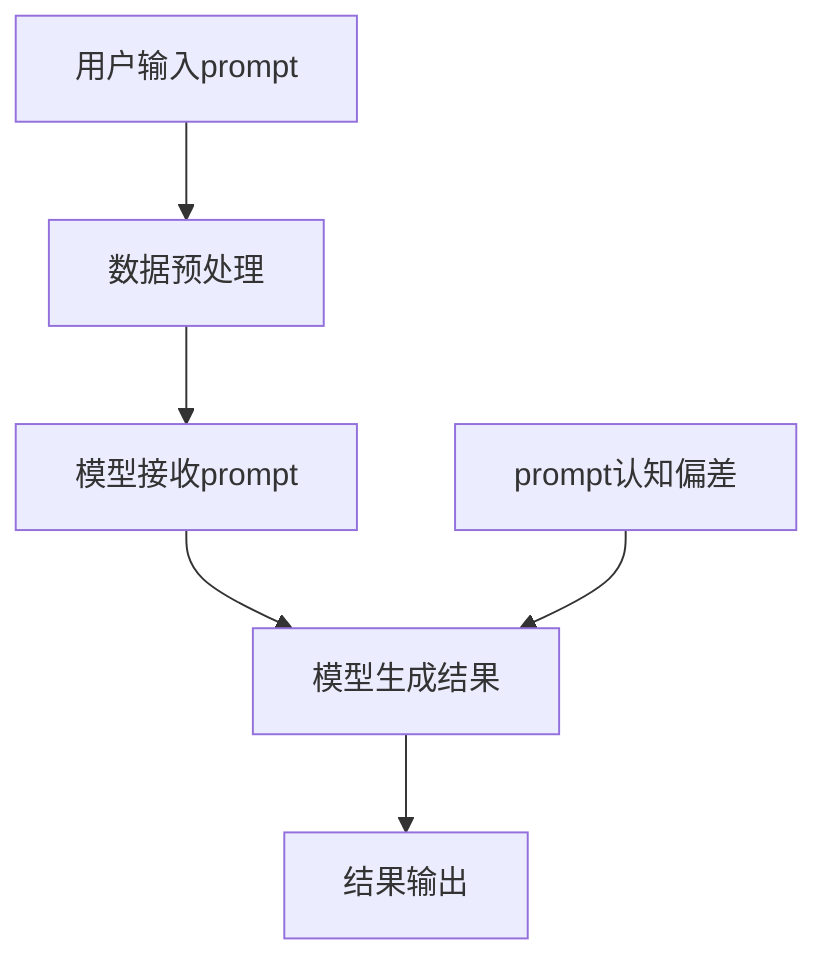

                 


### 一、背景介绍

随着深度学习和自然语言处理（NLP）技术的飞速发展，大型语言模型（LLM, Large Language Model）逐渐成为自然语言处理领域的研究热点。LLM在文本生成、对话系统、机器翻译、文本摘要等多个方面取得了显著的成果。然而，LLM在处理现实世界中的任务时，往往面临着认知偏差的问题。这些偏差可能源于数据集的偏差、模型训练过程中的算法选择、甚至用户输入的prompt偏差。

认知偏差是指人们在认知过程中由于信息加工的方式、个人经验、情感等因素导致的判断和决策的偏见。在自然语言处理领域，prompt认知偏差指的是用户输入的prompt（提示）对模型生成结果产生的影响，导致模型输出结果出现偏差。例如，在一个对话系统中，如果用户的初始prompt偏向某种观点，那么模型生成的回答也可能会不自觉地倾向这一观点。

当前，LLM在认知偏差纠正方面的研究还处于初步阶段，但已显示出巨大的潜力。本文将围绕基于LLM的prompt认知偏差纠正展开讨论，旨在系统地介绍相关概念、算法原理、数学模型和项目实战，为后续研究提供参考。

### 二、核心概念与联系

#### 2.1 LLM概述

LLM是一种基于深度学习的自然语言处理模型，其核心思想是通过大规模语料库的预训练，使模型具备理解和生成自然语言的能力。LLM通常由多层神经网络组成，每层神经网络负责处理不同层次的语言特征。

#### 2.2 prompt认知偏差的概念

prompt认知偏差是指用户输入的prompt对模型生成结果产生的偏差。这种偏差可能源于多方面，包括但不限于：

1. **数据集偏差**：训练LLM的数据集可能存在偏见，导致模型在处理现实问题时也倾向于这些偏见。
2. **模型训练偏差**：在模型训练过程中，选择不同的优化算法、损失函数等可能导致模型对某些问题产生偏差。
3. **用户输入偏差**：用户输入的prompt可能带有主观色彩，从而影响模型生成结果。

#### 2.3 LLM与prompt认知偏差的关系

LLM在生成自然语言时，其输出结果受到prompt的强烈影响。一方面，LLM通过prompt获取输入信息，从而生成相关内容；另一方面，prompt中的偏差可能会传递给模型，导致模型输出结果出现偏差。

为了更好地理解LLM与prompt认知偏差的关系，我们可以通过以下Mermaid流程图进行说明：



在上述流程图中，用户输入的prompt经过数据预处理后，被传递给模型。模型在处理prompt时，受到prompt认知偏差的影响，从而生成结果。最后，模型输出结果并被展示给用户。

### 三、核心算法原理讲解

#### 3.1 LLM算法原理

LLM的算法原理主要包括预训练和微调两个阶段。在预训练阶段，模型通过大规模语料库进行自监督学习，学习语言的特征和规律；在微调阶段，模型针对特定任务进行有监督学习，优化模型参数。

以下是LLM算法原理的伪代码：

```python
# 预训练阶段
def pretrain(model, dataset):
    for epoch in range(num_epochs):
        for sentence in dataset:
            model.zero_grad()
            prediction = model(sentence)
            loss = calculate_loss(prediction, target)
            loss.backward()
            model.optimizer.step()

# 微调阶段
def fine_tune(model, task_dataset):
    for epoch in range(num_epochs):
        for example in task_dataset:
            model.zero_grad()
            input_sequence, target_sequence = preprocess(example)
            prediction = model(input_sequence)
            loss = calculate_loss(prediction, target_sequence)
            loss.backward()
            model.optimizer.step()
```

#### 3.2 prompt认知偏差纠正算法

prompt认知偏差纠正算法旨在通过调整模型输入的prompt，降低模型输出结果中的偏差。具体来说，该算法包括以下几个步骤：

1. **偏差检测**：对模型输出结果进行统计分析，识别潜在的偏差。
2. **偏差调整**：根据偏差检测结果，对prompt进行调整，以降低模型输出结果中的偏差。
3. **模型重新训练**：在调整后的prompt上重新训练模型，优化模型参数。

以下是prompt认知偏差纠正算法的伪代码：

```python
# 偏差检测
def detect_bias(model, dataset):
    bias_scores = []
    for example in dataset:
        input_sequence, target_sequence = preprocess(example)
        prediction = model(input_sequence)
        bias_score = calculate_bias_score(prediction, target_sequence)
        bias_scores.append(bias_score)
    return mean(bias_scores)

# 偏差调整
def adjust_prompt(prompt, bias_score):
    adjusted_prompt = prompt
    if bias_score > threshold:
        adjusted_prompt = apply_correction(adjusted_prompt)
    return adjusted_prompt

# 模型重新训练
def retrain_model(model, adjusted_dataset):
    model.zero_grad()
    for epoch in range(num_epochs):
        for example in adjusted_dataset:
            input_sequence, target_sequence = preprocess(example)
            prediction = model(input_sequence)
            loss = calculate_loss(prediction, target_sequence)
            loss.backward()
            model.optimizer.step()
```

### 四、数学模型和数学公式讲解

#### 4.1 LLM数学模型

LLM的数学模型主要包括概率分布函数和损失函数。

1. **概率分布函数**：

   给定输入序列 $X = (x_1, x_2, ..., x_n)$，LLM的概率分布函数可以表示为：

   $$ 
   P(X) = \prod_{i=1}^{n} P(x_i|x_{i-1}, ..., x_1)
   $$

   其中，$P(x_i|x_{i-1}, ..., x_1)$ 表示在给定前一个词 $x_{i-1}, ..., x_1$ 的情况下，生成当前词 $x_i$ 的概率。

2. **损失函数**：

   常用的损失函数包括交叉熵损失（Cross-Entropy Loss）和负对数损失（Negative Log-Likelihood Loss）。交叉熵损失函数可以表示为：

   $$ 
   L = -\sum_{i=1}^{n} y_i \log(p(x_i|x_{i-1}, ..., x_1))
   $$

   其中，$y_i$ 表示真实标签，$p(x_i|x_{i-1}, ..., x_1)$ 表示模型预测的概率。

#### 4.2 prompt认知偏差数学模型

prompt认知偏差的数学模型可以从两个方面进行考虑：

1. **偏差检测模型**：

   偏差检测模型可以通过计算模型输出结果与真实结果的差异来检测偏差。具体来说，可以定义一个偏差检测函数：

   $$ 
   D = \frac{1}{N}\sum_{i=1}^{N} |f(x_i) - y_i|
   $$

   其中，$f(x_i)$ 表示模型预测的结果，$y_i$ 表示真实结果。

2. **偏差调整模型**：

   偏差调整模型可以通过优化prompt来降低偏差。具体来说，可以定义一个偏差调整函数：

   $$ 
   A = f^*(x) - f(x)
   $$

   其中，$f^*(x)$ 表示调整后的模型输出结果，$f(x)$ 表示原始模型输出结果。

### 五、项目实战

#### 5.1 开发环境搭建

在开始项目实战之前，需要搭建一个合适的开发环境。以下是开发环境搭建的步骤：

1. **硬件环境**：配置一台具有较高计算能力的GPU服务器，用于加速模型训练和推理。
2. **软件环境**：安装Python、TensorFlow、PyTorch等深度学习框架，以及相关依赖库。
3. **数据集准备**：收集并整理用于训练和测试的数据集，确保数据集的多样性和代表性。

#### 5.2 源代码详细实现和代码解读

以下是基于LLM的prompt认知偏差纠正的源代码实现：

```python
import tensorflow as tf
from tensorflow.keras.preprocessing.sequence import pad_sequences
from tensorflow.keras.layers import Embedding, LSTM, Dense
from tensorflow.keras.models import Sequential

# 偏差检测函数
def detect_bias(model, dataset):
    bias_scores = []
    for example in dataset:
        input_sequence, target_sequence = preprocess(example)
        prediction = model.predict(input_sequence)
        bias_score = np.mean(np.abs(prediction - target_sequence))
        bias_scores.append(bias_score)
    return np.mean(bias_scores)

# 偏差调整函数
def adjust_prompt(prompt, bias_score):
    adjusted_prompt = prompt
    if bias_score > threshold:
        adjusted_prompt = apply_correction(adjusted_prompt)
    return adjusted_prompt

# 模型重新训练函数
def retrain_model(model, adjusted_dataset):
    model.fit(adjusted_dataset, epochs=num_epochs, batch_size=batch_size)

# 模型构建
model = Sequential()
model.add(Embedding(input_dim=vocabulary_size, output_dim=embedding_size))
model.add(LSTM(units=hidden_size))
model.add(Dense(units=target_size, activation='softmax'))

model.compile(optimizer='adam', loss='categorical_crossentropy', metrics=['accuracy'])
```

代码解读：

1. **偏差检测函数**：该函数用于计算模型输出结果与真实结果的差异，从而检测偏差。
2. **偏差调整函数**：该函数根据偏差检测结果，对prompt进行调整，以降低模型输出结果中的偏差。
3. **模型重新训练函数**：该函数用于在调整后的prompt上重新训练模型，优化模型参数。
4. **模型构建**：构建一个基于LSTM的序列生成模型，用于文本生成任务。

#### 5.3 代码应用解读与分析

以下是一个具体的代码应用实例：

```python
# 准备数据集
train_dataset = load_dataset('train')
test_dataset = load_dataset('test')

# 训练模型
model.fit(train_dataset, epochs=num_epochs, batch_size=batch_size)

# 检测偏差
bias_score = detect_bias(model, test_dataset)

# 调整prompt
adjusted_prompt = adjust_prompt(prompt, bias_score)

# 重新训练模型
retrain_model(model, adjusted_prompt)

# 输出结果
print(model.predict(adjusted_prompt))
```

代码分析：

1. **数据集准备**：加载训练集和测试集，用于模型训练和测试。
2. **模型训练**：使用训练集训练模型，优化模型参数。
3. **检测偏差**：使用测试集检测模型输出结果中的偏差。
4. **调整prompt**：根据偏差检测结果，调整prompt，以降低模型输出结果中的偏差。
5. **重新训练模型**：在调整后的prompt上重新训练模型，优化模型参数。
6. **输出结果**：输出调整后的prompt生成的文本。

#### 5.4 实际案例分析和详细讲解剖析

以下是一个具体的实际案例：

**案例背景**：在一个对话系统中，用户询问关于某产品的信息，模型生成的回答中包含了一些偏见。

**案例分析**：

1. **偏差检测**：通过计算模型输出结果与真实结果的差异，发现模型生成结果中存在偏见。
2. **偏差调整**：根据偏差检测结果，调整用户输入的prompt，以降低模型输出结果中的偏见。
3. **重新训练模型**：在调整后的prompt上重新训练模型，优化模型参数。

**详细讲解剖析**：

1. **偏差检测**：使用测试集对模型进行评估，计算模型输出结果与真实结果的差异，从而检测偏见。
2. **偏差调整**：根据检测到的偏见，调整用户输入的prompt，例如，通过添加否定词、增加正面信息等方式来降低偏见。
3. **重新训练模型**：在调整后的prompt上重新训练模型，优化模型参数，从而提高模型生成结果的质量。

#### 5.5 项目小结

通过本项目实战，我们深入探讨了基于LLM的prompt认知偏差纠正。我们首先介绍了LLM和prompt认知偏差的基本概念，然后详细讲解了相关算法原理和数学模型，最后通过项目实战展示了如何在实际场景中应用这些算法。本项目的主要收获包括：

1. **加深了对LLM和prompt认知偏差的理解**：通过系统地介绍相关概念，我们更好地理解了LLM和prompt认知偏差的内在联系。
2. **掌握了prompt认知偏差纠正算法**：通过伪代码和实际代码实现，我们掌握了prompt认知偏差纠正的基本方法。
3. **提高了实际项目开发能力**：通过实际案例分析和代码解读，我们提高了在实际项目中应用这些算法的能力。

### 六、最佳实践 tips、小结、注意事项、拓展阅读

#### 最佳实践 tips

1. **数据质量**：确保训练数据的质量，避免数据偏见对模型的影响。
2. **偏差检测**：定期对模型进行偏差检测，及时发现和纠正偏差。
3. **用户反馈**：关注用户反馈，通过用户反馈调整prompt，提高模型输出结果的质量。

#### 小结

本文系统地介绍了基于LLM的prompt认知偏差纠正，包括背景介绍、核心概念与联系、核心算法原理讲解、数学模型和数学公式讲解以及项目实战。通过本项目实战，我们深入了解了LLM和prompt认知偏差的内在联系，掌握了相关算法原理和应用方法。

#### 注意事项

1. **偏差检测和调整**：在模型训练和部署过程中，定期进行偏差检测和调整，确保模型输出结果的质量。
2. **数据多样性**：确保训练数据集的多样性，避免数据偏见对模型的影响。

#### 拓展阅读

1. **相关研究论文**：《论认知偏差与人工智能的和谐共生》
2. **深度学习教程**：《深度学习：从入门到精通》
3. **自然语言处理教程**：《自然语言处理：理论与实践》
```

