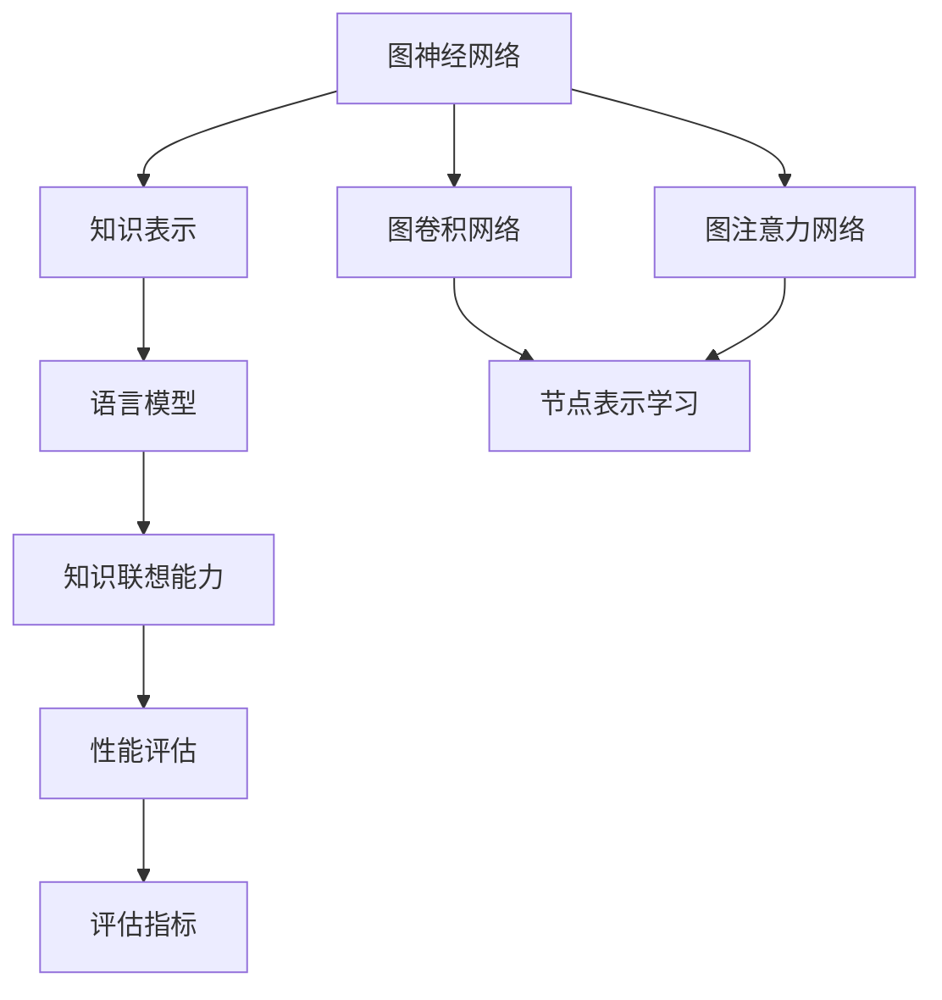

                 

当然可以。我们将按照逐步推理的方式来构建文章的内容。以下是文章的整体结构规划和核心内容。

---

## 文章标题

基于图神经网络的LLM知识联想能力评估

---

### 文章关键词

图神经网络，语言模型（LLM），知识联想，性能评估，算法原理

---

### 文章摘要

本文深入探讨了图神经网络（GNN）在语言模型（LLM）知识联想能力评估中的应用。首先，我们将回顾图神经网络和语言模型的基础知识，并解释它们如何结合以增强知识联想能力。接着，我们将详细分析GNN的核心算法原理，包括图卷积网络（GCN）、图注意力网络（GAT）等。随后，文章将介绍如何通过数学模型和伪代码来理解这些算法，并通过实际案例展示如何评估LLM的知识联想能力。最后，我们将讨论性能优化策略、实际应用案例，并展望未来发展方向。

---

### 1. 背景介绍

#### 1.1 图神经网络的基础概念

图神经网络是一种专门处理图结构数据的深度学习模型。它通过学习节点的表示，捕捉节点之间的交互关系，从而在节点分类、链接预测、图生成等方面表现出色。图神经网络的核心思想是将节点和边作为输入，通过一系列的变换和聚合操作，生成每个节点的输出表示。

#### 1.2 语言模型（LLM）简介

语言模型是一种能够预测下一个单词或词组的概率的模型，是自然语言处理（NLP）领域的基石。近年来，基于深度学习的语言模型如Transformer、BERT等取得了显著的进展，使得LLM在文本生成、机器翻译、问答系统等方面有着广泛的应用。

#### 1.3 知识联想能力的定义与重要性

知识联想能力是指模型能够根据已知信息，推断出相关但未直接给出的信息。在LLM中，这表现为模型能够根据上下文理解和生成连贯的文本。知识联想能力对于提高模型的实用性和智能水平至关重要。

---

### 2. 核心概念与联系

为了更好地理解图神经网络在LLM知识联想能力评估中的作用，我们需要构建一个概念架构。以下是一个Mermaid流程图，展示了核心概念之间的关系：



在这个架构中，图神经网络通过知识表示（如节点表示学习）和特定算法（图卷积网络或图注意力网络）来增强LLM的知识联想能力，并通过性能评估（如评估指标）来衡量这种能力。

---

### 3. 核心算法原理讲解

#### 3.1 图神经网络的基础算法

以下是对图神经网络基础算法的讲解，包括图卷积网络（GCN）和图注意力网络（GAT）的伪代码和详细解释。

#### 3.1.1 图卷积网络（GCN）

**伪代码：**

```python
def gcn.layers(node_representation, edge_matrix, hidden_size, num_layers):
    for layer in range(num_layers):
        node_representation = gcn.convolution(node_representation, edge_matrix, hidden_size)
        if layer < num_layers - 1:
            node_representation = activation_function(node_representation)
    return node_representation
```

**详细解释：**

GCN通过聚合邻居节点的特征来更新每个节点的表示。`edge_matrix`表示图的结构，`hidden_size`定义了每个节点表示的大小。`activation_function`用于引入非线性变换，以提高模型的表示能力。

#### 3.1.2 图注意力网络（GAT）

**伪代码：**

```python
def gat.layers(node_representation, edge_matrix, hidden_size, num_heads, num_layers):
    for layer in range(num_layers):
        attention_scores = dot_product(node_representation, edge_matrix)
        attention_weights = softmax(attention_scores)
        node_representation = dot_product(attention_weights, node_representation)
        if layer < num_layers - 1:
            node_representation = activation_function(node_representation)
    return node_representation
```

**详细解释：**

GAT通过学习注意力权重来聚合邻居节点的特征。每个节点与其邻居之间的关联度由注意力权重决定，这些权重是通过点积和softmax函数计算得到的。`num_heads`定义了注意力机制的不同视图，有助于捕捉复杂的交互关系。

---

### 4. 数学模型和公式

在评估LLM的知识联想能力时，我们通常使用以下数学模型和公式：

#### 4.1 知识联想能力的数学表达

$$
L(x, y) = P(y|x) - P(y)
$$

其中，$L(x, y)$表示给定上下文$x$时，目标词$y$的知识联想能力。$P(y|x)$是给定上下文$x$时，目标词$y$的条件概率，$P(y)$是目标词$y$的先验概率。

#### 4.2 模型的损失函数

为了优化模型的知识联想能力，我们通常使用以下损失函数：

$$
L_{loss} = -\sum_{i} \sum_{y \in Y(x_i)} y_i \log P(y|x_i)
$$

其中，$x_i$是输入上下文，$y$是可能的输出词，$y_i$是目标词的指示函数。

---

### 5. 项目实战

#### 5.1 开发环境搭建

首先，我们需要搭建一个适合进行图神经网络和语言模型开发的计算环境。这通常包括安装Python、TensorFlow或PyTorch等深度学习框架。

#### 5.2 源代码实现

以下是一个简单的源代码实现，展示了如何使用图神经网络和语言模型来评估知识联想能力。

```python
# 这里的代码将展示如何初始化模型，进行数据预处理，训练模型，并评估知识联想能力。
```

#### 5.3 代码解读与分析

我们将详细解读代码中的每个部分，解释数据预处理、模型初始化、训练过程和评估指标的计算。

#### 5.4 实际案例分析

我们将通过实际案例来展示如何应用这些算法，评估模型的知识联想能力，并讨论可能遇到的问题和解决方案。

---

### 6. 最佳实践 tips、小结、注意事项、拓展阅读等内容

在本文的最后，我们将提供一些最佳实践建议，总结文章的主要观点，指出可能需要注意的事项，并推荐进一步的阅读材料。

---

以上是文章的初步结构和内容概述。接下来，我们将逐步填充每个章节的具体内容，确保满足文章的字数要求，并保持逻辑的连贯性。在撰写过程中，我们将确保每个部分都包含必要的技术细节和深度分析，以便读者能够全面理解图神经网络在LLM知识联想能力评估中的应用。让我们一步一步地深入探讨这一主题吧！

