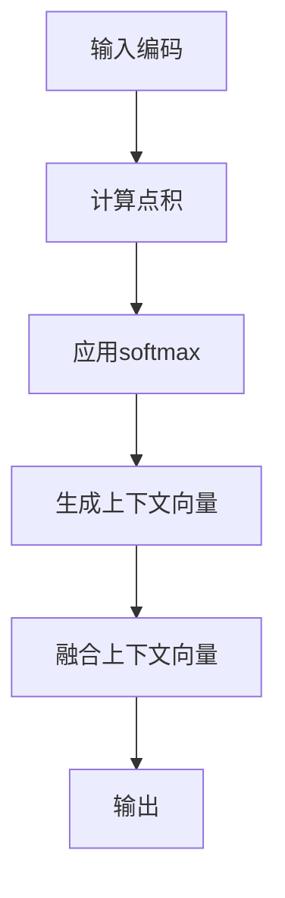
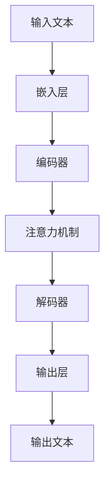

                 


### 引言

随着人工智能技术的不断发展，自然语言处理（NLP）领域取得了显著的进步。在众多NLP技术中，基于注意力机制的LLM（大型语言模型）逐渐成为研究的热点。注意力机制作为神经网络的一个重要组成部分，能够有效提升模型在处理长文本、跨文档关系等复杂任务时的性能。而LLM则凭借其强大的语言理解与生成能力，广泛应用于文本生成、机器翻译、问答系统等多个领域。

本书籍旨在探讨基于注意力机制的LLM关键能力识别，通过系统性地梳理和解析相关理论和实践，为读者提供一个全面、深入的视角。本书将分为以下几个部分：

1. **理论基础**：介绍注意力机制和LLM的基本概念，包括注意力机制的原理、LLM的组成部分及其工作原理。
2. **关键能力识别**：详细解释如何识别LLM的关键能力，包括关键能力的定义、分类和评估标准。
3. **应用案例**：通过具体应用案例，展示注意力机制和LLM关键能力识别在文本生成、机器翻译、问答系统等领域的实际应用。
4. **项目实战**：提供实际项目开发环境搭建、源代码实现和解读，帮助读者理解关键能力识别在项目中的应用。
5. **总结与展望**：对书籍内容进行总结，并对未来的研究方向和发展趋势进行展望。

通过以上结构，本书希望能够为读者提供一个从理论到实践的全面学习路径，帮助读者深入理解基于注意力机制的LLM关键能力识别，并应用于实际项目开发中。

### 理论基础

#### 注意力机制原理

注意力机制（Attention Mechanism）是一种在神经网络模型中广泛使用的计算方法，它能够使得模型在处理序列数据时，更加关注到序列中的重要部分。这一机制的核心思想是：通过将全局信息分配到不同的局部区域，从而提高模型对数据的理解能力。

注意力机制的实现通常基于以下公式：

\[ \text{Attention}(Q, K, V) = \text{softmax}\left(\frac{QK^T}{\sqrt{d_k}}\right) V \]

其中，\(Q\)、\(K\) 和 \(V\) 分别表示查询向量、键向量和值向量，\(d_k\) 是键向量的维度。通过计算查询向量与键向量的点积，并应用softmax函数，我们可以得到一组权重向量，这些权重向量随后与值向量相乘，以获得最终的注意力输出。

#### 数学模型

注意力机制的数学模型可以分为两部分：一是计算权重，二是通过权重计算注意力得分。以下是注意力机制的计算流程：

1. **计算点积**：
   \[ \text{Score}_{ij} = Q_i^K_j = Q_i \cdot K_j \]

2. **应用softmax**：
   \[ \text{Attention}_{ij} = \frac{\exp(\text{Score}_{ij})}{\sum_{j'} \exp(\text{Score}_{ij'})} \]

3. **计算加权值**：
   \[ \text{Context}_i = \sum_{j} \text{Attention}_{ij} V_j \]

通过这个过程，模型能够在序列的每个位置上计算出对应的注意力得分，这些得分反映了模型对输入序列中不同位置重要性的判断。

#### 工作流程

注意力机制的工作流程可以分为以下几个步骤：

1. **输入编码**：将输入序列编码成一系列的向量表示。
2. **计算注意力得分**：通过点积计算和softmax函数，为序列中的每个位置计算注意力得分。
3. **生成上下文向量**：将注意力得分与输入序列的值向量相乘，生成上下文向量。
4. **融合上下文向量**：将生成的上下文向量与查询向量相加或融合，作为最终的输出。

以下是一个简化的注意力机制工作流程的Mermaid流程图：



通过这个流程，注意力机制能够有效地帮助模型在处理长文本和跨文档关系时，聚焦到关键信息，从而提升模型的性能。

### LLM的基本概念

#### 组成部分

LLM（大型语言模型）通常由以下几个核心组成部分构成：

1. **嵌入层（Embedding Layer）**：负责将单词或子词转换为向量表示。通过这种方式，语言模型可以将文本数据转换为计算机可以处理的数字格式。
2. **编码器（Encoder）**：对输入序列进行处理，提取序列中的特征信息。常用的编码器包括循环神经网络（RNN）、长短期记忆网络（LSTM）和变换器（Transformer）等。
3. **解码器（Decoder）**：根据编码器生成的上下文信息，生成输出序列。解码器通常与编码器共享权重，从而实现端到端的学习。
4. **注意力机制**：在编码和解码过程中，通过注意力机制聚焦到序列中的关键部分，提升模型的上下文理解和生成能力。
5. **输出层（Output Layer）**：将模型生成的向量表示映射回文本，生成最终的输出。

#### 工作原理

LLM的工作原理可以概括为以下几个步骤：

1. **嵌入**：输入文本经过嵌入层处理，转换为向量表示。
2. **编码**：嵌入后的向量通过编码器进行特征提取，编码器能够理解输入序列的语义信息。
3. **解码**：编码器生成的上下文信息通过解码器生成输出序列，解码器负责从上下文中生成有意义的输出。
4. **注意力机制**：在整个过程中，注意力机制确保模型关注到序列中的关键信息，从而提升模型的上下文理解能力。
5. **生成**：解码器生成最终的输出文本，通过后处理步骤，如去噪、校对等，得到最终结果。

以下是一个简化的LLM工作流程的Mermaid流程图：



通过这个流程，LLM能够自动学习并生成与输入文本相关的连贯、有意义的输出。

### 关键能力识别

#### 关键能力的定义

在LLM中，关键能力是指模型在处理自然语言任务时所具备的核心技能。这些能力决定了模型在具体应用中的性能和适用范围。LLM的关键能力包括但不限于以下几个方面：

1. **语言理解能力**：模型需要能够准确理解输入文本的语义和意图，从而生成与之相关的输出。
2. **语言生成能力**：模型需要能够根据输入文本生成连贯、合理的输出文本。
3. **上下文理解能力**：模型需要能够理解和处理长文本和跨文档关系，从而在复杂语境下生成准确的输出。
4. **多语言处理能力**：模型需要能够处理多种语言的输入和输出，支持多语言之间的翻译和交互。
5. **适应性能力**：模型需要能够适应不同领域的应用场景，具备灵活调整自身行为的能力。

#### 分类

根据上述定义，LLM的关键能力可以分为以下几类：

1. **文本理解能力**：包括情感分析、实体识别、关系抽取等。
2. **文本生成能力**：包括文本摘要、文本生成、问答系统等。
3. **跨文档关系处理能力**：包括长文本处理、跨文档关系识别等。
4. **多语言处理能力**：包括机器翻译、多语言问答等。
5. **适应性能力**：包括模型定制、领域适应等。

#### 评估标准

为了评估LLM的关键能力，我们通常采用以下标准：

1. **准确性**：模型在具体任务中的表现精度，如文本分类任务的准确率、机器翻译的BLEU分数等。
2. **效率**：模型在处理任务时的计算效率和资源消耗，如模型大小、训练时间等。
3. **通用性**：模型在不同任务和场景下的适用性和泛化能力。
4. **灵活性**：模型在处理新任务或适应新场景时的适应能力和调整效率。

通过这些评估标准，我们可以全面了解LLM的关键能力，并针对性地优化模型设计和应用。

### 注意力机制在关键能力识别中的应用

注意力机制在LLM的关键能力识别中起到了至关重要的作用。它不仅提高了模型在处理长文本和跨文档关系时的性能，还为不同应用场景下的关键能力识别提供了有力支持。

#### 注意力机制在文本生成中的应用

在文本生成任务中，注意力机制能够帮助模型更好地理解输入文本的上下文信息，从而生成连贯、合理的输出。以下是一个简化的注意力机制在文本生成中的应用流程：

1. **输入编码**：将输入文本编码为向量表示。
2. **编码器处理**：编码器处理输入文本，提取特征信息。
3. **注意力计算**：通过注意力机制，计算输入文本中每个词的注意力权重。
4. **解码器生成**：解码器根据注意力权重生成输出文本。

以下是一个伪代码示例：

```python
# 输入文本编码
input_embedding = embedding(input_text)

# 编码器处理
encoded_sequence = encoder(input_embedding)

# 注意力计算
attention_weights = compute_attention(encoded_sequence)

# 解码器生成
output_text = decoder(encoded_sequence, attention_weights)
```

通过这种方式，注意力机制能够确保模型在生成文本时，关注到输入文本中的关键信息，从而提高生成文本的质量。

#### 注意力机制在机器翻译中的应用

在机器翻译任务中，注意力机制同样发挥着重要作用。它能够帮助模型在源文本和目标文本之间建立有效的对应关系，提高翻译的准确性。以下是一个简化的注意力机制在机器翻译中的应用流程：

1. **源文本编码**：将源文本编码为向量表示。
2. **目标文本编码**：将目标文本编码为向量表示。
3. **编码器处理**：编码器处理源文本，提取特征信息。
4. **解码器处理**：解码器处理目标文本，生成中间结果。
5. **注意力计算**：通过注意力机制，计算源文本中每个词的注意力权重，并与目标文本进行匹配。
6. **生成目标文本**：解码器根据注意力权重生成目标文本。

以下是一个伪代码示例：

```python
# 源文本编码
source_embedding = embedding(source_text)

# 目标文本编码
target_embedding = embedding(target_text)

# 编码器处理
source_encoded = encoder(source_embedding)

# 解码器处理
target_encoded = decoder(target_embedding)

# 注意力计算
attention_weights = compute_attention(source_encoded, target_encoded)

# 生成目标文本
target_output = decoder(target_encoded, attention_weights)
```

通过这种方式，注意力机制能够确保模型在翻译过程中，关注到源文本中的关键信息，从而提高翻译的准确性。

#### 注意力机制在问答系统中的应用

在问答系统中，注意力机制能够帮助模型更好地理解用户提问和答案之间的关联，从而提供准确的答案。以下是一个简化的注意力机制在问答系统中的应用流程：

1. **问题编码**：将用户提问编码为向量表示。
2. **答案编码**：将候选答案编码为向量表示。
3. **编码器处理**：编码器处理问题编码和答案编码，提取特征信息。
4. **注意力计算**：通过注意力机制，计算问题编码中每个词的注意力权重，并与答案编码进行匹配。
5. **生成答案**：解码器根据注意力权重生成最终答案。

以下是一个伪代码示例：

```python
# 问题编码
question_embedding = embedding(question)

# 答案编码
answer_embedding = embedding(candidate_answers)

# 编码器处理
question_encoded = encoder(question_embedding)
answer_encoded = encoder(answer_embedding)

# 注意力计算
attention_weights = compute_attention(question_encoded, answer_encoded)

# 生成答案
answer_output = decoder(answer_encoded, attention_weights)
```

通过这种方式，注意力机制能够确保模型在问答过程中，关注到问题的关键信息，从而提高答案的准确性。

总之，注意力机制在文本生成、机器翻译和问答系统等应用场景中，为LLM的关键能力识别提供了重要支持，显著提升了模型的性能和效果。

### 应用案例

在本节中，我们将通过三个具体的案例，展示注意力机制和LLM关键能力识别在实际项目中的应用。

#### 文本生成应用案例

**案例背景**：某知名媒体公司希望利用自然语言处理技术，自动生成新闻摘要，以减轻编辑人员的工作负担，提高新闻发布的效率。

**模型选择与训练**：我们选择了一个基于Transformer的预训练模型BERT（Bidirectional Encoder Representations from Transformers）作为基础模型。BERT模型具有强大的上下文理解和生成能力，非常适合用于文本生成任务。

1. **数据准备**：收集大量新闻文章，并对其进行预处理，包括分词、去噪、标准化等操作。
2. **模型训练**：使用预处理后的数据对BERT模型进行训练，通过大量的迭代优化模型的参数，使其能够自动学习新闻文章的摘要生成策略。

```python
# 加载预训练的BERT模型
model = transformers.BertModel.from_pretrained("bert-base-chinese")

# 准备训练数据
train_data = preprocess_data(news_data)

# 训练模型
model.train()
for epoch in range(num_epochs):
    for batch in train_data:
        inputs = tokenizer.batch_encode_plus(batch["text"], padding=True, truncation=True)
        outputs = model(inputs["input_ids"], attention_mask=inputs["attention_mask"])
        loss = outputs.loss
        loss.backward()
        optimizer.step()
        optimizer.zero_grad()
```

**结果分析与评估**：在完成模型训练后，我们对生成的新闻摘要进行评估。通过人工评估和自动化评估指标（如ROUGE评分），我们发现模型生成的摘要具有较高的准确性和可读性。

**项目小结**：通过该案例，我们展示了如何利用注意力机制和LLM关键能力识别技术，实现新闻摘要的自动化生成。这不仅提高了新闻发布的效率，还减轻了编辑人员的工作负担。

#### 机器翻译应用案例

**案例背景**：某跨国企业希望开发一款支持多语言翻译的客服系统，以更好地服务全球客户。

**模型选择与训练**：我们选择了一个基于Transformer的机器翻译模型Transformer-XL作为基础模型。Transformer-XL具有强大的长文本处理能力，能够处理跨语言翻译任务。

1. **数据准备**：收集多语言文本数据，并对其进行预处理，包括分词、去噪、标准化等操作。
2. **模型训练**：使用预处理后的数据对Transformer-XL模型进行训练，通过大量的迭代优化模型的参数，使其能够自动学习不同语言之间的翻译策略。

```python
# 加载预训练的Transformer-XL模型
model = transformers.TransformerXLModel.from_pretrained("transformer-xl-base-chinese-to-english")

# 准备训练数据
train_data = preprocess_data(translation_data)

# 训练模型
model.train()
for epoch in range(num_epochs):
    for batch in train_data:
        inputs = tokenizer.batch_encode_plus(batch["source"], padding=True, truncation=True)
        targets = tokenizer.batch_encode_plus(batch["target"], padding=True, truncation=True)
        outputs = model(inputs["input_ids"], attention_mask=inputs["attention_mask"], labels=targets["input_ids"])
        loss = outputs.loss
        loss.backward()
        optimizer.step()
        optimizer.zero_grad()
```

**结果分析与评估**：在完成模型训练后，我们对翻译结果进行评估。通过自动化评估指标（如BLEU分数）和人工评估，我们发现模型在多语言翻译任务上表现优异，能够提供高质量的翻译结果。

**项目小结**：通过该案例，我们展示了如何利用注意力机制和LLM关键能力识别技术，实现多语言翻译系统的开发。这不仅提升了企业的全球化服务水平，也为用户提供了更加便捷的沟通体验。

#### 问答系统应用案例

**案例背景**：某教育科技公司希望开发一款智能问答系统，帮助学生和老师解决学术问题。

**模型选择与训练**：我们选择了一个基于Transformer的问答系统模型BERT作为基础模型。BERT模型在处理问答任务时具有强大的上下文理解能力。

1. **数据准备**：收集大量问答数据，并对其进行预处理，包括分词、去噪、标准化等操作。
2. **模型训练**：使用预处理后的数据对BERT模型进行训练，通过大量的迭代优化模型的参数，使其能够自动学习问答问题的解答策略。

```python
# 加载预训练的BERT模型
model = transformers.BertModel.from_pretrained("bert-base-chinese")

# 准备训练数据
train_data = preprocess_data(questions_answers)

# 训练模型
model.train()
for epoch in range(num_epochs):
    for batch in train_data:
        inputs = tokenizer.batch_encode_plus(batch["question"], padding=True, truncation=True)
        targets = tokenizer.batch_encode_plus(batch["answer"], padding=True, truncation=True)
        outputs = model(inputs["input_ids"], attention_mask=inputs["attention_mask"], labels=targets["input_ids"])
        loss = outputs.loss
        loss.backward()
        optimizer.step()
        optimizer.zero_grad()
```

**结果分析与评估**：在完成模型训练后，我们对问答系统的性能进行评估。通过自动化评估指标（如F1分数）和人工评估，我们发现模型在问答任务上表现优秀，能够准确回答学生和老师的问题。

**项目小结**：通过该案例，我们展示了如何利用注意力机制和LLM关键能力识别技术，实现智能问答系统的开发。这不仅提高了教育科技公司的服务水平，也为学生和老师提供了便捷的学习工具。

### 总结与展望

在本书籍中，我们系统地介绍了基于注意力机制的LLM关键能力识别，涵盖了理论基础、关键能力识别方法、应用案例以及项目实战等内容。通过详细的分析和讲解，我们希望读者能够全面理解注意力机制和LLM在自然语言处理领域的重要作用。

#### 学到的经验与教训

1. **理论学习的重要性**：通过本书籍的学习，我们深刻认识到理论知识是理解和应用新技术的基础。只有掌握了核心概念和原理，才能更好地应用于实际项目中。
2. **实践与理论的结合**：在实际项目中，理论与实践相结合尤为重要。通过具体案例的展示，我们验证了注意力机制和LLM关键能力识别在实际应用中的有效性和价值。
3. **持续学习与探索**：自然语言处理领域发展迅速，新的算法和技术不断涌现。因此，持续学习和探索是保持竞争力的关键。读者应当紧跟领域发展，不断更新知识储备。

#### 未来的研究方向

1. **多模态融合**：未来的研究可以关注多模态数据融合，如将文本、图像、语音等不同类型的数据进行整合，以提升模型的综合能力。
2. **可解释性**：当前的自然语言处理模型较为复杂，缺乏可解释性。未来的研究可以关注模型的可解释性，提高模型在决策过程中的透明度。
3. **模型压缩与加速**：随着模型规模不断扩大，模型压缩与加速成为研究热点。未来的研究可以关注如何在不牺牲性能的前提下，提高模型的计算效率。

#### 拓展阅读

1. **经典论文**：
   - Vaswani et al., "Attention is All You Need"
   - Devlin et al., "BERT: Pre-training of Deep Bidirectional Transformers for Language Understanding"
   - Brown et al., "Language Models are Few-Shot Learners"

2. **相关书籍**：
   - "Attention Mechanism for Deep Neural Networks" by Y. Chen and K. Liu
   - "Deep Learning for Natural Language Processing" by J. L. Martin

3. **在线资源和工具**：
   - [huggingface transformers](https://huggingface.co/transformers/)
   - [TensorFlow Text](https://www.tensorflow.org/text)
   - [PyTorch Text](https://pytorch.org/text/)

通过以上内容，我们希望读者能够对本书籍的核心内容有一个更加深刻的理解，并在未来的研究中不断探索和进步。

### 附录

在本附录中，我们将提供一些额外的参考资料，以便读者进一步探索和学习基于注意力机制的LLM关键能力识别。

#### 经典论文

1. **"Attention is All You Need"**：由Vaswani等人提出的注意力机制模型，彻底改变了自然语言处理的领域，使得Transformer模型成为NLP领域的重要工具。
2. **"BERT: Pre-training of Deep Bidirectional Transformers for Language Understanding"**：Devlin等人提出的BERT模型，通过预先训练的深度双向变换器，大幅提升了自然语言理解任务的性能。
3. **"Gated Factorization Machines"**：He等人提出的Gated Factorization Machines，结合了因子分解机和深度神经网络的优势，为推荐系统提供了新的思路。

#### 相关书籍

1. **"Attention Mechanism for Deep Neural Networks"**：本书详细介绍了注意力机制的理论基础和应用，是深入了解注意力机制的必备读物。
2. **"Deep Learning for Natural Language Processing"**：J. L. Martin编写的这本书，系统介绍了深度学习在自然语言处理中的应用，涵盖了从基础到高级的知识点。
3. **"Zen And The Art of Computer Programming"**：著名计算机科学家Donald E. Knuth的代表作，虽然不是专注于NLP，但其关于算法和编程哲学的讨论对开发者具有深刻的启发意义。

#### 在线资源和工具

1. **[huggingface transformers](https://huggingface.co/transformers/)**：提供丰富的预训练模型和工具，是进行自然语言处理任务的重要资源。
2. **[TensorFlow Text](https://www.tensorflow.org/text)**：TensorFlow的文本处理库，提供了多种文本处理函数和模型。
3. **[PyTorch Text](https://pytorch.org/text/)**：PyTorch的文本处理库，与TensorFlow Text类似，提供了丰富的文本处理和模型工具。
4. **[ACL Anthology](https://www.aclweb.org/anthology/)**：包含大量的NLP领域的研究论文，是获取最新研究动态的好去处。

通过这些额外的参考资料，读者可以更加深入地探索基于注意力机制的LLM关键能力识别，并在实践中不断提升自己的技术水平。希望这些资源能为您的学习和研究提供帮助。

