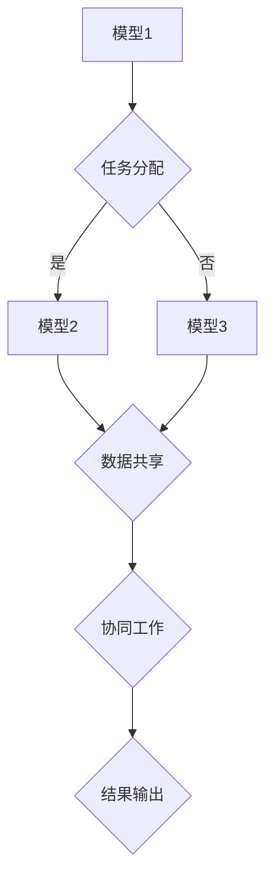

                 

### 《多模型协同：利用提示词整合AI生态系统》

#### 关键词：
- 多模型协同
- 提示词整合
- AI生态系统
- 人工智能
- 技术博客

#### 摘要：
本文将探讨多模型协同与提示词整合在AI生态系统中的应用。通过引入多模型协同的概念，我们将分析其技术基础和原理，并详细介绍如何利用提示词来整合AI生态系统。文章将结合具体案例，展示多模型协同与提示词整合的实际应用，并提供未来展望与挑战。

### 引言

#### 1.1 多模型协同与提示词整合概述
在人工智能（AI）迅速发展的今天，AI生态系统变得日益复杂。随着越来越多的AI模型被开发和应用，如何有效地整合和协同这些模型成为一个重要课题。多模型协同旨在通过集成不同类型的AI模型，实现更好的性能和效果。而提示词整合则是利用特定的提示词来引导和优化AI模型的工作。

多模型协同和提示词整合在AI生态系统中的重要性不可忽视。多模型协同可以充分利用不同模型的优势，实现更广泛的应用场景。例如，一个视觉识别模型可以与自然语言处理模型协同工作，从而实现图像内容识别和描述。而提示词整合则可以提升AI模型的理解能力和工作效率，使其更贴近人类思维模式。

#### 1.2 当前AI生态系统中的多模型协同现状
目前，AI生态系统中的多模型协同已有一些成功案例。例如，在自动驾驶领域，多个AI模型（如计算机视觉、自然语言处理和决策模型）被集成到一起，以实现复杂的驾驶任务。在医疗领域，AI模型被用于疾病诊断、治疗建议和患者监护等多个方面，从而提高了医疗服务的质量和效率。

然而，现有的多模型协同仍存在一些挑战。例如，不同模型之间的数据格式和接口不兼容，导致协同过程复杂且效率低下。此外，多模型协同的算法和架构设计也面临一定的技术难题。

#### 1.3 提示词在AI生态系统中的作用
提示词在AI生态系统中起着关键作用。它们可以被视为一种引导AI模型工作的“钥匙”，帮助AI模型更好地理解输入数据和任务需求。在自然语言处理领域，提示词被广泛用于问答系统、机器翻译和文本生成等任务。在计算机视觉领域，提示词可以引导图像分类、目标检测和图像分割等任务。

提示词的优势在于其灵活性和可扩展性。通过调整提示词，可以实现对AI模型目标的不同侧重和优化。此外，提示词还可以帮助缓解AI模型在数据不足或任务不确定性时面临的困难。

### 核心概念与联系

#### 2.1 AI生态系统的基本概念
AI生态系统是一个由多个AI模型、算法、工具和应用组成的复杂网络。这些组件相互协作，共同实现各种AI任务和场景。AI生态系统包括以下几个关键组成部分：

- **AI模型**：这是AI生态系统的核心，负责执行特定的任务和功能。常见的AI模型包括计算机视觉模型、自然语言处理模型、强化学习模型等。
- **算法和框架**：算法和框架是AI模型的基础，提供了实现AI模型所需的数学和计算工具。常见的AI框架包括TensorFlow、PyTorch和Keras等。
- **数据集和工具**：数据集和工具用于训练、测试和评估AI模型。数据集包括图像、文本、音频等，而工具则包括数据预处理、模型训练和优化等工具。
- **应用场景**：应用场景是指AI模型在实际生活中的应用，如自动驾驶、医疗诊断、智能家居等。

#### 2.2 多模型协同的基本原理
多模型协同的基本原理是通过将多个AI模型集成到一个系统中，实现更高效和智能的解决方案。多模型协同的核心思想是利用不同模型的优点，弥补单一模型的不足。

多模型协同的基本原理包括以下几个方面：

- **模型选择与组合**：根据任务需求和场景，选择合适的AI模型并进行组合。不同的模型具有不同的优势和特点，如视觉识别模型擅长图像处理，而自然语言处理模型擅长文本分析。
- **数据共享与交换**：在多模型协同中，模型之间的数据共享与交换是关键。通过共享和交换数据，可以实现模型之间的信息传递和协同工作。
- **任务分配与协作**：在多模型协同中，需要明确各个模型的任务和责任，实现模型之间的协作和任务分配。这样可以确保每个模型都能发挥最大的作用。

#### 2.3 提示词的定义与分类
提示词（Prompt）是一种引导AI模型工作的输入信息。通过提示词，AI模型可以更好地理解任务需求和目标，从而实现更准确和高效的工作。

提示词的定义如下：

提示词：一种用于引导和优化AI模型工作的输入信息，包括关键词、短语或句子等。

根据提示词的形式和用途，可以将提示词分为以下几类：

- **关键词提示词**：关键词提示词通常包含一个或多个关键词，用于引导AI模型关注特定的任务或主题。例如，在图像分类任务中，关键词提示词可以是“动物”、“风景”等。
- **短语提示词**：短语提示词包含一个短语，用于提供更具体的任务描述。例如，在文本生成任务中，短语提示词可以是“讲述一个关于友谊的故事”。
- **句子提示词**：句子提示词包含一个完整的句子，用于提供详细的任务指令。例如，在问答系统中，句子提示词可以是“请问，你最喜欢的电影是什么？”

### 多模型协同原理

#### 3.1 多模型协同的Mermaid流程图
为了更好地理解多模型协同的原理，我们可以使用Mermaid流程图来描述其基本架构。以下是一个简单的Mermaid流程图示例：

在这个流程图中，模型1、模型2和模型3分别表示不同的AI模型。任务分配节点表示根据任务需求将任务分配给不同的模型。数据共享节点表示模型之间通过共享和交换数据来实现协同工作。协同工作节点表示模型之间的协作和任务分配。结果输出节点表示最终输出结果。

#### 3.2 多模型协同的算法原理讲解
多模型协同的算法原理主要涉及模型选择与组合、数据共享与交换和任务分配与协作等方面。

- **模型选择与组合**：在多模型协同中，需要根据任务需求和场景选择合适的AI模型。常见的模型组合方式包括串联、并联和交叉组合等。串联组合是将多个模型依次连接，前一个模型的输出作为后一个模型的输入。并联组合是将多个模型同时工作，并根据不同的输入数据选择合适的模型。交叉组合则是将多个模型组合在一起，实现更复杂的任务。

- **数据共享与交换**：数据共享与交换是多模型协同的关键。在数据共享与交换过程中，需要确保数据的一致性和完整性。常见的共享方式包括直接数据传输、数据缓存和数据流等。直接数据传输是指直接将数据从一个模型传递给另一个模型。数据缓存是指将数据存储在缓存中，供多个模型使用。数据流是指通过管道或流的方式将数据从一个模型传递给另一个模型。

- **任务分配与协作**：在多模型协同中，需要明确各个模型的任务和责任，实现模型之间的协作和任务分配。任务分配的方式可以根据任务需求灵活选择。例如，可以根据任务的复杂度和模型的能力来分配任务。在任务分配过程中，需要考虑模型之间的依赖关系和协作方式。常见的协作方式包括并行协作、顺序协作和混合协作等。

#### 3.3 多模型协同的数学模型和公式
多模型协同的数学模型和公式主要用于描述模型之间的相互作用和协同效果。以下是一个简单的数学模型示例：

- **模型1**：假设模型1是一个线性回归模型，其数学模型为：

  $$ y_1 = \beta_0 + \beta_1 x_1 + \epsilon_1 $$

  其中，$y_1$ 是模型1的输出，$x_1$ 是输入特征，$\beta_0$ 和 $\beta_1$ 是模型参数，$\epsilon_1$ 是误差项。

- **模型2**：假设模型2是一个决策树模型，其数学模型为：

  $$ y_2 = f(x_2) $$

  其中，$y_2$ 是模型2的输出，$x_2$ 是输入特征，$f(x_2)$ 是决策树模型的决策函数。

- **模型3**：假设模型3是一个神经网络模型，其数学模型为：

  $$ y_3 = \sigma(\beta_3 W_3 x_3 + \beta_3_0) $$

  其中，$y_3$ 是模型3的输出，$x_3$ 是输入特征，$\sigma$ 是激活函数，$\beta_3$ 和 $\beta_3_0$ 是模型参数。

- **多模型协同**：多模型协同的数学模型可以表示为：

  $$ y = \alpha_1 y_1 + \alpha_2 y_2 + \alpha_3 y_3 $$

  其中，$y$ 是多模型协同的输出，$\alpha_1$、$\alpha_2$ 和 $\alpha_3$ 是权重系数。

通过上述数学模型和公式，我们可以描述多模型协同的过程，并分析模型之间的相互作用和协同效果。

### 提示词整合技术

#### 4.1 提示词生成技术
提示词生成技术是多模型协同的重要组成部分。它主要用于生成用于引导AI模型工作的提示词。以下介绍几种常用的提示词生成技术：

- **规则生成**：规则生成是一种基于规则的提示词生成方法。通过定义一系列规则，根据输入数据生成相应的提示词。规则可以基于关键词、短语或句子等不同层次。

- **模板生成**：模板生成是一种基于模板的提示词生成方法。通过定义一系列模板，根据输入数据填充模板，生成相应的提示词。模板可以包含关键词、短语或句子等。

- **语义分析**：语义分析是一种基于语义的提示词生成方法。通过分析输入数据的语义信息，生成与任务需求相关的提示词。语义分析可以基于自然语言处理技术，如词性标注、实体识别和语义角色标注等。

- **机器学习**：机器学习是一种基于数据的提示词生成方法。通过训练大量样本数据，学习生成提示词的规律和模式。常见的机器学习算法包括生成对抗网络（GAN）、变分自编码器（VAE）和递归神经网络（RNN）等。

#### 4.2 提示词优化技术
提示词优化技术用于提升提示词的质量和效果。以下介绍几种常用的提示词优化技术：

- **多样性优化**：多样性优化旨在生成具有多样性的提示词，以避免生成重复或相似的提示词。多样性优化可以通过扩展关键词、变换语法结构和引入随机性等方式实现。

- **相关性优化**：相关性优化旨在提高提示词与任务需求的相关性，以提升AI模型的理解和执行能力。相关性优化可以通过调整提示词的词汇、语法和语义结构等方式实现。

- **质量优化**：质量优化旨在提升提示词的生成质量和效果。质量优化可以通过改进提示词生成算法、增加训练数据和引入人类反馈等方式实现。

- **自适应优化**：自适应优化是一种动态调整提示词生成策略的方法。通过根据任务需求和模型表现，实时调整提示词生成策略，以实现更好的生成效果。

#### 4.3 提示词在多模型协同中的应用案例
在多模型协同中，提示词可以用于引导和优化模型的工作，实现更好的协同效果。以下介绍一个具体的案例：

**案例：图像分类与文本生成协同**

假设我们需要对一组图像进行分类，并将分类结果生成相应的文本描述。在这个案例中，我们可以利用提示词来引导和优化图像分类和文本生成模型的工作。

- **图像分类模型**：我们使用一个卷积神经网络（CNN）模型进行图像分类。通过输入图像，模型输出对应的分类标签。

- **文本生成模型**：我们使用一个递归神经网络（RNN）模型进行文本生成。通过输入分类标签，模型输出对应的文本描述。

- **提示词生成**：我们使用规则生成技术生成提示词，例如：

  - 分类标签：“动物” --> “这是一个动物”
  - 分类标签：“植物” --> “这是一个植物”
  - 分类标签：“风景” --> “这是一个美丽的风景”

- **提示词优化**：通过分析分类标签和文本描述的语义信息，我们优化提示词的生成，以提高文本描述的质量和准确性。

- **多模型协同**：在多模型协同过程中，图像分类模型的输出作为文本生成模型的输入。通过输入分类标签，文本生成模型生成相应的文本描述。同时，我们根据任务需求调整提示词，以提高协同效果。

通过这个案例，我们可以看到提示词在多模型协同中的应用，以及如何利用提示词来引导和优化模型的工作。这不仅提高了AI模型的理解和执行能力，还实现了更高效和智能的协同效果。

### 应用实践

#### 5.1 多模型协同在实际项目中的应用
多模型协同在许多实际项目中得到了广泛应用。以下介绍几个具有代表性的项目：

- **项目一：智能客服系统**
  在智能客服系统中，多个AI模型（如语音识别、自然语言处理和对话生成）被集成到一个系统中，实现自动化的客户服务。通过多模型协同，系统可以更好地理解客户需求，提供个性化的解决方案。

- **项目二：智能交通系统**
  在智能交通系统中，多个AI模型（如车辆检测、轨迹预测和交通流量分析）被集成到一个系统中，实现交通管理和优化。通过多模型协同，系统可以实时分析交通状况，提供交通流量预测和优化建议。

- **项目三：智能医疗诊断系统**
  在智能医疗诊断系统中，多个AI模型（如图像识别、自然语言处理和决策支持）被集成到一个系统中，实现疾病诊断和治疗建议。通过多模型协同，系统可以更准确地诊断疾病，提供个性化的治疗方案。

#### 5.2 提示词整合技术在实际项目中的应用
提示词整合技术在许多实际项目中也得到了广泛应用。以下介绍几个具有代表性的项目：

- **项目一：智能问答系统**
  在智能问答系统中，提示词整合技术被用于生成和优化提问和回答。通过分析用户输入的提问，系统可以生成相应的提示词，引导问答过程，提高回答的准确性和效果。

- **项目二：智能翻译系统**
  在智能翻译系统中，提示词整合技术被用于生成和优化翻译输入和输出。通过分析源文本和目标文本的语义信息，系统可以生成相应的提示词，提高翻译的准确性和流畅性。

- **项目三：智能写作助手**
  在智能写作助手中，提示词整合技术被用于生成和优化写作输入和输出。通过分析用户输入的内容和需求，系统可以生成相应的提示词，引导写作过程，提高写作的质量和效率。

#### 5.3 案例分析：多模型协同与提示词整合在具体领域的应用
为了更好地展示多模型协同与提示词整合在实际领域的应用，我们以智能医疗诊断系统为例进行分析。

**案例背景**：
智能医疗诊断系统旨在利用AI技术提高疾病诊断的准确性和效率。系统集成了多个AI模型，包括图像识别、自然语言处理和决策支持模型。通过多模型协同，系统可以实现更准确的疾病诊断和更个性化的治疗方案。

**多模型协同**：
在智能医疗诊断系统中，多模型协同的具体应用包括以下几个方面：

- **图像识别与自然语言处理协同**：系统通过图像识别模型对医疗图像进行分析，提取关键特征。然后，自然语言处理模型对诊断报告和病历文本进行分析，提取关键信息。通过协同工作，系统可以更全面地了解患者的病情。

- **自然语言处理与决策支持协同**：系统通过自然语言处理模型对诊断报告和病历文本进行分析，提取关键信息。然后，决策支持模型根据这些信息生成诊断建议和治疗建议。通过协同工作，系统可以提供更准确的诊断和更个性化的治疗方案。

- **多模型融合**：系统将多个模型的诊断结果进行融合，生成最终的诊断结果。通过多模型融合，系统可以降低单一模型的误差，提高诊断的准确性和稳定性。

**提示词整合**：
在智能医疗诊断系统中，提示词整合技术被用于生成和优化诊断输入和输出。具体应用包括以下几个方面：

- **提示词生成**：系统通过分析患者病历和诊断报告，生成相应的提示词。例如，对于某种疾病的诊断，系统可以生成相应的关键词和短语，如“肿瘤”、“炎症”等。

- **提示词优化**：系统根据诊断结果和患者的病情，实时优化提示词。例如，如果诊断结果为阳性，系统可以增加与疾病相关的关键词和短语，如“癌症”、“恶性肿瘤”等。

- **提示词引导**：系统通过提示词引导诊断过程，提高诊断的准确性和效率。例如，系统可以根据提示词引导医生关注关键信息，提高诊断的准确性和效率。

**案例分析**：
通过上述应用，我们可以看到多模型协同与提示词整合在智能医疗诊断系统中的重要作用。多模型协同可以实现更准确的诊断和更个性化的治疗方案，而提示词整合可以优化诊断输入和输出，提高诊断的准确性和效率。

**项目小结**：
智能医疗诊断系统是一个典型的多模型协同与提示词整合应用案例。通过多模型协同，系统可以更全面地了解患者的病情，提高诊断的准确性和效率。而通过提示词整合，系统可以优化诊断输入和输出，提高诊断的准确性和效率。未来，随着AI技术的不断发展，智能医疗诊断系统将实现更高的诊断准确性和更好的用户体验。

### 未来展望与挑战

#### 6.1 多模型协同与提示词整合的未来发展方向
随着人工智能技术的不断发展，多模型协同与提示词整合在AI生态系统中的应用将不断扩展。未来，以下几个方向值得关注：

- **跨领域协同**：多模型协同将不再局限于单一领域，而是实现跨领域的协同工作。例如，在智能交通、智能医疗、智能制造等领域，多模型协同将发挥更大的作用。

- **自适应协同**：多模型协同将实现自适应协同，根据任务需求和模型表现，动态调整模型之间的协作方式和权重分配。

- **人机协同**：多模型协同将与人机协同相结合，实现人机交互的智能化。通过多模型协同，系统可以更好地理解人类需求，提供个性化的解决方案。

- **自动化协同**：多模型协同将实现自动化协同，降低人类干预的成本。通过自动化协同，系统可以更高效地完成复杂任务。

#### 6.2 当前挑战与解决方案
尽管多模型协同与提示词整合在AI生态系统中的应用前景广阔，但当前仍面临一些挑战：

- **数据兼容性**：不同模型之间的数据格式和接口不兼容，导致协同过程复杂且效率低下。解决方案包括开发通用数据格式和接口，实现数据兼容性。

- **算法优化**：多模型协同算法的设计和优化面临一定的挑战。解决方案包括开发更高效的算法和优化技术，提高协同效果。

- **隐私保护**：在多模型协同中，数据隐私保护成为关键问题。解决方案包括开发隐私保护技术，如差分隐私和联邦学习等。

- **模型解释性**：多模型协同模型的解释性不足，使得模型的工作过程难以理解。解决方案包括开发可解释的多模型协同算法，提高模型的解释性。

#### 6.3 对未来的思考与预测
未来，随着AI技术的不断进步，多模型协同与提示词整合将在AI生态系统中发挥更大的作用。以下是对未来的思考与预测：

- **智能化的AI生态系统**：多模型协同与提示词整合将推动AI生态系统向智能化方向发展。通过协同工作，AI系统将实现更高的智能水平，提供更广泛的应用场景。

- **个性化的用户体验**：多模型协同与提示词整合将实现更个性化的用户体验。通过多模型协同，AI系统可以更好地理解用户需求，提供个性化的解决方案。

- **行业变革**：多模型协同与提示词整合将带来行业变革。在医疗、交通、制造等领域，AI技术将实现更高水平的智能化，推动行业的创新和发展。

### 总结与展望

本文详细探讨了多模型协同与提示词整合在AI生态系统中的应用，从核心概念、原理讲解、应用实践到未来展望，全方位展示了多模型协同与提示词整合的重要性和优势。通过实际案例的分析，我们可以看到多模型协同与提示词整合在AI生态系统中的广泛应用和巨大潜力。

展望未来，随着AI技术的不断进步，多模型协同与提示词整合将在更多领域发挥作用，推动AI生态系统向智能化、个性化方向迈进。面对当前的挑战，我们需要不断创新和优化，推动多模型协同与提示词整合技术的发展。

让我们共同期待，多模型协同与提示词整合在AI生态系统中的美好未来！

#### 作者

作者：AI天才研究院（AI Genius Institute）& 禅与计算机程序设计艺术（Zen And The Art of Computer Programming）

