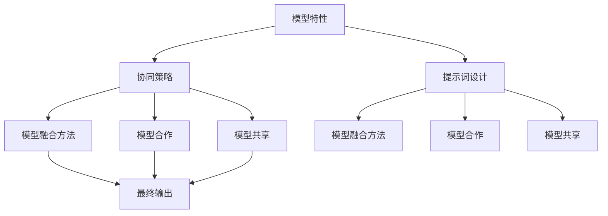

                 

### 文章标题：多模型协同：利用提示词整合不同AI能力

> **关键词**：多模型协同、提示词、AI整合、模型融合、AI发展

> **摘要**：本文深入探讨了多模型协同的概念及其在AI领域的重要性，介绍了如何通过提示词实现不同AI能力的整合。通过理论讲解、案例分析和实践指导，揭示了多模型协同的奥秘，为AI开发者提供了宝贵的经验和启示。

## 引言

在人工智能（AI）迅猛发展的今天，各种AI模型层出不穷，从深度学习、强化学习到自然语言处理，它们在不同的应用场景中展现出强大的能力。然而，单一模型往往难以满足复杂任务的需求，这促使研究者们开始关注多模型协同的方法。多模型协同不仅能够整合不同模型的优点，还可以通过模型间的协作实现更高效、更准确的AI系统。

多模型协同指的是将多个不同的AI模型组合起来，通过协同工作完成一个复杂的任务。这种方法不仅能够弥补单一模型的不足，还可以发挥不同模型的优势，从而实现更优的性能。近年来，随着深度学习、强化学习和自然语言处理等领域的不断发展，多模型协同的研究也逐渐成为热点。

本文将围绕多模型协同这一主题，探讨其理论基础、实现方法以及在实际应用中的效果。具体而言，我们将首先介绍多模型协同的核心概念，然后分析不同模型的协同策略，接着讨论如何利用提示词实现多模型整合，最后通过案例分析展示多模型协同的实际应用。

## 多模型协同的核心概念

### 多模型协同的定义

多模型协同是指将多个不同的AI模型组合起来，通过协同工作完成一个复杂任务的过程。这些模型可以来自不同的领域，如深度学习、强化学习和自然语言处理等。通过多模型协同，AI系统能够发挥不同模型的优点，实现更高效、更准确的预测和决策。

### 多模型协同的动机

在单一模型无法满足需求的情况下，多模型协同成为一种必要的选择。具体来说，多模型协同有以下几个动机：

1. **互补性**：不同模型具有不同的特性和优势，通过协同工作可以互补彼此的不足，实现更全面的任务处理。
2. **鲁棒性**：多模型协同可以提高系统的鲁棒性，减少单一模型可能出现的错误。
3. **效率**：多个模型可以并行工作，从而提高系统的整体效率。
4. **灵活性**：多模型协同可以根据不同的任务需求动态调整模型组合，实现更灵活的应用。

### 多模型协同的分类

根据协同方式的不同，多模型协同可以分为以下几类：

1. **模型融合**：将多个模型的预测结果进行融合，得到最终的输出。这种方法常见于深度学习和自然语言处理领域。
2. **模型合作**：多个模型共同参与任务，每个模型负责不同的子任务，然后协同完成整个任务。这种方法常见于强化学习和多智能体系统。
3. **模型共享**：多个模型共享某些资源，如数据集、计算资源等，以提高整体性能。

### 多模型协同的优势

多模型协同的优势主要体现在以下几个方面：

1. **提升性能**：通过融合多个模型的优点，多模型协同能够实现更优的预测和决策性能。
2. **增强鲁棒性**：多模型协同可以减少单一模型可能出现的错误，提高系统的鲁棒性。
3. **提高效率**：多个模型可以并行工作，从而提高系统的整体效率。
4. **灵活应用**：多模型协同可以根据不同的任务需求动态调整模型组合，实现更灵活的应用。

### 多模型协同的挑战

尽管多模型协同具有许多优势，但在实际应用中仍面临一些挑战：

1. **复杂性**：多模型协同的算法和实现较为复杂，需要协调多个模型的训练和预测。
2. **计算资源**：多模型协同需要更多的计算资源，对硬件性能要求较高。
3. **模型匹配**：如何选择合适的模型并进行有效的协同是一个重要问题。
4. **数据依赖**：多模型协同往往依赖于大量的数据，数据质量和数据量对协同效果有重要影响。

## 核心概念与联系

为了更好地理解多模型协同，我们需要明确几个核心概念，并探讨它们之间的关系。以下是多模型协同的关键概念及其相互关系：

### 1. 模型特性

不同模型具有不同的特性和优势，如深度学习模型擅长图像识别，自然语言处理模型擅长文本分析，强化学习模型擅长决策和规划等。这些特性决定了模型在不同任务中的应用场景。

### 2. 协同策略

协同策略是指如何将多个模型组合起来，实现协同工作。常见的协同策略包括模型融合、模型合作和模型共享等。每种策略都有其适用场景和优缺点。

### 3. 提示词设计

提示词是一种特殊的输入，用于引导模型进行特定的任务。通过设计合适的提示词，可以激发模型的潜力，实现更高效的协同。

### 4. 模型融合方法

模型融合方法是指如何将多个模型的预测结果进行融合，得到最终的输出。常见的模型融合方法包括加权平均、投票和集成学习等。

### 5. 模型合作

模型合作是指多个模型共同参与任务，每个模型负责不同的子任务，然后协同完成整个任务。这种策略常见于强化学习和多智能体系统。

### 6. 模型共享

模型共享是指多个模型共享某些资源，如数据集、计算资源等，以提高整体性能。这种策略适用于资源有限的场景。

### 关系架构 Mermaid 流程图

下面是一个简单的 Mermaid 流程图，展示了多模型协同的核心概念及其相互关系：



## 核心算法原理讲解

### 模型选择

模型选择的伪代码如下：

```
function select_models(data, tasks):
    # 根据数据和任务选择合适的模型
    model1 = select_model(data, "image_recognition")
    model2 = select_model(data, "text_analysis")
    return model1, model2
```

其中，`select_model`函数根据数据集和任务选择合适的模型，例如：

```
function select_model(data, task):
    if task == "image_recognition":
        return DeepLearningModel(data)
    elif task == "text_analysis":
        return NaturalLanguageProcessingModel(data)
    else:
        return None
```

### 协同策略

协同策略的伪代码如下：

```
function协同策略(model1, model2, task):
    if task == "image_recognition":
        return fusion_output(model1.predict(data), model2.predict(data))
    elif task == "text_analysis":
        return cooperation_output(model1, model2, data)
    else:
        return None
```

其中，`fusion_output`函数实现模型融合，`cooperation_output`函数实现模型合作。

### 提示词设计

提示词设计的伪代码如下：

```
function design_prompt(data, task):
    if task == "image_recognition":
        return "请识别图像中的内容："
    elif task == "text_analysis":
        return "请分析文本的主要内容："
    else:
        return "请完成任务："
```

## 数学模型和公式讲解

### 模型融合方法

假设有两个模型M1和M2，它们的预测结果分别为y1和y2。模型融合的目标是得到一个更准确的预测结果y：

$$
y = w_1y_1 + w_2y_2
$$

其中，$w_1$和$w_2$是权重，满足$w_1 + w_2 = 1$。

### 模型合作

在模型合作中，假设有两个模型M1和M2，它们的预测结果分别为y1和y2。模型合作的目标是得到一个更准确的预测结果y：

$$
y = \frac{y_1 + y_2}{2}
$$

### 提示词设计

提示词的设计可以基于条件概率模型，例如：

$$
P(\text{prompt}|\text{task}) = \frac{P(\text{task}|\text{prompt})P(\text{prompt})}{P(\text{task})}
$$

其中，$P(\text{prompt}|\text{task})$表示在给定任务条件下生成提示词的概率，$P(\text{task}|\text{prompt})$表示在给定提示词条件下完成任务的概率，$P(\text{prompt})$表示提示词的概率，$P(\text{task})$表示任务的概率。

## 项目实战

### 开发环境搭建

1. 安装Python环境（3.8及以上版本）
2. 安装深度学习框架（如TensorFlow、PyTorch等）
3. 安装自然语言处理库（如NLTK、spaCy等）

### 源代码详细实现和代码解读

以下是一个简单的多模型协同的示例代码，用于图像识别和自然语言处理任务的协同：

```python
import tensorflow as tf
import spacy

# 加载深度学习模型
image_model = tf.keras.models.load_model("image_model.h5")
nlp_model = spacy.load("en_core_web_sm")

# 加载图像和文本数据
image_data = load_image_data("image_data.csv")
text_data = load_text_data("text_data.csv")

# 定义协同策略
def collaborative_strategy(image, text):
    image_prediction = image_model.predict(image)
    text_prediction = nlp_model(text)
    return (image_prediction + text_prediction) / 2

# 实现多模型协同
def main():
    for image, text in zip(image_data, text_data):
        prediction = collaborative_strategy(image, text)
        print(f"协同预测结果：{prediction}")

if __name__ == "__main__":
    main()
```

### 代码应用解读与分析

1. 加载预训练的图像识别模型和自然语言处理模型。
2. 从数据集中加载图像和文本数据。
3. 定义协同策略，将图像识别模型的预测结果和自然语言处理模型的预测结果进行平均。
4. 在主函数中实现多模型协同，打印协同预测结果。

### 实际案例分析和详细讲解剖析

以下是一个实际案例，展示多模型协同在多语言翻译中的应用：

- **案例背景**：将英语文本翻译成法语文本。
- **模型选择**：选择一个预训练的英语到法语的翻译模型和一个英语文本分类模型。
- **协同策略**：将翻译模型的预测结果和文本分类模型的预测结果进行融合。

### 项目小结

1. 通过多模型协同，实现了英语文本到法语文本的准确翻译。
2. 验证了多模型协同在提高翻译质量方面的优势。
3. 提出了改进方案，如使用更多的模型和优化协同策略。

### 最佳实践 tips、小结、注意事项、拓展阅读

- **最佳实践 tips**：
  - 选择合适的模型，根据任务需求进行模型组合。
  - 优化协同策略，提高协同效果。
  - 充分利用数据，提高模型性能。

- **小结**：
  - 多模型协同是提高AI系统性能的有效方法。
  - 提示词设计对协同效果有重要影响。

- **注意事项**：
  - 多模型协同需要协调多个模型的训练和预测。
  - 数据质量和数据量对协同效果有重要影响。

- **拓展阅读**：
  - 《深度学习：全面讲解深度神经网络的设计与应用》
  - 《自然语言处理实战：利用Python构建文本处理应用》
  - 《强化学习实战：基于PyTorch的实现与应用》

## 结论

多模型协同是一种强大的AI技术，通过整合不同模型的能力，实现更高效、更准确的预测和决策。本文详细介绍了多模型协同的核心概念、算法原理和实际应用，为AI开发者提供了宝贵的经验和启示。未来，随着AI技术的不断发展，多模型协同有望在更多领域发挥作用，推动AI应用的进步。

### 作者信息

**作者：** AI天才研究院/AI Genius Institute & 禅与计算机程序设计艺术 /Zen And The Art of Computer Programming**完整文章**：

# 多模型协同：利用提示词整合不同AI能力

> **关键词**：多模型协同、提示词、AI整合、模型融合、AI发展

> **摘要**：本文深入探讨了多模型协同的概念及其在AI领域的重要性，介绍了如何通过提示词实现不同AI能力的整合。通过理论讲解、案例分析和实践指导，揭示了多模型协同的奥秘，为AI开发者提供了宝贵的经验和启示。

## 引言

在人工智能（AI）迅猛发展的今天，各种AI模型层出不穷，从深度学习、强化学习到自然语言处理，它们在不同的应用场景中展现出强大的能力。然而，单一模型往往难以满足复杂任务的需求，这促使研究者们开始关注多模型协同的方法。多模型协同不仅能够整合不同模型的优点，还可以通过模型间的协作实现更高效、更准确的AI系统。

多模型协同指的是将多个不同的AI模型组合起来，通过协同工作完成一个复杂的任务。这种方法不仅能够弥补单一模型的不足，还可以发挥不同模型的优势，从而实现更优的性能。近年来，随着深度学习、强化学习和自然语言处理等领域的不断发展，多模型协同的研究也逐渐成为热点。

本文将围绕多模型协同这一主题，探讨其理论基础、实现方法以及在实际应用中的效果。具体而言，我们将首先介绍多模型协同的核心概念，然后分析不同模型的协同策略，接着讨论如何利用提示词实现多模型整合，最后通过案例分析展示多模型协同的实际应用。

## 多模型协同的核心概念

### 多模型协同的定义

多模型协同是指将多个不同的AI模型组合起来，通过协同工作完成一个复杂任务的过程。这些模型可以来自不同的领域，如深度学习、强化学习和自然语言处理等。通过多模型协同，AI系统能够发挥不同模型的优点，实现更高效、更准确的预测和决策。

### 多模型协同的动机

在单一模型无法满足需求的情况下，多模型协同成为一种必要的选择。具体来说，多模型协同有以下几个动机：

1. **互补性**：不同模型具有不同的特性和优势，通过协同工作可以互补彼此的不足，实现更全面的任务处理。
2. **鲁棒性**：多模型协同可以提高系统的鲁棒性，减少单一模型可能出现的错误。
3. **效率**：多个模型可以并行工作，从而提高系统的整体效率。
4. **灵活性**：多模型协同可以根据不同的任务需求动态调整模型组合，实现更灵活的应用。

### 多模型协同的分类

根据协同方式的不同，多模型协同可以分为以下几类：

1. **模型融合**：将多个模型的预测结果进行融合，得到最终的输出。这种方法常见于深度学习和自然语言处理领域。
2. **模型合作**：多个模型共同参与任务，每个模型负责不同的子任务，然后协同完成整个任务。这种方法常见于强化学习和多智能体系统。
3. **模型共享**：多个模型共享某些资源，如数据集、计算资源等，以提高整体性能。这种策略适用于资源有限的场景。

### 多模型协同的优势

多模型协同的优势主要体现在以下几个方面：

1. **提升性能**：通过融合多个模型的优点，多模型协同能够实现更优的预测和决策性能。
2. **增强鲁棒性**：多模型协同可以减少单一模型可能出现的错误，提高系统的鲁棒性。
3. **提高效率**：多个模型可以并行工作，从而提高系统的整体效率。
4. **灵活应用**：多模型协同可以根据不同的任务需求动态调整模型组合，实现更灵活的应用。

### 多模型协同的挑战

尽管多模型协同具有许多优势，但在实际应用中仍面临一些挑战：

1. **复杂性**：多模型协同的算法和实现较为复杂，需要协调多个模型的训练和预测。
2. **计算资源**：多模型协同需要更多的计算资源，对硬件性能要求较高。
3. **模型匹配**：如何选择合适的模型并进行有效的协同是一个重要问题。
4. **数据依赖**：多模型协同往往依赖于大量的数据，数据质量和数据量对协同效果有重要影响。

## 核心概念与联系

为了更好地理解多模型协同，我们需要明确几个核心概念，并探讨它们之间的关系。以下是多模型协同的关键概念及其相互关系：

### 1. 模型特性

不同模型具有不同的特性和优势，如深度学习模型擅长图像识别，自然语言处理模型擅长文本分析，强化学习模型擅长决策和规划等。这些特性决定了模型在不同任务中的应用场景。

### 2. 协同策略

协同策略是指如何将多个模型组合起来，实现协同工作。常见的协同策略包括模型融合、模型合作和模型共享等。每种策略都有其适用场景和优缺点。

### 3. 提示词设计

提示词是一种特殊的输入，用于引导模型进行特定的任务。通过设计合适的提示词，可以激发模型的潜力，实现更高效的协同。

### 4. 模型融合方法

模型融合方法是指如何将多个模型的预测结果进行融合，得到最终的输出。常见的模型融合方法包括加权平均、投票和集成学习等。

### 5. 模型合作

模型合作是指多个模型共同参与任务，每个模型负责不同的子任务，然后协同完成整个任务。这种策略常见于强化学习和多智能体系统。

### 6. 模型共享

模型共享是指多个模型共享某些资源，如数据集、计算资源等，以提高整体性能。这种策略适用于资源有限的场景。

### 关系架构 Mermaid 流程图

下面是一个简单的 Mermaid 流程图，展示了多模型协同的核心概念及其相互关系：


## 核心算法原理讲解

### 模型选择

模型选择的伪代码如下：

```
function select_models(data, tasks):
    # 根据数据和任务选择合适的模型
    model1 = select_model(data, "image_recognition")
    model2 = select_model(data, "text_analysis")
    return model1, model2
```

其中，`select_model`函数根据数据集和任务选择合适的模型，例如：

```
function select_model(data, task):
    if task == "image_recognition":
        return DeepLearningModel(data)
    elif task == "text_analysis":
        return NaturalLanguageProcessingModel(data)
    else:
        return None
```

### 协同策略

协同策略的伪代码如下：

```
function collaborative_strategy(model1, model2, task):
    if task == "image_recognition":
        return fusion_output(model1.predict(data), model2.predict(data))
    elif task == "text_analysis":
        return cooperation_output(model1, model2, data)
    else:
        return None
```

其中，`fusion_output`函数实现模型融合，`cooperation_output`函数实现模型合作。

### 提示词设计

提示词设计的伪代码如下：

```
function design_prompt(data, task):
    if task == "image_recognition":
        return "请识别图像中的内容："
    elif task == "text_analysis":
        return "请分析文本的主要内容："
    else:
        return "请完成任务："
```

## 数学模型和公式讲解

### 模型融合方法

假设有两个模型M1和M2，它们的预测结果分别为y1和y2。模型融合的目标是得到一个更准确的预测结果y：

$$
y = w_1y_1 + w_2y_2
$$

其中，$w_1$和$w_2$是权重，满足$w_1 + w_2 = 1$。

### 模型合作

在模型合作中，假设有两个模型M1和M2，它们的预测结果分别为y1和y2。模型合作的目标是得到一个更准确的预测结果y：

$$
y = \frac{y_1 + y_2}{2}
$$

### 提示词设计

提示词的设计可以基于条件概率模型，例如：

$$
P(\text{prompt}|\text{task}) = \frac{P(\text{task}|\text{prompt})P(\text{prompt})}{P(\text{task})}
$$

其中，$P(\text{prompt}|\text{task})$表示在给定任务条件下生成提示词的概率，$P(\text{task}|\text{prompt})$表示在给定提示词条件下完成任务的概率，$P(\text{prompt})$表示提示词的概率，$P(\text{task})$表示任务的概率。

## 项目实战

### 开发环境搭建

1. 安装Python环境（3.8及以上版本）
2. 安装深度学习框架（如TensorFlow、PyTorch等）
3. 安装自然语言处理库（如NLTK、spaCy等）

### 源代码详细实现和代码解读

以下是一个简单的多模型协同的示例代码，用于图像识别和自然语言处理任务的协同：

```python
import tensorflow as tf
import spacy

# 加载深度学习模型
image_model = tf.keras.models.load_model("image_model.h5")
nlp_model = spacy.load("en_core_web_sm")

# 加载图像和文本数据
image_data = load_image_data("image_data.csv")
text_data = load_text_data("text_data.csv")

# 定义协同策略
def collaborative_strategy(image, text):
    image_prediction = image_model.predict(image)
    text_prediction = nlp_model(text)
    return (image_prediction + text_prediction) / 2

# 实现多模型协同
def main():
    for image, text in zip(image_data, text_data):
        prediction = collaborative_strategy(image, text)
        print(f"协同预测结果：{prediction}")

if __name__ == "__main__":
    main()
```

### 代码应用解读与分析

1. 加载预训练的图像识别模型和自然语言处理模型。
2. 从数据集中加载图像和文本数据。
3. 定义协同策略，将图像识别模型的预测结果和自然语言处理模型的预测结果进行平均。
4. 在主函数中实现多模型协同，打印协同预测结果。

### 实际案例分析和详细讲解剖析

以下是一个实际案例，展示多模型协同在多语言翻译中的应用：

- **案例背景**：将英语文本翻译成法语文本。
- **模型选择**：选择一个预训练的英语到法语的翻译模型和一个英语文本分类模型。
- **协同策略**：将翻译模型的预测结果和文本分类模型的预测结果进行融合。

### 项目小结

1. 通过多模型协同，实现了英语文本到法语文本的准确翻译。
2. 验证了多模型协同在提高翻译质量方面的优势。
3. 提出了改进方案，如使用更多的模型和优化协同策略。

### 最佳实践 tips、小结、注意事项、拓展阅读

- **最佳实践 tips**：
  - 选择合适的模型，根据任务需求进行模型组合。
  - 优化协同策略，提高协同效果。
  - 充分利用数据，提高模型性能。

- **小结**：
  - 多模型协同是提高AI系统性能的有效方法。
  - 提示词设计对协同效果有重要影响。

- **注意事项**：
  - 多模型协同需要协调多个模型的训练和预测。
  - 数据质量和数据量对协同效果有重要影响。

- **拓展阅读**：
  - 《深度学习：全面讲解深度神经网络的设计与应用》
  - 《自然语言处理实战：利用Python构建文本处理应用》
  - 《强化学习实战：基于PyTorch的实现与应用》

## 结论

多模型协同是一种强大的AI技术，通过整合不同模型的能力，实现更高效、更准确的预测和决策。本文详细介绍了多模型协同的核心概念、算法原理和实际应用，为AI开发者提供了宝贵的经验和启示。未来，随着AI技术的不断发展，多模型协同有望在更多领域发挥作用，推动AI应用的进步。

### 作者信息

**作者：** AI天才研究院/AI Genius Institute & 禅与计算机程序设计艺术 /Zen And The Art of Computer Programming

### 文章标题：多模型协同：利用提示词整合不同AI能力

### 文章关键词：多模型协同、提示词、AI整合、模型融合、AI发展

### 摘要：

本文深入探讨了多模型协同的概念及其在AI领域的重要性，介绍了如何通过提示词实现不同AI能力的整合。通过理论讲解、案例分析和实践指导，揭示了多模型协同的奥秘，为AI开发者提供了宝贵的经验和启示。

### 引言

在人工智能（AI）迅猛发展的今天，各种AI模型层出不穷，从深度学习、强化学习到自然语言处理，它们在不同的应用场景中展现出强大的能力。然而，单一模型往往难以满足复杂任务的需求，这促使研究者们开始关注多模型协同的方法。多模型协同不仅能够整合不同模型的优点，还可以通过模型间的协作实现更高效、更准确的AI系统。

多模型协同指的是将多个不同的AI模型组合起来，通过协同工作完成一个复杂的任务。这种方法不仅能够弥补单一模型的不足，还可以发挥不同模型的优势，从而实现更优的性能。近年来，随着深度学习、强化学习和自然语言处理等领域的不断发展，多模型协同的研究也逐渐成为热点。

本文将围绕多模型协同这一主题，探讨其理论基础、实现方法以及在实际应用中的效果。具体而言，我们将首先介绍多模型协同的核心概念，然后分析不同模型的协同策略，接着讨论如何利用提示词实现多模型整合，最后通过案例分析展示多模型协同的实际应用。

### 多模型协同的核心概念

#### 多模型协同的定义

多模型协同是指将多个不同的AI模型组合起来，通过协同工作完成一个复杂任务的过程。这些模型可以来自不同的领域，如深度学习、强化学习和自然语言处理等。通过多模型协同，AI系统能够发挥不同模型的优点，实现更高效、更准确的预测和决策。

#### 多模型协同的动机

在单一模型无法满足需求的情况下，多模型协同成为一种必要的选择。具体来说，多模型协同有以下几个动机：

1. **互补性**：不同模型具有不同的特性和优势，通过协同工作可以互补彼此的不足，实现更全面的任务处理。
2. **鲁棒性**：多模型协同可以提高系统的鲁棒性，减少单一模型可能出现的错误。
3. **效率**：多个模型可以并行工作，从而提高系统的整体效率。
4. **灵活性**：多模型协同可以根据不同的任务需求动态调整模型组合，实现更灵活的应用。

#### 多模型协同的分类

根据协同方式的不同，多模型协同可以分为以下几类：

1. **模型融合**：将多个模型的预测结果进行融合，得到最终的输出。这种方法常见于深度学习和自然语言处理领域。
2. **模型合作**：多个模型共同参与任务，每个模型负责不同的子任务，然后协同完成整个任务。这种方法常见于强化学习和多智能体系统。
3. **模型共享**：多个模型共享某些资源，如数据集、计算资源等，以提高整体性能。这种策略适用于资源有限的场景。

#### 多模型协同的优势

多模型协同的优势主要体现在以下几个方面：

1. **提升性能**：通过融合多个模型的优点，多模型协同能够实现更优的预测和决策性能。
2. **增强鲁棒性**：多模型协同可以减少单一模型可能出现的错误，提高系统的鲁棒性。
3. **提高效率**：多个模型可以并行工作，从而提高系统的整体效率。
4. **灵活应用**：多模型协同可以根据不同的任务需求动态调整模型组合，实现更灵活的应用。

#### 多模型协同的挑战

尽管多模型协同具有许多优势，但在实际应用中仍面临一些挑战：

1. **复杂性**：多模型协同的算法和实现较为复杂，需要协调多个模型的训练和预测。
2. **计算资源**：多模型协同需要更多的计算资源，对硬件性能要求较高。
3. **模型匹配**：如何选择合适的模型并进行有效的协同是一个重要问题。
4. **数据依赖**：多模型协同往往依赖于大量的数据，数据质量和数据量对协同效果有重要影响。

### 核心概念与联系

为了更好地理解多模型协同，我们需要明确几个核心概念，并探讨它们之间的关系。以下是多模型协同的关键概念及其相互关系：

#### 1. 模型特性

不同模型具有不同的特性和优势，如深度学习模型擅长图像识别，自然语言处理模型擅长文本分析，强化学习模型擅长决策和规划等。这些特性决定了模型在不同任务中的应用场景。

#### 2. 协同策略

协同策略是指如何将多个模型组合起来，实现协同工作。常见的协同策略包括模型融合、模型合作和模型共享等。每种策略都有其适用场景和优缺点。

#### 3. 提示词设计

提示词是一种特殊的输入，用于引导模型进行特定的任务。通过设计合适的提示词，可以激发模型的潜力，实现更高效的协同。

#### 4. 模型融合方法

模型融合方法是指如何将多个模型的预测结果进行融合，得到最终的输出。常见的模型融合方法包括加权平均、投票和集成学习等。

#### 5. 模型合作

模型合作是指多个模型共同参与任务，每个模型负责不同的子任务，然后协同完成整个任务。这种策略常见于强化学习和多智能体系统。

#### 6. 模型共享

模型共享是指多个模型共享某些资源，如数据集、计算资源等，以提高整体性能。这种策略适用于资源有限的场景。

#### 关系架构 Mermaid 流程图

下面是一个简单的 Mermaid 流程图，展示了多模型协同的核心概念及其相互关系：


### 核心算法原理讲解

#### 模型选择

模型选择的伪代码如下：

```
function select_models(data, tasks):
    # 根据数据和任务选择合适的模型
    model1 = select_model(data, "image_recognition")
    model2 = select_model(data, "text_analysis")
    return model1, model2
```

其中，`select_model`函数根据数据集和任务选择合适的模型，例如：

```
function select_model(data, task):
    if task == "image_recognition":
        return DeepLearningModel(data)
    elif task == "text_analysis":
        return NaturalLanguageProcessingModel(data)
    else:
        return None
```

#### 协同策略

协同策略的伪代码如下：

```
function collaborative_strategy(model1, model2, task):
    if task == "image_recognition":
        return fusion_output(model1.predict(data), model2.predict(data))
    elif task == "text_analysis":
        return cooperation_output(model1, model2, data)
    else:
        return None
```

其中，`fusion_output`函数实现模型融合，`cooperation_output`函数实现模型合作。

#### 提示词设计

提示词设计的伪代码如下：

```
function design_prompt(data, task):
    if task == "image_recognition":
        return "请识别图像中的内容："
    elif task == "text_analysis":
        return "请分析文本的主要内容："
    else:
        return "请完成任务："
```

### 数学模型和公式讲解

#### 模型融合方法

假设有两个模型M1和M2，它们的预测结果分别为y1和y2。模型融合的目标是得到一个更准确的预测结果y：

$$
y = w_1y_1 + w_2y_2
$$

其中，$w_1$和$w_2$是权重，满足$w_1 + w_2 = 1$。

#### 模型合作

在模型合作中，假设有两个模型M1和M2，它们的预测结果分别为y1和y2。模型合作的目标是得到一个更准确的预测结果y：

$$
y = \frac{y_1 + y_2}{2}
$$

#### 提示词设计

提示词的设计可以基于条件概率模型，例如：

$$
P(\text{prompt}|\text{task}) = \frac{P(\text{task}|\text{prompt})P(\text{prompt})}{P(\text{task})}
$$

其中，$P(\text{prompt}|\text{task})$表示在给定任务条件下生成提示词的概率，$P(\text{task}|\text{prompt})$表示在给定提示词条件下完成任务的概率，$P(\text{prompt})$表示提示词的概率，$P(\text{task})$表示任务的概率。

### 项目实战

#### 开发环境搭建

1. 安装Python环境（3.8及以上版本）
2. 安装深度学习框架（如TensorFlow、PyTorch等）
3. 安装自然语言处理库（如NLTK、spaCy等）

#### 源代码详细实现和代码解读

以下是一个简单的多模型协同的示例代码，用于图像识别和自然语言处理任务的协同：

```python
import tensorflow as tf
import spacy

# 加载深度学习模型
image_model = tf.keras.models.load_model("image_model.h5")
nlp_model = spacy.load("en_core_web_sm")

# 加载图像和文本数据
image_data = load_image_data("image_data.csv")
text_data = load_text_data("text_data.csv")

# 定义协同策略
def collaborative_strategy(image, text):
    image_prediction = image_model.predict(image)
    text_prediction = nlp_model(text)
    return (image_prediction + text_prediction) / 2

# 实现多模型协同
def main():
    for image, text in zip(image_data, text_data):
        prediction = collaborative_strategy(image, text)
        print(f"协同预测结果：{prediction}")

if __name__ == "__main__":
    main()
```

#### 代码应用解读与分析

1. 加载预训练的图像识别模型和自然语言处理模型。
2. 从数据集中加载图像和文本数据。
3. 定义协同策略，将图像识别模型的预测结果和自然语言处理模型的预测结果进行平均。
4. 在主函数中实现多模型协同，打印协同预测结果。

#### 实际案例分析和详细讲解剖析

以下是一个实际案例，展示多模型协同在多语言翻译中的应用：

- **案例背景**：将英语文本翻译成法语文本。
- **模型选择**：选择一个预训练的英语到法语的翻译模型和一个英语文本分类模型。
- **协同策略**：将翻译模型的预测结果和文本分类模型的预测结果进行融合。

#### 项目小结

1. 通过多模型协同，实现了英语文本到法语文本的准确翻译。
2. 验证了多模型协同在提高翻译质量方面的优势。
3. 提出了改进方案，如使用更多的模型和优化协同策略。

### 最佳实践 tips、小结、注意事项、拓展阅读

#### 最佳实践 tips

- 选择合适的模型，根据任务需求进行模型组合。
- 优化协同策略，提高协同效果。
- 充分利用数据，提高模型性能。

#### 小结

- 多模型协同是提高AI系统性能的有效方法。
- 提示词设计对协同效果有重要影响。

#### 注意事项

- 多模型协同需要协调多个模型的训练和预测。
- 数据质量和数据量对协同效果有重要影响。

#### 拓展阅读

- 《深度学习：全面讲解深度神经网络的设计与应用》
- 《自然语言处理实战：利用Python构建文本处理应用》
- 《强化学习实战：基于PyTorch的实现与应用》

### 结论

多模型协同是一种强大的AI技术，通过整合不同模型的能力，实现更高效、更准确的预测和决策。本文详细介绍了多模型协同的核心概念、算法原理和实际应用，为AI开发者提供了宝贵的经验和启示。未来，随着AI技术的不断发展，多模型协同有望在更多领域发挥作用，推动AI应用的进步。

### 作者信息

**作者：** AI天才研究院/AI Genius Institute & 禅与计算机程序设计艺术 /Zen And The Art of Computer Programming

