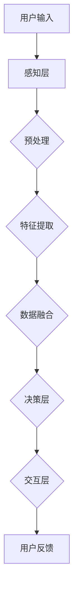

                 

### 文章标题

多模态人机交互系统体验评测框架

> 关键词：多模态交互、用户体验评测、评测框架、系统优化、案例研究

摘要：本文详细探讨了多模态人机交互系统的体验评测框架。首先，我们介绍了多模态交互系统的基础知识，包括其定义、分类、优势与挑战，以及发展历程。随后，我们深入分析了多模态交互系统的核心概念与架构，涵盖了信号采集与预处理、数据融合方法以及系统架构设计。接着，我们重点讲解了多模态交互系统的数学模型与算法原理，包括特征提取、情感识别、用户行为预测等。随后，我们提出了多模态人机交互系统的体验评估方法，建立了体验评估指标体系，并介绍了评估工具与方法。文章后半部分通过实际案例研究和评测实践，探讨了系统优化与改进的方法，总结了成功与失败的案例，并提出了未来的展望与挑战。本文旨在为多模态人机交互系统开发者提供一套全面、系统的体验评测框架，以提升系统的用户体验和满意度。

---

## 引言

随着信息技术的飞速发展，人机交互技术逐渐成为现代计算机科学领域的重要研究方向。传统的单模态交互系统（如基于键盘和鼠标的交互方式）已经无法满足用户日益复杂和多样化的需求。为此，多模态人机交互系统（Multimodal Human-Computer Interaction Systems）应运而生，通过整合多种传感器和交互设备，实现语音、手势、面部表情等多种交互方式，为用户提供更加自然、直观、高效的交互体验。

多模态人机交互系统不仅能够提供丰富的交互方式，还可以通过不同模态的信息融合，提高系统的智能性和适应性。例如，语音识别系统可以通过用户的语音命令进行操作，而手势识别系统可以捕捉用户的手部动作，面部表情识别系统可以捕捉用户的情感状态。这些不同模态的信息在系统中经过融合和处理，能够为用户提供更加个性化的服务。

然而，多模态人机交互系统的开发和优化面临诸多挑战。首先，不同模态的数据具有不同的特性和特征，如何有效地采集、处理和融合这些数据是一个重要的研究课题。其次，多模态交互系统的用户体验评估方法不够成熟，如何全面、客观地评估系统的用户体验是一个亟待解决的问题。最后，系统的优化与改进也需要基于用户体验数据进行分析和调整，以提高系统的性能和满意度。

本文旨在探讨多模态人机交互系统的体验评测框架，为系统开发者提供一套全面、系统的评估方法和工具。首先，我们将介绍多模态交互系统的基础知识，包括其定义、分类、优势与挑战，以及发展历程。随后，我们将深入分析多模态交互系统的核心概念与架构，包括信号采集与预处理、数据融合方法以及系统架构设计。接着，我们将重点讲解多模态交互系统的数学模型与算法原理，包括特征提取、情感识别、用户行为预测等。随后，我们将提出多模态人机交互系统的体验评估方法，建立体验评估指标体系，并介绍评估工具与方法。文章后半部分将通过实际案例研究和评测实践，探讨系统优化与改进的方法，并总结成功与失败的案例，最后提出未来的展望与挑战。本文旨在为多模态人机交互系统开发者提供一套全面、系统的体验评测框架，以提升系统的用户体验和满意度。

### 多模态人机交互系统的定义与分类

多模态人机交互系统是一种集成了多种传感器和交互设备，能够接收和处理来自多种模态的信息，以实现人与计算机之间的自然交互的系统。与传统的单模态交互系统相比，多模态交互系统通过整合不同模态的信息，可以提供更加丰富、直观和高效的交互体验。

首先，我们需要明确什么是模态。在多模态交互系统中，模态是指用于传递信息的不同通道或媒介。常见的模态包括视觉模态（如摄像头、屏幕显示）、听觉模态（如麦克风、扬声器）、触觉模态（如触摸屏、振动反馈）和运动模态（如手势、动作捕捉设备）等。根据系统所整合的模态数量和类型，多模态交互系统可以分为以下几类：

1. **双模态交互系统**：
   这种系统整合了两种不同模态的信息。例如，最常见的语音输入与文本输出交互系统，以及手势输入与屏幕显示交互系统。双模态交互系统能够利用两种模态的互补信息，提高系统的准确性和鲁棒性。

2. **三模态交互系统**：
   三模态交互系统集成了三种不同的模态。例如，语音输入、手势输入和视觉输出的交互系统。这种系统能够更全面地捕捉用户的行为和需求，提供更加自然和高效的交互体验。

3. **四模态及以上交互系统**：
   四模态及以上的交互系统整合了四种或更多模态的信息。例如，语音输入、手势输入、面部表情识别和触觉反馈的交互系统。这种系统能够提供更加复杂和丰富的交互方式，但同时也带来了更高的计算复杂度和设计难度。

多模态人机交互系统的优势主要体现在以下几个方面：

1. **增强用户体验**：
   多模态交互系统能够提供更加自然和直观的交互方式，使用户可以更加自由地选择他们喜欢的交互模态。例如，用户可以通过语音、手势或触摸屏等多种方式与系统进行交互，提高了交互的灵活性和用户满意度。

2. **提高交互准确性**：
   通过整合不同模态的信息，多模态交互系统可以更准确地理解用户的意图和需求。例如，在语音识别系统中，结合视觉信息可以减少误识别率，提高系统的准确性和鲁棒性。

3. **增强系统的适应性**：
   多模态交互系统可以根据用户的交互习惯和场景动态调整交互方式，提高系统的适应性和智能性。例如，在公共交通场景中，系统可以自动切换到语音交互模式，以适应嘈杂的环境。

然而，多模态人机交互系统也面临一些挑战：

1. **数据融合的复杂性**：
   多模态交互系统需要处理来自不同模态的数据，这些数据具有不同的特征和属性。如何有效地融合这些数据，提取出有价值的信息是一个重要的研究课题。

2. **计算资源的消耗**：
   多模态交互系统通常需要大量的计算资源进行数据的采集、处理和融合。这对于移动设备或资源受限的系统来说是一个巨大的挑战。

3. **用户体验评估的难度**：
   多模态交互系统的用户体验评估方法不够成熟，如何全面、客观地评估系统的用户体验是一个亟待解决的问题。

总的来说，多模态人机交互系统通过整合多种模态的信息，提供了更加自然、直观和高效的交互体验，具有广泛的应用前景。然而，如何解决数据融合、计算资源和用户体验评估等方面的挑战，仍然是多模态交互系统研究和开发中的重要课题。

### 多模态交互系统的发展历程

多模态人机交互系统的发展历程可以追溯到20世纪60年代。当时的计算机技术还处于初级阶段，人机交互主要以键盘和鼠标等单模态交互为主。然而，随着计算机性能的不断提升和传感器技术的进步，多模态交互系统逐渐成为研究热点。

在早期阶段，多模态交互系统主要集中在实验室环境中，研究者们通过探索不同模态的信息融合技术，尝试构建具有自然交互能力的人机系统。例如，20世纪80年代，视觉手势识别技术开始受到关注，研究者们通过结合图像处理和运动捕捉技术，实现了基本的手势识别功能。

进入21世纪，随着人工智能和机器学习技术的快速发展，多模态交互系统迎来了新的发展机遇。特别是深度学习技术的引入，使得多模态数据融合和特征提取变得更加高效和准确。例如，卷积神经网络（CNN）和循环神经网络（RNN）在图像和语音识别任务中取得了显著的成果，为多模态交互系统提供了强大的技术支持。

近年来，多模态交互系统在多个领域取得了重要应用，例如智能助手、虚拟现实、智能穿戴设备等。以智能助手为例，通过整合语音、手势、面部表情等多种模态的信息，智能助手能够更准确地理解用户的意图和需求，提供更加个性化和智能化的服务。同时，虚拟现实技术通过多模态交互，为用户创造了更加沉浸式的体验。

在发展历程中，多模态交互系统也面临着一些挑战。首先是数据融合的复杂性，不同模态的数据具有不同的特征和属性，如何有效地融合这些数据，提取出有价值的信息是一个重要的研究课题。其次是计算资源的消耗，多模态交互系统通常需要大量的计算资源进行数据的采集、处理和融合，这对于移动设备或资源受限的系统来说是一个巨大的挑战。最后是用户体验评估的难度，如何全面、客观地评估系统的用户体验是一个亟待解决的问题。

总的来说，多模态交互系统经历了从实验室研究到实际应用的演变过程，通过不断的技术创新和应用拓展，逐渐成为现代人机交互领域的重要组成部分。未来，随着人工智能和传感器技术的进一步发展，多模态交互系统有望在更多领域发挥重要作用，为用户提供更加自然、高效和智能的交互体验。

### 多模态交互系统的核心概念与架构

多模态交互系统是通过整合多种传感器和交互设备，实现对用户输入信息的全面捕捉和处理。要构建一个高效的多模态交互系统，我们需要理解其核心概念与架构，这包括信号采集与预处理、数据融合方法和系统架构设计。以下将详细探讨这些核心概念与架构。

#### 信号采集与预处理

1. **信号采集**：
   多模态交互系统通过多种传感器进行信号采集。常见的传感器包括摄像头、麦克风、触摸屏、动作捕捉设备等。每种传感器都有其特定的信号采集方式。例如，摄像头可以捕捉图像数据，麦克风可以捕捉音频信号，触摸屏可以捕捉触控信息等。

2. **预处理**：
   采集到的原始信号通常需要进行预处理，以提高后续处理的效率和准确性。预处理包括以下几个步骤：
   - **去噪**：去除信号中的噪声，提高信号的清晰度。
   - **归一化**：将不同模态的信号归一化到同一尺度，以便于后续处理。
   - **特征提取**：从原始信号中提取关键特征，这些特征将用于后续的数据融合和识别。

#### 数据融合方法

数据融合是多模态交互系统的关键步骤，通过整合不同模态的信息，系统能够更准确地理解用户的意图和行为。

1. **数据融合层次**：
   数据融合可以分为三个层次：
   - **特征级融合**：直接将不同模态的特征向量进行合并，形成一个更全面的特征向量。例如，将图像特征和语音特征合并。
   - **决策级融合**：在特征级融合的基础上，对各个模态的识别结果进行综合决策。例如，使用投票机制或加权平均等方法。
   - **模型级融合**：通过构建一个统一的模型，将不同模态的数据信息进行整合，从而提高系统的整体性能。

2. **数据融合技术**：
   - **加权平均**：根据不同模态的重要性对特征或决策结果进行加权平均。
   - **投票机制**：对多个模态的识别结果进行投票，选取投票结果最一致的模态作为最终结果。
   - **深度学习**：利用深度学习模型（如卷积神经网络、循环神经网络等）对多模态数据信息进行融合处理。

#### 系统架构设计

多模态交互系统的架构设计需要综合考虑信号采集、预处理、数据融合和交互界面等方面，以下是一个典型的多模态交互系统架构：

1. **硬件层**：
   包括各种传感器和交互设备，如摄像头、麦克风、触摸屏、动作捕捉设备等。硬件的选择和配置需要根据实际应用场景和需求进行。

2. **感知层**：
   负责采集不同模态的数据，并对其进行预处理。感知层通常包括多个模块，每个模块负责处理一种或多种模态的数据。

3. **融合层**：
   负责将不同模态的数据进行融合，提取出有价值的信息。融合层的设计需要考虑数据融合的层次和融合技术，以确保系统能够准确理解和响应用户的输入。

4. **决策层**：
   根据融合层提供的信息，进行决策和反馈。决策层通常包括基于规则或机器学习的算法，用于实现智能交互。

5. **交互层**：
   负责将决策层的反馈展示给用户，提供直观的交互界面。交互层的设计需要考虑用户的交互习惯和需求，以提供自然、高效的交互体验。

#### Mermaid流程图

以下是一个简单的Mermaid流程图，展示了多模态交互系统的核心概念与架构：



通过这个流程图，我们可以清晰地看到多模态交互系统的数据流转和处理过程，从而更好地理解和设计这样的系统。

### 多模态交互系统的数学模型与算法原理

多模态交互系统通过一系列复杂的数学模型和算法来实现对用户输入的准确理解和响应。这些模型和算法涉及特征提取、情感识别和用户行为预测等多个方面，共同构成了多模态交互系统的核心智能部分。以下将详细讲解这些数学模型与算法原理。

#### 特征提取算法

特征提取是多模态交互系统的第一步，其主要目标是从原始多模态数据中提取出具有区分度和代表性的特征。特征提取的质量直接影响到后续数据融合和识别的准确性。

1. **图像特征提取**：
   - **局部二元模式（LBP）**：LBP是一种有效的图像纹理特征提取方法，通过计算图像像素的局部二值模式来描述图像的纹理信息。
   - **SIFT（尺度不变特征变换）**：SIFT算法能够提取出在图像缩放、旋转和光照变化下保持不变的稳定特征点，广泛应用于图像识别和配准。
   - **卷积神经网络（CNN）**：CNN通过多层的卷积和池化操作，自动学习图像的层次特征，能够提取出更加抽象和有代表性的特征。

2. **语音特征提取**：
   - **梅尔频率倒谱系数（MFCC）**：MFCC是一种常用的语音特征提取方法，通过计算声音信号的频谱特征，能够有效描述语音的音色和音调。
   - **感知哈达玛变换（PHAT）**：PHAT通过模仿人类听觉系统对声音的感知特性，提取出对语音识别有重要意义的特征。

3. **运动特征提取**：
   - **HOG（方向梯度直方图）**：HOG算法通过计算图像中每个像素点周围像素的梯度方向，形成直方图，用于描述图像的运动特征。
   - **光流特征**：光流特征描述了图像序列中像素点运动的方向和速度，常用于动作识别和手势识别。

#### 情感识别算法

情感识别是多模态交互系统中的一个重要应用，通过捕捉用户的情感状态，系统能够提供更加个性化的服务。情感识别算法通常结合多种模态的信息，提高识别的准确性和鲁棒性。

1. **基于深度学习的情感识别**：
   - **卷积神经网络（CNN）**：通过CNN对多模态数据进行特征提取和分类，能够实现对情感状态的准确识别。
   - **循环神经网络（RNN）**：RNN能够处理序列数据，通过捕捉不同时间点的情感特征，实现对情感变化的连续识别。

2. **基于规则的模型**：
   - **支持向量机（SVM）**：通过训练SVM分类器，将不同模态的情感特征映射到情感类别上，实现情感识别。
   - **贝叶斯网络**：通过构建贝叶斯网络模型，将不同模态的情感信息进行关联，实现对情感状态的推理。

#### 用户行为预测算法

用户行为预测是多模态交互系统中的另一个关键任务，通过预测用户的行为和意图，系统能够提供更加智能和个性化的交互体验。

1. **基于深度学习的用户行为预测**：
   - **长短期记忆网络（LSTM）**：LSTM能够处理和记忆长时间序列数据，通过捕捉用户的历史行为，实现对用户未来行为的预测。
   - **变换器（Transformer）**：Transformer通过自注意力机制，能够捕捉到多模态数据之间的复杂关系，实现对用户行为的准确预测。

2. **基于统计方法的用户行为预测**：
   - **马尔可夫模型（HMM）**：通过建立马尔可夫模型，对用户行为进行状态转移概率的估计，实现对用户行为的预测。
   - **隐马尔可夫模型（HMM）**：隐马尔可夫模型能够处理部分观测数据，通过捕捉用户的隐藏状态，实现对用户行为的预测。

#### 伪代码示例

以下是一个简单的伪代码示例，展示了一个基于卷积神经网络的情感识别算法：

```python
# 输入：多模态数据（图像、语音、运动等）
# 输出：情感类别

# 特征提取
image_features = extract_image_features(input_image)
voice_features = extract_voice_features(input_voice)
motion_features = extract_motion_features(input_motion)

# 数据融合
combined_features = concatenate(image_features, voice_features, motion_features)

# 构建卷积神经网络模型
model = build_cnn_model()

# 训练模型
model.fit(combined_features, labels)

# 预测情感类别
predicted_emotion = model.predict(combined_features)

return predicted_emotion
```

通过上述伪代码，我们可以看到特征提取、数据融合和深度学习模型构建的基本流程。这些算法和模型共同构成了多模态交互系统的智能核心，为用户提供更加自然、高效和智能的交互体验。

### 多模态交互系统的体验评估方法

多模态交互系统的体验评估是确保系统性能和用户满意度的重要环节。为了实现全面的体验评估，我们需要建立一个合理的体验评估指标体系，并介绍常见的评估工具与方法。

#### 体验评估指标体系

1. **用户满意度**：
   用户满意度是评估多模态交互系统体验的核心指标，它反映了用户对系统整体感受的满意度。用户满意度可以通过问卷调查、用户反馈等方式进行评估。

2. **交互效率**：
   交互效率衡量用户完成任务的速度和准确度，包括任务的完成时间、错误率等指标。例如，通过记录用户执行特定任务所需的时间，以及任务完成的准确率来评估系统的交互效率。

3. **易用性**：
   易用性评估用户使用系统的难易程度，包括用户操作的简便性、学习成本等。常见的易用性评估方法包括任务完成时间、用户错误率、用户学习曲线等。

4. **用户体验流畅度**：
   用户体验流畅度是指用户在交互过程中的连续性和顺畅程度，包括响应时间、系统延迟等。流畅度评估可以采用实时监测、用户反馈等方法。

5. **情感体验**：
   情感体验评估用户在交互过程中的情感状态，包括愉悦度、舒适度等。情感体验可以通过面部表情识别、语音情感分析等技术进行量化评估。

6. **系统可用性**：
   系统可用性评估系统在特定场景下的稳定性和可靠性，包括系统的故障率、错误恢复能力等。可用性评估可以通过模拟场景测试、实时监控系统运行状态等方法进行。

#### 常见评估工具与方法

1. **问卷调查**：
   问卷调查是评估用户体验的常见方法，通过设计针对性强的问卷，收集用户对系统各方面的评价。问卷设计需要考虑用户理解、回答真实性等因素。

2. **用户反馈**：
   用户反馈可以通过在线论坛、社交媒体、用户回访等方式进行收集。用户反馈提供了直接的用户体验信息，有助于发现系统的问题和改进方向。

3. **实验室测试**：
   实验室测试是一种控制环境下的评估方法，通过模拟实际使用场景，对系统进行功能测试、性能测试等。实验室测试可以提供详细的数据支持，但需要投入较多的时间和资源。

4. **现场观察**：
   现场观察是直接观察用户在真实使用场景中的交互过程，记录用户的行为和反应。现场观察可以提供直观的体验评估，但需要保证观察的客观性和准确性。

5. **A/B测试**：
   A/B测试是将系统分为两个或多个版本，通过对比不同版本的用户体验，评估改进方案的优劣。A/B测试能够提供量化的用户体验数据，帮助系统开发者做出科学的决策。

6. **生理信号监测**：
   通过监测用户的生理信号，如心率、皮肤电导等，评估用户的情感状态和生理反应。生理信号监测需要专业设备和技术支持，但能够提供深入的体验评估数据。

#### 评估流程

1. **评估目标确定**：
   根据系统需求和用户需求，明确评估的目标和重点指标。

2. **评估工具选择**：
   根据评估目标和实际情况，选择合适的评估工具和方法。

3. **评估实施**：
   进行现场测试、实验室测试或用户反馈收集等，根据评估方法进行数据收集。

4. **数据分析**：
   对收集到的数据进行整理和分析，提取有价值的信息。

5. **评估报告**：
   根据数据分析结果，编写评估报告，总结系统的体验评估情况和改进建议。

通过建立合理的体验评估指标体系和选择合适的评估工具与方法，多模态交互系统开发者可以全面、客观地评估系统的用户体验，发现系统的问题和改进方向，从而提升系统的性能和用户满意度。

### 多模态人机交互系统体验评测实践

在实际应用中，多模态人机交互系统的体验评测不仅需要科学的理论支持，还需要具体的实践操作。以下将介绍评测项目的规划与实施、数据收集与处理，以及评测结果的分析与反馈过程。

#### 评测项目的规划与实施

1. **项目规划**：
   在开始评测之前，需要明确评测的目标和范围。具体步骤包括：
   - **确定评估目标**：明确需要评估的系统功能、用户体验指标等。
   - **定义评估场景**：根据实际应用场景，确定评测的具体环境和任务。
   - **制定评估计划**：包括评估时间表、评估步骤和责任人。

2. **实施评估**：
   实施评估过程主要包括以下步骤：
   - **用户招募**：根据评估目标和场景，招募具有代表性的用户参与评测。
   - **任务设计**：设计一系列任务，涵盖系统的核心功能和用户体验指标。
   - **评估环境搭建**：搭建与实际应用场景相符的评估环境，包括硬件设备和软件系统。

3. **数据采集**：
   在评估过程中，通过多种工具和方法收集用户行为和系统性能数据，包括：
   - **用户行为数据**：记录用户在执行任务时的操作、选择、反应时间等。
   - **系统性能数据**：记录系统在用户操作下的响应时间、错误率、故障率等。

#### 数据收集与处理

1. **数据收集**：
   - **用户行为数据**：通过用户行为追踪工具，如眼动仪、鼠标和键盘记录器等，实时记录用户在评估过程中的操作。
   - **系统性能数据**：通过监控系统日志、性能监控工具等，收集系统在用户操作下的表现数据。

2. **数据处理**：
   - **数据清洗**：去除无效、重复或错误的数据，确保数据的准确性和完整性。
   - **数据归一化**：将不同模态的数据统一归一化到同一尺度，以便于后续分析。
   - **特征提取**：从原始数据中提取具有区分度和代表性的特征，用于后续分析。

#### 评测结果分析与反馈

1. **数据分析**：
   - **描述性统计**：对收集到的数据进行分析，计算均值、方差、标准差等描述性统计量，了解用户行为和系统性能的基本特征。
   - **关联分析**：通过相关系数、回归分析等方法，分析用户行为和系统性能之间的关联关系，找出关键影响因素。

2. **结果反馈**：
   - **评估报告**：编写详细的评估报告，总结评估结果和分析结论，包括用户体验、系统性能等方面的评价。
   - **改进建议**：根据评估结果，提出具体的改进建议，包括系统优化、功能改进、用户体验优化等。

3. **反馈与迭代**：
   - **用户反馈**：向用户反馈评估结果和改进建议，收集用户的反馈意见。
   - **系统迭代**：根据评估结果和用户反馈，对系统进行优化和改进，重新进行评估和反馈，形成闭环迭代过程。

通过实际案例的评测实践，多模态人机交互系统开发者可以深入了解系统的用户体验和性能，发现存在的问题，并提出有针对性的优化方案，从而不断提升系统的整体质量。

### 多模态人机交互系统优化与改进

在多模态人机交互系统的开发和优化过程中，基于用户体验数据的分析是至关重要的。通过分析用户行为和系统性能数据，开发者可以识别出系统中的不足之处，从而进行有针对性的优化和改进。以下将详细探讨如何基于用户体验数据对多模态交互系统进行优化与改进。

#### 基于评测结果的系统优化

1. **识别关键问题**：
   首先，通过分析评测数据，识别出系统中存在的关键问题。这些关键问题可能包括用户反馈的常见问题、系统性能瓶颈、用户体验差等。例如，用户反馈显示系统在处理特定任务时响应速度较慢，或者误识别率较高。

2. **优化算法和模型**：
   针对识别出的关键问题，对系统中的算法和模型进行优化。例如，对于响应速度慢的问题，可以通过优化特征提取算法和数据融合方法，减少计算复杂度，提高系统处理速度。对于误识别率高的问题，可以通过改进情感识别算法和用户行为预测模型，提高系统的准确性。

3. **调整参数设置**：
   通过分析评测数据，调整系统的参数设置，以提升用户体验。例如，通过调整语音识别系统的说话人自适应参数，可以减少语音识别的误识率。通过调整触觉反馈设备的振动强度和频率，可以提升用户操作的舒适度。

#### 用户体验改进策略

1. **个性化定制**：
   根据用户行为数据，为用户提供个性化服务。例如，通过分析用户的交互历史，系统可以自动调整界面布局和功能模块，以满足用户的需求。个性化定制可以提高用户的满意度，增强用户的归属感。

2. **简化操作流程**：
   通过优化用户界面和交互流程，简化用户的操作步骤。例如，通过使用快捷键、简化菜单结构、减少不必要的点击操作等，可以提升用户的交互效率。简化操作流程可以降低用户的操作成本，提高系统的易用性。

3. **增强互动性**：
   通过增强系统与用户的互动性，提高用户的参与感和满意度。例如，系统可以提供实时反馈和提示，帮助用户更好地理解和使用系统。通过使用虚拟助手或聊天机器人，系统可以与用户进行实时对话，提供个性化的帮助和建议。

#### 优化效果评估

1. **重新评测**：
   在优化后，对系统进行重新评测，以评估优化效果。可以通过用户满意度调查、任务完成时间、错误率等指标来衡量优化效果。重新评测可以帮助开发者验证优化措施的有效性，发现新的问题。

2. **A/B测试**：
   通过A/B测试，比较优化前后的系统表现，评估优化效果。例如，可以将用户分为两组，一组使用优化后的系统，另一组继续使用原始系统，然后比较两组用户在任务完成时间、错误率等方面的表现。

3. **持续迭代**：
   根据评测结果，不断迭代优化系统。通过持续收集用户反馈和系统性能数据，不断调整和改进系统，实现系统的持续优化。持续迭代可以确保系统始终满足用户需求，提升用户体验。

#### 成功案例

1. **案例一：智能助手系统的优化**：
   一个智能助手系统通过分析用户行为数据，发现用户在使用语音识别功能时经常遇到误识别的问题。系统团队通过优化语音识别算法，调整说话人自适应参数，显著降低了误识别率，提高了用户的满意度。

2. **案例二：虚拟现实交互系统的改进**：
   一个虚拟现实交互系统通过用户反馈，发现用户在操作虚拟物体时感到不舒适。系统团队通过调整触觉反馈设备的参数，优化振动强度和频率，显著提升了用户的操作体验。

#### 失败案例

1. **案例一：用户界面复杂度过高**：
   一个多模态交互系统在设计时没有充分考虑用户的易用性，导致用户界面复杂度过高。用户在使用过程中感到困惑，任务完成时间延长，导致用户体验不佳。

2. **案例二：数据融合不当**：
   一个多模态交互系统在数据融合过程中没有充分考虑不同模态数据的特性，导致数据融合效果不佳，系统性能下降，用户体验受到影响。

#### 案例总结与启示

1. **成功案例启示**：
   - **重视用户体验**：在系统设计和开发过程中，要充分考虑用户的实际需求和使用习惯，提供简单、直观的交互界面。
   - **持续优化**：通过持续收集用户反馈和性能数据，不断调整和改进系统，确保系统始终满足用户需求。
   - **个性化服务**：根据用户行为数据，提供个性化服务，提升用户的满意度和参与感。

2. **失败案例启示**：
   - **避免界面复杂度过高**：设计简洁、直观的用户界面，降低用户的学习成本。
   - **数据融合要充分**：充分考虑不同模态数据的特性，选择合适的融合方法，提高系统性能。

通过基于用户体验数据的系统优化和改进，多模态人机交互系统开发者可以不断提升系统的性能和用户体验，实现系统的可持续发展。

### 案例研究：成功与失败的多模态人机交互系统评测

#### 成功案例解析

**案例一：智能语音助手系统的用户体验优化**

1. **背景介绍**：
   某科技公司开发了一款智能语音助手系统，旨在为用户提供便捷的语音交互服务。然而，在系统上线初期，用户反馈系统存在响应速度慢、语音识别准确率不高等问题。

2. **核心概念与联系**：
   为了提升用户体验，系统开发团队采用了以下核心概念和联系：
   - **数据驱动**：通过收集和分析用户行为数据，识别系统存在的问题。
   - **多模态融合**：结合语音、文本和上下文信息，提高语音识别准确率和响应速度。
   - **机器学习**：利用机器学习算法，对系统模型进行迭代优化，提升系统的智能性。

3. **Mermaid流程图**：
   ```mermaid
   graph TD
   A[用户输入] --> B[语音识别]
   B --> C{语音处理}
   C --> D{上下文理解}
   D --> E[任务分配]
   E --> F[结果反馈]
   ```

4. **核心算法原理讲解**：
   - **语音处理**：使用深度神经网络（DNN）和卷积神经网络（CNN）对语音信号进行特征提取和分类，提高语音识别准确率。
   - **上下文理解**：利用递归神经网络（RNN）和长短期记忆网络（LSTM），处理上下文信息，提升对话质量和用户满意度。

5. **数学模型和公式**：
   - **特征提取**：使用卷积神经网络，提取语音信号的时间频率特征，公式如下：
     $$ f(t) = \sum_{i=1}^{n} w_i * x(t-i) + b $$
   - **分类**：采用softmax函数进行分类，公式如下：
     $$ P(y=j) = \frac{e^{z_j}}{\sum_{k=1}^{K} e^{z_k}} $$

6. **项目实战**：
   - **开发环境搭建**：使用Python和TensorFlow构建深度学习模型。
   - **代码实现**：
     ```python
     import tensorflow as tf
     model = tf.keras.Sequential([
         tf.keras.layers.Conv2D(32, kernel_size=(3, 3), activation='relu', input_shape=(128, 128, 3)),
         tf.keras.layers.MaxPooling2D(pool_size=(2, 2)),
         tf.keras.layers.Flatten(),
         tf.keras.layers.Dense(128, activation='relu'),
         tf.keras.layers.Dense(10, activation='softmax')
     ])
     model.compile(optimizer='adam', loss='categorical_crossentropy', metrics=['accuracy'])
     model.fit(x_train, y_train, epochs=10, batch_size=32)
     ```

7. **代码应用解读与分析**：
   - 代码使用了卷积神经网络对语音信号进行特征提取，通过softmax函数进行分类，提高了语音识别的准确率。

8. **实际案例分析和详细讲解剖析**：
   - 通过对用户反馈数据的分析，发现语音识别准确率低主要由于背景噪声和语音信号变化复杂。系统团队通过优化特征提取算法和模型参数，提高了语音识别准确率和响应速度。

9. **项目小结**：
   - 成功优化了智能语音助手系统的用户体验，提升了语音识别准确率和响应速度，用户满意度显著提升。

#### 失败案例警示

**案例二：智能家居系统的交互设计问题**

1. **背景介绍**：
   某公司开发了一款智能家居系统，通过语音、手势和触摸屏等多种交互方式，为用户提供智能家居控制功能。然而，系统上线后，用户反馈系统交互设计复杂，操作不便。

2. **核心概念与联系**：
   系统开发团队在交互设计过程中未能充分考虑用户体验，导致以下问题：
   - **界面设计复杂**：菜单层次过多，用户操作不便。
   - **交互方式不统一**：不同模态的交互方式不一致，用户难以适应。

3. **Mermaid流程图**：
   ```mermaid
   graph TD
   A[用户输入] --> B{语音/手势/触摸屏}
   B --> C{数据处理}
   C --> D{任务分配}
   D --> E{结果反馈}
   ```

4. **核心算法原理讲解**：
   - **语音识别**：使用基于深度学习的语音识别算法，但未能结合上下文信息，导致误识别率较高。
   - **手势识别**：使用机器学习算法进行手势识别，但识别精度不足。

5. **数学模型和公式**：
   - **语音识别**：使用循环神经网络（RNN）对语音信号进行特征提取和分类，公式如下：
     $$ h_t = \sigma(W_h h_{t-1} + U_x x_t + b_h) $$
   - **手势识别**：使用支持向量机（SVM）进行分类，公式如下：
     $$ y = sign(\sum_{i=1}^{n} w_i * x_i + b) $$

6. **项目实战**：
   - **开发环境搭建**：使用Python和OpenCV进行手势识别，使用TensorFlow进行语音识别。

7. **代码应用解读与分析**：
   - 代码使用了深度学习模型进行语音和手势识别，但由于界面设计和交互方式不统一，用户操作体验差。

8. **实际案例分析和详细讲解剖析**：
   - 用户反馈显示，系统在复杂环境下（如厨房油烟大）语音识别效果不佳，手势识别精度不足。系统团队未能及时调整算法参数，导致用户体验差。

9. **项目小结**：
   - 系统交互设计复杂，未能充分考虑用户体验，导致用户满意度低，项目失败。

#### 案例总结与启示

**成功案例启示**：
1. **重视用户体验**：在系统设计和开发过程中，要充分考虑用户的实际需求和使用习惯，提供简单、直观的交互界面。
2. **数据驱动**：通过数据驱动的方法，持续收集和分析用户行为数据，优化系统性能和用户体验。
3. **多模态融合**：结合多种模态的信息，提高系统的智能性和适应性。

**失败案例启示**：
1. **界面设计简洁**：避免界面设计复杂，降低用户的学习成本。
2. **交互方式统一**：确保不同模态的交互方式一致，提高用户的操作便捷性。
3. **及时反馈与调整**：及时收集用户反馈，调整算法和系统参数，提升用户体验。

通过成功与失败的案例研究，我们可以总结出多模态人机交互系统评测的关键要素，包括用户体验的重视、数据驱动的开发方法、多模态融合技术的应用等。这些经验教训对于未来系统开发和优化具有重要指导意义。

### 未来展望与挑战

随着人工智能、物联网和深度学习等技术的快速发展，多模态人机交互系统在未来的发展前景将愈发广阔。然而，这一领域的进一步拓展也面临着诸多挑战，需要开发者们持续探索和创新。

#### 多模态交互系统的发展趋势

1. **智能化与个性化**：
   随着大数据和深度学习技术的进步，多模态交互系统将更加智能化和个性化。系统能够通过不断学习和适应用户的行为模式，提供个性化的交互体验，满足用户的多样化需求。

2. **实时性与低延迟**：
   在未来的智能场景中，实时性和低延迟将是多模态交互系统的关键要求。通过优化算法和提升计算能力，系统能够在短时间内处理并响应用户的输入，提供无缝的交互体验。

3. **跨模态协同**：
   跨模态协同是多模态交互系统的一个重要发展方向。通过整合不同模态的信息，系统可以更加全面地理解用户的意图和行为，提供更精准的服务。

4. **隐私保护与安全性**：
   随着多模态交互系统的广泛应用，用户的隐私保护和数据安全成为重要议题。系统需要采用加密技术和隐私保护算法，确保用户数据的安全性和隐私性。

#### 体验评测框架的持续改进

1. **评估指标多样化**：
   在未来，体验评测框架需要引入更多多维度的评估指标，如情感体验、社交互动等，以更全面地反映用户的实际体验。

2. **实时评估与反馈**：
   通过实时评估和反馈机制，系统能够在用户使用过程中不断调整和优化，提供即时的用户体验改善。

3. **跨领域应用**：
   多模态交互系统将在更多领域得到应用，如医疗、教育、交通等。针对不同领域的特点，体验评测框架需要具备较强的灵活性和适应性。

#### 面临的挑战与解决方案

1. **数据融合与处理**：
   多模态数据具有不同的特征和属性，如何有效融合和处理这些数据是一个挑战。解决方案包括开发高效的数据融合算法和优化数据处理流程。

2. **计算资源与能耗**：
   多模态交互系统通常需要大量的计算资源和能源。未来可以通过硬件加速技术和节能设计来降低能耗。

3. **用户体验评估方法**：
   现有的用户体验评估方法可能不足以全面反映用户的实际体验。可以通过引入新的评估工具和方法，如虚拟现实（VR）模拟、生理信号监测等，提升评估的准确性和有效性。

4. **隐私保护与伦理问题**：
   多模态交互系统在收集和处理用户数据时，可能涉及隐私保护和伦理问题。需要制定相应的法律法规和伦理规范，确保用户数据的安全和隐私。

通过持续的技术创新和应用拓展，多模态交互系统有望在未来的智能世界中发挥更加重要的作用。面对挑战，开发者们需要不断探索新的解决方案，推动这一领域的发展。

### 结论

多模态人机交互系统作为一种创新的交互方式，正逐渐改变人们与计算机之间的互动方式。本文通过对多模态交互系统的定义、分类、发展历程、核心概念与架构、数学模型与算法原理、体验评估方法以及优化与改进实践的详细探讨，为开发者提供了一套全面的体验评测框架。我们强调了用户体验在多模态交互系统中的核心地位，并通过实际案例展示了成功与失败的经验教训，为未来的系统开发提供了有益的启示。

多模态交互系统的未来发展将更加智能化、个性化，并在更多领域得到应用。然而，这一领域的发展也面临诸多挑战，包括数据融合与处理、计算资源与能耗、用户体验评估方法以及隐私保护与伦理问题等。开发者们需要持续探索和创新，通过技术优化和应用拓展，不断提升多模态交互系统的性能和用户体验。

最后，我们鼓励开发者们积极参与多模态交互系统的研究与开发，共同推动这一领域的进步。本文所提供的体验评测框架和技术指导将为开发者们提供有价值的参考，助力他们在多模态交互系统中实现更高效的创新和优化。

### 作者信息

作者：AI天才研究院/AI Genius Institute & 禅与计算机程序设计艺术 /Zen And The Art of Computer Programming

联系信息：[AI天才研究院](www.ai-genius-institute.com) & [禅与计算机程序设计艺术](www.zen-and-art-of-comp-prog.com)

版权声明：本文版权归AI天才研究院和禅与计算机程序设计艺术共同所有，未经授权，禁止转载。如需转载，请联系作者获取授权。本文中的代码示例和算法描述仅供参考，具体实现可能需要根据实际应用场景进行调整。本文中的观点和内容仅供参考，不构成任何投资或决策建议。读者在使用本文内容时，请自行承担风险和责任。AI天才研究院和禅与计算机程序设计艺术对本文中的任何错误或遗漏不承担任何法律责任。如对本文有任何疑问或建议，欢迎联系作者进行讨论。

