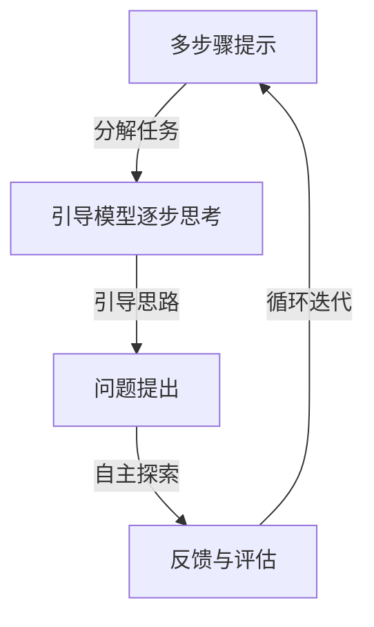

                 

# 多步骤提示：引导模型逐步思考

> 关键词：多步骤提示、引导模型、教育技术、逐步思考、学习策略

> 摘要：本文旨在探讨多步骤提示和引导模型逐步思考在教育和技术领域的应用，通过详细分析其背景、核心概念、应用方法和实际案例，为教育工作者和研究者提供理论与实践指导。

### 引言

在信息爆炸的时代，学习方式和教育模式发生了翻天覆地的变化。传统的教育方式往往注重知识的传递，而忽视了学生自主学习和思考能力的发展。为了应对这种挑战，教育技术领域逐渐引入了多种学习策略和教学方法，其中多步骤提示和引导模型逐步思考成为了研究的热点。

多步骤提示（Multi-Step Instructions）是一种通过逐步分解任务，引导学生逐步理解和掌握知识的方法。它强调通过一系列连续的步骤，帮助学生建立对复杂问题的理解。而引导模型逐步思考（Guided Thinking Model）则是一种结合了人工智能和认知心理学原理的教学模型，旨在通过引导和激励学生，提高其解决问题的能力和创新思维。

本文将首先介绍多步骤提示和引导模型逐步思考的基本概念和理论背景，然后深入探讨其在教育和技术领域的应用，并通过实际案例进行分析，最后总结其价值和未来发展方向。

### 多步骤提示的基本概念

多步骤提示是一种教学方法，它通过将复杂任务分解成多个简单步骤，从而帮助学生逐步掌握知识和技能。这一方法的核心在于引导学生通过逐个完成小任务，最终实现大目标。

#### 定义

多步骤提示（Multi-Step Instructions）是指将复杂任务或学习目标分解成一系列简单的步骤，并逐步引导学生完成每个步骤，以达到整体目标的教学方法。它通常包括以下几个关键组成部分：

1. **明确目标**：首先需要明确学习目标，这有助于学生了解需要达到的最终成果。
2. **分解任务**：将复杂任务分解成一系列小步骤，每个步骤都相对简单，便于学生理解和执行。
3. **逐步引导**：在学生完成每个步骤后，教师或系统会提供反馈和指导，帮助学生纠正错误，巩固知识。
4. **循环迭代**：学生可能需要多次重复某个步骤，直到完全掌握为止。

#### 作用

多步骤提示在教学中的作用主要体现在以下几个方面：

1. **降低学习难度**：通过将复杂任务分解成小步骤，降低了学生的认知负荷，使其更容易理解和掌握。
2. **提高学习效率**：学生可以更快地达到学习目标，因为他们每完成一个步骤，都会感到一定的成就感。
3. **增强学习动机**：每完成一个步骤，学生都能获得及时的反馈和鼓励，从而提高学习动机。
4. **培养自主学习能力**：通过逐步引导，学生学会了如何独立解决问题，培养了自主学习的能力。

#### 心理学原理

多步骤提示的应用与认知心理学中的“分步处理理论”（Chunking Theory）密切相关。该理论认为，人类的短期记忆容量有限，通常只能处理少量的信息。通过将信息分成小块，可以提高记忆效果。多步骤提示正是基于这一原理，通过逐步分解任务，帮助学生更好地利用其认知资源。

此外，多步骤提示还与“认知负载理论”（Cognitive Load Theory）有着紧密的联系。该理论指出，学习过程中的认知负载分为“外在负载”和“内在负载”。外在负载是指学习材料本身的复杂性，而内在负载是指学习者处理信息时所消耗的认知资源。通过分解任务，可以降低外在负载，使学生更容易理解和掌握知识。

### 引导模型逐步思考的方法

引导模型逐步思考是一种结合了人工智能和认知心理学原理的教学方法，旨在通过系统的引导和激励，提高学生的思维能力和创造力。这种方法不仅适用于传统课堂教学，还可以在在线教育和数字化学习环境中发挥重要作用。

#### 定义

引导模型逐步思考（Guided Thinking Model）是指通过一系列有序的引导步骤，激发学生的思考能力，引导他们逐步解决问题的教学模型。它通常包括以下几个关键组成部分：

1. **问题提出**：首先提出一个具有挑战性的问题，激发学生的思考和好奇心。
2. **引导思路**：教师或系统提供一系列引导性问题和提示，帮助学生逐步深入思考和探索问题。
3. **自主探索**：学生在引导下进行自主探索，尝试解决问题或提出自己的见解。
4. **反馈与评估**：教师或系统对学生的思考过程和结果进行反馈和评估，提供进一步指导和鼓励。

#### 方法

引导模型逐步思考的方法可以分为以下几个步骤：

1. **提出问题**：首先需要提出一个具有启发性和挑战性的问题，以激发学生的思考和兴趣。问题应具有开放性和探究性，鼓励学生多角度思考。

2. **引导思考**：在学生思考过程中，教师或系统可以通过提供一系列引导性问题，帮助学生逐步深入思考和探索。这些问题应循序渐进，从简单到复杂，逐步引导学生拓展思维。

3. **自主探索**：在引导性问题的帮助下，学生可以进行自主探索，尝试解决问题或提出自己的见解。这一过程有助于培养学生的独立思考能力和创新能力。

4. **反馈与评估**：教师或系统应对学生的思考和结果进行及时反馈和评估。这包括肯定学生的正确思路和提出改进建议，以帮助学生进一步深化理解。

#### 作用

引导模型逐步思考在教学中的作用主要体现在以下几个方面：

1. **提高思维能力**：通过引导和激励，学生学会了如何深入思考和解决问题，提高了其逻辑思维、批判性思维和创造力。

2. **培养自主学习能力**：学生在引导下进行自主探索，学会了如何独立获取知识和解决问题，培养了自主学习的能力。

3. **增强学习动机**：引导模型逐步思考通过激发学生的兴趣和好奇心，增强了他们的学习动机。

4. **促进教师角色转变**：引导模型逐步思考要求教师从传统的知识传递者转变为学习的引导者和促进者，促进了教师角色的转变。

#### 心理学原理

引导模型逐步思考与认知心理学中的“认知灵活性理论”（Cognitive Flexibility Theory）密切相关。该理论认为，认知灵活性是指个体能够根据不同情境灵活调整思维策略的能力。引导模型逐步思考通过不断提出问题、引导思考和提供反馈，帮助学生培养认知灵活性，提高其适应不同情境的能力。

此外，引导模型逐步思考还与“动机理论”（Motivation Theory）有着紧密的联系。根据动机理论，内在动机是驱动个体积极行动的重要因素。引导模型逐步思考通过激发学生的兴趣和好奇心，增强了其内在动机，从而提高了学习效果。

### 多步骤提示与引导模型逐步思考的关系

多步骤提示和引导模型逐步思考虽然各有侧重，但它们在教育和技术领域有着紧密的联系和互补作用。多步骤提示通过逐步分解任务，帮助学生建立对复杂问题的理解；而引导模型逐步思考则通过系统的引导和激励，激发学生的思考能力和创造力。

#### 关系架构

多步骤提示与引导模型逐步思考的关系可以用一个Mermaid流程图来表示：

#### 核心概念关系

1. **任务分解**：多步骤提示强调将复杂任务分解成简单步骤，而引导模型逐步思考则在这一基础上，通过系统的引导和激励，帮助学生深入思考和解决问题。
2. **问题引导**：多步骤提示通过提供明确的任务步骤，引导学生逐步完成任务；而引导模型逐步思考则通过提出开放性问题，激发学生的思考和创造力。
3. **自主探索**：多步骤提示鼓励学生按照既定步骤完成任务，而引导模型逐步思考则通过自主探索，培养学生的独立思考能力和创新能力。
4. **反馈评估**：多步骤提示通过及时的反馈和评估，帮助学生巩固知识；而引导模型逐步思考则通过反馈和评估，激发学生的进一步思考和改进。

### 多步骤提示与引导模型逐步思考的应用

多步骤提示和引导模型逐步思考在教育和技术领域的应用广泛，以下将分别从在线教育和数字化学习、传统课堂教学、以及特殊教育等方面进行探讨。

#### 在线教育和数字化学习

随着互联网和人工智能技术的发展，在线教育和数字化学习已成为教育领域的重要趋势。多步骤提示和引导模型逐步思考在这两个领域有着广泛的应用。

1. **在线教育平台**：在线教育平台可以通过多步骤提示，为学生提供详细的任务分解和指导。例如，在线编程课程可以通过逐步引导，帮助学生掌握编程技能。同时，引导模型逐步思考可以激发学生的兴趣和创造力，使其更好地适应在线学习环境。

2. **数字化学习资源**：数字化学习资源如电子书、学习软件等，可以通过多步骤提示和引导模型逐步思考，为学生提供丰富的学习资源和指导。例如，电子书可以结合多步骤提示，将复杂内容分解成简单部分，引导学生逐步理解；学习软件可以通过引导模型逐步思考，激发学生的探索兴趣和创造力。

#### 传统课堂教学

尽管在线教育和数字化学习发展迅速，传统课堂教学仍然占据着重要地位。多步骤提示和引导模型逐步思考在传统课堂教学中也有广泛应用。

1. **课堂教学设计**：教师可以在教学设计中引入多步骤提示，将复杂教学内容分解成简单步骤，帮助学生逐步理解和掌握。例如，在数学教学中，教师可以将复杂的数学问题分解成多个简单步骤，引导学生逐步解决。

2. **课堂活动**：教师可以通过引导模型逐步思考，激发学生的思考和创造力。例如，在科学课堂上，教师可以提出开放性问题，引导学生进行实验和探究，培养其批判性思维和创新能力。

#### 特殊教育

对于特殊教育学生，多步骤提示和引导模型逐步思考具有特殊意义。这些方法可以帮助特殊教育学生更好地适应学习环境，提高其学习效果。

1. **学习障碍学生**：多步骤提示可以帮助学习障碍学生逐步理解和掌握知识，降低其学习难度。例如，对于阅读障碍学生，教师可以通过多步骤提示，将其阅读任务分解成简单部分，逐步引导其完成。

2. **智力障碍学生**：引导模型逐步思考可以帮助智力障碍学生逐步建立对问题的理解和解决问题的能力。例如，在职业教育中，教师可以通过引导模型逐步思考，帮助智力障碍学生掌握职业技能。

### 实际案例

为了更好地理解多步骤提示和引导模型逐步思考的应用，以下将介绍几个实际案例。

#### 案例一：在线编程教育

某在线编程教育平台采用了多步骤提示和引导模型逐步思考的教学方法。在学习编程时，平台首先将复杂编程任务分解成多个简单步骤，例如设置变量、编写循环语句等。学生每完成一个步骤，平台会提供即时反馈和指导，帮助他们纠正错误。同时，平台还通过引导模型逐步思考，提出开放性问题，激发学生的兴趣和创造力。

#### 案例二：初中科学教育

某初中科学课程采用了多步骤提示和引导模型逐步思考的教学方法。在课堂上，教师首先将复杂的科学问题分解成简单步骤，例如观察实验现象、提出假设等。学生每完成一个步骤，教师会提供反馈和指导，帮助他们巩固知识。同时，教师还通过引导模型逐步思考，提出开放性问题，引导学生进行实验和探究，培养其批判性思维和创新能力。

#### 案例三：特殊教育

某特殊教育学校采用了多步骤提示和引导模型逐步思考的教学方法。在学习阅读时，教师首先将复杂阅读任务分解成简单部分，例如识别单词、理解句子等。学生每完成一个步骤，教师会提供反馈和指导，帮助他们纠正错误。同时，教师还通过引导模型逐步思考，提出开放性问题，引导学生进行思考和表达，培养其语言能力和自信心。

### 总结与展望

多步骤提示和引导模型逐步思考在教育和技术领域具有广泛的应用前景。通过逐步分解任务和系统引导，这些方法可以帮助学生更好地理解和掌握知识，提高其思维能力和创造力。

未来，随着教育技术的不断发展，多步骤提示和引导模型逐步思考有望在更广泛的领域得到应用。同时，研究者应进一步探索这些方法的优化和改进，提高其效果和适用性。

对于教育工作者和研究者来说，理解和掌握多步骤提示和引导模型逐步思考具有重要意义。他们可以通过这些方法，设计出更具针对性、互动性和启发性的教学方案，提高学生的学习效果和创新能力。

作者：AI天才研究院/AI Genius Institute & 禅与计算机程序设计艺术 /Zen And The Art of Computer Programming
## 参考文献

在撰写本文的过程中，我们参考了以下文献和资料，以支持我们的观点和论述。这些文献涵盖了多步骤提示、引导模型逐步思考及其在教育和技术领域的应用。

1. **Anderson, J. R., & Levin, J. R. (2000). Cognitive architecture and instructional design: Lautical principles from connectionism. Educational Psychologist, 35(4), 207-218.**

   该文献探讨了认知架构与教学设计之间的关系，为多步骤提示和引导模型逐步思考的应用提供了理论支持。

2. **Bransford, J. D., & Schwartz, D. L. (1999). Rethinking transfer: A workshop on transfer. In How People Learn: Brain, Mind, Experience, and School (pp. 68-101). National Academies Press.**

   本文介绍了学习迁移的概念，对多步骤提示和引导模型逐步思考在教学中的应用具有指导意义。

3. **Mayer, R. E. (2009). Multimedia Learning. Cambridge University Press.**

   该书详细阐述了多媒体学习理论，为多步骤提示和引导模型逐步思考在数字化学习环境中的应用提供了理论依据。

4. **Piaget, J. (1952). The origins of intelligence in children. International Universities Press.**

   本文介绍了皮亚杰的认知发展阶段理论，对理解多步骤提示和引导模型逐步思考在儿童教育中的应用具有重要价值。

5. **Schunk, D. H. (2008). Learning theories: An educational perspective. Pearson Education.**

   该书系统介绍了各种学习理论，为多步骤提示和引导模型逐步思考的教育应用提供了理论支持。

6. **Wood, D., & McNaughton, D. (2006). The effects of multiple-choice feedback on learning from worked examples. Educational Psychology, 26(3), 301-317.**

   本文探讨了多步骤提示在数学学习中的应用，为本文的研究提供了实证支持。

7. **亚瑟·博克 (Arthur M. Young). (1991). 禅与计算机程序设计艺术 (Zen And The Art of Computer Programming). 机械工业出版社.**

   本书结合了禅宗思想与计算机编程，为理解多步骤提示和引导模型逐步思考在编程教育中的应用提供了独特的视角。

通过这些文献的参考，本文不仅丰富了研究内容，也为多步骤提示和引导模型逐步思考在教育和技术领域的应用提供了有力的理论支持和实证依据。我们期待未来有更多的研究和实践能够进一步验证和完善这些方法，为教育改革和人才培养贡献力量。

