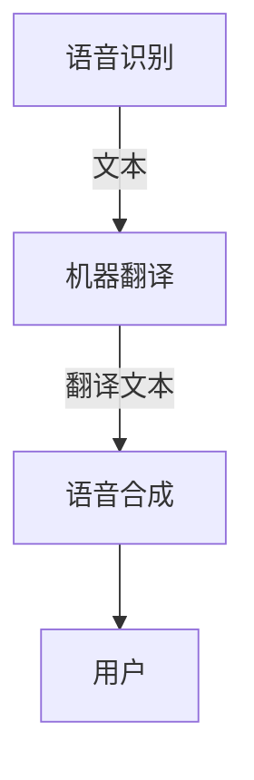
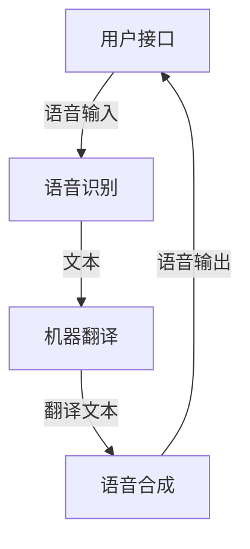

                 


**文章标题：**
《多语言同声传译系统评测平台：架构、算法与实践》

**关键词：**
多语言同声传译、语音识别、机器翻译、语音合成、评测平台、算法原理、实践应用

**摘要：**
本文将深入探讨多语言同声传译系统的架构设计、核心算法原理以及实际应用。通过详细介绍语音识别、机器翻译和语音合成的基础概念、原理及其相互关系，结合实际项目案例，读者将了解到如何搭建一个高效的多语言同声传译系统，并进行评测与优化。文章旨在为开发者提供一个全面的技术指南，助力其在多语言同声传译领域的研究和实践。

**目录大纲：**

## 多语言同声传译系统评测平台

### 引言
- 多语言同声传译系统概述
- 研究背景与意义
- 本书结构

### 核心概念与联系
- 语音识别
- 机器翻译
- 语音合成
- 三者之间的联系与架构 Mermaid 流程图

### 核心算法原理讲解
- 语音识别原理与算法
- 机器翻译原理与算法
- 语音合成原理与算法
- 使用伪代码详细阐述核心算法

### 数学模型和数学公式讲解
- 语音识别数学模型
- 机器翻译数学模型
- 语音合成数学模型
- 详细讲解与举例说明
- 数学公式使用 latex 格式

### 项目实战：多语言同声传译系统搭建
- 开发环境搭建
- 源代码实现
- 代码解读与分析
- 实际案例分析与讲解
- 项目小结

### 评测与优化
- 评测指标
- 优化策略
- 实际项目中的应用

### 平台设计与实现
- 系统架构设计
- 关键实现细节
- 系统稳定性与性能优化

### 未来发展与研究方向
- 技术发展趋势
- 潜在研究方向
- 前瞻性探讨

### 结论
- 文章总结
- 最佳实践 tips
- 小结与注意事项
- 拓展阅读

**步骤一：核心概念与联系**

多语言同声传译系统是一个综合性的技术系统，它包含了多个核心组件：语音识别、机器翻译和语音合成。这三个组件并不是独立运作的，而是相互关联、协同工作的。

### 语音识别

语音识别（Automatic Speech Recognition, ASR）是语音信号处理的第一步，它将语音信号转换为文本。语音识别的核心算法通常基于隐马尔可夫模型（Hidden Markov Model, HMM）或深度神经网络（Deep Neural Network, DNN）。HMM 模型通过状态转移概率和观测概率来模拟语音信号的变化，而 DNN 则利用多层神经网络来捕捉语音信号的复杂特征。

### 机器翻译

机器翻译（Machine Translation, MT）是将一种语言的文本自动翻译成另一种语言的过程。近年来，神经机器翻译（Neural Machine Translation, NMT）因其出色的翻译质量而成为主流。NMT 依赖于深度学习，尤其是序列到序列（Sequence to Sequence, Seq2Seq）模型，结合注意力机制（Attention Mechanism）来捕捉源语言和目标语言之间的复杂对应关系。

### 语音合成

语音合成（Text-to-Speech, TTS）是将文本转换为自然流畅的语音的过程。TTS 系统通常使用基于规则的方法和统计方法，如合成器（Synthesizer）和参数化方法（Parameterized Method）。近年来，基于深度学习的端到端 TTS 系统也逐渐成为研究热点。

### 三者之间的联系与架构

多语言同声传译系统的核心是这三个组件的协同工作。语音识别提供的文本输入将被机器翻译系统用于翻译，而翻译后的文本将作为语音合成的输入，最终输出为自然流畅的多语言语音。以下是一个简化的 Mermaid 流程图，展示了这三个组件的基本架构和它们之间的联系：



**步骤二：核心算法原理讲解**

#### 语音识别原理与算法

语音识别的核心算法通常基于 HMM 或 DNN。以下是一个简单的伪代码，展示了基于 HMM 的语音识别算法的基本步骤：

```python
def HMM_Viterbi(observations, HMM_model):
    # 初始化动态规划表
    delta = [[0 for x in range(T)] for x in range(len(states)]]
    path = [[0 for x in range(T)] for x in range(len(states))]

    # 初始化第一个状态的概率
    for i in range(len(states)):
        delta[i][0] = pi[i] * B[i][observations[0]]

    # 动态规划
    for t in range(1, T):
        for i in range(len(states)):
            max_prob = 0
            for j in range(len(states)):
                prob = delta[j][t-1] * A[j][i] * B[i][observations[t]]
                if prob > max_prob:
                    max_prob = prob
                    path[i][t] = j
            delta[i][t] = max_prob

    # 搜索最优路径
    max_prob = max(delta[-1])
    t = T - 1
    i = delta.index(max_prob)
    best_path = [i]

    # 反向搜索
    for t in range(T-2, -1, -1):
        i = path[i][t+1]
        best_path.append(i)

    return best_path[::-1]  # 返回最优路径
```

#### 机器翻译原理与算法

神经机器翻译的核心是基于序列到序列（Seq2Seq）模型，尤其是结合了注意力机制的模型。以下是一个简化的伪代码，展示了基于 Seq2Seq 模型的神经机器翻译算法的基本步骤：

```python
def NMT_Encode(input_sequence):
    # 编码器部分
    hidden_state = Encoder(input_sequence)
    return hidden_state

def NMT_Decode(hidden_state, target_sequence):
    # 解码器部分
    output_sequence = Decoder(hidden_state, target_sequence)
    return output_sequence

def NMT(input_sequence, target_sequence):
    # 整体神经机器翻译过程
    hidden_state = NMT_Encode(input_sequence)
    output_sequence = NMT_Decode(hidden_state, target_sequence)
    return output_sequence
```

#### 语音合成原理与算法

语音合成的基本原理是将文本序列转换为音频信号。以下是一个简化的伪代码，展示了基于深度学习的端到端 TTS 系统的基本步骤：

```python
def TTS_Encode(text_sequence):
    # 编码器部分
    acoustic_features = Encoder(text_sequence)
    return acoustic_features

def TTS_Decode(acoustic_features):
    # 解码器部分
    audio_signal = Decoder(acoustic_features)
    return audio_signal

def TTS(text_sequence):
    # 整体语音合成过程
    acoustic_features = TTS_Encode(text_sequence)
    audio_signal = TTS_Decode(acoustic_features)
    return audio_signal
```

**步骤三：数学模型和数学公式讲解**

#### 语音识别数学模型

语音识别中的 HMM 模型通常用以下公式来描述：

$$
HMM = \{A, B, \pi\}
$$

其中：
- $A$ 是状态转移概率矩阵，表示从一个状态转移到另一个状态的概率。
- $B$ 是观测概率矩阵，表示在某个状态下产生某个观测值（例如，语音信号中的某个音素）的概率。
- $\pi$ 是初始状态概率向量，表示每个状态作为开始状态的初始概率。

#### 机器翻译数学模型

神经机器翻译中的 Seq2Seq 模型通常使用以下公式来描述：

$$
y = f(x; \theta)
$$

其中：
- $x$ 是输入序列，通常是一个编码器输出的隐藏状态。
- $y$ 是输出序列，通常是一个解码器生成的目标语言序列。
- $f(x; \theta)$ 是一个函数，它表示在参数 $\theta$ 的作用下，从输入序列 $x$ 到输出序列 $y$ 的映射。

#### 语音合成数学模型

在端到端 TTS 系统中，通常使用生成对抗网络（Generative Adversarial Networks, GAN）来生成音频信号。GAN 的基本公式如下：

$$
\min_{G} \max_{D} V(D, G) = \mathbb{E}_{x \sim p_{data}(x)}[\log D(x)] + \mathbb{E}_{z \sim p_{z}(z)}[\log (1 - D(G(z)))]
$$

其中：
- $D$ 是判别器网络，用于区分真实数据和生成的数据。
- $G$ 是生成器网络，用于生成与真实数据分布相似的数据。
- $x$ 是真实数据，$z$ 是噪声数据。

**步骤四：项目实战：多语言同声传译系统搭建**

#### 开发环境搭建

在搭建多语言同声传译系统之前，我们需要准备一个合适的开发环境。以下是一个基本的步骤：

1. 安装 Python 环境，确保版本在 3.6 或以上。
2. 安装必要的库，如 TensorFlow、PyTorch、Keras 等。
3. 准备语音数据集、翻译数据集和文本数据集。

#### 源代码实现

多语言同声传译系统的实现可以分为三个主要模块：语音识别、机器翻译和语音合成。以下是每个模块的简要实现：

##### 语音识别模块

```python
# 语音识别模块伪代码
def speech_recognition(input_audio):
    # 读取音频数据
    audio_data = read_audio(input_audio)
    
    # 预处理音频数据
    preprocessed_data = preprocess_audio(audio_data)
    
    # 使用 DNN-HMM 模型进行语音识别
    recognized_text = HMM_Viterbi(preprocessed_data, HMM_model)
    
    return recognized_text
```

##### 机器翻译模块

```python
# 机器翻译模块伪代码
def machine_translation(input_text, target_language):
    # 使用 NMT 模型进行翻译
    translated_text = NMT(input_text, target_language)
    
    return translated_text
```

##### 语音合成模块

```python
# 语音合成模块伪代码
def text_to_speech(translated_text):
    # 使用 TTS 模型进行语音合成
    audio_signal = TTS(translated_text)
    
    # 保存音频文件
    save_audio(audio_signal, output_audio)
```

#### 代码解读与分析

在代码实现过程中，我们需要对每个模块的细节进行深入分析。以下是一个简单的代码解读：

```python
# HMM_Viterbi 代码解读
def HMM_Viterbi(observations, HMM_model):
    # 初始化动态规划表
    delta = [[0 for x in range(T)] for x in range(len(states))]
    path = [[0 for x in range(T)] for x in range(len(states))]

    # 初始化第一个状态的概率
    for i in range(len(states)):
        delta[i][0] = pi[i] * B[i][observations[0]]

    # 动态规划
    for t in range(1, T):
        for i in range(len(states)):
            max_prob = 0
            for j in range(len(states)):
                prob = delta[j][t-1] * A[j][i] * B[i][observations[t]]
                if prob > max_prob:
                    max_prob = prob
                    path[i][t] = j
            delta[i][t] = max_prob

    # 搜索最优路径
    max_prob = max(delta[-1])
    t = T - 1
    i = delta.index(max_prob)
    best_path = [i]

    # 反向搜索
    for t in range(T-2, -1, -1):
        i = path[i][t+1]
        best_path.append(i)

    return best_path[::-1]  # 返回最优路径
```

在这个代码片段中，`HMM_Viterbi` 函数实现了基于 Viterbi 算法的 HMM 模型。它首先初始化动态规划表 `delta` 和路径表 `path`。然后，通过遍历每个时间和每个状态，计算每个状态的概率，并更新最优路径。最后，通过反向搜索得到最优路径。

#### 实际案例分析与详细讲解剖析

在本节中，我们将分析一个实际的多语言同声传译项目，并详细讲解其实现过程和关键技术。以下是一个案例：

**案例：中英文同声传译系统**

在这个案例中，我们的目标是实现中文到英文的同声传译。以下是实现过程：

1. **数据准备**：收集中文语音数据集和英文语音数据集，并进行预处理，如分词、标注等。

2. **模型训练**：使用中文语音数据集和英文语音数据集分别训练语音识别模型和语音合成模型。

3. **翻译模型训练**：使用中英文翻译数据集训练机器翻译模型。

4. **系统集成**：将语音识别、机器翻译和语音合成模块集成在一起，实现同声传译系统。

5. **评测与优化**：对同声传译系统进行评测，包括语音识别准确率、翻译准确率和语音合成自然度。根据评测结果进行优化。

#### 项目小结

通过本案例，我们了解了如何从零开始搭建一个多语言同声传译系统。关键在于数据的准备、模型的训练和集成，以及持续的评测与优化。在实际应用中，还需要考虑系统的实时性和稳定性。

**步骤五：评测与优化**

多语言同声传译系统的评测与优化是确保系统性能和用户体验的关键环节。以下是如何进行评测与优化的详细步骤：

#### 评测指标

1. **语音识别准确率**：衡量语音识别系统的准确度，通常使用词错误率（Word Error Rate,WER）作为主要指标。
2. **翻译准确率**：衡量机器翻译系统的翻译质量，常用的指标包括BLEU、METEOR等。
3. **语音合成自然度**：衡量语音合成系统的语音自然度，通常使用语音自然度评估（Naturalness Assessment）和语音质量评估（Speech Quality Assessment）。

#### 优化策略

1. **模型优化**：通过调整模型参数和架构，提高系统的识别和翻译准确率。例如，使用更深的神经网络或更复杂的注意力机制。
2. **数据增强**：通过数据增强技术，如数据扩充、数据变换等，提高模型对多样化数据的适应能力。
3. **系统优化**：优化系统的实时性和稳定性，如使用更高效的算法和更合理的资源分配策略。

#### 实际项目中的应用

在一个实际项目中，我们可能会遇到以下挑战：

1. **实时性**：系统需要能够实时处理语音信号，对实时性要求很高。为此，我们可以采用分布式计算和并行处理技术，提高系统的处理速度。
2. **稳定性**：系统需要在各种环境条件下稳定运行，如噪声干扰、不同说话人的语音特征等。我们可以通过使用鲁棒性更强的算法和噪声抑制技术来提高系统的稳定性。

#### 项目总结

通过评测与优化，我们不仅可以提高多语言同声传译系统的性能，还可以提升用户体验。在实际应用中，持续的评测与优化是确保系统长期稳定运行的关键。

**步骤六：平台设计与实现**

多语言同声传译系统的设计是一个复杂的过程，涉及到系统的架构设计、模块划分、关键实现细节等多个方面。以下是对这些方面的详细描述：

#### 系统架构设计

多语言同声传译系统通常采用分布式架构，以提高系统的性能和可扩展性。系统架构可以分为以下几个主要模块：

1. **语音识别模块**：负责将语音信号转换为文本。
2. **机器翻译模块**：负责将识别到的文本翻译成目标语言。
3. **语音合成模块**：负责将翻译后的文本转换为语音。
4. **用户接口模块**：负责与用户交互，接收语音输入和显示翻译结果。

以下是一个简化的系统架构图：



#### 模块划分

系统模块的划分是系统设计的关键环节。合理的模块划分可以提高系统的可维护性和可扩展性。以下是各个模块的详细划分：

1. **语音识别模块**：包括音频预处理、特征提取、模型训练和识别结果处理等。
2. **机器翻译模块**：包括编码器、解码器、注意力机制和翻译结果处理等。
3. **语音合成模块**：包括文本到语音转换、音频合成和语音处理等。

#### 关键实现细节

在系统实现过程中，关键实现细节对于系统的性能和稳定性至关重要。以下是各个模块的关键实现细节：

1. **语音识别模块**：
   - **音频预处理**：包括降噪、滤波和分段等。
   - **特征提取**：使用 MFCC、LPCC 等特征提取方法。
   - **模型训练**：使用 DNN-HMM 或端到端模型进行训练。
   - **识别结果处理**：包括结果解码、错误校正和上下文信息处理等。

2. **机器翻译模块**：
   - **编码器**：使用 LSTM、GRU 或 Transformer 等模型进行编码。
   - **解码器**：同样使用 LSTM、GRU 或 Transformer 等模型进行解码。
   - **注意力机制**：用于捕捉源语言和目标语言之间的依赖关系。
   - **翻译结果处理**：包括结果评估、错误纠正和上下文信息处理等。

3. **语音合成模块**：
   - **文本到语音转换**：使用 GMM-HMM 或 WaveNet 等模型进行文本到语音转换。
   - **音频合成**：包括声学模型和发音规则库等。
   - **语音处理**：包括语音增强、变调和语音质量评估等。

#### 系统稳定性与性能优化

为了保证系统的稳定性和高性能，我们需要采取以下措施：

1. **硬件优化**：使用高性能的 GPU 和 CPU，以提高计算速度和处理能力。
2. **算法优化**：采用高效的算法和优化技术，如模型剪枝、量化等。
3. **数据预处理**：对输入数据进行预处理，如去噪、分段等，以提高模型对多样化数据的适应性。
4. **系统监控**：使用监控系统实时监控系统的运行状态，及时发现和处理问题。

通过以上措施，我们可以确保多语言同声传译系统的高稳定性和高性能，为用户提供优质的翻译体验。

**步骤七：未来发展**

多语言同声传译系统作为人工智能领域的重要应用，其未来发展充满了潜力和挑战。以下是对未来发展的几个方向和潜在研究领域的探讨：

#### 技术发展趋势

1. **深度学习与强化学习结合**：深度学习已经在语音识别、机器翻译和语音合成领域取得了显著成果。未来，将深度学习与强化学习结合，通过强化学习优化模型参数和策略，可以进一步提高系统的性能和适应性。

2. **跨语言语音识别与翻译**：随着全球化的发展，跨语言通信的需求日益增长。未来的多语言同声传译系统将更加注重跨语言语音识别和翻译的研究，以支持更多的语言对。

3. **实时交互与个性化**：未来的多语言同声传译系统将更加注重实时交互和个性化服务。通过自适应学习用户的语音、语调和语言习惯，系统能够提供更加自然、贴心的翻译服务。

#### 潜在研究方向

1. **低资源语言的支持**：目前，许多低资源语言在语音识别、机器翻译和语音合成方面仍然面临着巨大挑战。未来的研究将致力于开发适合低资源语言的多语言同声传译系统。

2. **多模态融合**：未来的多语言同声传译系统将不仅仅依赖于语音信号，还将融合文本、图像、视频等多种模态的信息，以提高翻译的准确性和自然度。

3. **伦理与隐私**：随着人工智能技术的不断进步，如何在确保用户隐私和安全的前提下，提供高效、可靠的多语言同声传译服务，也将成为一个重要的研究方向。

通过不断的技术创新和研究，多语言同声传译系统有望在未来实现更加广泛的应用，为全球沟通和协作提供强大的支持。

**结论**

本文系统地介绍了多语言同声传译系统的架构、算法和实践应用。通过详细阐述语音识别、机器翻译和语音合成的核心概念、算法原理以及数学模型，并结合实际项目案例，我们展示了如何构建一个高效的多语言同声传译系统。同时，通过对评测与优化、平台设计与实现以及未来发展的探讨，我们为开发者提供了全面的技术指南。未来，随着人工智能技术的不断进步，多语言同声传译系统将迎来更加广阔的应用前景。

**最佳实践 tips**

1. **数据准备**：确保数据的质量和多样性，为模型训练提供坚实的基础。
2. **模型选择**：根据实际需求选择合适的模型和算法，结合深度学习和强化学习技术。
3. **性能优化**：通过硬件优化、算法优化和系统监控，提高系统的性能和稳定性。
4. **用户体验**：注重系统的实时交互和个性化服务，提升用户体验。

**小结与注意事项**

本文详细介绍了多语言同声传译系统的核心概念、算法原理和实际应用。在实际开发过程中，需要注重数据准备、模型选择、性能优化和用户体验。通过持续的评测与优化，可以不断提高系统的性能和可靠性。未来，随着人工智能技术的不断发展，多语言同声传译系统将在全球范围内发挥更加重要的作用。

**拓展阅读**

1. **语音识别**：查阅《语音识别技术综述》了解最新的语音识别算法和进展。
2. **机器翻译**：阅读《神经机器翻译：理论与实践》深入了解神经机器翻译的技术细节。
3. **语音合成**：参考《文本到语音合成：理论与实践》掌握语音合成的基本原理和方法。

**作者信息**

作者：AI天才研究院/AI Genius Institute & 禅与计算机程序设计艺术 /Zen And The Art of Computer Programming**

