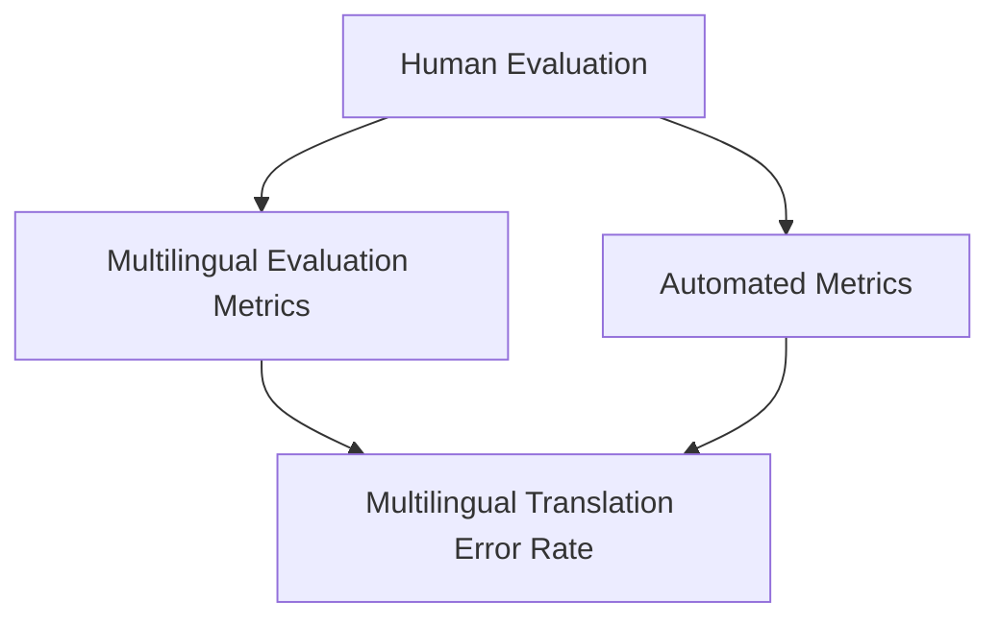

                 


## Article Title: Multilingual Translation Ability Assessment: Cross-Linguistic Quality Evaluation Supported by Large Language Models

### Keywords:
- Multilingual translation
- Translation quality assessment
- Large Language Models (LLMs)
- Cross-linguistic evaluation metrics
- Neural machine translation

### Abstract:
This article delves into the realm of multilingual translation and quality assessment, focusing on the application of Large Language Models (LLMs) in cross-linguistic quality evaluation. We will explore the evolution of translation and quality assessment methods, the theoretical foundations of LLMs, and practical application scenarios. Through a step-by-step analysis, we aim to provide a comprehensive understanding of how LLMs can enhance the accuracy and reliability of translation quality assessment in a multilingual context.

## Introduction to Multilingual Translation and Quality Assessment

### The Evolution of Translation and Quality Assessment

#### Definition of Multilingual Translation
Multilingual translation refers to the process of translating text from one language to another, involving multiple languages. This process is crucial for breaking down language barriers, facilitating global communication, and promoting cultural exchange. The need for multilingual translation has grown significantly with the increasing globalization of economies and cultures.

#### Traditional Translation Methods and Challenges
Historically, translation has been a manual process involving human translators. However, this approach has several limitations:
1. **Time and Cost**: Human translation is time-consuming and expensive, making it impractical for large volumes of text.
2. **Consistency**: Human translators may have varying levels of expertise and familiarity with specific domains, leading to inconsistencies in translations.
3. **Contextual Understanding**: Translators need to understand the cultural, social, and contextual nuances of both the source and target languages, which can be challenging.

#### Introduction to Large Language Models (LLMs)
The advent of Large Language Models (LLMs) has revolutionized the field of natural language processing (NLP) and translation. LLMs are neural networks trained on vast amounts of text data to predict the probability of a sequence of words given previous words. Examples of popular LLMs include GPT-3, BERT, and T5.

#### The Importance of Cross-Linguistic Quality Assessment
Quality assessment is essential for ensuring the accuracy and reliability of translations. Cross-linguistic quality assessment involves evaluating translations across different languages, taking into account linguistic, cultural, and contextual factors. This process helps identify errors, inconsistencies, and nuances that may not be captured by automated metrics alone.

## Basic Concepts and Frameworks

### Overview of Translation Quality Metrics
Translation quality metrics are used to evaluate the quality of translations. Common metrics include:
1. **BLEU (Bilingual Evaluation Understudy)**: A metric that compares the translation to a set of reference translations using n-gram similarity.
2. **NIST (National Institute of Standards and Technology)**: A metric that calculates the percentage of correctly translated words and phrases.
3. **METEOR (Metric for Evaluation of Translation with Explicit ORdering)**: A metric that combines n-gram, syntactic, and lexical similarity measures.

### Multilingual Evaluation Metrics
Multilingual evaluation metrics extend the traditional metrics to account for the complexities of translating between multiple languages. Examples include:
1. **MTER (Multilingual Translation Error Rate)**: A metric that calculates the error rate in translations across multiple languages.
2. **MQM (Multilingual Quality Metrics)**: A set of metrics designed to evaluate the quality of translations in a multilingual context.

### Frameworks for Multilingual Translation Quality Assessment
Several frameworks have been developed for assessing translation quality in a multilingual context. These frameworks typically include:
1. **Human Evaluation**: Involves evaluating translations manually by human judges.
2. **Automated Metrics**: Use algorithms to evaluate translations automatically, often in conjunction with human evaluation.
3. **Hybrid Approaches**: Combine human and automated evaluation methods to achieve more accurate and reliable results.

### Role of LLMs in Translation Quality Assessment
LLMs have the potential to enhance translation quality assessment by providing more accurate and nuanced evaluations. They can process large volumes of text, identify linguistic patterns, and understand contextual nuances. LLMs can be used to:
1. **Enhance Automated Metrics**: Improve the accuracy of existing automated metrics by incorporating LLM-based algorithms.
2. **Support Human Evaluation**: Assist human evaluators by providing insights and suggestions.
3. **Develop New Metrics**: Create new metrics based on LLMs' capabilities to capture the complexities of multilingual translation.

## Conclusion
In conclusion, the field of multilingual translation and quality assessment is rapidly evolving, with LLMs playing a pivotal role. As LLMs continue to improve, they will enhance the accuracy, consistency, and reliability of translation quality assessment, making it more accessible and efficient for global communication.

### References
1. Papineni, K., Roukos, S., Ward, T., & Zhang, A. (2002). BLEU: A Protocol for Automatic Evaluation of Machine Translation. In Proceedings of the 40th Annual Meeting on Association for Computational Linguistics (ACL'02), 311-318.
2. NIST. (2009). Machine Translation Evaluation Guide. National Institute of Standards and Technology.
3. Metaphor. (2000). A Corpus-Based Study of Translation Evaluation. PhD dissertation, Stockholm University.

### Appendix
- **Mermaid Flowchart for Multilingual Translation Quality Assessment Framework**


### Code Example for BLEU Score Calculation
```python
from nltk.translate.bleu_score import sentence_bleu
from nltk.translate.bleu_score import SmoothingFunction

def bleu_score(reference, translation):
    smooth = SmoothingFunction().smoothe zero
    return sentence_bleu([reference.split()], translation.split(), smooth=smooth)

reference = "The cat sat on the mat."
translation = "Das Katze saß auf dem Teppich."

bleu = bleu_score(reference, translation)
print(f"BLEU score: {bleu}")
```

### Best Practices and Tips
- **Data Preparation**: Ensure that the translation data is of high quality and diverse to train accurate LLMs.
- **Regular Updates**: Keep the LLMs and evaluation metrics up-to-date to capture the latest language trends and nuances.
- **Human Involvement**: Involve human evaluators to verify the results of automated metrics and ensure the accuracy of the assessment.

### Conclusion
This article has provided an overview of multilingual translation and quality assessment, highlighting the role of LLMs in improving the accuracy and reliability of translation evaluations. As LLMs continue to advance, they will play an increasingly important role in facilitating global communication and promoting cross-cultural understanding.

