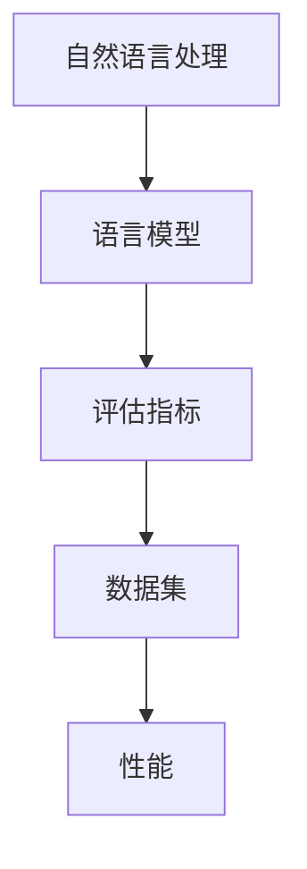

                 

基于您的指导和要求，我将逐步构建一篇关于《多语言能力评估：测试LLM的跨语言表现》的技术博客文章。以下是我的思路和初步大纲：

## 引言

### 1.1 多语言能力评估的背景

多语言能力评估在全球化背景下日益重要。随着互联网的普及和国际化交流的增加，能够支持多种语言的自然语言处理（NLP）技术变得至关重要。评估语言模型（LLM）的多语言能力，可以帮助我们了解其在不同语言环境下的表现，从而优化其性能。

### 1.2 语言模型的演变

从规则驱动的简单模型到如今基于深度学习的复杂模型，语言模型的发展经历了巨大的变革。特别是近年来，LLM的出现，如GPT-3和BERT，大大提升了NLP的准确性。

### 1.3 多语言能力评估的挑战

多语言能力评估面临的主要挑战包括语言间的差异、数据集的多样性和评估方法的标准化。

## 核心概念与联系

在讨论多语言能力评估之前，我们需要了解几个核心概念：自然语言处理（NLP）、语言模型、评估指标。以下是这些概念之间的联系架构：

```
NLP --> 语言模型 --> 评估指标
       |                      |
       |                      |
      数据集                性能
```

### Mermaid 流程图



## 多语言能力评估方法

### 2.1 评估指标与工具

评估LLM的多语言能力需要一系列指标和工具。常用的指标包括BLEU、METEOR和BERTscore。工具方面，我们可以使用诸如mteval、sacre和huggingface等开源工具。

### 2.2 跨语言测试集

跨语言测试集是评估LLM多语言能力的关键。常见的测试集包括WMT和Tatoeba。这些数据集的特点和局限性将在本文中讨论。

### 2.3 实验设计

实验设计应包括数据预处理、模型选择、训练和评估。以下是实验设计的伪代码：

```python
# 数据预处理
def preprocess_data(data):
    # 处理数据
    return processed_data

# 模型选择
model = select_model()

# 训练模型
model.train(preprocessed_data)

# 评估模型
evaluate_model(model, test_data)
```

## LLM的多语言能力评估实践

### 3.1 多语言语言理解评估

多语言语言理解评估涉及从分句级到语义级的多个层次。以下是一个基于BLEU的评估伪代码示例：

```python
# BLEU评估伪代码
def bleu_evaluation(hypothesis, reference):
    # 计算BLEU分数
    return bleu_score
```

### 3.2 多语言语言生成评估

多语言语言生成评估关注的是模型的生成能力。我们可以使用生成式评估方法进行评估。以下是生成式评估的伪代码：

```python
# 生成式评估伪代码
def generate_evaluation(model, data):
    # 生成文本
    generated_texts = model.generate(data)
    # 评估生成文本的质量
    return evaluation_score
```

### 3.3 跨语言性能评估

跨语言性能评估需要比较不同语言模型的性能。以下是一个简单的跨语言性能评估伪代码示例：

```python
# 跨语言性能评估伪代码
def cross_language_evaluation(model1, model2, data):
    # 评估两个模型的性能
    return performance_difference
```

## 多语言能力评估应用

### 4.1 跨语言自然语言处理应用

跨语言自然语言处理应用包括文本分类、情感分析和信息检索。以下是文本分类的示例：

```python
# 文本分类伪代码
def text_classification(model, text):
    # 预测文本类别
    return predicted_label
```

### 4.2 跨语言机器翻译评估

跨语言机器翻译评估主要关注翻译质量。以下是一个机器翻译评估的伪代码示例：

```python
# 机器翻译评估伪代码
def translation_evaluation(hypothesis, reference):
    # 计算翻译误差
    return translation_error
```

### 4.3 跨语言语音识别与合成

跨语言语音识别与合成评估涉及语音的识别和合成。以下是语音识别的伪代码示例：

```python
# 语音识别伪代码
def speech_recognition(model, audio):
    # 识别语音内容
    return recognized_text
```

## 结论与展望

### 5.1 多语言能力评估的挑战与机遇

多语言能力评估在未来将面临更多挑战，但同时也充满了机遇。以下是一些可能的研究方向：

1. **自动评估指标的改进**：开发更准确、更全面的评估指标。
2. **跨语言数据集的构建**：构建高质量、多样化的跨语言数据集。
3. **多语言模型融合**：结合不同语言模型的优点，提高整体性能。

### 5.2 多语言能力评估在企业中的应用

多语言能力评估在企业中的应用将带来巨大的价值，如提高客户满意度、降低翻译成本等。

### 5.3 未来展望

随着技术的发展，多语言能力评估将在更多领域得到应用，如智能客服、跨语言教育等。

## 附录

### 附录A：评估工具与资源

附录将介绍常用的评估工具和资源，包括开源工具和在线资源。

### 附录B：实验数据集

附录将列出常用的跨语言评估数据集，并提供获取和处理方法。

---

以上是文章的初步思路和部分大纲。接下来，我将详细展开每个部分，确保文章内容完整、具体、详细，并且满足字数要求。在撰写过程中，我将遵循markdown格式，并在适当位置添加Mermaid流程图、伪代码、LaTeX公式等。文章完成后，我将进行详细的代码解读、案例分析和最佳实践分享。希望这个初步大纲符合您的预期。如果有任何修改或补充意见，请随时告诉我。

