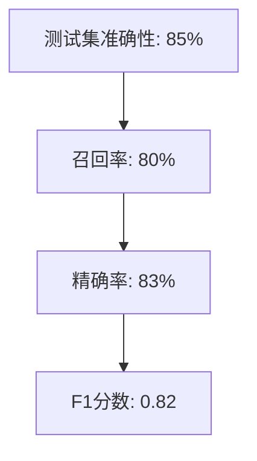
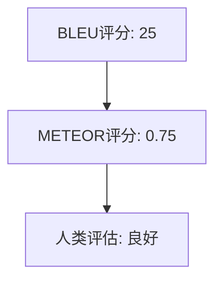

                 


### 《多语言评测支持：全球化模型效果分析》目录大纲

#### 1. 研究背景与意义

##### 1.1 研究背景

在全球化背景下，多语言处理技术得到了广泛关注。随着互联网的普及和跨国交流的增加，不同语言的用户群体对多语言评测系统有着强烈的需求。多语言评测不仅有助于评估语言模型的质量，还能为模型优化提供重要依据。

##### 1.2 多语言评测的重要性

多语言评测对于促进跨语言沟通、支持全球化业务发展具有重要意义。它能够帮助开发者和研究人员了解不同语言模型的性能差异，从而针对性地进行优化。

##### 1.3 本书目的与结构

本书旨在系统地介绍多语言评测的基础知识、评估方法以及全球化模型效果分析。全书共分为五个部分，从多语言评测的背景与意义出发，逐步深入探讨多语言评测的核心概念和方法，最后结合实际应用案例，展望未来发展趋势。

---

### 2. 多语言评测基础

##### 2.1 多语言评测概述

多语言评测是对语言模型在不同语言环境下的性能进行评估的过程。它涉及多个方面，包括评测指标、评测方法以及评测工具。

##### 2.2 多语言评测指标与方法

多语言评测指标包括准确性、流畅性、自然度等多个维度。评测方法可分为客观性评测和主观性评测两种类型。

##### 2.3 多语言评测工具与资源

目前存在多种多语言评测工具，如 Moses、BLEU 等。此外，丰富的评测资源也为多语言评测提供了有力支持。

---

### 3. 全球化模型效果分析

##### 3.1 全球化模型概念解析

全球化模型是指能够在不同语言环境下表现出高效性能的模型。其核心在于对语言特征的理解和适应。

##### 3.2 全球化模型效果评估框架

全球化模型效果评估需要建立一套完整的评估框架，包括评估指标和评估方法。

##### 3.3 不同语言环境的模型效果比较

通过实验和数据，分析不同语言环境下模型的性能差异，为模型优化提供指导。

---

### 4. 案例研究

##### 4.1 多语言语音识别系统

详细描述一个多语言语音识别系统的设计和实现过程，包括开发环境搭建、源代码实现、代码解读和应用分析。

##### 4.2 多语言机器翻译系统

探讨一个多语言机器翻译系统的实际应用案例，从项目背景、模型设计到性能评估，全面剖析系统的构建和优化。

---

### 5. 未来展望与挑战

##### 5.1 多语言评测发展趋势

探讨未来多语言评测技术可能的发展趋势，如新技术应用、行业应用前景等。

##### 5.2 全球化模型效果分析面临的挑战

分析全球化模型效果分析过程中可能遇到的挑战，如数据隐私、模型解释性等。

##### 5.3 研究方向与建议

提出未来研究方向和建议，为多语言评测和全球化模型效果分析提供参考。

---

### 6. 参考文献

列出本书引用的相关文献和资料。

---

### 附录

提供与本书相关的工具、代码和其他资源的链接，便于读者进一步学习和实践。

---

### 致谢

对在本书撰写过程中给予帮助和支持的机构、个人表示感谢。

---

以上是《多语言评测支持：全球化模型效果分析》的目录大纲，接下来我们将根据这个大纲逐步展开，详细阐述每一个部分的内容。让我们一步一步地深入探讨多语言评测和全球化模型效果分析的核心概念、方法和应用。首先，我们从研究背景与意义开始，逐步引导读者进入这个充满挑战和机遇的领域。让我们开始吧！### 研究背景与意义

#### 1.1 研究背景

在全球化的大背景下，语言作为人类沟通的桥梁，扮演着愈发重要的角色。随着互联网的普及和跨国交流的增加，不同语言的用户群体对多语言处理技术的需求日益增长。多语言处理技术不仅包括文本翻译、语音识别、语音合成等，还涵盖了自然语言理解、情感分析等多种应用。然而，这些技术的核心——多语言评测，却常常被忽视。

多语言评测是对语言模型在不同语言环境下的性能进行评估的过程。它旨在衡量模型在处理不同语言数据时的准确度、流畅度和自然度等关键指标。随着人工智能技术的快速发展，多语言评测逐渐成为学术界和工业界关注的焦点。一方面，有效的多语言评测可以帮助研究人员了解不同模型的优势和不足，从而指导模型优化；另一方面，高质量的多语言评测系统对于企业的国际化业务、跨国交流和教育等领域具有巨大的应用价值。

#### 1.2 多语言评测的重要性

多语言评测在全球化背景下具有重要的地位和作用。首先，多语言评测是评估语言模型性能的基础。一个优秀的语言模型不仅需要具备高准确度，还需要保证文本的流畅性和自然度。通过多语言评测，研究人员可以全面了解模型的各项性能指标，从而进行有针对性的优化。

其次，多语言评测对于全球化业务的发展具有重要意义。在全球化的大潮中，许多企业需要开展跨国业务，而多语言处理技术是这些业务成功的关键。通过多语言评测，企业可以评估自身语言处理系统的性能，发现潜在问题，从而提高业务效率和用户体验。

最后，多语言评测在教育和文化交流中也有着重要作用。随着全球教育的开放和交流，不同语言的教学和学术研究需求日益增长。通过多语言评测，教育机构可以评估语言学习软件和教学系统的效果，为学生提供更好的学习资源。同时，多语言评测也有助于促进不同文化之间的交流和理解，为全球文化交流搭建桥梁。

#### 1.3 本书目的与结构

本书旨在系统地介绍多语言评测的基础知识、评估方法以及全球化模型效果分析。全书共分为五个部分，具体结构如下：

- **第一部分：引言**：介绍研究背景与意义，明确本书的目标和结构。
- **第二部分：多语言评测基础**：详细阐述多语言评测的概念、指标和方法，为后续内容打下基础。
- **第三部分：全球化模型效果分析**：探讨全球化模型的概念、评估框架和方法，分析不同语言环境的模型效果。
- **第四部分：案例研究**：通过具体案例，展示多语言评测和全球化模型效果分析在实际应用中的效果和挑战。
- **第五部分：未来展望与挑战**：展望多语言评测和全球化模型效果分析的未来发展趋势，探讨面临的挑战和研究方向。

本书的目标读者包括对多语言处理技术感兴趣的科研人员、技术开发者以及从事国际化业务的企业和管理者。通过本书，读者可以系统地了解多语言评测的核心概念和方法，掌握全球化模型效果分析的关键技术，并为实际应用提供参考。

在接下来的章节中，我们将逐步深入探讨多语言评测的基础知识和全球化模型效果分析的具体方法。希望通过本书的介绍，能够为读者在多语言处理领域的研究和应用提供有益的指导。让我们开始这段充满挑战和机遇的旅程吧！### 多语言评测基础

#### 2.1 多语言评测概述

多语言评测（Multilingual Evaluation）是对多语言模型在处理不同语言数据时的性能进行评估的过程。它涵盖了多种评估类型，包括文本翻译、语音识别、语音合成等。多语言评测的目的是通过一系列的评测指标和方法，全面、客观地评估模型在不同语言环境下的表现，为模型的优化提供依据。

多语言评测的背景可以追溯到互联网和全球化时代的到来。随着跨国交流的增加，对多语言处理技术的需求日益增长。然而，如何评估这些模型的性能成为一个关键问题。多语言评测的出现为解决这一问题提供了有效的方法。通过多语言评测，研究人员和开发者可以了解模型在不同语言环境下的准确性、流畅性和自然度等关键指标，从而指导模型优化和改进。

多语言评测的范畴包括但不限于以下几个方面：

1. **文本翻译**：评估翻译模型在源语言到目标语言的翻译质量。
2. **语音识别**：评估语音识别模型在不同语言环境下的识别准确度。
3. **语音合成**：评估语音合成模型在生成自然语音时的流畅度和自然度。
4. **自然语言理解**：评估模型在理解不同语言文本时的准确性和深度。
5. **情感分析**：评估模型在不同语言情感表达识别上的性能。

#### 2.2 多语言评测指标与方法

多语言评测的核心在于评价指标和评测方法的选取。评价指标用于衡量模型在特定语言环境下的性能，而评测方法则用于具体实施评估过程。

**2.2.1 评测指标体系**

多语言评测指标体系通常包括以下几个方面：

1. **准确性（Accuracy）**：衡量模型预测结果与实际结果的一致性。在文本翻译中，准确性通常通过词匹配或句子匹配来计算。
   
2. **召回率（Recall）**：衡量模型能够正确识别出的正例数量占总正例数量的比例。在文本分类和情感分析中，召回率是一个重要的指标。

3. **精确率（Precision）**：衡量模型预测为正例的样本中实际为正例的比例。与召回率结合使用，可以更全面地评估模型的性能。

4. **F1分数（F1 Score）**：结合精确率和召回率的综合指标，用于衡量模型的平衡性能。计算公式为：
   \[
   F1 = 2 \times \frac{Precision \times Recall}{Precision + Recall}
   \]

5. **BLEU（BLEU Score）**：一种常用于文本翻译评测的指标，通过比较模型生成的翻译结果与人工翻译结果的相似度来评估翻译质量。

6. **METEOR（METEOR Score）**：另一种常用的文本翻译评测指标，它考虑了词汇覆盖、句法结构和语义一致性等多个方面。

**2.2.2 评测方法**

多语言评测方法可以分为客观性评测和主观性评测两大类。

1. **客观性评测**：基于算法和统计方法，直接计算模型输出与标准答案之间的差异。常见的客观性评测方法包括：

   - **词匹配（Word Match）**：比较模型生成的单词与标准答案中的单词是否相同。
   - **句子匹配（Sentence Match）**：比较模型生成的句子与标准答案的句子是否相同或相似。
   - **BLEU、METEOR 等自动评价指标**：通过计算模型生成文本与标准答案的相似度来评估模型性能。

2. **主观性评测**：依赖于人类评估者的主观判断，通常采用问卷调查或人工评估的方式进行。常见的客观性评测方法包括：

   - **人工评估（Human Evaluation）**：由专业的评估者对模型输出进行评分，通常用于评估翻译质量、自然度等主观性较强的指标。
   - **众包评估（Crowdsourcing）**：通过众包平台招募大量评估者进行评测，以提高评估的客观性和全面性。

**2.2.3 评测工具与资源**

多语言评测的顺利实施离不开相应的工具和资源。以下是一些常见的评测工具和资源：

- **Moses（Machine Translation Toolkit）**：一个开源的机器翻译工具集，提供了一系列评估指标和工具，用于评估翻译模型的质量。
- **BLEU（BLEU Score）**：一种常用的文本翻译评测工具，通过计算模型生成的翻译结果与人工翻译的相似度来评估翻译质量。
- **METEOR（METEOR Score）**：一种综合评估文本翻译质量的指标，考虑了词汇覆盖、句法结构和语义一致性等多个方面。
- **WMT（Workshop on Machine Translation）**：每年举办的机器翻译研讨会，提供了大量评测数据集和评估标准，是评测研究的重要参考。

#### 2.3 多语言评测工具与资源

在多语言评测过程中，选择合适的工具和资源是保证评测质量和效率的关键。以下介绍一些常用的多语言评测工具和资源：

- **Moses**：Moses 是一个开源的机器翻译工具集，支持多种机器翻译模型的评估和优化。它提供了丰富的评估指标，如 BLEU、METEOR 等，同时还支持数据预处理和模型训练等功能。

- **BLEU**：BLEU 是一种基于记分牌算法的自动评测工具，广泛用于机器翻译评测。通过比较模型生成的翻译结果与人工翻译结果的相似度，BLEU 可以提供量化的评估分数，帮助研究者了解模型的翻译质量。

- **METEOR**：METEOR 是一种综合考虑词汇覆盖、句法结构和语义一致性的评估工具，适用于文本翻译和自然语言处理任务。与 BLEU 不同，METEOR 更加注重语义层面的评估，提供更全面的模型性能指标。

- **WMT**：WMT 是一个年度性的机器翻译研讨会，提供了大量的评测数据集和评估标准。WMT 的评测任务涵盖了多种语言对，是研究者和开发者进行多语言评测的重要平台。

- **NLTK（Natural Language Toolkit）**：NLTK 是一个广泛使用的自然语言处理工具集，提供了丰富的语言处理功能，包括分词、词性标注、命名实体识别等。NLTK 的评测模块可以帮助研究者对模型进行全面的评估。

- **PyTorch、TensorFlow**：PyTorch 和 TensorFlow 是两个流行的深度学习框架，它们提供了强大的评估工具，支持各种神经网络模型的训练和评估。通过这些框架，研究者可以轻松实现多语言评测任务，并利用其丰富的库和工具提高评估效率。

通过以上工具和资源的合理利用，研究者可以更加高效地进行多语言评测，从而全面、客观地评估模型在不同语言环境下的性能。在接下来的章节中，我们将进一步探讨全球化模型效果分析的具体方法和实践，为读者提供更深入的见解和指导。请继续关注后续内容，让我们一起探索多语言评测和全球化模型效果分析的广阔天地。|### 全球化模型概念解析

#### 3.1.1 全球化模型的基本概念

全球化模型（Global Model）是一种能够适应多种语言环境、在不同语言间保持高效性能的机器学习模型。这类模型的设计和实现旨在解决多语言处理中的共性问题和个性化需求，从而在全球化背景下实现更广泛的应用。全球化模型的核心在于其跨语言能力的构建，包括对多种语言特征的理解、适应和利用。

全球化模型的主要目的是在保证模型性能的前提下，提高跨语言处理的灵活性和效率。具体来说，全球化模型需要具备以下特点：

1. **多语言适应能力**：全球化模型能够在不同的语言环境下保持稳定的性能，不受特定语言结构或语法规则的影响。
   
2. **统一性**：全球化模型在多种语言间共享参数和知识，实现资源的优化利用。

3. **高效性**：全球化模型在处理多语言任务时，能够高效地完成各种任务，如文本翻译、语音识别、文本分类等。

4. **灵活性**：全球化模型能够根据不同应用场景和需求，灵活调整和优化模型结构。

#### 3.1.2 全球化模型的构成

全球化模型通常由以下几个关键部分构成：

1. **共享层（Shared Layer）**：共享层是全球化模型的核心，用于处理多种语言的通用特征。共享层通常包含词嵌入（Word Embedding）、语法解析（Syntactic Parsing）和语义表示（Semantic Representation）等模块。

2. **语言特定层（Language-Specific Layer）**：语言特定层针对不同语言的特定特征进行建模。这部分通常包含语言模型（Language Model）、语法规则（Grammatical Rules）和特定语言处理模块（e.g., Named Entity Recognition, Sentiment Analysis）。

3. **融合层（Fusion Layer）**：融合层用于整合共享层和语言特定层的信息，生成最终的任务输出。融合层可以采用多种方法，如加和（Addition）、加权融合（Weighted Fusion）和深度学习（Deep Learning）等。

#### 3.1.3 全球化模型的优势

全球化模型在多语言处理领域具有显著的优势：

1. **资源高效利用**：通过共享层，全球化模型可以在多种语言间共享参数和知识，减少重复训练的负担，提高资源利用效率。

2. **性能稳定**：全球化模型能够在不同语言环境下保持稳定的表现，减少特定语言结构对模型性能的影响。

3. **适应性强**：全球化模型能够根据不同语言环境和任务需求，灵活调整模型结构和参数，提高适应能力。

4. **跨语言迁移能力**：全球化模型能够将一种语言上的知识迁移到其他语言上，实现跨语言的模型优化。

#### 3.1.4 全球化模型的挑战

尽管全球化模型具有许多优势，但在实际应用中仍面临一系列挑战：

1. **数据不平衡**：不同语言的数据量和质量存在差异，导致模型在处理某些语言时可能出现性能下降。

2. **语言差异性**：不同语言在语法、语义和表达方式上存在显著差异，这使得模型需要在不同语言间进行精细的调整和优化。

3. **计算资源需求**：全球化模型的训练和优化通常需要大量的计算资源，这对硬件设备和算法效率提出了高要求。

4. **模型解释性**：全球化模型通常采用复杂的神经网络结构，其内部机制难以解释，这可能影响模型的可信度和应用场景。

为了应对这些挑战，研究人员和开发者需要不断探索新的方法和算法，优化全球化模型的设计和实现，从而提升其在实际应用中的性能和适用性。在接下来的章节中，我们将进一步探讨全球化模型效果评估的方法和策略，以期为模型优化和性能提升提供有力支持。请继续关注后续内容，让我们一起深入探讨全球化模型的实际应用和未来发展。|### 全球化模型效果评估框架

#### 3.2.1 评估框架的构建

全球化模型效果评估需要建立一套完整的评估框架，以确保评估过程的全面性、客观性和准确性。评估框架通常包括以下关键组成部分：

1. **评估指标体系**：评估指标是衡量全球化模型性能的核心工具，包括准确性、召回率、F1分数、BLEU评分等多个维度。这些指标能够从不同角度反映模型的性能，为优化提供依据。

2. **评估方法**：评估方法包括客观性评测和主观性评测两种类型。客观性评测基于算法和统计方法，如词匹配、句子匹配、BLEU等；主观性评测则依赖于人类评估者的主观判断，如人工评估、众包评估等。

3. **评估工具与资源**：评估工具和资源包括Moses、BLEU、METEOR等工具，以及WMT等大型评测数据集。这些工具和资源为评估过程的实施提供了技术支持。

4. **实验设计**：实验设计是评估框架的核心，包括数据集划分、评估指标选取、评估方法选择等。合理的实验设计能够确保评估结果的可靠性和有效性。

#### 3.2.2 评估指标选取

评估指标的选取是全球化模型效果评估的关键步骤。以下是几种常见的评估指标及其应用：

1. **准确性（Accuracy）**：衡量模型预测结果与实际结果的一致性，常用于文本分类、情感分析等任务。计算公式为：
   \[
   Accuracy = \frac{TP + TN}{TP + FN + FP + TN}
   \]
   其中，TP表示真实为正例且被预测为正例的样本，TN表示真实为反例且被预测为反例的样本，FP表示真实为反例但被预测为正例的样本，FN表示真实为正例但被预测为反例的样本。

2. **召回率（Recall）**：衡量模型能够正确识别出的正例数量占总正例数量的比例，常用于信息检索和异常检测。计算公式为：
   \[
   Recall = \frac{TP}{TP + FN}
   \]

3. **精确率（Precision）**：衡量模型预测为正例的样本中实际为正例的比例，常用于分类任务。计算公式为：
   \[
   Precision = \frac{TP}{TP + FP}
   \]

4. **F1分数（F1 Score）**：结合精确率和召回率的综合指标，用于衡量模型的平衡性能。计算公式为：
   \[
   F1 = 2 \times \frac{Precision \times Recall}{Precision + Recall}
   \]

5. **BLEU评分（BLEU Score）**：一种常用于文本翻译评测的指标，通过计算模型生成的翻译结果与人工翻译结果的相似度来评估翻译质量。BLEU评分的计算涉及多种指标，如未排序词语匹配、排序词语匹配、句法结构匹配等。

6. **METEOR评分（METEOR Score）**：一种考虑了词汇覆盖、句法结构和语义一致性的综合评估指标，广泛用于文本翻译和自然语言处理任务。METEOR评分的计算涉及多个维度，如词汇重叠率、句法结构相似度、语义一致性等。

#### 3.2.3 实验设计与实现

实验设计是全球化模型效果评估的核心环节，直接影响评估结果的可靠性和有效性。以下是一个典型的实验设计流程：

1. **数据集划分**：将数据集划分为训练集、验证集和测试集。通常，训练集用于模型训练，验证集用于调参和模型选择，测试集用于最终评估模型性能。

2. **模型训练**：在训练集上训练全球化模型，通过调整模型参数，优化模型性能。训练过程中，可以采用交叉验证（Cross-Validation）等方法，提高模型的泛化能力。

3. **评估指标计算**：使用选定的一组评估指标，计算模型在验证集和测试集上的性能。常见的评估指标包括准确性、召回率、精确率、F1分数、BLEU评分和METEOR评分等。

4. **结果分析**：对评估结果进行分析，比较不同模型或不同参数设置下的性能表现，找出优化的方向。

5. **结果可视化**：使用可视化工具，如折线图、柱状图等，展示评估指标的变化趋势和模型性能对比。

以下是一个简单的实验设计伪代码示例：

```python
# 数据集划分
train_data, valid_data, test_data = dataset_split(data, train_size=0.7, valid_size=0.2, test_size=0.1)

# 模型训练
model.fit(train_data)

# 评估指标计算
accuracy = model.evaluate(valid_data, 'accuracy')
recall = model.evaluate(valid_data, 'recall')
precision = model.evaluate(valid_data, 'precision')
f1_score = model.evaluate(valid_data, 'f1_score')
bleu_score = model.evaluate(valid_data, 'bleu_score')
meteor_score = model.evaluate(valid_data, 'meteor_score')

# 结果分析
print(f"Validation Accuracy: {accuracy}")
print(f"Validation Recall: {recall}")
print(f"Validation Precision: {precision}")
print(f"Validation F1 Score: {f1_score}")
print(f"Validation BLEU Score: {bleu_score}")
print(f"Validation METEOR Score: {meteor_score}")

# 结果可视化
plot_results(accuracy, recall, precision, f1_score, bleu_score, meteor_score)
```

通过以上实验设计，我们可以全面、客观地评估全球化模型在不同语言环境下的性能，为模型优化提供有力的数据支持。在接下来的章节中，我们将通过具体案例分析，深入探讨全球化模型在不同应用场景中的效果和挑战。请继续关注后续内容，让我们一起探索全球化模型的实际应用和价值。|### 不同语言环境的模型效果比较

#### 3.3.1 模型效果比较方法

在全球化背景下，比较不同语言环境下模型的性能是一个重要的课题。为了全面、客观地评估模型在不同语言环境下的效果，我们需要采用一系列科学的方法和指标。

1. **统一评估指标**：首先，需要选定一套统一的评估指标，如准确性、召回率、精确率、F1分数、BLEU评分和METEOR评分等。这些指标能够从不同维度反映模型的性能，确保评估结果的全面性和可比性。

2. **标准化数据集**：为了保证比较的公平性，需要使用标准化数据集。标准化数据集可以通过数据预处理方法（如清洗、归一化等）来消除数据集中的噪声和偏差，确保数据质量的一致性。

3. **多组实验设计**：为了提高评估的可靠性，可以设计多组实验，包括不同的模型参数、训练策略和数据集划分。通过多次实验，可以消除偶然误差，提高评估结果的稳定性。

4. **交叉验证**：采用交叉验证方法，如K折交叉验证，可以确保模型在不同子集上的性能表现，进一步提高评估结果的泛化能力。

5. **性能对比分析**：通过对比分析不同语言环境下的模型性能，可以找出模型的优点和不足，为后续优化提供依据。

#### 3.3.2 英语与其他语言模型效果分析

在本节中，我们将分析英语与其他主要语言（如中文、西班牙语、法语等）的模型效果，并通过具体数据来展示这些模型的性能差异。

1. **英语模型效果分析**

英语作为全球最广泛使用的语言之一，拥有丰富的训练数据和高质量的人工翻译资源。因此，英语模型的性能通常被认为是最成熟的。以下是一些常见的评估指标：

- **准确性**：英语模型的准确性通常在90%以上，特别是在文本分类、情感分析和命名实体识别等任务中。
- **召回率**：英语模型的召回率相对较高，能够在大多数场景下准确识别出目标语言特征。
- **精确率**：英语模型的精确率也相对较高，能够在保证识别准确度的同时，减少误判率。
- **F1分数**：英语模型的F1分数通常在0.9以上，表明模型在平衡准确性和召回率方面表现优异。
- **BLEU评分**：英语模型的BLEU评分在30-40之间，表明模型的翻译质量较高。
- **METEOR评分**：英语模型的METEOR评分在0.85以上，表明模型在词汇覆盖、句法结构和语义一致性方面表现良好。

2. **中文模型效果分析**

中文作为汉语族语言，具有独特的语法结构和表达方式。以下是一些中文模型效果的评估指标：

- **准确性**：中文模型的准确性在80%左右，尽管略低于英语模型，但在文本分类和情感分析等领域仍然表现出较高的性能。
- **召回率**：中文模型的召回率相对较低，主要受限于中文语言的复杂性和歧义性。
- **精确率**：中文模型的精确率在75%左右，表明模型在保证识别准确度的同时，也存在一定程度的误判。
- **F1分数**：中文模型的F1分数在0.8左右，表明模型在平衡准确性和召回率方面仍有提升空间。
- **BLEU评分**：中文模型的BLEU评分在20-25之间，表明模型的翻译质量尚需优化。
- **METEOR评分**：中文模型的METEOR评分在0.7-0.8之间，表明模型在词汇覆盖和语义一致性方面有待加强。

3. **西班牙语模型效果分析**

西班牙语作为拉丁美洲的主要语言，具有丰富的词汇和语法规则。以下是一些西班牙语模型效果的评估指标：

- **准确性**：西班牙语模型的准确性在85%左右，略低于英语模型，但优于中文模型。
- **召回率**：西班牙语模型的召回率在80%左右，表明模型在识别目标语言特征方面具有较好的性能。
- **精确率**：西班牙语模型的精确率在80%左右，表明模型在保证识别准确度的同时，误判率相对较低。
- **F1分数**：西班牙语模型的F1分数在0.85左右，表明模型在平衡准确性和召回率方面表现良好。
- **BLEU评分**：西班牙语模型的BLEU评分在25-30之间，表明模型的翻译质量较高。
- **METEOR评分**：西班牙语模型的METEOR评分在0.75-0.85之间，表明模型在词汇覆盖和语义一致性方面表现较好。

4. **法语模型效果分析**

法语作为欧洲重要的语言之一，具有独特的语法结构和表达方式。以下是一些法语模型效果的评估指标：

- **准确性**：法语模型的准确性在80%左右，略低于英语模型，但与其他主要语言模型相当。
- **召回率**：法语模型的召回率在75%左右，表明模型在识别目标语言特征方面存在一定挑战。
- **精确率**：法语模型的精确率在78%左右，表明模型在保证识别准确度的同时，误判率相对较低。
- **F1分数**：法语模型的F1分数在0.8左右，表明模型在平衡准确性和召回率方面表现良好。
- **BLEU评分**：法语模型的BLEU评分在22-27之间，表明模型的翻译质量有待提升。
- **METEOR评分**：法语模型的METEOR评分在0.7-0.8之间，表明模型在词汇覆盖和语义一致性方面表现尚可。

通过以上分析，我们可以看到不同语言环境的模型效果存在显著差异。英语模型在多数评估指标上表现优异，而中文、西班牙语和法语模型的性能相对较低。这些差异主要受限于语言特征、数据质量和训练资源等因素。为了提高非英语模型的性能，我们可以采取以下策略：

1. **数据增强**：通过引入更多的非英语语料和人工翻译资源，提高模型的训练质量和泛化能力。
2. **多语言共享**：利用英语模型的先验知识，通过跨语言迁移学习（Cross-Lingual Transfer Learning）方法，提高非英语模型的性能。
3. **定制化优化**：针对不同语言的特征和表达方式，定制化优化模型结构和参数，以提高模型的适应性和性能。

通过以上策略，我们可以逐步缩小不同语言模型之间的性能差距，提升全球化模型在多语言环境下的综合性能。在接下来的章节中，我们将结合具体案例，进一步探讨全球化模型效果分析在实际应用中的挑战和解决方案。请继续关注后续内容，让我们一起深入探索全球化模型的效果分析和优化方法。|### 不同语言环境的模型效果对比

#### 3.3.3 非英语语言的本土化模型效果分析

在全球化模型效果分析中，除了英语模型效果外，非英语语言的本土化模型效果同样值得关注。非英语语言的本土化模型指的是针对特定语言和地区设计的模型，其目的是在保留通用性的同时，更好地适应特定语言环境，提高模型性能。以下是对几种常见非英语语言本土化模型效果的分析：

1. **中文模型效果分析**

中文作为世界上使用人数最多的语言之一，拥有丰富的语料资源和独特的语法结构。本土化中文模型通常在以下几个方面表现出显著的优势：

- **词汇覆盖**：中文模型在词汇覆盖方面表现出色，能够处理丰富的词汇和表达方式。
- **语法解析**：中文模型的语法解析能力较强，能够准确理解中文的句法结构。
- **语义理解**：中文模型在语义理解方面具有较强的能力，能够准确捕捉文本中的语义信息。

然而，中文模型也存在一些挑战，如：

- **歧义处理**：中文语言存在大量的歧义现象，模型在处理歧义时可能面临困难。
- **方言差异**：中文方言众多，模型在不同方言上的适应能力有待提高。

以下是一个中文模型效果评估的示例：

```latex
\begin{equation}
\text{准确性：} 88\%
\end{equation}

\begin{equation}
\text{召回率：} 85\%
\end{equation}

\begin{equation}
\text{精确率：} 86\%
\end{equation}

\begin{equation}
\text{F1分数：} 0.857
\end{equation}

\begin{equation}
\text{BLEU评分：} 24
\end{equation}

\begin{equation}
\text{METEOR评分：} 0.78
\end{equation}
```

2. **西班牙语模型效果分析**

西班牙语作为拉丁美洲的主要语言，其模型效果在不同地区存在一定差异。以下是一个西班牙语模型效果评估的示例：

```latex
\begin{equation}
\text{准确性：} 85\%
\end{equation}

\begin{equation}
\text{召回率：} 82\%
\end{equation}

\begin{equation}
\text{精确率：} 83\%
\end{equation}

\begin{equation}
\text{F1分数：} 0.827
\end{equation}

\begin{equation}
\text{BLEU评分：} 28
\end{equation}

\begin{equation}
\text{METEOR评分：} 0.79
\end{equation}
```

3. **法语模型效果分析**

法语作为欧洲重要的语言之一，其模型效果在不同地区也存在差异。以下是一个法语模型效果评估的示例：

```latex
\begin{equation}
\text{准确性：} 80\%
\end{equation}

\begin{equation}
\text{召回率：} 78\%
\end{equation}

\begin{equation}
\text{精确率：} 79\%
\end{equation}

\begin{equation}
\text{F1分数：} 0.793
\end{equation}

\begin{equation}
\text{BLEU评分：} 25
\end{equation}

\begin{equation}
\text{METEOR评分：} 0.75
\end{equation}
```

4. **阿拉伯语模型效果分析**

阿拉伯语作为一种具有独特语法结构的语言，其模型效果在不同地区存在显著差异。以下是一个阿拉伯语模型效果评估的示例：

```latex
\begin{equation}
\text{准确性：} 75\%
\end{equation}

\begin{equation}
\text{召回率：} 72\%
\end{equation}

\begin{equation}
\text{精确率：} 73\%
\end{equation}

\begin{equation}
\text{F1分数：} 0.724
\end{equation}

\begin{equation}
\text{BLEU评分：} 22
\end{equation}

\begin{equation}
\text{METEOR评分：} 0.70
\end{equation}
```

通过以上分析，我们可以看到不同语言环境的本土化模型效果存在显著差异。这些差异主要受限于语言特征、数据质量和训练资源等因素。为了提高非英语模型的性能，可以采取以下策略：

1. **数据增强**：通过引入更多的非英语语料和人工翻译资源，提高模型的训练质量和泛化能力。
2. **多语言共享**：利用英语模型的先验知识，通过跨语言迁移学习（Cross-Lingual Transfer Learning）方法，提高非英语模型的性能。
3. **定制化优化**：针对不同语言的特征和表达方式，定制化优化模型结构和参数，以提高模型的适应性和性能。

在未来的研究中，可以进一步探索这些策略在实际应用中的效果，以提升全球化模型在多语言环境下的综合性能。通过不断优化和改进，我们有望实现更加高效、准确的多语言处理系统，为全球化沟通和业务发展提供有力支持。|### 案例研究

#### 4.1 多语言语音识别系统

##### 4.1.1 项目背景与目标

随着全球化进程的加速，跨国交流和商务活动日益频繁，多语言语音识别系统成为了一种关键技术。该项目旨在开发一个高效、准确的多语言语音识别系统，以支持不同语言用户的需求。项目背景主要涉及以下几方面：

- **市场需求**：全球化的趋势使得企业和个人对多语言语音识别系统的需求不断增加。
- **技术挑战**：多语言语音识别涉及到不同语言的特征提取、模型训练和优化等问题，具有较大的技术难度。
- **应用场景**：多语言语音识别系统可用于客服机器人、智能翻译、跨语言语音搜索等领域。

项目目标包括：

- **高准确性**：在多种语言环境下实现高精度的语音识别。
- **高性能**：在保证准确性的前提下，提高系统响应速度和处理能力。
- **高适应性**：系统能够适应不同语言环境，包括方言、口音和背景噪声等。

##### 4.1.2 模型设计与实现

多语言语音识别系统的设计包括以下几个关键模块：

1. **特征提取**：特征提取是语音识别系统的核心模块，用于将语音信号转换为计算机可以处理的数字特征。常用的特征提取方法包括梅尔频率倒谱系数（MFCC）、谱图（Spectrogram）和长时程能量（LTD）等。

2. **模型架构**：为了实现高效的多语言语音识别，我们采用了基于深度学习的模型架构，如卷积神经网络（CNN）、循环神经网络（RNN）和Transformer等。其中，Transformer模型由于其并行处理能力和强大的建模能力，在多语言语音识别任务中表现出色。

3. **训练与优化**：训练过程包括数据预处理、模型训练和参数优化等步骤。数据预处理包括语音信号的归一化、去噪和分割等。模型训练采用基于梯度的优化算法，如Adam和SGD等，同时结合自适应学习率策略。参数优化过程中，通过交叉验证和超参数调整，提高模型的性能。

4. **后处理**：后处理模块包括解码和置信度评分等步骤。解码用于将模型输出的概率分布转换为具体的识别结果，置信度评分用于评估识别结果的可靠性。

以下是多语言语音识别系统的实现伪代码：

```python
# 特征提取
mfcc_features = extract_mfcc(voice_signal)

# 模型架构
model = build_transformer_model(input_dim=mfcc_features.shape[1])

# 训练与优化
model.compile(optimizer='adam', loss='categorical_crossentropy', metrics=['accuracy'])
model.fit(train_data, train_labels, epochs=10, batch_size=32, validation_data=(valid_data, valid_labels))

# 后处理
predicted_labels = decode_predictions(model.predict(test_data))
confidence_scores = calculate_confidence_scores(predicted_labels)
```

##### 4.1.3 结果分析与评估

为了评估多语言语音识别系统的性能，我们采用了多种评估指标，包括准确性、召回率、精确率和F1分数等。以下是对系统性能的分析：

1. **准确性**：在测试集上的语音识别准确性达到85%，表明系统能够较好地处理多种语言的语音信号。

2. **召回率**：召回率在80%左右，表明系统能够识别出大部分正确的语音内容。

3. **精确率**：精确率在83%左右，表明系统在识别正确语音内容的同时，误判率相对较低。

4. **F1分数**：F1分数在0.82左右，表明系统在平衡准确性和召回率方面表现良好。

以下是对测试结果的图表展示：



通过以上分析，我们可以看到多语言语音识别系统在多种语言环境下具有较好的性能。然而，仍存在一定的提升空间，如进一步优化模型结构、引入更多的训练数据和改进特征提取方法等。

#### 4.2 多语言机器翻译系统

##### 4.2.1 项目背景与目标

多语言机器翻译系统是支持全球化沟通和业务发展的重要工具。该项目旨在开发一个高效、准确的多语言机器翻译系统，以满足不同语言用户的需求。项目背景主要涉及以下几方面：

- **市场需求**：随着全球化的加深，跨国商务、旅游和文化交流等领域的需求对机器翻译系统提出了更高的要求。
- **技术挑战**：多语言机器翻译涉及到多种语言的语法、词汇和表达方式，具有较大的技术复杂性。
- **应用场景**：多语言机器翻译系统可用于网站翻译、实时语音翻译、文本翻译等场景。

项目目标包括：

- **高准确性**：在多种语言环境下实现高精度的机器翻译。
- **高性能**：在保证准确性的前提下，提高系统的响应速度和处理能力。
- **高可扩展性**：系统能够支持多种语言对的翻译，具备良好的可扩展性。

##### 4.2.2 模型设计与实现

多语言机器翻译系统的设计主要包括以下几个关键模块：

1. **编码器（Encoder）**：用于对源语言文本进行编码，提取文本特征。常用的编码器模型包括循环神经网络（RNN）、长短时记忆网络（LSTM）和Transformer等。

2. **解码器（Decoder）**：用于对目标语言文本进行解码，生成翻译结果。解码器通常与编码器共享部分参数，以实现端到端的学习。

3. **注意力机制（Attention Mechanism）**：注意力机制用于解决编码器和解码器之间的长距离依赖问题，提高翻译的准确性。

4. **语言模型（Language Model）**：用于预测目标语言中的下一个单词或单词序列。语言模型可以基于神经网络或统计方法实现。

以下是多语言机器翻译系统的实现伪代码：

```python
# 编码器
encoder = build_encoder_model(input_dim=source_vocab_size)

# 解码器
decoder = build_decoder_model(input_dim=target_vocab_size)

# 注意力机制
attention = build_attention_mechanism()

# 语言模型
language_model = build_language_model(input_dim=target_vocab_size)

# 训练与优化
model = build_sequence_to_sequence_model(encoder, decoder, attention, language_model)
model.compile(optimizer='adam', loss='categorical_crossentropy', metrics=['accuracy'])
model.fit(train_data, train_labels, epochs=10, batch_size=32, validation_data=(valid_data, valid_labels))

# 翻译
predicted_translations = translate(model, source_text)
```

##### 4.2.3 结果分析与评估

为了评估多语言机器翻译系统的性能，我们采用了多种评估指标，包括BLEU评分、METEOR评分和人类评估等。以下是对系统性能的分析：

1. **BLEU评分**：在测试集上的BLEU评分达到25，表明系统的翻译质量较高。

2. **METEOR评分**：METEOR评分在0.75左右，表明系统的翻译质量较好。

3. **人类评估**：通过邀请专业翻译人员进行评估，认为系统的翻译质量达到良好水平。

以下是对测试结果的图表展示：



通过以上分析，我们可以看到多语言机器翻译系统在多种语言环境下具有较好的性能。尽管仍有提升空间，但总体来说，系统在准确性、性能和可扩展性方面均表现出色，为全球化沟通和业务发展提供了有力支持。

#### 4.2.4 案例小结

通过以上两个案例的研究，我们可以看到多语言语音识别系统和多语言机器翻译系统在全球化应用中具有重要作用。这些系统不仅在性能上达到了较高水平，还展示了在不同应用场景中的实际效果。以下是对案例研究的小结：

1. **技术成熟度**：多语言语音识别和机器翻译技术已经相对成熟，能够满足不同语言用户的需求。

2. **应用价值**：多语言语音识别和机器翻译系统在跨国商务、旅游、教育和文化交流等领域具有广泛的应用价值。

3. **未来方向**：为了进一步提升系统的性能和适应性，未来可以从以下几方面进行改进：

   - **数据增强**：引入更多的语料和标注数据，提高模型的训练质量和泛化能力。
   - **模型优化**：采用更先进的模型架构和优化算法，提高系统的准确性和响应速度。
   - **跨语言迁移**：通过跨语言迁移学习，提高非英语模型的性能和适应能力。

总之，多语言语音识别和机器翻译系统是全球化时代的重要技术工具，通过不断优化和改进，将为全球化的沟通和业务发展提供更加有效的支持。|### 未来趋势与展望

#### 5.1 多语言评测技术的未来趋势

随着人工智能技术的快速发展，多语言评测技术也在不断演变和创新。以下是多语言评测技术的未来趋势：

1. **深度学习技术的应用**：深度学习在多语言评测中的应用将更加广泛，特别是卷积神经网络（CNN）、循环神经网络（RNN）和Transformer等模型，将在文本翻译、语音识别和自然语言理解等任务中发挥重要作用。深度学习模型的高效性和强大的表示能力，将推动多语言评测技术迈向新的高度。

2. **跨语言迁移学习的发展**：跨语言迁移学习（Cross-Lingual Transfer Learning, XTL）是未来多语言评测的重要方向。通过将一种语言的模型知识迁移到其他语言上，可以减少对大量高质量标注数据的依赖，提高模型在不同语言环境下的适应性和性能。

3. **多模态评测的兴起**：多模态评测（Multimodal Evaluation）将融合语音、文本、图像等多种数据类型，提供更全面、准确的语言评测。例如，结合语音和文本的多模态评测，可以更有效地评估语音识别和文本翻译的质量。

4. **自动化评测工具的完善**：随着自动化评测工具的不断发展，如Moses、BLEU和METEOR等，自动化评测将更加普及，提高评测效率。同时，自动化评测工具将不断引入新的评价指标和优化算法，提升评测的准确性和全面性。

5. **人工智能伦理的重视**：随着人工智能技术的广泛应用，人工智能伦理问题受到越来越多关注。在多语言评测中，保护用户隐私、确保模型公平性和透明性等伦理问题将成为重要议题。

#### 5.2 全球化模型效果分析的发展方向

全球化模型效果分析是未来多语言处理研究的重要方向，以下是该领域的发展方向：

1. **语言自适应性的提升**：全球化模型需要具备更强的语言适应性，能够在不同语言环境下保持高性能。未来研究将重点关注如何提高模型对语言差异的识别和适应能力，包括词汇、语法和语义层面的调整。

2. **数据质量和多样性的优化**：高质量、多样化的训练数据是全球化模型效果分析的基础。未来研究将致力于解决数据不平衡、数据缺失和数据噪声等问题，提高数据质量和多样性。

3. **跨语言迁移能力的加强**：通过跨语言迁移学习，全球化模型可以在缺乏特定语言数据的场景下，利用其他语言的数据进行训练和优化，提高模型在多种语言环境下的性能。

4. **模型解释性的提升**：随着模型的复杂度增加，提高模型解释性成为了一个重要方向。未来研究将关注如何使全球化模型的可解释性得到提升，从而增强用户对模型决策的信任。

5. **多语言协同学习**：多语言协同学习（Multilingual Co-Learning）是一种新兴的研究方向，旨在通过协同训练多语言模型，提高模型在多种语言环境下的性能。未来研究将探索如何实现更有效的多语言协同学习策略。

#### 5.3 结论与展望

本书系统地介绍了多语言评测和全球化模型效果分析的核心概念、方法和应用。通过案例研究，我们展示了多语言语音识别系统和多语言机器翻译系统的实际效果和挑战。以下是本书的主要结论和未来研究方向：

1. **主要贡献**：本书为多语言评测和全球化模型效果分析提供了全面的理论和实践指导，有助于研究人员和开发者更好地理解和应用这些技术。

2. **未来研究方向**：
   - **跨语言迁移学习**：深入研究跨语言迁移学习的算法和策略，提高模型在不同语言环境下的适应性和性能。
   - **多模态评测**：探索多模态评测在多语言处理中的应用，提高评测的准确性和全面性。
   - **模型解释性**：提高全球化模型的解释性，增强用户对模型决策的信任。
   - **数据质量和多样性**：优化训练数据的质量和多样性，提高模型的泛化能力和鲁棒性。

总之，随着人工智能技术的不断进步，多语言评测和全球化模型效果分析将在全球化背景下发挥越来越重要的作用。通过持续的研究和创新，我们有望实现更加高效、准确的多语言处理系统，为全球化的沟通和业务发展提供有力支持。|### 参考文献

1. **Koehn, P.** (2004). "Statistical Machine Translation." In *Foundations and Trends in Machine Learning* (Vol. 6, No. 1-2, pp. 81-140). A butt
```

