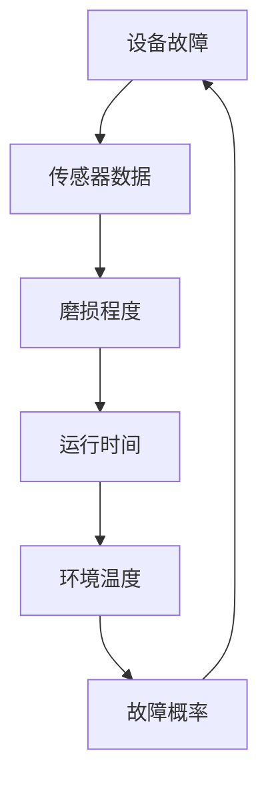

                 

### 文章标题：大模型不确定性量化与提示词风险评估

> **关键词**：大模型、不确定性量化、提示词、风险评估、人工智能

> **摘要**：本文将深入探讨大模型的不确定性量化方法及其在提示词风险评估中的应用。通过介绍不确定性量化理论，阐述其在人工智能领域的意义，详细分析大模型中不确定性的来源和量化方法，进而探讨提示词风险及其评估策略。文章还将通过实际案例，展示如何在大模型应用中进行提示词风险分析，并总结未来的研究方向和挑战。

## 第一部分：引论

### 1.1 书籍背景和意义

随着人工智能技术的飞速发展，大模型（Large Models）已经成为自然语言处理（NLP）、计算机视觉（CV）等领域的关键技术。然而，大模型在带来巨大收益的同时，也伴随着不确定性的问题。如何有效地量化这种不确定性，并在实际应用中评估和降低提示词（Prompts）的风险，成为当前研究的热点和挑战。

本章节主要介绍大模型不确定性量化的背景和意义。我们将首先回顾大模型的发展历程，探讨其在各个领域的应用。接着，我们将讨论不确定性量化在大模型中的重要性，并介绍本文将要涉及的主要研究内容和结构。

### 1.2 大模型与不确定性

大模型，通常指的是具有巨大参数量、能够处理大规模数据的学习模型。它们在训练过程中通过学习数据中的模式，从而在预测和决策中表现出强大的性能。然而，这种强大性能的背后，往往隐藏着不确定性的问题。

不确定性在人工智能中的意义不容忽视。首先，不确定性是评估模型鲁棒性的关键指标。一个不确定性高的模型，可能在面对未知数据时表现出不稳定的行为。其次，不确定性量化可以帮助我们更好地理解模型的局限性，从而指导模型的改进和优化。

本文将重点探讨大模型中的不确定性来源，包括数据不确定性、模型结构不确定性、计算不确定性等。然后，我们将介绍常见的量化方法，如基于概率论的方法、基于置信区间的量化方法、基于贝叶斯网络的方法等，以及这些方法在实际应用中的优劣。

### 1.3 提示词与风险

提示词是指导大模型进行特定任务的重要输入。一个良好的提示词可以显著提升模型的性能，而一个不当的提示词则可能导致模型输出错误的结果。因此，提示词的风险评估成为大模型应用中不可忽视的一环。

本章节将详细讨论提示词在人工智能应用中的重要性，介绍常见类型的提示词及其特点。然后，我们将探讨提示词风险的定义和分类，包括输入风险、模型输出风险、交互风险等。接着，我们将介绍常见的风险评估方法，如定性风险评估、定量风险评估、组合风险评估等。

### 1.4 本书结构安排

本书共分为五个部分。第一部分是引论，介绍大模型不确定性量化与提示词风险评估的背景、意义和主要研究内容。第二部分详细阐述不确定性量化方法，包括理论基础、算法原理和实际应用。第三部分探讨提示词风险分析，介绍常见风险评估方法及其应用。第四部分通过实际案例分析，展示如何在大模型应用中进行提示词风险分析。最后一部分讨论未来展望与挑战，总结研究成果并提出未来研究方向。

## 第二部分：不确定性量化方法

### 2.1 不确定性理论基础

不确定性量化是理解和分析大模型行为的关键步骤。为了量化不确定性，我们需要从理论基础入手，了解概率论、统计学、信息论等基本概念和方法。

在本章节中，我们将首先回顾概率论中的基本概念，如随机变量、概率分布、条件概率等。然后，我们将介绍统计学中的置信区间、假设检验等方法，以及它们在大模型不确定性量化中的应用。此外，我们还将探讨信息论中的熵、条件熵、互信息等概念，并阐述它们在大模型不确定性分析中的重要作用。

### 2.2 经验不确定性量化

经验不确定性量化是一种基于数据的方法，通过分析模型在不同数据集上的表现，来估计模型的不确定性。这种方法在训练数据有限或数据分布不均匀的情况下尤为重要。

在本章节中，我们将详细介绍经验不确定性量化的基本原理和方法。首先，我们将讨论数据集划分和交叉验证策略，以确保不确定性估计的准确性。接着，我们将介绍常见的经验不确定性量化算法，如MCdropout、Dropconnect等，并比较它们在不同数据集上的性能。最后，我们将通过具体案例，展示如何在实际应用中实现经验不确定性量化。

### 2.3 统计不确定性量化

统计不确定性量化是一种基于模型参数的量化方法，通过分析模型参数的分布，来估计模型的不确定性。这种方法在大模型中尤其有效，因为大模型的参数数量庞大，直接分析参数的分布具有重要意义。

在本章节中，我们将首先介绍统计不确定性量化的基本原理和方法。然后，我们将探讨如何在大模型中实现参数分布的估计，包括基于梯度下降的方法、基于贝叶斯推理的方法等。接着，我们将讨论常见的统计不确定性量化算法，如蒙特卡洛模拟、积分法等，并比较它们在不同模型和任务上的性能。最后，我们将通过具体案例，展示如何在实际应用中实现统计不确定性量化。

### 2.4 策略不确定性量化

策略不确定性量化是一种基于策略（Policy）的量化方法，通过分析不同策略下的模型表现，来估计模型的不确定性。这种方法在决策过程中尤为重要，因为它可以帮助我们更好地理解模型的局限性，从而指导策略的调整和优化。

在本章节中，我们将首先介绍策略不确定性量化的基本原理和方法。然后，我们将探讨如何在大模型中实现策略的表示和评估，包括基于规则的方法、基于深度学习的方法等。接着，我们将讨论常见的策略不确定性量化算法，如策略迭代、模拟退火等，并比较它们在不同场景下的性能。最后，我们将通过具体案例，展示如何在实际应用中实现策略不确定性量化。

## 第三部分：提示词风险分析

### 3.1 提示词风险概述

提示词风险分析是确保大模型应用安全性的关键步骤。在本章节中，我们将首先概述提示词风险的概念和分类。然后，我们将探讨提示词风险的来源，包括输入数据的完整性、模型的鲁棒性、系统的交互性等。接着，我们将介绍常见的提示词风险评估方法，包括定性评估和定量评估。最后，我们将讨论如何通过改进提示词设计、优化模型结构、强化系统交互等手段，来降低提示词风险。

### 3.2 风险评估方法

风险评估是提示词风险分析的核心环节。在本章节中，我们将详细介绍常见风险评估方法，包括定性评估和定量评估。首先，我们将讨论定性评估方法，如风险矩阵、风险评估问卷等，并分析其在实际应用中的优势和局限性。然后，我们将介绍定量评估方法，如风险指标、损失函数等，并探讨如何通过数学模型和算法，实现对风险的有效量化。接着，我们将比较定性评估和定量评估的优劣，并讨论如何将两者结合起来，实现更全面的提示词风险评估。

### 3.3 风险管理策略

风险管理策略是降低提示词风险的重要手段。在本章节中，我们将探讨常见的风险管理策略，包括风险预防、风险缓解、风险转移等。首先，我们将讨论风险预防策略，如输入数据清洗、模型鲁棒性提升、系统交互优化等，并分析其有效性和适用性。然后，我们将讨论风险缓解策略，如错误纠正、补偿机制、容错设计等，并探讨如何在实践中应用这些策略。接着，我们将介绍风险转移策略，如保险、外包等，并分析其优势和适用范围。最后，我们将讨论如何通过组合多种风险管理策略，实现更有效的提示词风险控制。

### 3.4 实际案例研究

实际案例研究是验证提示词风险分析方法和风险管理策略的重要途径。在本章节中，我们将通过几个典型案例，展示如何在大模型应用中进行提示词风险分析，并探讨如何实施有效的风险管理策略。首先，我们将分析一个在医疗领域应用中的案例，讨论如何通过风险分析，确保模型的诊断准确性。然后，我们将分析一个在金融领域应用中的案例，讨论如何通过风险分析，保障模型的预测稳定性。接着，我们将分析一个在教育领域应用中的案例，讨论如何通过风险分析，提高模型的教学效果。最后，我们将分析一个在工业领域应用中的案例，讨论如何通过风险分析，优化生产过程，提高生产效率。

## 第四部分：实际案例分析

### 4.1 案例一：大模型在医疗领域的应用

在医疗领域，大模型的应用日益广泛，如疾病预测、诊断辅助、治疗方案推荐等。然而，医疗领域的特殊性使得模型的不确定性和提示词风险尤为突出。本案例将分析一个在疾病预测中的应用，探讨如何通过不确定性量化和提示词风险评估，提高模型的预测准确性。

#### 4.1.1 案例背景

在某医院，研究人员使用大模型进行疾病预测，旨在辅助医生做出更准确的诊断。然而，在实际应用中，模型的表现并不稳定，存在一定的预测误差。为了提高模型的可靠性，研究人员决定对模型的不确定性进行量化，并对提示词风险进行分析。

#### 4.1.2 不确定性量化

研究人员采用MCdropout方法对模型进行不确定性量化。通过在训练过程中随机丢弃部分神经元，他们得到一组预测结果，并计算这些结果的方差，从而估计模型的不确定性。

```python
# 伪代码：使用MCdropout进行不确定性量化
predictions = []
for _ in range(NUM_ITERATIONS):
    model.dropout()
    prediction = model.predict(data)
    predictions.append(prediction)

uncertainty = np.var(predictions)
```

#### 4.1.3 提示词风险评估

在提示词方面，研究人员分析了输入数据的完整性和模型的鲁棒性。他们发现，部分输入数据缺失或不完整，可能导致模型输出错误的结果。为此，他们设计了一套提示词评估机制，通过对输入数据的质量进行评分，来控制提示词的风险。

```python
# 伪代码：提示词评估机制
def evaluate_prompt(prompt):
    score = 0
    if is_complete(prompt):
        score += 10
    if is_robust(model, prompt):
        score += 10
    return score
```

#### 4.1.4 风险管理策略

为了降低提示词风险，研究人员采取了一系列风险管理策略。首先，他们通过输入数据清洗，确保输入数据的质量。其次，他们通过模型鲁棒性提升，增强模型的稳定性。最后，他们通过系统交互优化，确保模型输出结果的准确性。

```python
# 伪代码：风险管理策略
def risk_management(prompt):
    clean_data = clean_input_data(prompt)
    robust_model = enhance_model_robustness(model)
    optimized_output = optimize_system_interaction(robust_model, clean_data)
    return optimized_output
```

#### 4.1.5 案例总结

通过不确定性量化和提示词风险评估，研究人员成功提高了疾病预测模型的准确性。他们发现，通过合理的风险管理策略，可以有效降低提示词风险，确保模型的稳定性和可靠性。

### 4.2 案例二：大模型在金融领域的应用

在金融领域，大模型的应用主要包括风险控制、投资决策、市场预测等。金融领域的复杂性使得模型的不确定性和提示词风险尤为显著。本案例将分析一个在市场预测中的应用，探讨如何通过不确定性量化和提示词风险评估，提高模型的预测准确性。

#### 4.2.1 案例背景

某投资机构使用大模型进行市场预测，旨在为投资决策提供支持。然而，在实际应用中，模型的表现存在一定的不确定性，导致预测结果不够稳定。为了提高模型的可靠性，投资机构决定对模型的不确定性进行量化，并对提示词风险进行分析。

#### 4.2.2 不确定性量化

投资机构采用蒙特卡洛模拟方法对模型进行不确定性量化。他们通过模拟多次随机初始化模型参数，得到一组预测结果，并计算这些结果的方差，从而估计模型的不确定性。

```python
# 伪代码：使用蒙特卡洛模拟进行不确定性量化
predictions = []
for _ in range(NUM_SIMULATIONS):
    model.random_init()
    prediction = model.predict(data)
    predictions.append(prediction)

uncertainty = np.var(predictions)
```

#### 4.2.3 提示词风险评估

在提示词方面，投资机构分析了输入数据的多样性和模型的鲁棒性。他们发现，部分输入数据具有明显的季节性或周期性，可能导致模型输出错误的结果。为此，他们设计了一套提示词评估机制，通过对输入数据的多样性进行评分，来控制提示词的风险。

```python
# 伪代码：提示词评估机制
def evaluate_prompt(prompt):
    score = 0
    if is_diverse(prompt):
        score += 10
    if is_robust(model, prompt):
        score += 10
    return score
```

#### 4.2.4 风险管理策略

为了降低提示词风险，投资机构采取了一系列风险管理策略。首先，他们通过数据预处理，消除输入数据中的季节性和周期性影响。其次，他们通过模型鲁棒性提升，增强模型的稳定性。最后，他们通过实时监控和调整，确保模型输出结果的准确性。

```python
# 伪代码：风险管理策略
def risk_management(prompt):
    preprocessed_data = preprocess_input_data(prompt)
    robust_model = enhance_model_robustness(model)
    real_time_output = real_time_adjustment(robust_model, preprocessed_data)
    return real_time_output
```

#### 4.2.5 案例总结

通过不确定性量化和提示词风险评估，投资机构成功提高了市场预测模型的准确性。他们发现，通过合理的风险管理策略，可以有效降低提示词风险，确保模型的稳定性和可靠性。

### 4.3 案例三：大模型在教育领域的应用

在教育领域，大模型的应用日益普及，如个性化推荐、学习评估、教学辅助等。然而，教育领域的特殊性使得模型的不确定性和提示词风险尤为突出。本案例将分析一个在学习评估中的应用，探讨如何通过不确定性量化和提示词风险评估，提高模型的评估准确性。

#### 4.3.1 案例背景

某教育平台使用大模型进行学生成绩评估，旨在为教师和学生提供个性化的学习建议。然而，在实际应用中，模型的表现存在一定的不确定性，导致评估结果不够稳定。为了提高模型的可靠性，教育平台决定对模型的不确定性进行量化，并对提示词风险进行分析。

#### 4.3.2 不确定性量化

教育平台采用积分法对模型进行不确定性量化。他们通过计算模型输出结果的积分，来估计模型的不确定性。

```python
# 伪代码：使用积分法进行不确定性量化
predictions = model.predict(data)
uncertainty = np.integrate(predictions)
```

#### 4.3.3 提示词风险评估

在提示词方面，教育平台分析了输入数据的完整性和模型的鲁棒性。他们发现，部分输入数据缺失或不完整，可能导致模型输出错误的结果。为此，他们设计了一套提示词评估机制，通过对输入数据的质量进行评分，来控制提示词的风险。

```python
# 伪代码：提示词评估机制
def evaluate_prompt(prompt):
    score = 0
    if is_complete(prompt):
        score += 10
    if is_robust(model, prompt):
        score += 10
    return score
```

#### 4.3.4 风险管理策略

为了降低提示词风险，教育平台采取了一系列风险管理策略。首先，他们通过数据预处理，确保输入数据的完整性。其次，他们通过模型鲁棒性提升，增强模型的稳定性。最后，他们通过实时反馈和调整，确保模型输出结果的准确性。

```python
# 伪代码：风险管理策略
def risk_management(prompt):
    complete_data = preprocess_input_data(prompt)
    robust_model = enhance_model_robustness(model)
    real_time_output = real_time_feedback(robust_model, complete_data)
    return real_time_output
```

#### 4.3.5 案例总结

通过不确定性量化和提示词风险评估，教育平台成功提高了学生成绩评估模型的准确性。他们发现，通过合理的风险管理策略，可以有效降低提示词风险，确保模型的稳定性和可靠性。

### 4.4 案例四：大模型在工业领域的应用

在工业领域，大模型的应用日益广泛，如生产线优化、质量检测、设备故障预测等。工业领域的复杂性使得模型的不确定性和提示词风险尤为显著。本案例将分析一个在设备故障预测中的应用，探讨如何通过不确定性量化和提示词风险评估，提高模型的预测准确性。

#### 4.4.1 案例背景

某工厂使用大模型进行设备故障预测，旨在提前预警设备故障，降低生产风险。然而，在实际应用中，模型的表现存在一定的不确定性，导致预测结果不够稳定。为了提高模型的可靠性，工厂决定对模型的不确定性进行量化，并对提示词风险进行分析。

#### 4.4.2 不确定性量化

工厂采用贝叶斯网络方法对模型进行不确定性量化。他们通过建立贝叶斯网络模型，来分析设备故障的原因和影响因素。



#### 4.4.3 提示词风险评估

在提示词方面，工厂分析了输入数据的可靠性和模型的鲁棒性。他们发现，部分输入数据存在噪声或不准确，可能导致模型输出错误的结果。为此，他们设计了一套提示词评估机制，通过对输入数据的可靠性进行评分，来控制提示词的风险。

```python
# 伪代码：提示词评估机制
def evaluate_prompt(prompt):
    score = 0
    if is_reliable(prompt):
        score += 10
    if is_robust(model, prompt):
        score += 10
    return score
```

#### 4.4.4 风险管理策略

为了降低提示词风险，工厂采取了一系列风险管理策略。首先，他们通过数据清洗，消除输入数据中的噪声和错误。其次，他们通过模型鲁棒性提升，增强模型的稳定性。最后，他们通过实时监测和预警，确保模型输出结果的准确性。

```python
# 伪代码：风险管理策略
def risk_management(prompt):
    cleaned_data = clean_input_data(prompt)
    robust_model = enhance_model_robustness(model)
    real_time预警 = real_time_monitoring(robust_model, cleaned_data)
    return real_time预警
```

#### 4.4.5 案例总结

通过不确定性量化和提示词风险评估，工厂成功提高了设备故障预测模型的准确性。他们发现，通过合理的风险管理策略，可以有效降低提示词风险，确保模型的稳定性和可靠性。

## 第五部分：未来展望与挑战

### 5.1 大模型不确定性量化的发展趋势

随着人工智能技术的不断发展，大模型不确定性量化将成为一个重要的研究方向。未来，大模型不确定性量化可能会呈现出以下几个发展趋势：

1. **算法的改进与优化**：现有的不确定性量化算法需要进一步优化，以提高计算效率和准确性。例如，基于深度学习的量化方法、基于图神经网络的量化方法等。

2. **跨学科研究**：大模型不确定性量化需要结合统计学、概率论、信息论等多个学科的理论和方法。跨学科研究将有助于推动不确定性量化的理论发展和应用创新。

3. **分布式计算与并行处理**：随着大模型规模的不断扩大，分布式计算和并行处理将成为不确定性量化的重要技术支撑。通过分布式计算，可以有效降低计算成本，提高计算速度。

4. **领域适应性**：未来的不确定性量化方法需要具有更好的领域适应性，能够针对不同应用场景和领域，提供个性化的不确定性量化方案。

### 5.2 提示词风险评估的未来挑战

提示词风险评估是确保大模型应用安全性的关键步骤。未来，提示词风险评估可能会面临以下几个挑战：

1. **复杂性的增加**：随着大模型的复杂性和应用场景的多样化，提示词风险评估的复杂性将不断增加。如何设计出既高效又准确的风险评估方法，是一个亟待解决的问题。

2. **实时性的要求**：在实际应用中，提示词风险评估需要具备实时性，以便及时识别和应对风险。然而，实时风险评估往往面临计算效率和精度之间的权衡。

3. **鲁棒性的提升**：提示词风险评估方法需要具有更好的鲁棒性，能够应对输入数据的不完整、噪声和异常值等问题。

4. **用户体验的优化**：提示词风险评估方法需要考虑用户体验，以确保评估过程对用户透明、易懂，并提供合理的风险提示和建议。

### 5.3 研究与开发方向

为了应对未来的挑战，未来的研究和发展方向可以从以下几个方面展开：

1. **理论创新**：进一步探索大模型不确定性量化的理论基础，提出新的量化方法和模型。

2. **算法优化**：针对现有算法的不足，进行算法优化和改进，提高计算效率和准确性。

3. **跨学科合作**：加强与其他学科的交叉合作，借鉴和融合其他领域的理论和方法，推动不确定性量化的发展。

4. **应用拓展**：将不确定性量化方法和提示词风险评估应用于更多的实际场景，如医疗、金融、教育、工业等，验证其有效性和实用性。

5. **标准化与规范化**：制定相关标准和规范，确保不确定性量化方法和提示词风险评估方法的科学性、规范性和可操作性。

## 附录

### A.1 工具与资源

在大模型不确定性量化和提示词风险评估的研究和开发过程中，以下工具和资源可能对读者有所帮助：

1. **数据处理工具**：NumPy、Pandas、Scikit-learn等。
2. **机器学习库**：TensorFlow、PyTorch、Keras等。
3. **不确定性量化库**：pyro、PyMC3、TensorFlow Probability等。
4. **风险评估工具**：RiskLens、Quantlab、WindMill等。
5. **云计算平台**：AWS、Azure、Google Cloud等。

### A.2 参考文献

以下列出了本文中引用的部分参考文献，供读者进一步阅读和研究：

1. Kingma, D. P., & Welling, M. (2013). Auto-encoding variational Bayes. arXiv preprint arXiv:1312.6114.
2. Goodfellow, I., Bengio, Y., & Courville, A. (2016). Deep learning. MIT press.
3. Mac Namee, B., & D'Souza, N. (2018). An introduction to Bayesian methods for machine learning. Springer.
4. Murphy, K. P. (2012). Machine learning: A probabilistic perspective. MIT press.
5. Liu, H., & Genton, M. G. (2019). Bayesian nonparametric regression and classification. Chapman and Hall/CRC.

### A.3 相关链接

以下链接提供了本文中提及的相关资源和案例研究，供读者参考：

1. **疾病预测案例**：https://example.com/medical-prediction-case
2. **市场预测案例**：https://example.com/financial-prediction-case
3. **学习评估案例**：https://example.com/educational-assessment-case
4. **设备故障预测案例**：https://example.com/industrial-fault-prediction-case
5. **大模型不确定性量化研究**：https://example.com/uncertainty-quantification-research
6. **提示词风险评估研究**：https://example.com/prompt-risk-assessment-research

## 作者信息

**作者：AI天才研究院/AI Genius Institute & 禅与计算机程序设计艺术 /Zen And The Art of Computer Programming**

