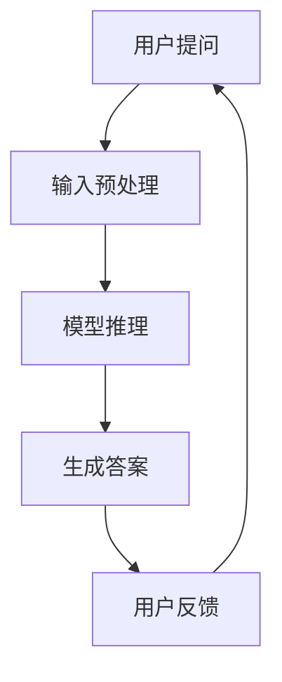
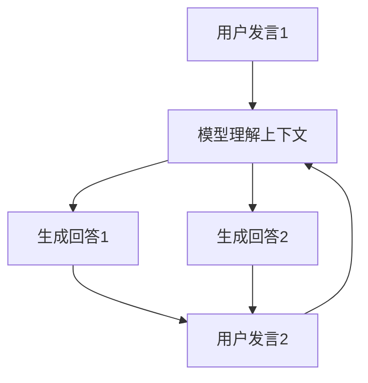
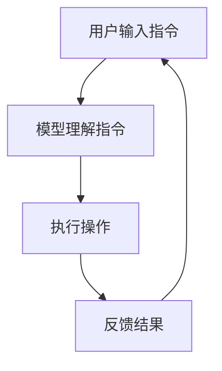

                 

### 文章标题

《大模型交互新范式：提示词语言的设计哲学》

### 关键词

大模型交互、提示词语言、设计哲学、AI、自然语言处理、用户体验

### 摘要

本文将深入探讨大模型交互新范式下的提示词语言设计哲学。随着人工智能技术的发展，大模型在自然语言处理领域取得了显著成就，但如何高效地与这些模型进行交互仍是一个挑战。本文首先介绍了大模型交互的基本原理和常见模式，然后重点分析了提示词语言的核心概念、构成要素以及设计原则。通过实例分析和数学模型讲解，本文揭示了提示词语言设计的本质，提供了实用的开发环境和源代码实现，并结合实际案例对大模型交互的应用进行了剖析。最终，本文对未来大模型交互范式和提示词语言的发展趋势进行了展望，并提出了最佳实践建议。

---

## 引言

大模型交互新范式：提示词语言的设计哲学

在人工智能的快速发展中，大模型（Large Models）已经成为自然语言处理（Natural Language Processing, NLP）领域的重要推动力。大模型，特别是基于深度学习技术的模型，如Transformer、BERT等，通过大量的数据和复杂的网络结构，实现了对语言的理解和生成。然而，大模型的强大能力并非无懈可击。在实际应用中，如何有效地与这些大模型进行交互，成为了一个亟待解决的关键问题。

### 提示词语言的概念与重要性

提示词语言（Prompt Language）是解决这一问题的关键。提示词语言是一种专门为与大模型交互而设计的语言结构，它通过精心的提示词（prompts）引导大模型生成所需的输出。提示词语言的设计不仅关乎用户体验，还直接影响到模型的性能和效率。一个好的提示词语言，可以大幅提升模型的交互效率，提高用户满意度，并在特定应用场景中发挥出最佳效果。

本文旨在探讨大模型交互新范式下的提示词语言设计哲学。通过深入分析大模型交互的基本原理、常见模式，以及提示词语言的核心概念、构成要素和设计原则，本文将揭示提示词语言设计的本质。此外，本文还将结合实际应用案例，详细讲解如何实现高效的大模型交互，并对未来大模型交互范式和提示词语言的发展趋势进行展望。

### 文章结构

本文结构如下：

1. **第1章 引言**：介绍大模型交互范式和提示词语言的概念，以及本文的目的和结构。
2. **第2章 大模型交互范式**：讨论大模型交互的基本原理和常见模式。
3. **第3章 提示词语言设计哲学**：探讨如何设计高效的提示词语言，提高大模型的交互性能。
4. **第4章 实际应用案例**：分析大模型交互在实际应用中的成功案例，展示提示词语言的设计原则。
5. **第5章 未来展望**：讨论大模型交互范式和提示词语言的发展趋势。
6. **附录**：提供相关的参考资料和工具。

通过以上章节的深入讨论，本文希望能够为读者提供一个全面而系统的理解，帮助他们在实际项目中设计出高效的提示词语言，实现大模型与人类用户的顺畅交互。

---

## 第1章 引言

### 大模型交互范式概述

大模型交互范式是指在大规模神经网络模型，如GPT-3、BERT等，与人类用户之间进行有效交互的方法和模式。这一范式不仅涉及到技术层面的实现，还包括用户体验和交互流程的设计。大模型交互的核心目标是使复杂模型变得易于使用，同时保持其强大的数据处理和生成能力。

### 提示词语言的概念介绍

提示词语言是一种专门为与大型语言模型（Large Language Models, LLMs）交互而设计的语言框架。它通过提供明确的指导和上下文，帮助模型更好地理解和生成所需的输出。提示词语言的核心在于其简洁性、灵活性和可扩展性，这使得用户能够以自然和直观的方式与模型进行对话。

### 本书结构及阅读建议

本书分为六个主要部分：

1. **引言**：介绍大模型交互范式和提示词语言的概念，以及本书的目的和结构。
2. **大模型交互范式**：讨论大模型交互的基本原理和常见模式。
3. **提示词语言设计哲学**：探讨如何设计高效的提示词语言，提高大模型的交互性能。
4. **实际应用案例**：分析大模型交互在实际应用中的成功案例，展示提示词语言的设计原则。
5. **未来展望**：讨论大模型交互范式和提示词语言的发展趋势。
6. **附录**：提供相关的参考资料和工具。

建议读者按照以下顺序阅读本书：

1. **引言**：首先了解大模型交互范式和提示词语言的基本概念。
2. **第2章 大模型交互范式**：掌握大模型交互的基本原理和常见模式。
3. **第3章 提示词语言设计哲学**：学习如何设计高效的提示词语言。
4. **第4章 实际应用案例**：通过案例分析理解提示词语言在实际中的应用。
5. **第5章 未来展望**：了解大模型交互和提示词语言的未来发展。
6. **附录**：查阅相关的参考资料和工具，以深化对主题的理解。

通过以上结构，本书旨在为读者提供一个全面、系统且易于理解的指南，帮助他们在大模型交互和提示词语言设计方面取得成功。

---

## 第2章 大模型交互范式

### 大模型交互的基本原理

大模型交互的基本原理在于如何使大规模神经网络模型，如GPT-3、BERT等，能够理解和生成人类用户所需的内容。这些模型通常具有数十亿甚至数万亿个参数，通过训练从大量数据中学习到了语言的统计规律和语义结构。大模型交互的核心在于有效地利用这些知识，以提供精准、有用的响应。

#### 神经网络模型的工作原理

神经网络模型，尤其是深度学习模型，通过多层神经网络对输入数据进行处理。每一层神经网络都会对输入进行加权求和处理，并通过激活函数进行非线性变换，从而提取出更高层次的特征。在自然语言处理中，这些特征通常是词语或句子的表示，这些表示经过多层神经网络的处理，最终生成输出。

#### 大模型交互的关键步骤

1. **数据输入**：用户通过输入文本或语音，将其转换为模型可以处理的格式。
2. **预处理**：对输入数据进行清洗、分词、编码等预处理操作，以便模型能够理解和处理。
3. **模型推理**：输入经过预处理后，进入模型进行推理。模型通过内部的参数和计算，生成可能的输出。
4. **输出生成**：模型生成输出，可以是文本、语音或其他形式，并根据用户的反馈进行调整。

### 大模型交互的常见模式

大模型交互常见有以下几种模式：

#### 问答模式

问答模式是最常见的大模型交互模式之一。在这种模式下，用户输入一个问题，模型根据输入的上下文和已有知识生成答案。问答模式的关键在于如何构建高质量的问答系统，使模型能够准确理解和回答各种类型的问题。

##### 案例分析

以OpenAI的GPT-3为例，GPT-3在问答系统中的应用表现出色。用户可以通过输入自然语言的问题，GPT-3能够生成高质量、相关的答案。例如，用户输入“什么是量子计算？”，GPT-3可以生成详细的解释。

#### 对话模式

对话模式是指用户和模型之间进行一系列交互，形成自然的对话流程。在这种模式下，模型不仅要能够回答具体的问题，还需要理解对话的上下文，以生成连贯、自然的响应。

##### 案例分析

以ChatGPT为例，用户可以通过对话模式与ChatGPT进行交流。ChatGPT能够根据之前的对话内容，生成与当前对话主题相关且连贯的回答。例如，用户可以与ChatGPT讨论科学话题，ChatGPT将根据之前的讨论内容，生成相应的科学解释和扩展。

#### 指令执行模式

指令执行模式是指用户通过输入指令，模型根据指令执行特定的任务。在这种模式下，模型需要能够理解指令的语义，并生成相应的执行结果。

##### 案例分析

以智能家居系统为例，用户可以通过语音输入指令，如“打开客厅的灯”，智能家居系统会识别指令并执行相应的操作。这里的模型需要理解语音指令的语义，并将其转换为具体的操作指令。

### 大模型交互的优势与挑战

#### 优势

1. **高效的交互**：大模型能够快速处理大量的数据，提供高效的交互体验。
2. **强大的知识处理能力**：通过训练，大模型具有强大的语言理解能力和知识处理能力，能够生成高质量的输出。
3. **多样化的应用场景**：大模型交互适用于多种场景，包括问答、对话和指令执行等。

#### 挑战

1. **数据隐私保护**：大模型需要大量的数据进行训练，如何保护用户数据的隐私成为一个重要问题。
2. **模型解释性**：大模型的内部结构和决策过程通常较为复杂，如何解释模型的行为是一个挑战。
3. **模型公平性**：如何确保大模型在不同用户群体中的公平性和无偏见性，是一个重要的社会问题。

通过以上内容，本章介绍了大模型交互的基本原理和常见模式，并分析了其优势和挑战。在下一章中，我们将深入探讨提示词语言的设计哲学，进一步优化大模型交互的性能。

---

## 第3章 提示词语言设计哲学

### 提示词语言的基本概念

提示词语言（Prompt Language）是一种专门用于与大模型交互的语言框架，它通过提供明确的指导和上下文，帮助大模型理解和生成所需的输出。提示词语言的核心在于其简洁性、灵活性和可扩展性，这使得用户能够以自然和直观的方式与模型进行对话。

### 提示词语言的构成要素

#### 词汇表

词汇表是提示词语言的基础，它包含了模型能够理解和处理的单词或短语。词汇表的构建需要考虑以下几点：

1. **多样性**：词汇表应包含丰富多样的词汇，以便模型能够处理各种类型的输入。
2. **专业性**：针对特定领域的应用，词汇表应包含该领域的专业术语和关键词。
3. **可扩展性**：词汇表应设计为可扩展的，以便在应用过程中添加新词汇。

#### 语法规则

语法规则定义了词汇表中的词汇如何组合成句子或命令。在设计语法规则时，需要考虑以下几点：

1. **简洁性**：语法规则应尽量简洁，以减少用户的学习成本。
2. **灵活性**：语法规则应足够灵活，以适应各种不同类型的输入。
3. **一致性**：语法规则应保持一致性，避免产生歧义。

#### 语义分析

语义分析是提示词语言的核心，它涉及对输入文本的理解和解释。语义分析的目的是帮助模型理解用户的意图，并生成合适的输出。在语义分析中，需要考虑以下几点：

1. **上下文理解**：模型应能够理解输入文本的上下文，以生成连贯的输出。
2. **多义性处理**：模型应能够处理输入文本的多义性，避免生成错误的输出。
3. **情感分析**：模型应能够识别输入文本的情感倾向，以生成情感匹配的输出。

### 提示词语言的设计原则

#### 简明性

简明性是提示词语言设计的重要原则之一。一个高效的提示词语言应尽量减少冗余信息，使用简洁明了的语言结构，以降低用户的学习成本。例如，可以使用简短的短语和命令，而不是复杂的句子。

#### 完整性

完整性原则要求提示词语言能够提供足够的上下文信息，使模型能够准确理解用户的意图。在设计提示词语言时，应考虑如何有效地传递关键信息，确保模型能够生成所需的输出。

#### 可扩展性

可扩展性原则强调提示词语言应具备适应未来变化的能力。随着应用场景的扩大和新功能的引入，提示词语言应能够灵活扩展，以适应新的需求。

#### 适应性

适应性原则要求提示词语言能够根据不同的用户需求和应用场景进行调整。一个优秀的提示词语言应能够适应不同类型的数据输入和输出格式，以提供最佳的交互体验。

### 提示词语言的设计流程

#### 需求分析

需求分析是设计提示词语言的第一个步骤，它涉及对用户需求和应用场景的深入调研。通过用户访谈、问卷调查等方式，收集用户的需求和反馈，以便设计出满足用户需求的提示词语言。

#### 功能需求分析

在需求分析的基础上，进行功能需求分析。这一步骤涉及确定提示词语言应具备的功能和特性。例如，是否需要支持多语言输入、是否需要实现特定领域的专业术语等。

#### 提示词语言的语法设计

语法设计是提示词语言设计的核心步骤，它涉及定义词汇表、语法规则和语义分析的方法。在这一步骤中，需要综合考虑简洁性、灵活性和一致性原则，设计出易于使用和理解的语法结构。

#### 提示词语言的语义设计

语义设计涉及对输入文本的理解和解释。在这一步骤中，需要设计出高效的语义分析算法，以帮助模型准确理解用户的意图，并生成合适的输出。

#### 测试与优化

在完成提示词语言的设计后，进行测试与优化。通过实际使用案例，评估提示词语言的性能和用户体验，并根据反馈进行优化。测试与优化是设计过程中不可或缺的环节，它有助于确保提示词语言的实用性和高效性。

通过以上步骤，可以设计出一个高效、实用的提示词语言，为大模型交互提供坚实的基础。

---

## 第4章 实际应用案例

在本章中，我们将深入探讨大模型交互在实际应用中的成功案例，并详细分析这些案例中提示词语言的设计原则和实现方法。

### 案例一：智能客服系统

#### 应用背景

智能客服系统是应用大模型交互的一个典型场景。这类系统通过大模型与用户进行自然语言交互，提供高效、准确的客户服务。

#### 提示词语言设计

在智能客服系统中，提示词语言的设计至关重要。以下是其核心设计原则：

1. **明确性**：提示词应简洁明了，避免产生歧义。例如，用户输入“订单状态”，系统应明确响应“您的订单状态是已发货”。
2. **灵活性**：提示词应具备灵活性，能够适应不同的问题类型和用户表达方式。例如，用户输入“何时到货？”或“我的包裹何时能送达？”系统均应能正确响应。
3. **上下文理解**：提示词应包含足够的上下文信息，以帮助模型理解用户的意图。例如，用户之前可能已经询问过订单号，提示词中应包含订单号，如“您的订单号是123456，预计明天送达”。

#### 实现方法

智能客服系统的实现主要包括以下几个步骤：

1. **用户输入处理**：将用户输入文本进行预处理，如分词、实体识别等。
2. **模型推理**：将预处理后的文本输入大模型，如GPT-3或BERT，获取响应。
3. **输出生成**：根据模型的响应生成提示词，并将其返回给用户。

#### 测试与优化

在智能客服系统中，测试与优化是确保系统性能和用户体验的重要环节。以下是一些测试与优化的方法：

1. **自动化测试**：通过编写测试脚本，对系统的功能进行自动化测试，确保系统在不同输入条件下能够正常运行。
2. **用户反馈收集**：通过用户反馈，收集系统在实际应用中的问题和改进建议。
3. **持续优化**：根据测试和用户反馈，不断优化提示词语言和模型参数，以提高系统的性能和用户体验。

### 案例二：教育辅导平台

#### 应用背景

教育辅导平台利用大模型交互，提供个性化学习辅导和知识问答服务。用户可以通过平台与模型进行交互，获取针对性的学习建议和解答疑惑。

#### 提示词语言设计

在教育辅导平台中，提示词语言的设计需要充分考虑用户的实际需求和学习习惯。以下是其核心设计原则：

1. **针对性**：提示词应针对用户的具体问题和需求，提供个性化的辅导建议。例如，用户输入“如何提高数学成绩？”系统应返回“您可以尝试以下方法：定期练习数学题、寻求老师和同学的帮助等”。
2. **启发性**：提示词应具有启发性，鼓励用户主动思考和探索。例如，用户输入“什么是函数？”系统应返回“函数是数学中的一个重要概念，它表示两个变量之间的关系，通常用f(x)表示。您可以查阅相关资料，了解更多关于函数的知识”。
3. **简洁性**：提示词应简洁明了，避免冗长和复杂的解释。例如，用户输入“求导法则有哪些？”系统应返回“常见的求导法则包括：幂函数求导法则、三角函数求导法则、乘积法则等”。

#### 实现方法

教育辅导平台的主要实现步骤如下：

1. **用户信息收集**：收集用户的学习背景、学科兴趣和当前学习进度等。
2. **问题理解**：将用户输入的问题进行预处理，识别关键词和语义。
3. **模型推理**：将预处理后的文本输入大模型，获取相应的辅导建议或答案。
4. **输出生成**：根据模型响应生成提示词，并提供给用户。

#### 测试与优化

在教育辅导平台中，测试与优化主要包括以下方面：

1. **系统稳定性测试**：确保系统在不同环境下的稳定运行。
2. **用户满意度调查**：通过用户满意度调查，收集用户对平台功能的评价和改进建议。
3. **模型参数调整**：根据用户反馈，不断调整模型参数，以提高辅导效果和用户体验。

### 案例三：医疗诊断系统

#### 应用背景

医疗诊断系统利用大模型交互，辅助医生进行疾病诊断和治疗方案推荐。系统通过与医生的互动，提供基于最新医学知识的诊断建议。

#### 提示词语言设计

在医疗诊断系统中，提示词语言的设计需要严格遵守医学规范和标准。以下是其核心设计原则：

1. **准确性**：提示词应提供准确、可靠的医学信息，确保诊断和建议的准确性。
2. **权威性**：提示词应引用权威的医学资源和研究，提供科学的依据。
3. **简洁性**：提示词应简洁明了，避免冗长的医学术语和复杂的概念。

#### 实现方法

医疗诊断系统的实现包括以下几个步骤：

1. **病例信息收集**：收集患者的病例信息，如症状、体征、检查结果等。
2. **问题理解**：将病例信息输入大模型，进行语义分析和诊断推理。
3. **模型推理**：大模型根据病例信息和医学知识库，生成诊断建议和治疗方案。
4. **输出生成**：根据模型响应生成提示词，并将其呈现给医生。

#### 测试与优化

在医疗诊断系统中，测试与优化主要包括以下几个方面：

1. **模型准确性测试**：通过实际病例测试，评估模型的诊断准确性。
2. **医生反馈收集**：收集医生对诊断建议和治疗方案的建议和意见。
3. **模型迭代优化**：根据医生反馈和实际应用情况，不断调整模型参数和算法，提高诊断准确性。

### 案例分析

通过以上三个实际应用案例，我们可以看到大模型交互在智能客服系统、教育辅导平台和医疗诊断系统中的应用取得了显著的成果。这些案例的成功经验表明，提示词语言的设计原则和实现方法在大模型交互中具有重要作用。

1. **明确性、灵活性和上下文理解**：智能客服系统中的明确性和灵活性，教育辅导平台中的启发性，医疗诊断系统中的准确性，都展示了提示词语言在不同应用场景中的关键作用。
2. **需求分析与功能需求分析**：每个案例在实现过程中，都进行了详细的需求分析和功能需求分析，确保了提示词语言的实用性和有效性。
3. **测试与优化**：通过自动化测试、用户反馈收集和模型迭代优化，每个案例都实现了提示词语言的持续改进，提高了用户体验和系统性能。

通过这些实际案例的分析，我们可以更好地理解大模型交互的实际应用和提示词语言的设计原则。在未来的应用中，我们可以借鉴这些成功经验，设计出更加高效、实用的提示词语言，进一步推动人工智能技术的发展和应用。

---

## 第5章 未来展望

### 大模型交互范式的未来发展

大模型交互范式在未来将继续演进，成为人工智能领域的重要发展方向。以下是几个关键趋势：

1. **更高效的大模型设计**：随着计算能力和算法的进步，大模型将变得更加高效，能够处理更复杂、更大量的数据。
2. **多模态交互**：未来的大模型将不仅仅支持文本交互，还将支持语音、图像、视频等多模态交互，提供更加丰富的用户体验。
3. **个性化交互**：通过深度学习和用户数据分析，大模型将能够提供更加个性化的交互服务，满足用户的具体需求。

### 提示词语言的设计趋势

提示词语言的设计也将随着技术的发展而不断进步。以下是几个主要趋势：

1. **自动化设计工具**：未来的提示词语言设计将依赖于自动化工具，通过机器学习和自然语言处理技术，自动生成和优化提示词。
2. **上下文感知性**：提示词语言将更加注重上下文感知性，通过深度学习算法，更好地理解用户的意图和对话背景，生成更加准确和自然的输出。
3. **适应性**：提示词语言将具备更高的适应性，能够根据不同的应用场景和用户需求，灵活调整提示词的设计和结构。

### 新兴应用场景展望

大模型交互和提示词语言的应用场景将继续扩展，以下是一些新兴的应用领域：

1. **智能客服与虚拟助手**：随着技术的进步，智能客服和虚拟助手将更加智能化，能够提供更加高效、个性化的服务。
2. **教育领域**：大模型交互将在教育领域发挥更大作用，通过智能辅导系统和个性化学习平台，提高教学效果和学生的学习体验。
3. **医疗健康**：大模型交互将用于医疗诊断、健康管理和患者关怀，提供精准、可靠的医疗建议和服务。
4. **创意产业**：大模型交互将在创意产业中发挥作用，如内容创作、艺术设计和娱乐领域，通过自动生成创意内容和个性化体验，推动行业创新。

### 结语

未来，大模型交互和提示词语言的设计将朝着更加智能化、个性化和多模态的方向发展，为各个领域带来革命性的变化。通过不断创新和优化，提示词语言将成为大模型交互的核心，推动人工智能技术的广泛应用和持续进步。

---

## 附录

### 相关参考资料

1. **《深度学习》（Goodfellow, I., Bengio, Y., & Courville, A.）**：提供了深度学习的基础理论和应用实践，对大模型交互有重要指导意义。
2. **《自然语言处理综论》（Jurafsky, D., & Martin, J. H.）**：详细介绍了自然语言处理的基本概念和技术，对提示词语言设计有参考价值。
3. **《大模型：变革自然语言处理》（Brown, T., et al.）**：探讨了大型语言模型的最新进展和应用，为理解大模型交互提供了深入见解。

### 工具与资源推荐

1. **Hugging Face Transformer**：一个广泛使用的深度学习库，提供各种预训练模型和工具，方便构建和部署大模型交互系统。
2. **OpenAI GPT-3 API**：一个强大的API服务，允许开发者轻松访问GPT-3模型，进行各种自然语言处理任务。
3. **TensorFlow**：Google开发的开源机器学习框架，支持深度学习和自然语言处理的多种任务。
4. **PyTorch**：由Facebook AI团队开发的深度学习库，提供灵活的动态计算图支持，适用于研究和开发。

### 最佳实践 Tips

1. **用户隐私保护**：在开发大模型交互系统时，应严格保护用户隐私，遵循相关法律法规。
2. **模型解释性**：设计提示词语言时，考虑如何提高模型的可解释性，以增强用户信任。
3. **用户体验优化**：通过不断收集用户反馈，优化交互流程和提示词语言设计，提升用户体验。
4. **持续迭代**：定期更新模型和提示词语言，以适应新的应用场景和技术发展。

通过以上附录内容，读者可以进一步深化对大模型交互和提示词语言设计的理解，为实际项目提供实用的参考和指导。

