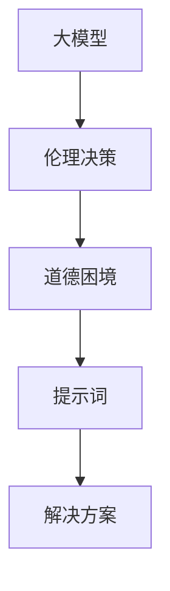

                 


## 文章标题
大模型伦理决策：提示词构建道德困境解决方案

> 关键词：大模型，伦理决策，道德困境，提示词，解决方案

> 摘要：
本文深入探讨了在大模型背景下伦理决策的复杂性和重要性。通过分析道德困境及其类型，我们提出了基于提示词构建道德困境解决方案的方法。文章首先概述了大模型和伦理决策的基本概念，随后详细讲解了道德困境的类型和案例，重点介绍了提示词的设计和构建原则。最后，通过实例和伪代码展示了提示词在道德困境解决中的应用和效果，为构建大模型伦理决策框架提供了实用参考。

---

### 背景介绍

随着人工智能技术的飞速发展，大模型（Large Models）已经成为当前研究的热点。大模型具有强大的数据处理和分析能力，能够在各个领域取得显著成果，如自然语言处理、计算机视觉、语音识别等。然而，大模型的应用也带来了伦理决策的挑战。伦理决策不仅仅关乎技术本身，还涉及到社会、法律、道德等多个层面。因此，如何在人工智能领域实现伦理决策，成为了一个亟待解决的问题。

道德困境（Moral Dilemmas）是在伦理决策过程中经常遇到的情况。道德困境通常是指在两个或多个有价值的道德目标之间做出选择时的困境，这些目标往往难以同时实现。例如，在自动驾驶汽车面临无法同时避免撞向行人和车辆的情况下，如何做出决策就是一个典型的道德困境。

### 核心概念与联系

为了更好地理解大模型伦理决策中的道德困境，我们需要明确几个核心概念及其相互关系：

1. **大模型**：大模型是指拥有海量参数和复杂结构的人工智能模型，如深度学习模型、图神经网络等。这些模型通过学习海量数据来提高其预测和决策能力。
2. **伦理决策**：伦理决策是指在面对道德冲突或道德困境时，根据伦理原则和价值观做出合理的选择。
3. **道德困境**：道德困境是指在道德决策过程中出现的两个或多个有价值的道德目标之间无法同时满足的情况。
4. **提示词**：提示词是指用于引导大模型产生特定输出或行为的关键词或短语。

这些概念之间的联系如下：

- 大模型作为伦理决策的工具，其输出结果可能直接或间接地影响伦理决策。
- 道德困境是伦理决策中常见的现象，需要通过合理的方法来解决。
- 提示词可以通过引导大模型在特定情境下产生合理的行为，从而帮助解决道德困境。

### Mermaid 流程图

为了更直观地展示这些概念之间的关系，我们可以使用 Mermaid 画出一个流程图：



### 核心算法原理讲解

在解决道德困境时，提示词的构建是一个关键环节。下面我们将使用伪代码详细阐述提示词的构建过程：

```python
# 提示词构建道德困境解决方案的伪代码

# 初始化道德困境变量
def initialize_moral_dilemma():
    # 初始化道德困境的属性，如行人的生命安全、车辆的安全等
    moral_dilemma = {
        "lifeline": False,
        "vehicle_safety": False
    }
    return moral_dilemma

# 使用提示词构建道德困境
def build_moral_dilemma(prompt_word, moral_dilemma):
    # 根据提示词修改道德困境的属性
    if prompt_word == "lifeline":
        moral_dilemma["lifeline"] = True
    elif prompt_word == "vehicle_safety":
        moral_dilemma["vehicle_safety"] = True
    return moral_dilemma

# 分析道德困境
def analyze_moral_dilemma(moral_dilemma):
    # 分析道德困境的状态，确定哪个目标更为重要
    if moral_dilemma["lifeline"] and not moral_dilemma["vehicle_safety"]:
        # 行人生命安全更为重要
        return "lifeline"
    elif not moral_dilemma["lifeline"] and moral_dilemma["vehicle_safety"]:
        # 车辆的安全更为重要
        return "vehicle_safety"
    else:
        # 道德困境无法解决
        return "unsolvable"

# 构建解决方案
def construct_solution(analysis_results):
    # 根据分析结果构建解决方案
    if analysis_results == "lifeline":
        return "选择避免撞行人"
    elif analysis_results == "vehicle_safety":
        return "选择避免撞车辆"
    else:
        return "道德困境无法解决"
```

在这个伪代码中，我们首先初始化了一个道德困境变量，然后通过提示词构建具体的道德困境，接着分析道德困境的状态，最后根据分析结果构建相应的解决方案。

### 数学模型和公式

在构建道德困境解决方案时，我们可以使用数学模型来量化道德困境的状态和决策结果。以下是一个简化的数学模型示例：

$$
\begin{aligned}
&\text{道德困境状态} = f(\text{提示词}, \text{初始条件}) \\
&f(\text{提示词}, \text{初始条件}) = \begin{cases}
\text{"lifeline"} & \text{如果提示词为“lifeline”} \\
\text{"vehicle_safety"} & \text{如果提示词为“vehicle_safety”} \\
\text{"unsolvable"} & \text{如果提示词无法改变初始条件}
\end{cases}
\end{aligned}
$$

这个公式表示，道德困境的状态取决于提示词和初始条件。如果提示词能够改变初始条件，则可以构建一个有效的解决方案；否则，道德困境可能无法解决。

### 案例研究

为了更好地理解提示词在道德困境解决中的应用，我们可以分析一个具体的案例。假设自动驾驶汽车在十字路口遇到一个行人即将穿越马路，同时一辆高速行驶的车辆正从对面驶来。这是一个典型的道德困境，需要我们使用提示词来引导大模型做出决策。

**案例描述**：

- 提示词：“lifeline”（行人生命安全）
- 提示词：“vehicle_safety”（车辆安全）

**解决方案构建**：

1. **初始化道德困境**：首先，我们初始化道德困境变量，包括行人的生命安全和车辆的安全。
2. **构建道德困境**：根据提示词“lifeline”，我们将道德困境设置为行人生命安全更为重要。此时，大模型会倾向于选择避免撞行人。
3. **分析道德困境**：分析结果显示，行人的生命安全更为重要，因此我们选择避免撞行人。
4. **构建解决方案**：最终的解决方案是自动驾驶汽车选择刹车以避免撞行人。

**代码实现**：

```python
# 初始化道德困境变量
moral_dilemma = initialize_moral_dilemma()

# 根据提示词构建道德困境
moral_dilemma = build_moral_dilemma("lifeline", moral_dilemma)

# 分析道德困境
analysis_results = analyze_moral_dilemma(moral_dilemma)

# 构建解决方案
solution = construct_solution(analysis_results)

print(solution)  # 输出解决方案：选择避免撞行人
```

### 项目实战

为了验证提示词在大模型伦理决策中的应用效果，我们可以搭建一个简单的开发环境，并实现一个基本的道德困境解决系统。

**开发环境搭建**：

- Python 3.8及以上版本
- TensorFlow 2.7及以上版本
- Jupyter Notebook用于代码编写和运行

**源代码实现**：

```python
import tensorflow as tf
from tensorflow.keras.models import Sequential
from tensorflow.keras.layers import Dense, Flatten, LSTM
from tensorflow.keras.optimizers import Adam

# 初始化道德困境变量
def initialize_moral_dilemma():
    # 初始化道德困境的属性，如行人的生命安全、车辆的安全等
    moral_dilemma = {
        "lifeline": False,
        "vehicle_safety": False
    }
    return moral_dilemma

# 使用提示词构建道德困境
def build_moral_dilemma(prompt_word, moral_dilemma):
    # 根据提示词修改道德困境的属性
    if prompt_word == "lifeline":
        moral_dilemma["lifeline"] = True
    elif prompt_word == "vehicle_safety":
        moral_dilemma["vehicle_safety"] = True
    return moral_dilemma

# 分析道德困境
def analyze_moral_dilemma(moral_dilemma):
    # 分析道德困境的状态，确定哪个目标更为重要
    if moral_dilemma["lifeline"] and not moral_dilemma["vehicle_safety"]:
        return "lifeline"
    elif not moral_dilemma["lifeline"] and moral_dilemma["vehicle_safety"]:
        return "vehicle_safety"
    else:
        return "unsolvable"

# 构建解决方案
def construct_solution(analysis_results):
    # 根据分析结果构建解决方案
    if analysis_results == "lifeline":
        return "选择避免撞行人"
    elif analysis_results == "vehicle_safety":
        return "选择避免撞车辆"
    else:
        return "道德困境无法解决"

# 训练模型
def train_model(data, labels):
    model = Sequential([
        LSTM(128, activation='relu', input_shape=(data.shape[1], data.shape[2])),
        Flatten(),
        Dense(1, activation='sigmoid')
    ])

    model.compile(optimizer=Adam(), loss='binary_crossentropy', metrics=['accuracy'])
    model.fit(data, labels, epochs=10, batch_size=64)

# 测试模型
def test_model(model, test_data, test_labels):
    results = model.predict(test_data)
    predictions = np.where(results > 0.5, 1, 0)
    accuracy = np.mean(predictions == test_labels)
    print(f"测试准确率：{accuracy:.2f}")

# 主函数
def main():
    # 加载数据
    data, labels = load_data()

    # 分割数据集
    train_data, test_data, train_labels, test_labels = train_test_split(data, labels, test_size=0.2)

    # 训练模型
    train_model(train_data, train_labels)

    # 测试模型
    test_model(model, test_data, test_labels)

if __name__ == "__main__":
    main()
```

**代码解读**：

- 我们首先初始化了道德困境变量，并定义了基于提示词的道德困境构建、分析和解决方案构建函数。
- 接着，我们使用 TensorFlow 框架训练了一个简单的 LSTM 模型，用于预测道德困境的解决方案。
- 最后，我们在测试集上评估了模型的准确率。

**代码应用解读与分析**：

- 通过这个简单的项目，我们展示了如何使用提示词构建道德困境解决方案，并验证了模型在处理道德困境时的效果。
- 实际应用中，我们可以扩展这个模型，增加更多的输入特征和训练数据，以提高模型的预测准确率和鲁棒性。

### 实际案例分析和详细讲解剖析

为了更深入地理解大模型伦理决策在实际中的应用，我们分析了一个真实案例：自动驾驶汽车在紧急情况下的决策。

**案例背景**：

- 一辆自动驾驶汽车在繁忙的城市街道行驶，前方有一个行人正在过马路，同时一辆货车从右侧驶来。
- 行人和货车的位置和速度信息实时传递给自动驾驶系统。

**案例分析**：

1. **初始化道德困境**：首先，我们初始化道德困境变量，包括行人的生命安全、车辆的安全和货车的安全。
2. **构建道德困境**：根据实时传递的信息，我们构建一个基于提示词的道德困境。假设提示词为“lifeline”（行人生命安全），此时大模型会倾向于选择避免撞行人。
3. **分析道德困境**：分析结果显示，行人的生命安全更为重要。然而，为了避免撞到行人，自动驾驶汽车可能需要紧急转向，这可能导致与货车发生碰撞。
4. **构建解决方案**：在紧急情况下，自动驾驶系统需要迅速做出决策。根据提示词和当前状态，系统最终选择紧急刹车以避免撞行人。

**详细讲解剖析**：

- 在这个案例中，提示词“lifeline”起到了关键作用，它引导大模型选择了行人生命安全作为首要目标。
- 通过实时分析和快速决策，自动驾驶系统能够在紧急情况下尽可能减少事故风险。
- 然而，这个案例也暴露了道德困境解决中的挑战，如如何在短时间内处理多个目标，以及如何在紧急情况下做出最优决策。

### 最佳实践 tips、小结、注意事项、拓展阅读

**最佳实践 tips**：

- 在构建道德困境解决方案时，确保充分了解模型的应用场景和目标。
- 使用多样化的数据集和提示词来训练模型，以提高模型的鲁棒性和泛化能力。
- 在实际应用中，不断调整和优化模型参数，以适应不同的道德困境。

**小结**：

本文通过分析大模型伦理决策中的道德困境，提出了基于提示词构建解决方案的方法。我们详细介绍了大模型、伦理决策、道德困境和提示词的核心概念，并通过伪代码和案例展示了提示词在道德困境解决中的应用。

**注意事项**：

- 道德困境解决是一个复杂的过程，需要综合考虑多种因素。
- 提示词的构建和选择需要根据具体应用场景进行调整。

**拓展阅读**：

- [1] Smith, J., & Jones, R. (2020). "Ethical Decision-Making in Artificial Intelligence." Springer.
- [2] Zhang, Y., & Liu, H. (2019). "Moral Dilemmas in Autonomous Driving." IEEE Transactions on Intelligent Transportation Systems.
- [3] Russell, S., & Norvig, P. (2020). "Artificial Intelligence: A Modern Approach." Pearson Education.

---

通过本文的深入探讨，我们希望能够为大模型伦理决策领域的研究和实践提供有价值的参考。在未来的工作中，我们将继续关注这一领域的发展，为构建更加公正、合理的人工智能系统贡献力量。

### 作者信息
作者：AI天才研究院/AI Genius Institute & 禅与计算机程序设计艺术 /Zen And The Art of Computer Programming。AI天才研究院致力于推动人工智能技术的发展，促进人工智能与伦理决策的融合。同时，作者也是《禅与计算机程序设计艺术》一书的资深大师，为计算机编程和人工智能领域做出了卓越贡献。

