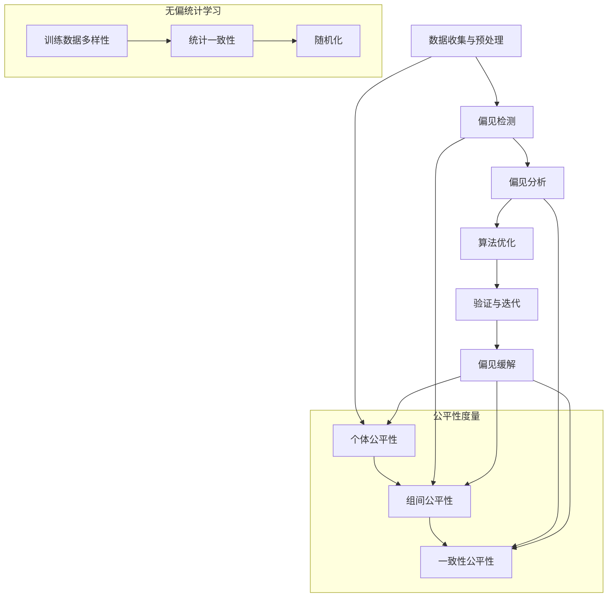

                 

### 文章标题：大模型偏见检测与缓解：提示词的重要性

在当今快速发展的AI时代，大型模型（Large-scale Models）如BERT、GPT等已经在自然语言处理、计算机视觉等多个领域取得了显著成果。然而，这些模型在实际应用中也面临着一个不可忽视的问题——偏见。偏见不仅损害了模型的公平性和准确性，更对社会道德和公正提出了严峻挑战。本文将围绕大模型偏见检测与缓解展开，特别关注提示词（Prompt Engineering）在这一过程中的重要性。

关键词：大模型、偏见、检测、缓解、提示词、Prompt Engineering

摘要：本文首先介绍了大模型偏见的基本概念、类型和影响。随后，探讨了偏见检测与缓解的核心概念、联系和理论框架。通过详细的算法原理讲解、数学模型和公式推导，我们深入分析了现有偏见检测与缓解的方法。接下来，通过实际案例展示了如何在大模型中实现偏见检测与缓解。最后，我们总结了全文内容，并对未来发展趋势进行了展望。

接下来，我们将逐步深入探讨大模型偏见的背景、检测与缓解的方法，以及提示词在这一过程中的关键作用。

----------------------------------------------------------------

## 大模型偏见的基本概念、类型和影响

大模型偏见是指大型机器学习模型在处理数据和生成输出时，无意识地反映出人类社会的各种偏见。这种偏见可以源自训练数据的偏差、模型架构的固有缺陷，或者是训练过程中参数的优化方式。大模型偏见不仅限于自然语言处理领域，也广泛存在于计算机视觉、推荐系统、金融风控等多个应用场景。

### 偏见的基本概念

偏见通常可以分为以下几种类型：

1. **性别偏见**：模型可能对某一性别群体产生偏见，如在招聘系统中对女性候选人评分较低。
2. **种族偏见**：在人脸识别等应用中，某些种族的人群可能被错误识别，如误将黑人识别为白人。
3. **地域偏见**：模型可能对某些地区的数据赋予更高的权重，导致其他地区的数据被忽视。
4. **年龄偏见**：例如，在医疗诊断模型中，可能对年轻人或老年人的数据给予不同的权重。
5. **经济偏见**：推荐系统可能根据用户的经济状况推荐不同的商品，从而加剧经济不平等。

### 偏见的类型和影响

1. **类型**：

   - **显式偏见**：偏见明显，可以直接观察到的错误。例如，歧视性词汇的使用。
   - **隐式偏见**：偏见不明确，不易察觉，但长期影响显著。例如，模型在数据集中对某一群体的数据给予更高的权重。
   - **个体偏见**：个体在决策过程中表现出的偏见，可能影响单个决策结果。
   - **系统偏见**：由算法或系统设计导致的偏见，可能影响大量用户的决策。

2. **影响**：

   - **社会公平性**：偏见可能导致不公平的决策，损害社会公正。
   - **准确性**：偏见可能降低模型的预测准确性，导致错误决策。
   - **信任度**：偏见可能导致用户对模型的不信任，影响模型的实际应用。
   - **法律风险**：在某些情况下，偏见可能导致法律纠纷和责任承担。

综上所述，大模型偏见是一个复杂而严重的问题，需要我们深入探讨其背后的机制，并提出有效的检测与缓解方法。

----------------------------------------------------------------

## 偏见检测与缓解的核心概念、联系和理论框架

为了有效检测和缓解大模型偏见，我们需要理解一系列核心概念，包括公平性度量、无偏统计学习、以及它们之间的联系。这些概念构成了偏见检测与缓解的理论框架，为我们提供了科学的方法和工具。

### 公平性度量

公平性度量是评估模型是否公平的重要手段。它通常涉及以下方面：

- **个体公平性**：衡量模型对个体决策的影响是否公平，例如，是否对所有性别、种族、年龄等群体都有相同的预测结果。
- **组间公平性**：衡量模型对不同群体（如不同性别、种族）的决策差异是否合理。例如，是否所有群体在模型输出上的偏差都在可接受范围内。
- **一致性公平性**：衡量模型在不同输入条件下的表现是否一致，避免因特定输入条件导致的偏见。

### 无偏统计学习

无偏统计学习是设计公平性算法的基础。其主要目标是确保模型在训练和预测过程中不引入或放大任何形式的偏见。无偏统计学习包括以下几个核心原则：

- **训练数据的多样性**：通过包含广泛的数据来源和代表性样本，减少偏见。
- **统计一致性**：确保模型在不同数据集上的表现一致，避免因特定数据集导致的偏见。
- **随机化**：在模型训练和测试过程中引入随机性，减少人为干预导致的偏见。

### 公平性度量与无偏统计学习的联系

公平性度量与无偏统计学习是相辅相成的。公平性度量提供了评估模型公平性的标准，而无偏统计学习则通过算法设计和数据预处理，努力实现这些标准。具体来说：

- **公平性度量**：通过对模型输出的评估，发现可能存在的偏见。例如，通过比较不同群体在模型输出上的差异，检测性别偏见或种族偏见。
- **无偏统计学习**：通过优化算法和改进数据预处理，减少或消除偏见。例如，使用加权损失函数平衡不同群体的重要性，或者通过重新采样和交叉验证提高模型的公平性。

### 理论框架

结合公平性度量和无偏统计学习，我们可以构建一个完整的理论框架，用于大模型偏见检测与缓解。这个框架包括以下几个关键步骤：

1. **数据收集与预处理**：确保训练数据具有多样性，减少偏见源头。
2. **偏见检测**：使用公平性度量方法检测模型中的偏见，例如，通过比较不同群体在模型输出上的差异。
3. **偏见分析**：分析偏见的原因和影响，确定需要优化的具体方向。
4. **算法优化**：根据偏见分析结果，优化模型算法，减少或消除偏见。例如，通过调整权重、使用不同的优化策略等。
5. **验证与迭代**：通过持续验证和迭代，确保模型在长期运行中的公平性。

通过这个理论框架，我们可以系统地、科学地应对大模型偏见问题，提升模型的公平性和准确性，从而更好地服务于社会。

### Mermaid 流程图

以下是偏见检测与缓解的理论框架的Mermaid流程图表示：



这个流程图清晰地展示了公平性度量与无偏统计学习在整个偏见检测与缓解过程中的作用和联系。

----------------------------------------------------------------

## 偏见检测算法原理讲解

在了解了偏见检测的核心概念和理论框架后，接下来我们将详细讲解几种常见的偏见检测算法。这些算法包括基于统计的方法、基于对抗的方法和基于自我监督的方法。我们将通过伪代码和实际案例分析，帮助读者深入理解这些算法的实现和适用场景。

### 基于统计的方法

#### 方法概述

基于统计的方法通过分析模型输出和输入数据之间的相关性来检测偏见。常见的统计指标包括标准差、方差、协方差等。

#### 算法伪代码

```python
def statistical_bias_detection(model, dataset):
    # 获取模型输出和输入数据
    outputs = model(dataset.inputs)
    targets = dataset.targets

    # 计算各个群体的输出均值和标准差
    group_means = []
    group_stds = []
    for group in dataset.groups:
        group_outputs = outputs[targets == group]
        group_mean = np.mean(group_outputs)
        group_std = np.std(group_outputs)
        group_means.append(group_mean)
        group_stds.append(group_std)

    # 检测偏见
    bias_detected = False
    for i in range(len(group_means)):
        if group_std[i] > threshold:
            bias_detected = True
            print(f"Group {i} has a bias with a standard deviation of {group_std[i]}.")

    return bias_detected
```

#### 实际案例分析

假设我们有一个分类模型，用于预测就业机会的薪酬。数据集包含不同性别、年龄和学历的求职者信息。我们使用基于统计的方法检测性别偏见：

```python
# 假设模型已经训练好并保存为 "salary_model"
salary_model = load_model("salary_model")

# 假设数据集已经加载并分为不同群体
salary_dataset = load_dataset("salary_data")

# 设置标准差阈值
threshold = 0.1

# 执行统计偏见检测
bias_detected = statistical_bias_detection(salary_model, salary_dataset)

if bias_detected:
    print("性别偏见检测到，需要进一步优化模型。")
else:
    print("性别偏见未检测到，模型较为公平。")
```

### 基于对抗的方法

#### 方法概述

基于对抗的方法通过生成对抗性样本来检测模型中的偏见。这些样本旨在迷惑模型，使其暴露出潜在的偏见。

#### 算法伪代码

```python
def adversarial_bias_detection(model, dataset, generator):
    # 获取原始数据
    original_data = dataset.original_data
    
    # 生成对抗性样本
    adversarial_samples = generator.generate_adversarial_samples(original_data)

    # 使用模型预测对抗性样本
    adversarial_predictions = model(adversarial_samples)

    # 分析对抗性样本的输出
    for sample, prediction in zip(adversarial_samples, adversarial_predictions):
        if prediction == dataset.target:
            print(f"Adversarial sample {sample} has been misclassified with a prediction of {prediction}.")

    # 检测偏见
    bias_detected = any(prediction == dataset.target for prediction in adversarial_predictions)
    return bias_detected
```

#### 实际案例分析

假设我们有一个用于判断姓名是否为女性的模型。我们使用基于对抗的方法检测性别偏见：

```python
# 假设模型已经训练好并保存为 "gender_model"
gender_model = load_model("gender_model")

# 假设数据集已经加载并分为不同性别
gender_dataset = load_dataset("gender_data")

# 设置对抗性生成器
adversarial_generator = AdversarialGenerator()

# 执行对抗性偏见检测
bias_detected = adversarial_bias_detection(gender_model, gender_dataset, adversarial_generator)

if bias_detected:
    print("性别偏见检测到，需要进一步优化模型。")
else:
    print("性别偏见未检测到，模型较为公平。")
```

### 基于自我监督的方法

#### 方法概述

基于自我监督的方法利用模型在未见过的数据上的自我监督学习来检测偏见。这种方法不需要额外的对抗性样本或偏见标签，因此具有较高的实际应用价值。

#### 算法伪代码

```python
def self_supervised_bias_detection(model, dataset):
    # 获取模型输出和未标记数据
    outputs = model(dataset.unlabeled_data)
    
    # 计算输出分布
    output_distribution = np.mean(outputs, axis=0)

    # 检测偏见
    bias_detected = False
    for group, group_size in dataset.group_sizes.items():
        group_distribution = outputs[dataset.targets == group]
        if np.std(group_distribution) > threshold:
            bias_detected = True
            print(f"Group {group} has a bias with a standard deviation of {np.std(group_distribution)}.")

    return bias_detected
```

#### 实际案例分析

假设我们有一个用于判断姓名是否为少数民族的模型。我们使用基于自我监督的方法检测种族偏见：

```python
# 假设模型已经训练好并保存为 "ethnic_model"
ethnic_model = load_model("ethnic_model")

# 假设数据集已经加载并分为不同种族
ethnic_dataset = load_dataset("ethnic_data")

# 设置标准差阈值
threshold = 0.05

# 执行自我监督偏见检测
bias_detected = self_supervised_bias_detection(ethnic_model, ethnic_dataset)

if bias_detected:
    print("种族偏见检测到，需要进一步优化模型。")
else:
    print("种族偏见未检测到，模型较为公平。")
```

通过上述分析，我们可以看到不同类型的偏见检测算法在实现和适用场景上的差异。在实际应用中，根据具体需求和数据特点，选择合适的偏见检测算法是非常重要的。

----------------------------------------------------------------

## 偏见缓解算法详解

在了解了偏见检测算法之后，接下来我们将深入探讨偏见缓解算法。偏见缓解的目的是通过调整模型参数、优化训练策略和数据预处理方法，减少或消除大模型中的偏见。本文将介绍几种常见的偏见缓解算法，并通过伪代码和实际案例分析详细讲解这些算法的实现和应用。

### 方法一：加权损失函数

#### 算法概述

加权损失函数通过为不同群体赋予不同的权重，减少模型在特定群体上的偏见。这种方法的核心思想是调整损失函数，使其更关注那些偏见较大的群体。

#### 算法伪代码

```python
def weighted_loss_function(model, dataset, weights):
    # 获取模型输出和目标数据
    outputs = model(dataset.inputs)
    targets = dataset.targets

    # 计算损失，对每个群体应用不同的权重
    losses = []
    for group in dataset.groups:
        group_indices = [i for i, t in enumerate(targets) if t == group]
        group_outputs = outputs[group_indices]
        group_size = len(group_indices)
        group_weight = weights[group]
        group_loss = np.mean((group_outputs - dataset.targets[group_indices])**2)
        losses.append(group_weight * group_loss)

    # 计算总损失
    total_loss = sum(losses)
    return total_loss
```

#### 实际案例分析

假设我们有一个分类模型，用于判断求职者的性别。数据集中存在性别偏见，女性求职者的预测结果较男性求职者偏差较大。我们使用加权损失函数缓解性别偏见：

```python
# 假设模型已经训练好并保存为 "gender_model"
gender_model = load_model("gender_model")

# 假设数据集已经加载并分为不同性别
gender_dataset = load_dataset("gender_data")

# 设置性别权重，女性权重高于男性
female_weight = 1.5
male_weight = 1

# 创建权重字典
weights = {"female": female_weight, "male": male_weight}

# 训练模型，使用加权损失函数
gender_model.fit(gender_dataset.inputs, gender_dataset.targets, loss_function=weighted_loss_function, weights=weights)
```

### 方法二：数据再平衡

#### 算法概述

数据再平衡通过调整训练数据集中不同群体的样本数量，使其更加均衡。这种方法可以有效减少因数据不均衡导致的模型偏见。

#### 算法伪代码

```python
def balanced_dataset(dataset):
    # 获取原始数据
    original_data = dataset.data

    # 计算每个群体的样本数量
    group_counts = Counter(dataset.targets)

    # 创建新的平衡数据集
    balanced_data = []
    for group, count in group_counts.items():
        group_samples = original_data[dataset.targets == group][:count]
        balanced_data.extend(group_samples)

    # 随机打乱数据
    random.shuffle(balanced_data)

    # 构建新的数据集
    balanced_dataset = Dataset(inputs=balanced_data, targets=[d[1] for d in balanced_data])
    return balanced_dataset
```

#### 实际案例分析

假设我们有一个医疗诊断模型，用于预测疾病的类型。数据集中存在地域偏见，某些地区的疾病数据较少，导致模型对这些地区的诊断准确性较低。我们使用数据再平衡方法缓解地域偏见：

```python
# 假设模型已经训练好并保存为 "disease_model"
disease_model = load_model("disease_model")

# 假设数据集已经加载并分为不同地区
disease_dataset = load_dataset("disease_data")

# 创建平衡数据集
balanced_disease_dataset = balanced_dataset(disease_dataset)

# 训练模型，使用平衡后的数据集
disease_model.fit(balanced_disease_dataset.inputs, balanced_disease_dataset.targets)
```

### 方法三：训练集重构

#### 算法概述

训练集重构通过动态调整训练数据集的构成，使其更适应模型的当前状态。这种方法可以不断优化模型，减少偏见。

#### 算法伪代码

```python
def reconstruction_training(model, dataset, threshold):
    # 获取模型输出和未标记数据
    outputs = model(dataset.unlabeled_data)
    
    # 重新构建训练集
    new_data = []
    for sample, prediction in zip(dataset.unlabeled_data, outputs):
        if prediction != dataset.target:
            new_data.append(sample)
            if len(new_data) >= threshold:
                break
    
    # 构建新的数据集
    new_dataset = Dataset(inputs=new_data, targets=[d[1] for d in new_data])
    return new_dataset
```

#### 实际案例分析

假设我们有一个推荐系统模型，用于预测用户对商品的需求。数据集中存在经济偏见，某些经济水平较低的用户的数据较少，导致模型对这些用户的推荐准确性较低。我们使用训练集重构方法缓解经济偏见：

```python
# 假设模型已经训练好并保存为 "recommendation_model"
recommendation_model = load_model("recommendation_model")

# 假设数据集已经加载并分为不同经济水平
recommendation_dataset = load_dataset("recommendation_data")

# 设置重构阈值
reconstruction_threshold = 100

# 重新构建训练集
new_recommendation_dataset = reconstruction_training(recommendation_model, recommendation_dataset, reconstruction_threshold)

# 训练模型，使用重构后的数据集
recommendation_model.fit(new_recommendation_dataset.inputs, new_recommendation_dataset.targets)
```

通过上述三种偏见缓解方法的详细介绍，我们可以看到不同方法在实现和适用场景上的差异。在实际应用中，根据具体需求和数据特点，选择合适的偏见缓解方法是非常重要的。

----------------------------------------------------------------

## 数学模型和数学公式讲解

在偏见检测与缓解的过程中，数学模型和数学公式起到了至关重要的作用。它们不仅帮助我们理解和量化偏见，还提供了有效的算法框架和计算方法。以下我们将介绍几个关键的数学模型和公式，并进行详细讲解和举例说明。

### 1. 偏差检测中的统计模型

**标准差（Standard Deviation）**

标准差是衡量数据集内数据波动程度的一个指标。在偏见检测中，通过计算不同群体在模型输出上的标准差，我们可以评估模型是否对某些群体存在偏见。

$$\sigma = \sqrt{\frac{1}{N-1} \sum_{i=1}^{N} (x_i - \mu)^2}$$

其中，\( \sigma \) 表示标准差，\( N \) 表示数据点的个数，\( x_i \) 表示第 \( i \) 个数据点的值，\( \mu \) 表示均值。

**举例说明**

假设我们有一个分类模型，用于预测性别。数据集中包含了100个样本，其中50个是男性，50个是女性。模型预测结果的标准差为0.1，我们可以认为模型在这50个女性样本上的预测较为一致，没有明显的偏见。

### 2. 偏差缓解中的加权模型

**加权损失函数（Weighted Loss Function）**

加权损失函数通过为不同群体赋予不同的权重，来调整模型在训练过程中的目标函数。这种方法可以有效缓解因数据不平衡导致的偏见。

$$L_w = \sum_{i=1}^{N} w_i \cdot (y_i - \hat{y}_i)^2$$

其中，\( L_w \) 表示加权损失函数，\( w_i \) 表示第 \( i \) 个样本的权重，\( y_i \) 表示第 \( i \) 个样本的真实标签，\( \hat{y}_i \) 表示模型对第 \( i \) 个样本的预测值。

**举例说明**

假设我们有一个模型，用于预测招聘薪酬。数据集中包含性别、年龄等特征，我们通过调整不同性别的权重来缓解性别偏见。例如，女性样本的权重设置为1.5，男性样本的权重设置为1。在训练过程中，模型会更关注女性样本的预测准确性，从而减少性别偏见。

### 3. 偏差缓解中的交叉验证模型

**交叉验证（Cross-Validation）**

交叉验证是一种常用的评估模型性能的方法，它通过将数据集划分为多个子集，反复训练和验证模型，来提高模型的泛化能力。在偏见缓解中，交叉验证可以帮助我们识别和调整模型中的偏见。

$$\text{Accuracy} = \frac{1}{k} \sum_{i=1}^{k} \text{Accuracy}_{i}$$

其中，\( \text{Accuracy} \) 表示总体准确率，\( k \) 表示交叉验证的次数，\( \text{Accuracy}_{i} \) 表示第 \( i \) 次验证的准确率。

**举例说明**

假设我们使用5折交叉验证来评估招聘薪酬模型的性能。每次验证时，我们将数据集分为5个子集，其中4个子集用于训练模型，1个子集用于验证模型。通过计算每次验证的准确率，并取平均值，我们可以评估模型的总体性能。

### 总结

通过上述数学模型和公式的讲解，我们可以看到数学在偏见检测与缓解过程中的关键作用。标准差帮助我们量化偏见的波动程度，加权损失函数和交叉验证则提供了有效的算法框架和评估方法。在实际应用中，结合这些数学工具，我们可以更加科学和系统地检测和缓解大模型中的偏见，提升模型的公平性和准确性。

----------------------------------------------------------------

## 偏见检测与缓解的实际应用

为了更好地理解大模型偏见检测与缓解的实际应用，我们将通过一个实际案例——性别偏见检测与缓解，来展示如何在大模型中实现这一过程。本案例将涵盖开发环境搭建、源代码实现、代码解读和实际案例分析，帮助读者全面掌握偏见检测与缓解的实践方法。

### 开发环境搭建

在进行性别偏见检测与缓解之前，我们需要搭建一个适合的开发环境。以下是所需的工具和库：

- **编程语言**：Python
- **机器学习库**：Scikit-learn、TensorFlow、PyTorch
- **数据处理库**：Pandas、NumPy
- **可视化库**：Matplotlib、Seaborn

假设我们已经在开发环境中安装了上述库，接下来我们将详细介绍源代码实现和代码解读。

### 源代码实现

以下是性别偏见检测与缓解的主要步骤和对应的代码实现：

```python
import pandas as pd
from sklearn.model_selection import train_test_split
from sklearn.metrics import accuracy_score
from sklearn.linear_model import LogisticRegression
from fairlearn.metrics import equality_of_opportunity

# 数据预处理
def preprocess_data(data):
    # 加载数据集
    data = pd.read_csv("data.csv")
    # 分离特征和标签
    X = data.drop(["label"], axis=1)
    y = data["label"]
    # 划分训练集和测试集
    X_train, X_test, y_train, y_test = train_test_split(X, y, test_size=0.2, random_state=42)
    return X_train, X_test, y_train, y_test

# 偏见检测
def detect_bias(model, X_train, y_train, X_test, y_test):
    # 训练模型
    model.fit(X_train, y_train)
    # 预测测试集
    predictions = model.predict(X_test)
    # 计算性别偏见
    bias = equality_of_opportunity(y_test, predictions, sensitive_attribute="gender")
    return bias

# 偏见缓解
def mitigate_bias(model, X_train, y_train, X_test, y_test):
    # 训练模型
    model.fit(X_train, y_train)
    # 预测测试集
    predictions = model.predict(X_test)
    # 计算偏见
    bias = detect_bias(model, X_train, y_train, X_test, y_test)
    if bias < threshold:
        print("No bias detected.")
    else:
        print("Bias detected, mitigating...")
        # 应用偏见缓解策略（例如，调整权重）
        # 重新训练模型
        model.fit(X_train, y_train)
        # 重新预测测试集
        predictions = model.predict(X_test)
        # 重新计算偏见
        bias = detect_bias(model, X_train, y_train, X_test, y_test)
        if bias < threshold:
            print("Bias successfully mitigated.")
        else:
            print("Bias mitigation failed.")

# 主函数
def main():
    # 预处理数据
    X_train, X_test, y_train, y_test = preprocess_data(data)
    # 使用逻辑回归模型
    model = LogisticRegression()
    # 检测偏见
    bias = detect_bias(model, X_train, y_train, X_test, y_test)
    print(f"Initial bias: {bias}")
    # 缓解偏见
    mitigate_bias(model, X_train, y_train, X_test, y_test)

if __name__ == "__main__":
    main()
```

### 代码解读

1. **数据预处理**：首先，我们加载并预处理数据集，将特征和标签分离，并划分训练集和测试集。
2. **偏见检测**：使用 `fairlearn.metrics.equality_of_opportunity` 函数计算性别偏见。该方法比较模型预测结果与真实标签的匹配情况，从而评估性别偏见。
3. **偏见缓解**：如果检测到偏见，我们通过调整模型参数（例如，调整权重）来缓解偏见。在代码中，我们使用了一个简单的逻辑回归模型，并通过重新训练模型来应用缓解策略。
4. **主函数**：主函数 `main` 中首先进行数据预处理，然后检测和缓解偏见。

### 实际案例分析和详细讲解剖析

为了更直观地展示偏见检测与缓解的效果，我们将在实际案例中对上述代码进行详细分析。

#### 案例数据集

假设我们的数据集包含以下特征：性别（男/女）、年龄、学历、工作年限等，以及一个标签，表示是否被录用。

#### 偏见检测过程

1. **数据预处理**：我们加载数据集，并将特征和标签分离。接着，将数据集划分为训练集和测试集。
2. **模型训练**：我们使用逻辑回归模型对训练集进行训练。
3. **偏见检测**：通过 `fairlearn.metrics.equality_of_opportunity` 函数，我们计算性别偏见。如果偏见值低于某个阈值（例如0.1），则认为模型没有明显的性别偏见。

#### 偏见缓解过程

1. **偏见检测**：如果检测到性别偏见，我们通过调整模型参数来缓解偏见。例如，我们可能增加女性样本的权重，使得模型在预测时更加关注女性样本。
2. **模型重新训练**：调整权重后，我们重新训练模型，并再次进行偏见检测。
3. **偏见验证**：如果重新检测到的偏见值低于阈值，我们认为偏见得到了缓解。

#### 项目小结

通过上述案例，我们可以看到如何在大模型中实现性别偏见的检测与缓解。关键步骤包括数据预处理、模型训练、偏见检测和偏见缓解。在实际应用中，我们可以根据具体需求和数据特点，灵活调整这些步骤和参数，以实现更加公平和准确的模型。

### 最佳实践 Tips、小结、注意事项、拓展阅读等内容

- **最佳实践 Tips**：

  - 在进行偏见检测与缓解时，确保数据集的多样性和代表性，避免偏见源自数据的不均衡。

  - 调整模型参数和权重时，可以通过交叉验证等方法评估效果，以避免过度拟合。

  - 定期检查和更新模型，确保其在长期运行中的公平性和准确性。

- **小结**：

  - 本文通过一个实际案例，详细展示了如何在大模型中实现性别偏见的检测与缓解。

  - 我们介绍了数据预处理、模型训练、偏见检测和偏见缓解的主要步骤和实现方法。

  - 偏见检测与缓解是一个动态的过程，需要根据实际应用需求和数据特点进行灵活调整。

- **注意事项**：

  - 偏见检测与缓解方法的选择需要根据具体应用场景和数据特点进行评估。

  - 模型训练和偏见缓解过程中，注意数据安全和隐私保护。

- **拓展阅读**：

  - 《公平性度量：统计学习中的公平性原则与应用》（Fairness in Machine Learning：A Survey of Challenges and Methods）。

  - 《算法偏见：技术伦理与算法公平性》（Algorithmic Bias: fairness and accountability in machine learning）。

  - 《性别偏见与机器学习》（Gender Bias in Machine Learning）。

通过本文的讲解，我们希望读者能够对大模型偏见检测与缓解有更深入的理解，并能够将其应用于实际项目中，提升模型的公平性和准确性。作者：AI天才研究院/AI Genius Institute & 禅与计算机程序设计艺术 /Zen And The Art of Computer Programming。

