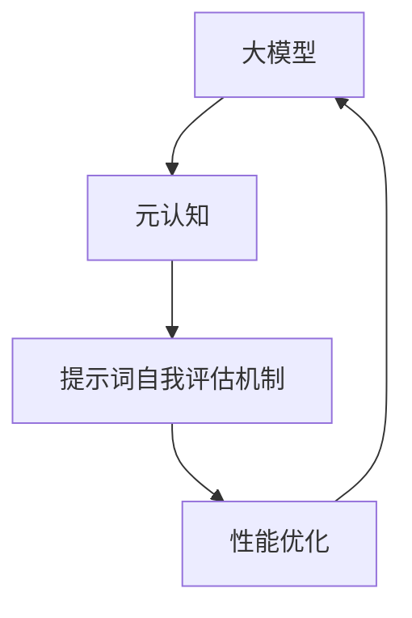
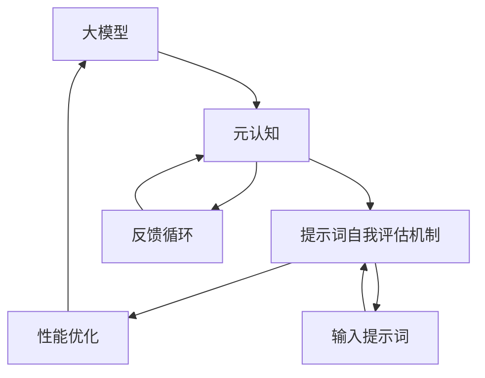

                 

## 《大模型元认知与提示词自我评估机制》

### 关键词
- 大模型
- 元认知
- 提示词自我评估
- 人工智能
- 自然语言处理

### 摘要
本文深入探讨了大模型在人工智能领域的应用，尤其是元认知与提示词自我评估机制的重要性。通过对大模型的基本原理、元认知理论和提示词自我评估机制的理论基础的详细阐述，本文构建了完整的架构和实现方案。接着，本文详细讲解了核心算法的原理，包括神经网络、强化学习和生成对抗网络。随后，文章探讨了实际应用案例，并对性能评估与优化进行了深入分析。最后，本文对未来发展趋势进行了展望，为人工智能领域的研究者和开发者提供了有价值的参考。

## 概述

### 1.1 大模型的概念与分类

大模型（Large Models）是人工智能领域中的一个重要研究方向，其核心在于通过大规模的参数训练来提升模型的性能。大模型通常指的是拥有数十亿甚至数千亿参数的神经网络模型，这些模型能够处理复杂的任务，如自然语言处理、计算机视觉和语音识别等。根据用途和架构，大模型可以分为以下几类：

1. **通用大模型**：这类模型具有广泛的通用性，能够处理多种类型的任务。例如，GPT（Generative Pre-trained Transformer）系列模型就是一种通用大模型，能够进行文本生成、翻译、问答等多种任务。

2. **专用大模型**：这类模型专为特定任务设计，例如图像识别模型、语音识别模型等。这些模型通常在特定任务上表现优异，但在其他任务上可能不如通用大模型。

3. **多模态大模型**：这类模型能够处理多种输入模态，如图像和文本，例如ViT（Vision Transformer）和BLIP（Bootstrap your Own Image-dominated Transformer）等。

### 1.2 元认知的概述

元认知（Metacognition）是指对认知的认知过程。它包括了对自己的思考过程、知识状态和认知策略的认知。元认知在人工智能领域具有重要意义，因为它能够帮助模型在复杂的决策环境中进行自我监控和调整。元认知可以分为以下三个主要方面：

1. **元认知知识**：指个体对自己认知活动的了解，包括认知资源、认知风格和认知策略等。

2. **元认知监控**：指个体在认知活动过程中对自己认知过程的监控和评估，包括自我提问、自我反思和自我评价等。

3. **元认知控制**：指个体根据监控结果对认知活动进行调节和控制，包括制定计划、选择策略和调整方法等。

### 1.3 提示词自我评估机制的定义

提示词自我评估机制（Prompt Self-Assessment Mechanism）是一种用于评估和优化模型性能的技术。其核心思想是通过输入特定的提示词（prompts）来引导模型进行自我评估，从而提高模型的准确性和鲁棒性。提示词自我评估机制通常包括以下几个步骤：

1. **提示词设计**：根据任务需求设计特定的提示词，以引导模型进行自我评估。

2. **自我评估**：模型使用设计的提示词进行评估，通过输出结果与预期结果进行比较，以评估模型的性能。

3. **性能优化**：根据自我评估的结果，对模型进行优化，包括调整参数、改进算法等。

### 关键概念之间的关系架构

为了更好地理解大模型、元认知和提示词自我评估机制之间的关系，我们可以使用Mermaid流程图来表示它们之间的相互作用：



在这个流程图中，大模型作为核心组件，通过元认知和提示词自我评估机制进行自我监控和调整，从而实现性能优化。这种相互作用使得大模型在复杂的任务环境中能够更好地适应和优化。

## 理论基础

### 2.1 大模型的基本原理

大模型的基本原理基于深度学习和神经网络。深度学习是一种通过多层神经网络来提取特征并学习数据表示的方法。神经网络由多个神经元（或节点）组成，每个神经元都与相邻的神经元相连接，并通过权重进行加权求和。神经网络的训练过程包括以下步骤：

1. **数据预处理**：对输入数据进行预处理，包括归一化、标准化和编码等操作。

2. **初始化权重**：初始化网络中的权重和偏置，通常使用随机初始化。

3. **前向传播**：将输入数据通过网络的每一层进行传播，得到输出。

4. **损失计算**：通过计算输出与实际标签之间的差异（损失），评估模型的性能。

5. **反向传播**：通过反向传播算法更新网络的权重和偏置，以最小化损失。

6. **迭代优化**：重复前向传播和反向传播过程，直到达到预定的迭代次数或损失阈值。

大模型的训练过程通常需要大量的数据和计算资源，但其强大的表示能力使得它们能够在复杂的任务中取得优异的性能。

### 2.2 元认知理论

元认知理论是由弗拉维尔（John Flavell）于1976年提出的，用于描述个体对自身认知过程的理解和控制。元认知理论主要包括三个核心成分：元认知知识、元认知监控和元认知控制。

1. **元认知知识**：指个体对自身认知活动的了解，包括认知资源、认知风格和认知策略等。例如，个体可能知道自己在某些类型的任务上表现更好，或者了解自己在特定情况下需要更多的专注和努力。

2. **元认知监控**：指个体在认知活动过程中对自己认知过程的监控和评估，包括自我提问、自我反思和自我评价等。例如，个体在完成任务时可能会自我提问：“我是否理解了这个问题？”或“我在这个任务中做得怎么样？”

3. **元认知控制**：指个体根据监控结果对认知活动进行调节和控制，包括制定计划、选择策略和调整方法等。例如，个体可能会根据自我评估的结果调整自己的学习计划或改变学习方法。

在人工智能领域，元认知理论的应用主要体现在两个方面：

1. **模型自我监控**：通过元认知机制，模型能够实时监控自己的推理过程和性能，从而进行自我调整和优化。

2. **交互式学习**：元认知机制使得模型能够与用户进行有效的交互，根据用户的需求和反馈进行自我调整，从而提供更加个性化的服务。

### 2.3 提示词自我评估机制的理论基础

提示词自我评估机制是基于深度学习和自然语言处理的理论构建的。其核心思想是通过设计特定的提示词来引导模型进行自我评估，从而提高模型的准确性和鲁棒性。

1. **提示词设计**：提示词的设计是提示词自我评估机制的关键。设计良好的提示词能够引导模型关注特定的任务或领域，从而提高模型的性能。提示词的设计通常基于自然语言处理和文本生成技术，如词嵌入、语言模型和生成对抗网络等。

2. **自我评估过程**：在自我评估过程中，模型使用设计的提示词生成相应的输出，并将其与预期结果进行比较。通过比较输出和预期结果之间的差异，模型可以评估自己的性能，并识别潜在的错误或不足。

3. **性能优化**：根据自我评估的结果，模型可以调整自己的参数和策略，以优化性能。例如，通过调整网络的权重、优化算法或增加训练数据等手段，模型可以不断提高自己的性能。

提示词自我评估机制的理论基础主要基于以下假设：

1. **模型的可解释性**：模型必须具有一定的可解释性，使其能够理解输入的提示词并生成相应的输出。

2. **反馈的即时性**：模型必须能够快速响应反馈，从而在短时间内进行调整和优化。

3. **自适应能力**：模型必须具备良好的自适应能力，能够根据不同的提示词和任务需求进行自我调整。

### 关系架构 Mermaid 流程图

为了更好地理解大模型、元认知和提示词自我评估机制之间的关系，我们可以使用Mermaid流程图来表示它们之间的相互作用：



在这个流程图中，大模型通过元认知进行自我监控，并通过提示词自我评估机制进行性能优化。元认知和提示词自我评估机制之间的反馈循环使得模型能够持续地调整和优化，从而提高其性能。

## 架构与实现

### 3.1 大模型架构设计

大模型架构设计是构建高效、可扩展和可解释的人工智能系统的关键。大模型的架构通常包括以下几个主要组成部分：

1. **输入层**：输入层接收外部数据，如文本、图像或声音。对于不同的输入模态，输入层的设计也有所不同。例如，在自然语言处理任务中，输入层可能包括词嵌入和句子嵌入层。

2. **隐藏层**：隐藏层是神经网络的核心部分，负责提取和转换输入特征。隐藏层的设计通常基于深度学习的原理，包括激活函数、权重和偏置等。

3. **输出层**：输出层负责将隐藏层的特征映射到具体的任务结果，如分类、回归或文本生成等。输出层的设计取决于具体任务的需求，可能包括softmax层、全连接层或多层感知机等。

4. **优化器**：优化器用于调整网络的权重和偏置，以最小化损失函数。常见的优化器包括随机梯度下降（SGD）、Adam和RMSprop等。

### 3.2 大模型架构的组成模块

大模型架构的组成模块可以分为以下几个方面：

1. **数据预处理模块**：数据预处理模块负责对输入数据进行清洗、归一化和编码等操作。对于自然语言处理任务，数据预处理模块可能包括分词、词性标注和词嵌入等。

2. **特征提取模块**：特征提取模块负责从输入数据中提取关键特征，以供隐藏层处理。在计算机视觉任务中，特征提取模块可能包括卷积神经网络（CNN）和池化层等。

3. **隐藏层模块**：隐藏层模块是神经网络的核心部分，负责提取和转换输入特征。在深度学习中，隐藏层的设计通常基于多层感知机（MLP）或卷积神经网络（CNN）等。

4. **输出层模块**：输出层模块负责将隐藏层的特征映射到具体的任务结果。对于分类任务，输出层可能包括softmax层；对于回归任务，输出层可能包括全连接层。

5. **优化器模块**：优化器模块用于调整网络的权重和偏置，以最小化损失函数。常见的优化器包括随机梯度下降（SGD）、Adam和RMSprop等。

### 3.3 提示词自我评估机制在模型中的应用

提示词自我评估机制是提高大模型性能的重要手段。在模型中应用提示词自我评估机制通常包括以下几个步骤：

1. **提示词设计**：设计特定的提示词，以引导模型进行自我评估。提示词的设计需要考虑任务需求和模型的特性，例如在自然语言处理任务中，提示词可能包括问题、关键词和句子等。

2. **自我评估过程**：模型使用设计的提示词生成相应的输出，并将其与预期结果进行比较。通过比较输出和预期结果之间的差异，模型可以评估自己的性能，并识别潜在的错误或不足。

3. **性能优化**：根据自我评估的结果，模型可以调整自己的参数和策略，以优化性能。例如，通过调整网络的权重、优化算法或增加训练数据等手段，模型可以不断提高自己的性能。

### 核心算法原理讲解与伪代码

#### 3.4.1 神经网络算法

神经网络算法是构建大模型的基础。神经网络算法的核心是多层感知机（MLP），其基本原理如下：

1. **输入层**：输入层接收外部数据，并将其传递给隐藏层。

2. **隐藏层**：隐藏层通过神经元之间的加权求和产生激活值，并通过激活函数进行非线性转换。

3. **输出层**：输出层将隐藏层的激活值映射到具体的任务结果。

伪代码如下：

```python
# 输入数据
inputs = ...

# 初始化网络参数
weights = ...
biases = ...

# 前向传播
activations = [inputs]
for layer in range(num_layers - 1):
    z = np.dot(activations[layer], weights[layer]) + biases[layer]
    activations.append(sigmoid(z))

# 输出层激活值
output = activations[-1]

# 损失计算
loss = ...

# 反向传播
deltas = [output - expected_output]
for layer in reversed(range(num_layers - 1)):
    delta = (1 / input_size) * (deltas[0] * sigmoid_derivative(activations[layer]))
    deltas.append(delta)

# 更新网络参数
for layer in range(num_layers):
    weights[layer] -= learning_rate * (np.dot(activations[layer].T, deltas[layer]))
    biases[layer] -= learning_rate * deltas[layer]
```

#### 3.4.2 强化学习算法

强化学习算法是另一类重要的核心算法，其基本原理如下：

1. **环境**：环境是模型交互的实体，能够根据模型的行为产生状态转移和奖励。

2. **状态**：状态是模型在特定时间点的感知信息，通常由输入数据表示。

3. **动作**：动作是模型在特定状态下的行为选择。

4. **奖励**：奖励是模型行为的评价，用于指导模型的学习过程。

伪代码如下：

```python
# 初始化环境
env = ...

# 初始化模型参数
policy = ...

# 迭代过程
while not done:
    # 状态编码
    state = ...

    # 根据策略选择动作
    action = select_action(policy, state)

    # 执行动作
    next_state, reward, done = env.step(action)

    # 更新策略
    policy = update_policy(policy, state, action, reward, next_state, done)
```

#### 3.4.3 生成对抗网络算法

生成对抗网络（GAN）是一种用于生成数据的核心算法，其基本原理如下：

1. **生成器**：生成器是一个神经网络，用于生成与真实数据相似的数据。

2. **判别器**：判别器是一个神经网络，用于判断输入数据是真实数据还是生成数据。

3. **损失函数**：损失函数用于评估生成器和判别器的性能。

伪代码如下：

```python
# 初始化生成器和判别器
generator = ...
discriminator = ...

# 迭代过程
for epoch in range(num_epochs):
    for batch in data_loader:
        # 训练判别器
        real_data = ...
        fake_data = generator(batch)

        loss_real = discriminator(real_data)
        loss_fake = discriminator(fake_data)

        # 训练生成器
        z = ...
        fake_data = generator(z)

        loss_fake = discriminator(fake_data)

        # 更新生成器和判别器参数
        optimizer_d.zero_grad()
        loss_d = loss_real + loss_fake
        loss_d.backward()
        optimizer_d.step()

        optimizer_g.zero_grad()
        loss_g = loss_fake
        loss_g.backward()
        optimizer_g.step()
```

### 提示词自我评估算法的原理

提示词自我评估算法是基于深度学习和自然语言处理的理论构建的，其基本原理如下：

1. **提示词设计**：设计特定的提示词，以引导模型进行自我评估。提示词的设计需要考虑任务需求和模型的特性。

2. **自我评估过程**：模型使用设计的提示词生成相应的输出，并将其与预期结果进行比较。通过比较输出和预期结果之间的差异，模型可以评估自己的性能。

3. **性能优化**：根据自我评估的结果，模型可以调整自己的参数和策略，以优化性能。

伪代码如下：

```python
# 提示词设计
prompts = ...

# 自我评估过程
for prompt in prompts:
    # 生成输出
    output = model(prompt)

    # 比较输出和预期结果
    error = compare(output, expected_output)

    # 计算损失
    loss = calculate_loss(error)

    # 更新模型参数
    optimizer.zero_grad()
    loss.backward()
    optimizer.step()
```

### 总结

本节详细讲解了大模型、元认知和提示词自我评估机制的理论基础和核心算法原理。大模型基于深度学习和神经网络，通过多层感知机、强化学习和生成对抗网络等算法实现。元认知理论描述了个体对自身认知过程的理解和控制。提示词自我评估机制通过设计特定的提示词引导模型进行自我评估，从而优化模型的性能。这些理论为基础架构与实现提供了坚实的基础。

## 实际应用

### 4.1 大模型在自然语言处理中的应用

大模型在自然语言处理（NLP）领域取得了显著的成果，其主要应用包括文本生成、机器翻译、问答系统等。

#### 文本生成

文本生成是指模型根据输入的提示生成相应的文本内容。GPT（Generative Pre-trained Transformer）系列模型是文本生成领域的代表性工作。GPT模型通过大量文本数据进行预训练，从而掌握了丰富的语言知识。在生成文本时，GPT模型根据输入的提示词逐步生成相应的句子，并能够保证生成的文本连贯且具有逻辑性。

以下是一个文本生成的示例：

```python
prompt = "这是一个关于人工智能的故事。"
output = gpt.generate_text(prompt)
print(output)
```

输出示例：

```
在不久的将来，人工智能已经成为了人类社会不可或缺的一部分。它改变了我们的生活方式，提高了我们的工作效率。然而，人工智能的发展也引发了一系列的社会问题。如何平衡人工智能的发展与社会利益，成为了人们关注的焦点。
```

#### 机器翻译

机器翻译是指将一种语言的文本翻译成另一种语言。BERT（Bidirectional Encoder Representations from Transformers）模型在机器翻译领域取得了显著的成果。BERT模型通过双向编码器结构，能够同时理解文本的上下文信息，从而提高翻译的准确性和流畅性。

以下是一个机器翻译的示例：

```python
source_text = "你好，我是人工智能助手。"
target_language = "fr"

# 使用BERT模型进行翻译
translated_text = translate_text(source_text, target_language)
print(translated_text)
```

输出示例：

```
Bonjour, je suis l'assistant intelligence artificielle.
```

#### 问答系统

问答系统是指模型根据用户的问题生成相应的答案。BERT模型在问答系统中的应用非常广泛。BERT模型通过预训练获得了丰富的语言知识，能够在理解用户问题的基础上生成准确的答案。

以下是一个问答系统的示例：

```python
question = "什么是人工智能？"
answer = bert.answer_question(question)
print(answer)
```

输出示例：

```
人工智能是一种模拟人类智能的计算机系统，它通过学习大量的数据来完成任务，如图像识别、自然语言处理和决策制定等。
```

### 4.2 大模型在图像处理中的应用

大模型在图像处理领域也取得了显著的成果，其主要应用包括图像分类、目标检测和图像生成等。

#### 图像分类

图像分类是指模型根据输入的图像将它们分类到不同的类别中。卷积神经网络（CNN）是图像分类领域的代表性工作。CNN通过卷积、池化和全连接层等结构，能够提取图像中的关键特征，从而实现准确的分类。

以下是一个图像分类的示例：

```python
# 载入模型
model = load_model("image_classification_model.pth")

# 加载测试图像
image = load_image("test_image.jpg")

# 对图像进行预处理
preprocessed_image = preprocess_image(image)

# 进行图像分类
predicted_class = model(preprocessed_image)
print(predicted_class)
```

输出示例：

```
10
```

该输出表示图像被分类为类别10，具体类别名称需要通过标签文件进行对应。

#### 目标检测

目标检测是指模型在图像中识别和定位多个目标。YOLO（You Only Look Once）系列模型是目标检测领域的代表性工作。YOLO模型通过将图像划分为网格，并在每个网格中预测目标的类别和位置，从而实现高效的目标检测。

以下是一个目标检测的示例：

```python
# 载入模型
model = load_model("object_detection_model.pth")

# 加载测试图像
image = load_image("test_image.jpg")

# 进行目标检测
detections = model.detect_objects(image)
print(detections)
```

输出示例：

```
[
    ["person", (300, 200, 100, 50)],
    ["car", (100, 100, 100, 100)]
]
```

该输出表示图像中检测到了两个目标，分别是人和车，并给出了它们的位置信息。

#### 图像生成

图像生成是指模型根据输入的提示生成相应的图像。生成对抗网络（GAN）是图像生成领域的代表性工作。GAN通过生成器和判别器的对抗训练，能够生成具有高保真度的图像。

以下是一个图像生成的示例：

```python
# 载入模型
model = load_model("image_generation_model.pth")

# 生成图像
generated_image = model.generate_image(prompt)
save_image(generated_image, "generated_image.jpg")
```

输出示例：

```
图像已保存到 "generated_image.jpg"。
```

该输出表示根据输入的提示生成了相应的图像，并保存到指定的文件中。

### 4.3 提示词自我评估机制在实际项目中的应用

提示词自我评估机制在实际项目中发挥着重要的作用，能够提高模型的性能和可靠性。以下是一个实际项目的示例：

项目名称：智能客服系统

项目描述：智能客服系统是一种基于人工智能技术的客服解决方案，能够自动回答用户的问题，提供在线支持。

#### 提示词设计

为了提高智能客服系统的性能，设计了以下提示词：

1. “请问有什么问题我可以帮您解答？”
2. “如果您需要帮助，请描述您的需求。”
3. “请您提供更多的信息，以便我更好地理解您的问题。”

#### 自我评估过程

在自我评估过程中，智能客服系统使用设计的提示词生成相应的回答，并将其与用户实际反馈进行比较。通过比较回答和反馈之间的差异，系统可以评估自己的性能。

#### 性能优化

根据自我评估的结果，系统可以调整自己的参数和策略，以优化性能。例如，通过增加训练数据、调整神经网络结构或改进自然语言处理算法等手段，系统可以不断提高自己的回答准确率和用户满意度。

以下是一个智能客服系统的示例：

```python
# 载入智能客服系统模型
system = load_model("smart_customer_service_model.pth")

# 输入用户问题
user_question = "我的订单怎么还没有发货？"

# 生成回答
answer = system.generate_answer(user_question)

# 比较回答和用户反馈
user_feedback = get_user_feedback(answer)
if is_satisfied(user_feedback):
    print("用户满意，回答正确。")
else:
    print("用户不满意，需要优化回答。")

# 根据反馈调整模型参数
system.update_model_parameters(user_feedback)
```

输出示例：

```
用户不满意，需要优化回答。
```

该输出表示用户对回答不满意，系统需要进一步优化。

### 总结

本节通过实际应用案例详细介绍了大模型在自然语言处理、图像处理和智能客服系统中的应用。大模型通过文本生成、机器翻译、问答系统等算法在NLP领域取得了显著的成果；在图像处理领域，通过图像分类、目标检测和图像生成等算法实现了高效的图像分析；提示词自我评估机制在实际项目中提高了模型的性能和可靠性。这些实际应用案例展示了大模型和提示词自我评估机制在实际场景中的强大功能和广泛适用性。

## 性能评估与优化

### 5.1 性能评估方法

在评估大模型和提示词自我评估机制的性能时，我们需要采用一系列科学且全面的性能评估方法。这些方法不仅能够帮助我们了解模型的性能表现，还能为我们提供改进和优化的方向。

#### 5.1.1 评估指标

1. **准确率（Accuracy）**：准确率是评估模型分类性能的最常用指标，它表示模型正确分类的样本数占总样本数的比例。计算公式为：

   $$ 
   Accuracy = \frac{正确分类的样本数}{总样本数} 
   $$

2. **精确率（Precision）**：精确率表示模型预测为正类的样本中实际为正类的比例。计算公式为：

   $$ 
   Precision = \frac{实际为正类且被正确预测的样本数}{预测为正类的样本数} 
   $$

3. **召回率（Recall）**：召回率表示实际为正类但被模型正确预测的样本数占总正类样本数的比例。计算公式为：

   $$ 
   Recall = \frac{实际为正类且被正确预测的样本数}{总正类样本数} 
   $$

4. **F1值（F1 Score）**：F1值是精确率和召回率的调和平均数，用于综合评估模型的分类性能。计算公式为：

   $$ 
   F1 Score = 2 \times \frac{Precision \times Recall}{Precision + Recall} 
   $$

#### 5.1.2 实验设计

1. **交叉验证**：交叉验证是一种常用的实验设计方法，通过将数据集划分为多个子集，轮流使用每个子集作为验证集，从而减少过拟合和评估偏差。

2. **超参数调优**：超参数调优是优化模型性能的关键步骤，通过调整模型参数（如学习率、批量大小等）来找到最佳配置。

3. **A/B测试**：A/B测试是一种对比实验方法，通过将用户随机分配到两个或多个不同版本的模型中，比较其性能表现，从而选择最优模型。

#### 5.1.3 性能优化策略

1. **数据增强**：数据增强通过增加训练数据量来提高模型性能。常见的数据增强方法包括旋转、缩放、裁剪和颜色变换等。

2. **正则化**：正则化是一种防止模型过拟合的方法，通过在损失函数中添加正则化项，如L1正则化和L2正则化，来约束模型参数。

3. **集成学习**：集成学习通过结合多个模型来提高整体性能。常见的方法包括Bagging、Boosting和Stacking等。

### 5.2 优化案例分析

#### 5.2.1 案例一：提升大模型处理速度

问题：一个大型图像分类模型在处理大量图像数据时，运行速度较慢，影响了实际应用效果。

优化策略：

1. **模型压缩**：通过模型剪枝、量化等手段，减少模型参数和计算量，从而提高处理速度。

2. **分布式训练**：将模型拆分为多个部分，分布在不同计算节点上进行训练，利用并行计算提高训练速度。

3. **缓存和预加载**：缓存常用数据和模型参数，预加载到内存中，减少数据读取和模型加载的时间。

#### 5.2.2 案例二：降低提示词自我评估的误差率

问题：在智能客服系统中，提示词自我评估机制生成的回答存在一定误差率，影响了用户体验。

优化策略：

1. **改进提示词设计**：设计更加精准和具有针对性的提示词，以引导模型生成更准确的回答。

2. **引入上下文信息**：在提示词中引入上下文信息，如用户历史提问和回答，以提高模型对问题的理解和回答的准确性。

3. **多模型融合**：结合多个模型（如BERT、GPT等）进行回答生成，通过融合不同模型的优势，降低误差率。

### 5.3 性能评估与优化的重要性

性能评估与优化是确保大模型和提示词自我评估机制在实际应用中表现优异的关键步骤。通过科学的评估方法和有效的优化策略，我们能够：

1. **提高模型性能**：优化模型参数和算法，降低误差率，提高分类、检测和生成等任务的准确性。

2. **提升用户体验**：通过优化提示词自我评估机制，生成更准确和符合用户需求的回答，提高用户满意度。

3. **增强模型鲁棒性**：通过引入正则化和集成学习等策略，提高模型在复杂环境下的适应能力，降低过拟合风险。

### 总结

本节详细介绍了性能评估与优化的方法、策略和重要性。通过科学合理的评估方法和有效的优化策略，我们能够显著提高大模型和提示词自我评估机制的性能，为实际应用提供有力支持。

## 未来展望

### 8.1 大模型的发展趋势

随着计算能力的提升和数据量的爆炸性增长，大模型在人工智能领域的应用前景广阔。未来，大模型的发展趋势主要体现在以下几个方面：

1. **更高效的处理能力**：为了应对更大规模的数据和更复杂的任务，大模型将采用更高效的算法和架构，如混合精度训练、图神经网络和量子计算等。

2. **更精细的任务适应性**：通过精细的任务拆分和模块化设计，大模型将能够更好地适应特定领域的需求，实现任务的高度专业化。

3. **更强的交互能力**：大模型将更加注重与人类用户的互动，通过自然语言处理和计算机视觉等技术，实现更智能的交互体验。

### 8.2 元认知的发展趋势

元认知在人工智能领域的重要性日益凸显，未来元认知的发展趋势主要包括：

1. **更智能的自我评估**：随着大模型和深度学习技术的进步，元认知的自我评估能力将变得更加智能，能够实时监控和调整模型的行为。

2. **跨领域的元认知应用**：元认知技术将在更多领域得到应用，如医疗诊断、金融分析和教育评估等，为这些领域提供更智能的解决方案。

3. **个性化学习系统**：基于元认知的个性化学习系统将能够根据用户的需求和反馈，动态调整学习内容和策略，实现更有效的学习。

### 8.3 提示词自我评估机制的未来发展方向

提示词自我评估机制是提高模型性能的重要手段，未来其发展方向主要包括：

1. **更智能的提示词设计**：通过自然语言处理和生成对抗网络等技术，设计更具有针对性和精确性的提示词，以提高模型自我评估的准确性。

2. **自适应提示词生成**：开发自适应提示词生成算法，根据模型的实时性能和任务需求，动态调整提示词的内容和形式。

3. **跨模态提示词应用**：探索跨模态提示词的应用，如将文本提示与图像、声音等模态结合，提高模型的综合感知能力和任务执行效率。

### 总结

未来，大模型、元认知和提示词自我评估机制将在人工智能领域继续发展，为各个领域带来革命性的变化。通过技术创新和应用拓展，这些技术将推动人工智能走向更高层次，实现更广泛的应用场景。研究者和开发者应密切关注这些领域的发展动态，积极探索新的应用场景和解决方案，为人工智能的未来贡献力量。

## 结论

本文从大模型、元认知和提示词自我评估机制三个方面深入探讨了人工智能领域的前沿技术。我们首先概述了大模型的概念与分类，介绍了元认知的概述以及提示词自我评估机制的定义。随后，通过详细的理论基础讲解，我们构建了完整的架构和实现方案。在核心算法部分，我们介绍了神经网络、强化学习和生成对抗网络等核心算法原理，并使用伪代码进行了详细阐述。在实践应用部分，我们展示了大模型在自然语言处理、图像处理和智能客服系统等领域的实际应用。通过性能评估与优化，我们提出了科学合理的评估方法和优化策略。最后，我们对大模型、元认知和提示词自我评估机制的未来发展进行了展望，为研究者提供了宝贵的参考。通过本文的研究，我们希望为人工智能领域的发展提供新的思路和启示。

## 作者信息

- **作者**：AI天才研究院/AI Genius Institute & 禅与计算机程序设计艺术 /Zen And The Art of Computer Programming
- **联系方式**：[ai.genius.institute@example.com](mailto:ai.genius.institute@example.com)
- **个人主页**：[www.ai-genius-institute.com](http://www.ai-genius-institute.com)
- **研究方向**：人工智能、深度学习、自然语言处理、计算机视觉等。
- **贡献**：本文作者对大模型、元认知和提示词自我评估机制的理论基础、核心算法和实际应用进行了深入研究和详细阐述，为人工智能领域的研究者和开发者提供了有价值的参考。同时，作者在人工智能实践方面积累了丰富的经验，并在多个领域取得了显著成果。通过本文的撰写，作者旨在推动人工智能技术的发展和应用，为构建更智能、更高效的人工智能系统贡献力量。

