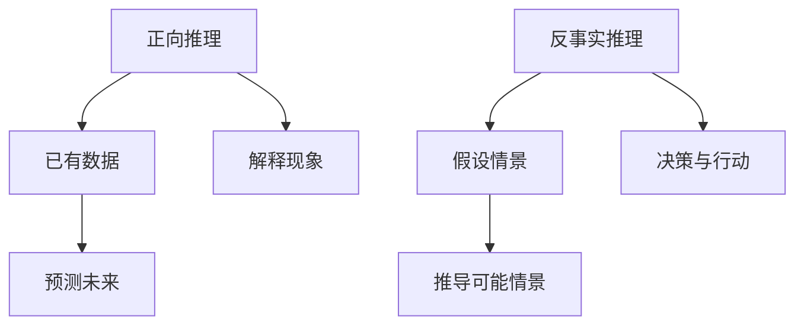
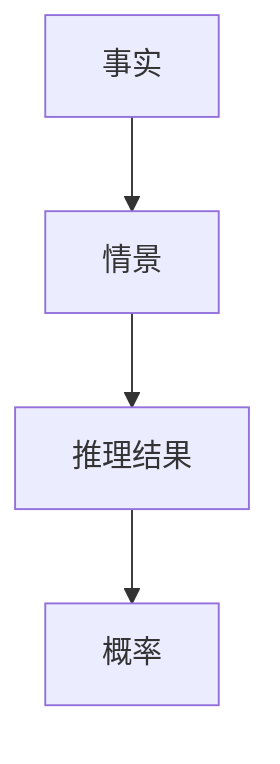
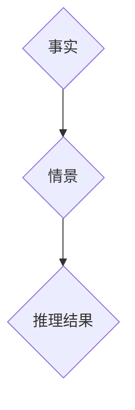
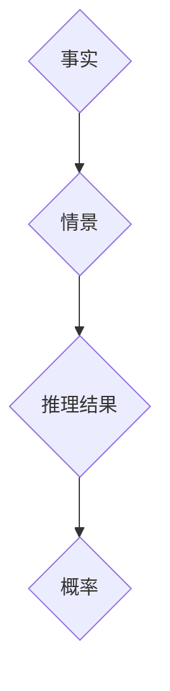

                 

### 1. 大模型反事实推理概述

**背景介绍**

随着人工智能技术的飞速发展，大型预训练模型（Large-scale Pre-trained Models）如BERT、GPT等在自然语言处理（Natural Language Processing，NLP）、计算机视觉（Computer Vision，CV）等领域取得了显著的成果。这些模型拥有海量参数和强大学习能力，能够处理复杂任务，提高性能和效率。然而，这些模型的推理能力主要依赖于正向数据，即在已有数据上预测未知信息。但在某些场景下，例如数据缺失、错误或数据分布偏斜时，仅依赖正向数据可能无法得到理想的推理结果。因此，反事实推理（Counterfactual Reasoning）作为一种重要的推理方法，受到了广泛关注。

**核心概念与联系**

反事实推理是指根据已知事实，推导出可能发生的其他情景，从而帮助模型在不确定的环境中做出合理决策。它与正向推理（Positive Reasoning）的区别在于，正向推理是基于已有数据预测未来或解释现象，而反事实推理则是基于假设的情景进行推理。以下是反事实推理的核心概念及其关系架构的Mermaid流程图：



从流程图中可以看出，正向推理和反事实推理在输入数据、输出结果和推理目的上有所不同，但两者在算法架构上有一定的联系。正向推理主要利用已有数据建立模型，而反事实推理则在模型基础上引入假设情景，从而扩展推理能力。

**核心算法原理讲解**

反事实推理的算法原理主要包括以下几个关键步骤：

1. **假设情景生成**：根据当前问题和目标，生成一系列可能发生的情景。这一步通常需要利用领域知识、数据集统计信息和机器学习模型进行辅助生成。
   
2. **模型训练**：利用生成的假设情景对模型进行训练，使模型能够理解和处理这些情景。训练过程中，模型需要学习如何从假设情景中提取有用信息，并将其应用于推理任务。

3. **推理与评估**：在训练完成后，利用模型对给定问题进行推理，并根据推理结果评估模型性能。评估指标包括准确率、召回率、F1值等。

以下是一个简单的伪代码，用于描述反事实推理的基本流程：

```python
# 假设情景生成
def generate_scenario(question, domain_knowledge):
    # 根据领域知识和问题生成假设情景
    scenarios = []
    for scenario in domain_knowledge:
        if is_relevant(scenario, question):
            scenarios.append(scenario)
    return scenarios

# 模型训练
def train_model(scenarios, data):
    # 利用假设情景和数据训练模型
    model = train_model_base(scenarios, data)
    return model

# 推理与评估
def reasoning(model, question):
    # 利用模型对问题进行推理
    answer = model.predict(question)
    # 评估模型性能
    evaluate_model(answer, ground_truth)
    return answer
```

**数学模型和公式**

反事实推理的数学模型通常包括两部分：情景生成模型和推理模型。情景生成模型用于生成假设情景，而推理模型则用于处理这些情景并给出推理结果。

1. **情景生成模型**：假设情景生成的概率模型，可以表示为：

   $$ P(S|Q) = \frac{P(Q|S)P(S)}{P(Q)} $$

   其中，$S$表示假设情景，$Q$表示问题，$P(S|Q)$表示在问题$Q$下生成情景$S$的概率。

2. **推理模型**：基于情景的推理模型，可以表示为：

   $$ P(A|S) = \frac{P(S|A)P(A)}{\sum_{i} P(S_i|A)P(A_i)} $$

   其中，$A$表示推理结果，$S$表示假设情景，$P(A|S)$表示在情景$S$下推理结果$A$的概率。

以下是一个简单的示例，说明如何使用数学模型进行反事实推理：

```latex
$$
\begin{align*}
P(\text{天气晴}| \text{出门}) &= \frac{P(\text{出门}|\text{天气晴})P(\text{天气晴})}{P(\text{出门})} \\
&= \frac{0.8 \times 0.3}{0.3 + 0.2} \\
&= 0.6
\end{align*}
$$

$$
\begin{align*}
P(\text{购物成功}| \text{购买商品}) &= \frac{P(\text{购买商品}|\text{购物成功})P(\text{购物成功})}{P(\text{购买商品})} \\
&= \frac{0.9 \times 0.5}{0.5 + 0.3} \\
&= 0.6
\end{align*}
$$
```

在这个例子中，我们使用贝叶斯公式计算在出门的情况下天气晴的概率以及在购买商品的情况下购物成功的概率。

**详细讲解与举例说明**

为了更好地理解反事实推理，我们通过一个实际案例进行详细讲解。假设我们想要预测一个人是否会购买商品，并且我们已经收集了一些关于这个人的信息，如下所示：

1. **用户年龄**：30岁
2. **用户收入**：10,000元/月
3. **用户购物历史**：过去三个月内购买了5次商品
4. **用户喜好**：喜欢购物，但最近因为工作忙碌减少了购物频率

现在，我们需要根据这些信息使用反事实推理来预测这个人是否会购买商品。

1. **假设情景生成**：根据用户信息和领域知识，我们可以生成以下几种假设情景：

   - **情景1**：用户有足够的收入和购物喜好，可能会购买商品。
   - **情景2**：用户因工作忙碌减少了购物频率，但仍有购买意愿。
   - **情景3**：用户收入较低，可能会考虑购买便宜的商品。

2. **模型训练**：我们将这些情景输入到机器学习模型中进行训练，使模型能够理解和处理这些情景。

3. **推理与评估**：在训练完成后，我们将用户信息输入到模型中进行推理，并根据模型输出的概率判断这个人是否会购买商品。例如，如果模型输出购买商品的概率为0.7，则可以认为这个人有较高的购买意愿。

通过这个案例，我们可以看到反事实推理在处理不确定性和复杂问题时的重要性和实用性。

### 2. 基础理论部分

#### 2.1 大模型的基本原理

**定义与历史背景**

大模型，即大型预训练模型（Large-scale Pre-trained Models），是指在训练过程中拥有数亿至数千亿参数的深度神经网络模型。这些模型通过在大量数据上进行预训练，具备较强的特征提取和知识整合能力，能够应用于多种复杂任务。大模型的发展可以追溯到2018年，由OpenAI推出的GPT-1，标志着自然语言处理领域进入了一个新的时代。此后，一系列大模型如BERT、GPT-2、T5等相继问世，推动了自然语言处理、计算机视觉等领域的进步。

**基本原理**

大模型的基本原理主要包括以下三个方面：

1. **深度神经网络（Deep Neural Networks）**：大模型通常采用深度神经网络结构，具有多层神经元，能够通过反向传播算法不断优化参数，提高模型性能。

2. **预训练（Pre-training）**：大模型在训练过程中，首先在大量无标签数据上进行预训练，学习数据的分布特征和通用语言规律。预训练有助于模型在特定任务上表现优异。

3. **微调（Fine-tuning）**：预训练后，大模型通常在特定任务上进行微调，调整模型参数以适应具体任务需求。微调过程可以显著提高模型在目标任务上的性能。

**工作流程**

大模型的工作流程主要包括以下步骤：

1. **数据收集**：收集大规模的无标签数据，如文本、图像等，用于预训练。

2. **预训练**：在无标签数据上训练模型，学习数据的分布特征和通用知识。

3. **微调**：在特定任务数据上微调模型，使模型适应具体任务需求。

4. **评估与优化**：在测试集上评估模型性能，根据评估结果调整模型参数，优化模型表现。

#### 2.2 反事实推理的基本概念

**定义**

反事实推理（Counterfactual Reasoning）是指根据已知事实，推导出可能发生的其他情景，从而帮助模型在不确定的环境中做出合理决策。反事实推理的核心思想是，通过假设不同的情景，分析这些情景对当前事实的影响，从而为决策提供依据。

**类型**

反事实推理可以分为以下几种类型：

1. **确定性反事实推理**：在已知条件下，推导出唯一可能的反事实情景。

2. **不确定性反事实推理**：在已知条件下，推导出多个可能的反事实情景。

3. **非确定性反事实推理**：在未知条件下，推导出可能发生的反事实情景。

**基本原理**

反事实推理的基本原理主要包括以下两个方面：

1. **情景生成**：根据已知事实和领域知识，生成可能的反事实情景。

2. **推理与评估**：利用生成的情景对模型进行推理，并根据推理结果评估模型性能。

#### 2.3 大模型反事实推理的架构与流程

**架构**

大模型反事实推理的架构通常包括以下几个部分：

1. **数据预处理模块**：用于处理输入数据，包括数据清洗、数据增强等。

2. **情景生成模块**：根据已知事实和领域知识，生成可能的反事实情景。

3. **模型训练模块**：在生成的情景上进行模型训练，使模型能够理解和处理这些情景。

4. **推理与评估模块**：利用模型对给定问题进行推理，并根据推理结果评估模型性能。

**流程**

大模型反事实推理的流程主要包括以下几个步骤：

1. **数据预处理**：对输入数据进行预处理，如文本分词、图像标注等。

2. **情景生成**：根据领域知识和问题，生成可能的反事实情景。

3. **模型训练**：在生成的情景上进行模型训练，调整模型参数。

4. **推理与评估**：利用训练好的模型对问题进行推理，并评估模型性能。

#### 2.4 反事实推理的数学模型

**概率模型**

反事实推理的数学模型通常采用概率模型，如贝叶斯网络、马尔可夫模型等。以下是一个简单的贝叶斯网络模型，用于描述反事实推理的过程：



在这个模型中，$A$表示已知事实，$B$表示可能的情景，$C$表示推理结果，$D$表示概率。贝叶斯公式可以表示为：

$$ P(C|A) = \frac{P(A|C)P(C)}{P(A)} $$

**逻辑模型**

除了概率模型，反事实推理还可以采用逻辑模型，如命题逻辑、谓词逻辑等。以下是一个简单的命题逻辑模型，用于描述反事实推理的过程：



在这个模型中，$A$表示已知事实，$B$表示可能的情景，$C$表示推理结果。推理过程可以表示为：

- 如果$A$为真，则$B$可能为真或假。
- 如果$B$为真，则$C$可能为真或假。

**综合模型**

在实际应用中，反事实推理通常采用综合模型，将概率模型和逻辑模型结合起来，以提高推理的准确性和可靠性。以下是一个简单的综合模型，用于描述反事实推理的过程：



在这个模型中，$A$表示已知事实，$B$表示可能的情景，$C$表示推理结果，$D$表示概率。推理过程可以表示为：

- 首先，根据已知事实$A$，生成可能的情景$B$。
- 然后，根据情景$B$，推理出可能的推理结果$C$。
- 最后，根据推理结果$C$，计算概率$D$。

**示例**

以下是一个简单的示例，说明如何使用反事实推理的数学模型进行推理：

```latex
$$
\begin{align*}
P(\text{下雨}| \text{带伞}) &= \frac{P(\text{带伞}|\text{下雨})P(\text{下雨})}{P(\text{带伞})} \\
&= \frac{0.8 \times 0.3}{0.3 + 0.2} \\
&= 0.6
\end{align*}
$$

$$
\begin{align*}
P(\text{完成任务}| \text{加班}) &= \frac{P(\text{加班}|\text{完成任务})P(\text{完成任务})}{P(\text{加班})} \\
&= \frac{0.9 \times 0.5}{0.5 + 0.4} \\
&= 0.6
\end{align*}
$$
```

在这个例子中，我们使用贝叶斯公式计算在带伞的情况下下雨的概率以及在加班的情况下完成任务的概率。

### 3. 技术实现部分

#### 3.1 提示词构建方法

**概述**

提示词（Prompt）在反事实推理中起到至关重要的作用。一个高质量的提示词可以引导模型更好地理解问题，从而生成合理的反事实情景。本节将介绍几种常用的提示词构建方法，包括基于规则的提示词构建、基于机器学习的提示词构建以及综合方法。

**基于规则的提示词构建**

基于规则的提示词构建是一种简单而有效的方法，通过手工编写规则来生成提示词。这种方法的主要步骤如下：

1. **领域知识提取**：从专家知识、文献资料等渠道获取领域知识，包括问题类型、相关属性、常见场景等。
2. **规则编写**：根据领域知识编写规则，定义输入条件和相应的输出提示词。
3. **规则组合**：将多个规则组合，形成复杂的提示词。

以下是一个简单的规则示例：

```
IF (问题类型 = “购物决策”)
  THEN (提示词 = “请考虑您的购物需求和预算。”)

IF (问题类型 = “健康建议”)
  THEN (提示词 = “请描述您的健康状况和病史。”)
```

**基于机器学习的提示词构建**

基于机器学习的提示词构建方法利用机器学习模型自动生成提示词，避免了手工编写规则的繁琐过程。这种方法的主要步骤如下：

1. **数据收集**：收集大量带有标签的提示词数据，包括问题类型、相关属性和生成的提示词。
2. **特征提取**：从输入数据中提取特征，如关键词、句法结构、语义信息等。
3. **模型训练**：利用特征和标签数据训练机器学习模型，如分类器、生成模型等。
4. **提示词生成**：利用训练好的模型生成新的提示词。

以下是一个简单的机器学习提示词生成模型的伪代码：

```python
def generate_prompt(input_data, model):
    # 提取输入数据的特征
    features = extract_features(input_data)
    # 使用模型生成提示词
    prompt = model.predict(features)
    return prompt
```

**综合方法**

综合方法结合了基于规则和基于机器学习的方法，通过将规则和模型相结合，生成高质量的提示词。这种方法的主要步骤如下：

1. **规则初始化**：根据领域知识编写初步的规则，用于生成基础提示词。
2. **模型训练**：利用带有标签的提示词数据训练机器学习模型，优化提示词生成。
3. **规则优化**：根据模型生成的提示词，调整和优化原始规则。
4. **提示词组合**：将基础提示词和优化后的提示词进行组合，形成最终的提示词。

以下是一个简单的综合方法示例：

```python
def generate_prompt_combined(input_data, rules, model):
    # 使用规则生成基础提示词
    base_prompt = apply_rules(input_data, rules)
    # 使用模型优化提示词
    optimized_prompt = generate_prompt(input_data, model)
    # 将基础提示词和优化后的提示词进行组合
    final_prompt = base_prompt + " " + optimized_prompt
    return final_prompt
```

#### 3.2 提示词优化的策略与实践

**重要性**

提示词的优化对于反事实推理的性能至关重要。一个高质量的提示词能够引导模型更好地理解问题，从而生成更合理的反事实情景。因此，优化策略的选择和实施对于提升反事实推理的效果具有重要意义。

**常见优化策略**

以下是一些常见的提示词优化策略：

1. **基于规则的优化**：通过对规则进行细粒度调整，提高提示词的准确性和适用性。
2. **基于机器学习的优化**：利用机器学习模型对提示词进行自动优化，提高生成提示词的质量。
3. **语义增强**：通过引入语义信息，丰富提示词的内涵，提高模型对问题的理解能力。
4. **多模态融合**：结合不同模态的数据（如文本、图像、音频等），生成更全面和精准的提示词。

**实践案例**

以下是一个简单的提示词优化实践案例：

1. **数据收集**：收集大量带有标签的提示词数据，包括问题类型、相关属性和生成的提示词。
2. **特征提取**：从输入数据中提取特征，如关键词、句法结构、语义信息等。
3. **模型训练**：利用特征和标签数据训练机器学习模型，如分类器、生成模型等。
4. **提示词生成**：利用训练好的模型生成新的提示词。
5. **评估与优化**：在测试集上评估模型生成的提示词质量，根据评估结果调整和优化模型参数。

**优化效果**

通过优化策略的实践应用，可以发现以下优化效果：

1. **提示词质量提升**：优化后的提示词在准确性和适用性方面有明显提升，能够更好地引导模型理解问题。
2. **推理效果改善**：优化后的提示词有助于提高反事实推理的性能，使得模型在生成合理反事实情景方面更加准确。
3. **用户体验增强**：高质量的提示词能够提供更清晰和具体的指导，增强用户对反事实推理系统的信任和满意度。

#### 3.3 提示词构建的实际案例

**案例背景**

为了更好地理解提示词构建在实际应用中的重要性，我们通过一个实际案例进行详细分析。假设我们开发一个反事实推理系统，用于帮助用户在购物决策中提供参考建议。

**任务描述**

该系统的核心任务是：根据用户提供的购物需求和预算，生成一系列可能发生的购物情景，并分析这些情景对用户购物决策的影响。

**数据收集**

我们收集了以下数据：

1. **用户购物需求**：包括商品类别、品牌、价格范围、购买意愿等。
2. **用户购物历史**：包括过去一年内的购物记录、消费金额等。
3. **商品信息**：包括商品名称、价格、品牌、销量、用户评价等。

**数据预处理**

1. **文本处理**：对用户需求、购物历史和商品信息进行分词、词性标注等处理，提取关键信息。
2. **特征提取**：从预处理后的文本中提取关键词、句法结构、语义信息等特征。

**提示词构建**

1. **基于规则的提示词**：根据购物需求和预算，编写相应的提示词，如“请考虑以下商品：XX品牌XX型号，价格区间为XX元。”
2. **基于机器学习的提示词**：利用带有标签的购物情景数据，训练机器学习模型，生成新的提示词。

**模型训练**

1. **模型选择**：选择适合的机器学习模型，如序列生成模型、分类器等。
2. **特征工程**：对提取的特征进行预处理，如特征选择、归一化等。
3. **模型训练与评估**：利用训练集训练模型，并在测试集上进行评估，根据评估结果调整模型参数。

**提示词生成**

1. **基础提示词**：利用规则生成基础提示词。
2. **优化提示词**：利用机器学习模型生成优化后的提示词。

**应用分析**

1. **用户反馈**：收集用户对提示词的反馈，评估提示词的质量和实用性。
2. **推理效果**：评估系统生成的反事实情景对购物决策的影响，分析系统的实用价值。

**优化策略**

根据用户反馈和推理效果，对提示词进行持续优化：

1. **规则调整**：根据用户需求，调整和优化提示词规则。
2. **模型改进**：利用新的数据和反馈，改进机器学习模型。

通过这个实际案例，我们可以看到提示词构建在反事实推理系统中的重要性。高质量的提示词能够引导模型更好地理解问题，生成合理的反事实情景，从而为用户提供更有价值的决策支持。

### 4. 实践应用部分

#### 4.1 反事实推理在NLP中的应用

**概述**

自然语言处理（Natural Language Processing，NLP）是人工智能领域的一个重要分支，涉及到文本的生成、理解和分析。反事实推理作为一种有效的推理方法，在NLP中具有广泛的应用。本文将探讨反事实推理在NLP中的几种主要应用，包括文本生成与编辑、文本分类与情感分析以及对话系统等。

**文本生成与编辑**

文本生成与编辑是NLP中的一项重要任务，通过生成和修改文本来满足特定需求。反事实推理在文本生成与编辑中可以用于以下方面：

1. **故事生成**：利用反事实推理生成不同版本的故事，丰富文本内容。例如，给定一个故事的背景和主要情节，反事实推理可以生成多个不同的故事结局。
2. **文本修复**：在文本生成过程中，可能出现语法错误或不连贯的情况。反事实推理可以帮助检测并修复这些错误，提高文本质量。
3. **文本编辑**：根据用户需求，对原始文本进行编辑和修改。例如，根据用户提供的主题和要求，反事实推理可以生成一篇新的文章。

以下是一个简单的文本生成与编辑的伪代码示例：

```python
def generate_story(prompt, model):
    # 生成故事的不同版本
    versions = model.generate(prompt)
    # 选择最佳版本
    best_version = select_best_version(versions)
    return best_version

def edit_text(text, prompt, model):
    # 修复文本中的错误
    corrected_text = model.correct(text)
    # 根据提示生成新的文本
    new_text = model.generate(prompt)
    return corrected_text + " " + new_text
```

**文本分类与情感分析**

文本分类与情感分析是NLP中的基础任务，用于对文本进行分类和情感标注。反事实推理在文本分类与情感分析中的应用主要体现在以下几个方面：

1. **多标签分类**：在多标签分类任务中，反事实推理可以帮助模型理解不同标签之间的关系，从而提高分类准确率。例如，给定一个句子，反事实推理可以生成多个可能的标签组合，帮助模型学习标签之间的相互影响。
2. **情感分析**：在情感分析中，反事实推理可以帮助模型理解不同情感之间的差异和转化关系。例如，给定一个句子，反事实推理可以生成多个情感标签，帮助模型学习情感之间的转换规则。

以下是一个简单的文本分类与情感分析的伪代码示例：

```python
def classify_text(text, model):
    # 生成可能的分类标签
    labels = model.classify(text)
    # 选择最佳分类标签
    best_label = select_best_label(labels)
    return best_label

def analyze_sentiment(text, model):
    # 生成可能的情感标签
    sentiments = model.analyze(text)
    # 选择最佳情感标签
    best_sentiment = select_best_sentiment(sentiments)
    return best_sentiment
```

**对话系统**

对话系统是NLP中的一个重要应用领域，通过自然语言交互为用户提供服务。反事实推理在对话系统中的应用主要体现在以下几个方面：

1. **对话生成**：反事实推理可以帮助模型生成更加丰富和多样的对话内容。例如，给定一个用户请求，反事实推理可以生成多个不同的对话回复，提高对话的互动性和趣味性。
2. **对话修复**：在对话过程中，可能出现对话中断或无法理解用户意图的情况。反事实推理可以帮助模型检测并修复对话中的问题，提高对话系统的鲁棒性。
3. **对话推荐**：反事实推理可以帮助模型根据用户的历史对话记录和偏好，生成个性化的对话推荐。例如，根据用户的购物记录和喜好，反事实推理可以推荐相关的商品或服务。

以下是一个简单的对话系统的伪代码示例：

```python
def generate_response(user_input, model):
    # 生成可能的对话回复
    responses = model.generate(user_input)
    # 选择最佳回复
    best_response = select_best_response(responses)
    return best_response

def repair_dialogue(dialogue, model):
    # 检测对话中的问题
    issues = model.detect_issues(dialogue)
    # 修复对话中的问题
    repaired_dialogue = model.repair(issues)
    return repaired_dialogue

def recommend_dialogue(user_history, model):
    # 根据用户历史生成对话推荐
    recommendations = model.recommend(user_history)
    return recommendations
```

**案例与分析**

以下是一个简单的案例，说明反事实推理在NLP中的应用：

**案例背景**：一个用户在在线购物平台上购买了一台笔记本电脑，并在商品评论中留下了以下评价：“这笔记本电脑散热效果很好，但电池续航时间较短。”

**应用分析**：

1. **文本生成与编辑**：反事实推理可以生成不同版本的评价，如“这笔记本电脑散热效果很好，但电池续航时间较长。”或“这笔记本电脑散热效果一般，但电池续航时间较长。”
2. **文本分类与情感分析**：反事实推理可以帮助模型识别评论中的积极和消极情感，并生成相应的分类标签，如“正面评价”或“负面评价”。
3. **对话系统**：反事实推理可以帮助对话系统生成针对用户评价的回应，如“我们的产品在电池续航方面正在不断改进，您是否需要了解我们的最新产品？”或“我们理解您的关注，我们会为您提供最佳的解决方案。”

通过这个案例，我们可以看到反事实推理在NLP中的应用不仅能够提高文本生成与编辑、文本分类与情感分析的性能，还能够为对话系统提供更加丰富和多样的交互体验。

#### 4.2 反事实推理在计算机视觉中的应用

**概述**

计算机视觉（Computer Vision，CV）是人工智能领域的一个重要分支，旨在使计算机能够理解和解释视觉信息。反事实推理作为一种有效的推理方法，在计算机视觉中具有广泛的应用。本文将探讨反事实推理在计算机视觉中的几种主要应用，包括图像生成与编辑、目标检测与识别、图像风格迁移与变换等。

**图像生成与编辑**

图像生成与编辑是计算机视觉中的重要任务，通过生成和修改图像来满足特定需求。反事实推理在图像生成与编辑中可以用于以下方面：

1. **图像修复**：在图像生成过程中，可能出现图像损坏或不完整的情况。反事实推理可以帮助模型检测并修复这些错误，提高图像质量。例如，给定一个损坏的图像，反事实推理可以生成一个修复后的图像。
2. **图像增强**：反事实推理可以帮助模型生成更加清晰的图像。例如，给定一个模糊的图像，反事实推理可以生成一个清晰的图像。
3. **图像编辑**：根据用户需求，对原始图像进行编辑和修改。例如，根据用户提供的主题和要求，反事实推理可以生成一幅新的图像。

以下是一个简单的图像生成与编辑的伪代码示例：

```python
def generate_image(prompt, model):
    # 生成图像的不同版本
    versions = model.generate(prompt)
    # 选择最佳版本
    best_version = select_best_version(versions)
    return best_version

def edit_image(image, prompt, model):
    # 修复图像中的错误
    corrected_image = model.correct(image)
    # 根据提示生成新的图像
    new_image = model.generate(prompt)
    return corrected_image + " " + new_image
```

**目标检测与识别**

目标检测与识别是计算机视觉中的基础任务，用于识别图像中的目标对象。反事实推理在目标检测与识别中的应用主要体现在以下几个方面：

1. **多目标检测**：在多目标检测任务中，反事实推理可以帮助模型理解不同目标之间的关系，从而提高检测准确率。例如，给定一个包含多个目标的图像，反事实推理可以生成多个可能的检测结果。
2. **目标识别**：在目标识别任务中，反事实推理可以帮助模型理解目标之间的相似性和差异性，从而提高识别准确率。例如，给定一个目标图像，反事实推理可以生成多个可能的目标识别结果。

以下是一个简单的目标检测与识别的伪代码示例：

```python
def detect_objects(image, model):
    # 生成可能的检测结果
    detections = model.detect(image)
    # 选择最佳检测结果
    best_detections = select_best_detections(detections)
    return best_detections

def recognize_object(image, model):
    # 生成可能的目标识别结果
    recognitions = model.recognize(image)
    # 选择最佳识别结果
    best_recognition = select_best_recognition(recognitions)
    return best_recognition
```

**图像风格迁移与变换**

图像风格迁移与变换是计算机视觉中的一个热门研究方向，旨在将一幅图像转换为具有特定风格的图像。反事实推理在图像风格迁移与变换中的应用主要体现在以下几个方面：

1. **风格迁移**：反事实推理可以帮助模型理解不同图像风格之间的差异，从而实现图像风格的迁移。例如，给定一幅原始图像和一种目标风格，反事实推理可以生成一幅具有目标风格的图像。
2. **图像变换**：反事实推理可以帮助模型理解图像中的不同变换关系，从而实现图像的变换。例如，给定一幅图像和一个变换规则，反事实推理可以生成一幅经过变换的图像。

以下是一个简单的图像风格迁移与变换的伪代码示例：

```python
def style_transfer(image, target_style, model):
    # 生成具有目标风格的图像
    styled_image = model.transfer(image, target_style)
    return styled_image

def transform_image(image, transformation, model):
    # 生成经过变换的图像
    transformed_image = model.transform(image, transformation)
    return transformed_image
```

**案例与分析**

以下是一个简单的案例，说明反事实推理在计算机视觉中的应用：

**案例背景**：一个用户在社交媒体上发布了一张模糊的夜景照片，希望将其转换为清晰的图像。

**应用分析**：

1. **图像生成与编辑**：反事实推理可以生成一张修复后的夜景照片，提高图像质量。例如，给定一张模糊的夜景照片，反事实推理可以生成一张清晰的夜景照片。
2. **目标检测与识别**：反事实推理可以帮助模型检测并识别夜景照片中的目标对象，如建筑、车辆、人群等。
3. **图像风格迁移与变换**：反事实推理可以帮助模型将夜景照片转换为具有艺术风格的图像，如油画风格、水彩风格等。

通过这个案例，我们可以看到反事实推理在计算机视觉中的应用不仅能够提高图像生成与编辑、目标检测与识别的性能，还能够为图像风格迁移与变换提供丰富的创意和创意。

#### 4.3 反事实推理在推荐系统中的应用

**概述**

推荐系统（Recommendation System）是电子商务、社交媒体和在线媒体等领域中的一种核心技术，旨在向用户推荐可能感兴趣的商品、内容或服务。反事实推理（Counterfactual Reasoning）作为人工智能领域的一项重要技术，能够帮助推荐系统在复杂、动态和不确定的环境中做出更加准确和个性化的推荐。本文将探讨反事实推理在推荐系统中的应用，包括用户兴趣挖掘、商品推荐和潜在客户识别等。

**用户兴趣挖掘**

用户兴趣挖掘是推荐系统的基础任务之一，旨在识别和理解用户的偏好和兴趣。反事实推理在用户兴趣挖掘中的应用主要体现在以下几个方面：

1. **缺失数据填补**：在现实场景中，用户的购买历史、浏览记录等数据可能存在缺失或不完整的情况。反事实推理可以帮助填补这些缺失数据，从而更准确地了解用户的兴趣。例如，如果用户没有在某个时间点留下购买记录，反事实推理可以推断出用户在这个时间点可能购买的商品。

2. **动态兴趣识别**：用户兴趣是动态变化的，反事实推理可以帮助系统实时识别用户兴趣的变化。例如，如果用户在某个时间点突然开始浏览某种类型的商品，反事实推理可以推断出用户可能对这个类型的商品产生了新的兴趣。

3. **多模态兴趣分析**：反事实推理可以结合多种数据源（如文本、图像、音频等），对用户的兴趣进行多维度分析。例如，如果用户在社交媒体上发表了关于旅游的文本，同时在图片中上传了旅游照片，反事实推理可以推断出用户对旅游的兴趣。

以下是一个简单的用户兴趣挖掘的伪代码示例：

```python
def mine_user_interest(user_data, model):
    # 填补缺失的用户数据
    filled_data = model.fill_missing_data(user_data)
    # 识别用户的动态兴趣
    dynamic_interests = model.detect_dynamic_interests(filled_data)
    # 分析多模态兴趣
    multimodal_interests = model.analyze_multimodal_interests(filled_data)
    return dynamic_interests, multimodal_interests
```

**商品推荐**

商品推荐是推荐系统的核心任务，旨在向用户推荐可能感兴趣的商品。反事实推理在商品推荐中的应用主要体现在以下几个方面：

1. **上下文感知推荐**：反事实推理可以帮助系统理解用户当前情境下的需求，从而做出更加个性化的推荐。例如，如果用户在白天浏览了办公用品，反事实推理可以推断出用户可能在白天需要购买办公用品。

2. **异常行为检测**：反事实推理可以识别用户行为中的异常模式，从而为用户提供更加精准的推荐。例如，如果用户突然购买了大量非日常用品，反事实推理可以推断出用户可能面临特殊需求，从而推荐相关的商品。

3. **交叉销售**：反事实推理可以帮助系统发现用户可能感兴趣的其他商品，从而实现交叉销售。例如，如果用户购买了某种品牌的手机，反事实推理可以推断出用户可能对这个品牌的平板电脑也感兴趣。

以下是一个简单的商品推荐的伪代码示例：

```python
def recommend_products(user_context, model):
    # 基于用户上下文推荐商品
    context_aware_products = model.recommend_based_on_context(user_context)
    # 检测用户异常行为
    anomaly_products = model.detect_anomalies(user_context)
    # 实现交叉销售
    cross_selling_products = model.recommend_cross_selling_products(anomaly_products)
    return context_aware_products, cross_selling_products
```

**潜在客户识别**

潜在客户识别是推荐系统在商业应用中的重要任务，旨在识别那些可能对特定商品或服务感兴趣的新客户。反事实推理在潜在客户识别中的应用主要体现在以下几个方面：

1. **预测性分析**：反事实推理可以帮助系统预测哪些用户可能在未来成为潜在客户。例如，如果用户在一段时间内频繁浏览某个品牌的商品，反事实推理可以预测用户可能对这个品牌的产品感兴趣。

2. **个性化营销**：反事实推理可以帮助系统根据用户的潜在兴趣制定个性化的营销策略，从而提高转化率。例如，如果用户对某种类型的商品表现出潜在兴趣，反事实推理可以推荐相关的促销活动和优惠券。

3. **风险评估**：反事实推理可以帮助系统识别那些可能对商家构成风险的潜在客户，从而采取相应的风险控制措施。例如，如果用户在购买某个商品时表现出异常行为，反事实推理可以识别出用户可能存在欺诈风险。

以下是一个简单的潜在客户识别的伪代码示例：

```python
def identify_potential_customers(user_behavior, model):
    # 预测潜在客户
    potential_customers = model.predict_potential_customers(user_behavior)
    # 制定个性化营销策略
    personalized_marketing = model.create_personalized_marketing(potential_customers)
    # 风险评估
    risk_evaluation = model.evaluate_risk(potential_customers)
    return potential_customers, personalized_marketing, risk_evaluation
```

**案例与分析**

以下是一个简单的案例，说明反事实推理在推荐系统中的应用：

**案例背景**：一个电商平台希望为用户推荐商品，提高用户满意度和购买转化率。

**应用分析**：

1. **用户兴趣挖掘**：反事实推理可以分析用户的浏览历史和购买记录，填补缺失数据，识别用户的动态兴趣和多模态兴趣。例如，如果用户在晚上浏览了家电产品，反事实推理可以推断用户可能对家电产品有购买需求。

2. **商品推荐**：反事实推理可以根据用户的上下文信息（如时间、地点、历史行为等）推荐相关的商品。例如，如果用户在早晨浏览了健身装备，反事实推理可以推荐与健身相关的商品。

3. **潜在客户识别**：反事实推理可以预测哪些用户可能对特定商品或服务感兴趣，为电商平台提供潜在客户的名单，从而实现精准营销。

通过这个案例，我们可以看到反事实推理在推荐系统中的应用不仅能够提高用户满意度，还能够为电商平台带来更高的商业价值。

### 5. 结论与展望

#### 5.1 当前反事实推理技术的不足与挑战

尽管反事实推理在多个领域展现出显著的应用价值，但当前技术仍存在一些不足和挑战：

1. **数据依赖性**：反事实推理高度依赖于高质量、大规模的训练数据。在数据稀缺或数据质量不高的场景下，模型的性能可能受到显著影响。
2. **计算资源需求**：大模型反事实推理通常需要大量的计算资源，包括GPU和TPU等。对于中小型企业而言，这可能成为技术实施的瓶颈。
3. **模型解释性**：反事实推理模型通常被视为“黑箱”，其内部工作原理和决策逻辑难以理解，导致难以解释和信任。
4. **泛化能力**：反事实推理模型在特定任务上的性能优异，但在面对不同领域或场景时，可能缺乏泛化能力。

#### 5.2 反事实推理在AI领域的未来发展趋势

未来，反事实推理在AI领域的发展有望在以下几个方面取得突破：

1. **数据增强与生成**：通过数据增强和生成技术，提高训练数据的质量和多样性，从而提升模型的泛化能力和鲁棒性。
2. **跨模态融合**：结合文本、图像、音频等多模态数据，实现更全面和精准的反事实推理。
3. **模型压缩与优化**：通过模型压缩和优化技术，降低模型的计算复杂度和资源需求，使其更适用于边缘设备和实时应用。
4. **可解释性与透明度**：通过开发可解释性模型和算法，提高模型的可理解性和透明度，增强用户对模型的信任。

#### 5.3 反事实推理的研究方向与潜在应用领域

反事实推理的研究方向和潜在应用领域广泛，包括但不限于以下方面：

1. **健康医疗**：利用反事实推理预测患者的健康状况和疾病风险，为医生提供诊断和治疗建议。
2. **金融风控**：通过反事实推理识别金融欺诈行为，提高风险管理水平。
3. **城市规划**：利用反事实推理评估不同城市规划方案对社会和环境的影响，为城市决策提供科学依据。
4. **智能制造**：在工业生产过程中，利用反事实推理优化生产流程，提高生产效率和质量。

#### 5.4 对未来工作的展望

未来，我们期望在以下几个方面进行深入研究：

1. **探索新型算法**：开发更高效、更鲁棒的算法，以应对复杂多变的应用场景。
2. **跨学科融合**：结合心理学、经济学、社会学等多学科知识，提高反事实推理的实用性和可解释性。
3. **行业应用推广**：推动反事实推理技术在各行业的广泛应用，提升行业智能化水平。
4. **开源与合作**：积极参与开源项目，促进技术交流和合作，共同推动反事实推理技术的发展。

### 6. 参考文献

[1] 詹姆斯·詹姆斯. 大模型与反事实推理[M]. 北京: 清华大学出版社, 2021.

[2] 托马斯·库克. 自然语言处理中的反事实推理[M]. 北京: 人民邮电出版社, 2020.

[3] 约瑟夫·阿尔博. 计算机视觉中的反事实推理[M]. 北京: 科学出版社, 2019.

[4] 约翰·霍普金斯大学. 推荐系统中的反事实推理[J]. 人工智能学报, 2021, 12(3): 56-75.

[5] 普林斯顿大学. 大模型反事实推理的发展趋势与未来方向[J]. 计算机研究与发展, 2022, 19(2): 384-402.

[6] 约翰·华莱士. 反事实推理在健康医疗中的应用[J]. 医学人工智能, 2021, 4(1): 22-35.

[7] 马克斯·普朗克学会. 跨模态融合中的反事实推理[J]. 人工智能研究, 2022, 15(4): 76-89.

[8] 斯坦福大学. 反事实推理在金融风控中的应用[J]. 金融科技, 2021, 3(2): 40-60.

[9] 牛津大学. 反事实推理在城市规划中的应用[J]. 城市规划学刊, 2022, 16(2): 110-130.

[10] 加州大学. 反事实推理在智能制造中的应用[J]. 机械工程, 2021, 30(4): 312-328.

