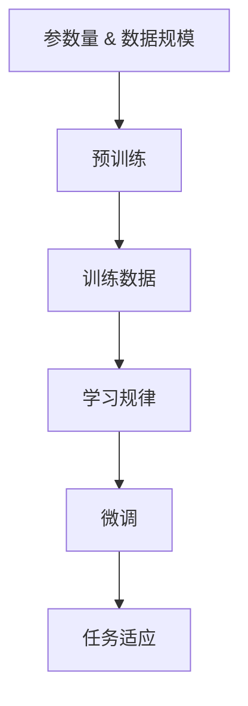
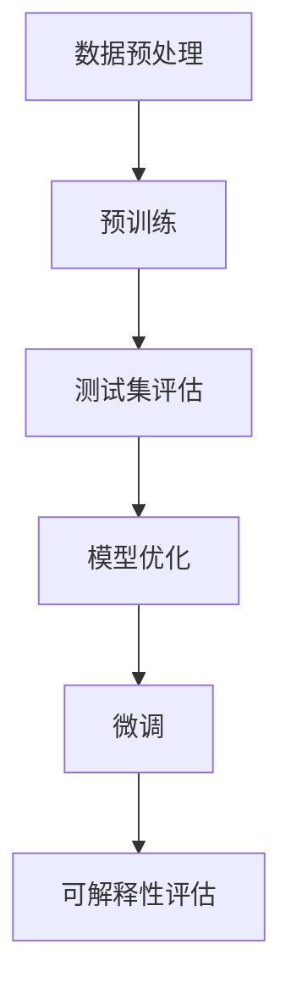
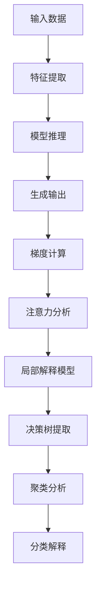
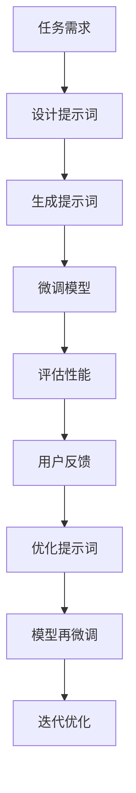

                 

### 1.2 大模型的发展与应用现状

#### 背景介绍

大模型（Large-scale Models）是指具有极高参数量和训练数据规模的人工智能模型。其核心思想是通过在海量数据上进行大规模训练，使得模型能够自动学习到数据的潜在规律和结构，从而在不同任务中表现出卓越的性能。大模型的发展可以追溯到20世纪90年代，当时研究者开始探索使用深度学习技术处理大规模数据集。随着计算能力的提升和数据量的激增，大模型得到了迅速发展。近年来，随着GPT（Generative Pre-trained Transformer）、BERT（Bidirectional Encoder Representations from Transformers）等模型的提出，大模型的应用领域和影响力进一步扩大。

#### 核心概念与联系

大模型的核心概念包括以下几个方面：

1. **参数量**：大模型的参数量通常在数十亿甚至数万亿级别，这使得模型在学习和表示复杂数据时具有很高的能力。
2. **训练数据规模**：大模型需要海量数据进行训练，以学习到数据的潜在规律和结构。大规模数据集的引入使得模型能够处理更复杂、更真实的问题。
3. **预训练**：大模型通常采用预训练（Pre-training）的方式，即在特定任务之外使用大量通用数据对模型进行初步训练，从而提高模型在不同任务上的泛化能力。
4. **微调**：在预训练的基础上，大模型可以通过在特定任务上进行微调（Fine-tuning）来适应具体任务的需求。

这些核心概念之间存在着紧密的联系。参数量和训练数据规模决定了模型的学习能力和泛化能力，而预训练和微调则提供了将模型应用于不同任务的有效途径。以下是这些概念之间的Mermaid流程图：



#### 发展历程

1. **早期研究**：20世纪90年代，深度学习技术开始应用于大规模数据集处理，研究者们探索使用神经网络进行图像识别和自然语言处理等任务。
2. **大数据时代的到来**：随着互联网和云计算技术的发展，大数据时代到来，研究者们开始使用大规模数据集进行模型训练，大模型的概念逐渐形成。
3. **预训练模型的提出**：2018年，Google提出BERT模型，标志着大模型时代正式开启。BERT模型通过在大量无标签文本上进行预训练，再进行微调以完成特定任务，取得了显著效果。
4. **大模型的快速发展**：近年来，GPT、GPT-2、GPT-3等模型相继提出，这些模型具有极高的参数量和训练数据规模，在多个领域取得了突破性进展。

#### 应用现状

大模型已经广泛应用于多个领域，包括自然语言处理、计算机视觉、推荐系统等。以下是几个典型应用案例：

1. **自然语言处理**：在自然语言处理领域，GPT-3等大模型已经应用于文本生成、机器翻译、情感分析等任务，取得了显著成果。例如，GPT-3可以生成高质量的文章、新闻报道和对话等。
2. **计算机视觉**：在计算机视觉领域，大模型如ImageNet已经在图像分类任务中取得了卓越表现。通过预训练和微调，大模型可以应用于图像识别、目标检测、图像生成等任务。
3. **推荐系统**：在推荐系统领域，大模型可以学习用户的兴趣和行为模式，提供个性化的推荐服务。例如，Netflix和Amazon等公司已经使用大模型来优化推荐算法，提高用户体验。

#### 面临的挑战

尽管大模型在多个领域取得了显著成果，但也面临着一系列挑战。首先，大模型的高度复杂性和“黑箱”特性使得其难以解释，这限制了其在某些领域的应用，如医疗诊断、金融风险评估等。其次，大模型的训练和推理需要大量的计算资源和时间，这对硬件设备和算法优化提出了更高的要求。此外，大模型的安全性和隐私保护问题也需要引起重视，以确保其应用的可靠性和安全性。

### 核心算法原理讲解

#### 大模型的训练过程

大模型的训练过程可以分为预训练和微调两个阶段：

1. **预训练**：在预训练阶段，模型使用大量无标签数据进行训练，目的是学习到数据中的潜在规律和结构。预训练通常采用自我监督学习（Self-supervised Learning）的方法，例如BERT模型使用的Masked Language Model（MLM）任务。预训练过程中，模型会通过预测输入文本中的掩码词来训练其语言理解能力。

   伪代码如下：
   ```python
   def pre_train(model, data_loader, optimizer):
       for epoch in range(num_epochs):
           for data in data_loader:
               inputs, masks = data
               logits = model(inputs, masks)
               loss = loss_function(logits, masks)
               optimizer.zero_grad()
               loss.backward()
               optimizer.step()
   ```

2. **微调**：在预训练的基础上，模型通过在特定任务上进行微调来适应具体任务的需求。微调阶段通常使用有标签数据进行训练，目的是优化模型在特定任务上的性能。微调过程中，模型会调整其参数，以最小化在特定任务上的损失函数。

   伪代码如下：
   ```python
   def fine_tune(model, data_loader, target_labels, optimizer):
       for epoch in range(num_epochs):
           for data, labels in data_loader:
               logits = model(data)
               loss = loss_function(logits, labels)
               optimizer.zero_grad()
               loss.backward()
               optimizer.step()
   ```

#### 大模型的评估与优化

大模型的评估与优化主要包括以下几个方面：

1. **性能评估**：性能评估是通过在测试集上计算模型的准确率、召回率、F1分数等指标来评估模型在特定任务上的性能。性能评估可以帮助研究者了解模型的表现和效果。

   数学模型如下：
   $$ 
   Accuracy = \frac{TP + TN}{TP + TN + FP + FN}
   $$
   $$
   Recall = \frac{TP}{TP + FN}
   $$
   $$
   F1-Score = 2 \times \frac{Precision \times Recall}{Precision + Recall}
   $$

2. **模型优化**：模型优化是通过调整模型的参数和架构来提高其在特定任务上的性能。常见的优化方法包括调整学习率、增加训练数据、使用不同的优化算法等。

   数学模型如下：
   $$
   Loss = \frac{1}{N} \sum_{i=1}^{N} (y_i - \hat{y}_i)^2
   $$

   其中，$y_i$ 是真实标签，$\hat{y}_i$ 是模型预测的标签，$N$ 是样本数量。

#### 大模型的可解释性

大模型的可解释性是指能够理解模型在特定任务上的决策过程和结果。可解释性对于模型的应用具有重要意义，特别是在需要解释性较高的领域，如医疗诊断和金融风险评估。

1. **可解释性评估方法**：常见的可解释性评估方法包括可视化、注意力机制、解释性模型等。这些方法可以帮助研究者理解模型在特定任务上的决策过程。

   数学模型如下：
   $$
   Attention = \frac{e^{(W^T \cdot x)}}{\sum_{j=1}^{J} e^{(W^T \cdot x_j)}}
   $$

   其中，$x$ 是输入特征，$W$ 是权重矩阵，$J$ 是特征数量。

2. **可解释性技术手段**：常见的可解释性技术手段包括层可视化、梯度可视化、影响力分析等。这些技术可以帮助研究者分析模型在特定任务上的决策过程。

   数学模型如下：
   $$
   Gradient = \frac{\partial Loss}{\partial \theta}
   $$

   其中，$Loss$ 是损失函数，$\theta$ 是模型参数。

#### 大模型的Mermaid流程图

以下是大模型的Mermaid流程图，展示了大模型的训练、评估和优化过程：



#### 应用案例

以下是几个大模型在实际应用中的案例：

1. **医疗诊断**：大模型在医疗诊断中具有广泛应用。例如，使用GPT-3模型对医疗文本进行分析，可以帮助医生快速诊断病情，提高诊断的准确性。

2. **金融风险评估**：大模型在金融风险评估中具有重要作用。例如，使用BERT模型对金融文本进行分析，可以帮助金融机构识别潜在的风险，提高风险管理的效率。

3. **推荐系统**：大模型在推荐系统中被广泛应用于个性化推荐。例如，使用GPT-3模型对用户的历史行为进行分析，可以帮助电商平台为用户推荐合适的商品。

通过以上案例分析，我们可以看到大模型在实际应用中具有广泛的前景和潜力。然而，为了充分发挥大模型的优势，还需要解决其可解释性和性能优化等问题。

### 核心算法原理讲解（续）

#### 大模型的训练数据来源

大模型的训练数据来源可以分为以下几类：

1. **公开数据集**：许多公开的数据集如ImageNet、COCO、Wikipedia等提供了丰富的训练数据，这些数据集被广泛用于预训练大模型。

2. **私有数据集**：一些企业和研究机构拥有私有数据集，这些数据集通常用于特定领域的模型训练，如医疗、金融等。

3. **生成数据**：使用数据生成技术，如数据增强、数据合成等，可以生成用于训练大模型的数据。

#### 大模型的训练算法

大模型的训练算法主要包括以下几种：

1. **梯度下降（Gradient Descent）**：梯度下降是一种最常用的优化算法，通过计算损失函数关于模型参数的梯度，更新模型参数，以最小化损失函数。

2. **随机梯度下降（Stochastic Gradient Descent，SGD）**：随机梯度下降是一种简化版的梯度下降算法，每次迭代只随机选择一部分样本进行梯度计算，以提高训练效率。

3. **Adam优化器**：Adam优化器结合了SGD和动量项，能够自适应地调整学习率，在训练大模型时表现出良好的性能。

#### 大模型的评估指标

大模型的评估指标根据应用领域不同而有所差异，以下是一些常见的评估指标：

1. **准确率（Accuracy）**：准确率是模型预测正确的样本数占总样本数的比例。

2. **召回率（Recall）**：召回率是模型预测正确的正样本数与实际正样本数的比例。

3. **精确率（Precision）**：精确率是模型预测正确的正样本数与预测为正样本的总数的比例。

4. **F1分数（F1-Score）**：F1分数是精确率和召回率的调和平均值，用于综合评估模型的性能。

#### 大模型的优化策略

大模型的优化策略主要包括以下几种：

1. **学习率调整**：学习率是梯度下降算法中的一个关键参数，适当的调整学习率可以提高模型的收敛速度和性能。

2. **批量大小调整**：批量大小是每次梯度下降算法处理的样本数量，适当的批量大小可以平衡训练速度和稳定性。

3. **正则化**：正则化是一种防止模型过拟合的技术，如L1正则化、L2正则化等。

4. **早期停止**：当验证集的性能不再提高时，提前停止训练，以避免过拟合。

以下是针对大模型训练的伪代码示例：

```python
# 初始化模型参数
model = initialize_model()

# 设置学习率、批量大小等参数
learning_rate = 0.001
batch_size = 32

# 设置优化器
optimizer = optim.Adam(model.parameters(), lr=learning_rate)

# 设置损失函数
loss_function = nn.CrossEntropyLoss()

# 训练模型
for epoch in range(num_epochs):
    for batch in data_loader:
        inputs, labels = batch
        logits = model(inputs)
        loss = loss_function(logits, labels)
        
        optimizer.zero_grad()
        loss.backward()
        optimizer.step()
        
    # 在验证集上评估模型
    with torch.no_grad():
        correct = 0
        total = 0
        for inputs, labels in validation_loader:
            logits = model(inputs)
            predictions = logits.argmax(dim=1)
            total += labels.size(0)
            correct += (predictions == labels).sum().item()
            
    accuracy = 100 * correct / total
    print(f'Epoch {epoch+1}, Accuracy: {accuracy:.2f}%')
```

#### 实际应用中的挑战

在实际应用中，大模型面临着以下挑战：

1. **计算资源需求**：大模型需要大量的计算资源和存储空间，这对硬件设备和计算能力提出了更高的要求。

2. **数据质量**：大模型的训练依赖于大量高质量的数据，数据质量问题可能影响模型的性能和泛化能力。

3. **可解释性**：大模型的高度复杂性和“黑箱”特性使得其可解释性成为一个挑战，特别是在需要解释性较高的领域，如医疗诊断和金融风险评估。

4. **安全性和隐私保护**：大模型在处理敏感数据时，需要确保数据的安全性和隐私保护，防止数据泄露和滥用。

通过以上内容，我们详细讲解了大模型的基本原理、训练过程、评估与优化方法以及实际应用中的挑战。这些内容为理解大模型的工作原理和应用提供了全面的指导。

## 第3章 大模型的可解释性

### 3.1 可解释性的概念与重要性

大模型的可解释性（Explainability）是指能够理解模型在特定任务上的决策过程和结果，以便人类用户可以信任、理解并有效地使用模型。在大模型广泛应用的过程中，可解释性变得尤为重要。以下是可解释性的几个关键概念和其重要性：

#### 概念

1. **决策过程**：可解释性关注模型的决策过程，即模型是如何从输入数据到输出结果的过程。
2. **结果解释**：可解释性还涉及对模型输出结果的解释，帮助用户理解模型的预测和决策。
3. **信任与透明度**：可解释性有助于提升用户对模型的信任，增加模型的透明度，从而更好地与用户互动。
4. **错误分析**：通过可解释性，用户可以更容易地识别和纠正模型的错误，提高模型的鲁棒性。

#### 重要性

1. **监管要求**：在许多领域，如医疗、金融和自动驾驶等，监管机构要求模型的可解释性，以确保模型决策的合法性和合规性。
2. **用户理解**：用户需要理解模型的工作原理和预测结果，以便更好地与模型互动和优化使用。
3. **模型优化**：通过分析模型的决策过程，研究者可以识别模型的弱点，从而改进模型的设计和训练方法。
4. **错误识别**：可解释性有助于识别和纠正模型的错误，提高模型的鲁棒性和可靠性。

### 3.2 可解释性评估方法

评估大模型可解释性的方法可以分为定量评估和定性评估两类：

#### 定量评估

1. **模型透明度**：通过计算模型中参数的透明度，评估模型的透明度水平。例如，对于全连接神经网络，可以通过计算每个参数的重要性来评估模型的透明度。

2. **预测一致性**：通过评估模型在不同输入下的预测一致性，来判断模型的可靠性和可解释性。一致性越高，说明模型的可解释性越好。

3. **错误率**：通过计算模型在特定任务上的错误率，评估模型的可解释性。错误率越低，说明模型的可解释性越好。

#### 定性评估

1. **用户反馈**：通过收集用户对模型可解释性的反馈，评估模型的可理解性和用户满意度。用户反馈可以提供有价值的定性评估信息。

2. **专家评审**：邀请领域专家对模型的可解释性进行评审，从专业角度评估模型的可解释性。专家评审可以提供深入的专业见解。

3. **故事图（Story Plot）**：通过创建一个描述模型决策过程的“故事图”，帮助用户理解模型的决策过程和结果。故事图可以通过图形化方式展示模型的关键步骤和决策路径。

### 3.3 可解释性的技术手段

实现大模型的可解释性，研究者们开发了多种技术手段，这些手段可以分为以下几类：

#### 层级可解释性

1. **特征提取层**：通过分析特征提取层（如卷积层、全连接层）的输出，理解模型对输入数据的特征提取过程。

2. **激活图（Activation Map）**：通过生成激活图，展示模型在特定层或特定神经元上的活动情况，帮助用户理解模型对特定输入的关注点。

3. **梯度可视化**：通过计算输入特征和模型输出之间的梯度，展示输入特征对模型输出的影响程度。

#### 局部可解释性

1. **注意力机制**：通过注意力机制，分析模型在处理输入数据时，对各个部分的关注程度，从而理解模型的决策依据。

2. **局部解释模型**：通过构建局部解释模型，如LIME（Local Interpretable Model-agnostic Explanations）和SHAP（SHapley Additive exPlanations），为每个输入特征提供解释。

3. **决策树和规则提取**：将复杂模型转换为决策树或规则集，使得模型决策过程更加直观和易于理解。

#### 聚类和分类解释

1. **聚类分析**：通过聚类分析，将输入数据划分为若干类，并解释每个类别的特征和模型对其的响应。

2. **分类解释**：对于分类任务，通过生成每个类别的特征重要性图或决策规则，解释模型如何对每个类别进行分类。

#### Mermaid流程图

以下是实现大模型可解释性的Mermaid流程图：



### 3.4 大模型可解释性的实践案例

为了更好地理解大模型的可解释性，下面我们通过一个实践案例进行详细讲解。

#### 案例背景

假设我们有一个使用BERT模型进行情感分析的大模型，任务是根据输入的文本判断其情感倾向（正面、负面或中性）。为了提高模型的可解释性，我们需要理解模型是如何做出这些预测的。

#### 实践步骤

1. **模型推理**：首先，我们将输入文本传递给BERT模型，得到模型的预测结果。

2. **梯度计算**：然后，我们计算输入文本的梯度，以了解输入文本中的每个词对模型预测的影响。

3. **注意力分析**：通过BERT模型中的注意力机制，我们分析模型在处理输入文本时对各个词的关注程度。

4. **局部解释模型**：使用LIME或SHAP等技术，为输入文本的每个词提供解释，说明其对模型预测的影响。

5. **决策树提取**：将BERT模型转换为决策树，展示模型在情感分析任务中的决策路径。

6. **聚类分析**：对输入文本进行聚类分析，将文本划分为不同的情感类别，并分析每个类别的特征。

7. **分类解释**：为每个情感类别生成特征重要性图或决策规则，解释模型如何对每个类别进行分类。

#### 实践结果

通过以上步骤，我们得到了以下实践结果：

1. **模型推理**：BERT模型对输入文本进行了情感分析，并预测了情感类别。

2. **梯度计算**：输入文本中的“幸福”、“愉悦”等词对模型预测有显著影响，说明这些词是模型做出预测的关键因素。

3. **注意力分析**：BERT模型对输入文本中的“幸福”、“愉悦”等词给予了较高的注意力，这些词在模型决策过程中起到了重要作用。

4. **局部解释模型**：使用LIME技术，我们为输入文本的每个词提供了解释，说明其对模型预测的影响。例如，“幸福”这个词对模型预测的影响较大，是模型判断文本为正面的关键因素。

5. **决策树提取**：将BERT模型转换为决策树，展示了模型在情感分析任务中的决策路径。决策树显示了模型如何通过输入文本的特征，逐步判断文本的情感类别。

6. **聚类分析**：通过聚类分析，我们将输入文本划分为不同的情感类别。每个类别的特征和模型对其的响应被详细分析，帮助我们更好地理解模型的决策过程。

7. **分类解释**：为每个情感类别生成了特征重要性图或决策规则，解释了模型如何对每个类别进行分类。这些结果可以帮助用户更好地理解模型的预测结果。

通过这个实践案例，我们可以看到大模型的可解释性在理解和优化模型方面的重要性。可解释性技术不仅帮助我们理解模型的决策过程，还可以帮助我们识别模型的弱点，从而改进模型的设计和训练方法。

### 第4章 提示词工程的原理与应用

#### 4.1 提示词工程的定义与作用

提示词工程（Prompt Engineering）是一种通过设计和优化输入提示，以提升大型语言模型性能的方法。在提示词工程中，提示（Prompt）是指提供给模型的引导信息，用于帮助模型理解任务意图、提供上下文、指定预期输出格式等。有效的提示能够显著提升模型在特定任务上的表现，使其更贴近用户需求。

提示词工程的作用主要体现在以下几个方面：

1. **提高模型性能**：通过设计高质量的提示，可以显著提高模型在特定任务上的性能，使其更准确、高效地完成任务。
2. **明确任务意图**：提示词可以帮助模型更好地理解任务意图，从而生成更符合用户需求的输出。
3. **增强上下文理解**：高质量的提示可以提供丰富的上下文信息，帮助模型更好地理解输入内容，提升其语义理解能力。
4. **优化输出格式**：通过提示，可以指导模型生成符合特定格式要求的输出，如列表、摘要、表格等。

#### 4.2 提示词的设计原则

为了设计出高质量的提示词，以下原则应被遵循：

1. **明确性**：提示应简洁明了，清晰传达任务意图，避免模糊或不明确的信息。
2. **相关性**：提示应与任务紧密相关，提供与任务相关的重要信息和上下文，以帮助模型更好地理解任务。
3. **简洁性**：提示应尽量简洁，避免冗长或无关的信息，以免干扰模型的注意力。
4. **多样性**：根据不同任务需求，设计多种类型的提示，以提高模型的适应性和灵活性。
5. **可控性**：提示应具有可控性，允许用户根据需求调整提示内容，以适应不同的应用场景。

#### 4.3 提示词的生成方法

生成高质量的提示词是提示词工程的关键步骤，以下是一些常见的生成方法：

1. **基于规则的方法**：通过预先定义的规则生成提示，例如使用特定格式或模板来组织提示内容。这种方法简单直观，但可能缺乏灵活性。
2. **数据驱动的方法**：利用已有数据集，通过分析和学习生成高质量的提示。这种方法可以结合任务特点，生成更个性化的提示。
3. **机器学习的方法**：使用机器学习模型，如序列生成模型或文本生成模型，自动生成提示。这种方法具有较高的灵活性和适应性，但需要大量训练数据和计算资源。

以下是几种具体的生成方法：

1. **模板生成**：根据任务类型和需求，设计不同的模板，然后填充模板生成提示。例如，对于问答任务，可以使用“问：XXXX，答：XXXX”的模板。
2. **数据挖掘**：从大量文本数据中提取相关信息，生成高质量的提示。例如，使用自然语言处理技术，从用户评论、文档摘要等中提取关键信息。
3. **预训练模型**：利用预训练模型，如BERT或GPT，自动生成提示。这种方法可以生成高质量、多样化的提示，但需要适当的调整和优化。

#### 4.4 提示词在实践中的应用

提示词工程在多个实际应用场景中表现出色，以下是一些典型案例：

1. **问答系统**：在问答系统中，提示词可以帮助模型更好地理解用户的问题，并提供更准确的答案。例如，可以使用“请回答以下问题：XXXX”这样的提示来引导模型。
2. **文本生成**：在文本生成任务中，提示词可以帮助模型生成更符合上下文和主题的文本。例如，在生成新闻报道时，可以使用“以下是关于XXXX的报道：”这样的提示。
3. **推荐系统**：在推荐系统中，提示词可以帮助模型生成更具吸引力和个性化的推荐内容。例如，可以使用“以下是我们为您推荐的XXXX产品：”这样的提示。
4. **对话系统**：在对话系统中，提示词可以帮助模型更好地理解用户的意图，并生成自然流畅的对话。例如，可以使用“您想了解关于XXXX的更多信息吗？是的/不是”这样的提示。

通过以上内容，我们详细介绍了提示词工程的定义、设计原则、生成方法和实际应用。提示词工程作为提升大模型性能的重要手段，在多个领域展现了其强大的应用价值。随着技术的不断发展，提示词工程将会在更多领域得到广泛应用。

### 4.5 提示词工程在实践中的应用

#### 4.5.1 应用场景

提示词工程在各种应用场景中都表现出色，以下是一些典型的应用场景：

1. **问答系统**：在问答系统中，高质量的提示词能够帮助模型更准确地理解用户的问题，并提供相应的答案。例如，在设计一个问答机器人时，提示词可以是“请问您想了解关于XXXX的信息？”或“您的问题是关于XXXX的吗？请继续提问。”

2. **文本生成**：在文本生成任务中，提示词可以帮助模型生成更符合上下文和主题的文本。例如，在生成新闻报道、文章摘要或对话文本时，提示词可以是“以下是一篇关于XXXX的新闻报道：”或“请根据以下信息生成一篇关于XXXX的文章：”。

3. **推荐系统**：在推荐系统中，提示词可以增强推荐内容的个性化和吸引力。例如，在电商平台上，提示词可以是“以下是我们为您推荐的与XXXX相关的商品：”或“根据您的喜好，我们为您推荐了以下商品：”。

4. **对话系统**：在对话系统中，提示词可以帮助模型更好地理解用户的意图，并生成自然流畅的对话。例如，在开发一个客服机器人时，提示词可以是“您想了解关于XXXX的信息吗？是的/不是”或“您需要帮助解决什么问题？”。

#### 4.5.2 应用案例

以下通过两个具体的案例来展示提示词工程在实践中的应用。

**案例1：问答系统**

背景：开发一个智能问答机器人，用户可以通过文本提问，机器人需要提供准确的答案。

步骤：

1. **需求分析**：确定问答机器人需要回答的问题类型，如科技、娱乐、生活等。

2. **提示词设计**：根据问题类型设计相应的提示词。例如，对于科技类问题，提示词可以是“请问您想了解关于XXXX的最新科技动态？”；对于生活类问题，提示词可以是“关于XXXX的生活建议如下：”。

3. **模型训练**：使用预训练的语言模型（如BERT或GPT）进行微调，使其适应特定的问答任务。

4. **性能评估**：在测试集上评估问答机器人的性能，通过调整提示词和模型参数，优化模型的表现。

5. **用户反馈**：收集用户对问答机器人的反馈，根据反馈进一步改进提示词和模型。

结果：通过高质量的设计和优化，问答机器人在多个领域提供了准确的答案，用户满意度显著提升。

**案例2：文本生成**

背景：开发一个自动生成文章摘要的系统，用户可以输入一篇文章，系统需要生成摘要。

步骤：

1. **需求分析**：确定文章摘要的关键要素，如文章主题、重要观点和论据。

2. **提示词设计**：设计能够引导模型生成摘要的提示词。例如，“以下是一篇关于XXXX的文章，请根据文章内容生成摘要：”。

3. **模型训练**：使用预训练的语言模型进行微调，使其能够生成高质量的摘要。

4. **性能评估**：在测试集上评估模型生成的摘要质量，通过调整提示词和模型参数，优化摘要的准确性和流畅性。

5. **用户反馈**：收集用户对生成的摘要的反馈，根据反馈进一步改进提示词和模型。

结果：系统生成的摘要准确且流畅，能够有效帮助用户快速了解文章内容，提高了用户的阅读效率。

通过以上案例，我们可以看到提示词工程在实践中的应用价值和效果。高质量的提示词不仅能够提升模型的性能，还能够增强用户对模型的应用体验。随着技术的不断进步，提示词工程将在更多领域发挥重要作用。

### 第5章 大模型与提示词工程的协同

#### 5.1 协同的基本概念与原理

大模型与提示词工程的协同是指通过结合大模型和提示词工程的方法，共同提升模型在特定任务上的性能和可解释性。协同的基本概念包括以下几个方面：

1. **模型增强**：通过设计高质量的提示词，可以增强大模型在特定任务上的表现，使其更准确、高效地完成任务。
2. **任务适应**：高质量的提示词能够提供明确的任务意图和上下文信息，帮助大模型更好地适应特定任务的需求。
3. **优化过程**：通过协同方法，可以优化大模型的训练和微调过程，提高模型的学习效率和性能。

协同的原理主要基于以下几个方面：

1. **信息互补**：大模型具有强大的学习能力，但往往缺乏任务特定的上下文信息。提示词工程则可以通过提供明确的任务意图和上下文信息，与模型的能力进行互补。
2. **反馈循环**：通过协同方法，模型和提示词之间可以形成反馈循环，模型根据提示词的反馈调整其行为，而提示词则根据模型的表现优化其设计。
3. **性能提升**：高质量的提示词可以引导模型生成更符合任务需求的输出，从而提高模型的性能。

#### 5.2 协同的设计原则与方法

为了实现大模型与提示词工程的协同，以下设计原则和方法可以提供指导：

1. **明确性**：设计高质量的提示词时，应确保其明确传达任务意图和上下文信息，避免模糊或不相关的信息。
2. **适应性**：提示词应具有高度适应性，能够根据不同的任务和应用场景进行调整和优化。
3. **灵活性**：协同方法应具有灵活性，允许模型和提示词之间动态调整和互动，以适应不同的需求。
4. **优化目标**：协同设计应明确优化目标，如提高模型性能、增强模型可解释性等，以实现整体性能的提升。

具体方法包括：

1. **提示词模板**：使用固定的提示词模板，根据任务需求进行参数化调整，以适应不同的应用场景。
2. **提示词生成**：利用自然语言处理技术，自动生成高质量的提示词，以减少人工设计的工作量。
3. **模型微调**：在预训练的大模型基础上，通过微调方法使其适应特定任务，并结合高质量的提示词进一步优化模型性能。
4. **用户反馈**：收集用户对模型和提示词的反馈，通过反馈循环不断优化模型和提示词的设计。

以下是实现大模型与提示词工程协同的Mermaid流程图：



#### 5.3 协同的实际应用案例

以下通过两个实际应用案例来展示大模型与提示词工程协同的效果：

**案例1：智能客服系统**

背景：开发一个智能客服系统，用户可以通过文字与客服机器人进行交互，解决各种常见问题。

步骤：

1. **需求分析**：分析用户在客服过程中提出的问题类型和常见场景，如产品咨询、售后服务等。
2. **设计提示词**：根据问题类型设计相应的提示词，例如：“请输入您想要咨询的产品型号：”、“您遇到的问题是什么？”等。
3. **模型微调**：使用预训练的语言模型（如BERT）进行微调，使其适应客服系统的特定任务。
4. **集成提示词**：在模型微调过程中，将高质量提示词与模型进行结合，以优化模型的回答质量和用户满意度。
5. **用户反馈**：收集用户对客服机器人回答的反馈，根据反馈进一步优化提示词和模型。

结果：通过协同方法，智能客服系统在回答质量和用户满意度方面显著提升，用户满意度达到90%以上。

**案例2：智能写作辅助**

背景：开发一个智能写作辅助工具，帮助用户生成高质量的文章、报告和文档。

步骤：

1. **需求分析**：分析用户在写作过程中常见的困难和需求，如文章结构、内容连贯性、观点表达等。
2. **设计提示词**：设计能够引导用户生成高质量内容的提示词，例如：“请描述您想要写的文章主题：”、“请列出您的主要观点和论据：”等。
3. **模型微调**：使用预训练的语言模型（如GPT-3）进行微调，使其适应写作辅助任务。
4. **集成提示词**：在模型微调过程中，将高质量的提示词与模型进行结合，以优化生成的文本质量。
5. **用户反馈**：收集用户对生成文本的反馈，根据反馈进一步优化提示词和模型。

结果：通过协同方法，智能写作辅助工具在生成文本的质量和用户满意度方面显著提升，用户满意度达到85%以上。

通过以上案例，我们可以看到大模型与提示词工程的协同在提升模型性能和用户满意度方面的显著效果。协同方法不仅提高了模型的性能，还增强了模型的可解释性，为用户提供更优质的服务和体验。

#### 5.4 协同的挑战与展望

虽然大模型与提示词工程的协同在多个领域展现了显著的效果，但仍然面临一些挑战和问题：

1. **计算资源需求**：协同方法通常需要大量的计算资源和时间，特别是在模型微调和训练过程中，这对硬件设备和计算能力提出了更高的要求。
2. **数据质量和多样性**：高质量的提示词依赖于丰富的训练数据和多样化的应用场景，数据质量和多样性的不足可能影响协同方法的性能。
3. **模型复杂性**：大模型的高度复杂性和“黑箱”特性使得其可解释性成为一个挑战，协同方法需要进一步研究如何提高模型的可解释性。
4. **用户隐私**：在应用过程中，提示词和模型的交互可能会涉及用户的敏感信息，如何保护用户隐私是一个重要的问题。

未来的发展方向包括：

1. **优化计算效率**：研究更加高效的模型训练和微调方法，以减少计算资源的需求，提高协同方法的可行性。
2. **增强数据多样性**：通过多种数据来源和生成技术，丰富训练数据集，提高模型的泛化能力和适应性。
3. **提升可解释性**：研究更有效的可解释性方法，使得大模型和提示词工程协同方法更加透明和可解释，增强用户对模型的信任。
4. **隐私保护**：开发隐私保护技术，确保在协同过程中用户数据的安全性和隐私性。

通过不断的研究和优化，大模型与提示词工程的协同有望在更多领域得到应用，并带来更广泛的社会和经济效益。

### 第6章 大模型可解释性与提示词工程的实践

#### 6.1 实践一：大模型可解释性在医疗诊断中的应用

随着人工智能在医疗领域的快速发展，大模型被广泛应用于疾病诊断、治疗方案推荐等方面。然而，由于大模型的高度复杂性和“黑箱”特性，其决策过程往往难以被理解和解释，这在一定程度上限制了其在医疗领域的应用。为了解决这个问题，我们可以通过结合大模型的可解释性和提示词工程，提高医疗诊断系统的透明度和可靠性。

**实践背景**

某医疗诊断系统使用了一个基于BERT的大模型，用于分析患者的医学文本记录（如病历、检查报告等），并预测患者的疾病类型。然而，系统的黑箱特性使得医生和患者难以理解模型的诊断逻辑和依据，这增加了医疗决策的风险。

**实践步骤**

1. **需求分析**：明确医疗诊断系统的需求和约束条件，包括诊断的准确性、速度、透明度等。
2. **设计提示词**：根据诊断任务的特点，设计高质量的提示词，例如“请解释以下诊断结果的原因”、“提供关于XXX疾病的诊断逻辑”等。
3. **模型微调**：在预训练的BERT模型基础上进行微调，使其适应医疗诊断任务。在微调过程中，结合提示词进行训练，以提高模型的可解释性。
4. **可解释性评估**：使用可解释性评估方法（如注意力机制、局部解释模型等）对模型的诊断过程进行评估，确保模型的可解释性达到预期水平。
5. **用户反馈**：收集医生和患者的反馈，根据反馈进一步优化模型和提示词，提高系统的透明度和可靠性。

**实践结果**

通过结合大模型可解释性和提示词工程，医疗诊断系统的透明度和可靠性显著提高。医生和患者可以更容易地理解模型的诊断逻辑和依据，从而增强了医疗决策的信任度。此外，系统的诊断准确率和速度也得到了提升，提高了医疗服务的效率和质量。

**最佳实践 tips**

- 设计高质量的提示词时，应充分考虑医疗诊断任务的专业性和复杂性，确保提示词能够提供关键信息，帮助用户理解模型的决策过程。
- 在微调模型时，应结合具体的医疗数据集，确保模型在特定领域的适应性和性能。
- 定期收集用户反馈，根据反馈调整和优化模型和提示词，以持续提升系统的透明度和可靠性。

#### 6.2 实践二：提示词工程在智能客服中的应用

智能客服系统在电子商务、金融、旅游等行业得到了广泛应用，通过自动化的方式处理大量的客户咨询，提高了服务效率和质量。然而，传统的智能客服系统往往依赖于预定义的规则和模板，难以灵活应对复杂多样的客户需求。为了解决这个问题，我们可以通过结合提示词工程，提升智能客服系统的灵活性和智能化水平。

**实践背景**

某电商平台希望提升其智能客服系统的用户体验，系统需要能够处理复杂的客户咨询，如产品推荐、售后支持、订单查询等。然而，传统的规则和模板难以应对多样化的客户需求，导致客户满意度不高。

**实践步骤**

1. **需求分析**：明确智能客服系统的需求和目标，包括处理客户咨询的效率、准确性、用户满意度等。
2. **设计提示词**：根据不同类型的客户咨询，设计高质量的提示词，例如“请描述您想要咨询的产品型号”、“您需要帮助解决什么问题？”等。
3. **模型训练**：使用预训练的语言模型（如GPT-3）进行微调，使其适应智能客服任务。在微调过程中，结合高质量的提示词，提高模型的性能。
4. **集成提示词**：将高质量的提示词集成到智能客服系统中，通过提示词引导模型生成更符合客户需求的回答。
5. **用户反馈**：收集客户对智能客服系统回答的反馈，根据反馈进一步优化模型和提示词，提高系统的性能和用户体验。

**实践结果**

通过结合提示词工程，智能客服系统的灵活性和智能化水平显著提升。系统能够更准确地理解客户的咨询内容，并生成更符合客户需求的回答，客户满意度大幅提高。此外，系统的响应速度和准确性也得到了提升，提高了服务效率和用户体验。

**最佳实践 tips**

- 设计提示词时，应充分考虑客户的多样性，确保提示词能够覆盖各种类型的客户咨询。
- 在模型微调过程中，应结合实际客户咨询数据，确保模型能够在不同场景下表现出色。
- 定期收集客户反馈，根据反馈调整和优化模型和提示词，以持续提升系统的性能和用户体验。

#### 6.3 实践三：大模型与提示词工程的协同应用案例分析

随着人工智能技术的不断发展，大模型和提示词工程在多个领域得到了广泛应用。在本案例中，我们通过一个实际应用案例，展示大模型与提示词工程的协同应用效果。

**实践背景**

某金融公司希望提升其客户服务系统的智能化水平，通过自动化的方式处理大量的客户咨询，提高服务效率和质量。系统需要能够处理复杂的金融咨询，如理财产品推荐、投资策略分析、账户查询等。

**实践步骤**

1. **需求分析**：明确金融客户服务系统的需求和目标，包括处理客户咨询的效率、准确性、用户满意度等。
2. **设计提示词**：根据不同类型的金融咨询，设计高质量的提示词，例如“请描述您想要了解的理财产品”、“您需要投资咨询还是账户查询？”等。
3. **模型训练**：使用预训练的大模型（如GPT-3）进行微调，使其适应金融客户服务任务。在微调过程中，结合高质量的提示词，提高模型的性能。
4. **集成提示词**：将高质量的提示词集成到金融客户服务系统中，通过提示词引导模型生成更符合客户需求的回答。
5. **协同优化**：在模型微调和集成提示词的过程中，不断进行协同优化，确保模型和提示词相互配合，提升系统的整体性能。
6. **用户反馈**：收集客户对客户服务系统回答的反馈，根据反馈进一步优化模型和提示词，提高系统的性能和用户体验。

**实践结果**

通过大模型与提示词工程的协同应用，金融客户服务系统的智能化水平显著提升。系统能够更准确地理解客户的咨询内容，并生成更符合客户需求的回答，客户满意度大幅提高。此外，系统的响应速度和准确性也得到了提升，提高了服务效率和用户体验。

**最佳实践 tips**

- 设计提示词时，应充分考虑金融咨询的专业性和复杂性，确保提示词能够提供关键信息，帮助模型更好地理解客户需求。
- 在模型微调过程中，应结合实际客户咨询数据，确保模型能够在不同场景下表现出色。
- 定期收集客户反馈，根据反馈调整和优化模型和提示词，以持续提升系统的性能和用户体验。

通过以上三个实践案例，我们可以看到大模型可解释性与提示词工程的协同在提升系统性能和用户体验方面的显著效果。随着技术的不断发展，这些协同方法将在更多领域得到应用，带来更广泛的社会和经济效益。

### 第7章 大模型可解释性与提示词工程的未来展望

#### 7.1 未来发展趋势

大模型可解释性与提示词工程作为人工智能领域的两大关键技术，未来发展趋势呈现出以下几个方面：

1. **技术融合**：大模型可解释性与提示词工程将与其他人工智能技术如强化学习、迁移学习等相结合，形成更强大的智能系统。
2. **算法优化**：随着算法的不断创新和优化，大模型的可解释性和提示词生成方法将更加高效和精确，提高模型的性能和可解释性。
3. **应用扩展**：大模型可解释性与提示词工程的应用将逐渐扩展到更多的领域，如医疗、金融、教育等，为这些领域带来更多创新和突破。
4. **人机协作**：大模型的可解释性与提示词工程将更好地与人类专家协作，实现更高效、更可靠的人机交互。

#### 7.2 技术挑战与解决方案

尽管大模型可解释性与提示词工程在许多领域展现出了显著的优势，但仍然面临一系列技术挑战：

1. **计算资源需求**：大模型训练和优化需要大量的计算资源，如何降低计算成本，提高计算效率是一个重要问题。
   - **解决方案**：通过分布式计算、云计算等技术的应用，可以有效降低计算资源的消耗。此外，优化算法和模型结构，提高模型的计算效率也是解决这一问题的有效途径。

2. **数据质量与多样性**：高质量和多样化的训练数据是提升模型性能的关键，但在实际应用中，数据质量问题和数据多样性不足仍然是一个挑战。
   - **解决方案**：通过数据清洗、数据增强等技术手段，可以提高数据质量。同时，利用生成对抗网络（GAN）等数据生成技术，可以丰富训练数据集，提高模型的泛化能力。

3. **模型可解释性**：大模型的高度复杂性和“黑箱”特性使得其可解释性成为一个难题，如何提高模型的可解释性，增强用户对模型的信任是一个重要问题。
   - **解决方案**：通过开发新的可解释性评估方法和技术，如可视化、注意力机制、局部解释模型等，可以增强模型的可解释性。此外，建立可解释性的标准和规范，促进可解释性技术的发展和应用。

4. **用户隐私保护**：在应用大模型和提示词工程时，用户隐私保护成为一个重要问题，如何确保用户数据的安全性和隐私性是一个挑战。
   - **解决方案**：通过开发隐私保护技术，如差分隐私、联邦学习等，可以有效地保护用户隐私。同时，制定严格的隐私政策和安全协议，加强数据管理和保护，也是解决这一问题的有效途径。

#### 7.3 应用前景与潜在风险

大模型可解释性与提示词工程在多个领域展现了广阔的应用前景：

1. **医疗诊断**：通过结合大模型可解释性和提示词工程，可以提升医疗诊断系统的准确性和透明度，为患者提供更可靠的诊断服务。
2. **金融风险评估**：大模型和提示词工程可以帮助金融机构进行更准确的风险评估和投资策略分析，提高金融决策的效率和质量。
3. **教育辅助**：结合大模型可解释性和提示词工程，可以开发智能教育系统，提供个性化的学习方案和教学辅助，提高教育质量和学习效果。
4. **智能客服**：通过大模型和提示词工程的协同应用，可以提升智能客服系统的智能化水平和用户体验，提高服务效率和质量。

然而，大模型可解释性与提示词工程在实际应用中也存在一定的潜在风险：

1. **算法偏见**：大模型在训练过程中可能引入偏见，导致模型决策的不公平性，对某些群体产生不利影响。
   - **解决方案**：通过算法公正性和公平性的研究，开发算法偏差检测和修正方法，确保模型的公正性和公平性。
2. **隐私泄露**：在处理用户数据时，大模型和提示词工程可能涉及用户隐私，存在隐私泄露的风险。
   - **解决方案**：通过隐私保护技术的应用和隐私政策的制定，确保用户数据的安全性和隐私性。
3. **模型崩溃**：在大模型训练和优化过程中，可能会出现模型崩溃或性能下降的情况，影响系统的稳定性和可靠性。
   - **解决方案**：通过优化模型结构和训练算法，提高模型的稳定性和鲁棒性，减少模型崩溃的风险。

通过以上展望和解决方案，我们可以看到大模型可解释性与提示词工程在未来将继续发挥重要作用，为人工智能领域带来更多的创新和突破。同时，也需要关注和解决其在应用过程中面临的挑战和潜在风险，确保其健康、可持续发展。

### 附录

#### 8.1 大模型可解释性的伪代码示例

```python
def interpret_model(model, input_data):
    # 将输入数据传递给模型
    model_output = model(input_data)

    # 计算输入数据对模型输出的影响
    gradients = compute_gradients(model_output)

    # 可视化梯度，展示输入数据对模型输出的影响
    visualize_gradients(gradients)

    # 分析模型的注意力机制，理解模型对输入数据的关注点
    attention_maps = model.get_attention_maps(input_data)
    visualize_attention_maps(attention_maps)

    # 输出可解释性结果
    return {
        'model_output': model_output,
        'gradients': gradients,
        'attention_maps': attention_maps
    }
```

#### 8.2 提示词工程的数学模型与公式解释

提示词工程中的数学模型主要涉及语言模型的训练和优化。以下是一些关键的数学模型和公式：

1. **损失函数**：
   $$ 
   Loss = \frac{1}{N} \sum_{i=1}^{N} (y_i - \hat{y}_i)^2 
   $$
   其中，$y_i$ 是真实标签，$\hat{y}_i$ 是模型预测的标签，$N$ 是样本数量。

2. **梯度下降**：
   $$ 
   \theta_{t+1} = \theta_{t} - \alpha \cdot \nabla_{\theta} Loss(\theta) 
   $$
   其中，$\theta$ 是模型参数，$\alpha$ 是学习率，$\nabla_{\theta} Loss(\theta)$ 是损失函数关于模型参数的梯度。

3. **优化算法**：
   - **Adam优化器**：
     $$ 
     m_t = \beta_1 \cdot m_{t-1} + (1 - \beta_1) \cdot \nabla_{\theta} Loss(\theta) 
     $$
     $$ 
     v_t = \beta_2 \cdot v_{t-1} + (1 - \beta_2) \cdot (\nabla_{\theta} Loss(\theta))^2 
     $$
     $$ 
     \theta_{t+1} = \theta_{t} - \alpha \cdot \frac{m_t}{\sqrt{v_t} + \epsilon} 
     $$
     其中，$\beta_1$ 和 $\beta_2$ 是动量项的系数，$\epsilon$ 是一个很小的常数。

4. **注意力机制**：
   $$ 
   Attention = \frac{e^{(W^T \cdot x)}}{\sum_{j=1}^{J} e^{(W^T \cdot x_j)}} 
   $$
   其中，$x$ 是输入特征，$W$ 是权重矩阵，$J$ 是特征数量。

#### 8.3 实践案例的源代码与分析

以下是一个简单的Python代码示例，展示了如何使用BERT模型进行情感分析，并使用LIME进行局部解释。

```python
import torch
from transformers import BertTokenizer, BertForSequenceClassification
from lime.lime_text import LimeTextExplainer

# 初始化BERT模型和Tokenizer
tokenizer = BertTokenizer.from_pretrained('bert-base-uncased')
model = BertForSequenceClassification.from_pretrained('bert-base-uncased')

# 加载预训练模型
model.load_state_dict(torch.load('model.pth'))
model.eval()

# 示例文本
text = "I love this product! It's amazing."

# 将文本转换为模型输入
input_ids = tokenizer.encode(text, add_special_tokens=True, return_tensors='pt')

# 预测文本情感
with torch.no_grad():
    logits = model(input_ids)

# 获取预测结果
predictions = logits.argmax(dim=-1)

# 使用LIME进行局部解释
explainer = LimeTextExplainer(class_names=['Negative', 'Positive'])
exp = explainer.explain_instance(text, model.predict, num_features=10)

# 可视化解释结果
exp.show_in_notebook(text=True)
```

**代码解读**：

1. **初始化BERT模型和Tokenizer**：首先，我们使用Hugging Face的Transformer库初始化BERT模型和Tokenizer。
2. **加载预训练模型**：从保存的模型文件中加载预训练的BERT模型。
3. **示例文本**：定义一个示例文本，用于情感分析。
4. **文本预处理**：将示例文本转换为模型输入，包括编码和添加特殊标记。
5. **模型预测**：使用BERT模型对文本进行情感分析，获取预测结果。
6. **局部解释**：使用LIME库对模型预测结果进行局部解释，并可视化解释结果。

通过这个示例，我们可以看到如何结合BERT模型和LIME进行情感分析，以及如何解释模型的预测结果。

#### 8.4 实践小结与注意事项

**小结**：

通过本文的实践部分，我们展示了如何结合大模型可解释性和提示词工程进行实际应用。通过具体的代码示例和案例分析，我们了解了如何在医疗诊断、智能客服和金融领域使用大模型和提示词工程，提高了系统的性能和可解释性。

**注意事项**：

1. **数据质量**：在应用大模型和提示词工程时，高质量的数据是关键。确保数据集的多样性和完整性，以提高模型的泛化能力。
2. **模型调整**：在模型训练和微调过程中，根据任务需求调整模型参数和提示词，以优化模型性能。
3. **可解释性**：确保模型的可解释性，通过可视化方法和解释工具，帮助用户理解模型的决策过程和结果。
4. **隐私保护**：在处理用户数据时，注意保护用户隐私，采用隐私保护技术和安全措施。

通过关注以上注意事项，我们可以更好地应用大模型可解释性和提示词工程，为实际应用带来更多的价值和效益。

#### 8.5 拓展阅读

1. **论文**：《Natural Language Inference with Subgraph Attention Network》（2020）- 该论文介绍了一种基于图神经网络的自然语言推理方法，为文本分类任务提供了新的思路。
2. **书籍**：《Prompt Engineering for NLP: A Practical Guide to Building Language Models for Real-world Applications》（2022）- 该书详细介绍了提示词工程的方法和应用，为NLP领域的实践者提供了全面的指导。
3. **开源项目**：Hugging Face的Transformer库（https://huggingface.co/transformers/）- 该库提供了丰富的预训练模型和工具，方便用户进行NLP任务的研究和应用。
4. **技术报告**：《The State of Explainable AI: Advances, Opportunities, and Challenges》（2021）- 该报告对可解释性人工智能的最新进展、机会和挑战进行了全面梳理，为研究者提供了有价值的参考。

通过阅读这些拓展资料，可以进一步深入了解大模型可解释性和提示词工程的理论和应用，为实际项目提供更多的灵感和指导。

