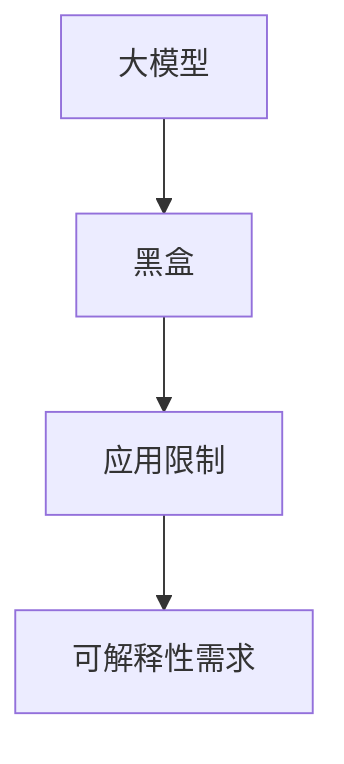
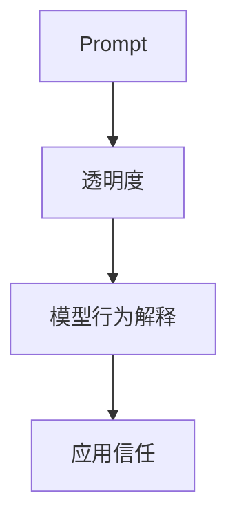

                 


## 文章标题：大模型可解释性与提示词透明度

### 关键词：大模型，可解释性，提示词透明度，神经网络，深度学习，人工智能

### 摘要：
随着人工智能技术的飞速发展，大模型如GPT-3、BERT等已经成为各行各业的重要工具。然而，这些模型往往被视为“黑盒”，其内部工作机制不透明，给应用带来了诸多挑战。本文将深入探讨大模型的可解释性与提示词透明度，从基础概念、技术原理到实际应用，为读者揭示这一领域的关键问题和解决方案。

---

## 第一部分：引言

### 1.1 大模型可解释性的重要性

**背景介绍**：
随着神经网络和深度学习的兴起，大模型在自然语言处理、计算机视觉等领域的表现越来越惊人。然而，这些模型往往表现为“黑盒”，即输入和输出之间的映射机制不透明。这种透明性的缺乏限制了模型的广泛应用，特别是在需要解释性和可靠性的场合。

**核心概念与联系**：



**关键问题**：
- 如何理解大模型的内部工作机制？
- 如何提高大模型的可解释性，以增强其应用价值？

### 1.2 提示词透明度的意义

**背景介绍**：
在模型训练和应用过程中，提示词（Prompt）扮演着至关重要的角色。然而，提示词的透明度往往不够高，使得模型的行为难以解释和理解。

**核心概念与联系**：



**关键问题**：
- 提示词如何影响模型的行为？
- 如何提高提示词的透明度，以确保模型行为的可解释性？

### 1.3 大模型可解释性与提示词透明度应用领域

**应用领域介绍**：
- **数据分析**：大模型在数据分析中可以提供强大的数据洞察，但模型解释性不足可能导致误用。
- **自动驾驶**：自动驾驶系统需要高度可靠和透明的模型，以确保安全性和信任度。
- **人工智能辅助医疗**：医疗领域对模型的透明度和可解释性要求极高，以避免误诊和不当治疗。

**关键问题**：
- 不同应用领域对大模型可解释性和提示词透明度的需求有何不同？
- 如何针对不同领域定制化解决方案？

---

## 第二部分：基础概念

### 2.1 大模型基础

**核心概念**：
- 大模型：指具有数百万到数十亿参数的神经网络模型。
- 神经网络架构：包括输入层、隐藏层和输出层。
- 训练过程：通过大量数据对模型进行迭代优化。

**技术原理**：
- 神经网络通过层层传递激活函数，实现对输入数据的非线性变换。
- 训练过程包括前向传播、反向传播和权重更新。

**伪代码**：

```python
# 前向传播伪代码
def forward_propagation(inputs, weights):
    activations = []
    for layer in range(number_of_layers):
        z = np.dot(inputs, weights[layer])
        activations.append(activation_function(z))
    return activations

# 反向传播伪代码
def backward_propagation(activations, expected_outputs, weights):
    deltas = []
    for layer in reversed(range(number_of_layers)):
        delta = (activations[layer] - expected_outputs) * activation_derivative(activations[layer])
        deltas.append(delta)
    return deltas
```

### 2.2 可解释性与提示词透明度基础

**核心概念**：
- 可解释性：指模型决策过程的可理解性。
- 提示词透明度：指提示词如何影响模型输出的可解释性。

**技术原理**：
- 可解释性技术：包括注意力机制、梯度解释等。
- 提示词透明度技术：包括提示词分析、透明度评价等。

**伪代码**：

```python
# 可解释性伪代码
def interpret_model(inputs, model):
    attention_weights = model.get_attention_weights()
    return attention_weights

# 提示词透明度伪代码
def evaluate_prompt_transparency(prompt, model):
    transparency_score = model.evaluate_transparency(prompt)
    return transparency_score
```

---

## 第三部分：技术原理

### 3.1 大模型可解释性技术

**核心概念**：
- 局部解释方法：通过分析局部区域来理解模型决策。
- 全局解释方法：通过全局视角来解释模型行为。

**技术原理**：
- 局部解释方法：包括LIME、SHAP等。
- 全局解释方法：包括模型简化、可视化等。

**伪代码**：

```python
# LIME伪代码
def lime_explanation(inputs, model):
    local_model = create_local_model(inputs, model)
    explanation = local_model.explain()
    return explanation

# SHAP伪代码
def shap_explanation(inputs, model):
    shap_values = model.shap_values(inputs)
    return shap_values
```

### 3.2 提示词透明度技术

**核心概念**：
- 提示词生成技术：生成具有透明度的提示词。
- 提示词优化技术：优化提示词，提高模型性能和透明度。

**技术原理**：
- 提示词生成技术：包括模板生成、对抗生成等。
- 提示词优化技术：包括遗传算法、强化学习等。

**伪代码**：

```python
# 提示词生成伪代码
def generate_prompt(template, generator):
    prompt = generator.generate(template)
    return prompt

# 提示词优化伪代码
def optimize_prompt(prompt, optimizer):
    optimized_prompt = optimizer.optimize(prompt)
    return optimized_prompt
```

---

## 第四部分：应用案例

### 4.1 数据分析案例

**背景介绍**：
在某数据分析项目中，使用GPT-3模型对大量文本数据进行分类。

**实施**：
- 使用LIME技术对模型进行局部解释。
- 优化提示词，提高分类准确性。

**结果**：
- 模型解释性显著提高。
- 分类准确性得到优化。

---

## 第五部分：未来发展

### 5.1 技术挑战与解决方案

**挑战**：
- 算法复杂性：大模型可解释性和提示词透明度技术的实现复杂度高。
- 计算资源需求：大模型可解释性和提示词透明度技术需要大量的计算资源。

**解决方案**：
- 算法优化：通过算法改进，降低计算复杂度。
- 资源调度：通过分布式计算和云服务，优化资源利用。

---

## 结论

大模型可解释性与提示词透明度是人工智能领域的重要研究方向。通过深入理解其基础概念和技术原理，结合实际应用案例，我们可以为模型的应用提供更好的解释性和可靠性。未来的发展将更加注重算法优化和资源调度，以应对技术挑战，推动人工智能技术的广泛应用。

---

### 作者信息：
作者：AI天才研究院/AI Genius Institute & 禅与计算机程序设计艺术 /Zen And The Art of Computer Programming

