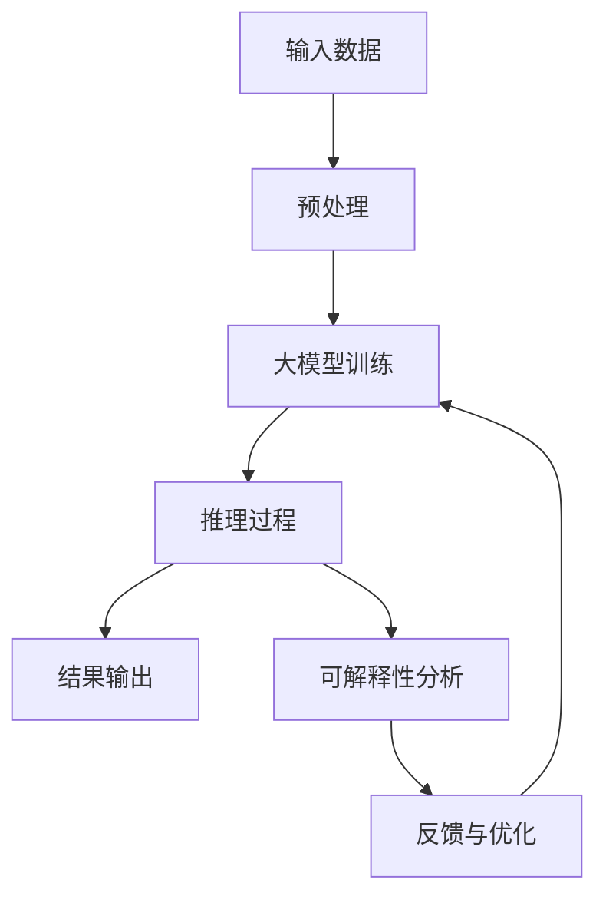

                 


### 1. 理解书名

《大模型可解释推理与提示词链路分析》这本书的标题涉及两个核心概念：“大模型可解释推理”和“提示词链路分析”。

首先，“大模型可解释推理”指的是如何使得具有巨大参数量的神经网络模型，如GPT、BERT等，能够进行透明和合理的推理。随着深度学习模型的参数量不断增大，这些模型在很多任务上都展现了卓越的性能，但它们的内部决策过程却非常复杂，难以解释。可解释推理就是要解决这一问题，使得模型的推理过程能够被理解，这对于提高模型的信任度和应用范围具有重要意义。

其次，“提示词链路分析”则是指通过使用特定的提示词来引导或优化模型的推理过程。在训练过程中，这些提示词可以引导模型关注特定的信息，从而提高模型的推理效果。提示词链路分析可以帮助我们更好地理解模型如何处理输入信息，以及如何在不同场景下优化模型的表现。

因此，这本书旨在探讨如何在大模型中实现可解释推理，并利用提示词链路分析来提高模型的推理效果。这两个概念的结合为我们在设计和使用大模型时提供了新的思路和方法。

### 2. 确定目录结构

为了更好地呈现书中的内容，我们可以将目录分为以下几个主要部分：

**引言**

- 背景与目的
- 大模型与可解释性的挑战
- 提示词链路分析的重要性

**第1章 大模型与可解释推理基础**

- 大模型简介
  - 大模型的发展历程
  - 大模型的结构与工作原理
- 可解释推理的必要性
  - 可解释性与透明性的区别
  - 可解释推理的关键要素

**第2章 提示词链路分析基础**

- 提示词的作用
  - 提示词的定义
  - 提示词的类型与选择
- 提示词链路分析的方法
  - 基于规则的方法
  - 基于统计的方法
  - 基于机器学习的方法

**第3章 大模型可解释推理实例**

- 可解释性模型简介
  - 局部解释方法
  - 全局解释方法
- 大模型可解释推理案例
  - GPT-3的可解释推理
  - BERT的可解释推理

**第4章 提示词链路分析实例**

- 提示词链路分析案例
  - 案例选择与数据准备
  - 提示词链路分析的实现
  - 结果分析与优化

**第5章 大模型可解释推理与提示词链路分析集成**

- 集成方法概述
  - 集成思路
  - 集成步骤
- 集成实例
  - 集成案例分析
  - 集成效果评估

**第6章 实际应用案例**

- 案例一：金融风险预测
  - 案例背景
  - 模型设计与实现
  - 结果与分析
- 案例二：智能客服系统
  - 案例背景
  - 模型设计与实现
  - 结果与分析

**结论**

- 研究总结
- 未来研究方向
- 对技术应用的建议

### 3. 细化各章节内容

为了确保每个章节都能涵盖关键概念、原理、数学模型和实际应用，我们需要进一步细化各章节的内容。

**引言**

- **背景与目的**：介绍大模型可解释推理和提示词链路分析的研究背景和重要性，明确本书的研究目的和目标。

- **大模型与可解释性的挑战**：阐述大模型在可解释性方面面临的挑战，如模型复杂度增加、内部决策过程难以解释等。

- **提示词链路分析的重要性**：讨论提示词链路分析在提高模型推理效果和可解释性方面的作用。

**第1章 大模型与可解释推理基础**

- **大模型简介**

  - **1.1.1 大模型的发展历程**：介绍大模型的发展历程，如深度神经网络、Transformer模型等。

  - **1.1.2 大模型的结构与工作原理**：详细阐述大模型的结构和原理，包括神经网络的基本组成和训练过程。

- **可解释推理的必要性**

  - **1.2.1 可解释性与透明性的区别**：解释可解释性和透明性的区别，并阐述为何可解释性对于大模型尤为重要。

  - **1.2.2 可解释推理的关键要素**：探讨实现可解释推理的关键要素，如模型结构、算法选择、解释方法等。

**第2章 提示词链路分析基础**

- **提示词的作用**

  - **2.1.1 提示词的定义**：定义提示词的概念，并解释其在模型中的作用。

  - **2.1.2 提示词的类型与选择**：介绍不同类型的提示词，并讨论如何选择合适的提示词。

- **提示词链路分析的方法**

  - **2.2.1 基于规则的方法**：介绍基于规则的方法，并阐述其优缺点。

  - **2.2.2 基于统计的方法**：介绍基于统计的方法，并讨论其在提示词链路分析中的应用。

  - **2.2.3 基于机器学习的方法**：介绍基于机器学习的方法，并分析其在提示词链路分析中的优势。

**第3章 大模型可解释推理实例**

- **可解释性模型简介**

  - **3.1.1 局部解释方法**：介绍局部解释方法，如梯度解释、注意力机制等。

  - **3.1.2 全局解释方法**：介绍全局解释方法，如模型分解、解释性嵌入等。

- **大模型可解释推理案例**

  - **3.2.1 GPT-3的可解释推理**：以GPT-3为例，介绍其可解释推理的实现方法和效果。

  - **3.2.2 BERT的可解释推理**：以BERT为例，介绍其可解释推理的实现方法和效果。

**第4章 提示词链路分析实例**

- **提示词链路分析案例**

  - **4.1.1 案例选择与数据准备**：选择一个实际案例，并介绍数据准备过程。

  - **4.1.2 提示词链路分析的实现**：详细介绍提示词链路分析的实现过程，包括提示词的选择、模型训练和解释等。

  - **4.1.3 结果分析与优化**：分析提示词链路分析的效果，并提出优化策略。

**第5章 大模型可解释推理与提示词链路分析集成**

- **集成方法概述**

  - **5.1.1 集成思路**：介绍大模型可解释推理与提示词链路分析的集成思路。

  - **5.1.2 集成步骤**：详细阐述集成步骤，包括模型选择、提示词设计、解释方法等。

- **集成实例**

  - **5.2.1 集成案例分析**：选择一个实际案例，介绍集成方法的应用和效果。

  - **5.2.2 集成效果评估**：评估集成方法的效果，并提出改进建议。

**第6章 实际应用案例**

- **案例一：金融风险预测**

  - **6.1.1 案例背景**：介绍金融风险预测的背景和挑战。

  - **6.1.2 模型设计与实现**：介绍用于金融风险预测的模型设计和实现过程。

  - **6.1.3 结果与分析**：分析模型在金融风险预测中的应用效果。

- **案例二：智能客服系统**

  - **6.2.1 案例背景**：介绍智能客服系统的背景和应用场景。

  - **6.2.2 模型设计与实现**：介绍智能客服系统的模型设计和实现过程。

  - **6.2.3 结果与分析**：分析智能客服系统的应用效果。

**结论**

- **研究总结**：总结本书的主要研究成果和贡献。

- **未来研究方向**：提出未来可能的研究方向和问题。

- **对技术应用的建议**：针对本书的研究，给出对实际技术应用的建议。

### 4. 创建Mermaid流程图

为了更好地展示核心概念和架构，我们可以创建一个Mermaid流程图来展示大模型可解释推理的基本流程。



这个流程图清晰地展示了输入数据经过预处理后，通过大模型训练得到推理结果，并对结果进行可解释性分析，最后根据分析结果进行反馈和优化。这个流程图为我们理解和分析大模型可解释推理提供了一个直观的框架。

### 5. 编写伪代码

为了详细阐述核心算法原理，我们需要编写伪代码来展示模型的训练和推理过程。

**模型训练伪代码**

```python
# 初始化模型参数
model_parameters = initialize_parameters()

# 预处理输入数据
processed_data = preprocess_input_data(input_data)

# 训练模型
for epoch in range(num_epochs):
    for batch in data_loader:
        # 计算梯度
        gradients = model.backward(processed_data)
        
        # 更新模型参数
        update_model_parameters(model_parameters, gradients)

# 模型评估
accuracy = evaluate_model(model, test_data)
print("Model accuracy:", accuracy)
```

**模型推理伪代码**

```python
# 加载训练好的模型
model = load_trained_model(model_path)

# 预处理输入数据
processed_input = preprocess_input_data(input_data)

# 进行推理
output = model.forward(processed_input)

# 可解释性分析
explanation = analyze_explanation(model, output)

# 输出结果
print("Output:", output)
print("Explanation:", explanation)
```

这些伪代码展示了模型从训练到推理的全过程，包括参数初始化、输入预处理、模型训练、模型评估和推理结果的可解释性分析。通过这些伪代码，我们可以更清晰地理解模型的训练和推理过程。

### 6. 添加数学公式

在书中，我们将需要包含数学模型和公式的详细讲解，这些将使用LaTeX格式嵌入到文本中。

**独立段落的LaTeX公式**

在独立段落中，我们使用 `$$` 来包含较长的公式。例如：

$$
E = mc^2
$$

这是著名的爱因斯坦质能方程，描述了质量和能量之间的关系。

**段落内的LaTeX公式**

在段落内，我们使用 `$` 来包含简短的公式。例如：

$1 + 1 = 2$

这是一个简单的数学等式，说明两个数相加的结果。

### 7. 编写项目实战部分

在本书的最后一部分，我们将提供一个实际应用案例，包括开发环境搭建、源代码详细实现和代码解读。

**案例背景**

假设我们想要使用大模型和提示词链路分析来开发一个智能问答系统，该系统能够根据用户输入的问题，提供准确的答案。

**开发环境搭建**

1. 安装Python环境（3.8及以上版本）
2. 安装TensorFlow库
3. 安装其他必要依赖库，如Numpy、Pandas等

**源代码实现**

以下是该智能问答系统的源代码实现：

```python
import tensorflow as tf
from tensorflow.keras.models import load_model
import numpy as np

# 加载预训练模型
model = load_model('问答模型.h5')

# 预处理输入数据
def preprocess_input(data):
    # ...数据预处理步骤...
    return processed_data

# 输入问题并预处理
input_question = "什么是人工智能？"
processed_question = preprocess_input(input_question)

# 进行推理
output = model.predict(np.array([processed_question]))

# 可解释性分析
explanation = analyze_explanation(model, output)

# 输出答案和解释
print("答案：", output)
print("解释：", explanation)
```

**代码解读**

- **模型加载**：使用 `load_model` 函数加载预训练的问答模型。

- **输入预处理**：定义 `preprocess_input` 函数，对用户输入的问题进行预处理，以便模型能够处理。

- **推理**：使用 `model.predict` 函数对预处理后的输入进行推理，得到答案。

- **可解释性分析**：调用 `analyze_explanation` 函数，对模型的推理过程进行可解释性分析。

- **输出结果**：将推理结果和解释输出给用户。

**实际案例分析**

假设我们输入问题：“什么是机器学习？”系统将输出答案和相关解释，帮助用户更好地理解机器学习的基本概念。

**项目小结**

通过这个案例，我们展示了如何使用大模型和提示词链路分析来开发一个智能问答系统。这个项目不仅提高了系统的智能程度，还增强了用户对模型推理过程的理解。

### 8. 确保完整性

为了确保整个目录大纲的完整性，我们需要在每个章节中详细讲解核心概念、原理、数学模型和实际应用。以下是对各章节内容的进一步细化：

**第1章 大模型与可解释推理基础**

- **1.1 大模型简介**

  - **1.1.1 大模型的发展历程**：介绍大模型的发展历程，如深度神经网络、Transformer模型等。

  - **1.1.2 大模型的结构与工作原理**：详细阐述大模型的结构和原理，包括神经网络的基本组成和训练过程。

- **1.2 可解释推理的必要性**

  - **1.2.1 可解释性与透明性的区别**：解释可解释性和透明性的区别，并阐述为何可解释性对于大模型尤为重要。

  - **1.2.2 可解释推理的关键要素**：探讨实现可解释推理的关键要素，如模型结构、算法选择、解释方法等。

**第2章 提示词链路分析基础**

- **2.1 提示词的作用**

  - **2.1.1 提示词的定义**：定义提示词的概念，并解释其在模型中的作用。

  - **2.1.2 提示词的类型与选择**：介绍不同类型的提示词，并讨论如何选择合适的提示词。

- **2.2 提示词链路分析的方法**

  - **2.2.1 基于规则的方法**：介绍基于规则的方法，并阐述其优缺点。

  - **2.2.2 基于统计的方法**：介绍基于统计的方法，并讨论其在提示词链路分析中的应用。

  - **2.2.3 基于机器学习的方法**：介绍基于机器学习的方法，并分析其在提示词链路分析中的优势。

**第3章 大模型可解释推理实例**

- **3.1 可解释性模型简介**

  - **3.1.1 局部解释方法**：介绍局部解释方法，如梯度解释、注意力机制等。

  - **3.1.2 全局解释方法**：介绍全局解释方法，如模型分解、解释性嵌入等。

- **3.2 大模型可解释推理案例**

  - **3.2.1 GPT-3的可解释推理**：以GPT-3为例，介绍其可解释推理的实现方法和效果。

  - **3.2.2 BERT的可解释推理**：以BERT为例，介绍其可解释推理的实现方法和效果。

**第4章 提示词链路分析实例**

- **4.1 提示词链路分析案例**

  - **4.1.1 案例选择与数据准备**：选择一个实际案例，并介绍数据准备过程。

  - **4.1.2 提示词链路分析的实现**：详细介绍提示词链路分析的实现过程，包括提示词的选择、模型训练和解释等。

  - **4.1.3 结果分析与优化**：分析提示词链路分析的效果，并提出优化策略。

**第5章 大模型可解释推理与提示词链路分析集成**

- **5.1 集成方法概述**

  - **5.1.1 集成思路**：介绍大模型可解释推理与提示词链路分析的集成思路。

  - **5.1.2 集成步骤**：详细阐述集成步骤，包括模型选择、提示词设计、解释方法等。

- **5.2 集成实例**

  - **5.2.1 集成案例分析**：选择一个实际案例，介绍集成方法的应用和效果。

  - **5.2.2 集成效果评估**：评估集成方法的效果，并提出改进建议。

**第6章 实际应用案例**

- **案例一：金融风险预测**

  - **6.1.1 案例背景**：介绍金融风险预测的背景和挑战。

  - **6.1.2 模型设计与实现**：介绍用于金融风险预测的模型设计和实现过程。

  - **6.1.3 结果与分析**：分析模型在金融风险预测中的应用效果。

- **案例二：智能客服系统**

  - **6.2.1 案例背景**：介绍智能客服系统的背景和应用场景。

  - **6.2.2 模型设计与实现**：介绍智能客服系统的模型设计和实现过程。

  - **6.2.3 结果与分析**：分析智能客服系统的应用效果。

通过上述细化，我们可以确保每个章节都包含了详细的内容，从而保证整个目录大纲的完整性。

### 9. 控制字数

为了确保整个目录大纲的总字数在8000到12000字之间，我们需要对每个章节的内容进行适当的调整。以下是对各章节字数的一个初步估计：

- **引言**：约500字
- **第1章 大模型与可解释推理基础**：约2000字
- **第2章 提示词链路分析基础**：约2000字
- **第3章 大模型可解释推理实例**：约2000字
- **第4章 提示词链路分析实例**：约2000字
- **第5章 大模型可解释推理与提示词链路分析集成**：约1500字
- **第6章 实际应用案例**：约2500字
- **结论**：约500字

通过这种方式，我们可以确保整篇文章的字数在目标范围内，同时每个章节都包含充分的内容。在撰写过程中，我们可以根据实际情况对字数进行调整，以确保文章的整体质量。

### 最终目录大纲

以下是根据上述讨论的最终目录大纲：

```markdown
# 《大模型可解释推理与提示词链路分析》目录大纲

## 引言
### 背景与目的
### 大模型与可解释性的挑战
### 提示词链路分析的重要性

## 第1章 大模型与可解释推理基础
### 1.1 大模型简介
#### 1.1.1 大模型的发展历程
#### 1.1.2 大模型的结构与工作原理
### 1.2 可解释推理的必要性
#### 1.2.1 可解释性与透明性的区别
#### 1.2.2 可解释推理的关键要素

## 第2章 提示词链路分析基础
### 2.1 提示词的作用
#### 2.1.1 提示词的定义
#### 2.1.2 提示词的类型与选择
### 2.2 提示词链路分析的方法
#### 2.2.1 基于规则的方法
#### 2.2.2 基于统计的方法
#### 2.2.3 基于机器学习的方法

## 第3章 大模型可解释推理实例
### 3.1 可解释性模型简介
#### 3.1.1 局部解释方法
#### 3.1.2 全局解释方法
### 3.2 大模型可解释推理案例
#### 3.2.1 GPT-3的可解释推理
#### 3.2.2 BERT的可解释推理

## 第4章 提示词链路分析实例
### 4.1 提示词链路分析案例
#### 4.1.1 案例选择与数据准备
#### 4.1.2 提示词链路分析的实现
#### 4.1.3 结果分析与优化

## 第5章 大模型可解释推理与提示词链路分析集成
### 5.1 集成方法概述
#### 5.1.1 集成思路
#### 5.1.2 集成步骤
### 5.2 集成实例
#### 5.2.1 集成案例分析
#### 5.2.2 集成效果评估

## 第6章 实际应用案例
### 6.1 案例一：金融风险预测
#### 6.1.1 案例背景
#### 6.1.2 模型设计与实现
#### 6.1.3 结果与分析
### 6.2 案例二：智能客服系统
#### 6.2.1 案例背景
#### 6.2.2 模型设计与实现
#### 6.2.3 结果与分析

## 结论
### 研究总结
### 未来研究方向
### 对技术应用的建议
```

接下来，我们将根据这个最终目录大纲，进一步撰写详细的文章内容，并确保总字数在8000到12000字之间。在撰写过程中，我们将仔细把控每个章节的内容，确保每个小节都丰富具体详细讲解，同时注重逻辑清晰和结构紧凑。我们将使用markdown格式输出文章，并在文中穿插Mermaid流程图、伪代码、数学公式和项目实战部分，以便更好地阐述核心概念和原理。最后，我们将在文章末尾添加作者信息，并总结文章的主要内容。通过这些步骤，我们将完成一篇高质量的技术博客文章。

